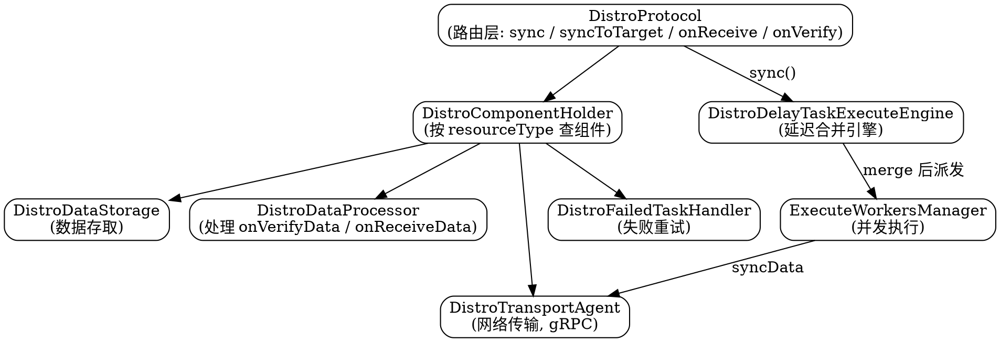

# Nacos Distro Protocol Source Deep Dive

## Introduction

Distro 是 Nacos 自研的 **AP 分布式一致性协议**，专为**临时实例（ephemeral instance）**设计：数据存内存、启动时全量拉取、定期校验补全，保证部分节点宕机后整个临时实例系统仍可工作。它是 Nacos「命名默认 AP」的基石——etcd / ZooKeeper 没有 AP 分支，全程 Raft/Zab；Nacos 把 AP 收敛在命名侧的临时实例，CP 交给 JRaft（见 [JRaft](/docs/CS/Framework/nacos/jraft.md) 与 [一致性抽象层](/docs/CS/Framework/nacos/consistency.md)）。

事件驱动层代码（`DistroClientDataProcessor.onEvent`、`syncToAllServer` 等）见 [Registry](/docs/CS/Framework/nacos/registry.md) 的 `## Distro`；本文聚焦**协议本身的架构与算法**：责任分片、双层任务引擎、延迟合并、定时校验、全量加载与失败重试。

## Protocol Positioning: Optimization of Gossip

Distro 常被类比 Gossip，但关键差异在「谁说话」：

- **Gossip**：每个节点把变更广播给所有人，消息冗余高。
- **Distro**：每个节点只负责自己那一片数据，变更后**只通知其他节点这一片的新状态**，把消息量降约一个数量级。

设计三原则（[Registry](/docs/CS/Framework/nacos/registry.md) 已引设计思想）：

1. 节点平等，每个节点只负责一部分数据的**写**；写请求若打到非责任节点，集群内路由转发给责任节点。
2. 定时把本机负责数据的校验值发给其他节点，维持最终一致。
3. 每个节点独立处理**读**，直接从本地内存返回——这是 AP 读高可用的来源。

## Three-Layer Architecture

Distro 源码分 `core` 与 `naming` 两模块。core 模块定义 `DistroProtocol`，它自身**不存数据、不发请求**，只是路由层：



启动期由 `DistroClientComponentRegistry` 通过 SPI 把四个组件注册进 `DistroComponentHolder`：

```java
@Component
public class DistroClientComponentRegistry {
  @PostConstruct
  public void doRegister() {
    DistroClientDataProcessor dataProcessor = new DistroClientDataProcessor(clientManager, distroProtocol);
    DistroClientTransportAgent transportAgent = new DistroClientTransportAgent(clusterRpcClientProxy, serverMemberManager);
    DistroClientTaskFailedHandler taskFailedHandler = new DistroClientTaskFailedHandler(taskEngineHolder);
    componentHolder.registerDataStorage(DistroClientDataProcessor.TYPE, dataProcessor);
    componentHolder.registerDataProcessor(dataProcessor);
    componentHolder.registerTransportAgent(DistroClientDataProcessor.TYPE, transportAgent);
    componentHolder.registerFailedTaskHandler(DistroClientDataProcessor.TYPE, taskFailedHandler);
  }
}
```

这种「协议与业务数据解耦」的组件化设计，让 config 等其它模块也能注册自己的 processor 复用同一框架（见 [一致性抽象层](/docs/CS/Framework/nacos/consistency.md)）。

## Two-Layer Task Engine and Two-Phase Delayed Merge

Distro 同步最精巧的是**两阶段任务模型**，避免「来一个变更发一个包」的惊群。

### Phase 1: Delayed Merge (DistroDelayTaskExecuteEngine)

`DistroProtocol.sync()` 被调用时**不立即发网络请求**，而是构造 `DistroDelayTask` 投入 `DistroDelayTaskExecuteEngine` 的延迟队列。同一 `DistroKey` 在窗口内的多次变更会被 `merge()` 合并，仅保留最新 action 与创建时间：

```java
// DistroDelayTask
@Override
public void merge(AbstractDelayTask task) {
    DistroDelayTask oldTask = (DistroDelayTask) task;
    // 同一 key 的多次变更，窗口内合并为最新一次
    if (!action.equals(oldTask.getAction()) && createTime > oldTask.getCreateTime()) {
        // 保留较新 action
    }
    this.action = oldTask.getAction();
    this.createTime = oldTask.getCreateTime();
}
```

合并窗口由 `nacos.core.protocol.distro.data.sync.delayMs` 控制，**默认 1000 ms**——即同 key 的变更在 1 秒内合并成一次同步。

### Phase 2: Concurrent Execution (ExecuteWorkersManager)

延迟窗口到达后，`DistroDelayTaskProcessor` 把任务转成 `DistroSyncChangeTask` / `DistroSyncDeleteTask`，交 `ExecuteWorkersManager` 的线程池并发执行，最终由 `TransportAgent.syncData()` 经 gRPC 发给目标节点：

```java
public class DistroSyncChangeTask extends AbstractDistroExecuteTask {
  @Override
  protected boolean doExecute() {
    String type = getDistroKey().getResourceType();
    DistroData distroData = getDistroData(type);
    return getDistroComponentHolder().findTransportAgent(type)
        .syncData(distroData, getDistroKey().getTargetServer());
  }
}
```

### 1.x → 3.x Evolution

- **1.x**：合并阈值是「1000 条变更」或「距上次发送超 2s」二者之一触发，偏批量。
- **3.x**：改为统一的 **1000 ms 延迟窗口**，无论变更条数，延迟可控、感知更平稳。

## Responsibility Sharding

每个 client 有且仅有一个**责任节点**（写源），由 `DistroMapper` 基于 key 的一致性哈希计算：

- `DistroMapper.responsible(String key)`：本节点是否负责该 key；是则本地处理，否则前置 Filter 把请求**转发（proxy）**给责任节点。
- 写操作单一入口，是最终一致性的基础——避免两个节点同时写同一 client 导致冲突。
- 3.x 的 Client 模型按 `clientId` 分片；1.x 按 Service Name + Cluster Name 分片。

> [!NOTE]
> 责任分片 ≠ 读写分片。读请求任意节点都从本地内存直接返回（全量数据每节点都有）；只有**写**被约束到责任节点。

## Periodic Verification and Self-Healing

`DistroVerifyTimedTask` 每 **5000 ms**（`nacos.core.protocol.distro.verify.interval`）运行一次：收集本节点负责的所有 client 的 `clientId + revision`，向其它节点发 verify 请求比对版本。版本一致则过；不一致则发布 `ClientVerifyFailedEvent`：

```java
// DistroProtocol.onVerify -> DistroClientDataProcessor.processVerifyData
public boolean processVerifyData(DistroData distroData, String sourceAddress) {
    DistroClientVerifyInfo verifyData = serializer.deserialize(distroData.getContent(), DistroClientVerifyInfo.class);
    if (clientManager.verifyClient(verifyData.getClientId())) {
        return true;   // 本地有该 client，校验通过
    }
    return false;      // 本地缺失，触发对端补 sync
}
```

校验失败时回调直接**零延迟补 sync**，把缺口补齐：

```java
private void syncToVerifyFailedServer(ClientEvent.ClientVerifyFailedEvent event) {
    distroProtocol.syncToTarget(distroKey, DataOperation.ADD, event.getTargetServer(), 0L);
}
```

这就是 Distro 的「自愈」：网络抖动导致某节点短暂落后，恢复后 5s 内被校验发现并补齐。

## New Node Full Load

新 Nacos 节点启动时内存为空，跑 `DistroLoadDataTask`：先启动定时校验，再向已有节点拉全量快照 `transportAgent.getDatumSnapshot()`，交给 processor 灌入本地存储并标记 `initialized`。加载失败按 `loadDataRetryDelay`（默认 **30 s**）重试。

加载完成后，每台机器都持有集群内全部临时实例数据——这正是「读本地即全量」的前提。

## Failure Retry

同步失败不抛异常、不指数退避，而是固定延迟重投：`DistroClientTaskFailedHandler.retry()` 用 `SyncRetryDelayMillis`（默认 **3000 ms**）构造新的 `DistroDelayTask` 重新入队。固定延迟比指数退避更利于「短暂网络抖动后快速追平」，符合 AP 场景对时效的偏好。

## Distro vs Gossip / etcd

| 维度 | Distro（Nacos AP） | Gossip | etcd-raft（CP） |
| :-- | :-- | :-- | :-- |
| 一致性 | 最终一致 | 最终一致 | 强一致（线性一致读） |
| 消息模型 | 责任分片，只通知本片 | 全网广播 | Leader 定序，多数派复制 |
| 读路径 | 任意节点本地内存 | 任意节点 | Leader 或 ReadIndex |
| 分区行为 | 各节点独立响应 | 各节点独立响应 | 少数派不可用 |
| 设计目标 | 注册中心高可用 | 成员发现 | 通用协调底座 |

## Links

- [Nacos](/docs/CS/Framework/nacos/Nacos.md)
- [Registry（Distro 事件驱动层）](/docs/CS/Framework/nacos/registry.md)
- [JRaft（CP 共识）](/docs/CS/Framework/nacos/jraft.md)
- [一致性抽象层](/docs/CS/Framework/nacos/consistency.md)
- [etcd 横向对照](/docs/CS/Framework/etcd/compare.md)

## References

- <https://www.besthub.dev/articles/dissecting-nacos-3-x-distro-protocol-the-distributed-design-behind-the-1000-ms-delay-8bb4be2f4767>
- <https://blog.csdn.net/weixin_34297704/article/details/88765079>
- <https://nacos.io/docs/v3.0/manual/admin/cluster/>
