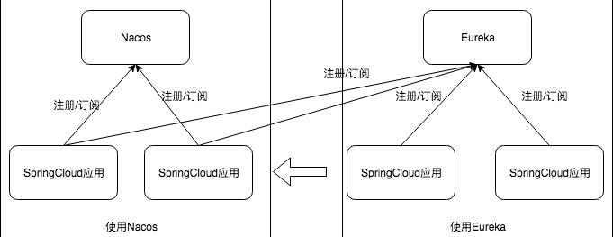

## Introduction


### 数据模型

在 Nacos 中， 服务的定义包括以下几个内容：
- 命名空间（Namespace） ： Nacos 数据模型中最顶层、 也是包含范围最广的概念， 用于在类似环境或租户等需要强制隔离的场景中定义。 Nacos 的服务也需要使用命名空间来进行隔离。
- 分组（Group） ： Nacos 数据模型中次于命名空间的⼀种隔离概念， 区别于命名空间的强制隔离属性， 
  分组属于⼀个弱隔离概念， 主要用于逻辑区分⼀些服务使用场景或不同应用的同名服务， 最常用的情况主要是同⼀个服务的测试分组和生产分组、 或者将应用名作为分组以防止不同应用 提供的服务重名。
- 服务名（Name） ： 该服务实际的名字，⼀般用于描述该服务提供了某种功能或能力

之所以 Nacos 将服务的定义拆分为命名空间、 分组和服务名， 除了方便隔离使用场景外， 还有方便用户发现唯⼀服务的优点。 
在注册中心的实际使用场景上， 同个公司的不同开发者可能会开发出类似作用的服务， 如果仅仅使用服务名来做服务的定义和表示， 容易在⼀些通用服务上出现冲突， 比如登陆服务等。

通常推荐使用由运行环境作为命名空间、 应用名作为分组和服务功能作为服务名的组合来确保该服务的天然唯⼀性， 
当然使用者可以忽略命名空间和分组， 仅使用服务名作为服务唯⼀标示， 这就需要使用者在定义服务名时额外增加自己的规则来确保在使用中能够唯⼀定位到该服务而不会发现到错误的服务上。

服务元数据

服务的定义只是为服务设置了⼀些基本的信息， 用于描述服务以及方便快速的找到服务， 而服务的
元数据是进⼀步定义了 Nacos 中服务的细节属性和描述信息。 主要包含：
- 健康保护阈值（ProtectThreshold） ： 为了防止因过多实例故障， 导致所有流量全部流入剩余实例， 继而造成流量压力将剩余实例被压垮形成的雪崩效应。 应将健康保护阈值定义为⼀个 0 到 1之间的浮点数。 当域名健康实例数占总服务实例数的比例小于该值时， 无论实例是否健康， 都会将这个实例返回给客户端。 这样做虽然损失了⼀部分流量， 但是保证了集群中剩余健康实例能正常工作。
- 实例选择器（Selector） ： 用于在获取服务下的实例列表时， 过滤和筛选实例。 该选择器也被称为路由器， 目前 Nacos 支持通过将实例的部分信息存储在外部元数据管理 CMDB 中， 并在发现服务时使用 CMDB 中存储的元数据标签来进行筛选的能力。
- 拓展数据(extendData)： 用于用户在注册实例时自定义扩展的元数据内容， 形式为 K-V 。 可以在服务中拓展服务的元数据信息， 方便用户实现自己的自定义逻辑

## Client Registry


<!-- tabs:start -->

##### **Dubbo**

```java

```


##### **Spring Boot**


Spring Cloud的AbstractAutoServiceRegistration 的onApplicationEvent 在start 方法里调用子类实现的[register](/docs/CS/Framework/Spring_Cloud/Spring_Cloud.md?id=AbstractAutoServiceRegistration)函数


Nacos实现子类NacosAutoServiceRegistration


```java
@Configuration(proxyBeanMethods = false)
@EnableConfigurationProperties
@ConditionalOnNacosDiscoveryEnabled
@ConditionalOnProperty(
        value = {"spring.cloud.service-registry.auto-registration.enabled"},
        matchIfMissing = true
)
@AutoConfigureAfter({AutoServiceRegistrationConfiguration.class, AutoServiceRegistrationAutoConfiguration.class, NacosDiscoveryAutoConfiguration.class})
public class NacosServiceRegistryAutoConfiguration {
    
}
```

createNamingService

```java
public class NacosServiceRegistry implements ServiceRegistry<Registration> {
    @Override
    public void register(Registration registration) {
        NamingService namingService = namingService();
        String serviceId = registration.getServiceId();
        String group = nacosDiscoveryProperties.getGroup();

        Instance instance = getNacosInstanceFromRegistration(registration);

        try {
            namingService.registerInstance(serviceId, group, instance);
        } catch (Exception e) {
           // log
        }
    }
}
```


<!-- tabs:end -->

### NamingService


创建namingService时会创建clientProxy 包括grpc和Http 大多数情况下都是使用临时实例 即使用grpc client
1. NamingHttpClientProxy
2. NamingGrpcClientProxy


```java
public class NacosNamingService implements NamingService {
    public NacosNamingService(Properties properties) throws NacosException {
        init(properties);
    }

    private void init(Properties properties) throws NacosException {
        ValidatorUtils.checkInitParam(properties);
        this.namespace = InitUtils.initNamespaceForNaming(properties);
        InitUtils.initSerialization();
        InitUtils.initWebRootContext(properties);
        initLogName(properties);

        this.changeNotifier = new InstancesChangeNotifier();
        NotifyCenter.registerToPublisher(InstancesChangeEvent.class, 16384);
        NotifyCenter.registerSubscriber(changeNotifier);
        this.serviceInfoHolder = new ServiceInfoHolder(namespace, properties);
        this.clientProxy = new NamingClientProxyDelegate(this.namespace, serviceInfoHolder, properties, changeNotifier);
    }
}
```


Nacos 作为注册中心，用来接收客户端（服务实例）发起的注册请求，并将注册信息存放到注册中心进行管理

临时实例使用grpc
```java
public interface NamingClientProxy extends Closeable {
  void registerService(String serviceName, String groupName, Instance instance) throws NacosException;
    
}

public class NamingClientProxyDelegate implements NamingClientProxy {
    private NamingClientProxy getExecuteClientProxy(Instance instance) {
        if (instance.isEphemeral() || grpcClientProxy.isAbilitySupportedByServer(AbilityKey.SERVER_SUPPORT_PERSISTENT_INSTANCE_BY_GRPC)) {
            return grpcClientProxy;
        }
        return httpClientProxy;
    }
}
```


### grpc


```java
@Override
public void registerService(String serviceName, String groupName, Instance instance) throws NacosException {
  NAMING_LOGGER.info("[REGISTER-SERVICE] {} registering service {} with instance {}", namespaceId, serviceName,
          instance);
  redoService.cacheInstanceForRedo(serviceName, groupName, instance);
  doRegisterService(serviceName, groupName, instance);
}
```
临时服务实例就是我们默认使用的 Nacos 注册中心模式，客户端注册后，客户端需要定时上报心跳信息来进行服务实例续约。这个在注册的时候，可以通过传参设置是否是临时实例。

持久化服务实例就是不需要上报心跳信息的，不会被自动摘除，除非手动移除实例，如果实例宕机了，Nacos 只会将这个客户端标记为不健康。

Ephemeral

```java
private void registerServiceForEphemeral(String serviceName, String groupName, Instance instance)
            throws NacosException {
        redoService.cacheInstanceForRedo(serviceName, groupName, instance);
        doRegisterService(serviceName, groupName, instance);
    }
    
public void doRegisterService(String serviceName, String groupName, Instance instance) throws NacosException {
        InstanceRequest request = new InstanceRequest(namespaceId, serviceName, groupName,
                NamingRemoteConstants.REGISTER_INSTANCE, instance);
        requestToServer(request, Response.class);
  			// Instance register successfully, mark registered status as true.
        redoService.instanceRegistered(serviceName, groupName);
    }
```

Persistent


```java
public void doRegisterServiceForPersistent(String serviceName, String groupName, Instance instance)
            throws NacosException {
        PersistentInstanceRequest request = new PersistentInstanceRequest(namespaceId, serviceName, groupName,
                NamingRemoteConstants.REGISTER_INSTANCE, instance);
        requestToServer(request, Response.class);
    }


 private <T extends Response> T requestToServer(AbstractNamingRequest request, Class<T> responseClass)
            throws NacosException {
        Response response = null;
        try {
            request.putAllHeader(
                    getSecurityHeaders(request.getNamespace(), request.getGroupName(), request.getServiceName()));
            response = requestTimeout < 0 ? rpcClient.request(request) : rpcClient.request(request, requestTimeout);
            if (ResponseCode.SUCCESS.getCode() != response.getResultCode()) {
                throw new NacosException(response.getErrorCode(), response.getMessage());
            }
            if (responseClass.isAssignableFrom(response.getClass())) {
                return (T) response;
            }
            throw new NacosException(NacosException.SERVER_ERROR, "Server return invalid response");
        } catch (NacosException e) {
            recordRequestFailedMetrics(request, e, response);
            throw e;
        } catch (Exception e) {
            recordRequestFailedMetrics(request, e, response);
            throw new NacosException(NacosException.SERVER_ERROR, "Request nacos server failed: ", e);
        }
    }
```


#### RPC client

```java
public Response request(Request request, long timeoutMills) throws NacosException {
        int retryTimes = 0;
        Response response;
        Exception exceptionThrow = null;
        long start = System.currentTimeMillis();
        while (retryTimes < RETRY_TIMES && System.currentTimeMillis() < timeoutMills + start) {
            boolean waitReconnect = false;
            try {
                if (this.currentConnection == null || !isRunning()) {
                    waitReconnect = true;
                    throw new NacosException(NacosException.CLIENT_DISCONNECT,
                            "Client not connected, current status:" + rpcClientStatus.get());
                }
                response = this.currentConnection.request(request, timeoutMills);
                if (response == null) {
                    throw new NacosException(SERVER_ERROR, "Unknown Exception.");
                }
                if (response instanceof ErrorResponse) {
                    if (response.getErrorCode() == NacosException.UN_REGISTER) {
                        synchronized (this) {
                            waitReconnect = true;
                            if (rpcClientStatus.compareAndSet(RpcClientStatus.RUNNING, RpcClientStatus.UNHEALTHY)) {
                                LoggerUtils.printIfErrorEnabled(LOGGER,
                                        "Connection is unregistered, switch server, connectionId = {}, request = {}",
                                        currentConnection.getConnectionId(), request.getClass().getSimpleName());
                                switchServerAsync();
                            }
                        }
                        
                    }
                    throw new NacosException(response.getErrorCode(), response.getMessage());
                }
                // return response.
                lastActiveTimeStamp = System.currentTimeMillis();
                return response;
                
            } catch (Exception e) {
                if (waitReconnect) {
                    try {
                        // wait client to reconnect.
                        Thread.sleep(Math.min(100, timeoutMills / 3));
                    } catch (Exception exception) {
                        // Do nothing.
                    }
                }
                
                LoggerUtils.printIfErrorEnabled(LOGGER, "Send request fail, request = {}, retryTimes = {}, errorMessage = {}",
                        request, retryTimes, e.getMessage());
                
                exceptionThrow = e;
                
            }
            retryTimes++;
            
        }
        
        if (rpcClientStatus.compareAndSet(RpcClientStatus.RUNNING, RpcClientStatus.UNHEALTHY)) {
            switchServerAsyncOnRequestFail();
        }
        
        if (exceptionThrow != null) {
            throw (exceptionThrow instanceof NacosException) ? (NacosException) exceptionThrow
                    : new NacosException(SERVER_ERROR, exceptionThrow);
        } else {
            throw new NacosException(SERVER_ERROR, "Request fail, unknown Error");
        }
    }
```


```java
public final void start() throws NacosException {
        
        boolean success = rpcClientStatus.compareAndSet(RpcClientStatus.INITIALIZED, RpcClientStatus.STARTING);
        if (!success) {
            return;
        }
        
        clientEventExecutor = new ScheduledThreadPoolExecutor(2,
                new NameThreadFactory("com.alibaba.nacos.client.remote.worker"));
        
        // connection event consumer.
        clientEventExecutor.submit(() -> {
            while (!clientEventExecutor.isTerminated() && !clientEventExecutor.isShutdown()) {
                ConnectionEvent take;
                try {
                    take = eventLinkedBlockingQueue.take();
                    if (take.isConnected()) {
                        notifyConnected(take.connection);
                    } else if (take.isDisConnected()) {
                        notifyDisConnected(take.connection);
                    }
                } catch (Throwable e) {
                    // Do nothing
                }
            }
        });
        
        clientEventExecutor.submit(() -> {
            while (true) {
                try {
                    if (isShutdown()) {
                        break;
                    }
                    ReconnectContext reconnectContext = reconnectionSignal
                            .poll(rpcClientConfig.connectionKeepAlive(), TimeUnit.MILLISECONDS);
                    if (reconnectContext == null) {
                        // check alive time.
                        if (System.currentTimeMillis() - lastActiveTimeStamp >= rpcClientConfig.connectionKeepAlive()) {
                            boolean isHealthy = healthCheck();
                            if (!isHealthy) {
                                if (currentConnection == null) {
                                    continue;
                                }
                                LoggerUtils.printIfInfoEnabled(LOGGER,
                                        "[{}] Server healthy check fail, currentConnection = {}",
                                        rpcClientConfig.name(), currentConnection.getConnectionId());
                                
                                RpcClientStatus rpcClientStatus = RpcClient.this.rpcClientStatus.get();
                                if (RpcClientStatus.SHUTDOWN.equals(rpcClientStatus)) {
                                    break;
                                }
                                
                                boolean statusFLowSuccess = RpcClient.this.rpcClientStatus
                                        .compareAndSet(rpcClientStatus, RpcClientStatus.UNHEALTHY);
                                if (statusFLowSuccess) {
                                    reconnectContext = new ReconnectContext(null, false);
                                } else {
                                    continue;
                                }
                                
                            } else {
                                lastActiveTimeStamp = System.currentTimeMillis();
                                continue;
                            }
                        } else {
                            continue;
                        }
                        
                    }
                    
                    if (reconnectContext.serverInfo != null) {
                        // clear recommend server if server is not in server list.
                        boolean serverExist = false;
                        for (String server : getServerListFactory().getServerList()) {
                            ServerInfo serverInfo = resolveServerInfo(server);
                            if (serverInfo.getServerIp().equals(reconnectContext.serverInfo.getServerIp())) {
                                serverExist = true;
                                reconnectContext.serverInfo.serverPort = serverInfo.serverPort;
                                break;
                            }
                        }
                        if (!serverExist) {
                            LoggerUtils.printIfInfoEnabled(LOGGER,
                                    "[{}] Recommend server is not in server list, ignore recommend server {}",
                                    rpcClientConfig.name(), reconnectContext.serverInfo.getAddress());
                            
                            reconnectContext.serverInfo = null;
                            
                        }
                    }
                    reconnect(reconnectContext.serverInfo, reconnectContext.onRequestFail);
                } catch (Throwable throwable) {
                    // Do nothing
                }
            }
        });
        
        // connect to server, try to connect to server sync retryTimes times, async starting if failed.
        Connection connectToServer = null;
        rpcClientStatus.set(RpcClientStatus.STARTING);
        
        int startUpRetryTimes = rpcClientConfig.retryTimes();
        while (startUpRetryTimes >= 0 && connectToServer == null) {
            try {
                startUpRetryTimes--;
                ServerInfo serverInfo = nextRpcServer();
                
                LoggerUtils.printIfInfoEnabled(LOGGER, "[{}] Try to connect to server on start up, server: {}",
                        rpcClientConfig.name(), serverInfo);
                
                connectToServer = connectToServer(serverInfo);
            } catch (Throwable e) {
                LoggerUtils.printIfWarnEnabled(LOGGER,
                        "[{}] Fail to connect to server on start up, error message = {}, start up retry times left: {}",
                        rpcClientConfig.name(), e.getMessage(), startUpRetryTimes, e);
            }
            
        }
        
        if (connectToServer != null) {
            LoggerUtils
                    .printIfInfoEnabled(LOGGER, "[{}] Success to connect to server [{}] on start up, connectionId = {}",
                            rpcClientConfig.name(), connectToServer.serverInfo.getAddress(),
                            connectToServer.getConnectionId());
            this.currentConnection = connectToServer;
            rpcClientStatus.set(RpcClientStatus.RUNNING);
            eventLinkedBlockingQueue.offer(new ConnectionEvent(ConnectionEvent.CONNECTED, currentConnection));
        } else {
            switchServerAsync();
        }
        
        registerServerRequestHandler(new ConnectResetRequestHandler());
        
        // register client detection request.
        registerServerRequestHandler((request, connection) -> {
            if (request instanceof ClientDetectionRequest) {
                return new ClientDetectionResponse();
            }
            
            return null;
        });
    }
```


Connection抽象了RPC协议

```java
public abstract class Connection implements Requester {
}
```

<!-- tabs:start -->

##### **grpc**

```java
public class GrpcConnection extends Connection {
    @Override
    public Response request(Request request, long timeouts) throws NacosException {
        Payload grpcRequest = GrpcUtils.convert(request);
        ListenableFuture<Payload> requestFuture = grpcFutureServiceStub.request(grpcRequest);
        Payload grpcResponse;
        try {
            grpcResponse = requestFuture.get(timeouts, TimeUnit.MILLISECONDS);
        } catch (Exception e) {
            throw new NacosException(NacosException.SERVER_ERROR, e);
        }

        return (Response) GrpcUtils.parse(grpcResponse);
    }
}
```


<!-- tabs:end -->


### HTTP


```java
public class NamingHttpClientProxy extends AbstractNamingClientProxy {
    
    private final NacosRestTemplate nacosRestTemplate = NamingHttpClientManager.getInstance().getNacosRestTemplate();
    
}
```

- 如果是临时实例 添加beatTask
- reqApi注册

```java
public void registerService(String serviceName, String groupName, Instance instance) throws NacosException {
        String groupedServiceName = NamingUtils.getGroupedName(serviceName, groupName);
        if (instance.isEphemeral()) {
            BeatInfo beatInfo = beatReactor.buildBeatInfo(groupedServiceName, instance);
            beatReactor.addBeatInfo(groupedServiceName, beatInfo);
        }
        final Map<String, String> params = new HashMap<String, String>(9);
        params.put(CommonParams.NAMESPACE_ID, namespaceId);
        params.put(CommonParams.SERVICE_NAME, serviceName);
        params.put(CommonParams.GROUP_NAME, groupName);
        params.put(CommonParams.CLUSTER_NAME, instance.getClusterName());
        params.put("ip", instance.getIp());
        params.put("port", String.valueOf(instance.getPort()));
        params.put("weight", String.valueOf(instance.getWeight()));
        params.put("enable", String.valueOf(instance.isEnabled()));
        params.put("healthy", String.valueOf(instance.isHealthy()));
        params.put("ephemeral", String.valueOf(instance.isEphemeral()));
        params.put("metadata", JSON.toJSONString(instance.getMetadata()));

        reqAPI(UtilAndComs.NACOS_URL_INSTANCE, params, HttpMethod.POST); 
    }
```


#### beatTask

5s执行一次心跳任务

```java

public class BeatReactor implements Closeable {
    
    private final ScheduledExecutorService executorService;
    
    public final Map<String, BeatInfo> dom2Beat = new ConcurrentHashMap<String, BeatInfo>();
    public void addBeatInfo(String serviceName, BeatInfo beatInfo) {
        NAMING_LOGGER.info("[BEAT] adding beat: {} to beat map.", beatInfo);
        String key = buildKey(serviceName, beatInfo.getIp(), beatInfo.getPort());
        BeatInfo existBeat;
        //fix #1733
        if ((existBeat = dom2Beat.remove(key)) != null) {
            existBeat.setStopped(true);
        }
        dom2Beat.put(key, beatInfo);
        executorService.schedule(new BeatTask(beatInfo), beatInfo.getPeriod(), TimeUnit.MILLISECONDS);
        MetricsMonitor.getDom2BeatSizeMonitor().set(dom2Beat.size());
    }
}
```

发送HTTP心跳

```java
class BeatTask implements Runnable {
    
    BeatInfo beatInfo;
    
    public BeatTask(BeatInfo beatInfo) {
        this.beatInfo = beatInfo;
    }
    
    @Override
    public void run() {
        if (beatInfo.isStopped()) {
            return;
        }
        long nextTime = beatInfo.getPeriod();
        try {
            JsonNode result = serverProxy.sendBeat(beatInfo, BeatReactor.this.lightBeatEnabled);
            long interval = result.get(CLIENT_BEAT_INTERVAL_FIELD).asLong();
            boolean lightBeatEnabled = false;
            if (result.has(CommonParams.LIGHT_BEAT_ENABLED)) {
                lightBeatEnabled = result.get(CommonParams.LIGHT_BEAT_ENABLED).asBoolean();
            }
            BeatReactor.this.lightBeatEnabled = lightBeatEnabled;
            if (interval > 0) {
                nextTime = interval;
            }
            int code = NamingResponseCode.OK;
            if (result.has(CommonParams.CODE)) {
                code = result.get(CommonParams.CODE).asInt();
            }
            if (code == NamingResponseCode.RESOURCE_NOT_FOUND) {
                Instance instance = new Instance();
                instance.setPort(beatInfo.getPort());
                instance.setIp(beatInfo.getIp());
                instance.setWeight(beatInfo.getWeight());
                instance.setMetadata(beatInfo.getMetadata());
                instance.setClusterName(beatInfo.getCluster());
                instance.setServiceName(beatInfo.getServiceName());
                instance.setInstanceId(instance.getInstanceId());
                instance.setEphemeral(true);
                try {
                    serverProxy.registerService(beatInfo.getServiceName(),
                            NamingUtils.getGroupName(beatInfo.getServiceName()), instance);
                } catch (Exception ignore) {
                }
            }
        } catch (NacosException ex) {
            NAMING_LOGGER.error("[CLIENT-BEAT] failed to send beat: {}, code: {}, msg: {}",
                    JacksonUtils.toJson(beatInfo), ex.getErrCode(), ex.getErrMsg());

        } catch (Exception unknownEx) {
            NAMING_LOGGER.error("[CLIENT-BEAT] failed to send beat: {}, unknown exception msg: {}",
                    JacksonUtils.toJson(beatInfo), unknownEx.getMessage(), unknownEx);
        } finally {
            executorService.schedule(new BeatTask(beatInfo), nextTime, TimeUnit.MILLISECONDS);
        }
    }
}
```


#### reqApi

Random for load balance

请求[url = /v1/ns/instance](/docs/CS/Framework/nacos/registry.md?id=InstanceController) 注册

```java
public class NamingHttpClientProxy extends AbstractNamingClientProxy {
    public String reqApi(String api, Map<String, String> params, Map<String, String> body, List<String> servers,
                         String method) throws NacosException {
        params.put(CommonParams.NAMESPACE_ID, getNamespaceId());

        NacosException exception = new NacosException();

        if (StringUtils.isNotBlank(nacosDomain)) {
            for (int i = 0; i < maxRetry; i++) {
                try {
                    return callServer(api, params, body, nacosDomain, method);
                } catch (NacosException e) {
                    exception = e;
                }
            }
        } else {
            Random random = new Random(System.currentTimeMillis());
            int index = random.nextInt(servers.size());

            for (int i = 0; i < servers.size(); i++) {
                String server = servers.get(index);
                try {
                    return callServer(api, params, body, server, method);
                } catch (NacosException e) {
                    exception = e;
                }
                index = (index + 1) % servers.size();
            }
        }
        throw new NacosException(exception.getErrCode(),
                "failed to req API:" + api + " after all servers(" + servers + ") tried: " + exception.getMessage());
    }
}
```


## Server

server端处理register request

### InstanceRequestHandler

InstanceRequestHandler for EphemeralClient 即gRPC请求


```java

@Component
public class InstanceRequestHandler extends RequestHandler<InstanceRequest, InstanceResponse> {

    private final EphemeralClientOperationServiceImpl clientOperationService;

    public InstanceRequestHandler(EphemeralClientOperationServiceImpl clientOperationService) {
        this.clientOperationService = clientOperationService;
    }

    @Override
    @Secured(action = ActionTypes.WRITE)
    public InstanceResponse handle(InstanceRequest request, RequestMeta meta) throws NacosException {
        Service service = Service
                .newService(request.getNamespace(), request.getGroupName(), request.getServiceName(), true);
        switch (request.getType()) {
            case NamingRemoteConstants.REGISTER_INSTANCE:
                return registerInstance(service, request, meta);
            case NamingRemoteConstants.DE_REGISTER_INSTANCE:
                return deregisterInstance(service, request, meta);
            default:
                throw new NacosException(NacosException.INVALID_PARAM,
                        String.format("Unsupported request type %s", request.getType()));
        }
    }

    private InstanceResponse registerInstance(Service service, InstanceRequest request, RequestMeta meta) {
        clientOperationService.registerInstance(service, request.getInstance(), meta.getConnectionId());
        return new InstanceResponse(NamingRemoteConstants.REGISTER_INSTANCE);
    }
}
```

使用ConcurrentHashMap的putIfAbsent获取singletonService


通过异步事件机制完成instance metadata等数据的存储 sync数据到其它server

```java
@Component("ephemeralClientOperationService")
public class EphemeralClientOperationServiceImpl implements ClientOperationService {
    
    private final ClientManager clientManager;
    
    public EphemeralClientOperationServiceImpl(ClientManagerDelegate clientManager) {
        this.clientManager = clientManager;
    }
    
    @Override
    public void registerInstance(Service service, Instance instance, String clientId) {
        // ephemeral作为服务级别的设置
        Service singleton = ServiceManager.getInstance().getSingleton(service);
        Client client = clientManager.getClient(clientId);

        InstancePublishInfo instanceInfo = getPublishInfo(instance);
        client.addServiceInstance(singleton, instanceInfo);
        client.setLastUpdatedTime();
        NotifyCenter.publishEvent(new ClientOperationEvent.ClientRegisterServiceEvent(singleton, clientId));
        NotifyCenter.publishEvent(new MetadataEvent.InstanceMetadataEvent(singleton, instanceInfo.getMetadataId(), false));
    }
}
```
#### handle events

publishInfo被添加到Client下ConcurrentHashMap, 发布[ClientChangedEvent](/docs/CS/Framework/Spring_Cloud/nacos/registry.md?id=ClientChangedEvent), sync数据到其它server
```java
public abstract class AbstractClient implements Client {

    protected final ConcurrentHashMap<Service, InstancePublishInfo> publishers = new ConcurrentHashMap<>(16, 0.75f, 1);

    @Override
    public boolean addServiceInstance(Service service, InstancePublishInfo instancePublishInfo) {
        if (null == publishers.put(service, instancePublishInfo)) {
            MetricsMonitor.incrementInstanceCount();
        }
        NotifyCenter.publishEvent(new ClientEvent.ClientChangedEvent(this));
        return true;
    }
}
```

ClientRegisterServiceEvent事件 添加信息到全局ConcurrentMap<Service, Set<String>> **publisherIndexes**中
```java

@Component
public class ClientServiceIndexesManager extends SmartSubscriber {
    private final ConcurrentMap<Service, Set<String>> publisherIndexes = new ConcurrentHashMap<>();

    private void handleClientOperation(ClientOperationEvent event) {
        Service service = event.getService();
        String clientId = event.getClientId();
        if (event instanceof ClientOperationEvent.ClientRegisterServiceEvent) {
            addPublisherIndexes(service, clientId);
        } 
        // ...
    }

    private void addPublisherIndexes(Service service, String clientId) {
        publisherIndexes.computeIfAbsent(service, (key) -> new ConcurrentHashSet<>());
        publisherIndexes.get(service).add(clientId);
        NotifyCenter.publishEvent(new ServiceEvent.ServiceChangedEvent(service, true));
    }
}
```
ServiceChangedEvent处理 延时push信息到
```java
@org.springframework.stereotype.Service
public class NamingSubscriberServiceV2Impl extends SmartSubscriber implements NamingSubscriberService {

    @Override
    public void onEvent(Event event) {
        if (!upgradeJudgement.isUseGrpcFeatures()) {
            return;
        }
        if (event instanceof ServiceEvent.ServiceChangedEvent) {
            // If service changed, push to all subscribers.
            ServiceEvent.ServiceChangedEvent serviceChangedEvent = (ServiceEvent.ServiceChangedEvent) event;
            Service service = serviceChangedEvent.getService();
            delayTaskEngine.addTask(service, new PushDelayTask(service, PushConfig.getInstance().getPushTaskDelay()));
        } else if (event instanceof ServiceEvent.ServiceSubscribedEvent) {
            // If service is subscribed by one client, only push this client.
            ServiceEvent.ServiceSubscribedEvent subscribedEvent = (ServiceEvent.ServiceSubscribedEvent) event;
            Service service = subscribedEvent.getService();
            delayTaskEngine.addTask(service, new PushDelayTask(service, PushConfig.getInstance().getPushTaskDelay(),
                    subscribedEvent.getClientId()));
        }
    }
}
```


InstanceMetadataEvent, 更新过期事件
```java
@Component
public class NamingMetadataManager extends SmartSubscriber {
    private void handleInstanceMetadataEvent(MetadataEvent.InstanceMetadataEvent event) {
        Service service = event.getService();
        String metadataId = event.getMetadataId();
        if (containInstanceMetadata(service, metadataId)) {
            updateExpiredInfo(event.isExpired(),
                    ExpiredMetadataInfo.newExpiredInstanceMetadata(event.getService(), event.getMetadataId()));
        }
    }

    private void updateExpiredInfo(boolean expired, ExpiredMetadataInfo expiredMetadataInfo) {
        if (expired) {
            expiredMetadataInfos.add(expiredMetadataInfo);
        } else {
            expiredMetadataInfos.remove(expiredMetadataInfo);
        }
    }
}
```


persistentClientOperationServiceImpl
```java
@Component(”persistentClientOperationServiceImpl“)
public class PersistentClientOperationServiceImpl extends RequestProcessor4CP implements ClientOperationService {
@Override
    public void registerInstance(Service service, Instance instance, String clientId) {
        Service singleton = ServiceManager.getInstance().getSingleton(service);
        final InstanceStoreRequest request = new InstanceStoreRequest();
        request.setService(service);
        request.setInstance(instance);
        request.setClientId(clientId);
        final WriteRequest writeRequest = WriteRequest.newBuilder().setGroup(group())
                .setData(ByteString.copyFrom(serializer.serialize(request))).setOperation(DataOperation.ADD.name())
                .build();
        
        try {
            protocol.write(writeRequest);
            Loggers.RAFT.info(”Client registered. service={}, clientId={}, instance={}“, service, clientId, instance);
        } catch (Exception e) {
            throw new NacosRuntimeException(NacosException.SERVER_ERROR, e);
        }
    }
}
```


#### DistroFilter


```java
public class DistroFilter implements Filter {

    @Override
    public void doFilter(ServletRequest servletRequest, ServletResponse servletResponse, FilterChain filterChain)
            throws IOException, ServletException {
        ReuseHttpServletRequest req = new ReuseHttpServletRequest((HttpServletRequest) servletRequest);
        HttpServletResponse resp = (HttpServletResponse) servletResponse;

        String urlString = req.getRequestURI();
        if (StringUtils.isNotBlank(req.getQueryString())) {
            urlString += ”?“+req.getQueryString();
        }

        try {
            Method method = controllerMethodsCache.getMethod(req);

            String path = new URI(req.getRequestURI()).getPath();
            if (!method.isAnnotationPresent(CanDistro.class)) {
                filterChain.doFilter(req, resp);
                return;
            }
            String distroTag = distroTagGenerator.getResponsibleTag(req);

            if (distroMapper.responsible(distroTag)) {
                filterChain.doFilter(req, resp);
                return;
            }

            // proxy request to other server if necessary:
            String userAgent = req.getHeader(HttpHeaderConsts.USER_AGENT_HEADER);

            if (StringUtils.isNotBlank(userAgent) && userAgent.contains(UtilsAndCommons.NACOS_SERVER_HEADER)) {
                // This request is sent from peer server, should not be redirected again:
                Loggers.SRV_LOG.error(”receive invalid redirect request from peer {
                }“,req.getRemoteAddr());
                resp.sendError(HttpServletResponse.SC_BAD_REQUEST,
                        ”receive invalid redirect request from peer “ + req.getRemoteAddr());
                return;
            }

            final String targetServer = distroMapper.mapSrv(distroTag);

            List<String> headerList = new ArrayList<>(16);
            Enumeration<String> headers = req.getHeaderNames();
            while (headers.hasMoreElements()) {
                String headerName = headers.nextElement();
                headerList.add(headerName);
                headerList.add(req.getHeader(headerName));
            }

            final String body = IoUtils.toString(req.getInputStream(), StandardCharsets.UTF_8.name());
            final Map<String, String> paramsValue = HttpClient.translateParameterMap(req.getParameterMap());

            RestResult<String> result = HttpClient
                    .request(HTTP_PREFIX + targetServer + req.getRequestURI(), headerList, paramsValue, body,
                            PROXY_CONNECT_TIMEOUT, PROXY_READ_TIMEOUT, StandardCharsets.UTF_8.name(), req.getMethod());
            String data = result.ok() ? result.getData() : result.getMessage();
            try {
                WebUtils.response(resp, data, result.getCode());
            } catch (Exception ignore) {
                Loggers.SRV_LOG.warn(”[DISTRO - FILTER] request failed: “+distroMapper.mapSrv(distroTag) + urlString);
            }
        } catch (AccessControlException e) {
            resp.sendError(HttpServletResponse.SC_FORBIDDEN, ”access denied: “+ExceptionUtil.getAllExceptionMsg(e));
        } catch (NoSuchMethodException e) {
            resp.sendError(HttpServletResponse.SC_NOT_IMPLEMENTED,
                    ”no such api:“+req.getMethod() + ”:“+req.getRequestURI());
        } catch (Exception e) {
            Loggers.SRV_LOG.warn(”[DISTRO - FILTER] Server failed: “,e);
            resp.sendError(HttpServletResponse.SC_INTERNAL_SERVER_ERROR,
                    ”Server failed, “ + ExceptionUtil.getAllExceptionMsg(e));
        }
    }
}
```

### InstanceController

当客户端使用[HTTP注册](/docs/CS/Framework/nacos/registry.md?id=reqApi)会走到此处

<!-- tabs:start -->

##### **InstanceController**

```java
// com.alibaba.nacos.naming.controllers.InstanceController /v1/ns/instance
@CanDistro
@PostMapping
@TpsControl(pointName = "NamingInstanceRegister", name = "HttpNamingInstanceRegister")
@Secured(action = ActionTypes.WRITE)
public String register(HttpServletRequest request) throws Exception {

    final String namespaceId = WebUtils.optional(request, CommonParams.NAMESPACE_ID,
            Constants.DEFAULT_NAMESPACE_ID);
    final String serviceName = WebUtils.required(request, CommonParams.SERVICE_NAME);
    NamingUtils.checkServiceNameFormat(serviceName);

    final Instance instance = HttpRequestInstanceBuilder.newBuilder()
            .setDefaultInstanceEphemeral(switchDomain.isDefaultInstanceEphemeral()).setRequest(request).build();

    getInstanceOperator().registerInstance(namespaceId, serviceName, instance);
    NotifyCenter.publishEvent(new RegisterInstanceTraceEvent(System.currentTimeMillis(),
            NamingRequestUtil.getSourceIpForHttpRequest(request), false, namespaceId,
            NamingUtils.getGroupName(serviceName), NamingUtils.getServiceName(serviceName), instance.getIp(),
            instance.getPort()));
    return "ok";
}
```

##### **InstanceControllerV2**
```java
@CanDistro
@PostMapping
@TpsControl(pointName = "NamingInstanceRegister", name = "HttpNamingInstanceRegister")
@Secured(action = ActionTypes.WRITE)
public Result<String> register(InstanceForm instanceForm) throws NacosException {
    // check param
    instanceForm.validate();
    checkWeight(instanceForm.getWeight());
    // build instance
    Instance instance = buildInstance(instanceForm);
    instanceServiceV2.registerInstance(instanceForm.getNamespaceId(), buildCompositeServiceName(instanceForm),
            instance);
    NotifyCenter.publishEvent(
            new RegisterInstanceTraceEvent(System.currentTimeMillis(), NamingRequestUtil.getSourceIp(), false,
                    instanceForm.getNamespaceId(), instanceForm.getGroupName(), instanceForm.getServiceName(),
                    instance.getIp(), instance.getPort()));
    return Result.success("ok");
}
```

<!-- tabs:end -->


```java
// ServiceManager
public void registerInstance(String namespaceId, String serviceName, Instance instance) throws NacosException {
    
    createEmptyService(namespaceId, serviceName, instance.isEphemeral());
    
    Service service = getService(namespaceId, serviceName);
    
    addInstance(namespaceId, serviceName, instance.isEphemeral(), instance);
}
```


#### createService

Create service if not exist.
```java
public void createServiceIfAbsent(String namespaceId, String serviceName, boolean local, Cluster cluster)
        throws NacosException {
    Service service = getService(namespaceId, serviceName);
    if (service == null) {
        
        Loggers.SRV_LOG.info("creating empty service {}:{}", namespaceId, serviceName);
        service = new Service();
        service.setName(serviceName);
        service.setNamespaceId(namespaceId);
        service.setGroupName(NamingUtils.getGroupName(serviceName));
        // now validate the service. if failed, exception will be thrown
        service.setLastModifiedMillis(System.currentTimeMillis());
        service.recalculateChecksum();
        if (cluster != null) {
            cluster.setService(service);
            service.getClusterMap().put(cluster.getName(), cluster);
        }
        service.validate(); // validate service name & cluster name is mathch 0-9a-zA-Z- 
        
        putServiceAndInit(service);
        if (!local) {
            addOrReplaceService(service);
        }
    }
}
```

#### putServiceAndInit

```java
    private void putServiceAndInit(Service service) throws NacosException {
        putService(service);
        service = getService(service.getNamespaceId(), service.getName());
        service.init();
        consistencyService
        .listen(KeyBuilder.buildInstanceListKey(service.getNamespaceId(), service.getName(), true), service);
        consistencyService
        .listen(KeyBuilder.buildInstanceListKey(service.getNamespaceId(), service.getName(), false), service);
    }    

    public void init() {
        HealthCheckReactor.scheduleCheck(clientBeatCheckTask);
        for (Map.Entry<String, Cluster> entry : clusterMap.entrySet()) {
            entry.getValue().setService(this);
            entry.getValue().init();
        }
    }
```

#### addInstance

Add instance to service.

针对临时实例 这里存储层服务默认是DistroConsistencyServiceImpl

```java
public void addInstance(String namespaceId, String serviceName, boolean ephemeral, Instance... ips)
        throws NacosException {
    
    String key = KeyBuilder.buildInstanceListKey(namespaceId, serviceName, ephemeral);
    
    Service service = getService(namespaceId, serviceName);
    
    synchronized (service) {
        List<Instance> instanceList = addIpAddresses(service, ephemeral, ips);
        
        Instances instances = new Instances();
        instances.setInstanceList(instanceList);
        
        consistencyService.put(key, instances);
    }
}
```

## Distro

Distro 协议是 Nacos 社区自研的一种 AP 分布式协议，是面向临时实例设计的一种分布式协议 其数据存储在缓存中，并且会在启动时进行全量数据同步，并定期进行数据校验 保证了在某些 Nacos 节点宕机后，整个临时实例处理系统依旧可以正常工作。 
Distro 协议作为 Nacos 的内嵌临时实例一致性协议，保证了在分布式环境下每个节点上面的服务信息的状态都能够及时地通知其他节点，可以维持数十万量级服务实例的存储和一致性。


Distro 协议的主要设计思想如下：

- Nacos 每个节点是平等的都可以处理写请求 每个节点只负责部分数据，
  - 当该节点接收到属于该节点负责的实例的写请求时，直接写入 
  - 当该节点接收到不属于该节点负责的实例的写请求时，将在集群内部路由，转发给对应的节点，从而完成写入
- 定时发送自己负责数据的校验值到其他节点来保持数据一致性。
- 每个节点独立处理读请求，及时从本地发出响应。

> [!TIP]
>
> Distro 协议是在Gossip的优化：每个节点负责一部分数据，然后将数据同步给其他节点，有效的降低了消息冗余的问题。

新加入的 Distro 节点会进行全量数据拉取。具体操作是轮询所有的 Distro 节点，通过向其他的机器发送请求拉取全量数据。
在全量拉取操作完成之后，Nacos 的每台机器上都维护了当前的所有注册上来的非持久化实例数据。

在 Distro 集群启动之后，各台机器之间会定期的发送心跳。心跳信息主要为各个机器上的所有数据的元信息（之所以使用元信息，是因为需要保证网络中数据传输的量级维持在一个较低水平）。这种数据校验会以心跳的形式进行，即每台机器在固定时间间隔会向其他机器发起一次数据校验请求。
一旦在数据校验过程中，某台机器发现其他机器上的数据与本地数据不一致，则会发起一次全量拉取请求，将数据补齐。

对于一个已经启动完成的 Distro 集群，在一次客户端发起写操作的流程中，当注册非持久化的实例的写请求打到某台 Nacos 服务器时，Distro 集群处理的流程图如下。

整个步骤包括几个部分（图中从上到下顺序）：

- 前置的 Filter 拦截请求，并根据请求中包含的 IP 和 port 信息计算其所属的 Distro 责任节点，并将该请求转发到所属的 Distro 责任节点上。
- 责任节点上的 Controller 将写请求进行解析。
- Distro 协议定期执行 Sync 任务，将本机所负责的所有的实例信息同步到其他节点上。


由于每台机器上都存放了全量数据，因此在每一次读操作中，Distro 机器会直接从本地拉取数据。快速响应。
这种机制保证了 Distro 协议可以作为一种 AP 协议，对于读操作都进行及时的响应。在网络分区的情况下，对于所有的读操作也能够正常返回；当网络恢复时，各个 Distro 节点会把各数据分片的数据进行合并恢复。


事件驱动

```java
 @Component
public class DistroClientComponentRegistry {
  @PostConstruct
    public void doRegister() {
        DistroClientDataProcessor dataProcessor = new DistroClientDataProcessor(clientManager, distroProtocol);
        DistroTransportAgent transportAgent = new DistroClientTransportAgent(clusterRpcClientProxy,
                serverMemberManager);
        DistroClientTaskFailedHandler taskFailedHandler = new DistroClientTaskFailedHandler(taskEngineHolder);
        componentHolder.registerDataStorage(DistroClientDataProcessor.TYPE, dataProcessor);
        componentHolder.registerDataProcessor(dataProcessor);
        componentHolder.registerTransportAgent(DistroClientDataProcessor.TYPE, transportAgent);
        componentHolder.registerFailedTaskHandler(DistroClientDataProcessor.TYPE, taskFailedHandler);
    }
}

public class DistroClientDataProcessor extends SmartSubscriber implements DistroDataStorage, DistroDataProcessor {
  @Override
    public void onEvent(Event event) {
        if (EnvUtil.getStandaloneMode()) {
            return;
        }
        if (event instanceof ClientEvent.ClientVerifyFailedEvent) {
            syncToVerifyFailedServer((ClientEvent.ClientVerifyFailedEvent) event);
        } else {
            syncToAllServer((ClientEvent) event);
        }
    }
}
```


### verify

```java
@Component
public class DistroProtocol {
    public boolean onVerify(DistroData distroData, String sourceAddress) {
        if (Loggers.DISTRO.isDebugEnabled()) {
            Loggers.DISTRO.debug("[DISTRO] Receive verify data type: {}, key: {}", distroData.getType(),
                    distroData.getDistroKey());
        }
        String resourceType = distroData.getDistroKey().getResourceType();
        DistroDataProcessor dataProcessor = distroComponentHolder.findDataProcessor(resourceType);
        if (null == dataProcessor) {
            Loggers.DISTRO.warn("[DISTRO] Can't find verify data process for received data {}", resourceType);
            return false;
        }
        return dataProcessor.processVerifyData(distroData, sourceAddress);
    }
}
```


```java
@Override
    public boolean processVerifyData(DistroData distroData, String sourceAddress) {
        DistroClientVerifyInfo verifyData = ApplicationUtils.getBean(Serializer.class)
                .deserialize(distroData.getContent(), DistroClientVerifyInfo.class);
        if (clientManager.verifyClient(verifyData.getClientId())) {
            return true;
        }
        Loggers.DISTRO.info("client {} is invalid, get new client from {}", verifyData.getClientId(), sourceAddress);
        return false;
    }
```

```java
@Component("ephemeralIpPortClientManager")
public class EphemeralIpPortClientManager implements ClientManager {
    @Override
    public boolean verifyClient(String clientId) {
        IpPortBasedClient client = clients.get(clientId);
        if (null != client) {
            NamingExecuteTaskDispatcher.getInstance()
                    .dispatchAndExecuteTask(clientId, new ClientBeatUpdateTask(client));
            return true;
        }
        return false;
    }
}
```

### sync


#### ClientChangedEvent
遍历所有的member
```java
private void syncToAllServer(ClientEvent event) {
        Client client = event.getClient();
        if (isInvalidClient(client)) {
            return;
        }
        if (event instanceof ClientEvent.ClientDisconnectEvent) {
            DistroKey distroKey = new DistroKey(client.getClientId(), TYPE);
            distroProtocol.sync(distroKey, DataOperation.DELETE);
        } else if (event instanceof ClientEvent.ClientChangedEvent) {
            DistroKey distroKey = new DistroKey(client.getClientId(), TYPE);
            distroProtocol.sync(distroKey, DataOperation.CHANGE);
        }
    }

    public void sync(DistroKey distroKey, DataOperation action, long delay) {
        for (Member each : memberManager.allMembersWithoutSelf()) {
            syncToTarget(distroKey, action, each.getAddress(), delay);
        }
    }

    public void syncToTarget(DistroKey distroKey, DataOperation action, String targetServer, long delay) {
        DistroKey distroKeyWithTarget = new DistroKey(distroKey.getResourceKey(), distroKey.getResourceType(),
                targetServer);
        DistroDelayTask distroDelayTask = new DistroDelayTask(distroKeyWithTarget, action, delay);
        distroTaskEngineHolder.getDelayTaskExecuteEngine().addTask(distroKeyWithTarget, distroDelayTask);
    }
```
delay通过grpc发送sync通知
```java
public class DistroDelayTaskProcessor implements NacosTaskProcessor {
    @Override
    public boolean process(NacosTask task) {
        if (!(task instanceof DistroDelayTask)) {
            return true;
        }
        DistroDelayTask distroDelayTask = (DistroDelayTask) task;
        DistroKey distroKey = distroDelayTask.getDistroKey();
        switch (distroDelayTask.getAction()) {
            case DELETE:
                DistroSyncDeleteTask syncDeleteTask = new DistroSyncDeleteTask(distroKey, distroComponentHolder);
                distroTaskEngineHolder.getExecuteWorkersManager().addTask(distroKey, syncDeleteTask);
                return true;
            case CHANGE:
            case ADD:
                DistroSyncChangeTask syncChangeTask = new DistroSyncChangeTask(distroKey, distroComponentHolder);
                distroTaskEngineHolder.getExecuteWorkersManager().addTask(distroKey, syncChangeTask);
                return true;
            default:
                return false;
        }
    }
}


public class DistroSyncChangeTask extends AbstractDistroExecuteTask {

    @Override
    protected boolean doExecute() {
        String type = getDistroKey().getResourceType();
        DistroData distroData = getDistroData(type);
        return getDistroComponentHolder().findTransportAgent(type)
                .syncData(distroData, getDistroKey().getTargetServer());
    }
}
```

 

## expire

单线程定时线程池 间隔5s执行任务
```java

@Component
public class ExpiredMetadataCleaner extends AbstractNamingCleaner {

    private static final String EXPIRED_METADATA = "expiredMetadata";

    private static final int INITIAL_DELAY = 5000;

    private final NamingMetadataManager metadataManager;

    private final NamingMetadataOperateService metadataOperateService;

    public ExpiredMetadataCleaner(NamingMetadataManager metadataManager,
                                  NamingMetadataOperateService metadataOperateService) {
        this.metadataManager = metadataManager;
        this.metadataOperateService = metadataOperateService;
        GlobalExecutor.scheduleExpiredClientCleaner(this, INITIAL_DELAY, GlobalConfig.getExpiredMetadataCleanInterval(),
                TimeUnit.MILLISECONDS);
    }
}

public class GlobalExecutor {
    private static final ScheduledExecutorService EXPIRED_CLIENT_CLEANER_EXECUTOR = ExecutorFactory.Managed
            .newSingleScheduledExecutorService(ClassUtils.getCanonicalName(NamingApp.class),
                    new NameThreadFactory("com.alibaba.nacos.naming.remote-connection-manager"));
}
```

doClean任务 超时60s则执行remove操作

```java

  @Override
  public void doClean() {
      long currentTime = System.currentTimeMillis();
      for (ExpiredMetadataInfo each : metadataManager.getExpiredMetadataInfos()) {
          if (currentTime - each.getCreateTime() > GlobalConfig.getExpiredMetadataExpiredTime()) {
              removeExpiredMetadata(each);
          }
      }
  }
  
  private void removeExpiredMetadata(ExpiredMetadataInfo expiredInfo) {
      if (null == expiredInfo.getMetadataId()) {
          if (metadataManager.containServiceMetadata(expiredInfo.getService())) {
              metadataOperateService.deleteServiceMetadata(expiredInfo.getService());
          }
      } else {
          if (metadataManager.containInstanceMetadata(expiredInfo.getService(), expiredInfo.getMetadataId())) {
              metadataOperateService.deleteInstanceMetadata(expiredInfo.getService(), expiredInfo.getMetadataId());
          }
      }
  }
```

metadata的操作是通过cp协议(JRaft)保证
```java
@Component
public class NamingMetadataOperateService {
    public void deleteInstanceMetadata(Service service, String metadataId) {
        MetadataOperation<InstanceMetadata> operation = buildMetadataOperation(service);
        operation.setTag(metadataId);
        WriteRequest operationLog = WriteRequest.newBuilder().setGroup(Constants.INSTANCE_METADATA)
                .setOperation(DataOperation.DELETE.name()).setData(ByteString.copyFrom(serializer.serialize(operation)))
                .build();
        submitMetadataOperation(operationLog);
    }

    private void submitMetadataOperation(WriteRequest operationLog) {
        try {
            Response response = cpProtocol.write(operationLog);
            if (!response.getSuccess()) {
                throw new NacosRuntimeException(NacosException.SERVER_ERROR,
                        "do metadata operation failed " + response.getErrMsg());
            }
        } catch (Exception e) {
            throw new NacosRuntimeException(NacosException.SERVER_ERROR, "do metadata operation failed", e);
        }
    }
}
```

## Server Beat

注册中心不应该仅仅提供服务注册和发现功能，还应该保证对服务可用性进行监测，对不健康的服务和过期的进行标识或剔除，维护实例的生命周期，以保证客户端尽可能的查询到可用的服务列表
我们需要知道 个服务是否还健康。那么第 种方式是客户端主动上报，告诉服务端自己健康状态，如果在 段时间没有上报，那么我们就认为服务已经不健康。第二种，则是服务端主动向客户端进行探测，检查客户端是否还被能探测到。
在当前主流的注册中心，对于健康检查机制主要都采用了 TTL（Time To Live）机制，即客户端在定时间没有向注册中心发送心跳，那么注册中心会认为此服务不健康，进而触发后续的剔除逻辑。对于主动探测的方式那么根据不同的场景，需要采用的方式可能会有不同

Nacos 中， 服务的注册我们从注册方式维度实际可以分为两大类。 

- 第⼀类通过 SDK RPC 连接进行注册， 客户端会和注册中心保持链接。 
- 第二类， 通过 OpenAPI 进行 IP 和端口注册。

对于第⼀类， 如何寻找到对其负责的注册中心节点呢？ 聪明的你肯定想到了， 只需要和注册中心集
群中的任意⼀台节点建立联系， 那么由这个节点负责这个客户端就可以了。 注册中心会在启动时注
册⼀个全局的同步任务， 用于将其当前负责的所有节点信息同步到集群中的其他节点， 其他非负责
的节点也会创建该客户端的信息， 在非负责的节点上， 连接类型的客户端， 会有⼀个续约时间的概
念， 在收到其他节点的同步信息时， 更新续约时间为当前时间， 如果在集群中的其他节点在⼀段时
间内没有收到不是自己的负责的节点的同步信息， 那么认为此节点已经不健康， 从而达到对不是自
己负责的节点健康状态检查。  


对于第二类， 方式其实也基本和第⼀类⼀致， OpenAPI 注册的临时实例也是通过同步自身负责的节
点到其他节点来更新其他节点的对应的临时实例的心跳时间， 保证其他节点不会删除或者修改此实
例的健康状态。 前面我们特别指明了是临时实例而没有说所有实例， 你应该也可能会想到这种方式
对于持久化节点会显得多余， 永久实例会在被主动删除前⼀直存在于注册中心， 那么我们健康检查
并不会去删除实例， 所以我们只需要在负责的节点永久实例健康状态变更的时候通知到其余的节点
即可  

在 Nacos 中，用户可以通过两种方式进行临时实例的注册，通过 Nacos 的 OpenAP 进行服务注册或通过 Nacos 提供的 SDK 进行服务注册。

对于永久实例的的监看检查，Nacos 采用的是注册中心探测机制，注册中心会在永久服务初始化时根据客户端选择的协议类型注册探活的定时任务。
Nacos 现在内置提供了三种探测的协议，即Http、TCP 以及 MySQL 。
般而言 Http 和 TCP 已经可以涵盖绝大多数的健康检查场景。MySQL 主要用于特殊的业务场景，
例如数据库的主备需要通过服务名对外提供访问，需要确定当前访问数据库是否为主库时，那么我们此时的健康检查接口，是 个检查数据库是否为主库的 MySQL命令

NamingEventPublisher notifySubscriber -> DistroClientDataProcessor on Event ClientDataChangeEvent -> synctoAll distroProtocol.sync

BaseGrpcServer startServer-> addServices GrpcRequestAccptor -> RequestHandler -> DistroDataRequestHandler

1. if getInstance == null, register instance
2. getService and hanle beat
3. return result

```java
@CanDistro
@PutMapping("/beat")
@Secured(parser = NamingResourceParser.class, action = ActionTypes.WRITE)
public ObjectNode beat(HttpServletRequest request) throws Exception {
    
    ObjectNode result = JacksonUtils.createEmptyJsonNode();
    result.put(SwitchEntry.CLIENT_BEAT_INTERVAL, switchDomain.getClientBeatInterval());
    
    String beat = WebUtils.optional(request, "beat", StringUtils.EMPTY);
    RsInfo clientBeat = null;
    if (StringUtils.isNotBlank(beat)) {
        clientBeat = JacksonUtils.toObj(beat, RsInfo.class);
    }
    String clusterName = WebUtils
            .optional(request, CommonParams.CLUSTER_NAME, UtilsAndCommons.DEFAULT_CLUSTER_NAME);
    String ip = WebUtils.optional(request, "ip", StringUtils.EMPTY);
    int port = Integer.parseInt(WebUtils.optional(request, "port", "0"));
    if (clientBeat != null) {
        if (StringUtils.isNotBlank(clientBeat.getCluster())) {
            clusterName = clientBeat.getCluster();
        } else {
            // fix #2533
            clientBeat.setCluster(clusterName);
        }
        ip = clientBeat.getIp();
        port = clientBeat.getPort();
    }
    String namespaceId = WebUtils.optional(request, CommonParams.NAMESPACE_ID, Constants.DEFAULT_NAMESPACE_ID);
    String serviceName = WebUtils.required(request, CommonParams.SERVICE_NAME);
    NamingUtils.checkServiceNameFormat(serviceName);
    BeatInfoInstanceBuilder builder = BeatInfoInstanceBuilder.newBuilder();
    builder.setRequest(request);
    int resultCode = getInstanceOperator()
            .handleBeat(namespaceId, serviceName, ip, port, clusterName, clientBeat, builder);
    result.put(CommonParams.CODE, resultCode);
    result.put(SwitchEntry.CLIENT_BEAT_INTERVAL,
            getInstanceOperator().getHeartBeatInterval(namespaceId, serviceName, ip, port, clusterName));
    result.put(SwitchEntry.LIGHT_BEAT_ENABLED, switchDomain.isLightBeatEnabled());
    return result;
}
```

### handleBeat

```java
    // com.alibaba.nacos.naming.core.InstanceOperatorServiceImpl
    @Override
    public int handleBeat(String namespaceId, String serviceName, String ip, int port, String cluster,
            RsInfo clientBeat, BeatInfoInstanceBuilder builder) throws NacosException {
        com.alibaba.nacos.naming.core.Instance instance = serviceManager
                .getInstance(namespaceId, serviceName, cluster, ip, port);
        
        if (instance == null) {
            if (clientBeat == null) {
                return NamingResponseCode.RESOURCE_NOT_FOUND;
            }
            
            instance = parseInstance(builder.setBeatInfo(clientBeat).setServiceName(serviceName).build());
            serviceManager.registerInstance(namespaceId, serviceName, instance);
        }
        
        Service service = serviceManager.getService(namespaceId, serviceName);
        
        serviceManager.checkServiceIsNull(service, namespaceId, serviceName);
        
        if (clientBeat == null) {
            clientBeat = new RsInfo();
            clientBeat.setIp(ip);
            clientBeat.setPort(port);
            clientBeat.setCluster(cluster);
        }
        service.processClientBeat(clientBeat);
        return NamingResponseCode.OK;
    }
```

## Client subscribe


Spring Cloud

通过Bean自定义生命周期 在启动的finishRefresh阶段订阅

```java
public class NacosWatch implements SmartLifecycle, DisposableBean {
    
	@Override
	public void start() {
		if (this.running.compareAndSet(false, true)) {
			EventListener eventListener = listenerMap.computeIfAbsent(buildKey(),
					event -> new EventListener() {
						@Override
						public void onEvent(Event event) {
							if (event instanceof NamingEvent namingEvent) {
								List<Instance> instances = namingEvent.getInstances();
								Optional<Instance> instanceOptional = selectCurrentInstance(
										instances);
								instanceOptional.ifPresent(currentInstance -> {
									resetIfNeeded(currentInstance);
								});
							}
						}
					});

			NamingService namingService = nacosServiceManager.getNamingService();
			try {
				namingService.subscribe(properties.getService(), properties.getGroup(),
						Arrays.asList(properties.getClusterName()), eventListener);
			}
			catch (Exception e) {
				log.error("namingService subscribe failed, properties:{}", properties, e);
			}

		}
	}
}
```


client端本地缓存
```java
public class NacosNamingService implements NamingService {
    @Override
    public void subscribe(String serviceName, String groupName, List<String> clusters, EventListener listener)
            throws NacosException {
        if (null == listener) {
            return;
        }
        String clusterString = StringUtils.join(clusters, ",");
        changeNotifier.registerListener(groupName, serviceName, clusterString, listener);
        clientProxy.subscribe(serviceName, groupName, clusterString);
    }
}

public class NamingClientProxyDelegate implements NamingClientProxy {
    @Override
    public ServiceInfo subscribe(String serviceName, String groupName, String clusters) throws NacosException {
        String serviceNameWithGroup = NamingUtils.getGroupedName(serviceName, groupName);
        String serviceKey = ServiceInfo.getKey(serviceNameWithGroup, clusters);
        serviceInfoUpdateService.scheduleUpdateIfAbsent(serviceName, groupName, clusters);
        ServiceInfo result = serviceInfoHolder.getServiceInfoMap().get(serviceKey);
        if (null == result || !isSubscribed(serviceName, groupName, clusters)) {
            result = grpcClientProxy.subscribe(serviceName, groupName, clusters);
        }
        serviceInfoHolder.processServiceInfo(result);
        return result;
    }
}
```

默认任务6s一次 最长一分钟一次

```java
public class ServiceInfoUpdateService implements Closeable {

  @Override
  public void run() {
    long delayTime = DEFAULT_DELAY;

    try {
      if (!changeNotifier.isSubscribed(groupName, serviceName, clusters) && !futureMap.containsKey(
              serviceKey)) {
        NAMING_LOGGER.info("update task is stopped, service:{}, clusters:{}", groupedServiceName, clusters);
        isCancel = true;
        return;
      }

      ServiceInfo serviceObj = serviceInfoHolder.getServiceInfoMap().get(serviceKey);
      if (serviceObj == null) {
        serviceObj = namingClientProxy.queryInstancesOfService(serviceName, groupName, clusters, 0, false);
        serviceInfoHolder.processServiceInfo(serviceObj);
        lastRefTime = serviceObj.getLastRefTime();
        return;
      }

      if (serviceObj.getLastRefTime() <= lastRefTime) {
        serviceObj = namingClientProxy.queryInstancesOfService(serviceName, groupName, clusters, 0, false);
        serviceInfoHolder.processServiceInfo(serviceObj);
      }
      lastRefTime = serviceObj.getLastRefTime();
      if (CollectionUtils.isEmpty(serviceObj.getHosts())) {
        incFailCount();
        return;
      }
      // TODO multiple time can be configured.
      delayTime = serviceObj.getCacheMillis() * DEFAULT_UPDATE_CACHE_TIME_MULTIPLE;
      resetFailCount();
    } catch (Throwable e) {
      incFailCount();
      NAMING_LOGGER.warn("[NA] failed to update serviceName: {}", groupedServiceName, e);
    } finally {
      if (!isCancel) {
        executor.schedule(this, Math.min(delayTime << failCount, DEFAULT_DELAY * 60),
                TimeUnit.MILLISECONDS);
      }
    }
  }

}
```

#### UpdateTask

```java
public void scheduleUpdateIfAbsent(String serviceName, String groupName, String clusters) {
        String serviceKey = ServiceInfo.getKey(NamingUtils.getGroupedName(serviceName, groupName), clusters);
        if (futureMap.get(serviceKey) != null) {
            return;
        }
        synchronized (futureMap) {
            if (futureMap.get(serviceKey) != null) {
                return;
            }
            
            ScheduledFuture<?> future = addTask(new UpdateTask(serviceName, groupName, clusters));
            futureMap.put(serviceKey, future);
        }
    }
```


grpc请求获取服务信息

```java
public ServiceInfo doSubscribe(String serviceName, String groupName, String clusters) throws NacosException {
        SubscribeServiceRequest request = new SubscribeServiceRequest(namespaceId, groupName, serviceName, clusters,
                true);
        SubscribeServiceResponse response = requestToServer(request, SubscribeServiceResponse.class);
        redoService.subscriberRegistered(serviceName, groupName, clusters);
        return response.getServiceInfo();
    }
```

server
```java

    @Override
    @Secured(action = ActionTypes.READ)
    public SubscribeServiceResponse handle(SubscribeServiceRequest request, RequestMeta meta) throws NacosException {
        String namespaceId = request.getNamespace();
        String serviceName = request.getServiceName();
        String groupName = request.getGroupName();
        String app = request.getHeader("app", "unknown");
        String groupedServiceName = NamingUtils.getGroupedName(serviceName, groupName);
        Service service = Service.newService(namespaceId, groupName, serviceName, true);
        Subscriber subscriber = new Subscriber(meta.getClientIp(), meta.getClientVersion(), app, meta.getClientIp(),
                namespaceId, groupedServiceName, 0, request.getClusters());
        ServiceInfo serviceInfo = ServiceUtil.selectInstancesWithHealthyProtection(serviceStorage.getData(service),
                metadataManager.getServiceMetadata(service).orElse(null), subscriber);
        if (request.isSubscribe()) {
            clientOperationService.subscribeService(service, subscriber, meta.getConnectionId());
        } else {
            clientOperationService.unsubscribeService(service, subscriber, meta.getConnectionId());
        }
        return new SubscribeServiceResponse(ResponseCode.SUCCESS.getCode(), "success", serviceInfo);
    }
```
### server get
```java

@Component
public class ServiceQueryRequestHandler extends RequestHandler<ServiceQueryRequest, QueryServiceResponse> {
    
    private final ServiceStorage serviceStorage;
    
    private final NamingMetadataManager metadataManager;
    
    public ServiceQueryRequestHandler(ServiceStorage serviceStorage, NamingMetadataManager metadataManager) {
        this.serviceStorage = serviceStorage;
        this.metadataManager = metadataManager;
    }
    
    @Override
    @Secured(action = ActionTypes.READ)
    public QueryServiceResponse handle(ServiceQueryRequest request, RequestMeta meta) throws NacosException {
        String namespaceId = request.getNamespace();
        String groupName = request.getGroupName();
        String serviceName = request.getServiceName();
        Service service = Service.newService(namespaceId, groupName, serviceName);
        String cluster = null == request.getCluster() ? "" : request.getCluster();
        boolean healthyOnly = request.isHealthyOnly();
        ServiceInfo result = serviceStorage.getData(service);
        ServiceMetadata serviceMetadata = metadataManager.getServiceMetadata(service).orElse(null);
        result = ServiceUtil.selectInstancesWithHealthyProtection(result, serviceMetadata, cluster, healthyOnly, true,
                meta.getClientIp());
        return QueryServiceResponse.buildSuccessResponse(result);
    }
}
```

```java
@Component
public class ServiceStorage {

    private final ClientManager clientManager;

    private final ConcurrentMap<Service, ServiceInfo> serviceDataIndexes;

    public ServiceInfo getData(Service service) {
        return serviceDataIndexes.containsKey(service) ? serviceDataIndexes.get(service) : getPushData(service);
    }

    public ServiceInfo getPushData(Service service) {
        ServiceInfo result = emptyServiceInfo(service);
        if (!ServiceManager.getInstance().containSingleton(service)) {
            return result;
        }
        result.setHosts(getAllInstancesFromIndex(service));
        serviceDataIndexes.put(service, result);
        return result;
    }

  private List<Instance> getAllInstancesFromIndex(Service service) {
    Set<Instance> result = new HashSet<>();
    Set<String> clusters = new HashSet<>();
    for (String each : serviceIndexesManager.getAllClientsRegisteredService(service)) {
      Optional<InstancePublishInfo> instancePublishInfo = getInstanceInfo(each, service);
      if (instancePublishInfo.isPresent()) {
        Instance instance = parseInstance(service, instancePublishInfo.get());
        result.add(instance);
        clusters.add(instance.getClusterName());
      }
    }
    // cache clusters of this service
    serviceClusterIndex.put(service, clusters);
    return new LinkedList<>(result);
  }
}
```

## select instance


```java
public class ServiceInfoHolder implements Closeable {
    private final ConcurrentMap<String, ServiceInfo> serviceInfoMap;

    public ServiceInfo getServiceInfo(final String serviceName, final String groupName, final String clusters) {
        NAMING_LOGGER.debug("failover-mode: {}", failoverReactor.isFailoverSwitch());
        String groupedServiceName = NamingUtils.getGroupedName(serviceName, groupName);
        String key = ServiceInfo.getKey(groupedServiceName, clusters);
        if (failoverReactor.isFailoverSwitch()) {
            return failoverReactor.getService(key);
        }
        return serviceInfoMap.get(key);
    }
}
```

## Tuning

Eureka迁移nacos

通过多注册和聚合订阅平滑迁移到 Nacos 的架构图如下：



默认情况下 Spring Cloud 只支持在依赖中引入⼀个注册中心， 当存在多个注册中心时， 启动出错。 所以这里需要添加⼀个依赖 edas-sc-migration-starter ， 使得 Spring Cloud 应用支持多注
```xml
<dependency>
<groupId>com.alibaba.edas</groupId>
<artifactId>edas-sc-migration-starter</artifactId>
<version>1.0.1</version>
</dependency>
```

修改 Ribbon 配置， 支持同时从多个注册中心订阅
在应用启动的主类中， 显示地指定 RibbonClients 的配置为 MigrationRibbonConfiguration。
```java
@SpringBootApplication
@RibbonClients(defaultConfiguration = MigrationRibbonConfiguration.class)
public class ConsumerApplication {
    public static void main(String[] args) {
        SpringApplication.run(ConsumerApplication.class, args);
    }
}
```
默认的订阅策略是从所有注册中心订阅， 并对数据做⼀些简单的聚合。
您可以通过 spring.cloud.edas.migration.subscribes 属性来选择从哪几个注册中心订阅数据。
可以通过配置中心动态修改配置
```properties

spring.cloud.edas.migration.subscribes=nacos,eureka # 同时从 Eureka 和 Nacos 订阅服务
spring.cloud.edas.migration.subscribes=nacos # 只从 Nacos 订阅服务
```
观察业务本身是否正常。

如果您的应用开启了 Actuator 监控， 那么可以通过 Actuator 来查看此应用订阅的各服务的 RibbonServerList 的信息。 metaInfo 中的 serverGroup 字段 代表了此节点来源于哪个服务注册中心。
```
http://ip:port/migration_server_list ## Spring Boot 1.x 版本
http://ip:port/actuator/migration-server-list ## Spring Boot 2.x 版本
```

当应用都已经迁移到 Nacos 之后， 此时可以删除原有的注册中心的配置 和 迁移过程专用的依赖edas-sc-migration-starter ， 完成整个迁移。
1. 从 pom.xml 中删除原有的注册中心的依赖 和 edas-sc-migration-starter 。
2. 参考第⼀步中第 2 小步骤中的部署方式， 将修改后的应用依次全部重新部署。
3. 停止原有的 Eureka 集群。


从目前方案的设计中， 没有发现明显的风险点。 但是因为在迁移的过程中涉及到所有应用的两次修改和重启， 所以建议在迁移的过程中实时关注业务数据监控的详情， 确保完全不影响业务的情况下再进行下⼀步操作。
如果遇到异常情况， 针对于不同阶段的处理方案如下：
1. 执行第⼀步的过程中出现业务异常。 还原代码， 重新部署到原有机器， 恢复业务。 查清楚具体问题， 排查完毕后再重新执行。 主要排查是否是机器权限的问题。
2. 执行第二步的过程中出现业务异常。 还原正在迁移的应用的代码， 重新部署到原有机器， 恢复业务。 查清楚具体问题， 排查完毕后再重新执行。 主要排查是否是机器权限的问题。
3. 执行第三步的过程中出现业务异常。 还原正在迁移的应用的代码， 重新部署到原有机器， 恢复业务

如何选择最先迁移哪个应⽤
- 建议是从最下层 Provider 开始迁移。 但如果调用链路太复杂， 比较难分析， 所以我们设计的方案中是支持随便找⼀个非流量入口应用进行迁移。
- 因为流量入口的应⽤比较特殊， 所以建议迁移流量入口应⽤时需要根据自己应⽤的实际情况考虑迁移方案。


## Links

- [Nacos](/docs/CS/Framework/nacos/Nacos.md)


## References

1. [Nacos 2.1.0 注册中心源码分析图](https://www.processon.com/view/link/64116327bad505275e0585dc)
