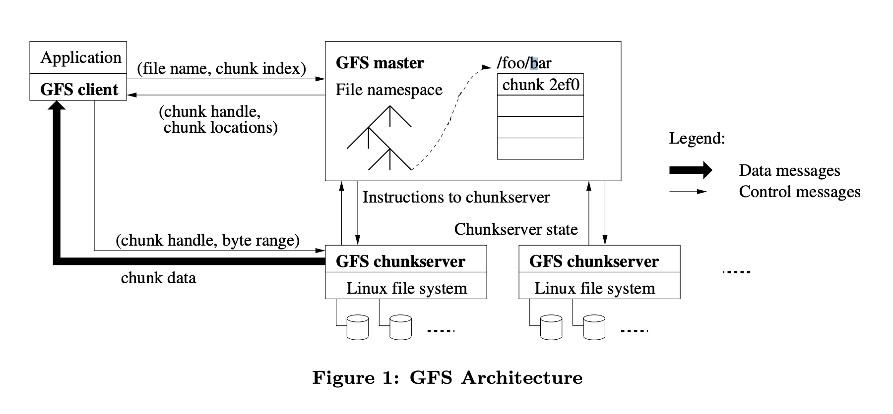
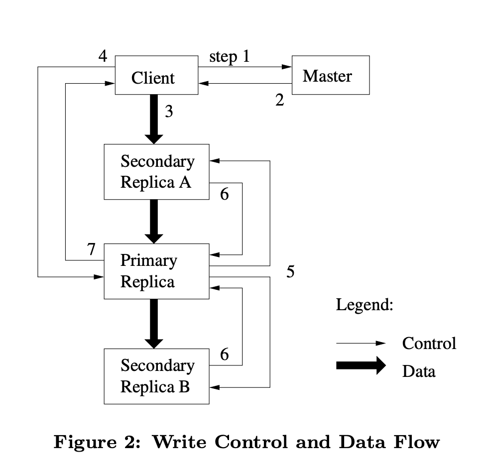

## Introduction

The Google File System, a scalable distributed file system for large distributed data-intensive applications.
It provides fault tolerance while running on inexpensive commodity hardware, and it delivers high aggregate performance to a large number of clients.

- First, component failures are the norm rather than the exception.
- Second, files are huge by traditional standards. Multi-GB files are common.
- Third, most files are mutated by appending new data rather than overwriting existing data.
  Random writes within a file are practically non-existent.
- Fourth, co-designing the applications and the file system API benefits the overall system by increasing our flexibility.

## Design Review

### Assumptions

- The system is built from many inexpensive commodity components that often fail.
  It must constantly monitor itself and detect, tolerate, and recover promptly from component failures on a routine basis.
- The system stores a modest number of large files. We
  expect a few million files, each typically 100 MB or
  larger in size. Multi-GB files are the common case
  and should be managed efficiently. Small files must be
  supported, but we need not optimize for them.
- The workloads primarily consist of two kinds of reads:
  large streaming reads and small random reads. In
  large streaming reads, individual operations typically
  read hundreds of KBs, more commonly 1 MB or more.
  Successive operations from the same client often read
  through a contiguous region of a file. A small random read typically reads a few KBs at some arbitrary
  offset. Performance-conscious applications often batch
  and sort their small reads to advance steadily through
  the file rather than go backand forth.
- The workloads also have many large, sequential writes
  that append data to files. Typical operation sizes are
  similar to those for reads. Once written, files are seldom modified again. Small writes at arbitrary positions in a file are supported but do not have to be
  efficient.
- The system must efficiently implement well-defined semantics for multiple clients that concurrently append
  to the same file. Our files are often used as producerconsumer queues or for many-way merging. Hundreds
  of producers, running one per machine, will concurrently append to a file. Atomicity with minimal synchronization overhead is essential. The file may be
  read later, or a consumer may be reading through the
  file simultaneously.
- High sustained bandwidth is more important than low
  latency. Most of our target applications place a premium on processing data in bulkat a high rate, while
  few have stringent response time requirements for an
  individual read or write.

### Interface

GFS provides a familiar file system interface, though it does not implement a standard API such as POSIX.
Files are organized hierarchically in directories and identified by pathnames.
We support the usual operations to *create*, *delete*, *open*, *close*, *read*, and *write* files.

Moreover, GFS has *snapshot* and *record append* operations.
Snapshot creates a copy of a file or a directory tree at low cost.
Record append allows multiple clients to append data to the same file concurrently while guaranteeing the atomicity of each individual client’s append.
It is useful for implementing multi-way merge results and producerconsumer queues that many clients can simultaneously append to without additional locking.
We have found these types of files to be invaluable in building large distributed applications.

### Architecture

A GFS cluster consists of a single *master* and multiple *chunkservers* and is accessed by multiple *clients*.
Each of these is typically a commodity Linux machine running a user-level server process.

Files are divided into fixed-size *chunks*.
Each chunkis identified by an immutable and globally unique 64 bit chunk handle assigned by the master at the time of chunkcreation.
Chunkservers store chunks on local disks as Linux files and read or write chunkdata specified by a *chunk handle* and byte range.
For reliability, each chunkis replicated on multiple chunkservers.
By default, we store three replicas, though users can designate different replication levels for different regions of the file namespace.

The master maintains all file system metadata.
This includes the namespace, access control information, the mapping from files to chunks, and the current locations of chunks.
It also controls system-wide activities such as chunklease management, garbage collection of orphaned chunks, and chunkmigration between chunkservers.
The master periodically communicates with each chunkserver in *HeartBeat* messages to give it instructions and collect its state.

GFS client code linked into each application implements the file system API and communicates with the master and chunkservers to read or write data on behalf of the application.
Clients interact with the master for metadata operations, but all data-bearing communication goes directly to the chunkservers.
We do not provide the POSIX API and therefore need not hookinto the Linux vnode layer

### Single Master

### Chunk Size

Chunksize is one of the key design parameters. We have chosen 64 MB, which is much larger than typical file system blocksizes.

First, it reduces clients’ need to interact with the master because reads and writes on the same chunkrequire only one initial request to the master for chunklocation information.
Second, since on a large chunk, a client is more likely to perform many operations on a given chunk, it can reduce network overhead by keeping a persistent TCP connection to the chunkserver over an extended period of time.
Third, it reduces the size of the metadata stored on the master. This allows us to keep the metadata in memory。

On the other hand, a large chunksize, even with lazy space allocation, has its disadvantages.

- A small file consists of a small number of chunks, perhaps just one.
- The chunkservers storing those chunks may become hot spots if many clients are accessing the same file.
  In practice, hot spots have not been a major issue because our applications mostly read large multi-chunkfiles sequentially.
  We fixed this problem by storing such executables with a higher replication factor and by making the batchqueue system stagger application start times.
  A potential long-term solution is to allow clients to read data from other clients in such situations.

### Metadata

The master stores three major types of metadata: the file and chunknamespaces, the mapping from files to chunks, and the locations of each chunk’s replicas.

> [!NOTE]
>
> All metadata is kept in the master’s memory.

The first two types (namespaces and file-to-chunkmapping) are also kept persistent by logging mutations to an *operation log* stored on the master’s local diskand replicated on remote machines.
Using a log allows us to update the master state simply, reliably, and without risking inconsistencies in the event of a master crash.
The master does not store chunklocation information persistently. Instead, it asks each chunkserver about its chunks at master startup and whenever a chunkserver joins the cluster.

### Consistency Model

## System Interactions

### Leases and Mutation Order

### Data Flow

### Atomic Record Appends

### Snapshot

## Master Operation

### Replica Placement

### Garbage Collection

### Stale Replica Detection

## Fault Tolerance and Diagnosis

### High Availability

## Links

- [BigData](/docs/CS/Java/BigData/BigData.md)

## References

1. [The Google File System](https://www.cs.otago.ac.nz/cosc440/readings/gfs.pdf)
