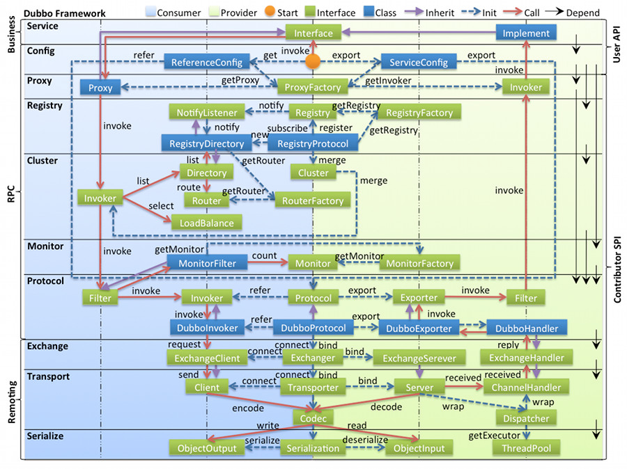
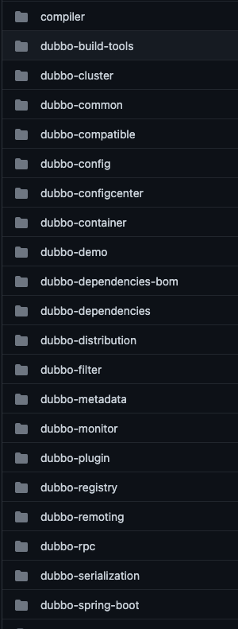

## Introduction

[Apache Dubbo](http://dubbo.apache.org/) is a high-performance, java based open source RPC framework.

## Design

### layers

### packages

### cluster

| 节点 |	角色说明 |
| :---: | :---: |
| Provider | 暴露服务的服务提供方 |
| Consumer | 调用远程服务的服务消费方 |
| Registry | 服务注册与发现的注册中心 |
| Monitor | 统计服务的调用次数和调用时间的监控中心 |
| Container | 服务运行容器 |

调用关系说明：

- 服务容器负责启动，加载，运行服务提供者。
- 服务提供者在启动时，向注册中心注册自己提供的服务。
- 服务消费者在启动时，向注册中心订阅自己所需的服务。
- 注册中心返回服务提供者地址列表给消费者，如果有变更，注册中心将基于长连接推送变更数据给消费者。
- 服务消费者，从提供者地址列表中，基于软负载均衡算法，选一台提供者进行调用，如果调用失败，再选另一台调用。
- 服务消费者和提供者，在内存中累计调用次数和调用时间，定时每分钟发送一次统计数据到监控中心。

## Package

### SPI

[SPI](/docs/CS/Java/Dubbo/SPI.md)

use Adapter

Wrapper class

JavaAssist

### Protocol

| 协议名称   | 实现描述                                                     | 连接                                                         | 使用场景                                                     |
| :--------- | :----------------------------------------------------------- | ------------------------------------------------------------ | ------------------------------------------------------------ |
| dubbo      | 传输：mina、netty、grizzy  序列化：dubbo、hessian2、java、json | dubbo缺省采用单一长连接和NIO异步通讯                         | 1.传入传出参数数据包较小  2.消费者 比提供者多  3.常规远程服务方法调用  4.不适合传送大数据量的服务，比如文件、传视频 |
| rmi        | 传输：java rmi  序列化：java 标准序列化                      | 连接个数：多连接  连接方式：短连接  传输协议：TCP/IP  传输方式：BIO | 1.常规RPC调用  2.与原RMI客户端互操作  3.可传文件  4.不支持防火墙穿透 |
| hessian    | 传输：Serverlet容器  序列化：hessian二进制序列化             | 连接个数：多连接   连接方式：短连接   传输协议：HTTP   传输方式：同步传输 | 1.提供者比消费者多  2.可传文件  3.跨语言传输                 |
| http       | 传输：servlet容器  序列化：表单序列化                        | 连接个数：多连接   连接方式：短连接   传输协议：HTTP   传输方式：同步传输 | 1.提供者多余消费者  2.数据包混合                             |
| webservice | 传输：HTTP  序列化：SOAP文件序列化                           | 连接个数：多连接   连接方式：短连接   传输协议：HTTP   传输方式：同步传输 | 1.系统集成  2.跨语言调用                                     |
| t

## Transport
AbstractServer.doOpen()->create a Netty or Mina Server.

Request Event connected by NettyServer -> AllChannelHandler -> Executor Service 
-> Dubbo Protocol invoke() -> received

- received
- handleRequest

-> reply()

RegistryProtocol

- create Registry
- do Register

Dispatcher
AllDispstcher

ThreadPool Model

GenericFilter

