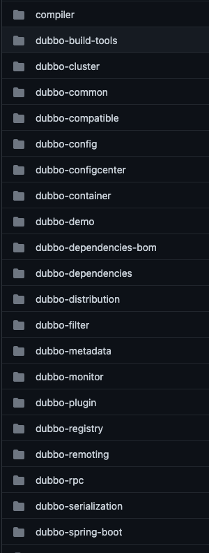

## Introduction

[Apache Dubbo](http://dubbo.apache.org/) is a high-performance, java based open source RPC framework.

- [start](/docs/CS/Java/Dubbo/Start.md)
- [Registry](/docs/CS/Java/Dubbo/registry.md)
- [Remoting](/docs/CS/Java/Dubbo/remoting.md)
- [cluster](/docs/CS/Java/Dubbo/cluster.md)
- [Transporter](/docs/CS/Java/Dubbo/Transporter.md)
- [LoadBalance](/docs/CS/Java/Dubbo/LoadBalance.md)

## Design

### layers

### packages

### cluster

| 节点 |	角色说明 |
| :---: | :---: |
| Provider | 暴露服务的服务提供方 |
| Consumer | 调用远程服务的服务消费方 |
| Registry | 服务注册与发现的注册中心 |
| Monitor | 统计服务的调用次数和调用时间的监控中心 |
| Container | 服务运行容器 |

调用关系说明：

- 服务容器负责启动，加载，运行服务提供者。
- 服务提供者在启动时，向注册中心注册自己提供的服务。
- 服务消费者在启动时，向注册中心订阅自己所需的服务。
- 注册中心返回服务提供者地址列表给消费者，如果有变更，注册中心将基于长连接推送变更数据给消费者。
- 服务消费者，从提供者地址列表中，基于软负载均衡算法，选一台提供者进行调用，如果调用失败，再选另一台调用。
- 服务消费者和提供者，在内存中累计调用次数和调用时间，定时每分钟发送一次统计数据到监控中心。

## Package

### SPI

[SPI](/docs/CS/Java/Dubbo/SPI.md)

use Adapter

Wrapper class

JavaAssist

### Protocol

| Protocol   | Transporter                        | Serialization               | Features                               | Applicable Scene                                             |
| :--------- | :--------------------------------- | --------------------------- | -------------------------------------- | ------------------------------------------------------------ |
| dubbo      | Mina, Netty, grizzy                | dubbo, hessian2, java, json | Single Long connection Async NIO TCP   | Multiple rquests with few contents or consumers much larger than providers |
| rmi        | Java rmi                           | Serializable                | Multiple short connections, Sync, TCP  |                                                              |
| hessian    | Servlet, default Jetty             | Hessian                     | Multiple short connections, Sync, HTTP |                                                              |
| http       | Spring HttpInvoker                 | form                        | Multiple short connections, Sync, HTTP | Unsupport upload files                                       |
| webservice | 传输：HTTP  序列化：SOAP文件序列化 |                             | Multiple short connections, Sync, HTTP |                                                              |
| Triple     |                                    | default ProtoBuf            | Single Long connection Async NIO TCP   |                                                              |

Protocol Invoker Exporter(wrapper Invoker)

## Transport
AbstractServer.doOpen()->create a Netty or Mina Server.

use NioEventLoop
 
Request Event connected by NettyServer -> AllChannelHandler -> Executor Service 
-> Dubbo Protocol invoke() -> received

- received
- handleRequest

-> reply()

RegistryProtocol

- create Registry
- do Register

Dispatcher
AllDispstcher

ThreadPool Model

GenericFilter

MultiHandler

[CVE-2020-1948](https://www.cve.org/CVERecord?id=CVE-2020-1948)

## Links

- [RPC](/docs/CS/Distributed/RPC/RPC.md)