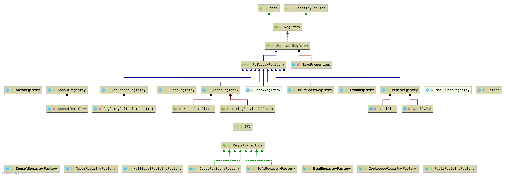

## Introduction


### Registry Hierarchy





## RegistryFactory


```java
// RegistryFactory. (SPI, Singleton, ThreadSafe)
@SPI("dubbo")
public interface RegistryFactory {

    /**
     * Connect to the registry
     * <p>
     * Connecting the registry needs to support the contract: <br>
     * 1. When the check=false is set, the connection is not checked, otherwise the exception is thrown when disconnection <br>
     * 2. Support username:password authority authentication on URL.<br>
     * 3. Support the backup=10.20.153.10 candidate registry cluster address.<br>
     * 4. Support file=registry.cache local disk file cache.<br>
     * 5. Support the timeout=1000 request timeout setting.<br>
     * 6. Support session=60000 session timeout or expiration settings.<br>
     *
     * @param url Registry address, is not allowed to be empty
     * @return Registry reference, never return empty value
     */
    @Adaptive({"protocol"})
    Registry getRegistry(URL url);
}
```

### AbstractRegistryFactory

```java
// AbstractRegistryFactory. (SPI, Singleton, ThreadSafe)
public abstract class AbstractRegistryFactory implements RegistryFactory {

    // The lock for the acquisition process of the registry
    protected static final ReentrantLock LOCK = new ReentrantLock();

    // Registry Collection Map<RegistryAddress, Registry>
    protected static final Map<String, Registry> REGISTRIES = new HashMap<>();

    private static final AtomicBoolean destroyed = new AtomicBoolean(false);

    // Get all registries
    public static Collection<Registry> getRegistries() {
        return Collections.unmodifiableCollection(new LinkedList<>(REGISTRIES.values()));
    }

    public static Registry getRegistry(String key) {
        return REGISTRIES.get(key);
    }

    // get getServiceDiscovery from REGISTRIES & instanceof ServiceDiscoveryRegistry
    public static List<ServiceDiscovery> getServiceDiscoveries() {
        return AbstractRegistryFactory.getRegistries()
                .stream()
                .filter(registry -> registry instanceof ServiceDiscoveryRegistry)
                .map(registry -> (ServiceDiscoveryRegistry) registry)
                .map(ServiceDiscoveryRegistry::getServiceDiscovery)
                .collect(Collectors.toList());
    }
...
}
```

#### getRegistry
```java
    @Override
    public Registry getRegistry(URL url) {

        Registry defaultNopRegistry = getDefaultNopRegistryIfDestroyed();
        if (null != defaultNopRegistry) {
            return defaultNopRegistry;
        }

        url = URLBuilder.from(url)
                .setPath(RegistryService.class.getName())
                .addParameter(INTERFACE_KEY, RegistryService.class.getName())
                .removeParameters(EXPORT_KEY, REFER_KEY)
                .build();
        String key = createRegistryCacheKey(url);
        // Lock the registry access process to ensure a single instance of the registry
        LOCK.lock();
        try {
            // double check
            // fix https://github.com/apache/dubbo/issues/7265.
            defaultNopRegistry = getDefaultNopRegistryIfDestroyed();
            if (null != defaultNopRegistry) {
                return defaultNopRegistry;
            }

            Registry registry = REGISTRIES.get(key);
            if (registry != null) {
                return registry;
            }
            //create registry by spi/ioc
            registry = createRegistry(url);
            if (registry == null) {
                throw new IllegalStateException("Can not create registry " + url);
            }
            REGISTRIES.put(key, registry);
            return registry;
        } finally {
            // Release the lock
            LOCK.unlock();
        }
    }
```

#### createRegistry

Implementations:
1. ZookeeperRegistryFactory
2. DubboRegistryFactory
3. NacosRegistryFactory
4. RedisRegistryFactory
5. EtcdRegistryFactory


```java
    protected abstract Registry createRegistry(URL url);
```

## Registry


```java
// Node. (API/SPI, Prototype, ThreadSafe)
public interface Node {

    URL getUrl();

    boolean isAvailable();

    void destroy();

}
```


```java
// RegistryService. (SPI, Prototype, ThreadSafe)
public interface RegistryService {

    /**
     * Register data, such as : provider service, consumer address, route rule, override rule and other data.
     * <p>
     * Registering is required to support the contract:<br>
     * 1. When the URL sets the check=false parameter. When the registration fails, the exception is not thrown and retried in the background. Otherwise, the exception will be thrown.<br>
     * 2. When URL sets the dynamic=false parameter, it needs to be stored persistently, otherwise, it should be deleted automatically when the registrant has an abnormal exit.<br>
     * 3. When the URL sets category=routers, it means classified storage, the default category is providers, and the data can be notified by the classified section. <br>
     * 4. When the registry is restarted, network jitter, data can not be lost, including automatically deleting data from the broken line.<br>
     * 5. Allow URLs which have the same URL but different parameters to coexist,they can't cover each other.<br>
     *
     * @param url  Registration information , is not allowed to be empty, e.g: dubbo://10.20.153.10/org.apache.dubbo.foo.BarService?version=1.0.0&application=kylin
     */
    void register(URL url);

    /**
     * Unregister
     * <p>
     * Unregistering is required to support the contract:<br>
     * 1. If it is the persistent stored data of dynamic=false, the registration data can not be found, then the IllegalStateException is thrown, otherwise it is ignored.<br>
     * 2. Unregister according to the full url match.<br>
     *
     * @param url Registration information , is not allowed to be empty, e.g: dubbo://10.20.153.10/org.apache.dubbo.foo.BarService?version=1.0.0&application=kylin
     */
    void unregister(URL url);

    /**
     * Subscribe to eligible registered data and automatically push when the registered data is changed.
     * <p>
     * Subscribing need to support contracts:<br>
     * 1. When the URL sets the check=false parameter. When the registration fails, the exception is not thrown and retried in the background. <br>
     * 2. When URL sets category=routers, it only notifies the specified classification data. Multiple classifications are separated by commas, and allows asterisk to match, which indicates that all categorical data are subscribed.<br>
     * 3. Allow interface, group, version, and classifier as a conditional query, e.g.: interface=org.apache.dubbo.foo.BarService&version=1.0.0<br>
     * 4. And the query conditions allow the asterisk to be matched, subscribe to all versions of all the packets of all interfaces, e.g. :interface=*&group=*&version=*&classifier=*<br>
     * 5. When the registry is restarted and network jitter, it is necessary to automatically restore the subscription request.<br>
     * 6. Allow URLs which have the same URL but different parameters to coexist,they can't cover each other.<br>
     * 7. The subscription process must be blocked, when the first notice is finished and then returned.<br>
     *
     * @param url      Subscription condition, not allowed to be empty, e.g. consumer://10.20.153.10/org.apache.dubbo.foo.BarService?version=1.0.0&application=kylin
     * @param listener A listener of the change event, not allowed to be empty
     */
    void subscribe(URL url, NotifyListener listener);

    /**
     * Unsubscribe
     * <p>
     * Unsubscribing is required to support the contract:<br>
     * 1. If don't subscribe, ignore it directly.<br>
     * 2. Unsubscribe by full URL match.<br>
     *
     * @param url      Subscription condition, not allowed to be empty, e.g. consumer://10.20.153.10/org.apache.dubbo.foo.BarService?version=1.0.0&application=kylin
     * @param listener A listener of the change event, not allowed to be empty
     */
    void unsubscribe(URL url, NotifyListener listener);

    /**
     * Query the registered data that matches the conditions. Corresponding to the push mode of the subscription, this is the pull mode and returns only one result.
     *
     * @param url Query condition, is not allowed to be empty, e.g. consumer://10.20.153.10/org.apache.dubbo.foo.BarService?version=1.0.0&application=kylin
     * @return The registered information list, which may be empty, the meaning is the same as the parameters of {@link org.apache.dubbo.registry.NotifyListener#notify(List<URL>)}.
     * @see org.apache.dubbo.registry.NotifyListener#notify(List)
     */
    List<URL> lookup(URL url);

}
```


```java
// Registry. (SPI, Prototype, ThreadSafe)
public interface Registry extends Node, RegistryService {
    default void reExportRegister(URL url) {
        register(url);
    }

    default void reExportUnregister(URL url) {
        unregister(url);
    }
}
```


### AbstractRegistry

 when register/unregister, add/remove url from `Set<URL> registered`


```java
/**
 * AbstractRegistry. (SPI, Prototype, ThreadSafe)
 */
public abstract class AbstractRegistry implements Registry {

    // URL address separator, used in file cache, service provider URL separation
    private static final char URL_SEPARATOR = ' ';
    // URL address separated regular expression for parsing the service provider URL list in the file cache
    private static final String URL_SPLIT = "\\s+";
    // Max times to retry to save properties to local cache file
    private static final int MAX_RETRY_TIMES_SAVE_PROPERTIES = 3;
    // Log output
    protected final Logger logger = LoggerFactory.getLogger(getClass());
    // Local disk cache, where the special key value.registries records the list of registry centers, and the others are the list of notified service providers
    private final Properties properties = new Properties();
    // File cache timing writing
    private final ExecutorService registryCacheExecutor = Executors.newFixedThreadPool(1, new NamedThreadFactory("DubboSaveRegistryCache", true));
    // Is it synchronized to save the file
    private boolean syncSaveFile;
    private final AtomicLong lastCacheChanged = new AtomicLong();
    private final AtomicInteger savePropertiesRetryTimes = new AtomicInteger();
    private final Set<URL> registered = new ConcurrentHashSet<>();
    private final ConcurrentMap<URL, Set<NotifyListener>> subscribed = new ConcurrentHashMap<>();
    private final ConcurrentMap<URL, Map<String, List<URL>>> notified = new ConcurrentHashMap<>();
    private URL registryUrl;
    // Local disk cache file
    private File file;

    public AbstractRegistry(URL url) {
        setUrl(url);
        if (url.getParameter(REGISTRY__LOCAL_FILE_CACHE_ENABLED, true)) {
            // Start file save timer
            syncSaveFile = url.getParameter(REGISTRY_FILESAVE_SYNC_KEY, false);
            String defaultFilename = System.getProperty("user.home") + "/.dubbo/dubbo-registry-" + url.getParameter(APPLICATION_KEY) + "-" + url.getAddress().replaceAll(":", "-") + ".cache";
            String filename = url.getParameter(FILE_KEY, defaultFilename);
            File file = null;
            if (ConfigUtils.isNotEmpty(filename)) {
                file = new File(filename);
                if (!file.exists() && file.getParentFile() != null && !file.getParentFile().exists()) {
                    if (!file.getParentFile().mkdirs()) {
                        throw new IllegalArgumentException("Invalid registry cache file " + file + ", cause: Failed to create directory " + file.getParentFile() + "!");
                    }
                }
            }
            this.file = file;
            // When starting the subscription center,
            // we need to read the local cache file for future Registry fault tolerance processing.
            loadProperties();
            notify(url.getBackupUrls());
        }
    }
...
}
```


#### notify

```java
 /** AbstractRegistry
   * Notify changes from the Provider side.
   * @param url      consumer side url
   * @param listener listener
   * @param urls     provider latest urls
   */
protected void notify(URL url, NotifyListener listener, List<URL> urls) {
  // keep every provider's category.
  Map<String, List<URL>> result = new HashMap<>();
  for (URL u : urls) {
    if (UrlUtils.isMatch(url, u)) {
      String category = u.getParameter(CATEGORY_KEY, DEFAULT_CATEGORY);
      List<URL> categoryList = result.computeIfAbsent(category, k -> new ArrayList<>());
      categoryList.add(u);
    }
  }
  if (result.size() == 0) {
    return;
  }
  Map<String, List<URL>> categoryNotified = notified.computeIfAbsent(url, u -> new ConcurrentHashMap<>());
  for (Map.Entry<String, List<URL>> entry : result.entrySet()) {
    String category = entry.getKey();
    List<URL> categoryList = entry.getValue();
    categoryNotified.put(category, categoryList);
    listener.notify(categoryList);
    // We will update our cache file after each notification.
    // When our Registry has a subscribe failure due to network jitter, we can return at least the existing cache URL.
    saveProperties(url);
  }
}
```


#### Cache

```java
private void saveProperties(URL url) {
    if (file == null) {
        return;
    }

    try {
        StringBuilder buf = new StringBuilder();
        Map<String, List<URL>> categoryNotified = notified.get(url);
        if (categoryNotified != null) {
            for (List<URL> us : categoryNotified.values()) {
                for (URL u : us) {
                    if (buf.length() > 0) {
                        buf.append(URL_SEPARATOR);
                    }
                    buf.append(u.toFullString());
                }
            }
        }
        properties.setProperty(url.getServiceKey(), buf.toString());
        long version = lastCacheChanged.incrementAndGet();
        if (syncSaveFile) {
            doSaveProperties(version);
        } else {
            registryCacheExecutor.execute(new SaveProperties(version));// async
        }
    } catch (Throwable t) {
        logger.warn(t.getMessage(), t);
    }
}
```


```java
public void doSaveProperties(long version) {
    if (version < lastCacheChanged.get()) {
        return;
    }
    if (file == null) {
        return;
    }
    // Save
    try {
        File lockfile = new File(file.getAbsolutePath() + ".lock");
        if (!lockfile.exists()) {
            lockfile.createNewFile();
        }
        try (RandomAccessFile raf = new RandomAccessFile(lockfile, "rw");
             FileChannel channel = raf.getChannel()) {
            FileLock lock = channel.tryLock();
            if (lock == null) {
                throw new IOException("Can not lock the registry cache file " + file.getAbsolutePath() + ", ignore and retry later, maybe multi java process use the file, please config: dubbo.registry.file=xxx.properties");
            }
            // Save
            try {
                if (!file.exists()) {
                    file.createNewFile();
                }
                try (FileOutputStream outputFile = new FileOutputStream(file)) {
                    properties.store(outputFile, "Dubbo Registry Cache");
                }
            } finally {
                lock.release();
            }
        }
    } catch (Throwable e) {
        savePropertiesRetryTimes.incrementAndGet();
        if (savePropertiesRetryTimes.get() >= MAX_RETRY_TIMES_SAVE_PROPERTIES) {
            savePropertiesRetryTimes.set(0);
            return;
        }
        if (version < lastCacheChanged.get()) {
            savePropertiesRetryTimes.set(0);
            return;
        } else {
            registryCacheExecutor.execute(new SaveProperties(lastCacheChanged.incrementAndGet()));
        }
}
```

### FailbackRegistry

```java
// FailbackRegistry. (SPI, Prototype, ThreadSafe)
public abstract class FailbackRegistry extends AbstractRegistry {

    /*  retry task map */

    private final ConcurrentMap<URL, FailedRegisteredTask> failedRegistered = new ConcurrentHashMap<URL, FailedRegisteredTask>();

    private final ConcurrentMap<URL, FailedUnregisteredTask> failedUnregistered = new ConcurrentHashMap<URL, FailedUnregisteredTask>();

    private final ConcurrentMap<Holder, FailedSubscribedTask> failedSubscribed = new ConcurrentHashMap<Holder, FailedSubscribedTask>();

    private final ConcurrentMap<Holder, FailedUnsubscribedTask> failedUnsubscribed = new ConcurrentHashMap<Holder, FailedUnsubscribedTask>();

    /**
     * The time in milliseconds the retryExecutor will wait
     */
    private final int retryPeriod;

    // Timer for failure retry, regular check if there is a request for failure, and if there is, an unlimited retry
    private final HashedWheelTimer retryTimer;

    public FailbackRegistry(URL url) {
        super(url);
        this.retryPeriod = url.getParameter(REGISTRY_RETRY_PERIOD_KEY, DEFAULT_REGISTRY_RETRY_PERIOD);

        // since the retry task will not be very much. 128 ticks is enough.
        retryTimer = new HashedWheelTimer(new NamedThreadFactory("DubboRegistryRetryTimer", true), retryPeriod, TimeUnit.MILLISECONDS, 128);
    }

    public void removeFailedRegisteredTask(URL url) {
        failedRegistered.remove(url);
    }

    public void removeFailedUnregisteredTask(URL url) {
        failedUnregistered.remove(url);
    }

    public void removeFailedSubscribedTask(URL url, NotifyListener listener) {
        Holder h = new Holder(url, listener);
        failedSubscribed.remove(h);
    }

    public void removeFailedUnsubscribedTask(URL url, NotifyListener listener) {
        Holder h = new Holder(url, listener);
        failedUnsubscribed.remove(h);
    }

    private void addFailedRegistered(URL url) {
        FailedRegisteredTask oldOne = failedRegistered.get(url);
        if (oldOne != null) {
            return;
        }
        FailedRegisteredTask newTask = new FailedRegisteredTask(url, this);
        oldOne = failedRegistered.putIfAbsent(url, newTask);
        if (oldOne == null) {
            // never has a retry task. then start a new task for retry.
            retryTimer.newTimeout(newTask, retryPeriod, TimeUnit.MILLISECONDS);
        }
    }

    private void removeFailedRegistered(URL url) {
        FailedRegisteredTask f = failedRegistered.remove(url);
        if (f != null) {
            f.cancel();
        }
    }

    private void addFailedUnregistered(URL url) {
        FailedUnregisteredTask oldOne = failedUnregistered.get(url);
        if (oldOne != null) {
            return;
        }
        FailedUnregisteredTask newTask = new FailedUnregisteredTask(url, this);
        oldOne = failedUnregistered.putIfAbsent(url, newTask);
        if (oldOne == null) {
            // never has a retry task. then start a new task for retry.
            retryTimer.newTimeout(newTask, retryPeriod, TimeUnit.MILLISECONDS);
        }
    }

    private void removeFailedUnregistered(URL url) {
        FailedUnregisteredTask f = failedUnregistered.remove(url);
        if (f != null) {
            f.cancel();
        }
    }

    protected void addFailedSubscribed(URL url, NotifyListener listener) {
        Holder h = new Holder(url, listener);
        FailedSubscribedTask oldOne = failedSubscribed.get(h);
        if (oldOne != null) {
            return;
        }
        FailedSubscribedTask newTask = new FailedSubscribedTask(url, this, listener);
        oldOne = failedSubscribed.putIfAbsent(h, newTask);
        if (oldOne == null) {
            // never has a retry task. then start a new task for retry.
            retryTimer.newTimeout(newTask, retryPeriod, TimeUnit.MILLISECONDS);
        }
    }

    public void removeFailedSubscribed(URL url, NotifyListener listener) {
        Holder h = new Holder(url, listener);
        FailedSubscribedTask f = failedSubscribed.remove(h);
        if (f != null) {
            f.cancel();
        }
        removeFailedUnsubscribed(url, listener);
    }

    private void addFailedUnsubscribed(URL url, NotifyListener listener) {
        Holder h = new Holder(url, listener);
        FailedUnsubscribedTask oldOne = failedUnsubscribed.get(h);
        if (oldOne != null) {
            return;
        }
        FailedUnsubscribedTask newTask = new FailedUnsubscribedTask(url, this, listener);
        oldOne = failedUnsubscribed.putIfAbsent(h, newTask);
        if (oldOne == null) {
            // never has a retry task. then start a new task for retry.
            retryTimer.newTimeout(newTask, retryPeriod, TimeUnit.MILLISECONDS);
        }
    }

    private void removeFailedUnsubscribed(URL url, NotifyListener listener) {
        Holder h = new Holder(url, listener);
        FailedUnsubscribedTask f = failedUnsubscribed.remove(h);
        if (f != null) {
            f.cancel();
        }
    }

    @Override
    public void register(URL url) {
        if (!acceptable(url)) {
            logger.info("URL " + url + " will not be registered to Registry. Registry " + url + " does not accept service of this protocol type.");
            return;
        }
        super.register(url);
        removeFailedRegistered(url);
        removeFailedUnregistered(url);
        try {
            // Sending a registration request to the server side
            doRegister(url);
        } catch (Exception e) {
            Throwable t = e;

            // If the startup detection is opened, the Exception is thrown directly.
            boolean check = getUrl().getParameter(Constants.CHECK_KEY, true)
                    && url.getParameter(Constants.CHECK_KEY, true)
                    && !CONSUMER_PROTOCOL.equals(url.getProtocol());
            boolean skipFailback = t instanceof SkipFailbackWrapperException;
            if (check || skipFailback) {
                if (skipFailback) {
                    t = t.getCause();
                }
                throw new IllegalStateException("Failed to register " + url + " to registry " + getUrl().getAddress() + ", cause: " + t.getMessage(), t);
            } else {
                logger.error("Failed to register " + url + ", waiting for retry, cause: " + t.getMessage(), t);
            }

            // Record a failed registration request to a failed list, retry regularly
            addFailedRegistered(url);
        }
    }

    @Override
    public void reExportRegister(URL url) {
        if (!acceptable(url)) {
            logger.info("URL " + url + " will not be registered to Registry. Registry " + url + " does not accept service of this protocol type.");
            return;
        }
        super.register(url);
        removeFailedRegistered(url);
        removeFailedUnregistered(url);
        try {
            // Sending a registration request to the server side
            doRegister(url);
        } catch (Exception e) {
            if (!(e instanceof SkipFailbackWrapperException)) {
                throw new IllegalStateException("Failed to register (re-export) " + url + " to registry " + getUrl().getAddress() + ", cause: " + e.getMessage(), e);
            }
        }
    }

    @Override
    public void unregister(URL url) {
        super.unregister(url);
        removeFailedRegistered(url);
        removeFailedUnregistered(url);
        try {
            // Sending a cancellation request to the server side
            doUnregister(url);
        } catch (Exception e) {
            Throwable t = e;

            // If the startup detection is opened, the Exception is thrown directly.
            boolean check = getUrl().getParameter(Constants.CHECK_KEY, true)
                    && url.getParameter(Constants.CHECK_KEY, true)
                    && !CONSUMER_PROTOCOL.equals(url.getProtocol());
            boolean skipFailback = t instanceof SkipFailbackWrapperException;
            if (check || skipFailback) {
                if (skipFailback) {
                    t = t.getCause();
                }
                throw new IllegalStateException("Failed to unregister " + url + " to registry " + getUrl().getAddress() + ", cause: " + t.getMessage(), t);
            } else {
                logger.error("Failed to unregister " + url + ", waiting for retry, cause: " + t.getMessage(), t);
            }

            // Record a failed registration request to a failed list, retry regularly
            addFailedUnregistered(url);
        }
    }

    @Override
    public void reExportUnregister(URL url) {
        super.unregister(url);
        removeFailedRegistered(url);
        removeFailedUnregistered(url);
        try {
            // Sending a cancellation request to the server side
            doUnregister(url);
        } catch (Exception e) {
            if (!(e instanceof SkipFailbackWrapperException)) {
                throw new IllegalStateException("Failed to unregister(re-export) " + url + " to registry " + getUrl().getAddress() + ", cause: " + e.getMessage(), e);
            }
        }
    }

    @Override
    public void subscribe(URL url, NotifyListener listener) {
        super.subscribe(url, listener);
        removeFailedSubscribed(url, listener);
        try {
            // Sending a subscription request to the server side
            doSubscribe(url, listener);
        } catch (Exception e) {
            Throwable t = e;

            List<URL> urls = getCacheUrls(url);
            if (CollectionUtils.isNotEmpty(urls)) {
                notify(url, listener, urls);
                logger.error("Failed to subscribe " + url + ", Using cached list: " + urls + " from cache file: " + getUrl().getParameter(FILE_KEY, System.getProperty("user.home") + "/dubbo-registry-" + url.getHost() + ".cache") + ", cause: " + t.getMessage(), t);
            } else {
                // If the startup detection is opened, the Exception is thrown directly.
                boolean check = getUrl().getParameter(Constants.CHECK_KEY, true)
                        && url.getParameter(Constants.CHECK_KEY, true);
                boolean skipFailback = t instanceof SkipFailbackWrapperException;
                if (check || skipFailback) {
                    if (skipFailback) {
                        t = t.getCause();
                    }
                    throw new IllegalStateException("Failed to subscribe " + url + ", cause: " + t.getMessage(), t);
                } else {
                    logger.error("Failed to subscribe " + url + ", waiting for retry, cause: " + t.getMessage(), t);
                }
            }

            // Record a failed registration request to a failed list, retry regularly
            addFailedSubscribed(url, listener);
        }
    }

    @Override
    public void unsubscribe(URL url, NotifyListener listener) {
        super.unsubscribe(url, listener);
        removeFailedSubscribed(url, listener);
        try {
            // Sending a canceling subscription request to the server side
            doUnsubscribe(url, listener);
        } catch (Exception e) {
            Throwable t = e;

            // If the startup detection is opened, the Exception is thrown directly.
            boolean check = getUrl().getParameter(Constants.CHECK_KEY, true)
                    && url.getParameter(Constants.CHECK_KEY, true);
            boolean skipFailback = t instanceof SkipFailbackWrapperException;
            if (check || skipFailback) {
                if (skipFailback) {
                    t = t.getCause();
                }
                throw new IllegalStateException("Failed to unsubscribe " + url + " to registry " + getUrl().getAddress() + ", cause: " + t.getMessage(), t);
            } else {
                logger.error("Failed to unsubscribe " + url + ", waiting for retry, cause: " + t.getMessage(), t);
            }

            // Record a failed registration request to a failed list, retry regularly
            addFailedUnsubscribed(url, listener);
        }
    }

    @Override
    protected void notify(URL url, NotifyListener listener, List<URL> urls) {
        if (url == null) {
            throw new IllegalArgumentException("notify url == null");
        }
        if (listener == null) {
            throw new IllegalArgumentException("notify listener == null");
        }
        try {
            doNotify(url, listener, urls);
        } catch (Exception t) {
            // Record a failed registration request to a failed list
            logger.error("Failed to notify addresses for subscribe " + url + ", cause: " + t.getMessage(), t);
        }
    }

    protected void doNotify(URL url, NotifyListener listener, List<URL> urls) {
        super.notify(url, listener, urls);
    }

    @Override
    protected void recover() throws Exception {
        // register
        Set<URL> recoverRegistered = new HashSet<URL>(getRegistered());
        if (!recoverRegistered.isEmpty()) {
            if (logger.isInfoEnabled()) {
                logger.info("Recover register url " + recoverRegistered);
            }
            for (URL url : recoverRegistered) {
                // remove fail registry or unRegistry task first.
                removeFailedRegistered(url);
                removeFailedUnregistered(url);
                addFailedRegistered(url);
            }
        }
        // subscribe
        Map<URL, Set<NotifyListener>> recoverSubscribed = new HashMap<URL, Set<NotifyListener>>(getSubscribed());
        if (!recoverSubscribed.isEmpty()) {
            if (logger.isInfoEnabled()) {
                logger.info("Recover subscribe url " + recoverSubscribed.keySet());
            }
            for (Map.Entry<URL, Set<NotifyListener>> entry : recoverSubscribed.entrySet()) {
                URL url = entry.getKey();
                for (NotifyListener listener : entry.getValue()) {
                    // First remove other tasks to ensure that addFailedSubscribed can succeed.
                    removeFailedSubscribed(url, listener);
                    addFailedSubscribed(url, listener);
                }
            }
        }
    }

    @Override
    public void destroy() {
        super.destroy();
        retryTimer.stop();
    }

    // ==== Template method ====

    public abstract void doRegister(URL url);

    public abstract void doUnregister(URL url);

    public abstract void doSubscribe(URL url, NotifyListener listener);

    public abstract void doUnsubscribe(URL url, NotifyListener listener);

    static class Holder {

        private final URL url;

        private final NotifyListener notifyListener;

        Holder(URL url, NotifyListener notifyListener) {
            if (url == null || notifyListener == null) {
                throw new IllegalArgumentException();
            }
            this.url = url;
            this.notifyListener = notifyListener;
        }

        @Override
        public int hashCode() {
            return url.hashCode() + notifyListener.hashCode();
        }

        @Override
        public boolean equals(Object obj) {
            if (obj instanceof Holder) {
                Holder h = (Holder) obj;
                return this.url.equals(h.url) && this.notifyListener.equals(h.notifyListener);
            } else {
                return false;
            }
        }
    }
}
```

#### register

1. Add url to `Set<URL> registered`
2. removeFailedRegistered(url) and cancel
3. removeFailedUnregistered(url) and cancel
4. `doRegister` which implement by subClass, Sending a registration request to the server side
5. if step4 fail, Record a failed registration request to a failed list, retry regularly

```java
@Override
public void register(URL url) {
    registered.add(url);
}

@Override
public void register(URL url) {
    if (!acceptable(url)) {
        return;
    }
    super.register(url);
    removeFailedRegistered(url);
    removeFailedUnregistered(url);
    try {
        // Sending a registration request to the server side
        doRegister(url);
    } catch (Exception e) {
        Throwable t = e;

        // If the startup detection is opened, the Exception is thrown directly.
        boolean check = getUrl().getParameter(Constants.CHECK_KEY, true)
                && url.getParameter(Constants.CHECK_KEY, true)
                && !CONSUMER_PROTOCOL.equals(url.getProtocol());
        boolean skipFailback = t instanceof SkipFailbackWrapperException;
        if (check || skipFailback) {
            if (skipFailback) {
                t = t.getCause();
            }
            throw new IllegalStateException("Failed to register " + url + " to registry " + getUrl().getAddress() + ", cause: " + t.getMessage(), t);
        } else {}

        // Record a failed registration request to a failed list, retry regularly
        addFailedRegistered(url);
    }
}

private void addFailedRegistered(URL url) {
    FailedRegisteredTask oldOne = failedRegistered.get(url);
    if (oldOne != null) {
        return;
    }
    FailedRegisteredTask newTask = new FailedRegisteredTask(url, this);
    oldOne = failedRegistered.putIfAbsent(url, newTask);
    if (oldOne == null) {
        // never has a retry task. then start a new task for retry.
        retryTimer.newTimeout(newTask, retryPeriod, TimeUnit.MILLISECONDS);
    }
}
```


#### unregister

1. remove url from `Set<URL> registered`
2. removeFailedRegistered(url) and cancel
3. removeFailedUnregistered(url) and cancel
4. `doUnregister` which implement by subClass, Sending a cancellation request to the server side
5. if step4 fail, Record a failed registration request to a failed list, retry regularly


```java
@Override
public void unregister(URL url) {
    registered.remove(url);
}

@Override
public void unregister(URL url) {
    super.unregister(url);
    removeFailedRegistered(url);
    removeFailedUnregistered(url);
    try {
        // Sending a cancellation request to the server side
        doUnregister(url);
    } catch (Exception e) {
        Throwable t = e;

        // If the startup detection is opened, the Exception is thrown directly.
        boolean check = getUrl().getParameter(Constants.CHECK_KEY, true)
                && url.getParameter(Constants.CHECK_KEY, true)
                && !CONSUMER_PROTOCOL.equals(url.getProtocol());
        boolean skipFailback = t instanceof SkipFailbackWrapperException;
        if (check || skipFailback) {
            if (skipFailback) {
                t = t.getCause();
            }
            throw new IllegalStateException("Failed to unregister " + url + " to registry " + getUrl().getAddress() + ", cause: " + t.getMessage(), t);
        } else {}

        // Record a failed registration request to a failed list, retry regularly
        addFailedUnregistered(url);
    }
}

private void addFailedUnregistered(URL url) {
    FailedUnregisteredTask oldOne = failedUnregistered.get(url);
    if (oldOne != null) {
        return;
    }
    FailedUnregisteredTask newTask = new FailedUnregisteredTask(url, this);
    oldOne = failedUnregistered.putIfAbsent(url, newTask);
    if (oldOne == null) {
        // never has a retry task. then start a new task for retry.
        retryTimer.newTimeout(newTask, retryPeriod, TimeUnit.MILLISECONDS);
    }
}
```


#### subscribe

1. add Set<NotifyListener>
2. removeFailedSubscribed
3. doSubscribe
4. if step3 fail, notify when url exists in Cache
5. addFailedSubscribed

```java
@Override
public void subscribe(URL url, NotifyListener listener) {
  Set<NotifyListener> listeners = subscribed.computeIfAbsent(url, n -> new ConcurrentHashSet<>());
  listeners.add(listener);
}

@Override
public void subscribe(URL url, NotifyListener listener) {
    super.subscribe(url, listener);
    removeFailedSubscribed(url, listener);
    try {
        // Sending a subscription request to the server side
        doSubscribe(url, listener);
    } catch (Exception e) {
        Throwable t = e;

        List<URL> urls = getCacheUrls(url);
        if (CollectionUtils.isNotEmpty(urls)) {
            notify(url, listener, urls);
        } else {
            // If the startup detection is opened, the Exception is thrown directly.
            boolean check = getUrl().getParameter(Constants.CHECK_KEY, true)
                    && url.getParameter(Constants.CHECK_KEY, true);
            boolean skipFailback = t instanceof SkipFailbackWrapperException;
            if (check || skipFailback) {
                if (skipFailback) {
                    t = t.getCause();
                }
                throw new IllegalStateException("Failed to subscribe " + url + ", cause: " + t.getMessage(), t);
            } else {}
        }

        // Record a failed registration request to a failed list, retry regularly
        addFailedSubscribed(url, listener);
    }
}
```


#### unsubscribe

1. remove listener from Set<NotifyListener>  and remove url from notified

```java
@Override
public void unsubscribe(URL url, NotifyListener listener) {
  Set<NotifyListener> listeners = subscribed.get(url);
  if (listeners != null) {
    listeners.remove(listener);
  }

  // do not forget remove notified
  notified.remove(url);
}

@Override
public void unsubscribe(URL url, NotifyListener listener) {
    super.unsubscribe(url, listener);
    removeFailedSubscribed(url, listener);
    try {
        // Sending a canceling subscription request to the server side
        doUnsubscribe(url, listener);
    } catch (Exception e) {
        Throwable t = e;

        // If the startup detection is opened, the Exception is thrown directly.
        boolean check = getUrl().getParameter(Constants.CHECK_KEY, true)
                && url.getParameter(Constants.CHECK_KEY, true);
        boolean skipFailback = t instanceof SkipFailbackWrapperException;
        if (check || skipFailback) {
            if (skipFailback) {
                t = t.getCause();
            }
            throw new IllegalStateException("Failed to unsubscribe " + url + " to registry " + getUrl().getAddress() + ", cause: " + t.getMessage(), t);
        } else {}

        // Record a failed registration request to a failed list, retry regularly
        addFailedUnsubscribed(url, listener);
    }
}
```


### NacosRegistry


```java
public class NacosRegistryFactory extends AbstractRegistryFactory {

    @Override
    protected String createRegistryCacheKey(URL url) {
        String namespace = url.getParameter(CONFIG_NAMESPACE_KEY);
        url = URL.valueOf(url.toServiceStringWithoutResolving());
        if (StringUtils.isNotEmpty(namespace) && !CommonConstants.DUBBO.equals(namespace)) {
            // ignore "dubbo" namespace, make the behavior equivalent to configcenter
            url = url.addParameter(CONFIG_NAMESPACE_KEY, namespace);
        }
        return url.toFullString();
    }

    @Override
    protected Registry createRegistry(URL url) {
        URL nacosURL = url;
        if (CommonConstants.DUBBO.equals(url.getParameter(CONFIG_NAMESPACE_KEY))) {
            // ignore "dubbo" namespace, make the behavior equivalent to configcenter
            nacosURL = url.removeParameter(CONFIG_NAMESPACE_KEY);
        }
        return new NacosRegistry(nacosURL, createNamingService(nacosURL));
    }
}
```


```java
// nacosRegistry

@Override
public void doRegister(URL url) {
final String serviceName = getServiceName(url);

final Instance instance = createInstance(url);
        /**
         *  namingService.registerInstance with {@link org.apache.dubbo.registry.support.AbstractRegistry#registryUrl}
         *  default {@link DEFAULT_GROUP}
         *
         * in https://github.com/apache/dubbo/issues/5978
         */
        execute(namingService -> namingService.registerInstance(serviceName,
        getUrl().getParameter(GROUP_KEY, Constants.DEFAULT_GROUP), instance));
        }
```

invoke [com.alibaba.nacos.client.naming.net.NamingProxy::registerService()](/docs/CS/Java/Spring_Cloud/nacos/registry.md?id=registerService)
```java
// org.apache.dubbo.registry.nacos.NacosNamingServiceWrapper

private NamingService namingService;

public void registerInstance(String serviceName, String group, Instance instance) throws NacosException {
        namingService.registerInstance(handleInnerSymbol(serviceName), group, instance);
    }
    
// com.alibaba.nacos.client.naming.NacosNamingService
@Override
public void registerInstance(String serviceName, String groupName, Instance instance) throws NacosException {
        NamingUtils.checkInstanceIsLegal(instance);
        String groupedServiceName = NamingUtils.getGroupedName(serviceName, groupName);
        if (instance.isEphemeral()) {
        BeatInfo beatInfo = beatReactor.buildBeatInfo(groupedServiceName, instance);
        beatReactor.addBeatInfo(groupedServiceName, beatInfo);
        }
        serverProxy.registerService(groupedServiceName, groupName, instance);
}
```


### ZookeeperRegistry


```java
public class ZookeeperRegistryFactory extends AbstractRegistryFactory {

    private ZookeeperTransporter zookeeperTransporter;

    /**
     * Invisible injection of zookeeper client via IOC/SPI
     * @param zookeeperTransporter
     */
    public void setZookeeperTransporter(ZookeeperTransporter zookeeperTransporter) {
        this.zookeeperTransporter = zookeeperTransporter;
    }

    @Override
    public Registry createRegistry(URL url) {
        return new ZookeeperRegistry(url, zookeeperTransporter);
    }
}
```


```java
public class ZookeeperRegistry extends FailbackRegistry {

    private static final String DEFAULT_ROOT = "dubbo";

    private final String root;

    private final Set<String> anyServices = new ConcurrentHashSet<>();

    private final ConcurrentMap<URL, ConcurrentMap<NotifyListener, ChildListener>> zkListeners = new ConcurrentHashMap<>();

    private final ZookeeperClient zkClient;

  	// 1. get ZkClient 2. add StateListener 
    public ZookeeperRegistry(URL url, ZookeeperTransporter zookeeperTransporter) {
        super(url);
        if (url.isAnyHost()) {
            throw new IllegalStateException("registry address == null");
        }
        String group = url.getParameter(GROUP_KEY, DEFAULT_ROOT);
        if (!group.startsWith(PATH_SEPARATOR)) {
            group = PATH_SEPARATOR + group;
        }
        this.root = group;
        zkClient = zookeeperTransporter.connect(url);
        zkClient.addStateListener((state) -> {
            if (state == StateListener.RECONNECTED) {
                logger.warn("Trying to fetch the latest urls, in case there're provider changes during connection loss.\n" +
                        " Since ephemeral ZNode will not get deleted for a connection lose, " +
                        "there's no need to re-register url of this instance.");
                ZookeeperRegistry.this.fetchLatestAddresses();
            } else if (state == StateListener.NEW_SESSION_CREATED) {
                logger.warn("Trying to re-register urls and re-subscribe listeners of this instance to registry...");
                try {
                    ZookeeperRegistry.this.recover();
                } catch (Exception e) {
                    logger.error(e.getMessage(), e);
                }
            } else if (state == StateListener.SESSION_LOST) {
                logger.warn("Url of this instance will be deleted from registry soon. " +
                        "Dubbo client will try to re-register once a new session is created.");
            } else if (state == StateListener.SUSPENDED) {

            } else if (state == StateListener.CONNECTED) {

            }
        });
    }

    @Override
    public boolean isAvailable() {
        return zkClient.isConnected();
    }

    @Override
    public void destroy() {
        super.destroy();
        try {
            zkClient.close();
        } catch (Exception e) {
            logger.warn("");
        }
    }
  ...
}
```


```java
@Override
public void doRegister(URL url) {
  	zkClient.create(toUrlPath(url), url.getParameter(DYNAMIC_KEY, true));
}

@Override
public void doUnregister(URL url) {
  	zkClient.delete(toUrlPath(url));
}

@Override
public void doSubscribe(final URL url, final NotifyListener listener) {
    try {
        if (ANY_VALUE.equals(url.getServiceInterface())) { // doSubscribe all service for admin
            String root = toRootPath();
            ConcurrentMap<NotifyListener, ChildListener> listeners = zkListeners.computeIfAbsent(url, k -> new ConcurrentHashMap<>());
            ChildListener zkListener = listeners.computeIfAbsent(listener, k -> (parentPath, currentChilds) -> {
                for (String child : currentChilds) {
                    child = URL.decode(child);
                    if (!anyServices.contains(child)) {
                        anyServices.add(child);
                        subscribe(url.setPath(child).addParameters(INTERFACE_KEY, child,
                                Constants.CHECK_KEY, String.valueOf(false)), k);
                    }
                }
            });
            zkClient.create(root, false);
            List<String> services = zkClient.addChildListener(root, zkListener);
            if (CollectionUtils.isNotEmpty(services)) {
                for (String service : services) {
                    service = URL.decode(service);
                    anyServices.add(service);
                    subscribe(url.setPath(service).addParameters(INTERFACE_KEY, service,
                            Constants.CHECK_KEY, String.valueOf(false)), listener);
                }
            }
        } else {
            CountDownLatch latch = new CountDownLatch(1);
            List<URL> urls = new ArrayList<>();
            for (String path : toCategoriesPath(url)) {
                ConcurrentMap<NotifyListener, ChildListener> listeners = zkListeners.computeIfAbsent(url, k -> new ConcurrentHashMap<>());
                ChildListener zkListener = listeners.computeIfAbsent(listener, k -> new RegistryChildListenerImpl(url, k, latch));
                if (zkListener instanceof RegistryChildListenerImpl) {
                    ((RegistryChildListenerImpl) zkListener).setLatch(latch);
                }
                zkClient.create(path, false);
                List<String> children = zkClient.addChildListener(path, zkListener);
                if (children != null) {
                    urls.addAll(toUrlsWithEmpty(url, path, children));
                }
            }
            notify(url, listener, urls);
            // tells the listener to run only after the sync notification of main thread finishes.
            latch.countDown();
        }
    } catch (Throwable e) {
        throw new RpcException("");
    }
}

@Override
public void doUnsubscribe(URL url, NotifyListener listener) {
    ConcurrentMap<NotifyListener, ChildListener> listeners = zkListeners.get(url);
    if (listeners != null) {
        ChildListener zkListener = listeners.remove(listener);
        if (zkListener != null) {
            if (ANY_VALUE.equals(url.getServiceInterface())) {
                String root = toRootPath();
                zkClient.removeChildListener(root, zkListener);
            } else {
                for (String path : toCategoriesPath(url)) {
                    zkClient.removeChildListener(path, zkListener);
                }
            }
        }

        if(listeners.isEmpty()){
            zkListeners.remove(url);
        }
    }
}
```


```java
@Override
public List<URL> lookup(URL url) {
    if (url == null) {
        throw new IllegalArgumentException("lookup url == null");
    }
    try {
        List<String> providers = new ArrayList<>();
        for (String path : toCategoriesPath(url)) {
            List<String> children = zkClient.getChildren(path);
            if (children != null) {
                providers.addAll(children);
            }
        }
        return toUrlsWithoutEmpty(url, providers);
    } catch (Throwable e) {
        throw new RpcException("Failed to lookup " + url + " from zookeeper " + getUrl() + ", cause: " + e.getMessage(), e);
    }
}

private String toServicePath(URL url) {
    String name = url.getServiceInterface();
    if (ANY_VALUE.equals(name)) {
        return toRootPath();
    }
    return toRootDir() + URL.encode(name);
}

private String[] toCategoriesPath(URL url) {
    String[] categories;
    if (ANY_VALUE.equals(url.getParameter(CATEGORY_KEY))) {
        categories = new String[]{PROVIDERS_CATEGORY, CONSUMERS_CATEGORY, ROUTERS_CATEGORY, CONFIGURATORS_CATEGORY};
    } else {
        categories = url.getParameter(CATEGORY_KEY, new String[]{DEFAULT_CATEGORY});
    }
    String[] paths = new String[categories.length];
    for (int i = 0; i < categories.length; i++) {
        paths[i] = toServicePath(url) + PATH_SEPARATOR + categories[i];
    }
    return paths;
}

private String toCategoryPath(URL url) {
    return toServicePath(url) + PATH_SEPARATOR + url.getParameter(CATEGORY_KEY, DEFAULT_CATEGORY);
}

private String toUrlPath(URL url) {
    return toCategoryPath(url) + PATH_SEPARATOR + URL.encode(url.toFullString());
}

private List<URL> toUrlsWithoutEmpty(URL consumer, List<String> providers) {
    List<URL> urls = new ArrayList<>();
    if (CollectionUtils.isNotEmpty(providers)) {
        for (String provider : providers) {
            if (provider.contains(PROTOCOL_SEPARATOR_ENCODED)) {
                URL url = URLStrParser.parseEncodedStr(provider);
                if (UrlUtils.isMatch(consumer, url)) {
                    urls.add(url);
                }
            }
        }
    }
    return urls;
}

private List<URL> toUrlsWithEmpty(URL consumer, String path, List<String> providers) {
    List<URL> urls = toUrlsWithoutEmpty(consumer, providers);
    if (CollectionUtils.isEmpty(urls)) {
        int i = path.lastIndexOf(PATH_SEPARATOR);
        String category = i < 0 ? path : path.substring(i + 1);
        URL empty = URLBuilder.from(consumer)
                .setProtocol(EMPTY_PROTOCOL)
                .addParameter(CATEGORY_KEY, category)
                .build();
        urls.add(empty);
    }
    return urls;
}

/**
 * When zookeeper connection recovered from a connection loss, it need to fetch the latest provider list.
 * re-register watcher is only a side effect and is not mandate.
 */
private void fetchLatestAddresses() {
    // subscribe
    Map<URL, Set<NotifyListener>> recoverSubscribed = new HashMap<URL, Set<NotifyListener>>(getSubscribed());
    if (!recoverSubscribed.isEmpty()) {
        if (logger.isInfoEnabled()) {
            logger.info("Fetching the latest urls of " + recoverSubscribed.keySet());
        }
        for (Map.Entry<URL, Set<NotifyListener>> entry : recoverSubscribed.entrySet()) {
            URL url = entry.getKey();
            for (NotifyListener listener : entry.getValue()) {
                removeFailedSubscribed(url, listener);
                addFailedSubscribed(url, listener);
            }
        }
    }
}

private class RegistryChildListenerImpl implements ChildListener {

    private URL url;

    private NotifyListener listener;

    private volatile CountDownLatch latch;

    RegistryChildListenerImpl(URL url, NotifyListener listener, CountDownLatch latch) {
        this.url = url;
        this.listener = listener;
        this.latch = latch;
    }

    void setLatch(CountDownLatch latch) {
        this.latch = latch;
    }

    @Override
    public void childChanged(String path, List<String> children) {
        try {
            latch.await();
        } catch (InterruptedException e) {
            logger.warn("Zookeeper children listener thread was interrupted unexpectedly, may cause race condition with the main thread.");
        }
        ZookeeperRegistry.this.notify(url, listener, toUrlsWithEmpty(url, path, children));
    }
}
```


### RedisRegsitry

```java
public class RedisRegistryFactory extends AbstractRegistryFactory {
    @Override
    protected Registry createRegistry(URL url) {
        return new RedisRegistry(url);
    }
}
```


#### doRegister

use Jedis Pub/Sub

```java
@Override
public void doRegister(URL url) {
    String key = toCategoryPath(url);
    String value = url.toFullString();
    String expire = String.valueOf(System.currentTimeMillis() + expirePeriod);
    try {
        redisClient.hset(key, value, expire);
        redisClient.publish(key, REGISTER); // publish
    } catch (Throwable t) {
        throw new RpcException("");
    }
}
```


a SingleScheduledThreadPool `expireExecutor` scheduleWithFixedDelay `deferExpired` and call `doNotify`

```java
private final ScheduledExecutorService expireExecutor = Executors.newScheduledThreadPool(1, new NamedThreadFactory("DubboRegistryExpireTimer", true));

// SESSION_TIMEOUT_KEY: session DEFAULT_SESSION_TIMEOUT: 60s
this.expirePeriod = url.getParameter(SESSION_TIMEOUT_KEY, DEFAULT_SESSION_TIMEOUT);
this.expireFuture = expireExecutor.scheduleWithFixedDelay(() -> {
    try {
        deferExpired(); // Extend the expiration time
    } catch (Throwable t) { // Defensive fault tolerance
        logger.error("");
    }
}, expirePeriod / 2, expirePeriod / 2, TimeUnit.MILLISECONDS);

private void deferExpired() {
    for (URL url : new HashSet<>(getRegistered())) {
        if (url.getParameter(DYNAMIC_KEY, true)) {
            String key = toCategoryPath(url);
            if (redisClient.hset(key, url.toFullString(), String.valueOf(System.currentTimeMillis() + expirePeriod)) == 1) {
                redisClient.publish(key, REGISTER);
            }
        }
    }

    if (doExpire) {
        for (Map.Entry<URL, Long> expireEntry : expireCache.entrySet()) {
            if (expireEntry.getValue() < System.currentTimeMillis()) {
                doNotify(toCategoryPath(expireEntry.getKey()));
            }
        }
    }

    if (admin) { // if admin
        clean(); // hgetAll root* del & publish UnRegister for expire key
    }
}
```


#### doSubscribe 

```java
@Override
public void doSubscribe(final URL url, final NotifyListener listener) {
    String service = toServicePath(url);
    Notifier notifier = notifiers.get(service);
    if (notifier == null) {
        Notifier newNotifier = new Notifier(service);
        notifiers.putIfAbsent(service, newNotifier); // set cache
        notifier = notifiers.get(service);
        if (notifier == newNotifier) {
            notifier.start();
        }
    }
    try {
        if (service.endsWith(ANY_VALUE)) {
            admin = true;
            Set<String> keys = redisClient.scan(service);
            if (CollectionUtils.isNotEmpty(keys)) {
                Map<String, Set<String>> serviceKeys = new HashMap<>();
                for (String key : keys) {
                    String serviceKey = toServicePath(key);
                    Set<String> sk = serviceKeys.computeIfAbsent(serviceKey, k -> new HashSet<>());
                    sk.add(key);
                }
                for (Set<String> sk : serviceKeys.values()) {
                    doNotify(sk, url, Collections.singletonList(listener));
                }
            }
        } else {
            doNotify(redisClient.scan(service + PATH_SEPARATOR + ANY_VALUE), url, Collections.singletonList(listener));
        }
    } catch (Throwable t) {
        throw new RpcException("");
    }
}
```


#### Notifier

```java
private class Notifier extends Thread {

    private final String service;
    private final AtomicInteger connectSkip = new AtomicInteger();
    private final AtomicInteger connectSkipped = new AtomicInteger();

    private volatile boolean first = true;
    private volatile boolean running = true;
    private volatile int connectRandom;

    public Notifier(String service) {
        super.setDaemon(true);
        super.setName("DubboRedisSubscribe");
        this.service = service;
    }

    private void resetSkip() {
        connectSkip.set(0);
        connectSkipped.set(0);
        connectRandom = 0;
    }

    private boolean isSkip() {
        int skip = connectSkip.get(); // Growth of skipping times
        if (skip >= 10) { // If the number of skipping times increases by more than 10, take the random number
            if (connectRandom == 0) {
                connectRandom = ThreadLocalRandom.current().nextInt(10);
            }
            skip = 10 + connectRandom;
        }
        if (connectSkipped.getAndIncrement() < skip) { // Check the number of skipping times
            return true;
        }
        connectSkip.incrementAndGet();
        connectSkipped.set(0);
        connectRandom = 0;
        return false;
    }

    @Override
    public void run() {
        while (running) {
            try {
                if (!isSkip()) {
                    try {
                        if (!redisClient.isConnected()) {
                            continue;
                        }
                        try {
                            if (service.endsWith(ANY_VALUE)) {
                                if (first) {
                                    first = false;
                                    Set<String> keys = redisClient.scan(service);
                                    if (CollectionUtils.isNotEmpty(keys)) {
                                        for (String s : keys) {
                                            doNotify(s);
                                        }
                                    }
                                    resetSkip();
                                }
                                redisClient.psubscribe(new NotifySub(), service);
                            } else {
                                if (first) {
                                    first = false;
                                    doNotify(service);
                                    resetSkip();
                                }
                                redisClient.psubscribe(new NotifySub(), service + PATH_SEPARATOR + ANY_VALUE); // blocking
                            }
                        } catch (Throwable t) { // Retry another server
                            logger.warn("");
                            // If you only have a single redis, you need to take a rest to avoid overtaking a lot of CPU resources
                            sleep(reconnectPeriod);
                        }
                    } catch (Throwable t) {
                        sleep(reconnectPeriod);
                    }
                }
            } catch (Throwable t) {
                logger.error(t.getMessage(), t);
            }
        }
    }

  	// running = false && redisClient.disconnect();
    public void shutdown() {...}

}
```

```java
private class NotifySub extends JedisPubSub {
    public NotifySub() {}

    @Override
    public void onMessage(String key, String msg) {
        if (msg.equals(REGISTER)
                || msg.equals(UNREGISTER)) {
            try {
                doNotify(key);
            } catch (Throwable t) { // TODO Notification failure does not restore mechanism guarantee
            }
        }
    }
...
}
```

#### doNotify

```java
private void doNotify(Collection<String> keys, URL url, Collection<NotifyListener> listeners) {
    if (keys == null || keys.isEmpty()
            || listeners == null || listeners.isEmpty()) {
        return;
    }
    long now = System.currentTimeMillis();
    List<URL> result = new ArrayList<>();
    List<String> categories = Arrays.asList(url.getParameter(CATEGORY_KEY, new String[0]));
    String consumerService = url.getServiceInterface();
    for (String key : keys) {
        if (!ANY_VALUE.equals(consumerService)) {
            String providerService = toServiceName(key);
            if (!providerService.equals(consumerService)) {
                continue;
            }
        }
        String category = toCategoryName(key);
        if (!categories.contains(ANY_VALUE) && !categories.contains(category)) {
            continue;
        }
        List<URL> urls = new ArrayList<>();
        Set<URL> toDeleteExpireKeys = new HashSet<>(expireCache.keySet());
        Map<String, String> values = redisClient.hgetAll(key);
        if (CollectionUtils.isNotEmptyMap(values)) {
            for (Map.Entry<String, String> entry : values.entrySet()) {
                URL u = URL.valueOf(entry.getKey());
                long expire = Long.parseLong(entry.getValue());
                if (!u.getParameter(DYNAMIC_KEY, true)
                        || expire >= now) {
                    if (UrlUtils.isMatch(url, u)) {
                        urls.add(u);
                        expireCache.put(u, expire);
                        toDeleteExpireKeys.remove(u);
                    }
                }
            }
        }

        if (!toDeleteExpireKeys.isEmpty()) {
            for (URL u : toDeleteExpireKeys) {
                expireCache.remove(u);
            }
        }
        if (urls.isEmpty()) {
            urls.add(URLBuilder.from(url)
                    .setProtocol(EMPTY_PROTOCOL)
                    .setAddress(ANYHOST_VALUE)
                    .setPath(toServiceName(key))
                    .addParameter(CATEGORY_KEY, category)
                    .build());
        }
        result.addAll(urls);
    }
    if (CollectionUtils.isEmpty(result)) {
        return;
    }
    for (NotifyListener listener : listeners) {
        notify(url, listener, result); // call AbstractRegistry#notify()
    }
}
```


## NotifyListener

```java
/**
 * NotifyListener. (API, Prototype, ThreadSafe)
 *
 * @see org.apache.dubbo.registry.RegistryService#subscribe(URL, NotifyListener)
 */
public interface NotifyListener {

    /**
     * Triggered when a service change notification is received.
     * <p>
     * Notify needs to support the contract: <br>
     * 1. Always notifications on the service interface and the dimension of the data type. that is, won't notify part of the same type data belonging to one service. Users do not need to compare the results of the previous notification.<br>
     * 2. The first notification at a subscription must be a full notification of all types of data of a service.<br>
     * 3. At the time of change, different types of data are allowed to be notified separately, e.g.: providers, consumers, routers, overrides. It allows only one of these types to be notified, but the data of this type must be full, not incremental.<br>
     * 4. If a data type is empty, need to notify a empty protocol with category parameter identification of url data.<br>
     * 5. The order of notifications to be guaranteed by the notifications(That is, the implementation of the registry). Such as: single thread push, queue serialization, and version comparison.<br>
     *
     * @param urls The list of registered information , is always not empty. The meaning is the same as the return value of {@link org.apache.dubbo.registry.RegistryService#lookup(URL)}.
     */
    void notify(List<URL> urls);

    default void addServiceListener(ServiceInstancesChangedListener instanceListener) {
    }

}
```


### RegistryDirectory


```java
/**
 * RegistryDirectory
 */
public class RegistryDirectory<T> extends DynamicDirectory<T> {
    private static final Logger logger = LoggerFactory.getLogger(RegistryDirectory.class);

    private static final ConsumerConfigurationListener CONSUMER_CONFIGURATION_LISTENER = new ConsumerConfigurationListener();
    private ReferenceConfigurationListener referenceConfigurationListener;

    // Map<url, Invoker> cache service url to invoker mapping.
    // The initial value is null and the midway may be assigned to null, please use the local variable reference
    protected volatile Map<URL, Invoker<T>> urlInvokerMap;
    // The initial value is null and the midway may be assigned to null, please use the local variable reference
    protected volatile Set<URL> cachedInvokerUrls;

    public RegistryDirectory(Class<T> serviceType, URL url) {
        super(serviceType, url);
    }

    @Override
    public void subscribe(URL url) {
        setConsumerUrl(url);
        CONSUMER_CONFIGURATION_LISTENER.addNotifyListener(this);
        referenceConfigurationListener = new ReferenceConfigurationListener(this, url);
        registry.subscribe(url, this);
    }

    @Override
    public void unSubscribe(URL url) {
        setConsumerUrl(null);
        CONSUMER_CONFIGURATION_LISTENER.removeNotifyListener(this);
        referenceConfigurationListener.stop();
        registry.unsubscribe(url, this);
    }

    @Override
    public synchronized void notify(List<URL> urls) {
        Map<String, List<URL>> categoryUrls = urls.stream()
                .filter(Objects::nonNull)
                .filter(this::isValidCategory)
                .filter(this::isNotCompatibleFor26x)
                .collect(Collectors.groupingBy(this::judgeCategory));

        List<URL> configuratorURLs = categoryUrls.getOrDefault(CONFIGURATORS_CATEGORY, Collections.emptyList());
        this.configurators = Configurator.toConfigurators(configuratorURLs).orElse(this.configurators);

        List<URL> routerURLs = categoryUrls.getOrDefault(ROUTERS_CATEGORY, Collections.emptyList());
        toRouters(routerURLs).ifPresent(this::addRouters);

        // providers
        List<URL> providerURLs = categoryUrls.getOrDefault(PROVIDERS_CATEGORY, Collections.emptyList());
        /**
         * 3.x added for extend URL address
         */
        ExtensionLoader<AddressListener> addressListenerExtensionLoader = ExtensionLoader.getExtensionLoader(AddressListener.class);
        List<AddressListener> supportedListeners = addressListenerExtensionLoader.getActivateExtension(getUrl(), (String[]) null);
        if (supportedListeners != null && !supportedListeners.isEmpty()) {
            for (AddressListener addressListener : supportedListeners) {
                providerURLs = addressListener.notify(providerURLs, getConsumerUrl(), this);
            }
        }
        refreshOverrideAndInvoker(providerURLs);
    }

    private String judgeCategory(URL url) {
        if (UrlUtils.isConfigurator(url)) {
            return CONFIGURATORS_CATEGORY;
        } else if (UrlUtils.isRoute(url)) {
            return ROUTERS_CATEGORY;
        } else if (UrlUtils.isProvider(url)) {
            return PROVIDERS_CATEGORY;
        }
        return "";
    }

    // RefreshOverrideAndInvoker will be executed by registryCenter and configCenter, so it should be synchronized.
    private synchronized void refreshOverrideAndInvoker(List<URL> urls) {
        // mock zookeeper://xxx?mock=return null
        overrideDirectoryUrl();
        refreshInvoker(urls);
    }

    /**
     * Convert the invokerURL list to the Invoker Map. The rules of the conversion are as follows:
     * <ol>
     * <li> If URL has been converted to invoker, it is no longer re-referenced and obtained directly from the cache,
     * and notice that any parameter changes in the URL will be re-referenced.</li>
     * <li>If the incoming invoker list is not empty, it means that it is the latest invoker list.</li>
     * <li>If the list of incoming invokerUrl is empty, It means that the rule is only a override rule or a route
     * rule, which needs to be re-contrasted to decide whether to re-reference.</li>
     * </ol>
     *
     * @param invokerUrls this parameter can't be null
     */
    private void refreshInvoker(List<URL> invokerUrls) {
        Assert.notNull(invokerUrls, "invokerUrls should not be null");

        if (invokerUrls.size() == 1
                && invokerUrls.get(0) != null
                && EMPTY_PROTOCOL.equals(invokerUrls.get(0).getProtocol())) {
            this.forbidden = true; // Forbid to access
            this.invokers = Collections.emptyList();
            routerChain.setInvokers(this.invokers);
            destroyAllInvokers(); // Close all invokers
        } else {
            Map<URL, Invoker<T>> oldUrlInvokerMap = this.urlInvokerMap; // local reference
            if (invokerUrls == Collections.<URL>emptyList()) {
                invokerUrls = new ArrayList<>();
            }
            if (invokerUrls.isEmpty() && this.cachedInvokerUrls != null) {
                invokerUrls.addAll(this.cachedInvokerUrls);
            } else {
                this.cachedInvokerUrls = new HashSet<>();
                this.cachedInvokerUrls.addAll(invokerUrls);//Cached invoker urls, convenient for comparison
            }
            if (invokerUrls.isEmpty()) {
                return;
            }
            this.forbidden = false; // Allow to access
            Map<URL, Invoker<T>> newUrlInvokerMap = toInvokers(invokerUrls);// Translate url list to Invoker map

            /**
             * If the calculation is wrong, it is not processed.
             *
             * 1. The protocol configured by the client is inconsistent with the protocol of the server.
             *    eg: consumer protocol = dubbo, provider only has other protocol services(rest).
             * 2. The registration center is not robust and pushes illegal specification data.
             *
             */
            if (CollectionUtils.isEmptyMap(newUrlInvokerMap)) {
                logger.error(new IllegalStateException("urls to invokers error .invokerUrls.size :" + invokerUrls.size() + ", invoker.size :0. urls :" + invokerUrls
                        .toString()));
                return;
            }

            List<Invoker<T>> newInvokers = Collections.unmodifiableList(new ArrayList<>(newUrlInvokerMap.values()));
            // pre-route and build cache, notice that route cache should build on original Invoker list.
            // toMergeMethodInvokerMap() will wrap some invokers having different groups, those wrapped invokers not should be routed.
            routerChain.setInvokers(newInvokers);
            this.invokers = multiGroup ? toMergeInvokerList(newInvokers) : newInvokers;
            this.urlInvokerMap = newUrlInvokerMap;

            // Close the unused Invoker
            destroyUnusedInvokers(oldUrlInvokerMap, newUrlInvokerMap);

        }

        // notify invokers refreshed
        this.invokersChanged();
    }

    private List<Invoker<T>> toMergeInvokerList(List<Invoker<T>> invokers) {
        List<Invoker<T>> mergedInvokers = new ArrayList<>();
        // group by invoker#url#group
        Map<String, List<Invoker<T>>> groupMap =
                invokers.stream().collect(Collectors.groupingBy(x -> x.getUrl().getParameter(GROUP_KEY, "")));

        if (groupMap.size() > 1) {
            for (List<Invoker<T>> groupList : groupMap.values()) {
                StaticDirectory<T> staticDirectory = new StaticDirectory<>(groupList);
                staticDirectory.buildRouterChain();
                mergedInvokers.add(CLUSTER.join(staticDirectory));
            }
        } else {
            mergedInvokers.addAll(invokers);
        }
        return mergedInvokers;
    }

    /**
     * @param urls
     * @return null : no routers ,do nothing
     * else :routers list
     */
    private Optional<List<Router>> toRouters(List<URL> urls) {
        if (CollectionUtils.isEmpty(urls)) {
            return Optional.empty();
        }

        List<Router> routers = new ArrayList<>();
        for (URL url : urls) {
            if (EMPTY_PROTOCOL.equals(url.getProtocol())) {
                continue;
            }
            String routerType = url.getParameter(ROUTER_KEY);
            if (routerType != null && routerType.length() > 0) {
                url = url.setProtocol(routerType);
            }
            try {
                Router router = ROUTER_FACTORY.getRouter(url);
                if (!routers.contains(router)) {
                    routers.add(router);
                }
            } catch (Throwable t) {
                logger.error("convert router url to router error, url: " + url, t);
            }
        }

        return Optional.of(routers);
    }

    /**
     * Turn urls into invokers, and if url has been refer, will not re-reference.
     *
     * @param urls
     * @return invokers
     */
    private Map<URL, Invoker<T>> toInvokers(List<URL> urls) {
        Map<URL, Invoker<T>> newUrlInvokerMap = new ConcurrentHashMap<>();
        if (CollectionUtils.isEmpty(urls)) {
            return newUrlInvokerMap;
        }
        Set<URL> keys = new HashSet<>();
        String queryProtocols = this.queryMap.get(PROTOCOL_KEY);
        for (URL providerUrl : urls) {
            // If protocol is configured at the reference side, only the matching protocol is selected
            if (queryProtocols != null && queryProtocols.length() > 0) {
                boolean accept = false;
                String[] acceptProtocols = queryProtocols.split(",");
                for (String acceptProtocol : acceptProtocols) {
                    if (providerUrl.getProtocol().equals(acceptProtocol)) {
                        accept = true;
                        break;
                    }
                }
                if (!accept) {
                    continue;
                }
            }
            if (EMPTY_PROTOCOL.equals(providerUrl.getProtocol())) {
                continue;
            }
            if (!ExtensionLoader.getExtensionLoader(Protocol.class).hasExtension(providerUrl.getProtocol())) {
                logger.error(new IllegalStateException("Unsupported protocol " + providerUrl.getProtocol() +
                        " in notified url: " + providerUrl + " from registry " + getUrl().getAddress() +
                        " to consumer " + NetUtils.getLocalHost() + ", supported protocol: " +
                        ExtensionLoader.getExtensionLoader(Protocol.class).getSupportedExtensions()));
                continue;
            }
            URL url = mergeUrl(providerUrl);

            if (keys.contains(url)) { // Repeated url
                continue;
            }
            keys.add(url);
            // Cache key is url that does not merge with consumer side parameters, regardless of how the consumer combines parameters, if the server url changes, then refer again
            Map<URL, Invoker<T>> localUrlInvokerMap = this.urlInvokerMap; // local reference
            Invoker<T> invoker = localUrlInvokerMap == null ? null : localUrlInvokerMap.get(url);
            if (invoker == null) { // Not in the cache, refer again
                try {
                    boolean enabled = true;
                    if (url.hasParameter(DISABLED_KEY)) {
                        enabled = !url.getParameter(DISABLED_KEY, false);
                    } else {
                        enabled = url.getParameter(ENABLED_KEY, true);
                    }
                    if (enabled) {
                        invoker = new InvokerDelegate<>(protocol.refer(serviceType, url), url, providerUrl);
                    }
                } catch (Throwable t) {
                    logger.error("Failed to refer invoker for interface:" + serviceType + ",url:(" + url + ")" + t.getMessage(), t);
                }
                if (invoker != null) { // Put new invoker in cache
                    newUrlInvokerMap.put(url, invoker);
                }
            } else {
                newUrlInvokerMap.put(url, invoker);
            }
        }
        keys.clear();
        return newUrlInvokerMap;
    }

    /**
     * Merge url parameters. the order is: override > -D >Consumer > Provider
     *
     * @param providerUrl
     * @return
     */
    private URL mergeUrl(URL providerUrl) {
        providerUrl = ClusterUtils.mergeUrl(providerUrl, queryMap); // Merge the consumer side parameters

        providerUrl = overrideWithConfigurator(providerUrl);

        providerUrl = providerUrl.addParameter(Constants.CHECK_KEY, String.valueOf(false)); // Do not check whether the connection is successful or not, always create Invoker!

        // The combination of directoryUrl and override is at the end of notify, which can't be handled here
//        this.overrideDirectoryUrl = this.overrideDirectoryUrl.addParametersIfAbsent(providerUrl.getParameters()); // Merge the provider side parameters

        if ((providerUrl.getPath() == null || providerUrl.getPath()
                .length() == 0) && DUBBO_PROTOCOL.equals(providerUrl.getProtocol())) { // Compatible version 1.0
            //fix by tony.chenl DUBBO-44
            String path = directoryUrl.getParameter(INTERFACE_KEY);
            if (path != null) {
                int i = path.indexOf('/');
                if (i >= 0) {
                    path = path.substring(i + 1);
                }
                i = path.lastIndexOf(':');
                if (i >= 0) {
                    path = path.substring(0, i);
                }
                providerUrl = providerUrl.setPath(path);
            }
        }
        return providerUrl;
    }

    private URL overrideWithConfigurator(URL providerUrl) {
        // override url with configurator from "override://" URL for dubbo 2.6 and before
        providerUrl = overrideWithConfigurators(this.configurators, providerUrl);

        // override url with configurator from configurator from "app-name.configurators"
        providerUrl = overrideWithConfigurators(CONSUMER_CONFIGURATION_LISTENER.getConfigurators(), providerUrl);

        // override url with configurator from configurators from "service-name.configurators"
        if (referenceConfigurationListener != null) {
            providerUrl = overrideWithConfigurators(referenceConfigurationListener.getConfigurators(), providerUrl);
        }

        return providerUrl;
    }

    private URL overrideWithConfigurators(List<Configurator> configurators, URL url) {
        if (CollectionUtils.isNotEmpty(configurators)) {
            for (Configurator configurator : configurators) {
                url = configurator.configure(url);
            }
        }
        return url;
    }

    /**
     * Close all invokers
     */
    @Override
    protected void destroyAllInvokers() {
        Map<URL, Invoker<T>> localUrlInvokerMap = this.urlInvokerMap; // local reference
        if (localUrlInvokerMap != null) {
            for (Invoker<T> invoker : new ArrayList<>(localUrlInvokerMap.values())) {
                try {
                    invoker.destroy();
                } catch (Throwable t) {
                    logger.warn("Failed to destroy service " + serviceKey + " to provider " + invoker.getUrl(), t);
                }
            }
            localUrlInvokerMap.clear();
        }
        invokers = null;
        cachedInvokerUrls = null;
    }

    /**
     * Check whether the invoker in the cache needs to be destroyed
     * If set attribute of url: refer.autodestroy=false, the invokers will only increase without decreasing,there may be a refer leak
     *
     * @param oldUrlInvokerMap
     * @param newUrlInvokerMap
     */
    private void destroyUnusedInvokers(Map<URL, Invoker<T>> oldUrlInvokerMap, Map<URL, Invoker<T>> newUrlInvokerMap) {
        if (newUrlInvokerMap == null || newUrlInvokerMap.size() == 0) {
            destroyAllInvokers();
            return;
        }
        // check deleted invoker
        if (oldUrlInvokerMap != null) {
            for (URL key : oldUrlInvokerMap.keySet()) {
                if (null != key && !newUrlInvokerMap.containsKey(key)) {
                    Invoker<T> invoker = oldUrlInvokerMap.get(key);
                    if (invoker != null) {
                        try {
                            invoker.destroy();
                            if (logger.isDebugEnabled()) {
                                logger.debug("destroy invoker[" + invoker.getUrl() + "] success. ");
                            }
                        } catch (Exception e) {
                            logger.warn("destroy invoker[" + invoker.getUrl() + "] failed. " + e.getMessage(), e);
                        }
                    }
                }
            }
        }
    }

    @Override
    public boolean isAvailable() {
        if (isDestroyed()) {
            return false;
        }
        Map<URL, Invoker<T>> localUrlInvokerMap = urlInvokerMap;
        try {
            if (!forbidden && CollectionUtils.isNotEmptyMap(localUrlInvokerMap)
                    && localUrlInvokerMap.values().stream().anyMatch(Invoker::isAvailable)) {
                return true;
            }
        } catch (Throwable throwable) {
            return true;
        }
        return false;
    }

    /**
     * Haomin: added for test purpose
     */
    public Map<URL, Invoker<T>> getUrlInvokerMap() {
        return urlInvokerMap;
    }

    private boolean isValidCategory(URL url) {
        String category = url.getParameter(CATEGORY_KEY, DEFAULT_CATEGORY);
        if ((ROUTERS_CATEGORY.equals(category) || ROUTE_PROTOCOL.equals(url.getProtocol())) ||
                PROVIDERS_CATEGORY.equals(category) ||
                CONFIGURATORS_CATEGORY.equals(category) || DYNAMIC_CONFIGURATORS_CATEGORY.equals(category) ||
                APP_DYNAMIC_CONFIGURATORS_CATEGORY.equals(category)) {
            return true;
        }
        logger.warn("Unsupported category " + category + " in notified url: " + url + " from registry " +
                getUrl().getAddress() + " to consumer " + NetUtils.getLocalHost());
        return false;
    }

    private boolean isNotCompatibleFor26x(URL url) {
        return StringUtils.isEmpty(url.getParameter(COMPATIBLE_CONFIG_KEY));
    }

    private void overrideDirectoryUrl() {
        // merge override parameters
        this.overrideDirectoryUrl = directoryUrl;
        List<Configurator> localConfigurators = this.configurators; // local reference
        doOverrideUrl(localConfigurators);
        List<Configurator> localAppDynamicConfigurators = CONSUMER_CONFIGURATION_LISTENER.getConfigurators(); // local reference
        doOverrideUrl(localAppDynamicConfigurators);
        if (referenceConfigurationListener != null) {
            List<Configurator> localDynamicConfigurators = referenceConfigurationListener.getConfigurators(); // local reference
            doOverrideUrl(localDynamicConfigurators);
        }
    }

    private void doOverrideUrl(List<Configurator> configurators) {
        if (CollectionUtils.isNotEmpty(configurators)) {
            for (Configurator configurator : configurators) {
                this.overrideDirectoryUrl = configurator.configure(overrideDirectoryUrl);
            }
        }
    }

    /**
     * The delegate class, which is mainly used to store the URL address sent by the registry,and can be reassembled on the basis of providerURL queryMap overrideMap for re-refer.
     *
     * @param <T>
     */
    private static class InvokerDelegate<T> extends InvokerWrapper<T> {
        private URL providerUrl;

        public InvokerDelegate(Invoker<T> invoker, URL url, URL providerUrl) {
            super(invoker, url);
            this.providerUrl = providerUrl;
        }

        public URL getProviderUrl() {
            return providerUrl;
        }
    }

    private static class ReferenceConfigurationListener extends AbstractConfiguratorListener {
        private RegistryDirectory directory;
        private URL url;

        ReferenceConfigurationListener(RegistryDirectory directory, URL url) {
            this.directory = directory;
            this.url = url;
            this.initWith(DynamicConfiguration.getRuleKey(url) + CONFIGURATORS_SUFFIX);
        }

        void stop() {
            this.stopListen(DynamicConfiguration.getRuleKey(url) + CONFIGURATORS_SUFFIX);
        }

        @Override
        protected void notifyOverrides() {
            // to notify configurator/router changes
            directory.refreshOverrideAndInvoker(Collections.emptyList());
        }
    }

    private static class ConsumerConfigurationListener extends AbstractConfiguratorListener {
        List<RegistryDirectory> listeners = new ArrayList<>();

        ConsumerConfigurationListener() {
            this.initWith(ApplicationModel.getApplication() + CONFIGURATORS_SUFFIX);
        }

        void addNotifyListener(RegistryDirectory listener) {
            this.listeners.add(listener);
        }

        void removeNotifyListener(RegistryDirectory listener) {
            this.listeners.remove(listener);
        }

        @Override
        protected void notifyOverrides() {
            listeners.forEach(listener -> listener.refreshOverrideAndInvoker(Collections.emptyList()));
        }
    }

}
```


## References

1. [阿里技术专家详解 Dubbo 实践，演进及未来规划](https://www.infoq.cn/article/IwZCAp3jo_H5fJFbWOZu)

