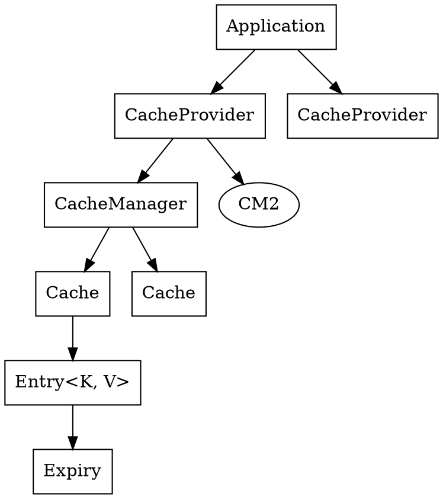

## 

Introduction

_JCache_ is the Java caching API.
It was defined by [JSR107](https://github.com/jsr107/jsr107spec).
It defines a standard Java Caching API for use by developers and a standard [SPI](/docs/CS/Java/JDK/Basic/SPI.md) for use by implementers.

```xml
<dependency>
  <groupId>javax.cache</groupId>
  <artifactId>cache-api</artifactId>
  <version>1.1.1</version>
</dependency>
```

- Caching
- CachingProvider
- CacheManager
- Cache
- Entry
- ExpirePolicy



JBoss Cache

监听POJO变化同步到从服务器
支持事务缓存
树状结构
支持集群

Guava cache
保证只有一个请求缓存

内存自动回收 轻量级

为何不使用map

内存管理复杂
过期策略定义
容量规划设计
线程安全
持久化
缓存一致性 同步


## Comparison


|              | 持久化 | 集群  | 轻量化 | 附加功能 | 兼容其它缓存框架 |
|--------------| ------ |-----|-----|------| --- |
| Ehcache      |   :white_check_mark:     |  :white_check_mark:    |  :x:     |  :white_check_mark:     | :x: |
| Guava Cache  |   :x:             | :x:      | :white_check_mark:   |   :x:    |  :x:      | :x: |
| Caffeine     |   :x:             | :x:      | :white_check_mark:   |   :x:    |  :x:      | :x: |
| Spring Cache |     :x:     | :x: |  :white_check_mark:   |    :x:    | :white_check_mark: |


## Links

- [Cache](/docs/CS/Cache.md)
- [Spring Cache](/docs/CS/Java/Spring/Cache.md)

## References

1. [JSR107(JCache)](https://github.com/jsr107/jsr107spec)
