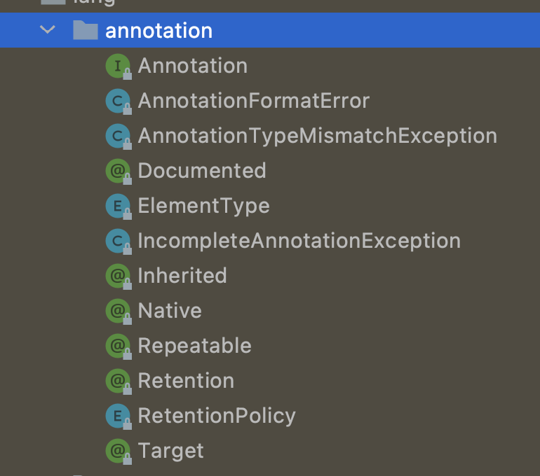

### Annotation Hierarchy



*The common interface extended by all annotation types. Note that an interface that manually extends this one does not define an annotation type. Also note that this interface does not itself define an annotation type. More information about annotation types can be found in section 9.6 of The Java Language Specification. The reflect.AnnotatedElement interface discusses compatibility concerns when evolving an annotation type from being non-repeatable to being repeatable.*

## Introduction

For example, see `@ResponseBody`:

```java
@Target({ElementType.TYPE, ElementType.METHOD})
@Retention(RetentionPolicy.RUNTIME)
@Documented
public @interface ResponseBody {
}
```

### Target

```java

/**
 * Indicates the contexts in which an annotation type is applicable. The
 * declaration contexts and type contexts in which an annotation type may be
 * applicable are specified in JLS 9.6.4.1, and denoted in source code by enum
 * constants of {@link ElementType java.lang.annotation.ElementType}.
 *
 * <p>If an {@code @Target} meta-annotation is not present on an annotation type
 * {@code T} , then an annotation of type {@code T} may be written as a
 * modifier for any declaration except a type parameter declaration.
 *
 * <p>If an {@code @Target} meta-annotation is present, the compiler will enforce
 * the usage restrictions indicated by {@code ElementType}
 * enum constants, in line with JLS 9.7.4.
 *
 * <p>For example, this {@code @Target} meta-annotation indicates that the
 * declared type is itself a meta-annotation type.  It can only be used on
 * annotation type declarations:
 * <pre>
 *    &#064;Target(ElementType.ANNOTATION_TYPE)
 *    public &#064;interface MetaAnnotationType {
 *        ...
 *    }
 * </pre>
 *
 * <p>This {@code @Target} meta-annotation indicates that the declared type is
 * intended solely for use as a member type in complex annotation type
 * declarations.  It cannot be used to annotate anything directly:
 * <pre>
 *    &#064;Target({})
 *    public &#064;interface MemberType {
 *        ...
 *    }
 * </pre>
 *
 * <p>It is a compile-time error for a single {@code ElementType} constant to
 * appear more than once in an {@code @Target} annotation.  For example, the
 * following {@code @Target} meta-annotation is illegal:
 * <pre>
 *    &#064;Target({ElementType.FIELD, ElementType.METHOD, ElementType.FIELD})
 *    public &#064;interface Bogus {
 *        ...
 *    }
 * </pre>
 *
 * @since 1.5
 * @jls 9.6.4.1 @Target
 * @jls 9.7.4 Where Annotations May Appear
 */
@Documented
@Retention(RetentionPolicy.RUNTIME)
@Target(ElementType.ANNOTATION_TYPE)
public @interface Target {
    /**
     * Returns an array of the kinds of elements an annotation type
     * can be applied to.
     * @return an array of the kinds of elements an annotation type
     * can be applied to
     */
    ElementType[] value();
}
```


#### ElementType
The constants of this enumerated type provide a simple classification of the syntactic locations where annotations may appear in a Java program. These constants are used in java.lang.annotation.Target meta-annotations to specify where it is legal to write annotations of a given type.
The syntactic locations where annotations may appear are split into declaration contexts , where annotations apply to declarations, and type contexts , where annotations apply to types used in declarations and expressions.
The constants ANNOTATION_TYPE , CONSTRUCTOR , FIELD , LOCAL_VARIABLE , METHOD , PACKAGE , PARAMETER , TYPE , and TYPE_PARAMETER correspond to the declaration contexts in JLS 9.6.4.1.
For example, an annotation whose type is meta-annotated with @Target(ElementType.FIELD) may only be written as a modifier for a field declaration.

The constant `TYPE_USE` corresponds to the 15 type contexts in JLS 4.11, as well as to two declaration contexts: type declarations (including annotation type declarations) and type parameter declarations.
For example, an annotation whose type is meta-annotated with @Target(ElementType.TYPE_USE) may be written on the type of a field (or within the type of the field, if it is a nested, parameterized, or array type), and may also appear as a modifier for, say, a class declaration.
The `TYPE_USE` constant includes type declarations and type parameter declarations as a convenience for designers of type checkers which give semantics to annotation types. For example, if the annotation type NonNull is meta-annotated with @Target(ElementType.TYPE_USE), then @NonNull class C {...} could be treated by a type checker as indicating that all variables of class C are non-null, while still allowing variables of other classes to be non-null or not non-null based on whether @NonNull appears at the variable's declaration.

```java
public enum ElementType {
    /** Class, interface (including annotation type), or enum declaration */
    TYPE,

    /** Field declaration (includes enum constants) */
    FIELD,

    /** Method declaration */
    METHOD,

    /** Formal parameter declaration */
    PARAMETER,

    /** Constructor declaration */
    CONSTRUCTOR,

    /** Local variable declaration */
    LOCAL_VARIABLE,

    /** Annotation type declaration */
    ANNOTATION_TYPE,

    /** Package declaration */
    PACKAGE,

    /**
     * Type parameter declaration
     *
     * @since 1.8
     */
    TYPE_PARAMETER,

    /**
     * Use of a type
     *
     * @since 1.8
     */
    TYPE_USE
}

```

### Retention

```java

/**
 * Indicates how long annotations with the annotated type are to
 * be retained.  If no Retention annotation is present on
 * an annotation type declaration, the retention policy defaults to
 * {@code RetentionPolicy.CLASS}.
 *
 * <p>A Retention meta-annotation has effect only if the
 * meta-annotated type is used directly for annotation.  It has no
 * effect if the meta-annotated type is used as a member type in
 * another annotation type.
 *
 * @author  Joshua Bloch
 * @since 1.5
 * @jls 9.6.3.2 @Retention
 */
@Documented
@Retention(RetentionPolicy.RUNTIME)
@Target(ElementType.ANNOTATION_TYPE)
public @interface Retention {
    /**
     * Returns the retention policy.
     * @return the retention policy
     */
    RetentionPolicy value();
}
```

SOURCE CLASS extends AbstractProccessor override process


Annotation retention policy. The constants of this enumerated type describe the various policies for retaining annotations. They are used in conjunction with the Retention meta-annotation type to specify how long annotations are to be retained.
```java
public enum RetentionPolicy {
    /**
     * Annotations are to be discarded by the compiler.
     */
    SOURCE,

    /**
     * Annotations are to be recorded in the class file by the compiler
     * but need not be retained by the VM at run time.  This is the default
     * behavior.
     */
    CLASS,

    /**
     * Annotations are to be recorded in the class file by the compiler and
     * retained by the VM at run time, so they may be read reflectively.
     *
     * @see java.lang.reflect.AnnotatedElement
     */
    RUNTIME
}
```


#### AnnotatedElement

`java.lang.reflect.AnnotatedElement`

*Represents an annotated element of the program currently running in this VM. T**his interface allows annotations to be read reflectively**. **All annotations returned by methods in this interface are immutable and serializable**. The arrays returned by methods of this interface may be modified by callers without affecting the arrays returned to other callers.*

*The **getAnnotationsByType(Class)** and **getDeclaredAnnotationsByType(Class)** methods support multiple annotations of the same type on an element. If the argument to either method is a repeatable annotation type (JLS 9.6), then the method will "look through" a container annotation (JLS 9.7), if present, and return any annotations inside the container. Container annotations may be generated at compile-time to wrap multiple annotations of the argument type.*


*The terms directly present, indirectly present, present, and associated are used throughout this interface to describe precisely which annotations are returned by methods:*

1. *An annotation A is directly present on an element E if E has a RuntimeVisibleAnnotations or RuntimeVisibleParameterAnnotations or RuntimeVisibleTypeAnnotations attribute, and the attribute contains A.*
2. *An annotation A is indirectly present on an element E if E has a RuntimeVisibleAnnotations or RuntimeVisibleParameterAnnotations or RuntimeVisibleTypeAnnotations attribute, and A 's type is repeatable, and the attribute contains exactly one annotation whose value element contains A and whose type is the containing annotation type of A 's type.*
3. *An annotation A is present on an element E if either:*
   1. *A is directly present on E; or*
   2. *No annotation of A 's type is directly present on E, and E is a class, and A 's type is inheritable, and A is present on the superclass of E.*
4. *An annotation A is associated with an element E if either:*
   1. *A is directly or indirectly present on E; or*
   2. *No annotation of A 's type is directly or indirectly present on E, and E is a class, and A's type is inheritable, and A is associated with the superclass of E.*


### Documented

```java

/**
 * Indicates that annotations with a type are to be documented by javadoc
 * and similar tools by default.  This type should be used to annotate the
 * declarations of types whose annotations affect the use of annotated
 * elements by their clients.  If a type declaration is annotated with
 * Documented, its annotations become part of the public API
 * of the annotated elements.
 *
 * @author  Joshua Bloch
 * @since 1.5
 */
@Documented
@Retention(RetentionPolicy.RUNTIME)
@Target(ElementType.ANNOTATION_TYPE)
public @interface Documented {
}
```


### Inherited

```java

/**
 * Indicates that an annotation type is automatically inherited.  If
 * an Inherited meta-annotation is present on an annotation type
 * declaration, and the user queries the annotation type on a class
 * declaration, and the class declaration has no annotation for this type,
 * then the class's superclass will automatically be queried for the
 * annotation type.  This process will be repeated until an annotation for this
 * type is found, or the top of the class hierarchy (Object)
 * is reached.  If no superclass has an annotation for this type, then
 * the query will indicate that the class in question has no such annotation.
 *
 * <p>Note that this meta-annotation type has no effect if the annotated
 * type is used to annotate anything other than a class.  Note also
 * that this meta-annotation only causes annotations to be inherited
 * from superclasses; annotations on implemented interfaces have no
 * effect.
 *
 * @author  Joshua Bloch
 * @since 1.5
 * @jls 9.6.3.3 @Inherited
 */
@Documented
@Retention(RetentionPolicy.RUNTIME)
@Target(ElementType.ANNOTATION_TYPE)
public @interface Inherited {
}
```

### Example

see dubbo `@SPI` getExtension


```java

/**
 * Marker for extension interface
 * <p/>
 * Changes on extension configuration file <br/>
 * Use <code>Protocol</code> as an example, its configuration file 'META-INF/dubbo/com.xxx.Protocol' is changed from: <br/>
 * <pre>
 *     com.foo.XxxProtocol
 *     com.foo.YyyProtocol
 * </pre>
 * <p>
 * to key-value pair <br/>
 * <pre>
 *     xxx=com.foo.XxxProtocol
 *     yyy=com.foo.YyyProtocol
 * </pre>
 * <br/>
 * The reason for this change is:
 * <p>
 * If there's third party library referenced by static field or by method in extension implementation, its class will
 * fail to initialize if the third party library doesn't exist. In this case, dubbo cannot figure out extension's id
 * therefore cannot be able to map the exception information with the extension, if the previous format is used.
 * <p/>
 * For example:
 * <p>
 * Fails to load Extension("mina"). When user configure to use mina, dubbo will complain the extension cannot be loaded,
 * instead of reporting which extract extension implementation fails and the extract reason.
 * </p>
 */
@Documented
@Retention(RetentionPolicy.RUNTIME)
@Target({ElementType.TYPE})
public @interface SPI {

    /**
     * default extension name
     */
    String value() default "";

}
```

```java
package org.apache.dubbo.common.extension.factory;

import org.apache.dubbo.common.extension.ExtensionFactory;
import org.apache.dubbo.common.extension.ExtensionLoader;
import org.apache.dubbo.common.extension.SPI;

/**
 * SpiExtensionFactory
 */
public class SpiExtensionFactory implements ExtensionFactory {

    @Override
    public <T> T getExtension(Class<T> type, String name) {
        if (type.isInterface() && type.isAnnotationPresent(SPI.class)) {
            ExtensionLoader<T> loader = ExtensionLoader.getExtensionLoader(type);
            if (!loader.getSupportedExtensions().isEmpty()) {
                return loader.getAdaptiveExtension();
            }
        }
        return null;
    }

}
```