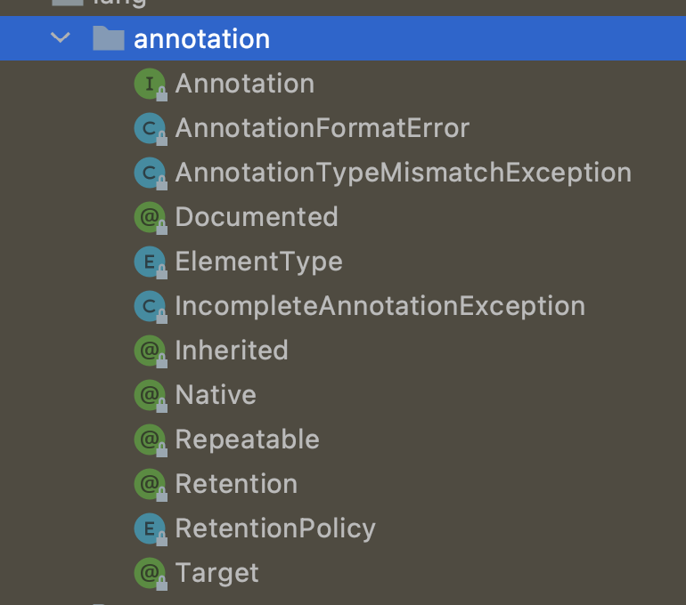

## Introduction

在 Java 编程语言中，Annotation（注解）是一种特殊的语法元数据形式，可以添加到 Java 源代码中。
类、方法、变量、参数和包都可以被注解。
**注解对其所注解的代码的操作没有直接影响。**

注解有多种用途，包括：

- 为编译器提供信息——编译器可以使用注解来检测错误或抑制警告。
- 编译时和部署时处理——软件工具可以处理注解信息以生成代码、XML 文件等。
- 运行时处理——某些注解可以在运行时被检查和利用。

在 Java 中，可以通过现有注解创建元注解，这使得这个概念更加复杂。
Java 定义了一组内置于语言中的注解。

应用于 Java 代码的注解：

- @Override – 检查函数是否为重写。如果在父类中未找到该函数，则引发编译警告。
- @Deprecated – 将函数标记为已过时。如果使用该函数，则引发编译警告。
- @SuppressWarnings – 指示编译器抑制注解参数中指定的编译时警告。

Repeating Annotations 提供了对同一声明或类型使用多次应用相同注解类型的能力。
Type Annotations 提供了在任何使用类型的地方应用注解的能力，而不仅仅是在声明上。与可插拔类型系统一起使用时，此功能可以改进代码的类型检查。

应用于其他注解的注解：

- @Retention – 指定标记的注解如何存储——仅在代码中、编译到类中，或通过反射在运行时可用。
- @Documented – 将另一个注解标记为包含在文档中。
- @Target – 标记另一个注解以限制该注解可能应用于的 Java 元素类型。
- @Inherited – 标记另一个注解以使其被继承到**被注解类**的子类（默认情况下注解不会继承到子类）。

### Annotation Hierarchy



所有注解类型扩展的公共接口。请注意，手动扩展此接口的接口并不定义注解类型。
同时注意，此接口本身并不定义注解类型。
`reflect.AnnotatedElement` 接口讨论了当注解类型从不可重复演变为可重复时的兼容性问题。

```java
public interface Annotation {

   boolean equals(Object obj);

   int hashCode();

   String toString();

   Class<? extends Annotation> annotationType();
}
```

## Meta-annotation

### Target

指示注解类型适用的上下文。
注解类型可能适用的声明上下文和类型上下文在 JLS 9.6.4.1 中指定，并在源代码中通过 `java.lang.annotation.ElementType` 的枚举常量来表示。

```java
@Documented
@Retention(RetentionPolicy.RUNTIME)
@Target(ElementType.ANNOTATION_TYPE)
public @interface Target {
    ElementType[] value();
}
```

#### ElementType

此枚举类型的常量提供了注解在 Java 程序中可能出现的语法位置的简单分类。
这些常量用于 java.lang.annotation.Target 元注解中，以指定在何处可以编写给定类型的注解。
注解可能出现的语法位置分为声明上下文（注解应用于声明）和类型上下文（注解应用于声明和表达式中使用的类型）。
常量 ANNOTATION_TYPE、CONSTRUCTOR、FIELD、LOCAL_VARIABLE、METHOD、PACKAGE、PARAMETER、TYPE 和 TYPE_PARAMETER 对应于 JLS 9.6.4.1 中的声明上下文。
例如，使用 @Target(ElementType.FIELD) 元注解的注解类型只能作为字段声明的修饰符编写。

常量 `TYPE_USE` 对应于 JLS 4.11 中的 15 个类型上下文，以及两个声明上下文：类型声明（包括注解类型声明）和类型参数声明。
例如，使用 @Target(ElementType.TYPE_USE) 元注解的注解类型可以写在字段的类型上（如果字段是嵌套、参数化或数组类型，也可以写在字段类型内部），
也可以作为类声明的修饰符出现。
`TYPE_USE` 常量包括类型声明和类型参数声明，作为对给注解类型赋予语义的类型检查器设计者的便利。
例如，如果注解类型 NonNull 使用 @Target(ElementType.TYPE_USE) 元注解，那么 @NonNull class C {...} 可以被类型检查器视为指示类 C 的所有变量都是非空的，
同时仍然允许其他类的变量根据 @NonNull 是否出现在变量声明处而为非空或非非空。

```java
public enum ElementType {
    TYPE,
    FIELD,
    METHOD,
    PARAMETER,
    CONSTRUCTOR,
    LOCAL_VARIABLE,
    ANNOTATION_TYPE,
    PACKAGE,
    TYPE_PARAMETER,
    TYPE_USE
}
```

### Retention

指示带有被注解类型的注解应保留多长时间。
如果注解类型声明上没有出现 Retention 注解，则保留策略默认为 RetentionPolicy.CLASS。

Retention 元注解仅在元注解类型直接用于注解时生效。
如果元注解类型作为成员类型用于其他注解类型中，则无效。

```java
@Documented
@Retention(RetentionPolicy.RUNTIME)
@Target(ElementType.ANNOTATION_TYPE)
public @interface Retention {
    RetentionPolicy value();
}
```

SOURCE CLASS extends AbstractProccessor override process

注解保留策略。此枚举类型的常量描述了保留注解的各种策略。它们与 Retention 元注解类型一起使用，以指定注解应保留多长时间。

```java
public enum RetentionPolicy {
   SOURCE,
   CLASS,
   RUNTIME
}
```

#### AnnotatedElement

`java.lang.reflect.AnnotatedElement`

表示当前 VM 中运行的程序的一个被注解的元素。此接口允许通过反射读取注解。
此接口中方法返回的所有注解都是不可变且可序列化的。
此接口方法返回的数组可以由调用者修改，而不会影响返回给其他调用者的数组。

*getAnnotationsByType(Class)* 和 *getDeclaredAnnotationsByType(Class)* 方法支持元素上同一类型的多个注解。
如果任一方法的参数是可重复注解类型（JLS 9.6），则该方法将"透视"容器注解（JLS 9.7）（如果存在），并返回容器内的任何注解。
容器注解可以在编译时生成，以包装参数类型的多个注解。

*术语直接存在、间接存在、存在和关联在整个此接口中使用，以精确描述哪些注解由方法返回：

1. 如果元素 E 具有 RuntimeVisibleAnnotations 或 RuntimeVisibleParameterAnnotations 或 RuntimeVisibleTypeAnnotations 属性，并且该属性包含 A，则注解 A 直接存在于元素 E 上。
2. 如果元素 E 具有 RuntimeVisibleAnnotations 或 RuntimeVisibleParameterAnnotations 或 RuntimeVisibleTypeAnnotations 属性，并且 A 的类型是可重复的，并且该属性恰好包含一个注解，其 value 元素包含 A，且其类型是 A 类型的包含注解类型，则注解 A 间接存在于元素 E 上。
3. 如果以下任一条件成立，则注解 A 存在于元素 E 上：
   1. A 直接存在于 E 上；或
   2. E 是类，A 的类型是可继承的，且 A 存在于 E 的超类上。
4. 如果以下任一条件成立，则注解 A 与元素 E 关联：
   1. A 直接或间接存在于 E 上；或
   2. E 是类，A 的类型是可继承的，且 A 与 E 的超类关联。

### Documented

如果注解 @Documented 存在于注解类型 A 的声明上，那么任何元素上的 @A 注解都被视为该元素公共契约的一部分。
更详细地说，当注解类型 A 被 Documented 注解时，A 类型注解的存在和值是 A 所注解元素的公共契约的一部分。
相反，如果注解类型 B 未被 Documented 注解，则 B 注解的存在和值不是 B 所注解元素的公共契约的一部分。
具体来说，如果注解类型被 Documented 注解，默认情况下像 javadoc 这样的工具会在其输出中显示该类型的注解，而没有 Documented 的注解类型则不会显示。

```java
@Documented
@Retention(RetentionPolicy.RUNTIME)
@Target(ElementType.ANNOTATION_TYPE)
public @interface Documented {
}
```

### Inherited

指示注解类型是否自动继承。
如果注解类型声明上存在 Inherited 元注解，并且用户在类声明上查询该注解类型，
而该类声明没有此类型的注解，那么将自动查询该类的超类以获取此注解类型。
此过程将重复，直到找到此类型的注解，或到达类层次结构的顶部（Object）。
如果没有超类具有此类型的注解，则查询将指示该类没有此类注解。

> [!NOTE]
>
> Note that this meta-annotation type has no effect if the annotated type is used to annotate anything other than a class. 
> Note also that this meta-annotation only causes annotations to be inherited from superclasses; annotations on implemented interfaces have no effect.

> AnnotatedElementUtil#findMergedAnnotation could help us. 

```java
@Documented
@Retention(RetentionPolicy.RUNTIME)
@Target(ElementType.ANNOTATION_TYPE)
public @interface Inherited {
}
```

## Implementations

See [Dubbo SPI](/docs/CS/Framework/Dubbo/SPI.md)

```java
@Documented
@Retention(RetentionPolicy.RUNTIME)
@Target({ElementType.TYPE})
public @interface SPI {

    String value() default "";

}
```

## Links

- [JDK basics](/docs/CS/Java/JDK/Basic/Basic.md)
