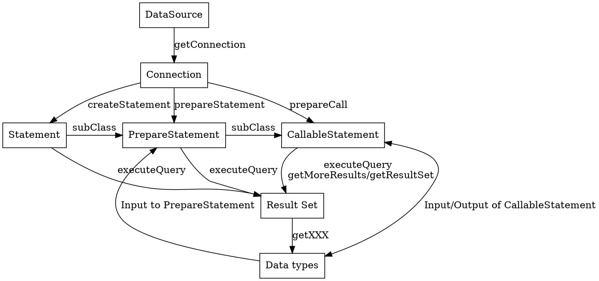

## Introduction

Connection isClose() or isValid()

## PreparStatement
It's safety to use #{} replace \${}

## Links
- [JDK basics](/docs/CS/Java/JDK/Basic/Basic.md)
- [MyBatis](/docs/CS/Java/MyBatis/MyBatis.md)