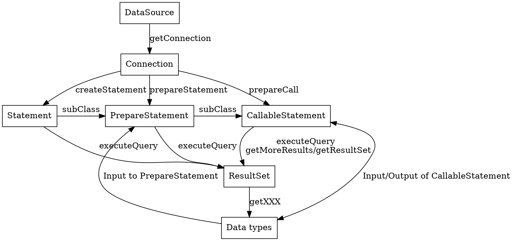

## Introduction

```dot
strict digraph {

    source [shape="polygon" label="DataSource"]
    conn [shape="polygon" label="Connection"]
    source -> conn [label="getConnection"]
    st [shape="polygon" label="Statement"]
    pr [shape="polygon" label="PrepareStatement"]
    ca [shape="polygon" label="CallableStatement"]
    {rank="same"; st;pr;ca;}
    data [shape="polygon" label="Data types"]
    re [shape="polygon" label="ResultSet"]
    re -> data [label="getXXX"]
    st -> pr [label="subClass"]
    pr -> ca [label="subClass"]
    conn -> st [label="createStatement"]
    conn -> pr [label="prepareStatement"]
    conn -> ca [label="prepareCall"]
    data -> pr [label="Input to PrepareStatement"]
    data -> ca [label="Input/Output of CallableStatement" dir = both]
    st -> re [label="executeQuery"]
    pr -> re [label="executeQuery"]
    
    ca -> re [label="executeQuery \n getMoreResults/getResultSet"]
}
```

通过 isClose() 或 isValid() 检查连接状态

## PrepareStatement

提前生成执行计划
- 性能稍微好一点
- 执行引擎按照执行计划执行 可以防SQL注入

使用 #{} 替代 ${} 是安全的

## DriverManager

NOTE: javax.sql.DataSource 接口提供了另一种连接数据源的方式。
使用 DataSource 对象是连接数据源的首选方式。
作为初始化的一部分，DriverManager 类将尝试通过以下方式加载可用的 JDBC drivers：

jdbc.drivers 系统属性，包含以冒号分隔的 JDBC driver 完全限定类名列表。
每个 driver 使用系统类加载器加载：
jdbc.drivers=foo.bah.Driver:wombat.sql.Driver:bad.taste.ourDriver

`java.sql.Driver` 类的服务提供者，通过 [service-provider loading](/docs/CS/Java/JDK/Basic/SPI.md) 机制加载。
 

## Links
- [JDK basics](/docs/CS/Java/JDK/Basic/Basic.md)
- [MyBatis](/docs/CS/Framework/MyBatis/MyBatis.md)