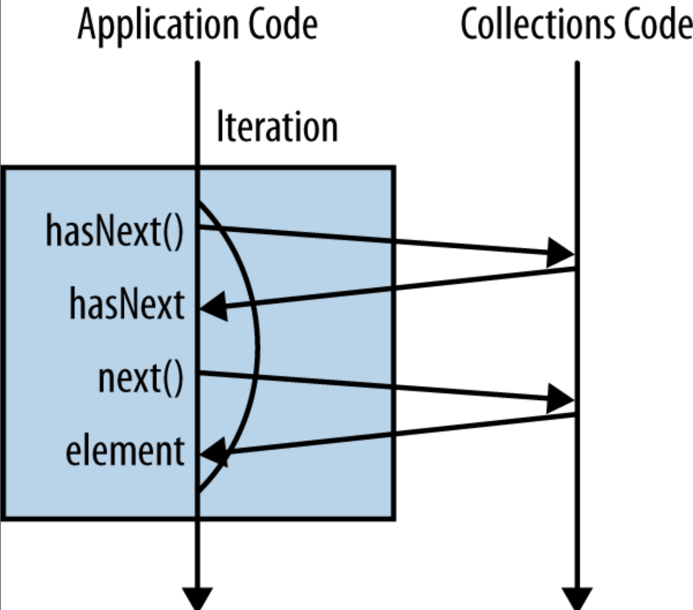
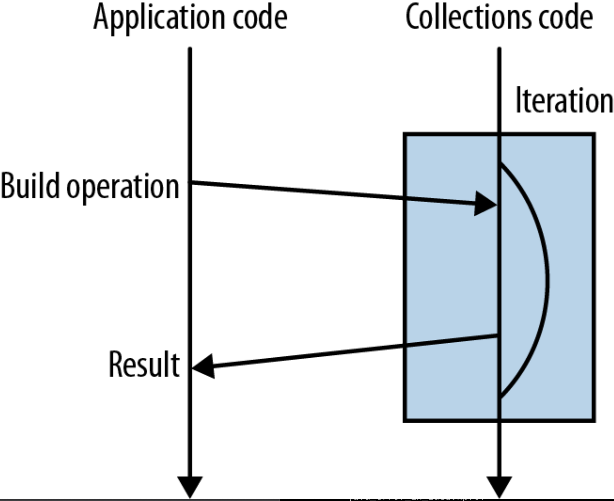

## Lambda


### Anonymous Inner Class


- new Anonymous Inner Class
- invokespecial

```java
public static void main(String[] args) {
     Thread thread = new Thread(new Runnable() {
        @Override
        public void run() {
            System.out.println("Hello World!");
        }
    });

}
```

```java
public static void main(java.lang.String[]);
    Code:
       0: new           #2                  // class java/lang/Thread
       3: dup
       4: new           #3                  // class com/yh/base/ArrayTest$1
       7: dup
       8: invokespecial #4                  // Method com/yh/base/ArrayTest$1."<init>":()V
      11: invokespecial #5                  // Method java/lang/Thread."<init>":(Ljava/lang/Runnable;)V
      14: astore_1
      15: return
```


### invokedynamic


```java
 public static void main(String[] args) {
         Thread thread = new Thread(() -> System.out.println("Hello World!"));

    }
```

```
 public static void main(java.lang.String[]);
    Code:
       0: new           #2                  // class java/lang/Thread
       3: dup
       4: invokedynamic #3,  0              // InvokeDynamic #0:run:()Ljava/lang/Runnable;
       9: invokespecial #4                  // Method java/lang/Thread."<init>":(Ljava/lang/Runnable;)V
      12: astore_1
      13: return
```

javap
```shell
InnerClasses:
  public static final #58= #57 of #61;    // Lookup=class java/lang/invoke/MethodHandles$Lookup of class java/lang/invoke/MethodHandles
BootstrapMethods:
  0: #29 REF_invokeStatic java/lang/invoke/LambdaMetafactory.metafactory:(Ljava/lang/invoke/MethodHandles$Lookup;Ljava/lang/String;Ljava/lang/invoke/MethodType;Ljava/lang/invoke/MethodType;Ljava/lang/invoke/MethodHandle;Ljava/lang/invoke/MethodType;)Ljava/lang/invoke/CallSite;
    Method arguments:
      #30 ()V
      #31 REF_invokeStatic com/yh/framework/netty/thread/FastThreadLocalTest.lambda$main$0:()V
      #30 ()V
```

MethodType

CallSite

java.lang.invoke.CallSite

1. 使用invokedynamic指令，运行时调用LambdaMetafactory.metafactory动态的生成内部类，实现了接口，
2. 内部类里的调用方法块并不是动态生成的，只是在原class里已经编译生成了一个静态的方法，内部类只需要调用该静态方法

Compare

- Anonymous Inner Class create object every time and GC immediately
- Lambda in need not to load Class


```
-Djdk.internal.lambda.dumpProxyClasses=/DUMP/PATH
```


Creates a hidden class or interface from bytes, returning a Lookup on the newly created class or interface.

Ordinarily, a class or interface C is created by a class loader, which either defines C directly or delegates to another class loader. A class loader defines C directly by invoking ClassLoader::defineClass, which causes the Java Virtual Machine to derive C from a purported representation in class file format. In situations where use of a class loader is undesirable, a class or interface C can be created by this method instead. This method is capable of defining C, and thereby creating it, without invoking ClassLoader::defineClass. Instead, this method defines C as if by arranging for the Java Virtual Machine to derive a nonarray class or interface C from a purported representation in class file format using the following rules:

- The lookup modes for this Lookup must include full privilege access. This level of access is needed to create C in the module of the lookup class of this Lookup.
- The purported representation in bytes must be a ClassFile structure of a supported major and minor version. The major and minor version may differ from the class file version of the lookup class of this Lookup.
- The value of this_class must be a valid index in the constant_pool table, and the entry at that index must be a valid CONSTANT_Class_info structure. Let N be the binary name encoded in internal form that is specified by this structure. N must denote a class or interface in the same package as the lookup class.
- Let CN be the string N + "." + <suffix>, where <suffix> is an unqualified name.
  Let newBytes be the ClassFile structure given by bytes with an additional entry in the constant_pool table, indicating a CONSTANT_Utf8_info structure for CN, and where the CONSTANT_Class_info structure indicated by this_class refers to the new CONSTANT_Utf8_info structure.
  Let L be the defining class loader of the lookup class of this Lookup.
  C is derived with name CN, class loader L, and purported representation newBytes as if by the rules of JVMS , with the following adjustments:
  - The constant indicated by this_class is permitted to specify a name that includes a single "." character, even though this is not a valid binary class or interface name in internal form.
  - The Java Virtual Machine marks L as the defining class loader of C, but no class loader is recorded as an initiating class loader of C.
  - C is considered to have the same runtime package, module and protection domain as the lookup class of this Lookup.
  - Let GN be the binary name obtained by taking N (a binary name encoded in internal form) and replacing ASCII forward slashes with ASCII periods. For the instance of Class representing C:
    - Class.getName() returns the string GN + "/" + <suffix>, even though this is not a valid binary class or interface name.
    - Class.descriptorString() returns the string "L" + N + "." + <suffix> + ";", even though this is not a valid type descriptor name.
    - Class.describeConstable() returns an empty optional as C cannot be described in nominal form.

```java
public Lookup defineHiddenClass(byte[] bytes, boolean initialize, ClassOption... options)
                throws IllegalAccessException
   {
		...
    return makeHiddenClassDefiner(bytes.clone(), Set.of(options), false).defineClassAsLookup(initialize);
}

Lookup defineClassAsLookup(boolean initialize) {
    Class<?> c = defineClass(initialize, null);
    return new Lookup(c, null, FULL_POWER_MODES);
}
```


## Functional Interface

*There are some interfaces in Java that have only a single method but aren’t normally meant to be implemented by lambda expressions. For example, they might assume that the object has internal state and be interfaces with a single method only coincidentally. A couple of good examples are **java.lang.Comparable** and **java.io.Closeable**.*

*In contrast to Closeable and Comparable, all the new interfaces introduced in order to provide Stream interoperability are expected to be implemented by lambda expressions. They are really there to **bundle up blocks of code as data**. Consequently, they have the @FunctionalInterface annotation applied.*


| Functional Interface | Parameter Type | Return Type | Scence |
| -------------------- | -------------- | ----------- | ------ |
| Consumer             | T              | void        |        |
| Supplier             | -              | T           |        |
| Function<T,R>        | T              | R           |        |
| Predicate            | T              | boolean     |        |


| Functional Interface | Parameter Type | Return Type | Scence                |
| -------------------- | -------------- | ----------- | --------------------- |
| Comparator<T>        | T              | int         | A comparison function |
|                      |                |             |                       |
|                      |                |             |                       |
|                      |                |             |                       |
|                      |                |             |                       |
|                      |                |             |                       |


## Stream

*A Stream is a tool for building up complex operations on collections using a functional approach.*

### Iterator & Stream

*Counting London-based artists using a for loop*

```java
int count = 0;
for (Artist artist : allArtists) {
    if (artist.isFrom("London")) {
        count++;
    }
}
```

*Looking under the covers a little bit, the for loop is actually syntactic sugar that wraps up the iteration and hides it. It’s worth taking a moment to look at what’s going on under the hood here. The first step in this process is a call to the iterator method, which creates a new **Iterator** object in order to control the iteration process. We call this **external iteration**. The iteration then proceeds by explicitly calling the hasNext and next methods on this Iterator.*

*Counting London-based artists using an iterator*

```java
int count = 0;
Iterator<Artist> iterator = allArtists.iterator();
while(iterator.hasNext()) {
    Artist artist = iterator.next();
    if (artist.isFrom("London")) {
        count++;
    }
}
```





*Counting London-based artists using internal iteration*

```java
long count = allArtists.stream()
                       .filter(artist -> artist.isFrom("London"))
                       .count();
```




It’s very easy to figure out whether an operation is eager or lazy: **look at what it returns.**

- If it gives you back a Stream, it’s lazy
- if it gives you back another value or void, then it’s eager

*This makes sense because the preferred way of using these methods is to form a sequence of lazy operations chained together and then to have a single eager operation at the end that generates your result.*


1. 过滤器因为支持在迭代过程中结束处理，所以有很大的性能优势
2. 即使都要处理整个数据集，一个过滤器还是要比一个迭代器稍微快些
3. 多个过滤器有些开销，所以要确保编写好用的过滤器


### Generate Stream

#### Collection

*Collection provide a **default method** to avert all third-party collections libraries being broken.*

*default methods are designed primarily to allow binary compatible API evolution. Allowing classes to win over any default methods simplifies a lot of Hierarchy scenarios.*

#### Arrays

#### Stream 

of()

empty()

iterate() generate()


###  Parallel

Returns an equivalent stream that is parallel. May return itself, either because the stream was already parallel, or because the underlying stream state was modified to be parallel.
This is an intermediate operation.

```java
// BaseStream
S parallel();

// AbstractPipeline
@Override
@SuppressWarnings("unchecked")
public final S parallel() {
  sourceStage.parallel = true;
  return (S) this;
}
```


```java
// Stream
T reduce(T identity, BinaryOperator<T> accumulator);

// ReferencePipeline extends AbstractPipeline implements Stream
@Override
public final P_OUT reduce(final P_OUT identity, final BinaryOperator<P_OUT> accumulator) {
  return evaluate(ReduceOps.makeRef(identity, accumulator, accumulator)); // ReduceOps
}

final <R> R evaluate(TerminalOp<E_OUT, R> terminalOp) {
    assert getOutputShape() == terminalOp.inputShape();
    if (linkedOrConsumed)
        throw new IllegalStateException(MSG_STREAM_LINKED);
    linkedOrConsumed = true;

    return isParallel()
           ? terminalOp.evaluateParallel(this, sourceSpliterator(terminalOp.getOpFlags()))
           : terminalOp.evaluateSequential(this, sourceSpliterator(terminalOp.getOpFlags()));
}
```


ReduceTask is a [ForkJoinTask](/docs/CS/Java/JDK/Concurrency/ForkJoinPool.md) for performing a parallel reduce operation.

based on `ForkJoinPool.commonPool()`

```java
// ReduceOps
@Override
public <P_IN> R evaluateParallel(PipelineHelper<T> helper,
                                 Spliterator<P_IN> spliterator) {
    return new ReduceTask<>(this, helper, spliterator).invoke().get();
}
```


#### Use caution when making streams parallel

As a rule, performance gains from parallelism are best on streams over ArrayList, HashMap, HashSet, and ConcurrentHashMap instances; arrays; int ranges; and long ranges. What these data structures have in common is that they can all be accurately and cheaply split into subranges of any desired sizes, which makes it easy to divide work among parallel threads.

Another important factor that all of these data structures have in common is that they provide good-to-excellent locality of reference when processed sequentially: sequential element references are stored together in memory.

Not only can parallelizing a stream lead to poor performance, including liveness failures; it can lead to incorrect results and unpredictable behavior (`safety failures`).


### Method

**collect(toList)**

*collect(toList()) is an eager operation that generates a list from the values in a Stream.*

**map**

*If you’ve got a function that converts a value of one type into another, map lets you apply this function to a stream of values, producing another stream of the new values.*


**filter**

*Any time you’re looping over some data and checking each element, you might want to think about using the new filter method on Stream.*

use Predicate interface

**flatMap**

*flatMap lets you replace a value with a Stream and concatenates all the streams together.*


### Key Points

*Whenever you pass lambda expressions into the higher-order functions on the Stream interface, you should seek to **avoid side effects**. The only exception to this is the **forEach** method, which is a terminal operation.*


*A significant performance advantage can be had by **using primitive specialized lambda expressions and streams** such as IntStream.*


## Reference

1. [底层原理之旅—带你看透Lambda表达式的本质](https://juejin.cn/post/6966839856421044237)