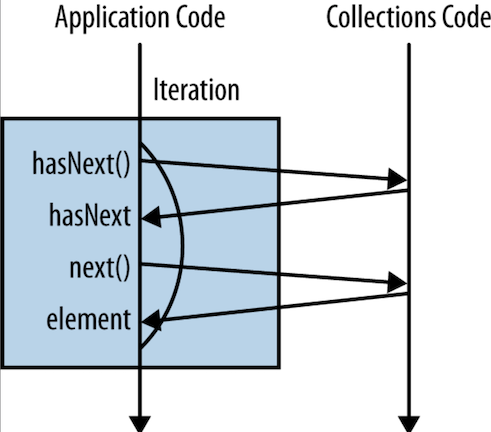
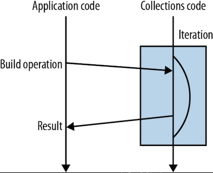

## Lambda expressions

In computer programming, an anonymous function (function literal, lambda abstraction, lambda function, lambda expression or block) is a function definition that is not bound to an identifier.
Anonymous functions are often arguments being passed to higher-order functions or used for constructing the result of a higher-order function that needs to return a function.
If the function is only used once, or a limited number of times, an anonymous function may be syntactically lighter than using a named function.
Anonymous functions are ubiquitous in functional programming languages and other languages with first-class functions, where they fulfil the same role for the function type as literals do for other data types.

The names "lambda abstraction", "lambda function", and "lambda expression" refer to the notation of function abstraction in lambda calculus, where the usual function f(x) = M would be written (λx.M) (M is an expression that uses x).
Compare to the Python syntax of lambda x: M.
The name "arrow function" refers to the mathematical "maps to" symbol, x ↦ M. Compare to the JavaScript syntax of x => M.

Anonymous functions can be used for containing functionality that need not be named and possibly for short-term use. Some notable examples include closures and currying.

**The use of anonymous functions is a matter of style.**
Using them is never the only way to solve a problem; each anonymous function could instead be defined as a named function and called by name.
Some programmers use anonymous functions to encapsulate specific, non-reusable code without littering the code with a lot of little one-line normal functions.

In some programming languages, anonymous functions are commonly implemented for very specific purposes such as binding events to callbacks or instantiating the function for particular values, which may be more efficient, more readable, and less error-prone than calling a more-generic named function.

Closures are functions evaluated in an environment containing bound variables. The following example binds the variable "threshold" in an anonymous function that compares the input to the threshold.

It would be impractical to create a function for every possible comparison function and may be too inconvenient to keep the threshold around for further use.
Regardless of the reason why a closure is used, the anonymous function is the entity that contains the functionality that does the comparing.

Currying is the process of changing a function so that rather than taking multiple inputs, it takes a single input and returns a function which accepts the second input, and so forth.
In this example, a function that performs division by any integer is transformed into one that performs division by a set integer.

While the use of anonymous functions is perhaps not common with currying, it still can be used. In the above example, the function divisor generates functions with a specified divisor.
The functions half and third curry the divide function with a fixed divisor.

The divisor function also forms a closure by binding the variable d.

A higher-order function is a function that takes a function as an argument.
This is commonly used to customize the behavior of a generically defined function, often a looping construct or recursion scheme.
Anonymous functions are a convenient way to specify such function arguments.

A fold function runs over all elements in a structure (for lists usually left-to-right, a "left fold", called reduce in Python), accumulating a value as it goes.
This can be used to combine all elements of a structure into one value, for example:

Like local and anonymous classes, lambda expressions can capture variables; they have the same access to local variables of the enclosing scope.
However, unlike local and anonymous classes, lambda expressions do not have any [shadowing](/docs/CS/Java/JDK/Basic/Object.md?id=Shadowing) issues.
Lambda expressions are lexically scoped. This means that they do not inherit any names from a supertype or introduce a new level of scoping.
Declarations in a lambda expression are interpreted just as they are in the enclosing environment.

Lambda Expressions, a new language feature, has been introduced in this release.
They enable you to treat functionality as a method argument, or code as data.
Lambda expressions let you express instances of single-method interfaces (referred to as functional interfaces) more compactly.

### Method References

Sometimes, however, a lambda expression does nothing but call an existing method.
In those cases, it's often clearer to refer to the existing method by name.
Method references enable you to do this; they are compact, easy-to-read lambda expressions for methods that already have a name.

- Anonymous Inner Class -> invokespecial
- lambda -> invokedynamic


lambda中参数不可变 实质就是类函数形参 在编译完之后到局部变量表一样 是不可变

<!-- tabs:start -->

#### **Anonymous Inner Class**

```java
public static void main(String[] args) {
     Thread thread = new Thread(new Runnable() {
        @Override
        public void run() {
            System.out.println("Hello World!");
        }
    });

}

public static void main(java.lang.String[]);
    Code:
       0: new           #2                  // class java/lang/Thread
       3: dup
       4: new           #3                  // class com/yh/base/ArrayTest$1
       7: dup
       8: invokespecial #4                  // Method com/yh/base/ArrayTest$1."<init>":()V
      11: invokespecial #5                  // Method java/lang/Thread."<init>":(Ljava/lang/Runnable;)V
      14: astore_1
      15: return
```

#### **lambda**

```java
 public static void main(String[] args) {
         Thread thread = new Thread(() -> System.out.println("Hello World!"));

    }

 public static void main(java.lang.String[]);
    Code:
       0: new           #2                  // class java/lang/Thread
       3: dup
       4: invokedynamic #3,  0              // InvokeDynamic #0:run:()Ljava/lang/Runnable;
       9: invokespecial #4                  // Method java/lang/Thread."<init>":(Ljava/lang/Runnable;)V
      12: astore_1
      13: return

InnerClasses:
public static final #58= #57 of #61;    // Lookup=class java/lang/invoke/MethodHandles$Lookup of class java/lang/invoke/MethodHandles
        BootstrapMethods:
        0: #29 REF_invokeStatic java/lang/invoke/LambdaMetafactory.metafactory:(Ljava/lang/invoke/MethodHandles$Lookup;Ljava/lang/String;Ljava/lang/invoke/MethodType;Ljava/lang/invoke/MethodType;Ljava/lang/invoke/MethodHandle;Ljava/lang/invoke/MethodType;)Ljava/lang/invoke/CallSite;
        Method arguments:
        #30 ()V
        #31 REF_invokeStatic com/yh/framework/netty/thread/FastThreadLocalTest.lambda$main$0:()V
        #30 ()V
```

<!-- tabs:end -->

[JEP 276: Dynamic Linking of Language-Defined Object Models](https://openjdk.java.net/jeps/276)

> See [Bytecodes meet Combinators: invokedynamic on the JVM](http://cr.openjdk.java.net/~jrose/pres/200910-VMIL.pdf).

### Method Handles

A method handle is a typed, directly executable reference to an underlying method, constructor, field, or similar low-level operation, with optional transformations of arguments or return values.
These transformations are quite general, and include such patterns as conversion, insertion, deletion, and substitution.


方法句柄的类型（MethodType）是由所指向方法的参数类型以及返回类型组成的。它是
用来确认方法句柄是否适配的唯一关键。当使用方法句柄时，我们其实并不关心方法句柄所
指向方法的类名或者方法名

方法句柄的创建是通过 MethodHandles.Lookup 类来完成的。它提供了多个 API，既可
以使用反射 API 中的 Method 来查找，也可以根据类、方法名以及方法句柄类型来查找


方法句柄同样也有权限问题。但它与反射 API 不同，其权限检查是在句柄的创建阶段完成
的。在实际调用过程中，Java 虚拟机并不会检查方法句柄的权限。如果该句柄被多次调用
的话，那么与反射调用相比，它将省下重复权限检查的开销。
需要注意的是，方法句柄的访问权限不取决于方法句柄的创建位置，而是取决于 Lookup
对象的创建位置。

CallSite

java.lang.invoke.CallSite

1. 使用invokedynamic指令，运行时调用LambdaMetafactory.metafactory动态的生成内部类，实现了接口，
2. 内部类里的调用方法块并不是动态生成的，只是在原class里已经编译生成了一个静态的方法，内部类只需要调用该静态方法

Compare

- Anonymous Inner Class create object every time and GC immediately
- Lambda in need not load Class

```
-Djdk.internal.lambda.dumpProxyClasses=/DUMP/PATH
```


```java
//java -XX:+UnlockDiagnosticVMOptions -XX:+ShowHiddenFrames
public class Foo {
    public static void bar(Object o) {
        new Exception().printStackTrace();
    }

    public static void main(String[] args) throws Throwable {
        MethodHandles.Lookup l = MethodHandles.lookup();
        MethodType t = MethodType.methodType(void.class, Object.class);
        MethodHandle mh = l.findStatic(Foo.class, "bar", t);
        mh.invokeExact(new Object());
    }
}
```

LambdaForm


在设计Lambda表达式时，Oracle的开发人员考虑过多种方案，如内部匿名类、方法句柄、invokedynamic等，最终选择invokedynamic，主要出于两方面的考量：
\* 为未来的优化提供最大的灵活性
\* 保持类的字节码格式稳定

采用invokedynamic指令，将方法分派的具体逻辑放在LambdaMetafactory中，并将内部类的创建时机推迟到运行时。如果未来需要修改Lambda表达式的分配和调用方式，开发者仅需更新LambdaMetafactory逻辑即可，而不需要修改class文件格式


```cpp
// linkResolver.cpp
// ConstantPool entries
void LinkResolver::resolve_invoke(CallInfo& result, Handle recv, const constantPoolHandle& pool, int index, Bytecodes::Code byte, TRAPS) {
  switch (byte) {
    case Bytecodes::_invokestatic   : resolve_invokestatic   (result,       pool, index, CHECK); break;
    case Bytecodes::_invokespecial  : resolve_invokespecial  (result, recv, pool, index, CHECK); break;
    case Bytecodes::_invokevirtual  : resolve_invokevirtual  (result, recv, pool, index, CHECK); break;
    case Bytecodes::_invokehandle   : resolve_invokehandle   (result,       pool, index, CHECK); break;
    case Bytecodes::_invokedynamic  : resolve_invokedynamic  (result,       pool, index, CHECK); break;
    case Bytecodes::_invokeinterface: resolve_invokeinterface(result, recv, pool, index, CHECK); break;
    default                         :                                                            break;
  }
  return;
}
```

resolve_invokedynamic -> resolve_dynamic_call -> SystemDictionary::invoke_bootstrap_method

```cpp
// Ask Java to run a bootstrap method, in order to create a dynamic call site
// while linking an invokedynamic op, or compute a constant for Dynamic_info CP entry
// with linkage results being stored back into the bootstrap specifier.
void SystemDictionary::invoke_bootstrap_method(BootstrapInfo& bootstrap_specifier, TRAPS) {
  // Resolve the bootstrap specifier, its name, type, and static arguments
  bootstrap_specifier.resolve_bsm(CHECK);

  // This should not happen.  JDK code should take care of that.
  if (bootstrap_specifier.caller() == nullptr || bootstrap_specifier.type_arg().is_null()) {
    THROW_MSG(vmSymbols::java_lang_InternalError(), "Invalid bootstrap method invocation with no caller or type argument");
  }

  bool is_indy = bootstrap_specifier.is_method_call();
  objArrayHandle appendix_box;
  if (is_indy) {
    // Some method calls may require an appendix argument.  Arrange to receive it.
    appendix_box = oopFactory::new_objArray_handle(vmClasses::Object_klass(), 1, CHECK);
    assert(appendix_box->obj_at(0) == nullptr, "");
  }

  // call condy: java.lang.invoke.MethodHandleNatives::linkDynamicConstant(caller, bsm, type, info)
  //       indy: java.lang.invoke.MethodHandleNatives::linkCallSite(caller, bsm, name, mtype, info, &appendix)
  JavaCallArguments args;
  args.push_oop(Handle(THREAD, bootstrap_specifier.caller_mirror()));
  args.push_oop(bootstrap_specifier.bsm());
  args.push_oop(bootstrap_specifier.name_arg());
  args.push_oop(bootstrap_specifier.type_arg());
  args.push_oop(bootstrap_specifier.arg_values());
  if (is_indy) {
    args.push_oop(appendix_box);
  }
  JavaValue result(T_OBJECT);
  JavaCalls::call_static(&result,
                         vmClasses::MethodHandleNatives_klass(),
                         is_indy ? vmSymbols::linkCallSite_name() : vmSymbols::linkDynamicConstant_name(),
                         is_indy ? vmSymbols::linkCallSite_signature() : vmSymbols::linkDynamicConstant_signature(),
                         &args, CHECK);

  Handle value(THREAD, result.get_oop());
  if (is_indy) {
    Handle appendix;
    Method* method = unpack_method_and_appendix(value,
                                                bootstrap_specifier.caller(),
                                                appendix_box,
                                                &appendix, CHECK);
    methodHandle mh(THREAD, method);
    bootstrap_specifier.set_resolved_method(mh, appendix);
  } else {
    bootstrap_specifier.set_resolved_value(value);
  }

  // sanity check
  assert(bootstrap_specifier.is_resolved() ||
         (bootstrap_specifier.is_method_call() &&
          bootstrap_specifier.resolved_method().not_null()), "bootstrap method call failed");
}
```


## Functional Interface

*There are some interfaces in Java that have only a single method but aren’t normally meant to be implemented by lambda expressions.
For example, they might assume that the object has internal state and be interfaces with a single method only coincidentally.
A couple of good examples are **java.lang.Comparable** and **java.io.Closeable**.*

*In contrast to Closeable and Comparable, all the new interfaces introduced in order to provide Stream interoperability are expected to be implemented by lambda expressions.
They are really there to **bundle up blocks of code as data**. Consequently, they have the @FunctionalInterface annotation applied.*


| Functional Interface | Parameter Type | Return Type | Scence |
| -------------------- | -------------- | ----------- | ------ |
| Consumer             | T              | void        |        |
| Supplier             | -              | T           |        |
| Function<T,R>        | T              | R           |        |
| Predicate            | T              | boolean     |        |


| Functional Interface | Parameter Type | Return Type | Scence                |
| -------------------- | -------------- | ----------- | --------------------- |
| Comparator<T>        | T              | int         | A comparison function |
|                      |                |             |                       |
|                      |                |             |                       |
|                      |                |             |                       |
|                      |                |             |                       |
|                      |                |             |                       |

## Stream

Classes in the new `java.util.stream` package provide a Stream API to support functional-style operations on streams of elements.
The Stream API is integrated into the Collections API, which enables bulk operations on collections, such as sequential or parallel map-reduce transformations.

1.流并不存储元素。这些元素可能存储在底层的集合中，或者是按需生成。2.流的操作不会修改其数据元素，而是生成一个新的流。3.流的操作是尽可能惰性执行的。这意味着直至需要其结果时，操作才会执行


A sequence of elements supporting sequential and parallel aggregate operations.
The following example illustrates an aggregate operation using Stream and IntStream:

```
int sum = widgets.stream()       
                 .filter(w -> w.getColor() == RED)       
                 .mapToInt(w -> w.getWeight())       
                 .sum();
```

In this example, widgets is a Collection<Widget>. We create a stream of Widget objects via Collection.stream(), filter it to produce a stream containing only the red widgets, and then transform it into a stream of int values representing the weight of each red widget.
Then this stream is summed to produce a total weight.

In addition to Stream, which is a stream of object references, there are primitive specializations for IntStream, LongStream, and DoubleStream, all of which are referred to as "streams" and conform to the characteristics and restrictions described here.

To perform a computation, stream operations are composed into a stream pipeline.
A stream pipeline consists of a source (which might be an array, a collection, a generator function, an I/O channel, etc), zero or more intermediate operations (which transform a stream into another stream, such as filter(Predicate)), and a terminal operation (which produces a result or side-effect, such as count() or forEach(Consumer)).
Streams are lazy; computation on the source data is only performed when the terminal operation is initiated, and source elements are consumed only as needed.

Collections and streams, while bearing some superficial similarities, have different goals.
Collections are primarily concerned with the efficient management of, and access to, their elements.
By contrast, streams do not provide a means to directly access or manipulate their elements, and are instead concerned with declaratively describing their source and the computational operations which will be performed in aggregate on that source.
However, if the provided stream operations do not offer the desired functionality, the iterator() and spliterator() operations can be used to perform a controlled traversal.

A stream pipeline, like the "widgets" example above, can be viewed as a query on the stream source.
Unless the source was explicitly designed for concurrent modification (such as a ConcurrentHashMap), unpredictable or erroneous behavior may result from modifying the stream source while it is being queried.

Most stream operations accept parameters that describe user-specified behavior, such as the lambda expression w -> w.getWeight() passed to mapToInt in the example above.
To preserve correct behavior, these behavioral parameters:

- must be non-interfering (they do not modify the stream source); and
- in most cases must be stateless (their result should not depend on any state that might change during execution of the stream pipeline).

Such parameters are always instances of a functional interface such as Function, and are often lambda expressions or method references.
Unless otherwise specified these parameters must be non-null.

A stream should be operated on (invoking an intermediate or terminal stream operation) only once.
This rules out, for example, "forked" streams, where the same source feeds two or more pipelines, or multiple traversals of the same stream.
A stream implementation may throw IllegalStateException if it detects that the stream is being reused.
However, since some stream operations may return their receiver rather than a new stream object, it may not be possible to detect reuse in all cases.

Streams have a close() method and implement AutoCloseable, but nearly all stream instances do not actually need to be closed after use.
Generally, only streams whose source is an IO channel (such as those returned by Files.lines(Path, Charset)) will require closing.
Most streams are backed by collections, arrays, or generating functions, which require no special resource management.
(If a stream does require closing, it can be declared as a resource in a try-with-resources statement.)

Stream pipelines may execute either sequentially or in parallel. This execution mode is a property of the stream.
Streams are created with an initial choice of sequential or parallel execution.
(For example, Collection.stream() creates a sequential stream, and Collection.parallelStream() creates a parallel one.)
This choice of execution mode may be modified by the sequential() or parallel() methods, and may be queried with the isParallel() method.

A stream seems superficially similar to a collection, allowing you to transform and retrieve data. But there are significant differences:

- A stream does not store its elements. They may be stored in an underlying collection or generated on demand.
- Stream operations don't mutate their source. For example, the filter method does not remove elements from a stream but yields a new stream in which they are not “present.
- Stream operations are lazy when possible. This means they are not executed until their result is needed.
  For example, if you only ask for the first five long words instead of all, the filter method will stop filtering after the fifth match.
- As a consequence, you can even have infinite streams!

Let us have another look at the example. The stream and parallelStream methods yield a stream for the words list.
The filter method returns another stream that contains only the words of length greater than 12. The count method reduces that stream to a result.

This workflow is typical when you work with streams. You set up a pipeline of operations in three stages:

1. Create a stream.
2. Specify intermediate operations for transforming the initial stream into others, possibly in multiple steps.
3. Apply a terminal operation to produce a result. This operation forces the execution of the lazy operations that precede it. Afterwards, the stream can no longer be used.

In the previous example, the stream is created with the stream or parallelStream methods. The filter method transforms it, and count is the terminal operation.

Stream operations are either intermediate or terminal.
Intermediate operations return a stream so we can chain multiple intermediate operations without using semicolons.
Terminal operations are either void or return a non-stream result.

### Iterator & Stream

<!-- tabs:start -->

##### **External Iteration**

Counting London-based artists using a for loop

```java
int count = 0;
for (Artist artist : allArtists) {
    if (artist.isFrom("London")) {
        count++;
    }
}
```

Looking under the covers a little bit, the for loop is actually syntactic sugar that wraps up the iteration and hides it.
It’s worth taking a moment to look at what’s going on under the hood here.
The first step in this process is a call to the iterator method, which creates a new **Iterator** object in order to control the iteration process. We call this **external iteration**.
The iteration then proceeds by explicitly calling the hasNext and next methods on this Iterator.

Counting London-based artists using an iterator

```java
int count = 0;
Iterator<Artist> iterator = allArtists.iterator();
while(iterator.hasNext()) {
    Artist artist = iterator.next();
    if (artist.isFrom("London")) {
        count++;
    }
}
```

<div style="text-align: center;">



</div>

##### **Internal Iteration**

Counting London-based artists using *internal iteration*

```java
long count = allArtists.stream()
                       .filter(artist -> artist.isFrom("London"))
                       .count();
```

<div style="text-align: center;">



</div>

<!-- tabs:end -->

It’s very easy to figure out whether an operation is eager or lazy: **look at what it returns.**

- If it gives you back a Stream, it’s lazy
- if it gives you back another value or void, then it’s eager

*This makes sense because the preferred way of using these methods is to form a sequence of lazy operations chained together and then to have a single eager operation at the end that generates your result.*

1. 过滤器因为支持在迭代过程中结束处理，所以有很大的性能优势
2. 即使都要处理整个数据集，一个过滤器还是要比一个迭代器稍微快些
3. 多个过滤器有些开销，所以要确保编写好用的过滤器

### Generate Stream

#### Collection

*Collection provide a **default method** to avert all third-party collections libraries being broken.*

*default methods are designed primarily to allow binary compatible API evolution.
Allowing classes to win over any default methods simplifies a lot of Hierarchy scenarios.*

#### Arrays

#### Stream

of()

empty()

iterate() generate()

### Parallel

Returns an equivalent stream that is parallel. May return itself, either because the stream was already parallel, or because the underlying stream state was modified to be parallel.
This is an intermediate operation.

```java
// BaseStream
S parallel();

// AbstractPipeline
@Override
@SuppressWarnings("unchecked")
public final S parallel() {
  sourceStage.parallel = true;
  return (S) this;
}
```

```java
// Stream
T reduce(T identity, BinaryOperator<T> accumulator);

// ReferencePipeline extends AbstractPipeline implements Stream
@Override
public final P_OUT reduce(final P_OUT identity, final BinaryOperator<P_OUT> accumulator) {
  return evaluate(ReduceOps.makeRef(identity, accumulator, accumulator)); // ReduceOps
}

final <R> R evaluate(TerminalOp<E_OUT, R> terminalOp) {
    assert getOutputShape() == terminalOp.inputShape();
    if (linkedOrConsumed)
        throw new IllegalStateException(MSG_STREAM_LINKED);
    linkedOrConsumed = true;

    return isParallel()
           ? terminalOp.evaluateParallel(this, sourceSpliterator(terminalOp.getOpFlags()))
           : terminalOp.evaluateSequential(this, sourceSpliterator(terminalOp.getOpFlags()));
}
```

ReduceTask is a [ForkJoinTask](/docs/CS/Java/JDK/Concurrency/ForkJoinPool.md) for performing a parallel reduce operation.

based on `ForkJoinPool.commonPool()`

```java
// ReduceOps
@Override
public <P_IN> R evaluateParallel(PipelineHelper<T> helper,
                                 Spliterator<P_IN> spliterator) {
    return new ReduceTask<>(this, helper, spliterator).invoke().get();
}
```

#### Use caution when making streams parallel

As a rule, performance gains from parallelism are best on streams over ArrayList, HashMap, HashSet, and ConcurrentHashMap instances; arrays; int ranges; and long ranges.
What these data structures have in common is that they can all be accurately and cheaply split into subranges of any desired sizes, which makes it easy to divide work among parallel threads.

Another important factor that all of these data structures have in common is that they provide good-to-excellent locality of reference when processed sequentially: sequential element references are stored together in memory.

Not only can parallelizing a stream lead to poor performance, including liveness failures; it can lead to incorrect results and unpredictable behavior (`safety failures`).

### Method

**collect(toList)**

*collect(toList()) is an eager operation that generates a list from the values in a Stream.*

**map**

*If you’ve got a function that converts a value of one type into another, map lets you apply this function to a stream of values, producing another stream of the new values.*

**filter**

*Any time you’re looping over some data and checking each element, you might want to think about using the new filter method on Stream.*

use Predicate interface

**flatMap**

*flatMap lets you replace a value with a Stream and concatenates all the streams together.*

### Key Points

*Whenever you pass lambda expressions into the higher-order functions on the Stream interface, you should seek to **avoid side effects**.
The only exception to this is the **forEach** method, which is a terminal operation.*

*A significant performance advantage can be had by **using primitive specialized lambda expressions and streams** such as IntStream.*

### Stream discuss

Probably the worst thing about Java 8 streams is that they’re usable only once. As soon as a terminal method has been called on them, they can no longer be used. Any further access will produce an exception.
This has two consequences.

- The first is that memoization isn’t possible. Instead of accessing a stream a second time, you can only create a new one.
  The result is that if the values were lazily evaluated, they’ll have to be evaluated again.
- The second consequence is even worse: Java 8 streams can’t be used in the comprehension pattern.

## Optional

The Optional class has a get method that will return the “enclosed” value if there is one, and null otherwise. Of course, calling this method defeats the original goal.
If you want to use the Optional class, you should remember to never call get.
You might object that the Option class has the getOrThrow method which, although never returning null, will throw an exception if no data is available.
But this method is protected, and the class can’t be extended from outside.
This makes a huge difference. This method is equivalent to the head or tail methods in List: they should never be called from outside.

Besides this, the Optional class suffers from the same limitations as Option: Optional can be used for truly optional data, but generally the absence of data is due to an error.
Optional, like Option, doesn’t allow you to carry the error cause, so it’s only useful for truly optional data, which means when the cause for
the absence of data is obvious, such as returning a value from a map, or the position of a character in a string.
If the get(key) method of a map returns no value, whether it means null or an empty Optional, it should be obvious that the key wasn’t found.
And if the indexOf(char) method returns no value or an empty Optional, it should mean that the character isn’t present in the string.

But even this isn’t true. The get(key) method of a map could return null because the null value was stored under that key.
Or it could return no value because the key was null (provided null isn’t a valid key).
The indexOf(char) method could also return no value for many reasons, such as a negative argument. Returning Optional in these cases wouldn’t indicate the nature of the error.
Furthermore, this Optional would be difficult to compose with values returned by other methods that could produce errors.


Optional的使用上 利用map函数可以进行多级判断null

If a value is present, apply the provided mapping function to it, and if the result is non-null, return an Optional describing the result. 
Otherwise return an empty Optional.
```java
public<U> Optional<U> map(Function<? super T, ? extends U> mapper) {
    Objects.requireNonNull(mapper);
    if (!isPresent())
        return empty();
    else {
        return Optional.ofNullable(mapper.apply(value));
    }
}
```

## Monad

## Functional

I defined pure functions as functions without any observable side effects. An effect is anything that can be observed from outside the program.
The role of a function is to return a value, and a side effect is anything, besides the returned value, that’s observable from the outside of the function.
It’s called a side effect because it comes in addition to the value that’s returned.
An effect (without “side”) is like a side effect, but it’s the main (and generally unique) role of a program.
Functional programming is about writing programs with pure functions (with no side effects) and pure effects in a functional way.

The question is, what does it mean to handle effects in a functional way?
The closest definition I can give at this stage is “handling effects in a way that doesn’t interfere with the principles of functional programming, the most important principle being referential transparency.”
There are several ways to approach or reach this goal, and reaching this goal fully can be complex.
Often, approaching it is sufficient. It’s up to you to decide which technique you want to use.
Applying effects to contexts is the simplest (although not fully functional) way to make otherwise functional programs produce observable effects.

As I just said, an effect is anything that’s observable from outside the program.
Of course, to be valuable, this effect must generally reflect the result of the program, so you’ll generally need to take the result of the program and do something observable with it.
Note that “observable” doesn’t always mean observable by a human operator.
Often the result is observable by another program, which might then translate this effect into something observable by a human operator, either in synchronous or asynchronous form.
Printing to the computer screen can be seen by the operator.
Writing to a database, on the other hand, might not always be directly visible to a human user. Sometimes the result will be looked up by a human, but usually it will be read later by another program.

Because an effect is generally applied to a value, a pure effect can be modeled as a special kind of function, returning no value.
I represent this in the book by the following interface:

```java
public interface Effect<T> {
    void apply(T t);
}
```

Note that this is equivalent to Java’s Consumer interface. Only the name of the class and the name of the method are different.
In fact, as I mentioned several times in the beginning of this book, names are irrelevant, but meaningful names are better.

“Throwing an exception in the case of a failure isn’t what you generally want to do, at least in the Result class.
Generally it’s up to the client to decide what to do, and you might want to do something less radical than throwing an exception.
For “example, you might want to log the exception before continuing.

Logging isn’t very functional, because logging is generally a side effect. No programs are written with logging as their main goal.
Applying an effect with a method like forEach is breaking the functional contract. This isn’t a problem in itself, but when you log, you’re suddenly ceasing to be functional—this is in some respects the end of a functional program.
After the effect is applied, you’re ready to start another new functional program.

## Links

- [JDK basics](/docs/CS/Java/JDK/Basic/Basic.md)

## References

1. [底层原理之旅—带你看透Lambda表达式的本质](https://juejin.cn/post/6966839856421044237)
2. [JSR 335: Lambda Expressions for the JavaTM Programming Language](https://jcp.org/en/jsr/detail?id=335)
3. [Project Lambda](https://openjdk.java.net/projects/lambda/)
4. [Java 8 Stream Tutorial](https://winterbe.com/posts/2014/07/31/java8-stream-tutorial-examples/)
5. [What's Wrong with Java 8: Currying vs Closures](https://dzone.com/articles/whats-wrong-java-8-currying-vs)
