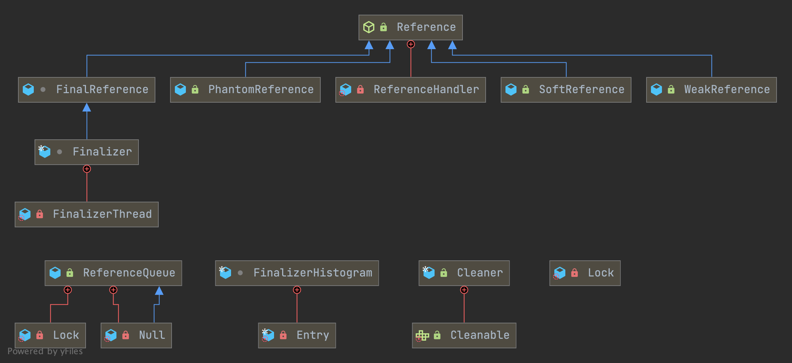

## Introduction

### Ref Hierarchy

```
-XX:+PrintReferenceGC
-XX:+TraceReferenceGC
```

<div style="text-align: center;">



</div>

<p style="text-align: center;">
Fig.1. Reference hierarchy.
</p>

### Abstract Reference

```java
public abstract class Reference<T> {

    private T referent;         /* Treated specially by GC */

    volatile ReferenceQueue<? super T> queue;

    /* When active:   NULL
     *     pending:   this
     *    Enqueued:   next reference in queue (or this if last)
     *    Inactive:   this
     */
    @SuppressWarnings("rawtypes")
    volatile Reference next;

    /* When active:   next element in a discovered reference list maintained by GC (or this if last)
     *     pending:   next element in the pending list (or null if last)
     *   otherwise:   NULL
     */
    transient private Reference<T> discovered;  /* used by VM */


    /* Object used to synchronize with the garbage collector.  The collector
     * must acquire this lock at the beginning of each collection cycle.  It is
     * therefore critical that any code holding this lock complete as quickly
     * as possible, allocate no new objects, and avoid calling user code.
     */
    static private class Lock { }
    private static Lock lock = new Lock();


    /* List of References waiting to be enqueued.  The collector adds
     * References to this list, while the Reference-handler thread removes
     * them.  This list is protected by the above lock object. The
     * list uses the discovered field to link its elements.
     */
    private static Reference<Object> pending = null;
}
```

## ReferenceHandler

1. from PendingList to ReferenceQueue in a loop.
2. if instanceof Cleaner , `invoke Cleaner.clean()` like DirectByteBuffer is free by [Cleaner](/docs/CS/Java/JDK/Basic/Direct_Buffer.md?id=cleaner).

Create Reference Object

find ref object when GC

if need to collect, add to DiscoveredList `referenceProcessor::process_discovered_references`

move elements in DiscoveredList to PendingList when  `enqueue_discovered_ref_helper`  in `referenceProcessor.cpp`

add pending to ReferenceQueue by ReferenceHandler

remove from referenceQueue

```java
/* High-priority thread to enqueue pending References
 */
private static class ReferenceHandler extends Thread {

    private static void ensureClassInitialized(Class<?> clazz) {
        try {
            Class.forName(clazz.getName(), true, clazz.getClassLoader());
        } catch (ClassNotFoundException e) {
            throw (Error) new NoClassDefFoundError(e.getMessage()).initCause(e);
        }
    }

    static {
        // pre-load and initialize InterruptedException and Cleaner classes
        // so that we don't get into trouble later in the run loop if there's
        // memory shortage while loading/initializing them lazily.
        ensureClassInitialized(InterruptedException.class);
        ensureClassInitialized(Cleaner.class);
    }

    ReferenceHandler(ThreadGroup g, String name) {
        super(g, name);
    }

    public void run() {
        while (true) {
            tryHandlePending(true);
        }
    }

}
```

```java
/**
 * Try handle pending Reference if there is one.
 * Return true} as a hint that there might be another Reference pending or false} when there are no more pending References at the moment and the program can do some other
 * useful work instead of looping.
 */
static boolean tryHandlePending(boolean waitForNotify) {
    Reference<Object> r;
    Cleaner c;
    try {
        synchronized (lock) {
            if (pending != null) {
                r = pending;
                // 'instanceof' might throw OutOfMemoryError sometimes
                // so do this before un-linking 'r' from the 'pending' chain...
                c = r instanceof Cleaner ? (Cleaner) r : null;
                // unlink 'r' from 'pending' chain
                pending = r.discovered;
                r.discovered = null;
            } else {
                // The waiting on the lock may cause an OutOfMemoryError
                // because it may try to allocate exception objects.
                if (waitForNotify) {
                    lock.wait();
                }
                // retry if waited
                return waitForNotify;
            }
        }
    } catch (OutOfMemoryError x) {
        // Give other threads CPU time so they hopefully drop some live references
        // and GC reclaims some space.
        // Also prevent CPU intensive spinning in case 'r instanceof Cleaner' above
        // persistently throws OOME for some time...
        Thread.yield();
        // retry
        return true;
    } catch (InterruptedException x) {
        // retry
        return true;
    }

    // Fast path for cleaners
    if (c != null) {
        c.clean();
        return true;
    }

    ReferenceQueue<? super Object> q = r.queue;
    if (q != ReferenceQueue.NULL) q.enqueue(r); // enq ReferenceQueue
    return true;
}
```

## StrongReference

Strong references provide direct access to the target object.
Will not be recycled.

## SoftReference

```java
public class SoftReference<T> extends Reference<T> {

    // Timestamp clock, updated by the garbage collector
    static private long clock;

    /**
     * Timestamp updated by each invocation of the get method.  The VM may use
     * this field when selecting soft references to be cleared, but it is not
     * required to do so.
     */
    private long timestamp;

    // Creates a new soft reference that refers to the given object and is
    // registered with the given queue.
    public SoftReference(T referent, ReferenceQueue<? super T> q) {
        super(referent, q);
        this.timestamp = clock;
    }

    /**
     * Returns this reference object's referent.  If this reference object has
     * been cleared, either by the program or by the garbage collector, then
     * this method returns <code>null</code>.
     */
    public T get() {
        T o = super.get();
        if (o != null && this.timestamp != clock)
            this.timestamp = clock;
        return o;
    }

}
```

`ReferenceProcessor::process_discovered_references`

-> `process_soft_ref_reconsider `

-> `process_soft_ref_reconsider_work`

(SoftReferences only) **Traverse the list and remove any SoftReferences whose referents are not alive**, but that should be kept alive for policy reasons. Keep alive the transitive closure of all such referents.

```java
// referenceProcessor.cpp
size_t ReferenceProcessor::process_soft_ref_reconsider_work(DiscoveredList&    refs_list,
                                                            ReferencePolicy*   policy,
                                                            BoolObjectClosure* is_alive,
                                                            OopClosure*        keep_alive,
                                                            VoidClosure*       complete_gc) {
  DiscoveredListIterator iter(refs_list, keep_alive, is_alive);
  // Decide which softly reachable refs should be kept alive.
  while (iter.has_next()) {
    iter.load_ptrs(DEBUG_ONLY(!discovery_is_atomic() /* allow_null_referent */));
    bool referent_is_dead = (iter.referent() != NULL) && !iter.is_referent_alive();
    if (referent_is_dead &&
        !policy->should_clear_reference(iter.obj(), _soft_ref_timestamp_clock)) {
      log_dropped_ref(iter, "by policy");
      // Remove Reference object from list
      iter.remove();
      // keep the referent around
      iter.make_referent_alive();
      iter.move_to_next();
    } else {
      iter.next();
    }
  }
  // Close the reachable set
  complete_gc->do_void();
  return iter.removed();
}
```

### referencePolicy

referencePolicy is used to determine when soft reference objects should be cleared.

1. Server compiler mode **LRUMaxHeapPolicy**
2. Else **LRUCurrentHeapPolicy**

```java
// referencePolicy.hpp
class NeverClearPolicy : public ReferencePolicy {
 public:
  virtual bool should_clear_reference(oop p, jlong timestamp_clock) {
    return false;
  }
};

class AlwaysClearPolicy : public ReferencePolicy {
 public:
  virtual bool should_clear_reference(oop p, jlong timestamp_clock) {
    return true;
  }
};

class LRUCurrentHeapPolicy : public ReferencePolicy {
 private:
  jlong _max_interval;

 public:
  LRUCurrentHeapPolicy();

  // Capture state (of-the-VM) information needed to evaluate the policy
  void setup();
  virtual bool should_clear_reference(oop p, jlong timestamp_clock);
};

class LRUMaxHeapPolicy : public ReferencePolicy {
 private:
  jlong _max_interval;

 public:
  LRUMaxHeapPolicy();

  // Capture state (of-the-VM) information needed to evaluate the policy
  void setup();
  virtual bool should_clear_reference(oop p, jlong timestamp_clock);
};
```

```java
// referenceProcessor.cpp
void ReferenceProcessor::init_statics() {
  // We need a monotonically non-decreasing time in ms but
  // os::javaTimeMillis() does not guarantee monotonicity.
  jlong now = os::javaTimeNanos() / NANOSECS_PER_MILLISEC;

  // Initialize the soft ref timestamp clock.
  _soft_ref_timestamp_clock = now;
  // Also update the soft ref clock in j.l.r.SoftReference
  java_lang_ref_SoftReference::set_clock(_soft_ref_timestamp_clock);

  _always_clear_soft_ref_policy = new AlwaysClearPolicy();
  if (is_server_compilation_mode_vm()) {
    _default_soft_ref_policy = new LRUMaxHeapPolicy();
  } else {
    _default_soft_ref_policy = new LRUCurrentHeapPolicy();
  }
  if (_always_clear_soft_ref_policy == NULL || _default_soft_ref_policy == NULL) {
    vm_exit_during_initialization("Could not allocate reference policy object");
  }
  guarantee(RefDiscoveryPolicy == ReferenceBasedDiscovery ||
            RefDiscoveryPolicy == ReferentBasedDiscovery,
            "Unrecognized RefDiscoveryPolicy");
}
```

## WeakReference

```java
/**
 * Weak reference objects, which do not prevent their referents from being
 * made finalizable, finalized, and then reclaimed.  Weak references are most
 * often used to implement canonicalizing mappings.
 *
 * <p> Suppose that the garbage collector determines at a certain point in time
 * that an object is <a href="package-summary.html#reachability">weakly
 * reachable</a>.  At that time it will atomically clear all weak references to
 * that object and all weak references to any other weakly-reachable objects
 * from which that object is reachable through a chain of strong and soft
 * references.  At the same time it will declare all of the formerly
 * weakly-reachable objects to be finalizable.  At the same time or at some
 * later time it will enqueue those newly-cleared weak references that are
 * registered with reference queues.
 */
public class WeakReference<T> extends Reference<T> {

    /**
     * Creates a new weak reference that refers to the given object.  The new
     * reference is not registered with any queue.
     *
     * @param referent object the new weak reference will refer to
     */
    public WeakReference(T referent) {
        super(referent);
    }

    /**
     * Creates a new weak reference that refers to the given object and is
     * registered with the given queue.
     *
     * @param referent object the new weak reference will refer to
     * @param q the queue with which the reference is to be registered,
     *          or <tt>null</tt> if registration is not required
     */
    public WeakReference(T referent, ReferenceQueue<? super T> q) {
        super(referent, q);
    }

}
```

Traverse the list and remove any Refs whose referents are alive, or NULL if discovery is not atomic. Enqueue and clear the reference for others if do_enqueue_and_clear is set.

```cpp
size_t ReferenceProcessor::process_soft_weak_final_refs_work(DiscoveredList&    refs_list,
                                                             BoolObjectClosure* is_alive,
                                                             OopClosure*        keep_alive,
                                                             bool               do_enqueue_and_clear) {
  DiscoveredListIterator iter(refs_list, keep_alive, is_alive);
  while (iter.has_next()) {
    iter.load_ptrs(DEBUG_ONLY(!discovery_is_atomic() /* allow_null_referent */));
    if (iter.referent() == NULL) {
      // Reference has been cleared since discovery; only possible if
      // discovery is not atomic (checked by load_ptrs).  Remove
      // reference from list.
      log_dropped_ref(iter, "cleared");
      iter.remove();
      iter.move_to_next();
    } else if (iter.is_referent_alive()) {
      // The referent is reachable after all.
      // Remove reference from list.
      log_dropped_ref(iter, "reachable");
      iter.remove();
      // Update the referent pointer as necessary.  Note that this
      // should not entail any recursive marking because the
      // referent must already have been traversed.
      iter.make_referent_alive();
      iter.move_to_next();
    } else {
      if (do_enqueue_and_clear) {
        iter.clear_referent();
        iter.enqueue();
        log_enqueued_ref(iter, "cleared");
      }
      // Keep in discovered list
      iter.next();
    }
  }
  if (do_enqueue_and_clear) {
    iter.complete_enqueue();
    refs_list.clear();
  }
  return iter.removed();
}
```

## Phantom Reference

```java
public class PhantomReference<T> extends Reference<T> {
    public T get() {
        return null;
    }
  
    public PhantomReference(T referent, ReferenceQueue<? super T> q) {
        super(referent, q);
    }

}
```

**TODO in JDK12 will clear referent while JDk1.8 not**

```cpp
size_t ReferenceProcessor::process_phantom_refs_work(DiscoveredList&    refs_list,
                                          BoolObjectClosure* is_alive,
                                          OopClosure*        keep_alive,
                                          VoidClosure*       complete_gc) {
  DiscoveredListIterator iter(refs_list, keep_alive, is_alive);
  while (iter.has_next()) {
    iter.load_ptrs(DEBUG_ONLY(!discovery_is_atomic() /* allow_null_referent */));

    oop const referent = iter.referent();

    if (referent == NULL || iter.is_referent_alive()) {
      iter.make_referent_alive();
      iter.remove();
      iter.move_to_next();
    } else {
      iter.clear_referent();
      iter.enqueue();
      log_enqueued_ref(iter, "cleared Phantom");
      iter.next();
    }
  }
  iter.complete_enqueue();
  // Close the reachable set; needed for collectors which keep_alive_closure do
  // not immediately complete their work.
  complete_gc->do_void();
  refs_list.clear();

  return iter.removed();
}
```

```cpp
void DiscoveredListIterator::complete_enqueue() {
  if (_prev_discovered != NULL) {
    // This is the last object.
    // Swap refs_list into pending list and set obj's
    // discovered to what we read from the pending list.
    oop old = Universe::swap_reference_pending_list(_refs_list.head());
    HeapAccess<AS_NO_KEEPALIVE>::oop_store_at(_prev_discovered, java_lang_ref_Reference::discovered_offset, old);
  }
}
```

## FinalReference

Final references, used to implement finalization

```java
class FinalReference<T> extends Reference<T> {

    public FinalReference(T referent, ReferenceQueue<? super T> q) {
        super(referent, q);
    }

    @Override
    public boolean enqueue() {
        throw new InternalError("should never reach here");
    }
}
```

**Keep alive followers of referents for FinalReferences.** Must only be called for those.

```cpp
size_t ReferenceProcessor::process_final_keep_alive_work(DiscoveredList& refs_list,
                                                         OopClosure*     keep_alive,
                                                         VoidClosure*    complete_gc) {
  DiscoveredListIterator iter(refs_list, keep_alive, NULL);
  while (iter.has_next()) {
    iter.load_ptrs(DEBUG_ONLY(false /* allow_null_referent */));
    // keep the referent and followers around
    iter.make_referent_alive();

    // Self-loop next, to mark the FinalReference not active.
    java_lang_ref_Reference::set_next_raw(iter.obj(), iter.obj());

    iter.enqueue();
    log_enqueued_ref(iter, "Final");
    iter.next();
  }
  iter.complete_enqueue();
  // Close the reachable set
  complete_gc->do_void();
  refs_list.clear();

  return iter.removed();
}
```

### Finalizer

Package-private; must be in same package as the Reference class

register invoked by VM

```java
final class Finalizer extends FinalReference<Object> {

    private static ReferenceQueue<Object> queue = new ReferenceQueue<>();

    /** Head of doubly linked list of Finalizers awaiting finalization. */
    private static Finalizer unfinalized = null;

    /** Lock guarding access to unfinalized list. */
    private static final Object lock = new Object();

    private Finalizer next, prev;


    static {
        ThreadGroup tg = Thread.currentThread().getThreadGroup();
        for (ThreadGroup tgn = tg;
             tgn != null;
             tg = tgn, tgn = tg.getParent())
            ;
        Thread finalizer = new FinalizerThread(tg);
        finalizer.setPriority(Thread.MAX_PRIORITY - 2);
        finalizer.setDaemon(true);
        finalizer.start();
    }

    /* Invoked by VM */
    static void register(Object finalizee) {
        new Finalizer(finalizee);
    }

    private Finalizer(Object finalizee) {
        super(finalizee, queue);
        // push onto unfinalized
        synchronized (lock) {
            if (unfinalized != null) {
                this.next = unfinalized;
                unfinalized.prev = this;
            }
            unfinalized = this;
        }
    }

    static ReferenceQueue<Object> getQueue() {
        return queue;
    }
}
```

#### register_finalizer


rewrite _return to _return_register_finalizer while [rewrite_Object_init](/docs/CS/Java/JDK/JVM/ClassLoader.md?id=rewrite_Object_init).


```cpp

IRT_ENTRY(void, InterpreterRuntime::register_finalizer(JavaThread* thread, oopDesc* obj))
  InstanceKlass::register_finalizer(instanceOop(obj), CHECK);
IRT_END
```

Register finalizable objects at end of

- Object.<init> (default)
- or after allocation

```
-XX:+/-RegisterFinalizersAtInit
```

call `Finalizer#register()` after  [allocation](/docs/CS/Java/JDK/JVM/Oop-Klass.md?id=allocate_instance)

```cpp
// instanceKlass.cpp
instanceOop InstanceKlass::allocate_instance(TRAPS) {
  bool has_finalizer_flag = has_finalizer(); // Query before possible GC
  int size = size_helper();  // Query before forming handle.

  instanceOop i;

  i = (instanceOop)Universe::heap()->obj_allocate(this, size, CHECK_NULL);
  if (has_finalizer_flag && !RegisterFinalizersAtInit) {
    i = register_finalizer(i, CHECK_NULL);
  }
  return i;
}
```

call `Finalizer.register()`
```cpp
instanceOop InstanceKlass::register_finalizer(instanceOop i, TRAPS) {
  instanceHandle h_i(THREAD, i);
  // Pass the handle as argument, JavaCalls::call expects oop as jobjects
  JavaValue result(T_VOID);
  JavaCallArguments args(h_i);
  methodHandle mh (THREAD, Universe::finalizer_register_method());
  JavaCalls::call(&result, mh, &args, CHECK_NULL);
  return h_i();
}
```

### FinalizerThread

```java
private static class FinalizerThread extends Thread {
        private volatile boolean running;
        FinalizerThread(ThreadGroup g) {
            super(g, null, "Finalizer", 0, false);
        }
        public void run() {
            // in case of recursive call to run()
            if (running)
                return;

            // Finalizer thread starts before System.initializeSystemClass
            // is called.  Wait until JavaLangAccess is available
            while (VM.initLevel() == 0) {
                // delay until VM completes initialization
                try {
                    VM.awaitInitLevel(1);
                } catch (InterruptedException x) {
                    // ignore and continue
                }
            }
            final JavaLangAccess jla = SharedSecrets.getJavaLangAccess();
            running = true;
            for (;;) {
                try {
                    Finalizer f = (Finalizer)queue.remove();
                    f.runFinalizer(jla);
                } catch (InterruptedException x) {
                    // ignore and continue
                }
            }
        }
    }
```

#### runFinalizer

use `JavaLangAccess#invokeFinalize()` run `finalize` method **after invoke finalize method, the reference set null so can't run finalize method twice**

```java
final class Finalizer extends FinalReference<Object> {
    private void runFinalizer(JavaLangAccess jla) {
        synchronized (lock) {
            if (this.next == this)      // already finalized
                return;
            // unlink from unfinalized
            if (unfinalized == this)
                unfinalized = this.next;
            else
                this.prev.next = this.next;
            if (this.next != null)
                this.next.prev = this.prev;
            this.prev = null;
            this.next = this;           // mark as finalized
        }

        try {
            Object finalizee = this.get();
            if (finalizee != null && !(finalizee instanceof java.lang.Enum)) {
                jla.invokeFinalize(finalizee); // Invokes the finalize method of the given object.

                // Clear stack slot containing this variable, to decrease the chances of false retention with a conservative GC
                finalizee = null;
            }
        } catch (Throwable x) {
        }
        super.clear();
    }
}
```


## Cleaner

```java
public class Cleaner
    extends PhantomReference<Object>
{

    // Dummy reference queue, needed because the PhantomReference constructor
    // insists that we pass a queue.  Nothing will ever be placed on this queue
    // since the reference handler invokes cleaners explicitly.
    //
    private static final ReferenceQueue<Object> dummyQueue = new ReferenceQueue<>();

    // Doubly-linked list of live cleaners, which prevents the cleaners
    // themselves from being GC'd before their referents
    //
    static private Cleaner first = null;

    private Cleaner
        next = null,
        prev = null;

    private static synchronized Cleaner add(Cleaner cl) {
        if (first != null) {
            cl.next = first;
            first.prev = cl;
        }
        first = cl;
        return cl;
    }

    private static synchronized boolean remove(Cleaner cl) {

        // If already removed, do nothing
        if (cl.next == cl)
            return false;

        // Update list
        if (first == cl) {
            if (cl.next != null)
                first = cl.next;
            else
                first = cl.prev;
        }
        if (cl.next != null)
            cl.next.prev = cl.prev;
        if (cl.prev != null)
            cl.prev.next = cl.next;

        // Indicate removal by pointing the cleaner to itself
        cl.next = cl;
        cl.prev = cl;
        return true;

    }

    private final Runnable thunk;

    private Cleaner(Object referent, Runnable thunk) {
        super(referent, dummyQueue);
        this.thunk = thunk;
    }

    /**
     * Creates a new cleaner.
     */
    public static Cleaner create(Object ob, Runnable thunk) {
        if (thunk == null)
            return null;
        return add(new Cleaner(ob, thunk));
    }

    /**
     * Runs this cleaner, if it has not been run before.
     */
    public void clean() {
        if (!remove(this))
            return;
        try {
            thunk.run();
        } catch (final Throwable x) {
            AccessController.doPrivileged(new PrivilegedAction<Void>() {
                    public Void run() {
                        if (System.err != null)
                            new Error("Cleaner terminated abnormally", x)
                                .printStackTrace();
                        System.exit(1);
                        return null;
                    }});
        }
    }

}
```

## ReferenceProcessor

### discover_reference

We mention two of several possible choices here:
0: if the reference object is not in the "originating generation"
(or part of the heap being collected, indicated by our "span")
we don't treat it specially (i.e. we scan it as we would
a normal oop, treating its references as strong references).
This means that references can't be discovered unless their
referent is also in the same span. This is the simplest,
most "local" and most conservative approach, albeit one
that may cause weak references to be enqueued least promptly.
We call this choice the "ReferenceBasedDiscovery" policy.
1: the reference object may be in any generation (span), but if
the referent is in the generation (span) being currently collected
then we can discover the reference object, provided
the object has not already been discovered by
a different concurrently running discoverer (as may be the
case, for instance, if the reference object is in G1 old gen and
the referent in G1 young gen), and provided the processing
of this reference object by the current collector will
appear atomically to every other discoverer in the system.
(Thus, for instance, a concurrent discoverer may not
discover references in other generations even if the
referent is in its own generation). This policy may,
in certain cases, enqueue references somewhat sooner than
might Policy #0 above, but at marginally increased cost
and complexity in processing these references.
We call this choice the "ReferentBasedDiscovery" policy.

```cpp

bool ReferenceProcessor::discover_reference(oop obj, ReferenceType rt) {
  // Make sure we are discovering refs (rather than processing discovered refs).
  if (!_discovering_refs || !RegisterReferences) {
    return false;
  }

  if ((rt == REF_FINAL) && (java_lang_ref_Reference::next(obj) != NULL)) {
    // Don't rediscover non-active FinalReferences.
    return false;
  }

  if (RefDiscoveryPolicy == ReferenceBasedDiscovery &&
      !is_subject_to_discovery(obj)) {
    // Reference is not in the originating generation;
    // don't treat it specially (i.e. we want to scan it as a normal
    // object with strong references).
    return false;
  }

  // We only discover references whose referents are not (yet)
  // known to be strongly reachable.
  if (is_alive_non_header() != NULL) {
    verify_referent(obj);
    oop referent = java_lang_ref_Reference::unknown_referent_no_keepalive(obj);
    if (is_alive_non_header()->do_object_b(referent)) {
      return false;  // referent is reachable
    }
  }
  if (rt == REF_SOFT) {
    // For soft refs we can decide now if these are not
    // current candidates for clearing, in which case we
    // can mark through them now, rather than delaying that
    // to the reference-processing phase. Since all current
    // time-stamp policies advance the soft-ref clock only
    // at a full collection cycle, this is always currently
    // accurate.
    if (!_current_soft_ref_policy->should_clear_reference(obj, _soft_ref_timestamp_clock)) {
      return false;
    }
  }

  ResourceMark rm;      // Needed for tracing.

  HeapWord* const discovered_addr = java_lang_ref_Reference::discovered_addr_raw(obj);
  const oop  discovered = java_lang_ref_Reference::discovered(obj);
  assert(oopDesc::is_oop_or_null(discovered), "Expected an oop or NULL for discovered field at " PTR_FORMAT, p2i(discovered));
  if (discovered != NULL) {
    // The reference has already been discovered...
    log_develop_trace(gc, ref)("Already discovered reference (" INTPTR_FORMAT ": %s)",
                               p2i(obj), obj->klass()->internal_name());
    if (RefDiscoveryPolicy == ReferentBasedDiscovery) {
      // assumes that an object is not processed twice;
      // if it's been already discovered it must be on another
      // generation's discovered list; so we won't discover it.
      return false;
    } else {
      assert(RefDiscoveryPolicy == ReferenceBasedDiscovery,
             "Unrecognized policy");
      // Check assumption that an object is not potentially
      // discovered twice except by concurrent collectors that potentially
      // trace the same Reference object twice.
      assert(UseG1GC, "Only possible with a concurrent marking collector");
      return true;
    }
  }

  if (RefDiscoveryPolicy == ReferentBasedDiscovery) {
    verify_referent(obj);
    // Discover if and only if EITHER:
    // .. reference is in our span, OR
    // .. we are a stw discoverer and referent is in our span
    if (is_subject_to_discovery(obj) ||
        (discovery_is_stw() &&
         is_subject_to_discovery(java_lang_ref_Reference::unknown_referent_no_keepalive(obj)))) {
    } else {
      return false;
    }
  } else {
    assert(RefDiscoveryPolicy == ReferenceBasedDiscovery &&
           is_subject_to_discovery(obj), "code inconsistency");
  }

  // Get the right type of discovered queue head.
  DiscoveredList* list = get_discovered_list(rt);
  if (list == NULL) {
    return false;   // nothing special needs to be done
  }

  add_to_discovered_list(*list, obj, discovered_addr);

  assert(oopDesc::is_oop(obj), "Discovered a bad reference");
  verify_referent(obj);
  return true;
}
```

### process_discovered_references

```cpp

ReferenceProcessorStats ReferenceProcessor::process_discovered_references(RefProcProxyTask& proxy_task,
                                                                          ReferenceProcessorPhaseTimes& phase_times) {

  double start_time = os::elapsedTime();

  // Stop treating discovered references specially.
  disable_discovery();

  phase_times.set_ref_discovered(REF_SOFT, total_count(_discoveredSoftRefs));
  phase_times.set_ref_discovered(REF_WEAK, total_count(_discoveredWeakRefs));
  phase_times.set_ref_discovered(REF_FINAL, total_count(_discoveredFinalRefs));
  phase_times.set_ref_discovered(REF_PHANTOM, total_count(_discoveredPhantomRefs));

  update_soft_ref_master_clock();

  phase_times.set_processing_is_mt(processing_is_mt());

  {
    RefProcTotalPhaseTimesTracker tt(SoftWeakFinalRefsPhase, &phase_times);
    process_soft_weak_final_refs(proxy_task, phase_times);
  }

  {
    RefProcTotalPhaseTimesTracker tt(KeepAliveFinalRefsPhase, &phase_times);
    process_final_keep_alive(proxy_task, phase_times);
  }

  {
    RefProcTotalPhaseTimesTracker tt(PhantomRefsPhase, &phase_times);
    process_phantom_refs(proxy_task, phase_times);
  }

  phase_times.set_total_time_ms((os::elapsedTime() - start_time) * 1000);

  // Elements on discovered lists were pushed to the pending list.
  verify_no_references_recorded();

  ReferenceProcessorStats stats(phase_times.ref_discovered(REF_SOFT),
                                phase_times.ref_discovered(REF_WEAK),
                                phase_times.ref_discovered(REF_FINAL),
                                phase_times.ref_discovered(REF_PHANTOM));
  return stats;
}
```

## Summary


|  | Soft            | Weak               | Phantom                | Final |
| - | --------------- | ------------------ | ---------------------- | ----- |
|  | clean by Policy | clean all the time | use to trace collector |       |
|  |                 |                    |                        |       |
|  |                 |                    |                        |       |

## Links

- [JDK basics](/docs/CS/Java/JDK/Basic/Basic.md)

## References

1. [Java引用类型原理剖析](https://github.com/farmerjohngit/myblog/issues/10)
