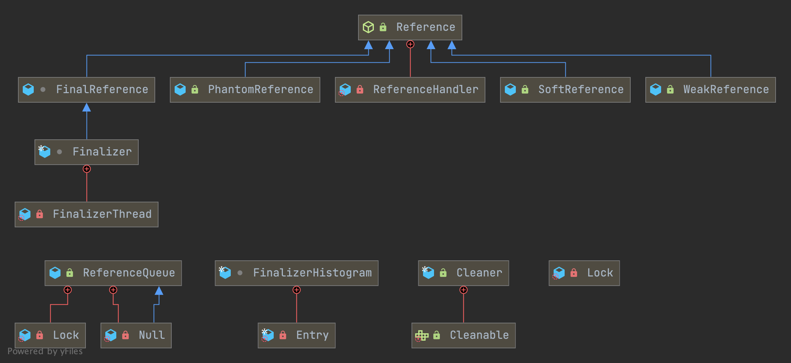

# Ref




### Reference

```java
public abstract class Reference<T> {

    private T referent;         /* Treated specially by GC */

    volatile ReferenceQueue<? super T> queue;

    /* When active:   NULL
     *     pending:   this
     *    Enqueued:   next reference in queue (or this if last)
     *    Inactive:   this
     */
    @SuppressWarnings("rawtypes")
    volatile Reference next;

    /* When active:   next element in a discovered reference list maintained by GC (or this if last)
     *     pending:   next element in the pending list (or null if last)
     *   otherwise:   NULL
     */
    transient private Reference<T> discovered;  /* used by VM */


    /* Object used to synchronize with the garbage collector.  The collector
     * must acquire this lock at the beginning of each collection cycle.  It is
     * therefore critical that any code holding this lock complete as quickly
     * as possible, allocate no new objects, and avoid calling user code.
     */
    static private class Lock { }
    private static Lock lock = new Lock();


    /* List of References waiting to be enqueued.  The collector adds
     * References to this list, while the Reference-handler thread removes
     * them.  This list is protected by the above lock object. The
     * list uses the discovered field to link its elements.
     */
    private static Reference<Object> pending = null;
}
```


## ReferenceHandler

1. from PendingList to ReferenceQueue in a loop.
2. if instanceof Cleaner , `invoke Cleaner.clean()` like DirectByteBuffer is free by [Cleaner](/docs/CS/Java/JDK/Basic/Direct_Buffer.md?id=cleaner).


Create Reference Object

find ref object when GC

if need to collect, add to DiscoveredList `referenceProcessor.cpp`中`process_discovered_references`方法

move elements in DiscoveredList to PendingList `referenceProcessor.cpp`中`enqueue_discovered_ref_helper`方法

add pending to ReferenceQueue by ReferenceHandler

remove from referenceQueue

```java
/* High-priority thread to enqueue pending References
 */
private static class ReferenceHandler extends Thread {

    private static void ensureClassInitialized(Class<?> clazz) {
        try {
            Class.forName(clazz.getName(), true, clazz.getClassLoader());
        } catch (ClassNotFoundException e) {
            throw (Error) new NoClassDefFoundError(e.getMessage()).initCause(e);
        }
    }

    static {
        // pre-load and initialize InterruptedException and Cleaner classes
        // so that we don't get into trouble later in the run loop if there's
        // memory shortage while loading/initializing them lazily.
        ensureClassInitialized(InterruptedException.class);
        ensureClassInitialized(Cleaner.class);
    }

    ReferenceHandler(ThreadGroup g, String name) {
        super(g, name);
    }

    public void run() {
        while (true) {
            tryHandlePending(true);
        }
    }
}

/**
 * Try handle pending {@link Reference} if there is one.<p>
 * Return {@code true} as a hint that there might be another
 * {@link Reference} pending or {@code false} when there are no more pending
 * {@link Reference}s at the moment and the program can do some other
 * useful work instead of looping.
 */
static boolean tryHandlePending(boolean waitForNotify) {
    Reference<Object> r;
    Cleaner c;
    try {
        synchronized (lock) {
            if (pending != null) {
                r = pending;
                // 'instanceof' might throw OutOfMemoryError sometimes
                // so do this before un-linking 'r' from the 'pending' chain...
                c = r instanceof Cleaner ? (Cleaner) r : null;
                // unlink 'r' from 'pending' chain
                pending = r.discovered;
                r.discovered = null;
            } else {
                // The waiting on the lock may cause an OutOfMemoryError
                // because it may try to allocate exception objects.
                if (waitForNotify) {
                    lock.wait();
                }
                // retry if waited
                return waitForNotify;
            }
        }
    } catch (OutOfMemoryError x) {
        // Give other threads CPU time so they hopefully drop some live references
        // and GC reclaims some space.
        // Also prevent CPU intensive spinning in case 'r instanceof Cleaner' above
        // persistently throws OOME for some time...
        Thread.yield();
        // retry
        return true;
    } catch (InterruptedException x) {
        // retry
        return true;
    }

    // Fast path for cleaners
    if (c != null) {
        c.clean();
        return true;
    }

    ReferenceQueue<? super Object> q = r.queue;
    if (q != ReferenceQueue.NULL) q.enqueue(r);
    return true;
}
```


## Type

### SoftReference

```java
public class SoftReference<T> extends Reference<T> {

    /**
     * Timestamp clock, updated by the garbage collector
     */
    static private long clock;

    /**
     * Timestamp updated by each invocation of the get method.  The VM may use
     * this field when selecting soft references to be cleared, but it is not
     * required to do so.
     */
    private long timestamp;

    /**
     * Creates a new soft reference that refers to the given object.  The new
     * reference is not registered with any queue.
     *
     * @param referent object the new soft reference will refer to
     */
    public SoftReference(T referent) {
        super(referent);
        this.timestamp = clock;
    }

    /**
     * Creates a new soft reference that refers to the given object and is
     * registered with the given queue.
     *
     * @param referent object the new soft reference will refer to
     * @param q the queue with which the reference is to be registered,
     *          or <tt>null</tt> if registration is not required
     *
     */
    public SoftReference(T referent, ReferenceQueue<? super T> q) {
        super(referent, q);
        this.timestamp = clock;
    }

    /**
     * Returns this reference object's referent.  If this reference object has
     * been cleared, either by the program or by the garbage collector, then
     * this method returns <code>null</code>.
     *
     * @return   The object to which this reference refers, or
     *           <code>null</code> if this reference object has been cleared
     */
    public T get() {
        T o = super.get();
        if (o != null && this.timestamp != clock)
            this.timestamp = clock;
        return o;
    }

}
```


### WeakReference

```java
/**
 * Weak reference objects, which do not prevent their referents from being
 * made finalizable, finalized, and then reclaimed.  Weak references are most
 * often used to implement canonicalizing mappings.
 *
 * <p> Suppose that the garbage collector determines at a certain point in time
 * that an object is <a href="package-summary.html#reachability">weakly
 * reachable</a>.  At that time it will atomically clear all weak references to
 * that object and all weak references to any other weakly-reachable objects
 * from which that object is reachable through a chain of strong and soft
 * references.  At the same time it will declare all of the formerly
 * weakly-reachable objects to be finalizable.  At the same time or at some
 * later time it will enqueue those newly-cleared weak references that are
 * registered with reference queues.
 */
public class WeakReference<T> extends Reference<T> {

    /**
     * Creates a new weak reference that refers to the given object.  The new
     * reference is not registered with any queue.
     *
     * @param referent object the new weak reference will refer to
     */
    public WeakReference(T referent) {
        super(referent);
    }

    /**
     * Creates a new weak reference that refers to the given object and is
     * registered with the given queue.
     *
     * @param referent object the new weak reference will refer to
     * @param q the queue with which the reference is to be registered,
     *          or <tt>null</tt> if registration is not required
     */
    public WeakReference(T referent, ReferenceQueue<? super T> q) {
        super(referent, q);
    }

}
```


### Phantom Reference


### Cleaner

Since 1.9

*Cleaner manages a set of object references and corresponding cleaning actions.*
*Cleaning actions are registered to run after the cleaner is notified that the object has become phantom reachable. The cleaner uses PhantomReference and ReferenceQueue to be notified when the reachability changes.*
*Each cleaner operates independently, managing the pending cleaning actions and handling threading and termination when the cleaner is no longer in use. Registering an object reference and corresponding cleaning action returns a Cleanable. The most efficient use is to explicitly invoke the clean method when the object is closed or no longer needed. The cleaning action is a Runnable to be invoked at most once when the object has become phantom reachable unless it has already been explicitly cleaned. Note that the cleaning action must not refer to the object being registered. If so, the object will not become phantom reachable and the cleaning action will not be invoked automatically.*
*The execution of the cleaning action is performed by a thread associated with the cleaner. All exceptions thrown by the cleaning action are ignored. The cleaner and other cleaning actions are not affected by exceptions in a cleaning action. The thread runs until all registered cleaning actions have completed and the cleaner itself is reclaimed by the garbage collector.*
*The behavior of cleaners during System.exit is implementation specific. No guarantees are made relating to whether cleaning actions are invoked or not.*
*Unless otherwise noted, passing a null argument to a constructor or method in this class will cause a NullPointerException to be thrown.*

```java
public final class Cleaner {

    /**
     * The Cleaner implementation.
     */
    final CleanerImpl impl;

    static {
        CleanerImpl.setCleanerImplAccess(new Function<Cleaner, CleanerImpl>() {
            @Override
            public CleanerImpl apply(Cleaner cleaner) {
                return cleaner.impl;
            }
        });
    }

    /**
     * Construct a Cleaner implementation and start it.
     */
    private Cleaner() {
        impl = new CleanerImpl();
    }

    /**
     * Returns a new {@code Cleaner}.
     * <p>
     * The cleaner creates a {@link Thread#setDaemon(boolean) daemon thread}
     * to process the phantom reachable objects and to invoke cleaning actions.
     * The {@linkplain java.lang.Thread#getContextClassLoader context class loader}
     * of the thread is set to the
     * {@link ClassLoader#getSystemClassLoader() system class loader}.
     * The thread has no permissions, enforced only if a
     * {@link java.lang.System#setSecurityManager(SecurityManager) SecurityManager is set}.
     * <p>
     * The cleaner terminates when it is phantom reachable and all of the
     * registered cleaning actions are complete.
     *
     * @return a new {@code Cleaner}
     *
     * @throws  SecurityException  if the current thread is not allowed to
     *               create or start the thread.
     */
    public static Cleaner create() {
        Cleaner cleaner = new Cleaner();
        cleaner.impl.start(cleaner, null);
        return cleaner;
    }

    /**
     * Returns a new {@code Cleaner} using a {@code Thread} from the {@code ThreadFactory}.
     * <p>
     * A thread from the thread factory's {@link ThreadFactory#newThread(Runnable) newThread}
     * method is set to be a {@link Thread#setDaemon(boolean) daemon thread}
     * and started to process phantom reachable objects and invoke cleaning actions.
     * On each call the {@link ThreadFactory#newThread(Runnable) thread factory}
     * must provide a Thread that is suitable for performing the cleaning actions.
     * <p>
     * The cleaner terminates when it is phantom reachable and all of the
     * registered cleaning actions are complete.
     *
     * @param threadFactory a {@code ThreadFactory} to return a new {@code Thread}
     *                      to process cleaning actions
     * @return a new {@code Cleaner}
     *
     * @throws  IllegalThreadStateException  if the thread from the thread
     *               factory was {@link Thread.State#NEW not a new thread}.
     * @throws  SecurityException  if the current thread is not allowed to
     *               create or start the thread.
     */
    public static Cleaner create(ThreadFactory threadFactory) {
        Objects.requireNonNull(threadFactory, "threadFactory");
        Cleaner cleaner = new Cleaner();
        cleaner.impl.start(cleaner, threadFactory);
        return cleaner;
    }

    /**
     * Registers an object and a cleaning action to run when the object
     * becomes phantom reachable.
     * Refer to the <a href="#compatible-cleaners">API Note</a> above for
     * cautions about the behavior of cleaning actions.
     *
     * @param obj   the object to monitor
     * @param action a {@code Runnable} to invoke when the object becomes phantom reachable
     * @return a {@code Cleanable} instance
     */
    public Cleanable register(Object obj, Runnable action) {
        Objects.requireNonNull(obj, "obj");
        Objects.requireNonNull(action, "action");
        return new CleanerImpl.PhantomCleanableRef(obj, this, action);
    }

    /**
     * {@code Cleanable} represents an object and a
     * cleaning action registered in a {@code Cleaner}.
     * @since 9
     */
    public interface Cleanable {
        /**
         * Unregisters the cleanable and invokes the cleaning action.
         * The cleanable's cleaning action is invoked at most once
         * regardless of the number of calls to {@code clean}.
         */
        void clean();
    }

}
```


referenceProcessor.cpp

```cpp
ReferenceProcessorStats ReferenceProcessor::process_discovered_references(
  BoolObjectClosure*            is_alive,
  OopClosure*                   keep_alive,
  VoidClosure*                  complete_gc,
  AbstractRefProcTaskExecutor*  task_executor,
  ReferenceProcessorPhaseTimes* phase_times) {

  double start_time = os::elapsedTime();

  assert(!enqueuing_is_done(), "If here enqueuing should not be complete");
  // Stop treating discovered references specially.
  disable_discovery();

  // If discovery was concurrent, someone could have modified
  // the value of the static field in the j.l.r.SoftReference
  // class that holds the soft reference timestamp clock using
  // reflection or Unsafe between when discovery was enabled and
  // now. Unconditionally update the static field in ReferenceProcessor
  // here so that we use the new value during processing of the
  // discovered soft refs.

  _soft_ref_timestamp_clock = java_lang_ref_SoftReference::clock();

  ReferenceProcessorStats stats(total_count(_discoveredSoftRefs),
                                total_count(_discoveredWeakRefs),
                                total_count(_discoveredFinalRefs),
                                total_count(_discoveredPhantomRefs));

  {
    RefProcTotalPhaseTimesTracker tt(RefPhase1, phase_times, this);
    process_soft_ref_reconsider(is_alive, keep_alive, complete_gc,
                                task_executor, phase_times);
  }

  update_soft_ref_master_clock();

  {
    RefProcTotalPhaseTimesTracker tt(RefPhase2, phase_times, this);
    process_soft_weak_final_refs(is_alive, keep_alive, complete_gc, task_executor, phase_times);
  }

  {
    RefProcTotalPhaseTimesTracker tt(RefPhase3, phase_times, this);
    process_final_keep_alive(keep_alive, complete_gc, task_executor, phase_times);
  }

  {
    RefProcTotalPhaseTimesTracker tt(RefPhase4, phase_times, this);
    process_phantom_refs(is_alive, keep_alive, complete_gc, task_executor, phase_times);
  }

  if (task_executor != NULL) {
    // Record the work done by the parallel workers.
    task_executor->set_single_threaded_mode();
  }

  phase_times->set_total_time_ms((os::elapsedTime() - start_time) * 1000);

  return stats;
}
```


```cpp
void DiscoveredListIterator::complete_enqueue() {
  if (_prev_discovered != NULL) {
    // This is the last object.
    // Swap refs_list into pending list and set obj's
    // discovered to what we read from the pending list.
    oop old = Universe::swap_reference_pending_list(_refs_list.head());
    HeapAccess<AS_NO_KEEPALIVE>::oop_store_at(_prev_discovered, java_lang_ref_Reference::discovered_offset, old);
  }
}
```

## Reference

1. [Java引用类型原理剖析](https://github.com/farmerjohngit/myblog/issues/10)

