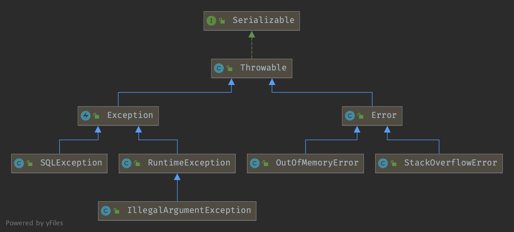

## Introduction

### Throwable Hierarchy




**NullPointerException**

A null object invoke **non-static** method will throw NPE.

Use == or != compare null value or use **Optional** to avoid comparison.


Use exceptions only for exceptional conditions
- Exceptions are, as their name implies, to be used only for exceptional conditions; they should never be used for ordinary control flow.
- A well-designed API must not force its clients to use exceptions for ordinary control flow.

Use checked exceptions for recoverable conditions and runtime exceptions for programming errors
- use checked exceptions for conditions from which the caller can reasonably be expected to recover.
- Use runtime exceptions to indicate programming errors.

All of the unchecked throwables you implement should subclass `RuntimeException`.

Avoid unnecessary use of checked exceptions
Favor the use of standard exceptions
Throw exceptions appropriate to the abstraction  
Document all exceptions thrown by each method
- Always declare checked exceptions individually, and document precisely the conditions under which each one is thrown using the Javadoc `@throws` tag.
- Use the Javadoc `@throws` tag to document each exception that a method can throw, but do not use the throws keyword on unchecked exceptions.

Include failure-capture information in detail messages.
Strive for failure atomicity. Generally speaking, a failed method invocation should leave the object in the state that it was in prior to the invocation.
If you choose to ignore an exception, the catch block should contain a comment explaining why it is appropriate to do so, and the variable should be named ignored

OutOfMemoryError
```
java.lang.OutOfMemoryError: Java heap space
```


athrow

```cpp
// Exceptions

void TemplateTable::athrow() {
  transition(atos, vtos);
  __ null_check(rax);
  __ jump(ExternalAddress(Interpreter::throw_exception_entry()));
}
```

### generate_throw_exception

```cpp

void TemplateInterpreterGenerator::generate_throw_exception() {
  // Entry point in previous activation (i.e., if the caller was
  // interpreted)
  Interpreter::_rethrow_exception_entry = __ pc();
  // Restore sp to interpreter_frame_last_sp even though we are going
  // to empty the expression stack for the exception processing.
  __ movptr(Address(rbp, frame::interpreter_frame_last_sp_offset * wordSize), (int32_t)NULL_WORD);
  // rax: exception
  // rdx: return address/pc that threw exception
  __ restore_bcp();    // r13/rsi points to call/send
  __ restore_locals();
  LP64_ONLY(__ reinit_heapbase());  // restore r12 as heapbase.
  // Entry point for exceptions thrown within interpreter code
  Interpreter::_throw_exception_entry = __ pc();
  // expression stack is undefined here
  // rax: exception
  // r13/rsi: exception bcp
  __ verify_oop(rax);
  Register rarg = NOT_LP64(rax) LP64_ONLY(c_rarg1);
  LP64_ONLY(__ mov(c_rarg1, rax));

  // expression stack must be empty before entering the VM in case of
  // an exception
  __ empty_expression_stack();
  // find exception handler address and preserve exception oop
  __ call_VM(rdx,
             CAST_FROM_FN_PTR(address,
                          InterpreterRuntime::exception_handler_for_exception),
             rarg);
  // rax: exception handler entry point
  // rdx: preserved exception oop
  // r13/rsi: bcp for exception handler
  __ push_ptr(rdx); // push exception which is now the only value on the stack
  __ jmp(rax); // jump to exception handler (may be _remove_activation_entry!)

  // If the exception is not handled in the current frame the frame is
  // removed and the exception is rethrown (i.e. exception
  // continuation is _rethrow_exception).
  //
  // Note: At this point the bci is still the bxi for the instruction
  // which caused the exception and the expression stack is
  // empty. Thus, for any VM calls at this point, GC will find a legal
  // oop map (with empty expression stack).

  // In current activation
  // tos: exception
  // esi: exception bcp

  //
  // JVMTI PopFrame support
  //

  Interpreter::_remove_activation_preserving_args_entry = __ pc();
  __ empty_expression_stack();
  // Set the popframe_processing bit in pending_popframe_condition
  // indicating that we are currently handling popframe, so that
  // call_VMs that may happen later do not trigger new popframe
  // handling cycles.
  const Register thread = NOT_LP64(rcx) LP64_ONLY(r15_thread);
  NOT_LP64(__ get_thread(thread));
  __ movl(rdx, Address(thread, JavaThread::popframe_condition_offset()));
  __ orl(rdx, JavaThread::popframe_processing_bit);
  __ movl(Address(thread, JavaThread::popframe_condition_offset()), rdx);

  {
    // Check to see whether we are returning to a deoptimized frame.
    // (The PopFrame call ensures that the caller of the popped frame is
    // either interpreted or compiled and deoptimizes it if compiled.)
    // In this case, we can't call dispatch_next() after the frame is
    // popped, but instead must save the incoming arguments and restore
    // them after deoptimization has occurred.
    //
    // Note that we don't compare the return PC against the
    // deoptimization blob's unpack entry because of the presence of
    // adapter frames in C2.
    Label caller_not_deoptimized;
    Register rarg = NOT_LP64(rdx) LP64_ONLY(c_rarg1);
    __ movptr(rarg, Address(rbp, frame::return_addr_offset * wordSize));
    __ super_call_VM_leaf(CAST_FROM_FN_PTR(address,
                               InterpreterRuntime::interpreter_contains), rarg);
    __ testl(rax, rax);
    __ jcc(Assembler::notZero, caller_not_deoptimized);

    // Compute size of arguments for saving when returning to
    // deoptimized caller
    __ get_method(rax);
    __ movptr(rax, Address(rax, Method::const_offset()));
    __ load_unsigned_short(rax, Address(rax, in_bytes(ConstMethod::
                                                size_of_parameters_offset())));
    __ shll(rax, Interpreter::logStackElementSize);
    __ restore_locals();
    __ subptr(rlocals, rax);
    __ addptr(rlocals, wordSize);
    // Save these arguments
    NOT_LP64(__ get_thread(thread));
    __ super_call_VM_leaf(CAST_FROM_FN_PTR(address,
                                           Deoptimization::
                                           popframe_preserve_args),
                          thread, rax, rlocals);

    __ remove_activation(vtos, rdx,
                         /* throw_monitor_exception */ false,
                         /* install_monitor_exception */ false,
                         /* notify_jvmdi */ false);

    // Inform deoptimization that it is responsible for restoring
    // these arguments
    NOT_LP64(__ get_thread(thread));
    __ movl(Address(thread, JavaThread::popframe_condition_offset()),
            JavaThread::popframe_force_deopt_reexecution_bit);

    // Continue in deoptimization handler
    __ jmp(rdx);

    __ bind(caller_not_deoptimized);
  }

  __ remove_activation(vtos, rdx, /* rdx result (retaddr) is not used */
                       /* throw_monitor_exception */ false,
                       /* install_monitor_exception */ false,
                       /* notify_jvmdi */ false);

  // Finish with popframe handling
  // A previous I2C followed by a deoptimization might have moved the
  // outgoing arguments further up the stack. PopFrame expects the
  // mutations to those outgoing arguments to be preserved and other
  // constraints basically require this frame to look exactly as
  // though it had previously invoked an interpreted activation with
  // no space between the top of the expression stack (current
  // last_sp) and the top of stack. Rather than force deopt to
  // maintain this kind of invariant all the time we call a small
  // fixup routine to move the mutated arguments onto the top of our
  // expression stack if necessary.
#ifndef _LP64
  __ mov(rax, rsp);
  __ movptr(rbx, Address(rbp, frame::interpreter_frame_last_sp_offset * wordSize));
  __ get_thread(thread);
  // PC must point into interpreter here
  __ set_last_Java_frame(thread, noreg, rbp, __ pc());
  __ super_call_VM_leaf(CAST_FROM_FN_PTR(address, InterpreterRuntime::popframe_move_outgoing_args), thread, rax, rbx);
  __ get_thread(thread);
#else
  __ mov(c_rarg1, rsp);
  __ movptr(c_rarg2, Address(rbp, frame::interpreter_frame_last_sp_offset * wordSize));
  // PC must point into interpreter here
  __ set_last_Java_frame(noreg, rbp, __ pc());
  __ super_call_VM_leaf(CAST_FROM_FN_PTR(address, InterpreterRuntime::popframe_move_outgoing_args), r15_thread, c_rarg1, c_rarg2);
#endif
  __ reset_last_Java_frame(thread, true);

  // Restore the last_sp and null it out
  __ movptr(rsp, Address(rbp, frame::interpreter_frame_last_sp_offset * wordSize));
  __ movptr(Address(rbp, frame::interpreter_frame_last_sp_offset * wordSize), (int32_t)NULL_WORD);

  __ restore_bcp();
  __ restore_locals();
  // The method data pointer was incremented already during
  // call profiling. We have to restore the mdp for the current bcp.
  if (ProfileInterpreter) {
    __ set_method_data_pointer_for_bcp();
  }

  // Clear the popframe condition flag
  NOT_LP64(__ get_thread(thread));
  __ movl(Address(thread, JavaThread::popframe_condition_offset()),
          JavaThread::popframe_inactive);

#if INCLUDE_JVMTI
  {
    Label L_done;
    const Register local0 = rlocals;

    __ cmpb(Address(rbcp, 0), Bytecodes::_invokestatic);
    __ jcc(Assembler::notEqual, L_done);

    // The member name argument must be restored if _invokestatic is re-executed after a PopFrame call.
    // Detect such a case in the InterpreterRuntime function and return the member name argument, or NULL.

    __ get_method(rdx);
    __ movptr(rax, Address(local0, 0));
    __ call_VM(rax, CAST_FROM_FN_PTR(address, InterpreterRuntime::member_name_arg_or_null), rax, rdx, rbcp);

    __ testptr(rax, rax);
    __ jcc(Assembler::zero, L_done);

    __ movptr(Address(rbx, 0), rax);
    __ bind(L_done);
  }
#endif // INCLUDE_JVMTI
```
dispatch_next
```cpp
  __ dispatch_next(vtos);
  // end of PopFrame support

  Interpreter::_remove_activation_entry = __ pc();

  // preserve exception over this code sequence
  __ pop_ptr(rax);
  NOT_LP64(__ get_thread(thread));
  __ movptr(Address(thread, JavaThread::vm_result_offset()), rax);
  // remove the activation (without doing throws on illegalMonitorExceptions)
  __ remove_activation(vtos, rdx, false, true, false);
  // restore exception
  NOT_LP64(__ get_thread(thread));
  __ get_vm_result(rax, thread);

  // In between activations - previous activation type unknown yet
  // compute continuation point - the continuation point expects the
  // following registers set up:
  //
  // rax: exception
  // rdx: return address/pc that threw exception
  // rsp: expression stack of caller
  // rbp: ebp of caller
  __ push(rax);                                  // save exception
  __ push(rdx);                                  // save return address
  __ super_call_VM_leaf(CAST_FROM_FN_PTR(address,
                          SharedRuntime::exception_handler_for_return_address),
                        thread, rdx);
  __ mov(rbx, rax);                              // save exception handler
  __ pop(rdx);                                   // restore return address
  __ pop(rax);                                   // restore exception
  // Note that an "issuing PC" is actually the next PC after the call
  __ jmp(rbx);                                   // jump to exception
                                                 // handler of caller
}
```