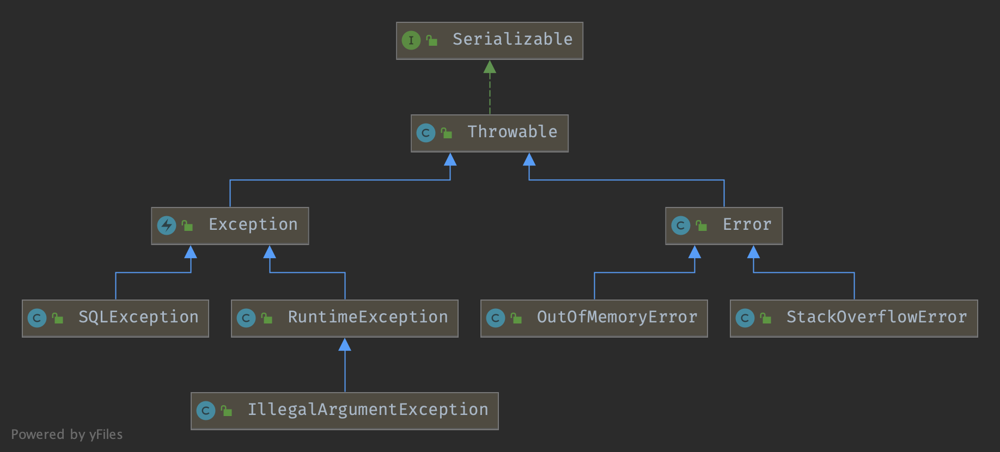

## Introduction

## Throwable Hierarchy

**NullPointerException**

对 null 对象调用**非静态**方法将抛出 NPE。

使用 == 或 != 比较 null 值，或使用 **Optional** 来避免比较。

仅在异常情况下使用异常

- 异常，顾名思义，仅应用于异常情况；绝不应用于普通的控制流。
- 设计良好的 API 不得强制其客户端将异常用于普通控制流。

对于可恢复的情况使用受检异常，对于编程错误使用运行时异常

- 对于调用者可以合理预期恢复的情况使用受检异常。
- 对于指示编程错误的情况使用运行时异常。

Java 层面的 NPE 主要分为两类，一类是代码中主动抛出 NPE 异常，并被 JVM 捕获 （这里的代码既可以是 Java 代码，也可以是 JVM 内部代码）；另一类隐式 NPE（其原理是 JVM 内部遇到空指针访问，会产生 SIGSEGV 信号， 在 JVM 内部还会检查运行时是否存在 SIGSEGV 信号）

## Links

- [JDK basics](/docs/CS/Java/JDK/Basic/Basic.md)
