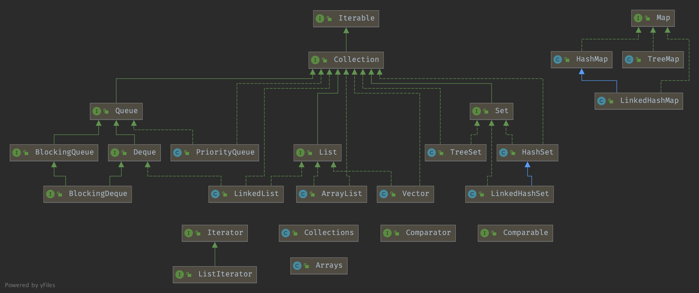

## Introduction

### Collection Hierarchy



- [List](/docs/CS/Java/JDK/Collection/List.md)
- [Map](/docs/CS/Java/JDK/Collection/Map.md)
- [Set](/docs/CS/Java/JDK/Collection/Set.md)
- [Queue](/docs/CS/Java/JDK/Collection/Queue.md)

### Collection

```java
public interface Collection<E> extends Iterable<E> {
    // Query Operations

    //Alaways returns the number of elements in this collection
  	// <= Integer.MAX_VALUE
    int size();

    //Returns true if this collection contains no elements.
    boolean isEmpty();

    boolean contains(Object o);

    Iterator<E> iterator();

    Object[] toArray();

    <T> T[] toArray(T[] a);

    default <T> T[] toArray(IntFunction<T[]> generator) {
        return toArray(generator.apply(0));
    }

    // Modification Operations

    boolean add(E e);

    boolean remove(Object o);


    // Bulk Operations

    boolean containsAll(Collection<?> c);

    boolean addAll(Collection<? extends E> c);

    boolean removeAll(Collection<?> c);

    default boolean removeIf(Predicate<? super E> filter) {
        Objects.requireNonNull(filter);
        boolean removed = false;
        final Iterator<E> each = iterator();
        while (each.hasNext()) {
            if (filter.test(each.next())) {
                each.remove();
                removed = true;
            }
        }
        return removed;
    }

    boolean retainAll(Collection<?> c);

    void clear();


    // Comparison and hashing

    boolean equals(Object o);

    int hashCode();
}
```

Since 1.8 add Stream API

```java
    // Creates a Spliterator over the elements in this collection.
		@Override
    default Spliterator<E> spliterator() {
        return Spliterators.spliterator(this, 0);
    }

    //Returns a sequential Stream with this collection as its source.
    default Stream<E> stream() {
        return StreamSupport.stream(spliterator(), false);
    }

    //Returns a possibly parallel Stream with this collection as its source.  
		//It is allowable for this method to return a sequential stream.
    default Stream<E> parallelStream() {
        return StreamSupport.stream(spliterator(), true);
    }
}
```

Allocate  memory when first element added.

## Concurrent Modify

### Fail-Fast

#### ConcurrentModificationException

*This exception may be thrown by methods that have detected concurrent modification of an object when such modification is not permissible.*

1. *For example, **it is not generally permissible for one thread to modify a Collection while another thread is iterating over it**.
   In general, the results of the iteration are undefined under these circumstances.
   Some Iterator implementations (including those of all the general purpose collection implementations provided by the JRE) may choose to throw this exception if this behavior is detected.
   Iterators that do this are known as fail-fast iterators, as they fail quickly and cleanly, rather that risking arbitrary, non-deterministic behavior at an undetermined time in the future.*
2. If **a single thread issues a sequence of method invocations that violates the contract of an object, the object may throw this exception**.
   For example, if a thread modifies a collection directly while it is iterating over the collection with a fail-fast iterator, the iterator will throw this exception.*

*Note that fail-fast behavior cannot be guaranteed as it is, generally speaking, impossible to make any hard guarantees in the presence of unsynchronized concurrent modification.
Fail-fast operations throw ConcurrentModificationException on a best-effort basis.
Therefore, it would be wrong to write a program that depended on this exception for its correctness: **ConcurrentModificationException should be used only to detect bugs**.*

```java
//for example in removeIf of ArrayList, check if the modCount == expectedModCount 
if (modCount != expectedModCount) {
    throw new ConcurrentModificationException();
}
```

### Fail-Safe

For example CopyOnWriteArrayList.

ConcurrentHashMap UNSAFE.getObjectVolatile

## Arrays

#### asList

Returns a **fixed-size** list( **java.util.Arrays$ArrayList** ) backed by the specified array. (Changes to the returned list "write through" to the array.) This method acts as bridge between array-based and collection-based APIs, in combination with Collection.toArray. The returned list is serializable and implements RandomAccess.
This method also provides a convenient way to create a fixed-size list initialized to contain several elements:
List<String> stooges = Arrays.asList("Larry", "Moe", "Curly");

```java
public static <T> List<T> asList(T... a) {
    return new ArrayList<>(a);
}
```

- When the parameter is primitiveType array, the List only has one element of this array.
- The  java.util.Arrays$ArrayList can't use remove method.

## Collections

### sort

```java
//Collections.java
public static <T> void sort(List<T> list, Comparator<? super T> c) {
    list.sort(c);
}

//List.java
default void sort(Comparator<? super E> c) {
    Object[] a = this.toArray();
    Arrays.sort(a, (Comparator) c);
    ListIterator<E> i = this.listIterator();
    for (Object e : a) {
        i.next();
        i.set((E) e);
    }
}

//Arrays.java
public static <T> void sort(T[] a, Comparator<? super T> c) {
    if (c == null) {
        sort(a);
    } else {
        if (LegacyMergeSort.userRequested)
            legacyMergeSort(a, c);
        else
            TimSort.sort(a, 0, a.length, c, null, 0, 0);
    }
}
```

### binarySearch

```java
public static <T>
int binarySearch(List<? extends Comparable<? super T>> list, T key) {
    if (list instanceof RandomAccess || list.size()<BINARYSEARCH_THRESHOLD)
        return Collections.indexedBinarySearch(list, key);
    else
        return Collections.iteratorBinarySearch(list, key);
}

private static <T>
int indexedBinarySearch(List<? extends Comparable<? super T>> list, T key) {
    int low = 0;
    int high = list.size()-1;

    while (low <= high) {
        int mid = (low + high) >>> 1;
        Comparable<? super T> midVal = list.get(mid);
        int cmp = midVal.compareTo(key);

        if (cmp < 0)
            low = mid + 1;
        else if (cmp > 0)
            high = mid - 1;
        else
            return mid; // key found
    }
    return -(low + 1);  // key not found
}

private static <T>
int iteratorBinarySearch(List<? extends Comparable<? super T>> list, T key)
{
    int low = 0;
    int high = list.size()-1;
    ListIterator<? extends Comparable<? super T>> i = list.listIterator();

    while (low <= high) {
        int mid = (low + high) >>> 1;
        Comparable<? super T> midVal = get(i, mid);
        int cmp = midVal.compareTo(key);

        if (cmp < 0)
            low = mid + 1;
        else if (cmp > 0)
            high = mid - 1;
        else
            return mid; // key found
    }
    return -(low + 1);  // key not found
}
```

### shuffle

```java
public static void shuffle(List<?> list, Random rnd) {
    int size = list.size();
    if (size < SHUFFLE_THRESHOLD || list instanceof RandomAccess) {
        for (int i=size; i>1; i--)
            swap(list, i-1, rnd.nextInt(i));
    } else {
        Object[] arr = list.toArray();

        // Shuffle array
        for (int i=size; i>1; i--)
            swap(arr, i-1, rnd.nextInt(i));

        // Dump array back into list
        // instead of using a raw type here, it's possible to capture
        // the wildcard but it will require a call to a supplementary
        // private method
        ListIterator it = list.listIterator();
        for (Object e : arr) {
            it.next();
            it.set(e);
        }
    }
}
```

### rarate

```java
public static void rotate(List<?> list, int distance) {
    if (list instanceof RandomAccess || list.size() < ROTATE_THRESHOLD)
        rotate1(list, distance);
    else
        rotate2(list, distance);
}

private static <T> void rotate1(List<T> list, int distance) {
    int size = list.size();
    if (size == 0)
        return;
    distance = distance % size;
    if (distance < 0)
        distance += size;
    if (distance == 0)
        return;

    for (int cycleStart = 0, nMoved = 0; nMoved != size; cycleStart++) {
        T displaced = list.get(cycleStart);
        int i = cycleStart;
        do {
            i += distance;
            if (i >= size)
                i -= size;
            displaced = list.set(i, displaced);
            nMoved ++;
        } while (i != cycleStart);
    }
}

private static void rotate2(List<?> list, int distance) {
    int size = list.size();
    if (size == 0)
        return;
    int mid =  -distance % size;
    if (mid < 0)
        mid += size;
    if (mid == 0)
        return;

    reverse(list.subList(0, mid));
    reverse(list.subList(mid, size));
    reverse(list);
}
```

## Iterable

```java
public interface Iterable<T> {

    Iterator<T> iterator();

    default void forEach(Consumer<? super T> action) {
        Objects.requireNonNull(action);
        for (T t : this) {
            action.accept(t);
        }
    }

    default Spliterator<T> spliterator() {
        return Spliterators.spliteratorUnknownSize(iterator(), 0);
    }
}
```

### Iterator

```java
public interface Iterator<E> {

    boolean hasNext();

    E next();

    default void remove() {
        throw new UnsupportedOperationException("remove");
    }

    default void forEachRemaining(Consumer<? super E> action) {
        Objects.requireNonNull(action);
        while (hasNext())
            action.accept(next());
    }
}
```

### ListIterator

*An iterator for lists that allows the programmer to **traverse the list in either direction, modify the list during iteration**, and **obtain the iterator's current position in the list**.
A ListIterator has no current element; its cursor position always lies between the element that would be returned by a call to previous() and the element that would be returned by a call to next().
**An iterator for a list of length n has n+1 possible cursor positions**, as illustrated by the carets (^) below:*
*Element(0)   Element(1)   Element(2)   ... Element(n-1)*
*cursor positions:  ^            ^            ^            ^                  ^*

*Note that **the remove and set(Object) methods are not defined in terms of the cursor position**; they are defined to operate on the last element returned by a call to next or previous().*

```java
public interface ListIterator<E> extends Iterator<E> {
    // Query Operations

    boolean hasNext();

    E next();

    boolean hasPrevious();

    E previous();

    int nextIndex();

    int previousIndex();


    // Modification Operations

    void remove();

    void set(E e);

    void add(E e);
}
```

## Links

- [JDK](/docs/CS/Java/JDK/JDK.md)
