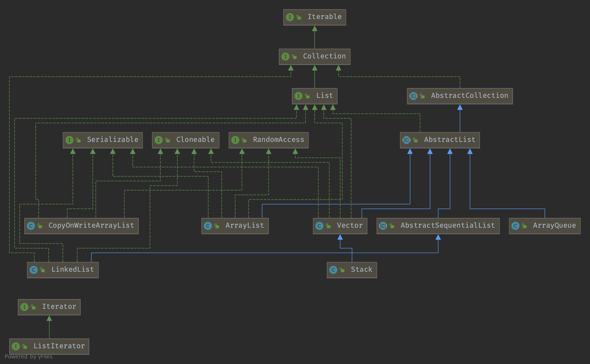

## Introduction


### List Hierarchy




## AbstractList

The number of times this list has been structurally modified. Structural modifications are those that change the size of the list, or otherwise perturb it in such a fashion that iterations in progress may yield incorrect results.

This field is used by the iterator and list iterator implementation returned by the iterator and listIterator methods. If the value of this field changes unexpectedly, the iterator (or list iterator) will throw a *ConcurrentModificationException* in response to the *next*, *remove*, *previous*, *set* or *add* operations. This provides **fail-fast** behavior, rather than non-deterministic behavior in the face of concurrent modification during iteration.

Use of this field by subclasses is optional. If a subclass wishes to provide fail-fast iterators (and list iterators), then it merely has to increment this field in its add(int, E) and remove(int) methods (and any other methods that it overrides that result in structural modifications to the list). A single call to add(int, E) or remove(int) must add no more than one to this field, or the iterators (and list iterators) will throw bogus *ConcurrentModificationExceptions*. If an implementation does not wish to provide fail-fast iterators, this field may be ignored.

```java
protected transient int modCount = 0;

private void checkForComodification(final int expectedModCount) {
        if (modCount != expectedModCount) {
            throw new ConcurrentModificationException();
        }
    }
```


## LinkedList

**Deque**接口是双端队列的意思，代表LinkedList支持两端元素插入和移除。

```java
public class LinkedList<E>
    extends AbstractSequentialList<E>
    implements List<E>, Deque<E>, Cloneable, java.io.Serializable
{
    transient int size = 0;

    // Pointer to first node.
    transient Node<E> first;

    //Pointer to last node.
    transient Node<E> last;

    /** Constructs an empty list. */
    public LinkedList() {
    }
}
```


### Node

```java
private static class Node<E> {
    E item;
    Node<E> next;
    Node<E> prev;

    Node(Node<E> prev, E element, Node<E> next) {
        this.item = element;
        this.next = next;
        this.prev = prev;
    }
}
```


### add

```java
/**
 * Appends the specified element to the end of this list.
 */
public boolean add(E e) {
    linkLast(e);
    return true;
}

/**
 * Inserts the specified element at the specified position in this list.
 * Shifts the element currently at that position (if any) and any
 * subsequent elements to the right (adds one to their indices).
 */
public void add(int index, E element) {
    checkPositionIndex(index);

    if (index == size)
        linkLast(element);
    else
        linkBefore(element, node(index));
}
```


## ArrayList

**RandomAccess**是一个标示性接口，代表ArrayList支持快速访问，而LinkedList不支持。

```java
public class ArrayList<E> extends AbstractList<E>
        implements List<E>, RandomAccess, Cloneable, java.io.Serializable {...}
```


### Fields

```java
/**
 * Default initial capacity.
 */
private static final int DEFAULT_CAPACITY = 10;

/**
 * Shared empty array instance used for empty instances.
 */
private static final Object[] EMPTY_ELEMENTDATA = {};

/**
 * Shared empty array instance used for default sized empty instances. We
 * distinguish this from EMPTY_ELEMENTDATA to know how much to inflate when
 * first element is added.
 */
private static final Object[] DEFAULTCAPACITY_EMPTY_ELEMENTDATA = {};

/**
 * The array buffer into which the elements of the ArrayList are stored.
 * The capacity of the ArrayList is the length of this array buffer. Any
 * empty ArrayList with elementData == DEFAULTCAPACITY_EMPTY_ELEMENTDATA
 * will be expanded to DEFAULT_CAPACITY when the first element is added.
 */
transient Object[] elementData; // non-private to simplify nested class access

private int size;

/**
 * Constructs an empty list with the specified initial capacity.
 */
public ArrayList(int initialCapacity) {
    if (initialCapacity > 0) {
        this.elementData = new Object[initialCapacity];
    } else if (initialCapacity == 0) {
        this.elementData = EMPTY_ELEMENTDATA;
    } else {
        throw new IllegalArgumentException("Illegal Capacity: "+
                                           initialCapacity);
    }
}

/**
 * Constructs an empty list with an initial capacity of ten.
 */
public ArrayList() {
    this.elementData = DEFAULTCAPACITY_EMPTY_ELEMENTDATA;
}
```


### add

```java
/**
 * Appends the specified element to the end of this list.
 */
public boolean add(E e) {
    ensureCapacityInternal(size + 1);  // Increments modCount!!
    elementData[size++] = e;
    return true;
}

/**
 * Inserts the specified element at the specified position in this
 * list. Shifts the element currently at that position (if any) and
 * any subsequent elements to the right (adds one to their indices).
 */
public void add(int index, E element) {
    rangeCheckForAdd(index);

    ensureCapacityInternal(size + 1);  // Increments modCount!!
    System.arraycopy(elementData, index, elementData, index + 1,
                     size - index);
    elementData[index] = element;
    size++;
}
```

JDK11 remove ensureCapacity and ensureCapacityInternal

```java
/**
 * Increases the capacity of this <tt>ArrayList</tt> instance, if
 * necessary, to ensure that it can hold at least the number of elements
 * specified by the minimum capacity argument.
 *
 * @param   minCapacity   the desired minimum capacity
 */
public void ensureCapacity(int minCapacity) {
    int minExpand = (elementData != DEFAULTCAPACITY_EMPTY_ELEMENTDATA)
        // any size if not default element table
        ? 0
        // larger than default for default empty table. It's already
        // supposed to be at default size.
        : DEFAULT_CAPACITY;

    if (minCapacity > minExpand) {
        ensureExplicitCapacity(minCapacity);
    }
}

private static int calculateCapacity(Object[] elementData, int minCapacity) {
    if (elementData == DEFAULTCAPACITY_EMPTY_ELEMENTDATA) {
        return Math.max(DEFAULT_CAPACITY, minCapacity);
    }
    return minCapacity;
}

private void ensureCapacityInternal(int minCapacity) {
    ensureExplicitCapacity(calculateCapacity(elementData, minCapacity));
}

private void ensureExplicitCapacity(int minCapacity) {
    modCount++;

    // overflow-conscious code
    if (minCapacity - elementData.length > 0)
        grow(minCapacity);
}
```

```java
/**
 * The maximum size of array to allocate.
 * Some VMs reserve some header words in an array.
 * Attempts to allocate larger arrays may result in
 * OutOfMemoryError: Requested array size exceeds VM limit
 */
private static final int MAX_ARRAY_SIZE = Integer.MAX_VALUE - 8;

/**
 * Increases the capacity to ensure that it can hold at least the
 * number of elements specified by the minimum capacity argument.
 */
private void grow(int minCapacity) {
    // overflow-conscious code
    int oldCapacity = elementData.length;
    int newCapacity = oldCapacity + (oldCapacity >> 1);
    if (newCapacity - minCapacity < 0)
        newCapacity = minCapacity;
    if (newCapacity - MAX_ARRAY_SIZE > 0)
        newCapacity = hugeCapacity(minCapacity);
    // minCapacity is usually close to size, so this is a win:
    elementData = Arrays.copyOf(elementData, newCapacity);
}
```


### copy

***int newCapacity = oldCapacity + (oldCapacity >> 1)***

**Arrays.copyOf use System.arraycopy**

*Copies an array from the specified source array, beginning at the specified position, to the specified position of the destination array. A subsequence of array components are copied from the source array referenced by src to the destination array referenced by dest. The number of components copied is equal to the length argument. The components at positions srcPos through srcPos+length-1 in the source array are copied into positions destPos through destPos+length-1, respectively, of the destination array.*
*If the src and dest arguments refer to the same array object, then the copying is performed as if the components at positions srcPos through srcPos+length-1 were first copied to a temporary array with length components and then the contents of the temporary array were copied into positions destPos through destPos+length-1 of the destination array.*
*If dest is null, then a NullPointerException is thrown.*
*If src is null, then a NullPointerException is thrown and the destination array is not modified.*
*Otherwise, if any of the following is true, an ArrayStoreException is thrown and the destination is not modified:*

1. *The src argument refers to an object that is not an array.*
2. *The dest argument refers to an object that is not an array.*
3. *The src argument and dest argument refer to arrays whose component types are different primitive types.*
4. *The src argument refers to an array with a primitive component type and the dest argument refers to an array with a reference component type.*
5. *The src argument refers to an array with a reference component type and the dest argument refers to an array with a primitive component type.*

*Otherwise, if any of the following is true, an IndexOutOfBoundsException is thrown and the destination is not modified:*

1. *The srcPos argument is negative.*
2. *The destPos argument is negative.*
3. *The length argument is negative.*
4. *srcPos+length is greater than src.length, the length of the source array.*
5. *destPos+length is greater than dest.length, the length of the destination array.*

*Otherwise, if any actual component of the source array from position srcPos through srcPos+length-1 cannot be converted to the component type of the destination array by assignment conversion, an ArrayStoreException is thrown. In this case, let k be the smallest nonnegative integer less than length such that src[srcPos+k] cannot be converted to the component type of the destination array; when the exception is thrown, source array components from positions srcPos through srcPos+k-1 will already have been copied to destination array positions destPos through destPos+k-1 and no other positions of the destination array will have been modified. *

***(Because of the restrictions already itemized, this paragraph effectively applies only to the situation where both arrays have component types that are reference types.)***

```java
public static native void arraycopy(Object src,  int  srcPos,
                                    Object dest, int destPos,
                                    int length);
```


ArayList use Object[], LinkedList use linked-list

1. Arraylist 从头部添加删除元素消耗比linkedlist大
2. 中间和末尾都较优于linkedlist 因为linkedlist去中间需要遍历N,创建元素消耗比array大,对象多

遍历时linkedlist使用迭代器能获得接近array的性能


### Remove

- 普通for循环正序删除（结果：会漏掉对后一个元素的判断）
- 普通for循环倒序删除（结果：正确删除）
- for-each循环删除（结果：抛出异常)
- Iterator遍历，使用ArrayList.remove()删除元素（结果：抛出异常）
- Iterator遍历，使用Iterator的remove删除元素（结果：正确删除）


## CopyOnWriteArrayList


```java
/** The lock protecting all mutators */
final transient ReentrantLock lock = new ReentrantLock();
```


```java
/** The array, accessed only via getArray/setArray. */
private transient volatile Object[] array;
```


### add

```java
public boolean add(E e) {
        final ReentrantLock lock = this.lock;
        lock.lock();
        try {
            Object[] elements = getArray();
            int len = elements.length;
            Object[] newElements = Arrays.copyOf(elements, len + 1);
            newElements[len] = e;
            setArray(newElements);
            return true;
        } finally {
            lock.unlock();
        }
    }
```


## Vector & Stack


Stack vs ArrayDeque


## Summary

`RA` = `RandomAccess`

| Type        | ArrayList    | LinkedList             | CopyOnWriteArrayList | Vector       | Stack  |
| ----------- | ------------ | ---------------------- | -------------------- | ------------ | ------ |
| Super Class | AbstractList | AbstractSequentialList |                      | AbstractList | Vector |
| Interface   | List&RA      | List&Deque             | List&RA              | List&RA      |        |
| Satety      | unsafe       | unsafe                 | safe                 | safe         | safe   |
| Resize      | 1.5          |                        |                      | 2            | 2      |
|             |              |                        |                      |              |        |
|             |              |                        |                      |              |        |

