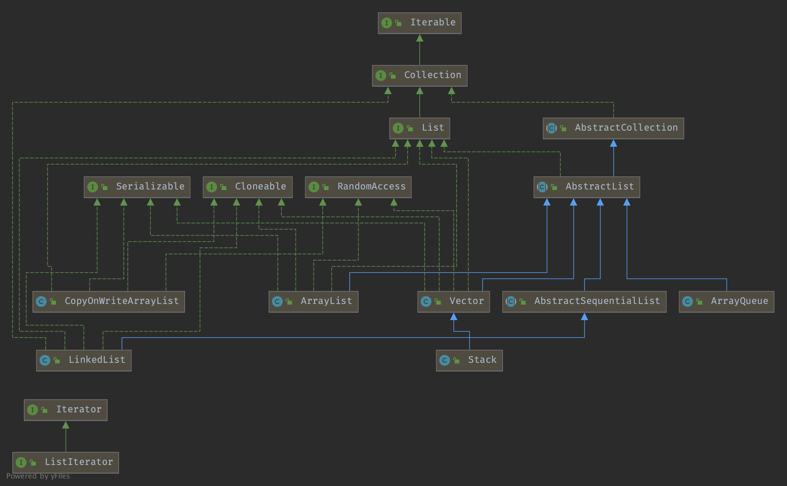

## Introduction

An ordered collection (also known as a sequence). The user of this interface has precise control over where in the list each element is inserted.
The user can access elements by their integer index (position in the list), and search for elements in the list.

Unlike sets, lists typically allow duplicate elements. More formally, lists typically allow pairs of elements e1 and e2 such that e1.equals(e2), and they typically allow multiple null elements if they allow null elements at all.
It is not inconceivable that someone might wish to implement a list that prohibits duplicates, by throwing runtime exceptions when the user attempts to insert them, but we expect this usage to be rare.

The List interface places additional stipulations, beyond those specified in the Collection interface, on the contracts of the iterator, add, remove, equals, and hashCode methods.
Declarations for other inherited methods are also included here for convenience.

The List interface provides four methods for positional (indexed) access to list elements. Lists (like Java arrays) are zero based.
Note that these operations may execute in time proportional to the index value for some implementations (the LinkedList class, for example).
Thus, iterating over the elements in a list is typically preferable to indexing through it if the caller does not know the implementation.

The List interface provides a special iterator, called a ListIterator, that allows element insertion and replacement, and bidirectional access in addition to the normal operations that the Iterator interface provides.
A method is provided to obtain a list iterator that starts at a specified position in the list.

The List interface provides two methods to search for a specified object. From a performance standpoint, these methods should be used with caution.
In many implementations they will perform costly linear searches.

The List interface provides two methods to efficiently insert and remove multiple elements at an arbitrary point in the list.

Note: While it is permissible for lists to contain themselves as elements, extreme caution is advised: the equals and hashCode methods are no longer well defined on such a list.
Some list implementations have restrictions on the elements that they may contain. For example, some implementations prohibit null elements, and some have restrictions on the types of their elements.
Attempting to add an ineligible element throws an unchecked exception, typically NullPointerException or ClassCastException.
Attempting to query the presence of an ineligible element may throw an exception, or it may simply return false; some implementations will exhibit the former behavior and some will exhibit the latter.
More generally, attempting an operation on an ineligible element whose completion would not result in the insertion of an ineligible element into the list may throw an exception or it may succeed, at the option of the implementation.
Such exceptions are marked as "optional" in the specification for this interface.

Unmodifiable Lists

The List.of and List.copyOf static factory methods provide a convenient way to create unmodifiable lists. The List instances created by these methods have the following characteristics:
_ They are unmodifiable. Elements cannot be added, removed, or replaced. Calling any mutator method on the List will always cause UnsupportedOperationException to be thrown.
However, if the contained elements are themselves mutable, this may cause the List's contents to appear to change.
_ They disallow null elements. Attempts to create them with null elements result in NullPointerException.
_ They are serializable if all elements are serializable.
_ The order of elements in the list is the same as the order of the provided arguments, or of the elements in the provided array.
_ The lists and their subList views implement the RandomAccess interface.
_ They are value-based. Callers should make no assumptions about the identity of the returned instances. Factories are free to create new instances or reuse existing ones.
Therefore, identity-sensitive operations on these instances (reference equality (==), identity hash code, and synchronization) are unreliable and should be avoided.

They are serialized as specified on the Serialized Form page

### List Hierarchy



## AbstractList

The number of times this list has been structurally modified. Structural modifications are those that change the size of the list, or otherwise perturb it in such a fashion that iterations in progress may yield incorrect results.

This field is used by the iterator and list iterator implementation returned by the iterator and listIterator methods.
If the value of this field changes unexpectedly, the iterator (or list iterator) will throw a *ConcurrentModificationException* in response to the *next*, *remove*, *previous*, *set* or *add* operations.
This provides **fail-fast** behavior, rather than non-deterministic behavior in the face of concurrent modification during iteration.

Use of this field by subclasses is optional. If a subclass wishes to provide fail-fast iterators (and list iterators), then it merely has to increment this field in its add(int, E) and remove(int) methods (and any other methods that it overrides that result in structural modifications to the list). A single call to add(int, E) or remove(int) must add no more than one to this field, or the iterators (and list iterators) will throw bogus *ConcurrentModificationExceptions*. If an implementation does not wish to provide fail-fast iterators, this field may be ignored.

```
protected transient int modCount = 0;

private void checkForComodification(final int expectedModCount) {
        if (modCount != expectedModCount) {
            throw new ConcurrentModificationException();
        }
    }
```

## LinkedList

**Deque** means that the LinkedList supports insertion/deletion from head and tail.

```java
public class LinkedList<E> extends AbstractSequentialList<E> implements List<E>, Deque<E>, Cloneable, java.io.Serializable
{
    transient int size = 0;

    transient Node<E> first;

    transient Node<E> last;

    /** Constructs an empty list. */
    public LinkedList() {
    }
}
```

Each Node has prev and next Node.

```java
private static class Node<E> {
    E item;
    Node<E> next;
    Node<E> prev;

    Node(Node<E> prev, E element, Node<E> next) {
        this.item = element;
        this.next = next;
        this.prev = prev;
    }
}
```

### add

Find the (non-null) Node at the specified element index if not the first/last.

```java
public class LinkedList<E> {
    public void add(int index, E element) {
        checkPositionIndex(index);
        if (index == size)
            linkLast(element);
        else
            linkBefore(element, node(index));
    }

    Node<E> node(int index) {
        if (index < (size >> 1)) {
            Node<E> x = first;
            for (int i = 0; i < index; i++)
                x = x.next;
            return x;
        } else {
            Node<E> x = last;
            for (int i = size - 1; i > index; i--)
                x = x.prev;
            return x;
        }
    }
}
```

## ArrayList

```java
public class ArrayList<E> extends AbstractList<E>
        implements List<E>, RandomAccess, Cloneable, java.io.Serializable {

    private static final int DEFAULT_CAPACITY = 10;

    private static final Object[] EMPTY_ELEMENTDATA = {};

    private static final Object[] DEFAULTCAPACITY_EMPTY_ELEMENTDATA = {};

    transient Object[] elementData; // non-private to simplify nested class access

    private int size;

    // Constructs an empty list with the specified initial capacity.
    public ArrayList(int initialCapacity) {
        if (initialCapacity > 0) {
            this.elementData = new Object[initialCapacity];
        } else if (initialCapacity == 0) {
            this.elementData = EMPTY_ELEMENTDATA;
        } else {
            throw new IllegalArgumentException("Illegal Capacity: " +
                    initialCapacity);
        }
    }

    // Constructs an empty list with an initial capacity of ten.
    public ArrayList() {
        this.elementData = DEFAULTCAPACITY_EMPTY_ELEMENTDATA;
    }
}
```

### add

```java
public boolean add(E e) {
    ensureCapacityInternal(size + 1);  // Increments modCount!!
    elementData[size++] = e;
    return true;
}

public void add(int index, E element) {
    rangeCheckForAdd(index);

    ensureCapacityInternal(size + 1);  // Increments modCount!!
    System.arraycopy(elementData, index, elementData, index + 1,
                     size - index);
    elementData[index] = element;
    size++;
}
```

JDK11 remove ensureCapacity and ensureCapacityInternal

```java
public void ensureCapacity(int minCapacity) {
    int minExpand = (elementData != DEFAULTCAPACITY_EMPTY_ELEMENTDATA)
        // any size if not default element table
        ? 0
        // larger than default for default empty table. It's already
        // supposed to be at default size.
        : DEFAULT_CAPACITY;

    if (minCapacity > minExpand) {
        ensureExplicitCapacity(minCapacity);
    }
}

private static int calculateCapacity(Object[] elementData, int minCapacity) {
    if (elementData == DEFAULTCAPACITY_EMPTY_ELEMENTDATA) {
        return Math.max(DEFAULT_CAPACITY, minCapacity);
    }
    return minCapacity;
}

private void ensureCapacityInternal(int minCapacity) {
    ensureExplicitCapacity(calculateCapacity(elementData, minCapacity));
}

private void ensureExplicitCapacity(int minCapacity) {
    modCount++;

    // overflow-conscious code
    if (minCapacity - elementData.length > 0)
        grow(minCapacity);
}
```

```java
/**
 * The maximum size of array to allocate.
 * Some VMs reserve some header words in an array.
 * Attempts to allocate larger arrays may result in
 * OutOfMemoryError: Requested array size exceeds VM limit
 */
private static final int MAX_ARRAY_SIZE = Integer.MAX_VALUE - 8;

/**
 * Increases the capacity to ensure that it can hold at least the
 * number of elements specified by the minimum capacity argument.
 */
private void grow(int minCapacity) {
    // overflow-conscious code
    int oldCapacity = elementData.length;
    int newCapacity = oldCapacity + (oldCapacity >> 1);
    if (newCapacity - minCapacity < 0)
        newCapacity = minCapacity;
    if (newCapacity - MAX_ARRAY_SIZE > 0)
        newCapacity = hugeCapacity(minCapacity);
    // minCapacity is usually close to size, so this is a win:
    elementData = Arrays.copyOf(elementData, newCapacity);
}
```

### remove

```java
    public boolean removeAll(Collection<?> c) {
        return batchRemove(c, false, 0, size);
    }

    boolean batchRemove(Collection<?> c, boolean complement,
                        final int from, final int end) {
        Objects.requireNonNull(c);
        final Object[] es = elementData;
        int r;
        // Optimize for initial run of survivors
        for (r = from; ; r++) {
            if (r == end)
                return false;
            if (c.contains(es[r]) != complement)
                break;
        }
        int w = r++;
        try {
            for (Object e; r < end; r++)
                if (c.contains(e = es[r]) == complement)
                    es[w++] = e;
        } catch (Throwable ex) {
            // Preserve behavioral compatibility with AbstractCollection,
            // even if c.contains() throws.
            System.arraycopy(es, r, es, w, end - r);
            w += end - r;
            throw ex;
        } finally {
            modCount += end - w;
            shiftTailOverGap(es, w, end);
        }
        return true;
    }
```

### copy

***int newCapacity = oldCapacity + (oldCapacity >> 1)***

**Arrays.copyOf use System.arraycopy**

Copies an array from the specified source array, beginning at the specified position, to the specified position of the destination array.
A subsequence of array components are copied from the source array referenced by src to the destination array referenced by dest.
The number of components copied is equal to the length argument.
The components at positions srcPos through srcPos+length-1 in the source array are copied into positions destPos through destPos+length-1, respectively, of the destination array.
If the src and dest arguments refer to the same array object, then the copying is performed as if the components at positions srcPos through srcPos+length-1
were first copied to a temporary array with length components and then the contents of the temporary array were copied into positions destPos through destPos+length-1 of the destination array.
If dest is null, then a NullPointerException is thrown.
If src is null, then a NullPointerException is thrown and the destination array is not modified.
Otherwise, if any of the following is true, an ArrayStoreException is thrown and the destination is not modified:

1. *The src argument refers to an object that is not an array.*
2. *The dest argument refers to an object that is not an array.*
3. *The src argument and dest argument refer to arrays whose component types are different primitive types.*
4. *The src argument refers to an array with a primitive component type and the dest argument refers to an array with a reference component type.*
5. *The src argument refers to an array with a reference component type and the dest argument refers to an array with a primitive component type.*

Otherwise, if any of the following is true, an IndexOutOfBoundsException is thrown and the destination is not modified:

1. *The srcPos argument is negative.*
2. *The destPos argument is negative.*
3. *The length argument is negative.*
4. *srcPos+length is greater than src.length, the length of the source array.*
5. *destPos+length is greater than dest.length, the length of the destination array.*

Otherwise, if any actual component of the source array from position srcPos through srcPos+length-1 cannot be converted to the component type of the destination array by assignment conversion,
an ArrayStoreException is thrown.
In this case, let k be the smallest nonnegative integer less than length such that src[srcPos+k] cannot be converted to the component type of the destination array;
when the exception is thrown, source array components from positions srcPos through srcPos+k-1 will already have been copied to destination array positions destPos
through destPos+k-1 and no other positions of the destination array will have been modified.

**(Because of the restrictions already itemized, this paragraph effectively applies only to the situation where both arrays have component types that are reference types.)**

```
public static native void arraycopy(Object src,  int  srcPos,
                                    Object dest, int destPos,
                                    int length);
```

ArayList use Object[], LinkedList use linked-list

1. Arraylist 从头部添加删除元素消耗比linkedlist大
2. 中间和末尾都较优于linkedlist 因为linkedlist去中间需要遍历N,创建元素消耗比array大,对象多

遍历时linkedlist使用迭代器能获得接近array的性能

### remove


| Method                                 | Result          |
| -------------------------------------- | --------------- |
| Positive for ｜ lost the check of next |                 |
| Reverse for                            | right result    |
| foreach                                | throw Exception |
| Iterator with       ArrayList.remove() | throw Exception |
| Iterator with       Iterator.remove()  | right result    |

### ArrayList Extensions

A customized implementation of java.util.ArrayList designed to operate in a multithreaded environment where the large majority of method calls are read-only, instead of structural changes. When operating in "fast" mode, read calls are non-synchronized and write calls perform the following steps:

- Clone the existing collection
- Perform the modification on the clone
- Replace the existing collection with the (modified) clone

NOTE: If you are creating and accessing an ArrayList only within a single thread, you should use java.util.ArrayList directly (with no synchronization), for maximum performance.

NOTE: This class is not cross-platform. Using it may cause unexpected failures on some architectures.
It suffers from the same problems as the double-checked locking idiom. In particular, the instruction that clones the internal collection and the instruction that sets the internal reference to the clone can be executed or perceived out-of-order.
This means that any read operation might fail unexpectedly, as it may be reading the state of the internal collection before the internal collection is fully formed.
For more information on the double-checked locking idiom, see the Double-Checked Locking Idiom Is Broken Declaration .

```java
package org.apache.commons.collections;

public class FastArrayList extends ArrayList {
    public void add(int index, Object element) {

        if (fast) {
            synchronized (this) {
                ArrayList temp = (ArrayList) list.clone();
                temp.add(index, element);
                list = temp;
            }
        } else {
            synchronized (list) {
                list.add(index, element);
            }
        }

    }
}
```

## CopyOnWriteArrayList

Use [ReentrantLock](/docs/CS/Java/JDK/Concurrency/ReentrantLock.md) in add/remove

```java
/** The lock protecting all mutators */
final transient ReentrantLock lock = new ReentrantLock();
```

```java
/** The array, accessed only via getArray/setArray. */
private transient volatile Object[] array;
```

### get

no Lock

```java
public E get(int index) {
    return elementAt(getArray(), index);
}

static <E> E elementAt(Object[] a, int index) {
  return (E) a[index];
}
```

### add

```java
public boolean add(E e) {
        final ReentrantLock lock = this.lock;
        lock.lock();
        try {
            Object[] elements = getArray();
            int len = elements.length;
            Object[] newElements = Arrays.copyOf(elements, len + 1);
            newElements[len] = e;
            setArray(newElements);
            return true;
        } finally {
            lock.unlock();
        }
    }
```

## Vector & Stack

Stack vs ArrayDeque

## Summary


| Type              | ArrayList          | LinkedList             | CopyOnWriteArrayList | Vector             | Stack              |
| ----------------- | ------------------ | ---------------------- | -------------------- | ------------------ | ------------------ |
| Super Class       | AbstractList       | AbstractSequentialList | Object               | AbstractList       | Vector             |
| Satety            | unsafe             | unsafe                 | safe                 | safe               | safe               |
| Size after expand | 1.5                |                        | 1.5                  | 2                  | 2                  |
| RandomAccess      | :white_check_mark: | :x:                    | :white_check_mark:   | :white_check_mark: | :white_check_mark: |
|                   |                    |                        |                      |                    |                    |

## Links

- [Collection](/docs/CS/Java/JDK/Collection/Collection.md)
