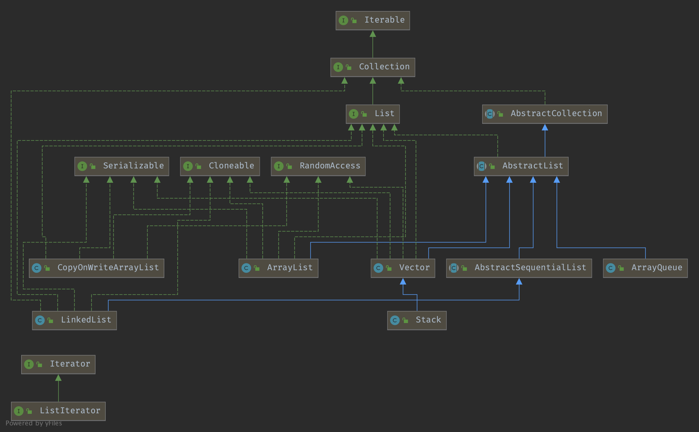

## Introduction

有序集合（也称为序列）。该接口的用户可以精确控制列表中每个元素的插入位置。
用户可以通过整数索引（列表中的位置）访问元素，并在列表中搜索元素。

与 Set 不同，List 通常允许重复元素。更正式地说，List 通常允许满足 e1.equals(e2) 的元素对 e1 和 e2，并且如果允许 null 元素的话，通常允许多个 null 元素。
不排除有人希望实现禁止重复元素的 List，在用户尝试插入重复元素时抛出运行时异常，但我们预计这种用法很少见。

List 接口在 Collection 接口规定的基础上，对 iterator、add、remove、equals 和 hashCode 方法的约定增加了额外要求。
其他继承方法的声明也包含在此处以方便查阅。

List 接口提供了四种用于按位置（索引）访问列表元素的方法。List（如 Java 数组）是从零开始的。
注意，对于某些实现（例如 LinkedList 类），这些操作的执行时间可能与索引值成比例。
因此，如果调用者不知道具体实现，遍历列表中的元素通常比通过索引访问更优。

List 接口提供了一种特殊的迭代器，称为 ListIterator，它除了支持 Iterator 接口提供的正常操作外，还允许元素插入、替换和双向访问。
提供了获得从列表指定位置开始的列表迭代器的方法。

List 接口提供了两种搜索指定对象的方法。从性能角度来看，应谨慎使用这些方法。
在许多实现中，它们将执行代价高昂的线性搜索。

List 接口提供了两种在列表中任意位置高效插入和删除多个元素的方法。

注意：虽然允许列表将自身作为元素包含，但强烈建议谨慎：此类列表上的 equals 和 hashCode 方法不再有良好定义。
某些列表实现可能对其包含的元素有限制。例如，某些实现禁止 null 元素，某些实现对其元素类型有限制。
尝试添加不符合条件的元素将抛出未检查异常，通常为 NullPointerException 或 ClassCastException。
尝试查询不符合条件的元素是否存在可能会抛出异常，也可能直接返回 false；某些实现会表现出前一种行为，某些则会表现出后一种。
更一般地，对不符合条件的元素执行操作（如果该操作完成不会导致将不符合条件的元素插入列表）可能会抛出异常，也可能成功，具体取决于实现。
此类异常在此接口的规范中被标记为"可选"。

## Unmodifiable Lists

List.of 和 List.copyOf 静态工厂方法提供了创建不可变列表的便捷方式。通过这些方法创建的 List 实例具有以下特性：
- 它们是不可变的。不能添加、删除或替换元素。对 List 调用任何修改方法都将始终抛出 UnsupportedOperationException。
但是，如果包含的元素本身是可变的，则可能导致 List 的内容看起来发生了变化。
- 它们不允许 null 元素。尝试使用 null 元素创建它们将导致 NullPointerException。
- 如果所有元素都是可序列化的，则它们是可序列化的。
- 列表中元素的顺序与提供的参数顺序或提供的数组中的元素顺序相同。
- 这些列表及其 subList 视图实现了 RandomAccess 接口。
- 它们是基于值的（value-based）。调用者不应假设返回实例的身份。工厂可以自由创建新实例或重用现有实例。
因此，对这些实例进行身份敏感的操作（引用相等性（==）、身份哈希码和同步）是不可靠的，应避免使用。

它们按照序列化表单页面上指定的方式进行序列化。

### List Hierarchy



## AbstractList

此列表已被结构修改的次数。结构修改是指改变列表大小的修改，或者以其他方式扰动列表，使得正在进行的迭代可能产生错误结果。

此字段由 iterator 和 listIterator 方法返回的迭代器和列表迭代器实现使用。
如果此字段的值意外更改，迭代器（或列表迭代器）将在响应 *next*、*remove*、*previous*、*set* 或 *add* 操作时抛出 *ConcurrentModificationException*。
这提供了**快速失败**行为，而不是在迭代期间面对并发修改时的不确定性行为。

子类对此字段的使用是可选的。如果子类希望提供快速失败迭代器（和列表迭代器），则只需在其 add(int, E) 和 remove(int) 方法（以及它重写的任何其他导致列表结构修改的方法）中增加此字段。
单次调用 add(int, E) 或 remove(int) 必须使此字段的增加不超过 1，否则迭代器（和列表迭代器）将抛出虚假的 *ConcurrentModificationException*。
如果实现不希望提供快速失败迭代器，则可以忽略此字段。

```
protected transient int modCount = 0;

private void checkForComodification(final int expectedModCount) {
        if (modCount != expectedModCount) {
            throw new ConcurrentModificationException();
        }
    }
```

### subList

返回此列表中指定的 fromIndex（包含）和 toIndex（不包含）之间的部分视图。
（如果 fromIndex 和 toIndex 相等，则返回的列表为空。）返回的列表由 this 列表支持，因此返回列表中的非结构性更改会反映在 this 列表中，反之亦然。
返回的列表支持此列表支持的所有可选列表操作。

此方法消除了对显式范围操作的需要（通常对数组执行的操作）。
任何期望列表的操作都可以通过传递 subList 视图而不是整个列表来作为范围操作使用。
例如，以下习惯用法从列表中删除一个元素范围：

> [!TIP]
> 
> Stream#skip and Stream#limit instead.

## LinkedList

> [!NOTE]
> 
> Does anyone actually use LinkedList? I wrote it, and I never use it. -- Joshua Bloch

**Deque** 表示 LinkedList 支持从头部和尾部插入/删除。

```java
public class LinkedList<E> extends AbstractSequentialList<E> implements List<E>, Deque<E>, Cloneable, java.io.Serializable
{
    transient int size = 0;

    transient Node<E> first;

    transient Node<E> last;

    /** Constructs an empty list. */
    public LinkedList() {
    }
}
```

每个 Node 都有 prev 和 next 指针。

```java
private static class Node<E> {
    E item;
    Node<E> next;
    Node<E> prev;

    Node(Node<E> prev, E element, Node<E> next) {
        this.item = element;
        this.next = next;
        this.prev = prev;
    }
}
```

### add

如果既不是第一个也不是最后一个，则查找指定元素索引处的（非空）Node。

```java
public class LinkedList<E> {
    public void add(int index, E element) {
        checkPositionIndex(index);
        if (index == size)
            linkLast(element);
        else
            linkBefore(element, node(index));
    }

    Node<E> node(int index) {
        if (index < (size >> 1)) {
            Node<E> x = first;
            for (int i = 0; i < index; i++)
                x = x.next;
            return x;
        } else {
            Node<E> x = last;
            for (int i = size - 1; i > index; i--)
                x = x.prev;
            return x;
        }
    }
}
```

## ArrayList

```java
public class ArrayList<E> extends AbstractList<E>
        implements List<E>, RandomAccess, Cloneable, java.io.Serializable {

    private static final int DEFAULT_CAPACITY = 10;

    private static final Object[] EMPTY_ELEMENTDATA = {};

    private static final Object[] DEFAULTCAPACITY_EMPTY_ELEMENTDATA = {};

    transient Object[] elementData; // non-private to simplify nested class access

    private int size;

    // Constructs an empty list with the specified initial capacity.
    public ArrayList(int initialCapacity) {
        if (initialCapacity > 0) {
            this.elementData = new Object[initialCapacity];
        } else if (initialCapacity == 0) {
            this.elementData = EMPTY_ELEMENTDATA;
        } else {
            throw new IllegalArgumentException("Illegal Capacity: " +
                    initialCapacity);
        }
    }

    // Constructs an empty list with an initial capacity of ten.
    public ArrayList() {
        this.elementData = DEFAULTCAPACITY_EMPTY_ELEMENTDATA;
    }
}
```

### add

```java
public boolean add(E e) {
    ensureCapacityInternal(size + 1);  // Increments modCount!!
    elementData[size++] = e;
    return true;
}

public void add(int index, E element) {
    rangeCheckForAdd(index);

    ensureCapacityInternal(size + 1);  // Increments modCount!!
    System.arraycopy(elementData, index, elementData, index + 1,
                     size - index);
    elementData[index] = element;
    size++;
}
```

JDK11 移除了 ensureCapacity 和 ensureCapacityInternal

```java
public void ensureCapacity(int minCapacity) {
    int minExpand = (elementData != DEFAULTCAPACITY_EMPTY_ELEMENTDATA)
        // any size if not default element table
        ? 0
        // larger than default for default empty table. It's already
        // supposed to be at default size.
        : DEFAULT_CAPACITY;

    if (minCapacity > minExpand) {
        ensureExplicitCapacity(minCapacity);
    }
}

private static int calculateCapacity(Object[] elementData, int minCapacity) {
    if (elementData == DEFAULTCAPACITY_EMPTY_ELEMENTDATA) {
        return Math.max(DEFAULT_CAPACITY, minCapacity);
    }
    return minCapacity;
}

private void ensureCapacityInternal(int minCapacity) {
    ensureExplicitCapacity(calculateCapacity(elementData, minCapacity));
}

private void ensureExplicitCapacity(int minCapacity) {
    modCount++;

    // overflow-conscious code
    if (minCapacity - elementData.length > 0)
        grow(minCapacity);
}
```

```java
/**
 * The maximum size of array to allocate.
 * Some VMs reserve some header words in an array.
 * Attempts to allocate larger arrays may result in
 * OutOfMemoryError: Requested array size exceeds VM limit
 */
private static final int MAX_ARRAY_SIZE = Integer.MAX_VALUE - 8;

/**
 * Increases the capacity to ensure that it can hold at least the
 * number of elements specified by the minimum capacity argument.
 */
private void grow(int minCapacity) {
    // overflow-conscious code
    int oldCapacity = elementData.length;
    int newCapacity = oldCapacity + (oldCapacity >> 1);
    if (newCapacity - minCapacity < 0)
        newCapacity = minCapacity;
    if (newCapacity - MAX_ARRAY_SIZE > 0)
        newCapacity = hugeCapacity(minCapacity);
    // minCapacity is usually close to size, so this is a win:
    elementData = Arrays.copyOf(elementData, newCapacity);
}
```

### remove

```java
    public boolean removeAll(Collection<?> c) {
        return batchRemove(c, false, 0, size);
    }

    boolean batchRemove(Collection<?> c, boolean complement,
                        final int from, final int end) {
        Objects.requireNonNull(c);
        final Object[] es = elementData;
        int r;
        // Optimize for initial run of survivors
        for (r = from; ; r++) {
            if (r == end)
                return false;
            if (c.contains(es[r]) != complement)
                break;
        }
        int w = r++;
        try {
            for (Object e; r < end; r++)
                if (c.contains(e = es[r]) == complement)
                    es[w++] = e;
        } catch (Throwable ex) {
            // Preserve behavioral compatibility with AbstractCollection,
            // even if c.contains() throws.
            System.arraycopy(es, r, es, w, end - r);
            w += end - r;
            throw ex;
        } finally {
            modCount += end - w;
            shiftTailOverGap(es, w, end);
        }
        return true;
    }
```

### copy

***int newCapacity = oldCapacity + (oldCapacity >> 1)***

**Arrays.copyOf 使用 System.arraycopy**

从指定源数组复制一个数组，从指定位置开始，到目标数组的指定位置结束。
从 src 引用的源数组复制一系列数组组件到 dest 引用的目标数组。
复制的组件数量等于 length 参数。
源数组中位置 srcPos 到 srcPos+length-1 的组件分别被复制到目标数组的位置 destPos 到 destPos+length-1。
如果 src 和 dest 参数引用同一个数组对象，则复制过程就如同先将位置 srcPos 到 srcPos+length-1 的组件复制到一个具有 length 组件的临时数组，
然后再将临时数组的内容复制到目标数组的位置 destPos 到 destPos+length-1。
如果 dest 为 null，则抛出 NullPointerException。
如果 src 为 null，则抛出 NullPointerException 且目标数组不被修改。
否则，如果以下任一条件为真，则抛出 ArrayStoreException 且目标不被修改：

1. *src 参数引用的对象不是数组。*
2. *dest 参数引用的对象不是数组。*
3. *src 参数和 dest 参数引用的是组件类型不同的原始类型数组。*
4. *src 参数引用的是原始组件类型的数组，而 dest 参数引用的是引用组件类型的数组。*
5. *src 参数引用的是引用组件类型的数组，而 dest 参数引用的是原始组件类型的数组。*

否则，如果以下任一条件为真，则抛出 IndexOutOfBoundsException 且目标不被修改：

1. *srcPos 参数为负数。*
2. *destPos 参数为负数。*
3. *length 参数为负数。*
4. *srcPos+length 大于 src.length（源数组的长度）。*
5. *destPos+length 大于 dest.length（目标数组的长度）。*

否则，如果源数组中位置 srcPos 到 srcPos+length-1 的任何实际组件无法通过赋值转换转换为目标数组的组件类型，
则抛出 ArrayStoreException。
在这种情况下，令 k 为小于 length 的最小非负整数，使得 src[srcPos+k] 无法转换为目标数组的组件类型；
抛出异常时，源数组中位置 srcPos 到 srcPos+k-1 的组件已被复制到目标数组的位置 destPos 到 destPos+k-1，
目标数组的其他位置不会被修改。

**（由于已经列出的限制，此段实际上仅适用于两个数组的组件类型均为引用类型的情况。）**

```
public static native void arraycopy(Object src,  int  srcPos,
                                    Object dest, int destPos,
                                    int length);
```

ArrayList 使用 Object[]，LinkedList 使用链表。

1. ArrayList 从头部添加删除元素消耗比 LinkedList 大
2. 中间和末尾都较优于 LinkedList，因为 LinkedList 去中间需要遍历 N，创建元素消耗比 array 大，对象多

遍历时 LinkedList 使用迭代器能获得接近 array 的性能。

### remove

| Method                                 | Result          |
| -------------------------------------- | --------------- |
| Positive for ｜ lost the check of next |                 |
| Reverse for                            | right result    |
| foreach                                | throw Exception |
| Iterator with       ArrayList.remove() | throw Exception |
| Iterator with       Iterator.remove()  | right result    |

### ArrayList Extensions

java.util.ArrayList 的自定义实现，专为大多数方法调用为只读而非结构修改的多线程环境而设计。
在"快速"模式下运行时，读取调用是非同步的，写入调用执行以下步骤：

- 克隆现有集合
- 对克隆执行修改
- 用（修改后的）克隆替换现有集合

注意：如果仅在单个线程内创建和访问 ArrayList，应直接使用 java.util.ArrayList（无需同步）以获得最大性能。

注意：此类不是跨平台的。在某些架构上使用可能会导致意外失败。
它存在与双重检查锁定习惯用法相同的问题。特别是，克隆内部集合的指令和设置内部引用指向克隆的指令可能乱序执行或感知。
这意味着任何读取操作都可能意外失败，因为它可能在内部集合完全形成之前读取其状态。
有关双重检查锁定习惯用法的更多信息，请参阅双重检查锁定习惯用法已失效声明。

```java
package org.apache.commons.collections;

public class FastArrayList extends ArrayList {
    public void add(int index, Object element) {

        if (fast) {
            synchronized (this) {
                ArrayList temp = (ArrayList) list.clone();
                temp.add(index, element);
                list = temp;
            }
        } else {
            synchronized (list) {
                list.add(index, element);
            }
        }

    }
}
```

## CopyOnWriteArrayList

add/remove 中使用 [ReentrantLock](/docs/CS/Java/JDK/Concurrency/ReentrantLock.md)

```java
/** The lock protecting all mutators */
final transient ReentrantLock lock = new ReentrantLock();
```

```java
/** The array, accessed only via getArray/setArray. */
private transient volatile Object[] array;
```

### get

无锁

```java
public E get(int index) {
    return elementAt(getArray(), index);
}

static <E> E elementAt(Object[] a, int index) {
  return (E) a[index];
}
```

### add

```java
public boolean add(E e) {
        final ReentrantLock lock = this.lock;
        lock.lock();
        try {
            Object[] elements = getArray();
            int len = elements.length;
            Object[] newElements = Arrays.copyOf(elements, len + 1);
            newElements[len] = e;
            setArray(newElements);
            return true;
        } finally {
            lock.unlock();
        }
    }
```

## Vector & Stack

Stack vs ArrayDeque

## Summary

| Type              | ArrayList          | LinkedList             | CopyOnWriteArrayList | Vector             | Stack              |
| ----------------- | ------------------ | ---------------------- | -------------------- | ------------------ | ------------------ |
| Super Class       | AbstractList       | AbstractSequentialList | Object               | AbstractList       | Vector             |
| Satety            | unsafe             | unsafe                 | safe                 | safe               | safe               |
| Size after expand | 1.5                |                        | 1.5                  | 2                  | 2                  |
| RandomAccess      | :white_check_mark: | :x:                    | :white_check_mark:   | :white_check_mark: | :white_check_mark: |
|                   |                    |                        |                      |                    |                    |

## Links

- [Collection](/docs/CS/Java/JDK/Collection/Collection.md)
