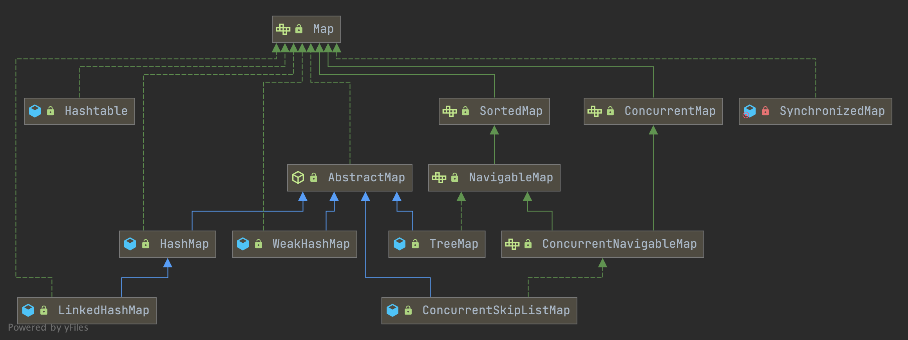
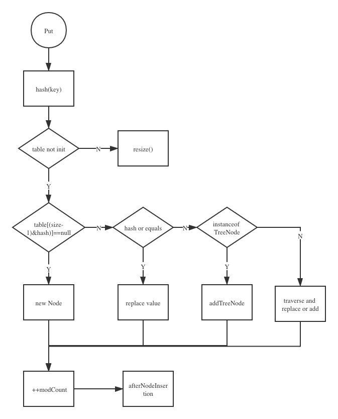

### Map Hierarchy



## Summary

`RBT` = `Red-Black Tree`

| Type            | HashTable          | HashMap                   | ConcurrentHashMap     | TreeMap            | LinkedHashMap             |
| --------------- | ------------------ | ------------------------- | --------------------- | ------------------ | ------------------------- |
| Structure       | array+linked list  | array+linked list+RBT     | array+linked list+RBT | array+RBT          | array+linked list+RBT     |
| Safty           | safe               | unsafe                    | safe                  | unsafe             | unsafe                    |
| Super Class     | Dictionary         | AbstractMap               | AbstractMap           | AbstractMap        | HashMap                   |
| Interface       | Map                | Map                       | ConcurrentMap         | NavigableMap       | Map                       |
| Performance     | low                | high                      | medium                | high               | high                      |
| Element         | nonull key & value | one null key & null value | nonull key & value    | nonull key & value | one null key & null value |
| Default Capcity | 11                 | 16                        | 16                    | 16                 | 16                        |
| Resize          | 2N+1               | 2N                        | 2N                    | 2N                 | 2N                        |


## HashMap

### Introduction

```java
public class HashMap<K,V> extends AbstractMap<K,V>
    implements Map<K,V>, Cloneable, Serializable {
}
```


### Inner Class

#### Node

A class implements Map.Entry<K,V> and override hashCode and equals methods.

```java
static class Node<K,V> implements Map.Entry<K,V> {
    final int hash;
    final K key;
    V value;
    Node<K,V> next;

    Node(int hash, K key, V value, Node<K,V> next) {...}

    public final K getKey()        { return key; }
    public final V getValue()      { return value; }
    public final String toString() { return key + "=" + value; }

    public final int hashCode() { return Objects.hashCode(key) ^ Objects.hashCode(value);}
		
  	//set newValue and return oldValue 
    public final V setValue(V newValue) {...}
		
  	//compare address || key && value equals when instanceof Map.Entry
    public final boolean equals(Object o) {...}
}
```


#### TreeNode

JEP-180

```java
/**
 * Entry for Tree bins. Extends LinkedHashMap.Entry (which in turn
 * extends Node) so can be used as extension of either regular or
 * linked node.
 */
static final class TreeNode<K,V> extends LinkedHashMap.Entry<K,V> {
    TreeNode<K,V> parent;  // red-black tree links
    TreeNode<K,V> left;
    TreeNode<K,V> right;
    TreeNode<K,V> prev;    // needed to unlink next upon deletion
    boolean red;
    TreeNode(int hash, K key, V val, Node<K,V> next) {
        super(hash, key, val, next);
    }
}

//LinkedHashMap.Entry
static class Entry<K,V> extends HashMap.Node<K,V> {
    Entry<K,V> before, after;
    Entry(int hash, K key, V value, Node<K,V> next) {
        super(hash, key, value, next);
    }
}
```


### Fields

```java
//The default initial capacity - MUST be a power of two.
static final int DEFAULT_INITIAL_CAPACITY = 1 << 4; // aka 16

//The maximum capacity
static final int MAXIMUM_CAPACITY = 1 << 30;

// The load factor used when none specified in constructor.
static final float DEFAULT_LOAD_FACTOR = 0.75f;

// treeify when already has Nodes >= TREEIFY_THRESHOLD
static final int TREEIFY_THRESHOLD = 8;

//untreeify when already has Nodes =< UNTREEIFY_THRESHOLD
static final int UNTREEIFY_THRESHOLD = 6;

//The smallest table capacity for which bins may be treeified.
static final int MIN_TREEIFY_CAPACITY = 64;

//initialized on first use, and resized as necessary. length always a power of two
//also tolerate length zero in some operations
transient Node<K,V>[] table;

//Holds cached entrySet(). Note that AbstractMap fields are used for keySet() and values().
transient Set<Map.Entry<K,V>> entrySet;

//The number of key-value mappings contained in this map.
transient int size;

/**
 * The number of times this HashMap has been structurally modified
 * Structural modifications are those that change the number of mappings in
 * the HashMap or otherwise modify its internal structure (e.g.,
 * rehash).  This field is used to make iterators on Collection-views of
 * the HashMap fail-fast.  (See ConcurrentModificationException).
 */
transient int modCount;

//The next size value at which to resize (capacity * load factor).
int threshold;

final float loadFactor;

/** The next size value at which to resize (capacity * load factor). */
int threshold;
```


### init
#### constructor

HashMap 中有四个构造方法，它们分别如下：

```java
// default constructor not init table[]
public HashMap() {
    this.loadFactor = DEFAULT_LOAD_FACTOR;
 }
 
 public HashMap(Map<? extends K, ? extends V> m) {
     this.loadFactor = DEFAULT_LOAD_FACTOR;
     putMapEntries(m, false);
 }
 
 public HashMap(int initialCapacity, float loadFactor) {
     if (initialCapacity < 0)
         throw new IllegalArgumentException("Illegal initial capacity: " + initialCapacity);
     if (initialCapacity > MAXIMUM_CAPACITY)
         initialCapacity = MAXIMUM_CAPACITY;
     if (loadFactor <= 0 || Float.isNaN(loadFactor))
         throw new IllegalArgumentException("Illegal load factor: " + loadFactor);
     this.loadFactor = loadFactor;
     this.threshold = tableSizeFor(initialCapacity);
 }
```

#### loadFactor

控制数组存放数据的疏密程度，loadFactor越趋近于1，那么 数组中存放的数据(entry)也就越多，也就越密，也就是会让链表的长度增加
loadFactor太大导致查找元素效率低，太小导致数组的利用率低，存放的数据会很分散。loadFactor的默认值为0.75f是官方给出的一个比较好的临界值

#### tableSizeFor

获取最近的 2的倍数

```java
static final int tableSizeFor(int cap) {
    int n = cap - 1;
    n |= n >>> 1;
    n |= n >>> 2;
    n |= n >>> 4;
    n |= n >>> 8;
    n |= n >>> 16;
    return (n < 0) ? 1 : (n >= MAXIMUM_CAPACITY) ? MAXIMUM_CAPACITY : n + 1;
}
```

**putMapEntries**

```java
final void putMapEntries(Map<? extends K, ? extends V> m, boolean evict) {
    int s = m.size();
    if (s > 0) {
        // 判断table是否已经初始化
        if (table == null) { // pre-size
            // 未初始化，s为m的实际元素个数
            float ft = ((float)s / loadFactor) + 1.0F;
            int t = ((ft < (float)MAXIMUM_CAPACITY) ?
                    (int)ft : MAXIMUM_CAPACITY);
            // 计算得到的t大于阈值，则初始化阈值
            if (t > threshold)
                threshold = tableSizeFor(t);
        }
        // 已初始化，并且m元素个数大于阈值，进行扩容处理
        else if (s > threshold)
            resize();
        // 将m中的所有元素添加至HashMap中
        for (Map.Entry<? extends K, ? extends V> e : m.entrySet()) {
            K key = e.getKey();
            V value = e.getValue();
            putVal(hash(key), key, value, false, evict);
        }
    }
}
```


### put


```java
 public V put(K key, V value) {
   	//1. hash(key)
     return putVal(hash(key), key, value, false, true); 
 }  
                                                                
  final V putVal(int hash, K key, V value, boolean onlyIfAbsent,
                   boolean evict) {
    Node<K,V>[] tab; Node<K,V> p; int n, i;
    // 2. table未初始化或者长度为0，resize
    if ((tab = table) == null || (n = tab.length) == 0)
        n = (tab = resize()).length;
    //3. empty bin, add newNode
    if ((p = tab[i = (n - 1) & hash]) == null)
        tab[i] = newNode(hash, key, value, null);
    else {// tab[i] != null
        Node<K,V> e; K k;
        //4. compare key of tab[i], if equals then replace
        if (p.hash == hash &&
            ((k = p.key) == key || (key != null && key.equals(k))))
                e = p;
        else if (p instanceof TreeNode)
            // 5. if instanceof TreeNode, putTreeVal
            e = ((TreeNode<K,V>)p).putTreeVal(this, tab, hash, key, value);
        else {
            for (int binCount = 0; ; ++binCount) {
                if ((e = p.next) == null) {
                    // 7. not exist same key, insert at tail
                    p.next = newNode(hash, key, value, null);
                    // 8. if current nodes > 8, treeifyBin
                    if (binCount >= TREEIFY_THRESHOLD - 1) 
                        treeifyBin(tab, hash);
                    break;
                }
                // 6. if exist same key, replace
                if (e.hash == hash &&
                    ((k = e.key) == key || (key != null && key.equals(k))))
                    break;
                p = e;
            }
        }
        
        if (e != null) { 
            V oldValue = e.value;
            // 9. check onlyIfAbsent to set value 
            if (!onlyIfAbsent || oldValue == null)
                e.value = value;
            // 10. afterNodeAccess
            afterNodeAccess(e);
            return oldValue;
        }
    }
    ++modCount;
    // 11. ++size > threshold, resize
    if (++size > threshold)
        resize();
    // 12. afterNodeInsertion, for LinkedHashMap to override
    afterNodeInsertion(evict);
    return null;
}
```




### hash

HashMap 通过 key 的 hashCode 经过扰动函数处理过后得到 hash 值，数据分配的更加均匀
JDK 1.7 的 hash 方法的性能会稍差一点点，因为毕竟扰动了 4 次

```java
static final int hash(Object key) {
  int h;
  return (key == null) ? 0 : (h = key.hashCode()) ^ (h >>> 16);
}
```


### resize

check (e.hash & oldCap) == 0

```java
final Node<K,V>[] resize() {
    Node<K,V>[] oldTab = table;
    int oldCap = (oldTab == null) ? 0 : oldTab.length;
    int oldThr = threshold;
    int newCap, newThr = 0;
    if (oldCap > 0) {
        //1. oldCap >= MAXIMUM_CAPACITY, return
        if (oldCap >= MAXIMUM_CAPACITY) {
            threshold = Integer.MAX_VALUE;
            return oldTab;
        }
        else if ((newCap = oldCap << 1) < MAXIMUM_CAPACITY && oldCap >= DEFAULT_INITIAL_CAPACITY)
            newThr = oldThr << 1; // double threshold
    }
    else if (oldThr > 0) // initial capacity was placed in threshold
        newCap = oldThr;
    else { 
        // signifies using defaults
        newCap = DEFAULT_INITIAL_CAPACITY;
        newThr = (int)(DEFAULT_LOAD_FACTOR * DEFAULT_INITIAL_CAPACITY);
    }
    // check threshold
    if (newThr == 0) {
        float ft = (float)newCap * loadFactor;
        newThr = (newCap < MAXIMUM_CAPACITY && ft < (float)MAXIMUM_CAPACITY ? (int)ft : Integer.MAX_VALUE);
    }
    threshold = newThr;
    @SuppressWarnings({"rawtypes","unchecked"})
        Node<K,V>[] newTab = (Node<K,V>[])new Node[newCap];
    table = newTab;
    if (oldTab != null) {
        for (int j = 0; j < oldCap; ++j) {
            Node<K,V> e;
            if ((e = oldTab[j]) != null) {
                oldTab[j] = null;
                if (e.next == null)
                    newTab[e.hash & (newCap - 1)] = e;
                else if (e instanceof TreeNode)
                    ((TreeNode<K,V>)e).split(this, newTab, j, oldCap);
                else { 
                    Node<K,V> loHead = null, loTail = null;
                    Node<K,V> hiHead = null, hiTail = null;
                    Node<K,V> next;
                    do {
                        next = e.next;
                        // check (e.hash & oldCap) == 0
                        if ((e.hash & oldCap) == 0) {
                            if (loTail == null)
                                loHead = e;
                            else
                                loTail.next = e;
                            loTail = e;
                        }
                        else {
                            if (hiTail == null)
                                hiHead = e;
                            else
                                hiTail.next = e;
                            hiTail = e;
                        }
                    } while ((e = next) != null);
                    // old bucket
                    if (loTail != null) {
                        loTail.next = null;
                        newTab[j] = loHead;
                    }
                    // new bucket
                    if (hiTail != null) {
                        hiTail.next = null;
                        newTab[j + oldCap] = hiHead;
                    }
                }
            }
        }
    }
    return newTab;
}  
```

JDK1.8 vs JDK1.7 at resize

1. don't need calc hash again
2. add at tail vs add at head

todo JDK1.7 resize 

### treeifyBin

*Replaces all linked nodes in bin at index for given hash unless table is too small, in which case resizes instead.*

```java
final void treeifyBin(Node<K,V>[] tab, int hash) {
    int n, index; Node<K,V> e;
  	//1. check tab length >= 64
    if (tab == null || (n = tab.length) < MIN_TREEIFY_CAPACITY)
        resize();
    else if ((e = tab[index = (n - 1) & hash]) != null) {
        TreeNode<K,V> hd = null, tl = null;
        do {
          	//2. replacementTreeNode
            TreeNode<K,V> p = replacementTreeNode(e, null);
            if (tl == null)
                hd = p;
            else {
                p.prev = tl;
                tl.next = p;
            }
            tl = p;
        } while ((e = e.next) != null);
        if ((tab[index] = hd) != null)
          	//3. treeify
            hd.treeify(tab);
    }
}
```

**treeify**

```java
final void treeify(Node<K,V>[] tab) {
    TreeNode<K,V> root = null;
    for (TreeNode<K,V> x = this, next; x != null; x = next) {
        next = (TreeNode<K,V>)x.next;
        x.left = x.right = null;
        if (root == null) {
            x.parent = null;
            x.red = false;
            root = x;
        }
        else {
            K k = x.key;
            int h = x.hash;
            Class<?> kc = null;
            for (TreeNode<K,V> p = root;;) {
                int dir, ph;
                K pk = p.key;
                if ((ph = p.hash) > h)
                    dir = -1;
                else if (ph < h)
                    dir = 1;
                else if ((kc == null &&
                          (kc = comparableClassFor(k)) == null) ||
                         (dir = compareComparables(kc, k, pk)) == 0)
                    dir = tieBreakOrder(k, pk);

                TreeNode<K,V> xp = p;
                if ((p = (dir <= 0) ? p.left : p.right) == null) {
                    x.parent = xp;
                    if (dir <= 0)
                        xp.left = x;
                    else
                        xp.right = x;
                    root = balanceInsertion(root, x);
                    break;
                }
            }
        }
    }
    moveRootToFront(tab, root);
}
```

### get

```java
public V get(Object key) {
    Node<K,V> e;
  //1. hash(key)
    return (e = getNode(hash(key), key)) == null ? null : e.value;
}

final Node<K,V> getNode(int hash, Object key) {
    Node<K,V>[] tab; Node<K,V> first, e; int n; K k;
  	//2. get index of tab
    if ((tab = table) != null && (n = tab.length) > 0 &&
        (first = tab[(n - 1) & hash]) != null) {
        if (first.hash == hash && // 3. always check first node
            ((k = first.key) == key || (key != null && key.equals(k))))
            return first;
        // 4. iterate
        if ((e = first.next) != null) {
            if (first instanceof TreeNode)
                return ((TreeNode<K,V>)first).getTreeNode(hash, key);
            do {
                if (e.hash == hash &&
                    ((k = e.key) == key || (key != null && key.equals(k))))
                    return e;
            } while ((e = e.next) != null);
        }
    }
    return null;
}
```
使用红黑树而不是AVL树或者B+树

因为AVL树比红黑树保持更加严格的平衡，是以更多旋转操作导致更慢的插入和删除为代价的树，B+树所有的节点挤在一起，当数据量不多的时候会退化成链表

### remove

```java
public V remove(Object key) {
    Node<K,V> e;
    return (e = removeNode(hash(key), key, null, false, true)) == null ?
        null : e.value;
}

final Node<K,V> removeNode(int hash, Object key, Object value,
                           boolean matchValue, boolean movable) {
    Node<K,V>[] tab; Node<K,V> p; int n, index;
    if ((tab = table) != null && (n = tab.length) > 0 &&
        (p = tab[index = (n - 1) & hash]) != null) {
        Node<K,V> node = null, e; K k; V v;
        if (p.hash == hash &&
            ((k = p.key) == key || (key != null && key.equals(k))))
            node = p;
        else if ((e = p.next) != null) {
            if (p instanceof TreeNode)
                node = ((TreeNode<K,V>)p).getTreeNode(hash, key);
            else {
                do {
                    if (e.hash == hash &&
                        ((k = e.key) == key ||
                         (key != null && key.equals(k)))) {
                        node = e;
                        break;
                    }
                    p = e;
                } while ((e = e.next) != null);
            }
        }
        if (node != null && (!matchValue || (v = node.value) == value ||
                             (value != null && value.equals(v)))) {
            if (node instanceof TreeNode)
                ((TreeNode<K,V>)node).removeTreeNode(this, tab, movable);
            else if (node == p)
                tab[index] = node.next;
            else
                p.next = node.next;
            ++modCount;
            --size;
            afterNodeRemoval(node);
            return node;
        }
    }
    return null;
}
```


#### removeTreeNode

```java
final void removeTreeNode(HashMap<K,V> map, Node<K,V>[] tab,
                          boolean movable) {
    int n;
    if (tab == null || (n = tab.length) == 0)
        return;
    int index = (n - 1) & hash;
    TreeNode<K,V> first = (TreeNode<K,V>)tab[index], root = first, rl;
    TreeNode<K,V> succ = (TreeNode<K,V>)next, pred = prev;
    if (pred == null)
        tab[index] = first = succ;
    else
        pred.next = succ;
    if (succ != null)
        succ.prev = pred;
    if (first == null)
        return;
    if (root.parent != null)
        root = root.root();
    if (root == null
        || (movable
            && (root.right == null
                || (rl = root.left) == null
                || rl.left == null))) {
        tab[index] = first.untreeify(map);  // too small
        return;
    }
    TreeNode<K,V> p = this, pl = left, pr = right, replacement;
    if (pl != null && pr != null) {
        TreeNode<K,V> s = pr, sl;
        while ((sl = s.left) != null) // find successor
            s = sl;
        boolean c = s.red; s.red = p.red; p.red = c; // swap colors
        TreeNode<K,V> sr = s.right;
        TreeNode<K,V> pp = p.parent;
        if (s == pr) { // p was s's direct parent
            p.parent = s;
            s.right = p;
        }
        else {
            TreeNode<K,V> sp = s.parent;
            if ((p.parent = sp) != null) {
                if (s == sp.left)
                    sp.left = p;
                else
                    sp.right = p;
            }
            if ((s.right = pr) != null)
                pr.parent = s;
        }
        p.left = null;
        if ((p.right = sr) != null)
            sr.parent = p;
        if ((s.left = pl) != null)
            pl.parent = s;
        if ((s.parent = pp) == null)
            root = s;
        else if (p == pp.left)
            pp.left = s;
        else
            pp.right = s;
        if (sr != null)
            replacement = sr;
        else
            replacement = p;
    }
    else if (pl != null)
        replacement = pl;
    else if (pr != null)
        replacement = pr;
    else
        replacement = p;
    if (replacement != p) {
        TreeNode<K,V> pp = replacement.parent = p.parent;
        if (pp == null)
            root = replacement;
        else if (p == pp.left)
            pp.left = replacement;
        else
            pp.right = replacement;
        p.left = p.right = p.parent = null;
    }

    TreeNode<K,V> r = p.red ? root : balanceDeletion(root, replacement);

    if (replacement == p) {  // detach
        TreeNode<K,V> pp = p.parent;
        p.parent = null;
        if (pp != null) {
            if (p == pp.left)
                pp.left = null;
            else if (p == pp.right)
                pp.right = null;
        }
    }
    if (movable)
        moveRootToFront(tab, r);
}
```

**untreeify**

```java
final Node<K,V> untreeify(HashMap<K,V> map) {
    Node<K,V> hd = null, tl = null;
    for (Node<K,V> q = this; q != null; q = q.next) {
        Node<K,V> p = map.replacementNode(q, null);
        if (tl == null)
            hd = p;
        else
            tl.next = p;
        tl = p;
    }
    return hd;
}
```


## ConcurrentHashMap

```java
public class ConcurrentHashMap<K,V> extends AbstractMap<K,V>
    implements ConcurrentMap<K,V>, Serializable {
}
```

### put

```java
public V put(K key, V value) {
    return putVal(key, value, false);
}

final V putVal(K key, V value, boolean onlyIfAbsent) {
  	//1. check key & value not null  
    if (key == null || value == null) throw new NullPointerException();
  	//2. calc hash like HashMap
    int hash = spread(key.hashCode());
    int binCount = 0;
    for (Node<K,V>[] tab = table;;) {
        Node<K,V> f; int n, i, fh;
      	//3. init if tab null or length = 0
        if (tab == null || (n = tab.length) == 0)
            tab = initTable();
      	//4. empty bin, cas add
        else if ((f = tabAt(tab, i = (n - 1) & hash)) == null) {
            if (casTabAt(tab, i, null,
                         new Node<K,V>(hash, key, value, null)))
                break;                   // no lock when adding to empty bin
        }
      //5. when hash for forwarding nodes, helpTransfer
        else if ((fh = f.hash) == MOVED)
            tab = helpTransfer(tab, f);
        else {
            V oldVal = null;
          	//7. not empty bin, synchronized first node
            synchronized (f) {
                if (tabAt(tab, i) == f) {
                    if (fh >= 0) {//8. add Node
                        binCount = 1;
                        for (Node<K,V> e = f;; ++binCount) {
                            K ek;
                            if (e.hash == hash &&
                                ((ek = e.key) == key ||
                                 (ek != null && key.equals(ek)))) {
                                oldVal = e.val;
                                if (!onlyIfAbsent)
                                    e.val = value;
                                break;
                            }
                            Node<K,V> pred = e;
                            if ((e = e.next) == null) {
                                pred.next = new Node<K,V>(hash, key,
                                                          value, null);
                                break;
                            }
                        }
                    }
                  	//8. putTreeVal 
                    else if (f instanceof TreeBin) {
                        Node<K,V> p;
                        binCount = 2;
                        if ((p = ((TreeBin<K,V>)f).putTreeVal(hash, key,
                                                       value)) != null) {
                            oldVal = p.val;
                            if (!onlyIfAbsent)
                                p.val = value;
                        }
                    }
                }
            }
          	//9. when binCount >= 8, terrifyBin
            if (binCount != 0) {
                if (binCount >= TREEIFY_THRESHOLD)
                    treeifyBin(tab, i);
                if (oldVal != null)
                    return oldVal;
                break;
            }
        }
    }
  	//10. addCount
    addCount(1L, binCount);
    return null;
}
```


**spread**

like `HashMap::hash`

```java
static final int spread(int h) {
    return (h ^ (h >>> 16)) & HASH_BITS;
}
```


*add newNode, use `cas `*

```java
static final <K,V> boolean casTabAt(Node<K,V>[] tab, int i,
                                        Node<K,V> c, Node<K,V> v) {
        return U.compareAndSwapObject(tab, ((long)i << ASHIFT) + ABASE, c, v);
}
```


*1st Node not null, `synchronized` it*

往ConcurrentHashMap中插入新的键值对时，如果对应的数组下标元素不为null，那么会对数组下标存储的元素(也就是链表的头节点)加synchronized锁， 然后进行插入操作，

```java
Node<K,V> f = tabAt(tab, i = (n - 1) & hash));
synchronized (f) {//f就是数组下标存储的元素
    if (tabAt(tab, i) == f) {
        if (fh >= 0) {//当前下标存的是链表
            binCount = 1;
            for (Node<K,V> e = f;; ++binCount) {//遍历链表
                K ek;
                if (e.hash == hash &&
                    ((ek = e.key) == key ||
                     (ek != null && key.equals(ek)))) {
                    oldVal = e.val;
                    if (!onlyIfAbsent)
                        e.val = value;
                    break;
                }
                Node<K,V> pred = e;
                if ((e = e.next) == null) {
                    pred.next = new Node<K,V>(hash, key,
                                              value, null);
                    break;
                }
            }
        }
        else if (f instanceof TreeBin) {//当前下标存的是红黑树
            Node<K,V> p;
            binCount = 2;
            if ((p = ((TreeBin<K,V>)f).putTreeVal(hash, key,
                                           value)) != null) {
                oldVal = p.val;
                if (!onlyIfAbsent)
                    p.val = value;
            }
        }
    }
}
```


#### size

```java
public int size() {
    long n = sumCount();
    return ((n < 0L) ？ 0 : (n > (long)Integer.MAX_VALUE) ？Integer.MAX_VALUE : (int)n);
}

public long mappingCount() {
    long n = sumCount();
    return (n < 0L) ？ 0L : n; // ignore transient negative values
}

private transient volatile long baseCount;
private transient volatile CounterCell[] counterCells;

//like LongAdder
final long sumCount() {
        CounterCell[] as = counterCells; CounterCell a;
        long sum = baseCount;
        if (as != null) {
                for (int i = 0; i < as.length; ++i) {
                    if ((a = as[i]) != null)
                            sum += a.value;
                }
        }
        return sum;
}

@sun.misc.Contended 
static final class CounterCell {
    volatile long value;
    CounterCell(long x) { value = x; }
}
```

每次添加x个新的键值对后，会调用addCount()方法使用CAS操作对baseCount+x，如果操作失败，那么会新建一个CounterCell类型的对象，保存新增的数量x，并且将对象添加到CounterCells数组中去。 


## LinkedHashMap

*Hash table and linked list implementation of the Map interface, with **predictable iteration order**. This implementation differs from `HashMap` in that it **maintains a doubly-linked list running through all of its entries**. 

*This **linked list defines the iteration ordering**:*

1. *normally the order in which keys were inserted into the map (insertion-order).*
2. *Note that insertion order is not affected if a key is re-inserted into the map. (A key k is reinserted into a map m if m.put(k, v) is invoked when m.containsKey(k) would return true immediately prior to the invocation.)*

*This implementation spares its clients from the unspecified, generally chaotic ordering provided by HashMap (and Hashtable), without incurring the increased cost associated with TreeMap.* 


### Entry


```java
static class Entry<K,V> extends HashMap.Node<K,V> {
    Entry<K,V> before, after;
    Entry(int hash, K key, V value, Node<K,V> next) {
        super(hash, key, value, next);
    }
}

//The head (eldest) of the doubly linked list.
transient LinkedHashMap.Entry<K,V> head;

//The tail (youngest) of the doubly linked list.
transient LinkedHashMap.Entry<K,V> tail;

/**
 * The iteration ordering method for this linked hash map: <tt>true</tt>
 * for access-order, <tt>false</tt> for insertion-order.
 */
final boolean accessOrder;
```


默认accessOrder是false，也就是按照**插入顺序**来排序的，每次新插入的元素都是插入到链表的末尾。map.keySet().iterator().next()第一个元素是最早插入的元素的key。LinkedHashMap可以用来实现LRU算法。(accessOrder为true，会按照访问顺序来排序。)


### accessOrder

默认accessOrder为false，保存的是插入顺序，插入时调用的还是父类HashMap的putVal()方法，在putVal()中创建新节点时是会调用newNode()方法来创建一个节点，在newNode()方法中会调用linkNodeLast()方法将节点添加到双向链表的尾部。

```java
final V putVal(int hash, K key, V value, boolean onlyIfAbsent,
                   boolean evict) {
...
tab[i] = newNode(hash, key, value, null);
..
}

Node<K,V> newNode(int hash, K key, V value, Node<K,V> e) {
        LinkedHashMap.Entry<K,V> p = new LinkedHashMap.Entry<K,V>(hash, key, value, e);
        linkNodeLast(p);
        return p;
}

// Move new node to tail of linked list
private void linkNodeLast(LinkedHashMap.Entry<K,V> p) {
    LinkedHashMap.Entry<K,V> last = tail;
    tail = p;
    if (last == null) head = p;
    else {
            p.before = last;
            last.after = p;
    }
}
```


如果accessOrder为true，会保存访问顺序，在访问节点时，会调用afterNodeAccess()方法将节点先从双向链表移除，然后添加到链表尾部。

### LRU

*This kind of map is well-suited to building LRU caches. Invoking the `put, putIfAbsent, get, getOrDefault, compute, computeIfAbsent, computeIfPresent, or merge` methods results in an access to the corresponding entry (assuming it exists after the invocation completes).* 

### afterNodeAccess

```java
void afterNodeAccess(Node<K,V> e) { // move node to last
    LinkedHashMap.Entry<K,V> last;
    if (accessOrder && (last = tail) != e) {
        LinkedHashMap.Entry<K,V> p =
            (LinkedHashMap.Entry<K,V>)e, b = p.before, a = p.after;
        p.after = null;
        if (b == null)
            head = a;
        else
            b.after = a;
        if (a != null)
            a.before = b;
        else
            last = b;
        if (last == null)
            head = p;
        else {
            p.before = last;
            last.after = p;
        }
        tail = p;
        ++modCount;
    }
}
```


```java
void afterNodeRemoval(Node<K,V> e) { // unlink
    LinkedHashMap.Entry<K,V> p =
        (LinkedHashMap.Entry<K,V>)e, b = p.before, a = p.after;
    p.before = p.after = null;
    if (b == null)
        head = a;
    else
        b.after = a;
    if (a == null)
        tail = b;
    else
        a.before = b;
}

void afterNodeInsertion(boolean evict) { // possibly remove eldest
    LinkedHashMap.Entry<K,V> first;
    if (evict && (first = head) != null && removeEldestEntry(first)) {
        K key = first.key;
        removeNode(hash(key), key, null, false, true);
    }
}
```


#### Example

```java
//使用LinkedHashMap实现LRU算法(accessOrder为false的实现方式)
// LinkedHashMap默认的accessOrder为false，也就是会按照插入顺序排序，
// 所以在插入新的键值对时，总是添加在队列尾部，
// 如果是访问已存在的键值对，或者是put操作的键值对已存在，那么需要将键值对先移除再添加。
public class LRUCache{
    int capacity;
    Map<Integer, Integer> map;
    public LRUCache(int capacity) {
        this.capacity = capacity;
        map = new LinkedHashMap<>();
    }
    public int get(int key) {
        if (!map.containsKey(key)) { return -1; }
        //先删除旧的位置，再放入新位置
        Integer value = map.remove(key);
        map.put(key, value);
        return value;
    }
    public void put(int key, int value) {
        if (map.containsKey(key)) {
            map.remove(key);
            map.put(key, value);
            return;
        }
        //超出capacity，删除最久没用的,利用迭代器，删除第一个
        if (map.size() > capacity) {
      map.remove(map.keySet().iterator().next());
        }
        map.put(key, value);
    }
}
```


**下面是另外一种实现方法：**

```java
//使用LinkedHashMap实现LRU算法(accessOrder为true的实现方式)
//如果是将accessOrder设置为true，get和put已有键值对时就不需要删除key了
public static class LRUCache2 {
    int capacity;
    LinkedHashMap<Integer, Integer> linkedHashMap;
    LRUCache2(int capacity) {
      this.capacity = capacity;
      linkedHashMap = new LinkedHashMap<Integer, Integer>(16,0.75f,true);
    }
    public int get(int key) {
      Integer value = linkedHashMap.get(key);
      return value == null ? -1 : value;
    }
    public void put(int key, int val) {
      Integer value = linkedHashMap.get(key);
      linkedHashMap.put(key, val);
      if (linkedHashMap.size() > capacity) {
       linkedHashMap.remove(linkedHashMap.keySet().iterator().next());
      }
    }
}
```


## TreeMap


```java
public class TreeMap<K,V>
    extends AbstractMap<K,V>
    implements NavigableMap<K,V>, Cloneable, java.io.Serializable{}
```


### put

Associates the specified value with the specified key in this map. If the map previously contained a mapping for the key, the old value is replaced.

```java
public V put(K key, V value) {
    Entry<K,V> t = root;
    if (t == null) {
        compare(key, key); // type (and possibly null) check

        root = new Entry<>(key, value, null);
        size = 1;
        modCount++;
        return null;
    }
    int cmp;
    Entry<K,V> parent;
    // split comparator and comparable paths
    Comparator<? super K> cpr = comparator;
    if (cpr != null) {
        do {
            parent = t;
            cmp = cpr.compare(key, t.key);
            if (cmp < 0)
                t = t.left;
            else if (cmp > 0)
                t = t.right;
            else
                return t.setValue(value);
        } while (t != null);
    }
    else {
        if (key == null)
            throw new NullPointerException();
        @SuppressWarnings("unchecked")
            Comparable<? super K> k = (Comparable<? super K>) key;
        do {
            parent = t;
            cmp = k.compareTo(t.key);
            if (cmp < 0)
                t = t.left;
            else if (cmp > 0)
                t = t.right;
            else
                return t.setValue(value);
        } while (t != null);
    }
    Entry<K,V> e = new Entry<>(key, value, parent);
    if (cmp < 0)
        parent.left = e;
    else
        parent.right = e;
    fixAfterInsertion(e);
    size++;
    modCount++;
    return null;
}
```


### fixAfterInsertion

From CLR

```java
private void fixAfterInsertion(Entry<K,V> x) {
    x.color = RED;

    while (x != null && x != root && x.parent.color == RED) {
        if (parentOf(x) == leftOf(parentOf(parentOf(x)))) {
            Entry<K,V> y = rightOf(parentOf(parentOf(x)));
            if (colorOf(y) == RED) {
                setColor(parentOf(x), BLACK);
                setColor(y, BLACK);
                setColor(parentOf(parentOf(x)), RED);
                x = parentOf(parentOf(x));
            } else {
                if (x == rightOf(parentOf(x))) {
                    x = parentOf(x);
                    rotateLeft(x);
                }
                setColor(parentOf(x), BLACK);
                setColor(parentOf(parentOf(x)), RED);
                rotateRight(parentOf(parentOf(x)));
            }
        } else {
            Entry<K,V> y = leftOf(parentOf(parentOf(x)));
            if (colorOf(y) == RED) {
                setColor(parentOf(x), BLACK);
                setColor(y, BLACK);
                setColor(parentOf(parentOf(x)), RED);
                x = parentOf(parentOf(x));
            } else {
                if (x == leftOf(parentOf(x))) {
                    x = parentOf(x);
                    rotateRight(x);
                }
                setColor(parentOf(x), BLACK);
                setColor(parentOf(parentOf(x)), RED);
                rotateLeft(parentOf(parentOf(x)));
            }
        }
    }
    root.color = BLACK;
}
```


rotate


```java
/** From CLR */
private void rotateLeft(Entry<K,V> p) {
    if (p != null) {
        Entry<K,V> r = p.right;
        p.right = r.left;
        if (r.left != null)
            r.left.parent = p;
        r.parent = p.parent;
        if (p.parent == null)
            root = r;
        else if (p.parent.left == p)
            p.parent.left = r;
        else
            p.parent.right = r;
        r.left = p;
        p.parent = r;
    }
}

/** From CLR */
private void rotateRight(Entry<K,V> p) {
    if (p != null) {
        Entry<K,V> l = p.left;
        p.left = l.right;
        if (l.right != null) l.right.parent = p;
        l.parent = p.parent;
        if (p.parent == null)
            root = l;
        else if (p.parent.right == p)
            p.parent.right = l;
        else p.parent.left = l;
        l.right = p;
        p.parent = l;
    }
}
```


### remove

```java
public V remove(Object key) {
    Entry<K,V> p = getEntry(key);
    if (p == null)
        return null;

    V oldValue = p.value;
    deleteEntry(p);
    return oldValue;
}

private void deleteEntry(Entry<K,V> p) {
  modCount++;
  size--;

  // If strictly internal, copy successor's element to p and then make p
  // point to successor.
  if (p.left != null && p.right != null) {
    Entry<K,V> s = successor(p);
    p.key = s.key;
    p.value = s.value;
    p = s;
  } // p has 2 children

  // Start fixup at replacement node, if it exists.
  Entry<K,V> replacement = (p.left != null ? p.left : p.right);

  if (replacement != null) {
    // Link replacement to parent
    replacement.parent = p.parent;
    if (p.parent == null)
      root = replacement;
    else if (p == p.parent.left)
      p.parent.left  = replacement;
    else
      p.parent.right = replacement;

    // Null out links so they are OK to use by fixAfterDeletion.
    p.left = p.right = p.parent = null;

    // Fix replacement
    if (p.color == BLACK)
      fixAfterDeletion(replacement);
  } else if (p.parent == null) { // return if we are the only node.
    root = null;
  } else { //  No children. Use self as phantom replacement and unlink.
    if (p.color == BLACK)
      fixAfterDeletion(p);

    if (p.parent != null) {
      if (p == p.parent.left)
        p.parent.left = null;
      else if (p == p.parent.right)
        p.parent.right = null;
      p.parent = null;
    }
  }
}

```


### get

```java
public V get(Object key) {
    Entry<K,V> p = getEntry(key);
    return (p==null ? null : p.value);
}

final Entry<K,V> getEntry(Object key) {
  // Offload comparator-based version for sake of performance
  if (comparator != null)
    return getEntryUsingComparator(key);
  if (key == null)
    throw new NullPointerException();
  @SuppressWarnings("unchecked")
  Comparable<? super K> k = (Comparable<? super K>) key;
  Entry<K,V> p = root;
  while (p != null) {
    int cmp = k.compareTo(p.key);
    if (cmp < 0)
      p = p.left;
    else if (cmp > 0)
      p = p.right;
    else
      return p;
  }
  return null;
}
```

## [WeakHashMap](/docs/CS/Java/JDK/Collection/WeakHashMap.md)


## ConcurrentSkipListMap


### computeIfAbsent

Example from [ConcurrentHashMap.computeIfAbsent stuck in an endless loop in JDK1.8](https://bugs.openjdk.java.net/browse/JDK-8062841) :

```java

Map<String, Integer> map = new ConcurrentHashMap<>(16);
map.computeIfAbsent(
        "AaAa",
        key -> {
            return map.computeIfAbsent(
                    "BBBB",
                    key2 -> 42);
        }
);
```

hash of "AaAa" == "BBBB"

1. new ReservationNode (f = tabAt(tab, i = (n - 1) & h)) == null

2. Recurivse to else { boolean added = false;,  must 

3. the second operation will block by first operation

```java
// jdk1.8
public V computeIfAbsent(K key, Function<? super K, ? extends V> mappingFunction) {
  if (key == null || mappingFunction == null)
    throw new NullPointerException();
  int h = spread(key.hashCode());
  V val = null;
  int binCount = 0;
  for (Node<K,V>[] tab = table;;) {
    Node<K,V> f; int n, i, fh;
    if (tab == null || (n = tab.length) == 0)
      tab = initTable();
    else if ((f = tabAt(tab, i = (n - 1) & h)) == null) {
      Node<K,V> r = new ReservationNode<K,V>();
      synchronized (r) {
        if (casTabAt(tab, i, null, r)) {
          binCount = 1;
          Node<K,V> node = null;
          try {
            if ((val = mappingFunction.apply(key)) != null)
              node = new Node<K,V>(h, key, val, null);
          } finally {
            setTabAt(tab, i, node);
          }
        }
      }
      if (binCount != 0)
        break;
    }
    else if ((fh = f.hash) == MOVED)
      tab = helpTransfer(tab, f);
    else {
      boolean added = false;
      synchronized (f) {
        if (tabAt(tab, i) == f) {
          if (fh >= 0) {
            binCount = 1;
            for (Node<K,V> e = f;; ++binCount) {
              K ek; V ev;
              if (e.hash == h &&
                  ((ek = e.key) == key ||
                   (ek != null && key.equals(ek)))) {
                val = e.val;
                break;
              }
              Node<K,V> pred = e;
              if ((e = e.next) == null) {
                if ((val = mappingFunction.apply(key)) != null) {
                  added = true;
                  pred.next = new Node<K,V>(h, key, val, null);
                }
                break;
              }
            }
          }
          else if (f instanceof TreeBin) {
            binCount = 2;
            TreeBin<K,V> t = (TreeBin<K,V>)f;
            TreeNode<K,V> r, p;
            if ((r = t.root) != null &&
                (p = r.findTreeNode(h, key, null)) != null)
              val = p.val;
            else if ((val = mappingFunction.apply(key)) != null) {
              added = true;
              t.putTreeVal(h, key, val);
            }
          }
        }
      }
      if (binCount != 0) {
        if (binCount >= TREEIFY_THRESHOLD)
          treeifyBin(tab, i);
        if (!added)
          return val;
        break;
      }
    }
  }
  if (val != null)
    addCount(1L, binCount);
  return val;
}
```


if the computation detectably attempts a recursive update to this map that would otherwise never complete

```java
// JDK12
public V computeIfAbsent(K key, Function<? super K, ? extends V> mappingFunction) {
    if (key == null || mappingFunction == null)
        throw new NullPointerException();
    int h = spread(key.hashCode());
    V val = null;
    int binCount = 0;
    for (Node<K,V>[] tab = table;;) {
        Node<K,V> f; int n, i, fh;
        if (tab == null || (n = tab.length) == 0)
            tab = initTable();
        else if ((f = tabAt(tab, i = (n - 1) & h)) == null) {
            Node<K,V> r = new ReservationNode<K,V>();
            synchronized (r) {
                if (casTabAt(tab, i, null, r)) {
                    binCount = 1;
                    Node<K,V> node = null;
                    try {
                        if ((val = mappingFunction.apply(key)) != null)
                            node = new Node<K,V>(h, key, val, null);
                    } finally {
                        setTabAt(tab, i, node);
                    }
                }
            }
            if (binCount != 0)
                break;
        }
        else if ((fh = f.hash) == MOVED)
            tab = helpTransfer(tab, f);
        else {
            boolean added = false;
            synchronized (f) {
                if (tabAt(tab, i) == f) {
                    if (fh >= 0) {
                        binCount = 1;
                        for (Node<K,V> e = f;; ++binCount) {
                            K ek; V ev;
                            if (e.hash == h &&
                                ((ek = e.key) == key ||
                                 (ek != null && key.equals(ek)))) {
                                val = e.val;
                                break;
                            }
                            Node<K,V> pred = e;
                            if ((e = e.next) == null) {
                                if ((val = mappingFunction.apply(key)) != null) {
                                    added = true;
                                    pred.next = new Node<K,V>(h, key, val, null);
                                }
                                break;
                            }
                        }
                    }
                    else if (f instanceof TreeBin) {
                        binCount = 2;
                        TreeBin<K,V> t = (TreeBin<K,V>)f;
                        TreeNode<K,V> r, p;
                        if ((r = t.root) != null &&
                            (p = r.findTreeNode(h, key, null)) != null)
                            val = p.val;
                        else if ((val = mappingFunction.apply(key)) != null) {
                            added = true;
                            t.putTreeVal(h, key, val);
                        }
                    }
                }
            }
            if (binCount != 0) {
                if (binCount >= TREEIFY_THRESHOLD)
                    treeifyBin(tab, i);
                if (!added)
                    return val;
                break;
            }
        }
    }
    if (val != null)
        addCount(1L, binCount);
    return val;
}
```