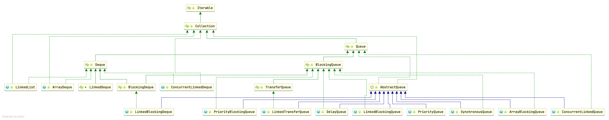

### Queue Hierarchy



## Introduction

A collection designed for holding elements prior to processing. Besides basic Collection operations, queues provide
additional insertion, extraction, and inspection operations.

Each of these methods exists in two forms: one throws an exception if the operation fails, the other returns a special
value (either null or false, depending on the operation).

The latter form of the insert operation is designed specifically for use with capacity-restricted Queue implementations;
in most implementations, insert operations cannot fail. Summary of Queue methods

|         | Throws exception | Returns special value |
| ------- | ---------------- | --------------------- |
| Insert  | `add(e)`         | `offer(e)`            |
| Remove  | `remove()`       | `poll()`              |
| Examine | `element()`      | `peek()`              |


Queues **typically, but do not necessarily**, order elements in a `FIFO (first-in-first-out)` manner. Among the
exceptions are priority queues, which order elements according to a supplied comparator, or the elements' natural
ordering, and LIFO queues (or stacks) which order the elements LIFO (last-in-first-out). Whatever the ordering used, the
head of the queue is that element which would be removed by a call to remove() or poll(). In a FIFO queue, all new
elements are inserted at the tail of the queue. Other kinds of queues may use different placement rules. Every Queue
implementation must specify its ordering properties.

```java
public interface Queue<E> extends Collection<E> {
    /**
     * Inserts the specified element into this queue if it is possible to do so
     * immediately without violating capacity restrictions, returning
     * {@code true} upon success and throwing an {@code IllegalStateException}
     * if no space is currently available.
     */
    boolean add(E e);

    /**
     * Inserts the specified element into this queue if it is possible to do
     * so immediately without violating capacity restrictions.
     * When using a capacity-restricted queue, this method is generally
     * preferable to {@link #add}, which can fail to insert an element only
     * by throwing an exception.
     */
    boolean offer(E e);

    // return the head of this queue
    //throws NoSuchElementException if this queue is empty
    E remove();

    /**
     * Retrieves and removes the head of this queue,
     * or returns {@code null} if this queue is empty.
     */
    E poll();

    /**
     * Retrieves, but does not remove, the head of this queue.  This method
     * differs from {@link #peek peek} only in that it throws an exception
     * if this queue is empty.
     */
    E element();

    /**
     * Retrieves, but does not remove, the head of this queue,
     * or returns {@code null} if this queue is empty.
     */
    E peek();
}
```

### AbstractQueue

## Deque

<table>
    <thead>
        <tr>
            <th></th>
            <th colspan="2">First Element (Head)</th>
          	<th colspan="2">Last Element (Tail)</th>
        </tr>
    </thead>
    <tbody>
        <tr>
            <td></td>
            <td>Throws exception</td>
            <td>Special value</td>
          	<td>Throws exception</td>
          	<td>Special value</td>
        </tr>
        <tr>
          	<th>Insert</th>
            <td>addFirst(e)</td>
            <td>offerFirst(e)</td>
            <td>addLast(e)</td>
            <td>offerLast(e)</td>
        </tr>
        <tr>
          	<th>Remove</th>
            <td>removeFirst()</td>
            <td>pollFirst()</td>
            <td>removeLast()</td>
            <td>pollLast()</td>
        </tr>
        <tr>
          	<th>Examine</th>
            <td>getFirst()</td>
            <td>peekFirst()</td>
            <td>getLast()</td>
            <td>peekLast()</td>
        </tr>
    </tbody>
</table>


#### Queue Method Equivalent Deque Method


| Queue Method  | Equivalent Deque Method |
| --------------------- | ---------------- |
| add(e) | addLast(e) |
| offer(e) | offerLast(e) |
| remove() | removeFirst() |
| poll() | pollFirst() |
| element() | getFirst() |
| peek() | peekFirst() |


#### Comparison of Stack and Deque methods

Deques can also be used as LIFO (Last-In-First-Out) stacks. This interface should be used in preference to the legacy `Stack` class. When a deque is used as a stack, elements are pushed and popped from the beginning of the deque. Stack methods are precisely equivalent to Deque methods as indicated in the table below:

| Stack Method | Equivalent Deque Method |
| --------------------- | ---------------- |
| push(e) | addFirst(e) |
| pop() | removeFirst() |
| peek() | peekFirst() |


### ArrayDeque


Resizable-array implementation of the Deque interface. Array deques have no capacity restrictions; they grow as necessary to support usage. They are not thread-safe; in the absence of external synchronization, they do not support concurrent access by multiple threads. Null elements are prohibited. This class is likely to be faster than Stack when used as a stack, and faster than LinkedList when used as a queue.

Most ArrayDeque operations run in amortized constant time. Exceptions include remove, removeFirstOccurrence, removeLastOccurrence, contains, iterator.remove(), and the bulk operations, all of which run in linear time.

The iterators returned by this class's iterator method are fail-fast: If the deque is modified at any time after the iterator is created, in any way except through the iterator's own remove method, the iterator will generally throw a **ConcurrentModificationException**. Thus, in the face of concurrent modification, the iterator fails quickly and cleanly, rather than risking arbitrary, non-deterministic behavior at an undetermined time in the future.

Note that the fail-fast behavior of an iterator cannot be guaranteed as it is, generally speaking, impossible to make any hard guarantees in the presence of unsynchronized concurrent modification. Fail-fast iterators throw ConcurrentModificationException on a best-effort basis. Therefore, it would be wrong to write a program that depended on this exception for its correctness: the fail-fast behavior of iterators should be used only to detect bugs.

This class and its iterator implement all of the optional methods of the Collection and Iterator interfaces.


```java
    /*
     * VMs excel at optimizing simple array loops where indices are
     * incrementing or decrementing over a valid slice, e.g.
     *
     * for (int i = start; i < end; i++) ... elements[i]
     *
     * Because in a circular array, elements are in general stored in
     * two disjoint such slices, we help the VM by writing unusual
     * nested loops for all traversals over the elements.  Having only
     * one hot inner loop body instead of two or three eases human
     * maintenance and encourages VM loop inlining into the caller.
     */

    /**
     * The array in which the elements of the deque are stored.
     * All array cells not holding deque elements are always null.
     * The array always has at least one null slot (at tail).
     */
    transient Object[] elements;

    /**
     * The index of the element at the head of the deque (which is the
     * element that would be removed by remove() or pop()); or an
     * arbitrary number 0 <= head < elements.length equal to tail if
     * the deque is empty.
     */
    transient int head;

    /**
     * The index at which the next element would be added to the tail
     * of the deque (via addLast(E), add(E), or push(E));
     * elements[tail] is always null.
     */
    transient int tail;

    /**
     * The maximum size of array to allocate.
     * Some VMs reserve some header words in an array.
     * Attempts to allocate larger arrays may result in
     * OutOfMemoryError: Requested array size exceeds VM limit
     */
    private static final int MAX_ARRAY_SIZE = Integer.MAX_VALUE - 8;
```


## PriorityQueue


## BlockingQueue

阻塞队列(BlockingQueue)
是一个支持两个附加操作的队列。这两个附加的操作是：在队列为空时，获取元素的线程会等待队列变为非空。当队列满时，存储元素的线程会等待队列可用。阻塞队列常用于生产者和消费者的场景，生产者是往队列里添加元素的线程，消费者是从队列里拿元素的线程。阻塞队列就是生产者存放元素的容器，而消费者也只从容器里拿元素。

| Blocking Queue Name   | Description      |
| --------------------- | ---------------- |
| ArrayBlockingQueue    | array FIFO       |
| LinkedBlockingQueue   | linked tableFIFO |
| PriorityBlockingQueue |                  |
| DelayQueue            |                  |
| SynchronousQueue      |                  |
| LinkedTransferQueue   | transfer method  |
| LinkedBlockingDeque   | Deque            |

### ArrayBlockingQueue

### DelayQueue

### SynchronousQueue

*A blocking queue in which **each insert operation must wait for a corresponding remove operation by another thread, and
vice versa**. A synchronous queue **does not have any internal capacity, not even a capacity of one**.*

*you cannot insert an element (using any method) unless another thread is trying to remove it;*

*The head of the queue is the element that the first queued inserting thread is trying to add to the queue; if there is
no such queued thread then no element is available for removal and poll() will return null.*

*For purposes of other Collection methods (for example contains), a SynchronousQueue acts as an empty collection. This
queue does not permit null elements.*

*Synchronous queues are similar to rendezvous channels used in CSP and Ada. They are well suited for handoff designs, in
which an object running in one thread must sync up with an object running in another thread in order to hand it some
information, event, or task.*
*This class supports an optional fairness policy for ordering waiting producer and consumer threads. By default, this
ordering is not guaranteed. However, a queue constructed with fairness set to true grants threads access in FIFO order.*
*This class and its iterator implement all of the optional methods of the Collection and Iterator interfaces.*

```java
public class SynchronousQueue<E> extends AbstractQueue<E>
        implements BlockingQueue<E>, java.io.Serializable {
}
```

`You cannot peek at a synchronous queue because an element is only present when you try to remove it.`

```java
public E peek(){
        return null;
        }
```

`You cannot iterate as there is nothing to iterate.`

```java
public Iterator<E> iterator(){
        return Collections.emptyIterator();
        }

public boolean isEmpty(){
        return true;
        }

public int size(){
        return 0;
        }

public int remainingCapacity(){
        return 0;
        }
```

#### TransferQueue


## Summary


