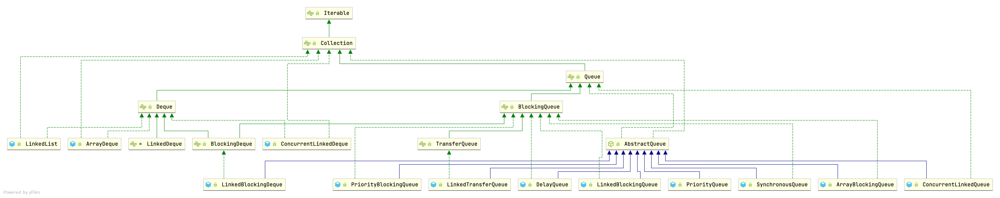

## Introduction

### Queue Hierarchy



A collection designed for holding elements prior to processing. Besides basic Collection operations, queues provide
additional insertion, extraction, and inspection operations.

Each of these methods exists in two forms: one throws an exception if the operation fails, the other returns a special
value (either null or false, depending on the operation).

The latter form of the insert operation is designed specifically for use with capacity-restricted Queue implementations;
in most implementations, insert operations cannot fail. Summary of Queue methods


|         | Throws exception | Returns special value |
| ------- | ---------------- | --------------------- |
| Insert  | `add(e)`         | `offer(e)`            |
| Remove  | `remove()`       | `poll()`              |
| Examine | `element()`      | `peek()`              |

Queues **typically, but do not necessarily**, order elements in a `FIFO (first-in-first-out)` manner. Among the
exceptions are priority queues, which order elements according to a supplied comparator, or the elements' natural
ordering, and LIFO queues (or stacks) which order the elements LIFO (last-in-first-out). Whatever the ordering used, the
head of the queue is that element which would be removed by a call to remove() or poll(). In a FIFO queue, all new
elements are inserted at the tail of the queue. Other kinds of queues may use different placement rules. Every Queue
implementation must specify its ordering properties.

```java
public interface Queue<E> extends Collection<E> {
    /**
     * Inserts the specified element into this queue if it is possible to do so
     * immediately without violating capacity restrictions, returning
     * {@code true} upon success and throwing an {@code IllegalStateException}
     * if no space is currently available.
     */
    boolean add(E e);

    /**
     * Inserts the specified element into this queue if it is possible to do
     * so immediately without violating capacity restrictions.
     * When using a capacity-restricted queue, this method is generally
     * preferable to {@link #add}, which can fail to insert an element only
     * by throwing an exception.
     */
    boolean offer(E e);

    // return the head of this queue
    //throws NoSuchElementException if this queue is empty
    E remove();

    /**
     * Retrieves and removes the head of this queue,
     * or returns {@code null} if this queue is empty.
     */
    E poll();

    /**
     * Retrieves, but does not remove, the head of this queue.  This method
     * differs from {@link #peek peek} only in that it throws an exception
     * if this queue is empty.
     */
    E element();

    /**
     * Retrieves, but does not remove, the head of this queue,
     * or returns {@code null} if this queue is empty.
     */
    E peek();
}
```

### AbstractQueue

## Deque

<table>
    <thead>
        <tr>
            <th></th>
            <th colspan="2">First Element (Head)</th>
          	<th colspan="2">Last Element (Tail)</th>
        </tr>
    </thead>
    <tbody>
        <tr>
            <td></td>
            <td>Throws exception</td>
            <td>Special value</td>
          	<td>Throws exception</td>
          	<td>Special value</td>
        </tr>
        <tr>
          	<th>Insert</th>
            <td>addFirst(e)</td>
            <td>offerFirst(e)</td>
            <td>addLast(e)</td>
            <td>offerLast(e)</td>
        </tr>
        <tr>
          	<th>Remove</th>
            <td>removeFirst()</td>
            <td>pollFirst()</td>
            <td>removeLast()</td>
            <td>pollLast()</td>
        </tr>
        <tr>
          	<th>Examine</th>
            <td>getFirst()</td>
            <td>peekFirst()</td>
            <td>getLast()</td>
            <td>peekLast()</td>
        </tr>
    </tbody>
</table>

#### Queue Method Equivalent Deque Method


| Queue Method | Equivalent Deque Method |
| ------------ | ----------------------- |
| add(e)       | addLast(e)              |
| offer(e)     | offerLast(e)            |
| remove()     | removeFirst()           |
| poll()       | pollFirst()             |
| element()    | getFirst()              |
| peek()       | peekFirst()             |

#### Comparison of Stack and Deque methods

Deques can also be used as LIFO (Last-In-First-Out) stacks. This interface should be used in preference to the legacy `Stack` class.
When a deque is used as a stack, elements are pushed and popped from the beginning of the deque.
Stack methods are precisely equivalent to Deque methods as indicated in the table below:


| Stack Method | Equivalent Deque Method |
| ------------ | ----------------------- |
| push(e)      | addFirst(e)             |
| pop()        | removeFirst()           |
| peek()       | peekFirst()             |

### ArrayDeque

Resizable-array implementation of the Deque interface. 
Array deques have no capacity restrictions; they grow as necessary to support usage.
They are not thread-safe; in the absence of external synchronization, they do not support concurrent access by multiple threads. 
Null elements are prohibited. This class is likely to be faster than Stack when used as a stack, and faster than LinkedList when used as a queue.

Most ArrayDeque operations run in amortized constant time. Exceptions include remove, removeFirstOccurrence, removeLastOccurrence, contains, iterator.remove(), and the bulk operations, all of which run in linear time.

The iterators returned by this class's iterator method are fail-fast: 
If the deque is modified at any time after the iterator is created, in any way except through the iterator's own remove method, the iterator will generally throw a **ConcurrentModificationException**.
Thus, in the face of concurrent modification, the iterator fails quickly and cleanly, rather than risking arbitrary, non-deterministic behavior at an undetermined time in the future.

Note that the fail-fast behavior of an iterator cannot be guaranteed as it is, generally speaking, impossible to make any hard guarantees in the presence of unsynchronized concurrent modification.
Fail-fast iterators throw ConcurrentModificationException on a best-effort basis. 
Therefore, it would be wrong to write a program that depended on this exception for its correctness: the fail-fast behavior of iterators should be used only to detect bugs.

This class and its iterator implement all of the optional methods of the Collection and Iterator interfaces.

```java
    /*
     * VMs excel at optimizing simple array loops where indices are
     * incrementing or decrementing over a valid slice, e.g.
     *
     * for (int i = start; i < end; i++) ... elements[i]
     *
     * Because in a circular array, elements are in general stored in
     * two disjoint such slices, we help the VM by writing unusual
     * nested loops for all traversals over the elements.  Having only
     * one hot inner loop body instead of two or three eases human
     * maintenance and encourages VM loop inlining into the caller.
     */

    /**
     * The array in which the elements of the deque are stored.
     * All array cells not holding deque elements are always null.
     * The array always has at least one null slot (at tail).
     */
    transient Object[] elements;

    /**
     * The index of the element at the head of the deque (which is the
     * element that would be removed by remove() or pop()); or an
     * arbitrary number 0 <= head < elements.length equal to tail if
     * the deque is empty.
     */
    transient int head;

    /**
     * The index at which the next element would be added to the tail
     * of the deque (via addLast(E), add(E), or push(E));
     * elements[tail] is always null.
     */
    transient int tail;

    /**
     * The maximum size of array to allocate.
     * Some VMs reserve some header words in an array.
     * Attempts to allocate larger arrays may result in
     * OutOfMemoryError: Requested array size exceeds VM limit
     */
    private static final int MAX_ARRAY_SIZE = Integer.MAX_VALUE - 8;
```

## ConcurrentLinkedQueue

unbounded queue
head tail volatile

```java

private static class Node<E> {
   volatile E item;
   volatile Node<E> next;

   /**
    * Constructs a new node.  Uses relaxed write because item can
    * only be seen after publication via casNext.
    */
   Node(E item) {
      UNSAFE.putObject(this, itemOffset, item);
   }

   boolean casItem(E cmp, E val) {
      return UNSAFE.compareAndSwapObject(this, itemOffset, cmp, val);
   }

   void lazySetNext(Node<E> val) {
      UNSAFE.putOrderedObject(this, nextOffset, val);
   }

   boolean casNext(Node<E> cmp, Node<E> val) {
      return UNSAFE.compareAndSwapObject(this, nextOffset, cmp, val);
   }

   // Unsafe mechanics
...
}

 /**
  * A node from which the first live (non-deleted) node (if any)
  * can be reached in O(1) time.
  * Invariants:
  * - all live nodes are reachable from head via succ()
  * - head != null
  * - (tmp = head).next != tmp || tmp != head
  * Non-invariants:
  * - head.item may or may not be null.
  * - it is permitted for tail to lag behind head, that is, for tail
  *   to not be reachable from head!
  */
 private transient volatile Node<E> head;

 /**
  * A node from which the last node on list (that is, the unique
  * node with node.next == null) can be reached in O(1) time.
  * Invariants:
  * - the last node is always reachable from tail via succ()
  * - tail != null
  * Non-invariants:
  * - tail.item may or may not be null.
  * - it is permitted for tail to lag behind head, that is, for tail
  *   to not be reachable from head!
  * - tail.next may or may not be self-pointing to tail.
  */
 private transient volatile Node<E> tail;
```

cas

## PriorityQueue


|             |              |        |
| ----------- | ------------ | ------ |
| Root index  | 0            | 1      |
| Left index  | 2i+1         | 2i     |
| Right index | 2i+2         | 2i+1   |
| Get parent  | (i - 1) >>>1 | i >>>1 |

### siftUp

```java
/**
 * Inserts item x at position k, maintaining heap invariant by
 * promoting x up the tree until it is greater than or equal to
 * its parent, or is the root.
 *
 * To simplify and speed up coercions and comparisons, the
 * Comparable and Comparator versions are separated into different
 * methods that are otherwise identical. (Similarly for siftDown.)
 *
 * @param k the position to fill
 * @param x the item to insert
 */
private void siftUp(int k, E x) {
    if (comparator != null)
        siftUpUsingComparator(k, x, queue, comparator);
    else
        siftUpComparable(k, x, queue);
}

private static <T> void siftUpComparable(int k, T x, Object[] es) {
    Comparable<? super T> key = (Comparable<? super T>) x;
    while (k > 0) {
        int parent = (k - 1) >>> 1;
        Object e = es[parent];
        if (key.compareTo((T) e) >= 0)
            break;
        es[k] = e;
        k = parent;
    }
    es[k] = key;
}

private static <T> void siftUpUsingComparator(
    int k, T x, Object[] es, Comparator<? super T> cmp) {
    while (k > 0) {
        int parent = (k - 1) >>> 1;
        Object e = es[parent];
        if (cmp.compare(x, (T) e) >= 0)
            break;
        es[k] = e;
        k = parent;
    }
    es[k] = x;
}
```

### siftDown

```java
/**
 * Inserts item x at position k, maintaining heap invariant by
 * demoting x down the tree repeatedly until it is less than or
 * equal to its children or is a leaf.
 *
 * @param k the position to fill
 * @param x the item to insert
 */
private void siftDown(int k, E x) {
    if (comparator != null)
        siftDownUsingComparator(k, x, queue, size, comparator);
    else
        siftDownComparable(k, x, queue, size);
}

private static <T> void siftDownComparable(int k, T x, Object[] es, int n) {
    // assert n > 0;
    Comparable<? super T> key = (Comparable<? super T>)x;
    int half = n >>> 1;           // loop while a non-leaf
    while (k < half) {
        int child = (k << 1) + 1; // assume left child is least
        Object c = es[child];
        int right = child + 1;
        if (right < n &&
            ((Comparable<? super T>) c).compareTo((T) es[right]) > 0)
            c = es[child = right];
        if (key.compareTo((T) c) <= 0)
            break;
        es[k] = c;
        k = child;
    }
    es[k] = key;
}

private static <T> void siftDownUsingComparator(
    int k, T x, Object[] es, int n, Comparator<? super T> cmp) {
    // assert n > 0;
    int half = n >>> 1;
    while (k < half) {
        int child = (k << 1) + 1;
        Object c = es[child];
        int right = child + 1;
        if (right < n && cmp.compare((T) c, (T) es[right]) > 0)
            c = es[child = right];
        if (cmp.compare(x, (T) c) <= 0)
            break;
        es[k] = c;
        k = child;
    }
    es[k] = x;
}
```

## BlockingQueue

A Queue that additionally supports operations that:

1. wait for the queue to become non-empty when retrieving an element
2. wait for space to become available in the queue when storing an element.

BlockingQueue methods come in four forms, with different ways of handling operations that cannot be satisfied immediately, but may be satisfied at some point in the future: one throws an exception, the second returns a special value (either null or false, depending on the operation), the third blocks the current thread indefinitely until the operation can succeed, and the fourth blocks for only a given maximum time limit before giving up.

These methods are summarized in the following table:


|             | Throws exception | Special value | Blocks         | Times out            |
| ----------- | ---------------- | ------------- | -------------- | -------------------- |
| **Insert**  | add(e)           | offer(e)      | put(e)         | offer(e, time, unit) |
| **Remove**  | remove()         | poll()        | take()         | poll(time, unit)     |
| **Examine** | element()        | peek()        | not applicable | not applicable       |

A BlockingQueue **does not accept null elements**. Implementations throw **NullPointerException** on attempts to add, put or offer a null. A null is used as a sentinel value to indicate failure of *poll* operations.

A BlockingQueue may be capacity bounded. At any given time it may have a remainingCapacity beyond which no additional elements can be put without blocking. A BlockingQueue without any intrinsic capacity constraints always reports a remaining capacity of Integer.MAX_VALUE.

BlockingQueue implementations are designed to be used primarily for producer-consumer queues, but additionally support the Collection interface. So, for example, it is possible to remove an arbitrary element from a queue using remove(x). However, such operations are in general not performed very efficiently, and are intended for only occasional use, such as when a queued message is cancelled.

BlockingQueue implementations are thread-safe. All queuing methods achieve their effects atomically using internal locks or other forms of concurrency control. However, the bulk Collection operations addAll, containsAll, retainAll and removeAll are not necessarily performed atomically unless specified otherwise in an implementation. So it is possible, for example, for addAll(c) to fail (throwing an exception) after adding only some of the elements in c.

A BlockingQueue does not intrinsically support any kind of "close" or "shutdown" operation to indicate that no more items will be added. The needs and usage of such features tend to be implementation-dependent. For example, a common tactic is for producers to insert special end-of-stream or poison objects, that are interpreted accordingly when taken by consumers.

Usage example, based on a typical producer-consumer scenario. Note that a BlockingQueue can safely be used with multiple producers and multiple consumers.

### Example

```java
class Producer implements Runnable {
   private final BlockingQueue queue;
   Producer(BlockingQueue q) { queue = q; }
   public void run() {
     try {
       while (true) { queue.put(produce()); }
     } catch (InterruptedException ex) { ... handle ...}
   }
   Object produce() { ... }
 }

 class Consumer implements Runnable {
   private final BlockingQueue queue;
   Consumer(BlockingQueue q) { queue = q; }
   public void run() {
     try {
       while (true) { consume(queue.take()); }
     } catch (InterruptedException ex) { ... handle ...}
   }
   void consume(Object x) { ... }
 }

 class Setup {
   void main() {
     BlockingQueue q = new SomeQueueImplementation();
     Producer p = new Producer(q);
     Consumer c1 = new Consumer(q);
     Consumer c2 = new Consumer(q);
     new Thread(p).start();
     new Thread(c1).start();
     new Thread(c2).start();
   }
 }
```

**Memory consistency effects**: As with other concurrent collections, actions in a thread prior to placing an object into a BlockingQueue happen-before actions subsequent to the access or removal of that element from the BlockingQueue in another thread.
This interface is a member of the Java Collections Framework.


| Blocking Queue Name   | Description      |
| --------------------- | ---------------- |
| ArrayBlockingQueue    | array FIFO       |
| LinkedBlockingQueue   | linked tableFIFO |
| PriorityBlockingQueue |                  |
| DelayQueue            |                  |
| SynchronousQueue      |                  |
| LinkedTransferQueue   | transfer method  |
| LinkedBlockingDeque   | Deque            |

### ArrayBlockingQueue

1 [ReentrantLock](/docs/CS/Java/JDK/Concurrency/ReentrantLock.md) and 2 conditions

```java
/** Main lock guarding all access */
final ReentrantLock lock;

/** Condition for waiting takes */
@SuppressWarnings("serial")  // Classes implementing Condition may be serializable.
private final Condition notEmpty;

/** Condition for waiting puts */
@SuppressWarnings("serial")  // Classes implementing Condition may be serializable.
private final Condition notFull;
```

```java
public ArrayBlockingQueue(int capacity) {
  this(capacity, false);
}

/**
  * Creates an {@code ArrayBlockingQueue} with the given (fixed)
  * capacity and the specified access policy.
  */
public ArrayBlockingQueue(int capacity, boolean fair) {
  if (capacity <= 0)
    throw new IllegalArgumentException();
  this.items = new Object[capacity];
  lock = new ReentrantLock(fair);
  notEmpty = lock.newCondition();
  notFull =  lock.newCondition();
}


public ArrayBlockingQueue(int capacity, boolean fair,
                          Collection<? extends E> c) {
    this(capacity, fair);

    final ReentrantLock lock = this.lock;
    lock.lock(); // Lock only for visibility, not mutual exclusion
    try {
        final Object[] items = this.items;
        int i = 0;
        try {
            for (E e : c)
                items[i++] = Objects.requireNonNull(e);
        } catch (ArrayIndexOutOfBoundsException ex) {
            throw new IllegalArgumentException();
        }
        count = i;
        putIndex = (i == capacity) ? 0 : i;
    } finally {
        lock.unlock();
    }
}
```

### LinkedBlockingQueue

takeLock and putLock

```java
/** Lock held by take, poll, etc */
private final ReentrantLock takeLock = new ReentrantLock();

/** Wait queue for waiting takes */
@SuppressWarnings("serial") // Classes implementing Condition may be serializable.
private final Condition notEmpty = takeLock.newCondition();

/** Lock held by put, offer, etc */
private final ReentrantLock putLock = new ReentrantLock();

/** Wait queue for waiting puts */
@SuppressWarnings("serial") // Classes implementing Condition may be serializable.
private final Condition notFull = putLock.newCondition();
```

```java
public void put(E e) throws InterruptedException {
    if (e == null) throw new NullPointerException();
    final int c;
    final Node<E> node = new Node<E>(e);
    final ReentrantLock putLock = this.putLock;
    final AtomicInteger count = this.count;
    putLock.lockInterruptibly();
    try {
        /*
         * Note that count is used in wait guard even though it is
         * not protected by lock. This works because count can
         * only decrease at this point (all other puts are shut
         * out by lock), and we (or some other waiting put) are
         * signalled if it ever changes from capacity. Similarly
         * for all other uses of count in other wait guards.
         */
        while (count.get() == capacity) {
            notFull.await();
        }
        enqueue(node);
        c = count.getAndIncrement();
        if (c + 1 < capacity)
            notFull.signal();
    } finally {
        putLock.unlock();
    }
    if (c == 0) // isEmpty before current put
        signalNotEmpty();
}
```

### DelayQueue

### SynchronousQueue

*A blocking queue in which **each insert operation must wait for a corresponding remove operation by another thread, and vice versa**.
A synchronous queue **does not have any internal capacity, not even a capacity of one**.*

*you cannot insert an element (using any method) unless another thread is trying to remove it;*

*The head of the queue is the element that the first queued inserting thread is trying to add to the queue; if there is
no such queued thread then no element is available for removal and poll() will return null.*

*For purposes of other Collection methods (for example contains), a SynchronousQueue acts as an empty collection. This
queue does not permit null elements.*

*Synchronous queues are similar to rendezvous channels used in CSP and Ada. They are well suited for handoff designs, in
which an object running in one thread must sync up with an object running in another thread in order to hand it some
information, event, or task.*
*This class supports an optional fairness policy for ordering waiting producer and consumer threads. By default, this
ordering is not guaranteed. However, a queue constructed with fairness set to true grants threads access in FIFO order.*
*This class and its iterator implement all of the optional methods of the Collection and Iterator interfaces.*

```java
public class SynchronousQueue<E> extends AbstractQueue<E>
        implements BlockingQueue<E>, java.io.Serializable {
}
```

```java
private ReentrantLock qlock;
private WaitQueue waitingProducers;
private WaitQueue waitingConsumers;


/**
  * The transferer. Set only in constructor, but cannot be declared
  * as final without further complicating serialization.  Since
  * this is accessed only at most once per public method, there
  * isn't a noticeable performance penalty for using volatile
  * instead of final here.
  */
private transient volatile Transferer<E> transferer;

abstract static class Transferer<E> {
  // Performs a put or take.
  abstract E transfer(E e, boolean timed, long nanos);
}

public SynchronousQueue(boolean fair) { // default false
  transferer = fair ? new TransferQueue<E>() : new TransferStack<E>();
}
```

`You cannot peek at a synchronous queue because an element is only present when you try to remove it.`

```java
public E peek(){
        return null;
        }
```

`You cannot iterate as there is nothing to iterate.`

```java
public Iterator<E> iterator(){
        return Collections.emptyIterator();
        }

public boolean isEmpty(){
        return true;
        }

public int size(){
        return 0;
        }

public int remainingCapacity(){
        return 0;
        }
```

#### transfer

both of them call *transfer()*, and *put* send a param

```java
// Adds the specified element to this queue, waiting if necessary for another thread to receive it.
public void put(E e) throws InterruptedException {
    if (e == null) throw new NullPointerException();
    if (transferer.transfer(e, false, 0) == null) {
        Thread.interrupted();
        throw new InterruptedException();
    }
}

// Retrieves and removes the head of this queue, waiting if necessary for another thread to insert it.
public E take() throws InterruptedException {
    E e = transferer.transfer(null, false, 0);
    if (e != null)
        return e;
    Thread.interrupted();
    throw new InterruptedException();
}
```

#### TransferStack

Basic algorithm is to loop trying one of three actions:

1. If apparently empty or already containing nodes of same mode, try to push node on stack and wait for a match, returning it, or null if cancelled.
2. If apparently containing node of complementary mode, try to push a fulfilling node on to stack, match with corresponding waiting node, pop both from stack, and return matched item. The matching or unlinking might not actually be necessary because of other threads performing action 3:
3. If top of stack already holds another fulfilling node, help it out by doing its match and/or pop
   operations, and then continue. The code for helping is essentially the same as for fulfilling, except that it doesn't return the item.

```java
/** 
 * Puts or takes an item.
 */
@SuppressWarnings("unchecked")
E transfer(E e, boolean timed, long nanos) {
    SNode s = null; // constructed/reused as needed
    int mode = (e == null) ? REQUEST : DATA;

    for (;;) {
        SNode h = head;
        if (h == null || h.mode == mode) {  // empty or same-mode
            if (timed && nanos <= 0L) {     // can't wait
                if (h != null && h.isCancelled())
                    casHead(h, h.next);     // pop cancelled node
                else
                    return null;
            } else if (casHead(h, s = snode(s, e, h, mode))) {
                SNode m = awaitFulfill(s, timed, nanos);
                if (m == s) {               // wait was cancelled
                    clean(s);
                    return null;
                }
                if ((h = head) != null && h.next == s)
                    casHead(h, s.next);     // help s's fulfiller
                return (E) ((mode == REQUEST) ? m.item : s.item);
            }
        } else if (!isFulfilling(h.mode)) { // try to fulfill
            if (h.isCancelled())            // already cancelled
                casHead(h, h.next);         // pop and retry
            else if (casHead(h, s=snode(s, e, h, FULFILLING|mode))) {
                for (;;) { // loop until matched or waiters disappear
                    SNode m = s.next;       // m is s's match
                    if (m == null) {        // all waiters are gone
                        casHead(s, null);   // pop fulfill node
                        s = null;           // use new node next time
                        break;              // restart main loop
                    }
                    SNode mn = m.next;
                    if (m.tryMatch(s)) {
                        casHead(s, mn);     // pop both s and m
                        return (E) ((mode == REQUEST) ? m.item : s.item);
                    } else                  // lost match
                        s.casNext(m, mn);   // help unlink
                }
            }
        } else {                            // help a fulfiller
            SNode m = h.next;               // m is h's match
            if (m == null)                  // waiter is gone
                casHead(h, null);           // pop fulfilling node
            else {
                SNode mn = m.next;
                if (m.tryMatch(h))          // help match
                    casHead(h, mn);         // pop both h and m
                else                        // lost match
                    h.casNext(m, mn);       // help unlink
            }
        }
    }
}
```

```java
static final class SNode {
    volatile SNode next;        // next node in stack
    volatile SNode match;       // the node matched to this
    volatile Thread waiter;     // to control park/unpark
    Object item;                // data; or null for REQUESTs
    int mode;
    // Note: item and mode fields don't need to be volatile
    // since they are always written before, and read after,
    // other volatile/atomic operations.

    SNode(Object item) {
        this.item = item;
    }
}
```

#### TransferQueue

Basic algorithm is to loop trying to take either of
two actions:

1. If queue apparently empty or holding same-mode nodes, try to add node to queue of waiters, wait to be fulfilled (or cancelled) and return matching item.
2. If queue apparently contains waiting items, and this call is of complementary mode, try to fulfill by CAS'ing item field of waiting node and dequeuing it, and then returning matching item.

In each case, along the way, check for and try to help advance head and tail on behalf of other stalled/slow threads.

The loop starts off with a null check guarding against seeing uninitialized head or tail values. This never happens in current SynchronousQueue, but could if callers held non-volatile/final ref to the transferer. The check is here anyway because it places null checks at top of loop, which is usually faster than having them implicitly interspersed.

```java
/**
 * Puts or takes an item.
 */
@SuppressWarnings("unchecked")
E transfer(E e, boolean timed, long nanos) {
    QNode s = null; // constructed/reused as needed
    boolean isData = (e != null);

    for (;;) {
        QNode t = tail;
        QNode h = head;
        if (t == null || h == null)         // saw uninitialized value
            continue;                       // spin

        if (h == t || t.isData == isData) { // empty or same-mode
            QNode tn = t.next;
            if (t != tail)                  // inconsistent read
                continue;
            if (tn != null) {               // lagging tail
                advanceTail(t, tn);
                continue;
            }
            if (timed && nanos <= 0L)       // can't wait
                return null;
            if (s == null)
                s = new QNode(e, isData);
            if (!t.casNext(null, s))        // failed to link in
                continue;

            advanceTail(t, s);              // swing tail and wait
            Object x = awaitFulfill(s, e, timed, nanos);
            if (x == s) {                   // wait was cancelled
                clean(t, s);
                return null;
            }

            if (!s.isOffList()) {           // not already unlinked
                advanceHead(t, s);          // unlink if head
                if (x != null)              // and forget fields
                    s.item = s;
                s.waiter = null;
            }
            return (x != null) ? (E)x : e;

        } else {                            // complementary-mode
            QNode m = h.next;               // node to fulfill
            if (t != tail || m == null || h != head)
                continue;                   // inconsistent read

            Object x = m.item;
            if (isData == (x != null) ||    // m already fulfilled
                x == m ||                   // m cancelled
                !m.casItem(x, e)) {         // lost CAS
                advanceHead(h, m);          // dequeue and retry
                continue;
            }

            advanceHead(h, m);              // successfully fulfilled
            LockSupport.unpark(m.waiter);
            return (x != null) ? (E)x : e;
        }
    }
}
```

```java
static final class QNode {
    volatile QNode next;          // next node in queue
    volatile Object item;         // CAS'ed to or from null
    volatile Thread waiter;       // to control park/unpark
    final boolean isData;

    QNode(Object item, boolean isData) {
        this.item = item;
        this.isData = isData;
    }
}
```

### PriorityBlockingQueue

```java
/**
 * Default array capacity.
 */
private static final int DEFAULT_INITIAL_CAPACITY = 11;

/**
 * Priority queue represented as a balanced binary heap: the two
 * children of queue[n] are queue[2*n+1] and queue[2*(n+1)].  The
 * priority queue is ordered by comparator, or by the elements'
 * natural ordering, if comparator is null: For each node n in the
 * heap and each descendant d of n, n <= d.  The element with the
 * lowest value is in queue[0], assuming the queue is nonempty.
 */
private transient Object[] queue;

// The number of elements in the priority queue.
private transient int size;

// The comparator, or null if priority queue uses elements' natural ordering.
private transient Comparator<? super E> comparator;

// Lock used for all public operations.
private final ReentrantLock lock = new ReentrantLock();

// Condition for blocking when empty.
@SuppressWarnings("serial") // Classes implementing Condition may be serializable.
private final Condition notEmpty = lock.newCondition();

// Spinlock for allocation, acquired via CAS.
private transient volatile int allocationSpinLock;
```

## Thread-Safe Queues


| Queue                 | Boundary           | Lock     | Struct     |
| --------------------- | ------------------ | -------- | ---------- |
| ArrayBlockingQueue    | bounded            | lock     | arrayList  |
| LinkedBlockingQueue   | optionally-bounded | lock     | linkedList |
| ConcurrentLinkedQueue | unbounded          | Non-lock | linkedList |
| LinkedTransferQueue   | unbounded          | Non-lock | linkedList |
| PriorityBlockingQueue | unbounded          | lock     | heap       |
| DealyQueue            | unbounded          | lock     | heap       |

## Links

- [Collection](/docs/CS/Java/JDK/Collection/Collection.md)
