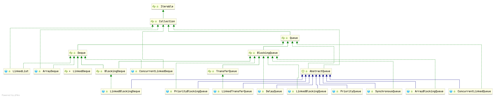

## Introduction

Queue 接口指定了可以在队列尾部添加元素、在头部移除元素以及查看队列中有多少元素。
当你需要收集对象并以"先进先出"的方式检索它们时，可以使用 Queue。

Queue 提供了额外的插入、提取和检查操作。

这些方法中的每一种都有两种形式：一种在操作失败时抛出异常，另一种返回特殊值（根据操作的不同为 null 或 false）。

后一种插入操作形式专门为容量受限的 Queue 实现设计；
在大多数实现中，插入操作不会失败。Queue 方法的总结：

|         | Throws exception | Returns special value |
| ------- | ---------------- | --------------------- |
| Insert  | `add(e)`         | `offer(e)`            |
| Remove  | `remove()`       | `poll()`              |
| Examine | `element()`      | `peek()`              |

Queue **通常但不一定**以 `FIFO（先进先出）` 的方式对元素排序。
例外情况包括优先级队列（priority queues），它根据提供的比较器或元素的自然顺序对元素排序，
以及 LIFO 队列（或栈），它以 LIFO（后进先出）方式对元素排序。
无论使用何种排序方式，队列的头部都是调用 remove() 或 poll() 将移除的元素。
在 FIFO 队列中，所有新元素都插入到队列尾部。
其他类型的队列可能使用不同的放置规则。
每个 Queue 实现必须指定其排序属性。

<div style="text-align: center;">



</div>

<p style="text-align: center;">
Fig.1. Queue
</p>

```java
public interface Queue<E> extends Collection<E> {
    boolean add(E e);

    boolean offer(E e);

    E remove();

    E poll();

    E element();

    E peek();
}
```

### AbstractQueue

## Deque

<table>
    <thead>
        <tr>
            <th></th>
            <th colspan="2">First Element (Head)</th>
          	<th colspan="2">Last Element (Tail)</th>
        </tr>
    </thead>
    <tbody>
        <tr>
            <td></td>
            <td>Throws exception</td>
            <td>Special value</td>
          	<td>Throws exception</td>
          	<td>Special value</td>
        </tr>
        <tr>
          	<th>Insert</th>
            <td>addFirst(e)</td>
            <td>offerFirst(e)</td>
            <td>addLast(e)</td>
            <td>offerLast(e)</td>
        </tr>
        <tr>
          	<th>Remove</th>
            <td>removeFirst()</td>
            <td>pollFirst()</td>
            <td>removeLast()</td>
            <td>pollLast()</td>
        </tr>
        <tr>
          	<th>Examine</th>
            <td>getFirst()</td>
            <td>peekFirst()</td>
            <td>getLast()</td>
            <td>peekLast()</td>
        </tr>
    </tbody>
</table>

#### Queue Method Equivalent Deque Method

| Queue Method | Equivalent Deque Method |
| ------------ | ----------------------- |
| add(e)       | addLast(e)              |
| offer(e)     | offerLast(e)            |
| remove()     | removeFirst()           |
| poll()       | pollFirst()             |
| element()    | getFirst()              |
| peek()       | peekFirst()             |

#### Comparison of Stack and Deque methods

Deque 也可以用作 LIFO（后进先出）栈。应优先使用此接口而非传统的 `Stack` 类。
当 Deque 用作栈时，元素从 Deque 的头部压入和弹出。
Stack 方法与 Deque 方法的对应关系如下表所示：

| Stack Method | Equivalent Deque Method |
| ------------ | ----------------------- |
| push(e)      | addFirst(e)             |
| pop()        | removeFirst()           |
| peek()       | peekFirst()             |

### ArrayDeque

Deque 接口的可调整大小数组实现。
ArrayDeque 没有容量限制；它们会根据需要增长以支持使用。
它们不是线程安全的；在缺乏外部同步的情况下，不支持多线程并发访问。
禁止 null 元素。当用作栈时，此类可能比 Stack 更快，当用作队列时，比 LinkedList 更快。

大多数 ArrayDeque 操作以均摊常数时间运行。例外情况包括 remove、removeFirstOccurrence、removeLastOccurrence、contains、iterator.remove() 和批量操作，这些操作都以线性时间运行。

此类的 iterator 方法返回的迭代器是快速失败的：
如果在迭代器创建后的任何时间修改了 Deque，除了通过迭代器自身的 remove 方法之外，以任何方式修改，迭代器通常将抛出 **ConcurrentModificationException**。
因此，在面对并发修改时，迭代器快速而干净地失败，而不是在未来的某个不确定时间冒任意非确定性行为的风险。

注意，迭代器的快速失败行为无法得到保证，因为一般来说，在存在非同步并发修改的情况下无法做出任何硬性保证。
快速失败迭代器会尽最大努力抛出 ConcurrentModificationException。
因此，编写依赖于此异常来确保正确性的程序是错误的：迭代器的快速失败行为应仅用于检测 bug。

此类及其迭代器实现了 Collection 和 Iterator 接口的所有可选方法。

```java
    /*
     * VMs excel at optimizing simple array loops where indices are
     * incrementing or decrementing over a valid slice, e.g.
     *
     * for (int i = start; i < end; i++) ... elements[i]
     *
     * Because in a circular array, elements are in general stored in
     * two disjoint such slices, we help the VM by writing unusual
     * nested loops for all traversals over the elements.  Having only
     * one hot inner loop body instead of two or three eases human
     * maintenance and encourages VM loop inlining into the caller.
     */

    /**
     * The array in which the elements of the deque are stored.
     * All array cells not holding deque elements are always null.
     * The array always has at least one null slot (at tail).
     */
    transient Object[] elements;

    /**
     * The index of the element at the head of the deque (which is the
     * element that would be removed by remove() or pop()); or an
     * arbitrary number 0 <= head < elements.length equal to tail if
     * the deque is empty.
     */
    transient int head;

    /**
     * The index at which the next element would be added to the tail
     * of the deque (via addLast(E), add(E), or push(E));
     * elements[tail] is always null.
     */
    transient int tail;

    /**
     * The maximum size of array to allocate.
     * Some VMs reserve some header words in an array.
     * Attempts to allocate larger arrays may result in
     * OutOfMemoryError: Requested array size exceeds VM limit
     */
    private static final int MAX_ARRAY_SIZE = Integer.MAX_VALUE - 8;
```

## ConcurrentLinkedQueue

无界队列
head 和 tail 为 volatile

```java

private static class Node<E> {
   volatile E item;
   volatile Node<E> next;

   /**
    * Constructs a new node.  Uses relaxed write because item can
    * only be seen after publication via casNext.
    */
   Node(E item) {
      UNSAFE.putObject(this, itemOffset, item);
   }

   boolean casItem(E cmp, E val) {
      return UNSAFE.compareAndSwapObject(this, itemOffset, cmp, val);
   }

   void lazySetNext(Node<E> val) {
      UNSAFE.putOrderedObject(this, nextOffset, val);
   }

   boolean casNext(Node<E> cmp, Node<E> val) {
      return UNSAFE.compareAndSwapObject(this, nextOffset, cmp, val);
   }

   // Unsafe mechanics
...
}

 /**
  * A node from which the first live (non-deleted) node (if any)
  * can be reached in O(1) time.
  * Invariants:
  * - all live nodes are reachable from head via succ()
  * - head != null
  * - (tmp = head).next != tmp || tmp != head
  * Non-invariants:
  * - head.item may or may not be null.
  * - it is permitted for tail to lag behind head, that is, for tail
  *   to not be reachable from head!
  */
 private transient volatile Node<E> head;

 /**
  * A node from which the last node on list (that is, the unique
  * node with node.next == null) can be reached in O(1) time.
  * Invariants:
  * - the last node is always reachable from tail via succ()
  * - tail != null
  * Non-invariants:
  * - tail.item may or may not be null.
  * - it is permitted for tail to lag behind head, that is, for tail
  *   to not be reachable from head!
  * - tail.next may or may not be self-pointing to tail.
  */
 private transient volatile Node<E> tail;
```

CAS 操作

## PriorityQueue

基于优先级堆的无界优先级队列。
优先级队列的元素根据其自然顺序或由队列构造时提供的 Comparator 进行排序，具体取决于使用的构造函数。
优先级队列不允许 null 元素。
依赖自然顺序的优先级队列也不允许插入不可比较的对象（否则可能导致 ClassCastException）。

此队列的头部是指定顺序下的最小元素。
如果多个元素并列最小值，则头部是这些元素之一——并列关系被任意打破。
队列检索操作 poll、remove、peek 和 element 访问队列头部的元素。
优先级队列是无界的，但有一个内部容量，用于控制存储队列元素的数组大小。
它始终至少与队列大小相同。随着元素添加到优先级队列，其容量会自动增长。
增长策略的细节未指定。

此类及其迭代器实现了 Collection 和 Iterator 接口的所有可选方法。
iterator() 方法提供的 Iterator 和 spliterator() 方法提供的 Spliterator 不保证以任何特定顺序遍历优先级队列的元素。
如果需要有序遍历，请考虑使用 Arrays.sort(pq.toArray())。

|             |              |        |
| ----------- | ------------ | ------ |
| Root index  | 0            | 1      |
| Left index  | 2i+1         | 2i     |
| Right index | 2i+2         | 2i+1   |
| Get parent  | (i - 1) >>>1 | i >>>1 |

### siftUp

```java
/**
 * Inserts item x at position k, maintaining heap invariant by
 * promoting x up the tree until it is greater than or equal to
 * its parent, or is the root.
 *
 * To simplify and speed up coercions and comparisons, the
 * Comparable and Comparator versions are separated into different
 * methods that are otherwise identical. (Similarly for siftDown.)
 *
 * @param k the position to fill
 * @param x the item to insert
 */
private void siftUp(int k, E x) {
    if (comparator != null)
        siftUpUsingComparator(k, x, queue, comparator);
    else
        siftUpComparable(k, x, queue);
}

private static <T> void siftUpComparable(int k, T x, Object[] es) {
    Comparable<? super T> key = (Comparable<? super T>) x;
    while (k > 0) {
        int parent = (k - 1) >>> 1;
        Object e = es[parent];
        if (key.compareTo((T) e) >= 0)
            break;
        es[k] = e;
        k = parent;
    }
    es[k] = key;
}

private static <T> void siftUpUsingComparator(
    int k, T x, Object[] es, Comparator<? super T> cmp) {
    while (k > 0) {
        int parent = (k - 1) >>> 1;
        Object e = es[parent];
        if (cmp.compare(x, (T) e) >= 0)
            break;
        es[k] = e;
        k = parent;
    }
    es[k] = x;
}
```

### siftDown

```java
/**
 * Inserts item x at position k, maintaining heap invariant by
 * demoting x down the tree repeatedly until it is less than or
 * equal to its children or is a leaf.
 *
 * @param k the position to fill
 * @param x the item to insert
 */
private void siftDown(int k, E x) {
    if (comparator != null)
        siftDownUsingComparator(k, x, queue, size, comparator);
    else
        siftDownComparable(k, x, queue, size);
}

private static <T> void siftDownComparable(int k, T x, Object[] es, int n) {
    // assert n > 0;
    Comparable<? super T> key = (Comparable<? super T>)x;
    int half = n >>> 1;           // loop while a non-leaf
    while (k < half) {
        int child = (k << 1) + 1; // assume left child is least
        Object c = es[child];
        int right = child + 1;
        if (right < n &&
            ((Comparable<? super T>) c).compareTo((T) es[right]) > 0)
            c = es[child = right];
        if (key.compareTo((T) c) <= 0)
            break;
        es[k] = c;
        k = child;
    }
    es[k] = key;
}

private static <T> void siftDownUsingComparator(
    int k, T x, Object[] es, int n, Comparator<? super T> cmp) {
    // assert n > 0;
    int half = n >>> 1;
    while (k < half) {
        int child = (k << 1) + 1;
        Object c = es[child];
        int right = child + 1;
        if (right < n && cmp.compare((T) c, (T) es[right]) > 0)
            c = es[child = right];
        if (cmp.compare(x, (T) c) <= 0)
            break;
        es[k] = c;
        k = child;
    }
    es[k] = x;
}
```

## BlockingQueue

一种额外支持以下操作的 Queue：

1. 在检索元素时等待队列变为非空
2. 在存储元素时等待队列中的空间变为可用

BlockingQueue 方法有四种形式，以不同的方式处理不能立即满足但可能在将来某个时刻满足的操作：一种抛出异常，第二种返回特殊值（根据操作为 null 或 false），第三种无限期阻塞当前线程直到操作成功，第四种在放弃前仅阻塞给定的最大时间限制。

这些方法总结在下表中：

|             | Throws exception | Special value | Blocks         | Times out            |
| ----------- | ---------------- | ------------- | -------------- | -------------------- |
| **Insert**  | add(e)           | offer(e)      | put(e)         | offer(e, time, unit) |
| **Remove**  | remove()         | poll()        | take()         | poll(time, unit)     |
| **Examine** | element()        | peek()        | not applicable | not applicable       |

BlockingQueue **不接受 null 元素**。尝试 add、put 或 offer null 元素时，实现会抛出 **NullPointerException**。null 被用作哨兵值来表示 *poll* 操作失败。

BlockingQueue 可以是容量受限的。在任何给定时间，它可能有一个剩余容量，超过该容量就不能再 put 元素而不阻塞。没有任何内部容量限制的 BlockingQueue 总是报告剩余容量为 Integer.MAX_VALUE。

BlockingQueue 实现主要设计用于生产者-消费者队列，但也支持 Collection 接口。例如，可以使用 remove(x) 从队列中删除任意元素。然而，这些操作通常效率不高，仅适用于偶尔使用的情况，例如当排队消息被取消时。

BlockingQueue 实现是线程安全的。所有排队方法都使用内部锁或其他形式的并发控制原子地实现其效果。然而，批量 Collection 操作 addAll、containsAll、retainAll 和 removeAll 不一定是原子执行的，除非实现中另有指定。因此，例如，addAll(c) 可能在仅添加了 c 中的部分元素后失败（抛出异常）。

BlockingQueue 本身不支持任何类型的"关闭"或"关闭"操作来指示不再添加更多项。此类功能的需求和使用往往依赖于实现。例如，一种常见策略是生产者插入特殊的流结束或毒对象，消费者在取出时相应地解释它们。

使用示例，基于典型的生产者-消费者场景。注意，BlockingQueue 可以安全地与多个生产者和多个消费者一起使用。

### Example

```java
class Producer implements Runnable {
   private final BlockingQueue queue;
   Producer(BlockingQueue q) { queue = q; }
   public void run() {
     try {
       while (true) { queue.put(produce()); }
     } catch (InterruptedException ex) { ... handle ...}
   }
   Object produce() { ... }
 }

 class Consumer implements Runnable {
   private final BlockingQueue queue;
   Consumer(BlockingQueue q) { queue = q; }
   public void run() {
     try {
       while (true) { consume(queue.take()); }
     } catch (InterruptedException ex) { ... handle ...}
   }
   void consume(Object x) { ... }
 }

 class Setup {
   void main() {
     BlockingQueue q = new SomeQueueImplementation();
     Producer p = new Producer(q);
     Consumer c1 = new Consumer(q);
     Consumer c2 = new Consumer(q);
     new Thread(p).start();
     new Thread(c1).start();
     new Thread(c2).start();
   }
 }
```

**内存一致性效应**：与其他并发集合一样，线程中将对象放入 BlockingQueue 之前的操作 happens-before 另一线程中访问或移除该元素之后的操作。
此接口是 Java Collections Framework 的成员。

| Blocking Queue Name   | Description      |
| --------------------- | ---------------- |
| ArrayBlockingQueue    | array FIFO       |
| LinkedBlockingQueue   | linked tableFIFO |
| PriorityBlockingQueue |                  |
| DelayQueue            |                  |
| SynchronousQueue      |                  |
| LinkedTransferQueue   | transfer method  |
| LinkedBlockingDeque   | Deque            |

### ArrayBlockingQueue

1 个 [ReentrantLock](/docs/CS/Java/JDK/Concurrency/ReentrantLock.md) 和 2 个 Condition

```java
/** Main lock guarding all access */
final ReentrantLock lock;

/** Condition for waiting takes */
@SuppressWarnings("serial")  // Classes implementing Condition may be serializable.
private final Condition notEmpty;

/** Condition for waiting puts */
@SuppressWarnings("serial")  // Classes implementing Condition may be serializable.
private final Condition notFull;
```

```java
public ArrayBlockingQueue(int capacity) {
  this(capacity, false);
}

/**
  * Creates an {@code ArrayBlockingQueue} with the given (fixed)
  * capacity and the specified access policy.
  */
public ArrayBlockingQueue(int capacity, boolean fair) {
  if (capacity <= 0)
    throw new IllegalArgumentException();
  this.items = new Object[capacity];
  lock = new ReentrantLock(fair);
  notEmpty = lock.newCondition();
  notFull =  lock.newCondition();
}


public ArrayBlockingQueue(int capacity, boolean fair,
                          Collection<? extends E> c) {
    this(capacity, fair);

    final ReentrantLock lock = this.lock;
    lock.lock(); // Lock only for visibility, not mutual exclusion
    try {
        final Object[] items = this.items;
        int i = 0;
        try {
            for (E e : c)
                items[i++] = Objects.requireNonNull(e);
        } catch (ArrayIndexOutOfBoundsException ex) {
            throw new IllegalArgumentException();
        }
        count = i;
        putIndex = (i == capacity) ? 0 : i;
    } finally {
        lock.unlock();
    }
}
```

### LinkedBlockingQueue

takeLock 和 putLock

```java
/** Lock held by take, poll, etc */
private final ReentrantLock takeLock = new ReentrantLock();

/** Wait queue for waiting takes */
private final Condition notEmpty = takeLock.newCondition();

/** Lock held by put, offer, etc */
private final ReentrantLock putLock = new ReentrantLock();

/** Wait queue for waiting puts */
private final Condition notFull = putLock.newCondition();
```

```java
public void put(E e) throws InterruptedException {
    if (e == null) throw new NullPointerException();
    final int c;
    final Node<E> node = new Node<E>(e);
    final ReentrantLock putLock = this.putLock;
    final AtomicInteger count = this.count;
    putLock.lockInterruptibly();
    try {
        /*
         * Note that count is used in wait guard even though it is
         * not protected by lock. This works because count can
         * only decrease at this point (all other puts are shut
         * out by lock), and we (or some other waiting put) are
         * signalled if it ever changes from capacity. Similarly
         * for all other uses of count in other wait guards.
         */
        while (count.get() == capacity) {
            notFull.await();
        }
        enqueue(node);
        c = count.getAndIncrement();
        if (c + 1 < capacity)
            notFull.signal();
    } finally {
        putLock.unlock();
    }
    if (c == 0) // isEmpty before current put
        signalNotEmpty();
}
```

### DelayQueue

### SynchronousQueue

一种阻塞队列，其中**每个插入操作必须等待另一个线程的相应删除操作，反之亦然**。
同步队列**没有任何内部容量，甚至连容量为 1 都没有**。

队列的头部是第一个排队插入线程试图添加到队列的元素；如果
没有这样的排队线程，则没有可用于删除的元素，poll() 将返回 null。

对于其他 Collection 方法（例如 contains），SynchronousQueue 充当空集合。此
队列不允许 null 元素。

SynchronousQueue 类似于 CSP 和 Ada 中使用的 rendezvous 通道。
它们非常适合交接设计，在
一个线程中运行的对象必须与另一个线程中运行的对象同步，以便向它传递一些
信息、事件或任务。
此类支持可选的公平策略，用于排序等待的生产者和消费者线程。默认情况下，此
顺序不保证。然而，将 fair 设置为 true 构造的队列以 FIFO 顺序授予线程访问权限。
此类及其迭代器实现了 Collection 和 Iterator 接口的所有可选方法。

```java
public class SynchronousQueue<E> extends AbstractQueue<E>
        implements BlockingQueue<E>, java.io.Serializable {

   private ReentrantLock qlock;
   private WaitQueue waitingProducers;
   private WaitQueue waitingConsumers;


   /**
    * The transferer. Set only in constructor, but cannot be declared
    * as final without further complicating serialization.  Since
    * this is accessed only at most once per public method, there
    * isn't a noticeable performance penalty for using volatile
    * instead of final here.
    */
   private transient volatile Transferer<E> transferer;

   abstract static class Transferer<E> {
      // Performs a put or take.
      abstract E transfer(E e, boolean timed, long nanos);
   }

   public SynchronousQueue(boolean fair) { // default false
      transferer = fair ? new TransferQueue<E>() : new TransferStack<E>();
   }
}
```

不能 peek 同步队列，因为元素只有在尝试删除时才存在。
不能迭代，因为没有任何东西可迭代。

```java
   public E peek() {
      return null;
   }

   public Iterator<E> iterator() {
      return Collections.emptyIterator();
   }

   public boolean isEmpty() {
      return true;
   }

   public int size() {
      return 0;
   }

   public int remainingCapacity() {
      return 0;
   }
```

#### transfer

两者都调用 *transfer()*，*put* 发送一个参数

```java
// Adds the specified element to this queue, waiting if necessary for another thread to receive it.
public void put(E e) throws InterruptedException {
    if (e == null) throw new NullPointerException();
    if (transferer.transfer(e, false, 0) == null) {
        Thread.interrupted();
        throw new InterruptedException();
    }
}

// Retrieves and removes the head of this queue, waiting if necessary for another thread to insert it.
public E take() throws InterruptedException {
    E e = transferer.transfer(null, false, 0);
    if (e != null)
        return e;
    Thread.interrupted();
    throw new InterruptedException();
}
```

#### TransferStack

基本算法是循环尝试以下三种操作之一：

1. 如果栈显然为空或已包含相同模式的节点，尝试将节点压入栈并等待匹配，返回匹配项，如果取消则返回 null。
2. 如果栈显然包含互补模式的节点，尝试将履行节点压入栈，与相应的等待节点匹配，将两者从栈中弹出，并返回匹配项。由于其他线程执行操作 3，匹配或取消链接实际上可能不是必需的：
3. 如果栈顶已经持有另一个履行节点，通过执行其匹配和/或弹出操作来帮助它，
   然后继续。帮助的代码与履行的代码基本相同，除了它不返回该项。

```java
/** 
 * Puts or takes an item.
 */
@SuppressWarnings("unchecked")
E transfer(E e, boolean timed, long nanos) {
    SNode s = null; // constructed/reused as needed
    int mode = (e == null) ? REQUEST : DATA;

    for (;;) {
        SNode h = head;
        if (h == null || h.mode == mode) {  // empty or same-mode
            if (timed && nanos <= 0L) {     // can't wait
                if (h != null && h.isCancelled())
                    casHead(h, h.next);     // pop cancelled node
                else
                    return null;
            } else if (casHead(h, s = snode(s, e, h, mode))) {
                SNode m = awaitFulfill(s, timed, nanos);
                if (m == s) {               // wait was cancelled
                    clean(s);
                    return null;
                }
                if ((h = head) != null && h.next == s)
                    casHead(h, s.next);     // help s's fulfiller
                return (E) ((mode == REQUEST) ? m.item : s.item);
            }
        } else if (!isFulfilling(h.mode)) { // try to fulfill
            if (h.isCancelled())            // already cancelled
                casHead(h, h.next);         // pop and retry
            else if (casHead(h, s=snode(s, e, h, FULFILLING|mode))) {
                for (;;) { // loop until matched or waiters disappear
                    SNode m = s.next;       // m is s's match
                    if (m == null) {        // all waiters are gone
                        casHead(s, null);   // pop fulfill node
                        s = null;           // use new node next time
                        break;              // restart main loop
                    }
                    SNode mn = m.next;
                    if (m.tryMatch(s)) {
                        casHead(s, mn);     // pop both s and m
                        return (E) ((mode == REQUEST) ? m.item : s.item);
                    } else                  // lost match
                        s.casNext(m, mn);   // help unlink
                }
            }
        } else {                            // help a fulfiller
            SNode m = h.next;               // m is h's match
            if (m == null)                  // waiter is gone
                casHead(h, null);           // pop fulfilling node
            else {
                SNode mn = m.next;
                if (m.tryMatch(h))          // help match
                    casHead(h, mn);         // pop both h and m
                else                        // lost match
                    h.casNext(m, mn);       // help unlink
            }
        }
    }
}
```

```java
static final class SNode {
    volatile SNode next;        // next node in stack
    volatile SNode match;       // the node matched to this
    volatile Thread waiter;     // to control park/unpark
    Object item;                // data; or null for REQUESTs
    int mode;
    // Note: item and mode fields don't need to be volatile
    // since they are always written before, and read after,
    // other volatile/atomic operations.

    SNode(Object item) {
        this.item = item;
    }
}
```

#### TransferQueue

基本算法是循环尝试以下两种操作之一：

1. 如果队列显然为空或持有相同模式的节点，尝试将节点添加到等待者队列，等待被履行（或取消）并返回匹配项。
2. 如果队列显然包含等待项，并且此调用是互补模式，尝试通过 CAS 设置等待节点的 item 字段并将其出队来履行，然后返回匹配项。

在每种情况下，顺便检查并尝试帮助推进其他阻塞/慢速线程的 head 和 tail。

循环以 null 检查开始，防止看到未初始化的 head 或 tail 值。这在当前的 SynchronousQueue 中永远不会发生，但如果调用者持有对 transferer 的非 volatile/final 引用，则可能发生。这里还是有检查，因为它在循环顶部放置了 null 检查，这通常比将它们隐式散布要快。

```java
E transfer(E e, boolean timed, long nanos) {
    QNode s = null; // constructed/reused as needed
    boolean isData = (e != null);

    for (;;) {
        QNode t = tail;
        QNode h = head;
        if (t == null || h == null)         // saw uninitialized value
            continue;                       // spin

        if (h == t || t.isData == isData) { // empty or same-mode
            QNode tn = t.next;
            if (t != tail)                  // inconsistent read
                continue;
            if (tn != null) {               // lagging tail
                advanceTail(t, tn);
                continue;
            }
            if (timed && nanos <= 0L)       // can't wait
                return null;
            if (s == null)
                s = new QNode(e, isData);
            if (!t.casNext(null, s))        // failed to link in
                continue;

            advanceTail(t, s);              // swing tail and wait
            Object x = awaitFulfill(s, e, timed, nanos);
            if (x == s) {                   // wait was cancelled
                clean(t, s);
                return null;
            }

            if (!s.isOffList()) {           // not already unlinked
                advanceHead(t, s);          // unlink if head
                if (x != null)              // and forget fields
                    s.item = s;
                s.waiter = null;
            }
            return (x != null) ? (E)x : e;

        } else {                            // complementary-mode
            QNode m = h.next;               // node to fulfill
            if (t != tail || m == null || h != head)
                continue;                   // inconsistent read

            Object x = m.item;
            if (isData == (x != null) ||    // m already fulfilled
                x == m ||                   // m cancelled
                !m.casItem(x, e)) {         // lost CAS
                advanceHead(h, m);          // dequeue and retry
                continue;
            }

            advanceHead(h, m);              // successfully fulfilled
            LockSupport.unpark(m.waiter);
            return (x != null) ? (E)x : e;
        }
    }
}
```

```java
static final class QNode {
    volatile QNode next;          // next node in queue
    volatile Object item;         // CAS'ed to or from null
    volatile Thread waiter;       // to control park/unpark
    final boolean isData;

    QNode(Object item, boolean isData) {
        this.item = item;
        this.isData = isData;
    }
}
```

### PriorityBlockingQueue

```java
/**
 * Default array capacity.
 */
private static final int DEFAULT_INITIAL_CAPACITY = 11;

/**
 * Priority queue represented as a balanced binary heap: the two
 * children of queue[n] are queue[2*n+1] and queue[2*(n+1)].  The
 * priority queue is ordered by comparator, or by the elements'
 * natural ordering, if comparator is null: For each node n in the
 * heap and each descendant d of n, n <= d.  The element with the
 * lowest value is in queue[0], assuming the queue is nonempty.
 */
private transient Object[] queue;

// The number of elements in the priority queue.
private transient int size;

// The comparator, or null if priority queue uses elements' natural ordering.
private transient Comparator<? super E> comparator;

// Lock used for all public operations.
private final ReentrantLock lock = new ReentrantLock();

// Condition for blocking when empty.
@SuppressWarnings("serial") // Classes implementing Condition may be serializable.
private final Condition notEmpty = lock.newCondition();

// Spinlock for allocation, acquired via CAS.
private transient volatile int allocationSpinLock;
```

## Thread-Safe Queues

| Queue                 | Boundary           | Lock     | Struct     |
| --------------------- | ------------------ |----------| ---------- |
| ArrayBlockingQueue    | bounded            | 1 lock   | arrayList  |
| LinkedBlockingQueue   | optionally-bounded | 2 locks  | linkedList |
| ConcurrentLinkedQueue | unbounded          | Non-lock | linkedList |
| LinkedTransferQueue   | unbounded          | Non-lock | linkedList |
| PriorityBlockingQueue | unbounded          | lock     | heap       |
| DealyQueue            | unbounded          | lock     | heap       |

队列的底层一般分成三种：数组、链表和堆。其中，堆一般情况下是为了实现带有优先级特性的队列，暂且不考虑。

我们就从数组和链表两种数据结构来看，基于数组线程安全的队列，比较典型的是 ArrayBlockingQueue，它主要通过加锁的方式来保证线程安全；基于链表的线程安全队列分成 LinkedBlockingQueue 和 ConcurrentLinkedQueue 两大类，前者也通过锁的方式来实现线程安全，而后者以及上面表格中的 LinkedTransferQueue 都是通过原子变量 compare and swap（以下简称"CAS"）这种不加锁的方式来实现的。

通过不加锁的方式实现的队列都是无界的（无法保证队列的长度在确定的范围内）；而加锁的方式，可以实现有界队列。
在稳定性要求特别高的系统中，为了防止生产者速度过快，导致内存溢出，只能选择有界队列；同时，为了减少 Java 的垃圾回收对系统性能的影响，会尽量选择 array/heap 格式的数据结构。这样筛选下来，符合条件的队列就只有 ArrayBlockingQueue。

## Links

- [Collection](/docs/CS/Java/JDK/Collection/Collection.md)
- [Disruptor]()
