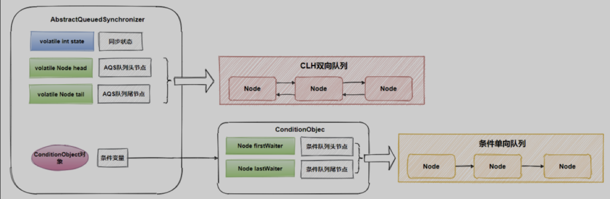

## Introduction

Provides a framework for [implementing blocking locks](/docs/CS/Java/JDK/Concurrency/Concurrency.md?id=Locks) and related [synchronizers](/docs/CS/Java/JDK/Concurrency/Concurrency.md?id=synchronizers) (semaphores, events, etc) that rely on first-in-first-out (**FIFO**) [wait queues](/docs/CS/Java/JDK/Concurrency/AQS.md?id=Wait-Queue). 

This class is designed to be a useful basis for most kinds of synchronizers that rely on a single atomic int value to represent state. 

Subclasses must define the protected methods that change this state, and which define what that state means in terms of this object being acquired or released. 
Given these, the other methods in this class carry out all queuing and blocking mechanics. 

Subclasses can maintain other state fields, but only the atomically updated int value manipulated using methods getState, setState and compareAndSetState is tracked with respect to synchronization.





```java
/**
 * Head of the wait queue, lazily initialized.  Except for
 * initialization, it is modified only via method setHead.  Note:
 * If head exists, its waitStatus is guaranteed not to be
 * CANCELLED.
 */
private transient volatile Node head;

/**
 * Tail of the wait queue, lazily initialized.  Modified only via
 * method enq to add new wait node.
 */
private transient volatile Node tail;

/**
 * The synchronization state.
 */
private volatile int state;

/**
 * The number of nanoseconds for which it is faster to spin
 * rather than to use timed park. A rough estimate suffices
 * to improve responsiveness with very short timeouts.
 */
static final long spinForTimeoutThreshold = 1000L;
```


### hasQueuedPredecessors


```java
public final boolean hasQueuedPredecessors() {
  // The correctness of this depends on head being initialized
  // before tail and on head.next being accurate if the current
  // thread is first in queue.
  Node t = tail; // Read fields in reverse initialization order
  Node h = head;
  Node s;
  return h != t &&
    ((s = h.next) == null || s.thread != Thread.currentThread());
}
```

Queries whether any threads have been waiting to acquire longer than the current thread.
An invocation of this method is equivalent to (but may be more efficient than):

 getFirstQueuedThread() != Thread.currentThread() && hasQueuedThreads()

Note that because cancellations due to interrupts and timeouts may occur at any time, a true return does not guarantee that some other thread will acquire before the current thread. Likewise, it is possible for another thread to win a race to enqueue after this method has returned false, due to the queue being empty.
This method is designed to be used by **a fair synchronizer** to avoid barging. Such a synchronizer's tryAcquire method should return false, and its tryAcquireShared method should return a negative value, if this method returns true (unless this is a reentrant acquire). For example, the tryAcquire method for a fair, reentrant, exclusive mode synchronizer might look like this:

```java
protected boolean tryAcquire(int arg) {
   if (isHeldExclusively()) {
     // A reentrant acquire; increment hold count
     return true;
   } else if (hasQueuedPredecessors()) {
     return false;
   } else {
     // try to acquire normally
   }
 }
```


### isHeldExclusively

Returns true if synchronization is held exclusively with respect to the current (calling) thread. This method is invoked upon each call to a AbstractQueuedSynchronizer.ConditionObject method.
The default implementation throws UnsupportedOperationException. **This method is invoked internally only within AbstractQueuedSynchronizer.ConditionObject methods, so need not be defined if conditions are not used.**


## Wait Queue

| Queue  | Sync list               | Condition           |
| ------ | ----------------------- | ------------------- |
| Struct | use Node.prev/Node.next | use Node.nextWaiter |


### Node

The wait queue is a variant of a "CLH" (Craig, Landin, and Hagersten) lock queue. CLH locks are normally used for spinlocks.  We instead use them for blocking synchronizers by including explicit ("prev" and "next") links plus a "status" field that allow nodes to signal successors when releasing locks, and handle cancellation due to interrupts and timeouts.
The status field includes bits that track whether a thread needs a signal (using LockSupport.unpark). Despite these additions, we maintain most CLH locality properties.

To enqueue into a CLH lock, you atomically splice it in as new tail. To dequeue, you set the head field, so the next eligible waiter becomes first.

```java
/**      +------+  prev +-----+       +-----+
 * head |      | <---- |     | <---- |     |  tail
 *      +------+       +-----+       +-----+
 */
```


Insertion into a CLH queue requires only a single atomic operation on "tail", so there is a simple point of demarcation from unqueued to queued. The "next" link of the predecessor is set by the enqueuing thread after successful CAS. Even though non-atomic, this suffices to ensure that any blocked thread is signalled by a predecessor when eligible (although in the case of cancellation, possibly with the assistance of a signal in method cleanQueue). Signalling is based in part on a Dekker-like scheme in which the to-be waiting thread indicates WAITING status, then retries acquiring, and then rechecks status before blocking. The signaller atomically clears WAITING status when unparking.


Dequeuing on acquire involves detaching (nulling) a node's "prev" node and then updating the "head". Other threads check if a node is or was dequeued by checking "prev" rather than head. We enforce the nulling then setting order by spin-waiting if necessary. Because of this, the lock algorithm is not itself strictly "lock-free" because an acquiring thread may need to wait for a previous acquire to make progress. When used with exclusive locks, such progress is required anyway. However Shared mode may (uncommonly) require a spin-wait before setting head field to ensure proper propagation. (Historical note: This allows some simplifications and efficiencies compared to previous versions of this class.)

A node's predecessor can change due to cancellation while it is waiting, until the node is first in queue, at which point it cannot change. The acquire methods cope with this by rechecking "prev" before waiting. The prev and next fields are modified only via CAS by cancelled nodes in method cleanQueue. The unsplice strategy is reminiscent of Michael-Scott queues in that after a successful CAS to prev field, other threads help fix next fields.  Because cancellation often occurs in bunches that complicate decisions about necessary signals, each call to cleanQueue traverses the queue until a clean sweep. Nodes that become relinked as first are unconditionally unparked (sometimes unnecessarily, but those cases are not worth avoiding).


A thread may try to acquire if it is first (frontmost) in the queue, and sometimes before.  Being first does not guarantee
success; it only gives the right to contend. We balance throughput, overhead, and fairness by allowing incoming threads to "barge" and acquire the synchronizer while in the process of enqueuing, in which case an awakened first thread may need to rewait.  To counteract possible repeated unlucky rewaits, we exponentially increase retries (up to 256) to acquire each time a thread is unparked. Except in this case, AQS locks do not spin; they instead interleave attempts to acquire with bookkeeping steps. (Users who want spinlocks can use tryAcquire.)

To improve garbage collectibility, fields of nodes not yet on list are null. (It is not rare to create and then throw away a
node without using it.) Fields of nodes coming off the list are nulled out as soon as possible. This accentuates the challenge of externally determining the first waiting thread (as in method getFirstQueuedThread). This sometimes requires the fallback of traversing backwards from the atomically updated "tail" when fields appear null. (This is never needed in the process of signalling though.)


CLH queues need a dummy header node to get started. But we don't create them on construction, because it would be wasted effort if there is never contention. Instead, the node is constructed and head and tail pointers are set upon first contention.
Shared mode operations differ from Exclusive in that an acquire signals the next waiter to try to acquire if it is also
Shared. The tryAcquireShared API allows users to indicate the degree of propagation, but in most applications, it is more efficient to ignore this, allowing the successor to try acquiring in any case.
Threads waiting on Conditions use nodes with an additional link to maintain the (FIFO) list of conditions. Conditions only need to link nodes in simple (non-concurrent) linked queues because they are only accessed when exclusively held.  Upon await, a node is inserted into a condition queue.  Upon signal, the node is enqueued on the main queue.  A special status field value is used to track and atomically trigger this. Accesses to fields head, tail, and state use full Volatile mode, along with CAS. Node fields status, prev and next also do so while threads may be signallable, but sometimes use weaker modes otherwise. Accesses to field "waiter" (the thread to be signalled) are always sandwiched between other atomic accesses so are used in Plain mode. We use jdk.internal Unsafe versions of atomic access methods rather than VarHandles to avoid potential VM bootstrap issues.


Most of the above is performed by primary internal method acquire, that is invoked in some way by all exported acquire
methods.  (It is usually easy for compilers to optimize call-site specializations when heavily used.)
There are several arbitrary decisions about when and how to check interrupts in both acquire and await before and/or after blocking. The decisions are less arbitrary in implementation updates because some users appear to rely on original behaviors in ways that are racy and so (rarely) wrong in general but hard to justify changing.

Thanks go to Dave Dice, Mark Moir, Victor Luchangco, Bill Scherer and Michael Scott, along with members of JSR-166 expert group, for helpful ideas, discussions, and critiques on the design of this class.


```java
abstract static class Node {
    volatile Node prev;       // initially attached via casTail
    volatile Node next;       // visibly nonnull when signallable
    Thread waiter;            // visibly nonnull when enqueued
    volatile int status;      // written by owner, atomic bit ops by others

    // methods for atomic operations
    final boolean casPrev(Node c, Node v) {  // for cleanQueue
        return U.weakCompareAndSetReference(this, PREV, c, v);
    }
    final boolean casNext(Node c, Node v) {  // for cleanQueue
        return U.weakCompareAndSetReference(this, NEXT, c, v);
    }
    final int getAndUnsetStatus(int v) {     // for signalling
        return U.getAndBitwiseAndInt(this, STATUS, ~v);
    }
    final void setPrevRelaxed(Node p) {      // for off-queue assignment
        U.putReference(this, PREV, p);
    }
    final void setStatusRelaxed(int s) {     // for off-queue assignment
        U.putInt(this, STATUS, s);
    }
    final void clearStatus() {               // for reducing unneeded signals
        U.putIntOpaque(this, STATUS, 0);
    }

    private static final long STATUS
        = U.objectFieldOffset(Node.class, "status");
    private static final long NEXT
        = U.objectFieldOffset(Node.class, "next");
    private static final long PREV
        = U.objectFieldOffset(Node.class, "prev");
}
```


```java
// Concrete classes tagged by type
static final class ExclusiveNode extends Node { }
static final class SharedNode extends Node { }

static final class ConditionNode extends Node
    implements ForkJoinPool.ManagedBlocker {
    ConditionNode nextWaiter;            // link to next waiting node

    /**
     * Allows Conditions to be used in ForkJoinPools without risking fixed pool exhaustion. 
     * This is usable only for untimed Condition waits, not timed versions.
     */
    public final boolean isReleasable() {
        return status <= 1 || Thread.currentThread().isInterrupted();
    }

    public final boolean block() {
        while (!isReleasable()) LockSupport.park();
        return true;
    }
}
```


#### waitStatus

```java
/** waitStatus value to indicate thread has cancelled */
static final int CANCELLED =  1;
/** waitStatus value to indicate successor's thread needs unparking */
static final int SIGNAL    = -1;
/** waitStatus value to indicate thread is waiting on condition */
static final int CONDITION = -2;
/**
 * waitStatus value to indicate the next acquireShared should
 * unconditionally propagate
 */
static final int PROPAGATE = -3;
```

Status field, taking on only the values: 

- SIGNAL: The successor of this node is (or will soon be) blocked (via park), so the current node must unpark its successor when it releases or cancels. To avoid races, acquire methods must first indicate they need a signal, then retry the atomic acquire, and then, on failure, block. 
- CANCELLED: This node is cancelled due to timeout or interrupt. Nodes never leave this state. In particular, a thread with cancelled node never again blocks. 
- CONDITION: This node is currently on a condition queue. It will not be used as a sync queue node until transferred, at which time the status will be set to 0. (Use of this value here has nothing to do with the other uses of the field, but simplifies mechanics.) 
- PROPAGATE: A `releaseShared` should be propagated to other nodes. This is set (for head node only) in `doReleaseShared` to ensure propagation continues, even if other operations have since intervened. 
- 0: None of the above 

The values are arranged numerically to simplify use. Non-negative values mean that a node doesn't need to signal. So, most code doesn't need to check for particular values, just for sign. 

The field is initialized to 0 for normal sync nodes, and CONDITION for condition nodes. It is modified using CAS (or when possible,


#### nextWaiter

Link to **next node waiting on condition**, or **the special value SHARED**. Because condition queues are accessed only when holding in exclusive mode, we just need a simple linked queue to hold nodes while they are waiting on conditions. They are then transferred to the queue to re-acquire. And because conditions can only be exclusive, we save a field by using special value to indicate shared mode.


## acquire

1. `tryAcquire` implement by subclass
2. addWaiter(Node.EXCLUSIVE)
3. acquireQueued
   1. shouldParkAfterFailedAcquire
   2. parkAndCheckInterrupt
4. selfInterrupt

Acquires in exclusive mode, ignoring interrupts. Implemented by invoking at least once tryAcquire, returning on success. Otherwise the thread is queued, possibly repeatedly blocking and unblocking, invoking tryAcquire until success. This method can be used to implement method `Lock.lock`.

```java
public final void acquire(int arg) {
    if (!tryAcquire(arg) &&
        acquireQueued(addWaiter(Node.EXCLUSIVE), arg))
        selfInterrupt(); // give a interrupt signal
}

public final void acquireInterruptibly(int arg)
        throws InterruptedException {
    if (Thread.interrupted())
        throw new InterruptedException();
    if (!tryAcquire(arg))
        doAcquireInterruptibly(arg);// will throw new InterruptedException for cancelAcquire
}
```

#### addWaiter

Set node.prev first, then set prev.node when `compareAndSetTail`success 

so it is not safe to iterate from head, node.next maybe null

```java
/**
 * Creates and enqueues node for current thread and given mode.
 * Node.EXCLUSIVE for exclusive, Node.SHARED for shared
 */
private Node addWaiter(Node mode) {
    Node node = new Node(Thread.currentThread(), mode);
    // Try the fast path of enq; backup to full enq on failure
    Node pred = tail;
    if (pred != null) {
        node.prev = pred;
        if (compareAndSetTail(pred, node)) {
            pred.next = node;
            return node;
        }
    }
    enq(node);// loop cas enq if tail == null || cas fail
    return node;
}

// Inserts node into queue, initializing if necessary. See picture above.
private Node enq(final Node node) {
    for (;;) {
        Node t = tail;
        if (t == null) { // Must initialize
            if (compareAndSetHead(new Node()))
                tail = head;
        } else {
            node.prev = t;
            if (compareAndSetTail(t, node)) {
                t.next = node;
                return t;
            }
        }
    }
}
```


#### acquireQueued


```java
/**
 * Acquires in exclusive uninterruptible mode for thread already in
 * queue. Used by condition wait methods as well as acquire.
 */
final boolean acquireQueued(final Node node, int arg) {
    boolean failed = true;
    try {
        boolean interrupted = false;
        for (;;) {
            final Node p = node.predecessor(); // find prev node
            if (p == head && tryAcquire(arg)) { // prev node == head && tryAcquire success
                setHead(node);
                p.next = null; // help GC
                failed = false;
                return interrupted;
            }
            if (shouldParkAfterFailedAcquire(p, node) &&
                parkAndCheckInterrupt()) // park and interrupted
                interrupted = true;
        }
    } finally {
        if (failed)
            cancelAcquire(node);
    }
}


/**
 * Sets head of queue to be node, thus dequeuing. Called only by
 * acquire methods.  Also nulls out unused fields for sake of GC
 * and to suppress unnecessary signals and traversals.
 */
private void setHead(Node node) {
    head = node;
    node.thread = null;
    node.prev = null;
}
```


#### shouldParkAfterFailedAcquire


```java
/**
 * Checks and updates status for a node that failed to acquire.
 * Returns true if thread should block. This is the main signal
 * control in all acquire loops.  Requires that pred == node.prev.
 *
 * @param pred node's predecessor holding status
 * @param node the node
 * @return {@code true} if thread should block
 */
private static boolean shouldParkAfterFailedAcquire(Node pred, Node node) {
    int ws = pred.waitStatus;
    if (ws == Node.SIGNAL)
        /*
         * This node has already set status asking a release
         * to signal it, so it can safely park.
         */
        return true;
    if (ws > 0) {
        /*
         * Predecessor was cancelled. Skip over predecessors and
         * indicate retry.
         */
        do {
            node.prev = pred = pred.prev;
        } while (pred.waitStatus > 0);
        pred.next = node;
    } else {
        /*
         * waitStatus must be 0 or PROPAGATE.  Indicate that we
         * need a signal, but don't park yet.  Caller will need to
         * retry to make sure it cannot acquire before parking.
         */
        compareAndSetWaitStatus(pred, ws, Node.SIGNAL);
    }
    return false;
}
```


#### parkAndCheckInterrupt

Clear interrupt for next [park](/docs/CS/Java/JDK/Basic/unsafe.md?id=parker)

```java
private final boolean parkAndCheckInterrupt() {
    LockSupport.park(this);
    return Thread.interrupted(); // clear interrupt avoid next park fail
}
```


#### cancelAcquire

when will we invoke cancelAcquire:

1. exception
2. Else timeout, throw new InterruptedException 


```java
private void cancelAcquire(Node node) {
    // Ignore if node doesn't exist
    if (node == null)
        return;

    node.thread = null;

    // Skip cancelled predecessors
    Node pred = node.prev;
    while (pred.waitStatus > 0)
        node.prev = pred = pred.prev;

    // predNext is the apparent node to unsplice. CASes below will
    // fail if not, in which case, we lost race vs another cancel
    // or signal, so no further action is necessary.
    Node predNext = pred.next;

    // Can use unconditional write instead of CAS here.
    // After this atomic step, other Nodes can skip past us.
    // Before, we are free of interference from other threads.
    node.waitStatus = Node.CANCELLED;

    // If we are the tail, remove ourselves.
    if (node == tail && compareAndSetTail(node, pred)) {
        compareAndSetNext(pred, predNext, null);
    } else {
        // If successor needs signal, try to set pred's next-link
        // so it will get one. Otherwise wake it up to propagate.
        int ws;
        if (pred != head &&
            ((ws = pred.waitStatus) == Node.SIGNAL ||
             (ws <= 0 && compareAndSetWaitStatus(pred, ws, Node.SIGNAL))) &&
            pred.thread != null) {
            Node next = node.next;
            if (next != null && next.waitStatus <= 0)
                compareAndSetNext(pred, predNext, next);
        } else {
            unparkSuccessor(node);
        }

        node.next = node; // help GC
    }
}
```

## release

1. tryRelease
2. unparkSuccessor

```java
public final boolean release(int arg) {
    if (tryRelease(arg)) {
        Node h = head;
        if (h != null && h.waitStatus != 0)
            unparkSuccessor(h);
        return true;
    }
    return false;
}
```


### unparkSuccessor

```java
private void unparkSuccessor(Node node) {
    /*
     * If status is negative (i.e., possibly needing signal) try
     * to clear in anticipation of signalling.  It is OK if this
     * fails or if status is changed by waiting thread.
     */
    int ws = node.waitStatus;
    if (ws < 0)
        compareAndSetWaitStatus(node, ws, 0);

    /*
     * Thread to unpark is held in successor, which is normally
     * just the next node.  But if cancelled or apparently null,
     * traverse backwards from tail to find the actual
     * non-cancelled successor.
     */
    Node s = node.next;
    if (s == null || s.waitStatus > 0) {
        s = null;
        for (Node t = tail; t != null && t != node; t = t.prev)
            if (t.waitStatus <= 0)
                s = t;
    }
    if (s != null)
        LockSupport.unpark(s.thread);
}
```


## Shared


### acquireShared

1. addWaiter
2. setHeadAndPropagate -> doReleaseShared
3. shouldParkAfterFailedAcquire
4. parkAndCheckInterrupt

```java
public final void acquireShared(int arg) {
    if (tryAcquireShared(arg) < 0)
        doAcquireShared(arg);
}

private void doAcquireShared(int arg) {
    final Node node = addWaiter(Node.SHARED);
    boolean failed = true;
    try {
        boolean interrupted = false;
        for (;;) {
            final Node p = node.predecessor();
            if (p == head) {
                int r = tryAcquireShared(arg);
                if (r >= 0) {
                    setHeadAndPropagate(node, r);
                    p.next = null; // help GC
                    if (interrupted)
                        selfInterrupt();
                    failed = false;
                    return;
                }
            }
            if (shouldParkAfterFailedAcquire(p, node) &&
                parkAndCheckInterrupt())
                interrupted = true;
        }
    } finally {
        if (failed)
            cancelAcquire(node);
    }
}
```


```java
private void doAcquireSharedInterruptibly(int arg)
    throws InterruptedException {
    final Node node = addWaiter(Node.SHARED);
    boolean failed = true;
    try {
        for (;;) {
            final Node p = node.predecessor();
            if (p == head) {
                int r = tryAcquireShared(arg);
                if (r >= 0) {
                    setHeadAndPropagate(node, r);
                    p.next = null; // help GC
                    failed = false;
                    return;
                }
            }
            if (shouldParkAfterFailedAcquire(p, node) &&
                parkAndCheckInterrupt())
                throw new InterruptedException();
        }
    } finally {
        if (failed)
            cancelAcquire(node);
    }
}
```


#### setHeadAndPropagate

```java
/**
 * Sets head of queue, and checks if successor may be waiting
 * in shared mode, if so propagating if either propagate > 0 or
 * PROPAGATE status was set.
 */
private void setHeadAndPropagate(Node node, int propagate) {
    Node h = head; // Record old head for check below
    setHead(node);
    /*
     * Try to signal next queued node if:
     *   Propagation was indicated by caller,
     *     or was recorded (as h.waitStatus either before
     *     or after setHead) by a previous operation
     *     (note: this uses sign-check of waitStatus because
     *      PROPAGATE status may transition to SIGNAL.)
     * and
     *   The next node is waiting in shared mode,
     *     or we don't know, because it appears null
     *
     * The conservatism in both of these checks may cause
     * unnecessary wake-ups, but only when there are multiple
     * racing acquires/releases, so most need signals now or soon
     * anyway.
     */
    if (propagate > 0 || h == null || h.waitStatus < 0 ||
        (h = head) == null || h.waitStatus < 0) {
        Node s = node.next;
        if (s == null || s.isShared())
            doReleaseShared();
    }
}
```


### releaseShared

```java
public final boolean releaseShared(int arg) {
    if (tryReleaseShared(arg)) {
        doReleaseShared();
        return true;
    }
    return false;
}
```

#### doReleaseShared

```java
private void doReleaseShared() {
    /*
     * Ensure that a release propagates, even if there are other
     * in-progress acquires/releases.  This proceeds in the usual
     * way of trying to unparkSuccessor of head if it needs
     * signal. But if it does not, status is set to PROPAGATE to
     * ensure that upon release, propagation continues.
     * Additionally, we must loop in case a new node is added
     * while we are doing this. Also, unlike other uses of
     * unparkSuccessor, we need to know if CAS to reset status
     * fails, if so rechecking.
     */
    for (;;) {
        Node h = head;
        if (h != null && h != tail) {
            int ws = h.waitStatus;
            if (ws == Node.SIGNAL) {
                if (!compareAndSetWaitStatus(h, Node.SIGNAL, 0))
                    continue;            // loop to recheck cases
                unparkSuccessor(h);
            }
            else if (ws == 0 &&
                     !compareAndSetWaitStatus(h, 0, Node.PROPAGATE))
                continue;                // loop on failed CAS
        }
        if (h == head)                   // loop if head changed
            break;
    }
}
```


## ConditionObject

implements [Condition](/docs/CS/Java/JDK/Concurrency/Lock.md?id=condition)

```java
public class ConditionObject implements Condition, java.io.Serializable {
    private static final long serialVersionUID = 1173984872572414699L;
    /** First node of condition queue. */
    private transient Node firstWaiter;
    /** Last node of condition queue. */
    private transient Node lastWaiter;

    /**
     * Creates a new {@code ConditionObject} instance.
     */
    public ConditionObject() { }

    // Internal methods

    /**
     * Adds a new waiter to wait queue.
     * @return its new wait node
     */
    private Node addConditionWaiter() {
        Node t = lastWaiter;
        // If lastWaiter is cancelled, clean out.
        if (t != null && t.waitStatus != Node.CONDITION) {
            unlinkCancelledWaiters();
            t = lastWaiter;
        }
        Node node = new Node(Thread.currentThread(), Node.CONDITION);
        if (t == null)
            firstWaiter = node;
        else
            t.nextWaiter = node;
        lastWaiter = node;
        return node;
    }
```


### await

Implements interruptible condition wait.

1. If current thread is interrupted, throw InterruptedException.
2. Save lock state returned by getState.
3. Invoke release with saved state as argument, throwing IllegalMonitorStateException if it fails.
4. Block until signalled or interrupted.
5. Reacquire by invoking specialized version of acquire with saved state as argument.
6. If interrupted while blocked in step 4, throw InterruptedException.

```java
public final void await() throws InterruptedException {
    if (Thread.interrupted())
        throw new InterruptedException();
    Node node = addConditionWaiter();
    int savedState = fullyRelease(node);
    int interruptMode = 0;
    while (!isOnSyncQueue(node)) {
        LockSupport.park(this);
        if ((interruptMode = checkInterruptWhileWaiting(node)) != 0)
            break;
    }
    if (acquireQueued(node, savedState) && interruptMode != THROW_IE)
        interruptMode = REINTERRUPT;
    if (node.nextWaiter != null) // clean up if cancelled
        unlinkCancelledWaiters();
    if (interruptMode != 0)
        reportInterruptAfterWait(interruptMode);
}
```


#### addConditionWaiter
If lastWaiter is cancelled, clean out, add nextWaiter
```java
private Node addConditionWaiter() {
    Node t = lastWaiter;
    // If lastWaiter is cancelled, clean out.
    if (t != null && t.waitStatus != Node.CONDITION) {
        unlinkCancelledWaiters();
        t = lastWaiter;
    }
    Node node = new Node(Thread.currentThread(), Node.CONDITION);
    if (t == null)
        firstWaiter = node;
    else
        t.nextWaiter = node;
    lastWaiter = node;
    return node;
}
```


Unlinks cancelled waiter nodes from condition queue. Called only while holding lock. This is called when cancellation occurred during condition wait, and upon insertion of a new waiter when lastWaiter is seen to have been cancelled. This method is needed to avoid garbage retention in the absence of signals. So even though it may require a full traversal, it comes into play only when timeouts or cancellations occur in the absence of signals. It traverses all nodes rather than stopping at a particular target to unlink all pointers to garbage nodes without requiring many re-traversals during cancellation storms.

```java
private void unlinkCancelledWaiters() {
    Node t = firstWaiter;
    Node trail = null;
    while (t != null) {
        Node next = t.nextWaiter;
        if (t.waitStatus != Node.CONDITION) {
            t.nextWaiter = null;
            if (trail == null)
                firstWaiter = next;
            else
                trail.nextWaiter = next;
            if (next == null)
                lastWaiter = trail;
        }
        else
            trail = t;
        t = next;
    }
}
```


#### fullyRelease

```java
/**
 * Invokes release with current state value; returns saved state.
 * Cancels node and throws exception on failure.
 */
final int fullyRelease(Node node) {
    boolean failed = true;
    try {
        int savedState = getState();
        if (release(savedState)) {
            failed = false;
            return savedState;
        } else {
            throw new IllegalMonitorStateException();
        }
    } finally {
        if (failed)
            node.waitStatus = Node.CANCELLED;
    }
}
```


use [Thread#yield()](/docs/CS/Java/JDK/Concurrency/Thread.md?id=yield)

```java
private int checkInterruptWhileWaiting(Node node) {
    return Thread.interrupted() ?
        (transferAfterCancelledWait(node) ? THROW_IE : REINTERRUPT) :
        0;
}

final boolean transferAfterCancelledWait(Node node) {
    if (compareAndSetWaitStatus(node, Node.CONDITION, 0)) {
        enq(node);
        return true;
    }
    /*
     * If we lost out to a signal(), then we can't proceed
     * until it finishes its enq().  Cancelling during an
     * incomplete transfer is both rare and transient, so just
     * spin.
     */
    while (!isOnSyncQueue(node))
        Thread.yield();
    return false;
}
```


```java
final boolean isOnSyncQueue(Node node) {
    if (node.waitStatus == Node.CONDITION || node.prev == null)
        return false;
    if (node.next != null) // If has successor, it must be on queue
        return true;
    /*
     * node.prev can be non-null, but not yet on queue because
     * the CAS to place it on queue can fail. So we have to
     * traverse from tail to make sure it actually made it.  It
     * will always be near the tail in calls to this method, and
     * unless the CAS failed (which is unlikely), it will be
     * there, so we hardly ever traverse much.
     */
    return findNodeFromTail(node);
}
```


#### reportInterruptAfterWait

```java
private void reportInterruptAfterWait(int interruptMode)
    throws InterruptedException {
    if (interruptMode == THROW_IE)
        throw new InterruptedException();
    else if (interruptMode == REINTERRUPT)
        selfInterrupt();
}
```

### signal

Moves the longest-waiting thread, if one exists, from the wait queue for this condition to the wait queue for the owning lock.

```java
public final void signal() {
    if (!isHeldExclusively())
        throw new IllegalMonitorStateException();
    Node first = firstWaiter;
    if (first != null)
        doSignal(first);
}

public final void signalAll() {
    if (!isHeldExclusively())
        throw new IllegalMonitorStateException();
    Node first = firstWaiter;
    if (first != null)
        doSignalAll(first);
}
```


#### doSignal

Removes and transfers nodes until hit non-cancelled one or null. Split out from signal in part to encourage compilers to inline the case of no waiters.

```java
private void doSignal(Node first) {
    do {
        if ( (firstWaiter = first.nextWaiter) == null)
            lastWaiter = null;
        first.nextWaiter = null;
    } while (!transferForSignal(first) &&
             (first = firstWaiter) != null);
}

private void doSignalAll(Node first) {
    lastWaiter = firstWaiter = null;
    do {
        Node next = first.nextWaiter;
        first.nextWaiter = null;
        transferForSignal(first);
        first = next;
    } while (first != null);
}
```


#### transferForSignal

enq

```java
final boolean transferForSignal(Node node) {
    // If cannot change waitStatus, the node has been cancelled.
    if (!compareAndSetWaitStatus(node, Node.CONDITION, 0))
        return false;

    /*
     * Splice onto queue and try to set waitStatus of predecessor to
     * indicate that thread is (probably) waiting. If cancelled or
     * attempt to set waitStatus fails, wake up to resync (in which
     * case the waitStatus can be transiently and harmlessly wrong).
     */
    Node p = enq(node);
    int ws = p.waitStatus;
    if (ws > 0 || !compareAndSetWaitStatus(p, ws, Node.SIGNAL))
        LockSupport.unpark(node.thread);
    return true;
}
```

## Example
From JDK:
```java
class Mutex implements Lock, java.io.Serializable {

   // Our internal helper class
   private static class Sync extends AbstractQueuedSynchronizer {
     // Reports whether in locked state
     protected boolean isHeldExclusively() {
       return getState() == 1;
     }

     // Acquires the lock if state is zero
     public boolean tryAcquire(int acquires) {
       assert acquires == 1; // Otherwise unused
       if (compareAndSetState(0, 1)) {
         setExclusiveOwnerThread(Thread.currentThread());
         return true;
       }
       return false;
     }

     // Releases the lock by setting state to zero
     protected boolean tryRelease(int releases) {
       assert releases == 1; // Otherwise unused
       if (getState() == 0) throw new IllegalMonitorStateException();
       setExclusiveOwnerThread(null);
       setState(0);
       return true;
     }

     // Provides a Condition
     Condition newCondition() { return new ConditionObject(); }

     // Deserializes properly
     private void readObject(ObjectInputStream s)
         throws IOException, ClassNotFoundException {
       s.defaultReadObject();
       setState(0); // reset to unlocked state
     }
   }

   // The sync object does all the hard work. We just forward to it.
   private final Sync sync = new Sync();

   public void lock()                { sync.acquire(1); }
   public boolean tryLock()          { return sync.tryAcquire(1); }
   public void unlock()              { sync.release(1); }
   public Condition newCondition()   { return sync.newCondition(); }
   public boolean isLocked()         { return sync.isHeldExclusively(); }
   public boolean hasQueuedThreads() { return sync.hasQueuedThreads(); }
   public void lockInterruptibly() throws InterruptedException {
     sync.acquireInterruptibly(1);
   }
   public boolean tryLock(long timeout, TimeUnit unit)
       throws InterruptedException {
     return sync.tryAcquireNanos(1, unit.toNanos(timeout));
   }
 }
```

Here is a latch class that is like a CountDownLatch except that it only requires a single signal to fire. Because a latch is non-exclusive, it uses the shared acquire and release methods.

```java
 class BooleanLatch {

   private static class Sync extends AbstractQueuedSynchronizer {
     boolean isSignalled() { return getState() != 0; }

     protected int tryAcquireShared(int ignore) {
       return isSignalled() ? 1 : -1;
     }

     protected boolean tryReleaseShared(int ignore) {
       setState(1);
       return true;
     }
   }

   private final Sync sync = new Sync();
   public boolean isSignalled() { return sync.isSignalled(); }
   public void signal()         { sync.releaseShared(1); }
   public void await() throws InterruptedException {
     sync.acquireSharedInterruptibly(1);
   }
 }
```

1. Exclusive ReentrantLock
2. Share Semaphore/CountDownLatch
3. Both ReadWriteLock/StampedLock


## Summary


## AOS

AbstractOwnableSynchronizer


## Implementation

1. [ReentrantLock](/docs/CS/Java/JDK/Concurrency/ReentrantLock.md)
2. [ReentrantReadWriteLcok](/docs/CS/Java/JDK/Concurrency/ReadWriteLock.md)
3. [ThreadPoolExecutor.Worker](/docs/CS/Java/JDK/Concurrency/ThreadPoolExecutor.md?id=Worker)


## Links
- [Concurrency](/docs/CS/Java/JDK/Concurrency/Concurrency.md)
- [synchronized](/docs/CS/Java/JDK/Concurrency/synchronized.md)


## References


