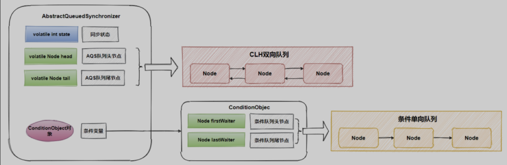

## Introduction

提供了一个框架，用于实现依赖于先进先出（**FIFO**）[等待队列](/docs/CS/Java/JDK/Concurrency/AQS.md?id=Wait-Queue)的[阻塞锁](/docs/CS/Java/JDK/Concurrency/Concurrency.md?id=Locks)和相关[同步器](/docs/CS/Java/JDK/Concurrency/Concurrency.md?id=synchronizers)（信号量、事件等）。

此类被设计为大多数依赖于单个原子 int 值来表示状态的同步器的有用基础。

子类必须定义改变此状态的 protected 方法，并定义该状态在获取或释放此对象方面的含义。
有了这些，此类中的其他方法将执行所有排队和阻塞机制。

子类可以维护其他状态字段，但只有使用方法 `getState`、`setState` 和 `compareAndSetState` 操作的原子更新 int 值才会被跟踪以实现同步。

## Architecture



```java
/**
 * Head of the wait queue, lazily initialized.  Except for
 * initialization, it is modified only via method setHead.  Note:
 * If head exists, its waitStatus is guaranteed not to be
 * CANCELLED.
 */
private transient volatile Node head;

/**
 * Tail of the wait queue, lazily initialized.  Modified only via
 * method enq to add new wait node.
 */
private transient volatile Node tail;

/**
 * The synchronization state.
 */
private volatile int state;
```

### 等待队列

等待队列是 CLH 锁队列的变体。CLH 锁通常用于自旋锁。
我们将它们用于阻塞同步器，但使用相同的基本策略，即在线程中保存有关前驱节点的控制信息。
每个节点都有一个"状态"字段，用于跟踪线程是否应被阻塞。

## Links

- [JDK Concurrency](/docs/CS/Java/JDK/Concurrency/Concurrency.md)
