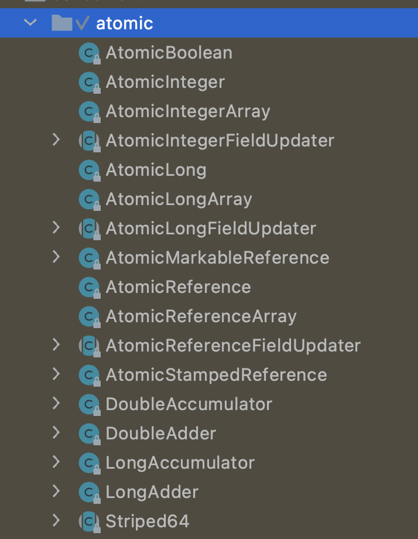

## Introduction

A small toolkit of classes that **support lock-free thread-safe programming on single variables**.
In essence, **the classes in this package extend the notion of volatile values, fields, and array elements to those that also provide an atomic conditional update operation of the form**:

```java
 boolean compareAndSet(expectedValue, updateValue);
```

This method (which varies in argument types across different classes) **atomically sets a variable to the updateValue if it currently holds the expectedValue, reporting true on success**.
The classes in this package also contain methods to **get and unconditionally set values**, as well as a weaker conditional atomic update operation **weakCompareAndSet** described below.

The specifications of these methods enable implementations to employ **efficient machine-level atomic instructions** that are available on contemporary processors.
However on some platforms, support may entail some form of **internal locking**. **Thus the methods are not strictly guaranteed to be non-blocking -- a thread may block transiently before performing the operation**.

The memory effects for accesses and updates of atomics generally follow the rules for volatiles, as stated in The Java Language Specification (17.4 Memory Model) :

1. get has the memory effects of reading a volatile variable.
2. set has the memory effects of writing (assigning) a volatile variable.
3. lazySet has the memory effects of writing (assigning) a volatile variable except that it permits reorderings with subsequent (but not previous) memory actions that do not themselves impose reordering constraints with ordinary non-volatile writes.
4. Among other usage contexts, lazySet may apply when nulling out, for the sake of garbage collection, a reference that is never accessed again.
5. weakCompareAndSet **atomically reads and conditionally writes a variable but does not create any happens-before orderings**, so provides no guarantees with respect to previous or subsequent reads and writes of any variables other than the target of the weakCompareAndSet.
6. compareAndSet and all other read-and-update operations such as getAndIncrement **have the memory effects of both reading and writing volatile variables**.



Instances of classes **AtomicBoolean, AtomicInteger, AtomicLong, and AtomicReference each provide access and updates to a single variable of the corresponding type**.
Each class also provides appropriate utility methods for that type. For example, classes AtomicLong and AtomicInteger provide atomic increment methods.
One application is to generate sequence numbers, as in:

```java
class Sequencer {
   private final AtomicLong sequenceNumber
     = new AtomicLong(0);
   public long next() {
     return sequenceNumber.getAndIncrement();
   }
 }
```

In addition to classes representing single values, this package contains Updater classes that can be used to obtain compareAndSet operations on any selected volatile field of any selected class.
**AtomicReferenceFieldUpdater, AtomicIntegerFieldUpdater, and AtomicLongFieldUpdater are reflection-based utilities that provide access to the associated field types**.
These are mainly of use in atomic data structures in which several volatile fields of the same node (for example, the links of a tree node) are independently subject to atomic updates.
**These classes enable greater flexibility in how and when to use atomic updates, at the expense of more awkward reflection-based setup, less convenient usage, and weaker guarantees**.

The `AtomicIntegerArray`, `AtomicLongArray`, and `AtomicReferenceArray` classes further extend atomic operation support to arrays of these types.
These classes are also notable in providing `volatile` access semantics for their array elements.

The atomic classes also support method **weakCompareAndSet**, which has **limited applicability**.
On some platforms, the weak version may be more efficient than compareAndSet in the normal case, but differs in that any given invocation of the **weakCompareAndSet method may return false spuriously (that is, for no apparent reason)**.
A false return means only that the operation may be retried if desired, relying on the guarantee that repeated invocation when the variable holds expectedValue and no other thread is also attempting to set the variable will eventually succeed.
(Such spurious failures may for example be due to memory contention effects that are unrelated to whether the expected and current values are equal.)
Additionally **weakCompareAndSet does not provide ordering guarantees that are usually needed for synchronization control**.
However, the method may be useful for updating counters and statistics when such updates are unrelated to the other happens-before orderings of a program.
When a thread sees an update to an atomic variable caused by a weakCompareAndSet, it does not necessarily see updates to any other variables that occurred before the weakCompareAndSet.
This may be acceptable when, for example, updating performance statistics, but rarely otherwise.*

The **AtomicMarkableReference class associates a single boolean with a reference**.
For example, this bit might be used inside a data structure to mean that the object being referenced has logically been deleted.

The **AtomicStampedReference class associates an integer value with a reference**.
This may be used for example, to represent version numbers corresponding to series of updates.

Atomic classes are designed primarily as building blocks for implementing non-blocking data structures and related infrastructure classes.
**The compareAndSet method is not a general replacement for locking. It applies only when critical updates for an object are confined to a single variable**.
The **Atomic classes are not general purpose replacements for java.lang.Integer and related classes**.
They do not define methods such as equals, hashCode and compareTo. (Because atomic variables are expected to be mutated, they are poor choices for hash table keys.)
Additionally, classes are provided only for those types that are commonly useful in intended applications. For example, there is no atomic class for representing byte.
In those infrequent cases where you would like to do so, **you can use an AtomicInteger to hold byte values, and cast appropriately**.
You can also hold floats using Float.floatToRawIntBits and Float.intBitsToFloat conversions, and doubles using Double.doubleToRawLongBits and Double.longBitsToDouble conversions.

## AtomicInteger

```java
// setup to use Unsafe.compareAndSwapInt for updates
private static final Unsafe unsafe = Unsafe.getUnsafe();
private static final long valueOffset;
private volatile int value;
```


Atomically updates Java variable to x if it is currently holding expected.
This operation has memory semantics of a volatile read and write. 
Corresponds to C11 atomic_compare_exchange_strong.
```java
public final class Unsafe {
    @ForceInline
    public final boolean compareAndSwapInt(Object o, long offset,
                                           int expected,
                                           int x) {
        return theInternalUnsafe.compareAndSetInt(o, offset, expected, x);
    }
}

    @IntrinsicCandidate
    public final native boolean compareAndSetInt(Object o, long offset,
                                                 int expected,
                                                 int x);
```

## AtomicReference

AtomicReference fix CAS

Lock

## LongAdder

One or more variables that together maintain an initially zero long sum. When updates (method add) are contended across threads, the set of variables may grow dynamically to reduce contention. Method sum (or, equivalently, longValue) returns the current total combined across the variables maintaining the sum.
This class is usually preferable to AtomicLong when multiple threads update a common sum that is used for purposes such as collecting statistics, not for fine-grained synchronization control. Under low update contention, the two classes have similar characteristics. But under high contention, expected throughput of this class is significantly higher, at the expense of higher space consumption.
LongAdders can be used with a [java.util.concurrent.ConcurrentHashMap]() to maintain a scalable frequency map (a form of histogram or multiset). For example, to add a count to a ConcurrentHashMap<String,LongAdder> freqs, initializing if not already present, you can use freqs.computeIfAbsent(k -> new LongAdder()).increment();
This class extends Number, but does not define methods such as equals, hashCode and compareTo because instances are expected to be mutated, and so are not useful as collection keys.

```java
public class LongAdder extends Striped64 implements Serializable {
}
```

Padded variant of AtomicLong supporting only raw accesses plus **CAS**. JVM intrinsics note: It would be possible to use a release-only form of CAS here, if it were provided.

```java
// Striped64
@sun.misc.Contended static final class Cell {
    volatile long value;
    Cell(long x) { value = x; }
    final boolean cas(long cmp, long val) {
        return UNSAFE.compareAndSwapLong(this, valueOffset, cmp, val);
    }

    // Unsafe mechanics
    private static final sun.misc.Unsafe UNSAFE;
    private static final long valueOffset;
    static {
        try {
            UNSAFE = sun.misc.Unsafe.getUnsafe();
            Class<?> ak = Cell.class;
            valueOffset = UNSAFE.objectFieldOffset
                (ak.getDeclaredField("value"));
        } catch (Exception e) {
            throw new Error(e);
        }
    }
}
```

```java
public void add(long x) {
    Cell[] as; long b, v; int m; Cell a;
    if ((as = cells) != null || !casBase(b = base, b + x)) {
        boolean uncontended = true;
        if (as == null || (m = as.length - 1) < 0 ||
            (a = as[getProbe() & m]) == null ||
            !(uncontended = a.cas(v = a.value, v + x)))
            longAccumulate(x, null, uncontended);
    }
}
```

Handles cases of updates involving initialization, resizing, creating new Cells, and/or contention. See above for explanation. This method suffers the usual non-modularity problems of optimistic retry code, relying on rechecked sets of reads.

```java
// Striped64
final void longAccumulate(long x, LongBinaryOperator fn,
                          boolean wasUncontended) {
    int h;
    if ((h = getProbe()) == 0) {
        ThreadLocalRandom.current(); // force initialization
        h = getProbe();
        wasUncontended = true;
    }
    boolean collide = false;                // True if last slot nonempty
    for (;;) {
        Cell[] as; Cell a; int n; long v;
        if ((as = cells) != null && (n = as.length) > 0) {
            if ((a = as[(n - 1) & h]) == null) {
                if (cellsBusy == 0) {       // Try to attach new Cell
                    Cell r = new Cell(x);   // Optimistically create
                    if (cellsBusy == 0 && casCellsBusy()) {
                        boolean created = false;
                        try {               // Recheck under lock
                            Cell[] rs; int m, j;
                            if ((rs = cells) != null &&
                                (m = rs.length) > 0 &&
                                rs[j = (m - 1) & h] == null) {
                                rs[j] = r;
                                created = true;
                            }
                        } finally {
                            cellsBusy = 0;
                        }
                        if (created)
                            break;
                        continue;           // Slot is now non-empty
                    }
                }
                collide = false;
            }
            else if (!wasUncontended)       // CAS already known to fail
                wasUncontended = true;      // Continue after rehash
            else if (a.cas(v = a.value, ((fn == null) ? v + x :
                                         fn.applyAsLong(v, x))))
                break;
            else if (n >= NCPU || cells != as)
                collide = false;            // At max size or stale
            else if (!collide)
                collide = true;
            else if (cellsBusy == 0 && casCellsBusy()) {
                try {
                    if (cells == as) {      // Expand table unless stale
                        Cell[] rs = new Cell[n << 1];
                        for (int i = 0; i < n; ++i)
                            rs[i] = as[i];
                        cells = rs;
                    }
                } finally {
                    cellsBusy = 0;
                }
                collide = false;
                continue;                   // Retry with expanded table
            }
            h = advanceProbe(h);
        }
        else if (cellsBusy == 0 && cells == as && casCellsBusy()) {
            boolean init = false;
            try {                           // Initialize table
                if (cells == as) {
                    Cell[] rs = new Cell[2];
                    rs[h & 1] = new Cell(x);
                    cells = rs;
                    init = true;
                }
            } finally {
                cellsBusy = 0;
            }
            if (init)
                break;
        }
        else if (casBase(v = base, ((fn == null) ? v + x :
                                    fn.applyAsLong(v, x))))
            break;                          // Fall back on using base
    }
}
```

> [!NOTE]
>
> See [Netty Memory](/docs/CS/Java/Netty/memory.md)

### LongAccumulator

One or more variables that together maintain a running long value updated using a supplied function. When updates (method accumulate) are contended across threads, the set of variables may grow dynamically to reduce contention. Method get (or, equivalently, longValue) returns the current value across the variables maintaining updates.
This class is usually preferable to AtomicLong when multiple threads update a common value that is used for purposes such as collecting statistics, not for fine-grained synchronization control. Under low update contention, the two classes have similar characteristics. But under high contention, expected throughput of this class is significantly higher, at the expense of higher space consumption.
The order of accumulation within or across threads is not guaranteed and cannot be depended upon, so this class is only applicable to functions for which the order of accumulation does not matter. The supplied accumulator function should be side-effect-free, since it may be re-applied when attempted updates fail due to contention among threads. The function is applied with the current value as its first argument, and the given update as the second argument. For example, to maintain a running maximum value, you could supply Long::max along with Long.MIN_VALUE as the identity.
Class LongAdder provides analogs of the functionality of this class for the common special case of maintaining counts and sums. *The call new LongAdder() is equivalent to new LongAccumulator((x, y) -> x + y, 0L.*
This class extends Number, but does not define methods such as equals, hashCode and compareTo because instances are expected to be mutated, and so are not useful as collection keys.

```java
public void accumulate(long x) {
    Cell[] as; long b, v, r; int m; Cell a;
    if ((as = cells) != null ||
        (r = function.applyAsLong(b = base, x)) != b && !casBase(b, r)) {
        boolean uncontended = true;
        if (as == null || (m = as.length - 1) < 0 ||
            (a = as[getProbe() & m]) == null ||
            !(uncontended =
              (r = function.applyAsLong(v = a.value, x)) == v ||
              a.cas(v, r)))
            longAccumulate(x, function, uncontended);
    }
}
```


## Array


Get/Set with VarHandle.getVolatile.
```java

private static final VarHandle AA = MethodHandles.arrayElementVarHandle(int[].class);

    public final int get(int i) {
        return (int)AA.getVolatile(array, i);
    }

    public final void set(int i, int newValue) {
        AA.setVolatile(array, i, newValue);
    }

```

## Links

- [Concurrency](/docs/CS/Java/JDK/Concurrency/Concurrency.md)

## References

