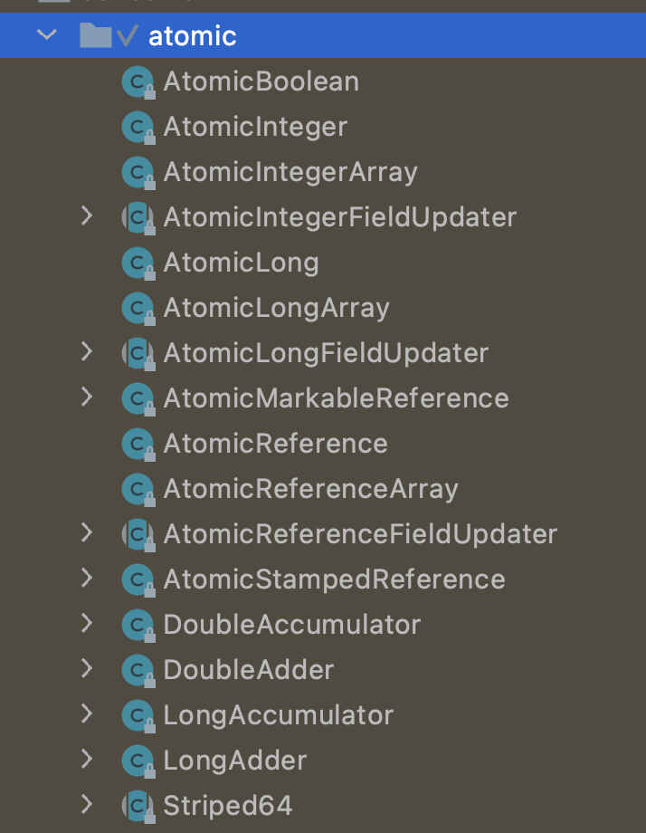

## Introduction

一个支持**单个变量上的无锁线程安全编程**的小工具类集合。
本质上，**此包中的类将 volatile 值、字段和数组元素的概念扩展为也提供原子条件更新操作**的形式：

```java
 boolean compareAndSet(expectedValue, updateValue);
```

此方法（在不同类中参数类型有所不同）**原子地将变量设置为 updateValue（如果它当前持有 expectedValue），并在成功时返回 true**。
此包中的类还包含**获取和无条件设置值**的方法，以及更弱的条件原子更新操作 **weakCompareAndSet**。

这些方法的规范使实现能够利用当代处理器上可用的**高效的机器级原子指令**。
然而，在某些平台上，支持可能需要某种形式的**内部锁**。**因此，这些方法并不严格保证非阻塞——线程在执行操作之前可能会短暂阻塞**。

原子变量的访问和更新的内存效应通常遵循 volatile 的规则，如 Java 语言规范（17.4 内存模型）所述：

1. get 具有读取 volatile 变量的内存效应。
2. set 具有写入（赋值）volatile 变量的内存效应。
3. lazySet 具有写入 volatile 变量的内存效应，但允许与后续（而非先前）不自身强加重新排序约束的内存操作一起重新排序，这与普通的非 volatile 写入不同。
4. 在其他使用场景中，lazySet 可用于在为空引用赋值时，为了垃圾收集的目的，该引用永远不会再被访问。
5. weakCompareAndSet **原子地读取并有条件地写入变量，但不创建任何 happens-before 顺序**，因此不保证对目标变量以外的任何变量的先前或后续读写提供保证。
6. compareAndSet 和所有其他读取并更新的操作（如 getAndIncrement）**具有读取和写入 volatile 变量的内存效应**。



**AtomicBoolean、AtomicInteger、AtomicLong 和 AtomicReference** 类的实例各自提供对相应类型的单个变量的访问和更新。
每个类还提供了该类型的适当实用方法。例如，AtomicLong 和 AtomicInteger 提供了原子增量方法。
一个应用是生成序列号，如下所示：

```java
class Sequencer {
    private final AtomicLong sequenceNumber = new AtomicLong(0);

    public long next() {
        return sequenceNumber.getAndIncrement();
    }
}
```

## Links

- [JDK Concurrency](/docs/CS/Java/JDK/Concurrency/Concurrency.md)
