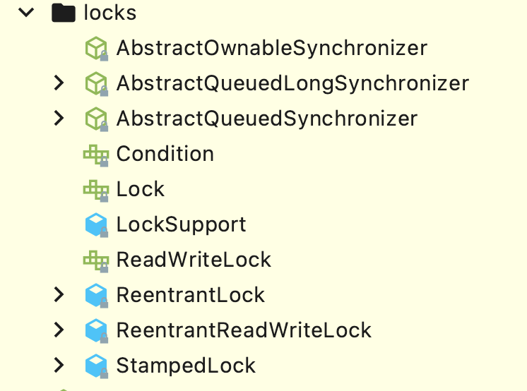

## Introduction

## Basic

### Memory Model

[JMM](/docs/CS/Java/JDK/Concurrency/JMM.md)

线程各自的本地内存对其它线程是不可见的；多个线程写入主存时可能会存在脏数据；指令重排导致结果不可控。
多线程交互需要解决上述三个问题，这三个问题也是线程并发的核心：

> 1、可见性
> 2、原子性
> 3、有序性

同步是在互斥的基础上增加了等待-通知机制，实现了对互斥资源的有序访问，因此同步本身已经实现了互斥。

> 同步是种复杂的互斥
> 互斥是种特殊的同步

- [CAS](/docs/CS/Java/JDK/Basic/unsafe.md?id=CAS)
- [volatile](/docs/CS/Java/JDK/Concurrency/volatile.md)
- [synchronized](/docs/CS/Java/JDK/Concurrency/synchronized.md)

## Thread Fundamentals
- [Thread](/docs/CS/Java/JDK/Concurrency/Thread.md)
- [ThreadLocal](/docs/CS/Java/JDK/Concurrency/ThreadLocal.md)
- [ThreadLocalRandom](/docs/CS/Java/JDK/Concurrency/ThreadLocalRandom.md)
- [Atomics](/docs/CS/Java/JDK/Concurrency/Atomic.md)

## Concurrent Collections

1. fail-fast for Collections in `java.util`, such as `HashMap`, `ArrayList`
2. fail-safe for Collections in `java.util.concurrent`, such as `ConcurrentHashMap`, `CopyOnWriteArrayList`

- [CopyOnWriteArrayList](/docs/CS/Java/JDK/Collection/List.md?id=CopyOnWriteArrayList)
- [ConcurrentHashMap](/docs/CS/Java/JDK/Collection/Map.md?id=ConcurrentHashMap)
- [ConcurrentSkipListMap](/docs/CS/Java/JDK/Collection/Map.md?id=ConcurrentSkipListMap)
- [BlockingQueue](/docs/CS/Java/JDK/Collection/Queue.md?id=BlockingQueue)

## Locks

- [Lock and Conditions](/docs/CS/Java/JDK/Concurrency/Lock.md)
- [AQS](/docs/CS/Java/JDK/Concurrency/AQS.md)
- [ReentrantLock](/docs/CS/Java/JDK/Concurrency/ReentrantLock.md)
- [ReadWriteLock](/docs/CS/Java/JDK/Concurrency/ReadWriteLock.md)
- [StampedLock](/docs/CS/Java/JDK/Concurrency/StampedLock.md)

## Synchronizers
- [Semaphore](/docs/CS/Java/JDK/Concurrency/Semaphore.md)
- [CountDownLatch](/docs/CS/Java/JDK/Concurrency/CountDownLatch.md)
- [CyclicBarrier](/docs/CS/Java/JDK/Concurrency/CyclicBarrier.md)
- [Exchanger](/docs/CS/Java/JDK/Concurrency/Exchanger.md)
- [Phaser](/docs/CS/Java/JDK/Concurrency/Phaser.md)

## Executor

- [ThreadPoolExecutor](/docs/CS/Java/JDK/Concurrency/ThreadPoolExecutor.md)
- [ForkJoinPool](/docs/CS/Java/JDK/Concurrency/ForkJoinPool.md)
- [Future](/docs/CS/Java/JDK/Concurrency/Future.md)
