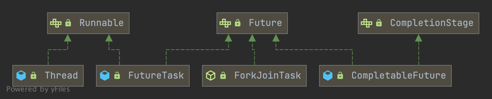

## Introduction

### Future Hierarchy



我们可以使用 **Runnable** 目标创建 [Thread](/docs/CS/Java/JDK/Concurrency/Thread.md) 对象，也可以使用 **FutureTask** 来获取 **Future**。

### Runnable

Runnable 接口应由任何其实例旨在**由线程执行**的类实现。该类必须定义一个名为 **run** 的无参数方法。
此接口旨在为希望在活动时执行代码的对象提供通用协议。**Thread 类实现了 Runnable。**

实现 Runnable 的类可以通过实例化 Thread 实例并将自身作为目标传递来运行而无需继承 Thread。这很重要，因为除非程序员打算修改或增强类的基本行为，否则不应继承类。

```java
@FunctionalInterface
public interface Runnable {
    public abstract void run();
}
```

### Callable

返回**结果且可能抛出异常**的任务。实现者定义一个名为 **call** 的无参数方法。

```java
@FunctionalInterface
public interface Callable<V> {
    V call() throws Exception;
}
```

### Future

Future 表示异步计算的结果。提供方法来检查计算是否完成、等待其完成以及检索计算结果。
计算完成后，只能使用 get 方法检索结果，必要时阻塞直到准备就绪。

```java
public interface Future<V> {
    boolean cancel(boolean mayInterruptIfRunning);
    boolean isCancelled();
    boolean isDone();
    V get() throws InterruptedException, ExecutionException;
    V get(long timeout, TimeUnit unit)
        throws InterruptedException, ExecutionException, TimeoutException;
}
```

### FutureTask

FutureTask 是 Future 的可取消异步计算实现。
它提供 Future 的基本实现，具有启动和取消计算、查询计算是否完成以及检索计算结果的方法。
计算完成后只能检索结果；如果计算尚未完成，get 方法将阻塞。
一旦计算完成，就不能重新启动或取消。

```java
public class FutureTask<V> implements RunnableFuture<V> {
    // ...
}
```

## Links

- [JDK Concurrency](/docs/CS/Java/JDK/Concurrency/Concurrency.md)
