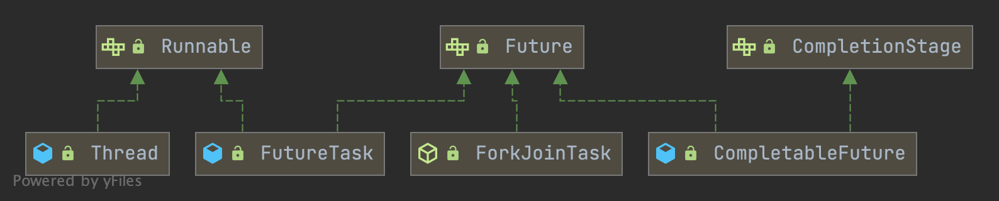

## Introduction


### Future Hierarchy



*We could create a **Thread** object with a **Runnable** target, also use **FutureTask** to get **Future**.*

### Runnable

*The Runnable interface should be implemented by any class whose instances are intended to be **executed by a thread**. The class must define a method of no arguments **called run**.*
*This interface is designed to provide a common protocol for objects that wish to execute code while they are active. **Runnable is implemented by class Thread.***

*A class that implements Runnable can run without subclassing Thread by instantiating a Thread instance and passing itself in as the target.his is important because classes should not be subclassed unless the programmer intends on modifying or enhancing the fundamental behavior of the class.*

```java
@FunctionalInterface
public interface Runnable {

    public abstract void run();
}
```


### Callable

*A task that **returns a result and may throw an exception**. Implementors define a single method with no arguments **called call**.*

**Runnable does not return a result and cannot throw a checked exception.**

**The Callable interface is similar to Runnable**, in that both are designed for classes whose instances are potentially executed by another thread. 

The **Executors** class contains utility methods to convert from other common forms to Callable classes.

```java
@FunctionalInterface
public interface Callable<V> {
    /**
     * Computes a result, or throws an exception if unable to do so.
     */
    V call() throws Exception;
}
```


The AccessController class is used for access control operations and decisions.
More specifically, the AccessController class is used for three purposes:

1. to decide whether an access to a critical system resource is to be allowed or denied, based on the security policy currently in effect,
2. to mark code as being "privileged", thus affecting subsequent access determinations, and
3. to obtain a "snapshot" of the current calling context so access-control decisions from a different context can be made with respect to the saved context.


### PrivilegedCallable

```java
/**
 * A callable that runs under established access control settings
 */
static final class PrivilegedCallable<T> implements Callable<T> {
    private final Callable<T> task;
    private final AccessControlContext acc;

    PrivilegedCallable(Callable<T> task) {
        this.task = task;
        this.acc = AccessController.getContext();
    }

    public T call() throws Exception {
        try {
            return AccessController.doPrivileged(
                new PrivilegedExceptionAction<T>() {
                    public T run() throws Exception {
                        return task.call();
                    }
                }, acc);
        } catch (PrivilegedActionException e) {
            throw e.getException();
        }
    }
}
```


```java
/**
 * A callable that runs under established access control settings and
 * current ClassLoader
 */
static final class PrivilegedCallableUsingCurrentClassLoader<T> implements Callable<T> {
    private final Callable<T> task;
    private final AccessControlContext acc;
    private final ClassLoader ccl;

    PrivilegedCallableUsingCurrentClassLoader(Callable<T> task) {
        SecurityManager sm = System.getSecurityManager();
        if (sm != null) {
            // Calls to getContextClassLoader from this class
            // never trigger a security check, but we check
            // whether our callers have this permission anyways.
            sm.checkPermission(SecurityConstants.GET_CLASSLOADER_PERMISSION);

            // Whether setContextClassLoader turns out to be necessary
            // or not, we fail fast if permission is not available.
            sm.checkPermission(new RuntimePermission("setContextClassLoader"));
        }
        this.task = task;
        this.acc = AccessController.getContext();
        this.ccl = Thread.currentThread().getContextClassLoader();
    }

    public T call() throws Exception {
        try {
            return AccessController.doPrivileged(
                new PrivilegedExceptionAction<T>() {
                    public T run() throws Exception {
                        Thread t = Thread.currentThread();
                        ClassLoader cl = t.getContextClassLoader();
                        if (ccl == cl) {
                            return task.call();
                        } else {
                            t.setContextClassLoader(ccl);
                            try {
                                return task.call();
                            } finally {
                                t.setContextClassLoader(cl);
                            }
                        }
                    }
                }, acc);
        } catch (PrivilegedActionException e) {
            throw e.getException();
        }
    }
}
```


### AccessControlContext

```java
/**
 * This method takes a "snapshot" of the current calling context, which
 * includes the current Thread's inherited AccessControlContext and any
 * limited privilege scope, and places it in an AccessControlContext object.
 * This context may then be checked at a later point, possibly in another thread.
 */
public static AccessControlContext getContext()
{
    AccessControlContext acc = getStackAccessControlContext();
    if (acc == null) {
        // all we had was privileged system code. We don't want
        // to return null though, so we construct a real ACC.
        return new AccessControlContext(null, true);
    } else {
        return acc.optimize();
    }
}

/**
 * Returns the AccessControl context. i.e., it gets
 * the protection domains of all the callers on the stack,
 * starting at the first class with a non-null
 * ProtectionDomain.
 */
private static native AccessControlContext getStackAccessControlContext();
```


### Future 


#### Example:

```java
interface ArchiveSearcher { String search(String target); }
 class App {
   ExecutorService executor = ...
   ArchiveSearcher searcher = ...
   void showSearch(String target) throws InterruptedException {
     Callable<String> task = () -> searcher.search(target);
     Future<String> future = executor.submit(task);
     displayOtherThings(); // do other things while searching
     try {
       displayText(future.get()); // use future
     } catch (ExecutionException ex) { cleanup(); return; }
   }
 }
```


**Memory consistency effects**: Actions taken by the asynchronous computation happen-before actions following the corresponding Future.get() in another thread.

```java
/**
 * A {@code Future} represents the result of an asynchronous
 * computation.  Methods are provided to check if the computation is
 * complete, to wait for its completion, and to retrieve the result of
 * the computation.  The result can only be retrieved using method
 * {@code get} when the computation has completed, blocking if
 * necessary until it is ready.  Cancellation is performed by the
 * {@code cancel} method.  Additional methods are provided to
 * determine if the task completed normally or was cancelled. Once a
 * computation has completed, the computation cannot be cancelled.
 * If you would like to use a {@code Future} for the sake
 * of cancellability but not provide a usable result, you can
 * declare types of the form {@code Future<?>} and
 * return {@code null} as a result of the underlying task.
 */
public interface Future<V> {

    /**
     * Attempts to cancel execution of this task.  This attempt will
     * fail if the task has already completed, has already been cancelled,
     * or could not be cancelled for some other reason. If successful,
     * and this task has not started when {@code cancel} is called,
     * this task should never run.  If the task has already started,
     * then the {@code mayInterruptIfRunning} parameter determines
     * whether the thread executing this task should be interrupted in
     * an attempt to stop the task.
     *
     * <p>After this method returns, subsequent calls to {@link #isDone} will
     * always return {@code true}.  Subsequent calls to {@link #isCancelled}
     * will always return {@code true} if this method returned {@code true}.
     */
    boolean cancel(boolean mayInterruptIfRunning);

    // Returns {@code true} if this task was cancelled before it completed normally.
    boolean isCancelled();

    // Returns {@code true} if this task completed.
    boolean isDone();

    // Waits if necessary for the computation to complete, and then retrieves its result.
    V get() throws InterruptedException, ExecutionException;

    // Waits if necessary for at most the given time for the computation to complete, and then retrieves its result, if available
    V get(long timeout, TimeUnit unit)
        throws InterruptedException, ExecutionException, TimeoutException;
}
```


### RunnableFuture

A Future that is Runnable. Successful execution of the run method causes completion of the Future and **allows access to its results**.

```java
public interface RunnableFuture<V> extends Runnable, Future<V> {
    // Sets this Future to the result of its computation unless it has been cancelled.
    void run();
}
```


## FutureTask

**A cancellable asynchronous computation**. This class provides a base implementation of *Future*, with methods to start and cancel a computation, query to see if the computation is complete, and retrieve the result of the computation. 

The result can only be retrieved when the computation has completed; the **get methods will block if the computation has not yet completed**. Once the computation has completed, the computation **cannot be restarted or cancelled (unless the computation is invoked using runAndReset)**.

A FutureTask can be used to wrap a *Callable* or *Runnable* object. Because FutureTask implements Runnable, a FutureTask can be submitted to an **Executor** for execution. For example, the above construction with submit could be replaced by:

```java
 FutureTask future = new FutureTask<>(task);
 executor.execute(future);
```

In addition to serving as a standalone class, this class provides protected functionality that may be useful when creating customized task classes.


```java
public class FutureTask<V> implements RunnableFuture<V> {

    /** The underlying callable; nulled out after running */
    private Callable<V> callable;
    /** The result to return or exception to throw from get() */
    private Object outcome; // non-volatile, protected by state reads/writes
    /** The thread running the callable; CASed during run() */
    private volatile Thread runner;
    /** Treiber stack of waiting threads */
    private volatile WaitNode waiters;

...
}
```


### state

**Revision notes**: This differs from previous versions of this class that relied on AbstractQueuedSynchronizer, mainly to avoid surprising users about retaining interrupt status during cancellation races. Sync control in the current design relies on a "state" field updated via CAS to track completion, along with a simple Treiber stack to hold waiting threads.

The run state of this task, initially NEW. 

The run state transitions to a terminal state only in methods set, setException, and cancel. 

During completion, state may take on transient values of COMPLETING (while outcome is being set)  or INTERRUPTING (only while interrupting the runner to satisfy a cancel(true)). Transitions from these intermediate to final states use cheaper ordered/lazy writes because values are unique and cannot be further modified. 

Possible state transitions: NEW -> COMPLETING -> NORMAL NEW -> COMPLETING -> EXCEPTIONAL NEW -> CANCELLED NEW -> INTERRUPTING -> INTERRUPTED

```java
private volatile int state;
private static final int NEW          = 0;
private static final int COMPLETING   = 1;
private static final int NORMAL       = 2;
private static final int EXCEPTIONAL  = 3;
private static final int CANCELLED    = 4;
private static final int INTERRUPTING = 5;
private static final int INTERRUPTED  = 6;
```


### Constructor

```java
public FutureTask(Callable<V> callable) {
  if (callable == null)
    throw new NullPointerException();
  this.callable = callable;
  this.state = NEW;       // ensure visibility of callable
}

public FutureTask(Runnable runnable, V result) {
  this.callable = Executors.callable(runnable, result); // Adapater pattern
  this.state = NEW;       // ensure visibility of callable
}

// Executors#callable()
public static <T> Callable<T> callable(Runnable task, T result) {
  if (task == null)
    throw new NullPointerException();
  return new RunnableAdapter<T>(task, result);
}
```

### RunnableAdapter

```java
/**
 * A callable that runs given task and returns given result
 */
static final class RunnableAdapter<T> implements Callable<T> {
    final Runnable task;
    final T result;
    RunnableAdapter(Runnable task, T result) {
        this.task = task;
        this.result = result;
    }
    public T call() {
        task.run();
        return result;
    }
}
```


### run

 

```java
public void run() {
    if (state != NEW ||
        !RUNNER.compareAndSet(this, null, Thread.currentThread())) // CAS set runner
        return;
    try {
        Callable<V> c = callable;
        if (c != null && state == NEW) {
            V result;
            boolean ran;
            try {
                result = c.call();
                ran = true;
            } catch (Throwable ex) {
                result = null;
                ran = false;
                setException(ex);
            }
            if (ran)
                set(result);
        }
    } finally {
        // runner must be non-null until state is settled to
        // prevent concurrent calls to run()
        runner = null;
        // state must be re-read after nulling runner to prevent leaked interrupts
        int s = state;
        if (s >= INTERRUPTING)
            handlePossibleCancellationInterrupt(s);
    }
}


/**
  * Sets the result of this future to the given value unless
  * this future has already been set or has been cancelled.
  *
  * <p>This method is invoked internally by the {@link #run} method
  * upon successful completion of the computation.
  */
protected void set(V v) {
  if (STATE.compareAndSet(this, NEW, COMPLETING)) {
    outcome = v;
    STATE.setRelease(this, NORMAL); // final state
    finishCompletion();
  }
}


/**
  * Causes this future to report an {@link ExecutionException}
  * with the given throwable as its cause, unless this future has
  * already been set or has been cancelled.
  *
  * <p>This method is invoked internally by the {@link #run} method
  * upon failure of the computation.
  */
protected void setException(Throwable t) {
  if (STATE.compareAndSet(this, NEW, COMPLETING)) {
    outcome = t;
    STATE.setRelease(this, EXCEPTIONAL); // final state
    finishCompletion();
  }
}
```


### handlePossibleCancellationInterrupt

Ensures that any interrupt from a possible cancel(true) is only delivered to a task while in run or runAndReset.

**TODO**: why delete `Thread.interrupted();` ?

```java
private void handlePossibleCancellationInterrupt(int s) {
    // It is possible for our interrupter to stall before getting a
    // chance to interrupt us.  Let's spin-wait patiently.
    if (s == INTERRUPTING)
        while (state == INTERRUPTING)
            Thread.yield(); // wait out pending interrupt

    // assert state == INTERRUPTED;

    // We want to clear any interrupt we may have received from
    // cancel(true).  However, it is permissible to use interrupts
    // as an independent mechanism for a task to communicate with
    // its caller, and there is no way to clear only the
    // cancellation interrupt.
    //
    // Thread.interrupted();
}
```


### finishCompletion

```java
/**
 * Removes and signals all waiting threads, invokes done(), and
 * nulls out callable.
 */
private void finishCompletion() {
    // assert state > COMPLETING;
    for (WaitNode q; (q = waiters) != null;) {
        if (WAITERS.weakCompareAndSet(this, q, null)) {
            for (;;) {
                Thread t = q.thread;
                if (t != null) {
                    q.thread = null;
                    LockSupport.unpark(t);
                }
                WaitNode next = q.next;
                if (next == null)
                    break;
                q.next = null; // unlink to help gc
                q = next;
            }
            break;
        }
    }

    done();

    callable = null;        // to reduce footprint
}
```

```java
public class FutureTask<V> implements RunnableFuture<V> {
    

    /**
     * Returns result or throws exception for completed task.
     *
     * @param s completed state value
     */
    @SuppressWarnings("unchecked")
    private V report(int s) throws ExecutionException {
        Object x = outcome;
        if (s == NORMAL)
            return (V)x;
        if (s >= CANCELLED)
            throw new CancellationException();
        throw new ExecutionException((Throwable)x);
    }

    

    public boolean isCancelled() {
        return state >= CANCELLED;
    }

    public boolean isDone() {
        return state != NEW;
    }

    public boolean cancel(boolean mayInterruptIfRunning) {
        if (!(state == NEW &&
              UNSAFE.compareAndSwapInt(this, stateOffset, NEW,
                  mayInterruptIfRunning ? INTERRUPTING : CANCELLED)))
            return false;
        try {    // in case call to interrupt throws exception
            if (mayInterruptIfRunning) {
                try {
                    Thread t = runner;
                    if (t != null)
                        t.interrupt();
                } finally { // final state
                    UNSAFE.putOrderedInt(this, stateOffset, INTERRUPTED);
                }
            }
        } finally {
            finishCompletion();
        }
        return true;
    }

    /**
     * @throws CancellationException {@inheritDoc}
     */
    public V get() throws InterruptedException, ExecutionException {
        int s = state;
        if (s <= COMPLETING)
            s = awaitDone(false, 0L);
        return report(s);
    }

    /**
     * @throws CancellationException {@inheritDoc}
     */
    public V get(long timeout, TimeUnit unit)
        throws InterruptedException, ExecutionException, TimeoutException {
        if (unit == null)
            throw new NullPointerException();
        int s = state;
        if (s <= COMPLETING &&
            (s = awaitDone(true, unit.toNanos(timeout))) <= COMPLETING)
            throw new TimeoutException();
        return report(s);
    }

    /**
     * Protected method invoked when this task transitions to state
     * {@code isDone} (whether normally or via cancellation). The
     * default implementation does nothing.  Subclasses may override
     * this method to invoke completion callbacks or perform
     * bookkeeping. Note that you can query status inside the
     * implementation of this method to determine whether this task
     * has been cancelled.
     */
    protected void done() { }

    /**
     * Sets the result of this future to the given value unless
     * this future has already been set or has been cancelled.
     *
     * <p>This method is invoked internally by the {@link #run} method
     * upon successful completion of the computation.
     *
     * @param v the value
     */
    protected void set(V v) {
        if (UNSAFE.compareAndSwapInt(this, stateOffset, NEW, COMPLETING)) {
            outcome = v;
            UNSAFE.putOrderedInt(this, stateOffset, NORMAL); // final state
            finishCompletion();
        }
    }

    /**
     * Causes this future to report an {@link ExecutionException}
     * with the given throwable as its cause, unless this future has
     * already been set or has been cancelled.
     *
     * <p>This method is invoked internally by the {@link #run} method
     * upon failure of the computation.
     *
     * @param t the cause of failure
     */
    protected void setException(Throwable t) {
        if (UNSAFE.compareAndSwapInt(this, stateOffset, NEW, COMPLETING)) {
            outcome = t;
            UNSAFE.putOrderedInt(this, stateOffset, EXCEPTIONAL); // final state
            finishCompletion();
        }
    }

    public void run() {
        if (state != NEW ||
            !UNSAFE.compareAndSwapObject(this, runnerOffset,
                                         null, Thread.currentThread()))
            return;
        try {
            Callable<V> c = callable;
            if (c != null && state == NEW) {
                V result;
                boolean ran;
                try {
                    result = c.call();
                    ran = true;
                } catch (Throwable ex) {
                    result = null;
                    ran = false;
                    setException(ex);
                }
                if (ran)
                    set(result);
            }
        } finally {
            // runner must be non-null until state is settled to
            // prevent concurrent calls to run()
            runner = null;
            // state must be re-read after nulling runner to prevent
            // leaked interrupts
            int s = state;
            if (s >= INTERRUPTING)
                handlePossibleCancellationInterrupt(s);
        }
    }

    /**
     * Executes the computation without setting its result, and then
     * resets this future to initial state, failing to do so if the
     * computation encounters an exception or is cancelled.  This is
     * designed for use with tasks that intrinsically execute more
     * than once.
     *
     * @return {@code true} if successfully run and reset
     */
    protected boolean runAndReset() {
        if (state != NEW ||
            !UNSAFE.compareAndSwapObject(this, runnerOffset,
                                         null, Thread.currentThread()))
            return false;
        boolean ran = false;
        int s = state;
        try {
            Callable<V> c = callable;
            if (c != null && s == NEW) {
                try {
                    c.call(); // don't set result
                    ran = true;
                } catch (Throwable ex) {
                    setException(ex);
                }
            }
        } finally {
            // runner must be non-null until state is settled to
            // prevent concurrent calls to run()
            runner = null;
            // state must be re-read after nulling runner to prevent
            // leaked interrupts
            s = state;
            if (s >= INTERRUPTING)
                handlePossibleCancellationInterrupt(s);
        }
        return ran && s == NEW;
    }

    /**
     * Ensures that any interrupt from a possible cancel(true) is only
     * delivered to a task while in run or runAndReset.
     */
    private void handlePossibleCancellationInterrupt(int s) {
        // It is possible for our interrupter to stall before getting a
        // chance to interrupt us.  Let's spin-wait patiently.
        if (s == INTERRUPTING)
            while (state == INTERRUPTING)
                Thread.yield(); // wait out pending interrupt

        // assert state == INTERRUPTED;

        // We want to clear any interrupt we may have received from
        // cancel(true).  However, it is permissible to use interrupts
        // as an independent mechanism for a task to communicate with
        // its caller, and there is no way to clear only the
        // cancellation interrupt.
        //
        // Thread.interrupted();
    }

    /**
     * Removes and signals all waiting threads, invokes done(), and
     * nulls out callable.
     */
    private void finishCompletion() {
        // assert state > COMPLETING;
        for (WaitNode q; (q = waiters) != null;) {
            if (UNSAFE.compareAndSwapObject(this, waitersOffset, q, null)) {
                for (;;) {
                    Thread t = q.thread;
                    if (t != null) {
                        q.thread = null;
                        LockSupport.unpark(t);
                    }
                    WaitNode next = q.next;
                    if (next == null)
                        break;
                    q.next = null; // unlink to help gc
                    q = next;
                }
                break;
            }
        }

        done();

        callable = null;        // to reduce footprint
    }

    /**
     * Awaits completion or aborts on interrupt or timeout.
     *
     * @param timed true if use timed waits
     * @param nanos time to wait, if timed
     * @return state upon completion
     */
    private int awaitDone(boolean timed, long nanos)
        throws InterruptedException {
        final long deadline = timed ? System.nanoTime() + nanos : 0L;
        WaitNode q = null;
        boolean queued = false;
        for (;;) {
            if (Thread.interrupted()) {
                removeWaiter(q);
                throw new InterruptedException();
            }

            int s = state;
            if (s > COMPLETING) {
                if (q != null)
                    q.thread = null;
                return s;
            }
            else if (s == COMPLETING) // cannot time out yet
                Thread.yield();
            else if (q == null)
                q = new WaitNode();
            else if (!queued)
                queued = UNSAFE.compareAndSwapObject(this, waitersOffset,
                                                     q.next = waiters, q);
            else if (timed) {
                nanos = deadline - System.nanoTime();
                if (nanos <= 0L) {
                    removeWaiter(q);
                    return state;
                }
                LockSupport.parkNanos(this, nanos);
            }
            else
                LockSupport.park(this);
        }
    }

   
}
```


### WaitNode


```java
 /**
     * Simple linked list nodes to record waiting threads in a Treiber
     * stack.  See other classes such as Phaser and SynchronousQueue
     * for more detailed explanation.
     */
    static final class WaitNode {
        volatile Thread thread;
        volatile WaitNode next;
        WaitNode() { thread = Thread.currentThread(); }
    }
```


### get

```java
public V get() throws InterruptedException, ExecutionException {
    int s = state;
    if (s <= COMPLETING)
        s = awaitDone(false, 0L);
    return report(s);
}

public V get(long timeout, TimeUnit unit)
    throws InterruptedException, ExecutionException, TimeoutException {
    if (unit == null)
        throw new NullPointerException();
    int s = state;
    if (s <= COMPLETING &&
        (s = awaitDone(true, unit.toNanos(timeout))) <= COMPLETING)
        throw new TimeoutException();
    return report(s);
}


// Returns result or throws exception for completed task.
@SuppressWarnings("unchecked")
private V report(int s) throws ExecutionException {
  Object x = outcome;
  if (s == NORMAL)
    return (V)x;
  if (s >= CANCELLED)
    throw new CancellationException();
  throw new ExecutionException((Throwable)x);
}
```


#### awaitDone

Awaits completion or aborts on interrupt or timeout.

The code below is very delicate, to achieve these goals:
- call nanoTime exactly once for each call to park
- if nanos <= 0L, return promptly without allocation or nanoTime
- if nanos == Long.MIN_VALUE, don't underflow
- if nanos == Long.MAX_VALUE, and nanoTime is non-monotonic and we suffer a spurious wakeup, we will do no worse than to park-spin for a while

```java
private int awaitDone(boolean timed, long nanos)
    throws InterruptedException {
    long startTime = 0L;    // Special value 0L means not yet parked
    WaitNode q = null;
    boolean queued = false;
    for (;;) {
        int s = state;
        if (s > COMPLETING) {
            if (q != null)
                q.thread = null;
            return s;
        }
        else if (s == COMPLETING)
            // We may have already promised (via isDone) that we are done
            // so never return empty-handed or throw InterruptedException
            Thread.yield();
        else if (Thread.interrupted()) {
            removeWaiter(q);
            throw new InterruptedException();
        }
        else if (q == null) {
            if (timed && nanos <= 0L)
                return s;
            q = new WaitNode();
        }
        else if (!queued)
            queued = WAITERS.weakCompareAndSet(this, q.next = waiters, q);
        else if (timed) {
            final long parkNanos;
            if (startTime == 0L) { // first time
                startTime = System.nanoTime();
                if (startTime == 0L)
                    startTime = 1L;
                parkNanos = nanos;
            } else {
                long elapsed = System.nanoTime() - startTime;
                if (elapsed >= nanos) {
                    removeWaiter(q);
                    return state;
                }
                parkNanos = nanos - elapsed;
            }
            // nanoTime may be slow; recheck before parking
            if (state < COMPLETING)
                LockSupport.parkNanos(this, parkNanos);
        }
        else
            LockSupport.park(this);
    }
}
```


#### removeWaiter

Tries to unlink a timed-out or interrupted wait node to avoid accumulating garbage. Internal nodes are simply unspliced without *CAS* since it is harmless if they are traversed anyway by releasers. To avoid effects of unsplicing from already removed nodes, the list is retraversed in case of an apparent race. This is slow when there are a lot of nodes, but we don't expect lists to be long enough to outweigh higher-overhead schemes.

```java
 private void removeWaiter(WaitNode node) {
        if (node != null) {
            node.thread = null;
            retry:
            for (;;) {          // restart on removeWaiter race
                for (WaitNode pred = null, q = waiters, s; q != null; q = s) {
                    s = q.next;
                    if (q.thread != null)
                        pred = q;
                    else if (pred != null) {
                        pred.next = s;
                        if (pred.thread == null) // check for race
                            continue retry;
                    }
                    else if (!UNSAFE.compareAndSwapObject(this, waitersOffset,
                                                          q, s))
                        continue retry;
                }
                break;
            }
        }
    }
```


### cancel

```java
public boolean cancel(boolean mayInterruptIfRunning) {
    if (!(state == NEW && STATE.compareAndSet
          (this, NEW, mayInterruptIfRunning ? INTERRUPTING : CANCELLED)))
        return false;
    try {    // in case call to interrupt throws exception
        if (mayInterruptIfRunning) {
            try {
                Thread t = runner;
                if (t != null)
                    t.interrupt();
            } finally { // final state
                STATE.setRelease(this, INTERRUPTED);
            }
        }
    } finally {
        finishCompletion();
    }
    return true;
}
```