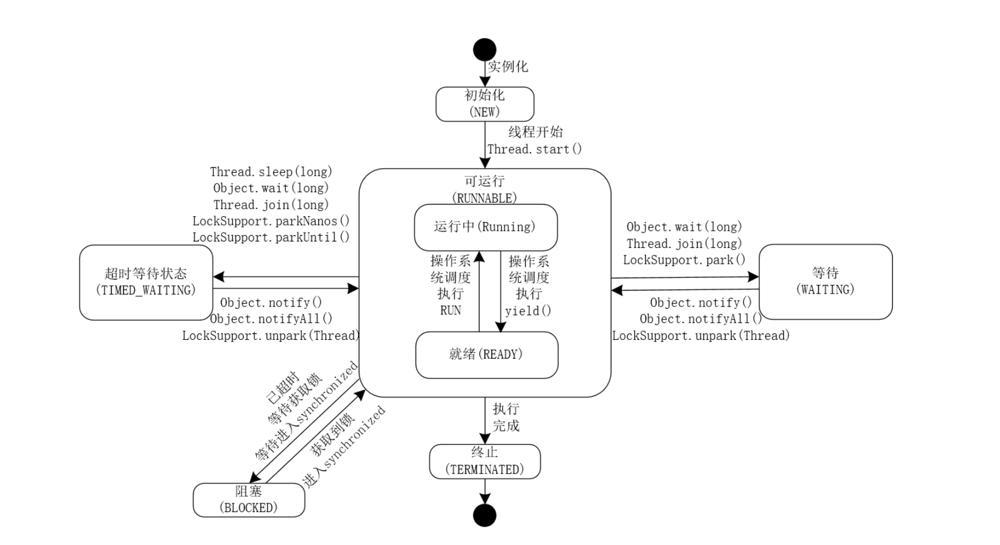

# Thread


## Create

*How to create a Thread instance?*

***Just new a Thread instance.***

### Thread

```JAVA
/**
 * Allocates a new Thread object.
 */
public Thread() {
    init(null, null, "Thread-" + nextThreadNum(), 0);
}

/**
 * Allocates a new Thread object with Runnable taarget.
 */
public Thread(Runnable target) {
    init(null, target, "Thread-" + nextThreadNum(), 0);
}
```


## Lifetime



### Status

A thread can be in one of the following states:

| Status       | Description                                                  |
| ------------ | ------------------------------------------------------------ |
| NEW          | A thread that has not yet started is in this state.          |
| RUNNABLE     | A thread executing in the Java virtual machine is in this state. |
| BLOCKED      | A thread that is blocked waiting for a monitor lock is in this state. |
| WATING       | A thread that is waiting indefinitely for another thread to perform a particular action is in this state. |
| TIME_WAITING | A thread that is waiting for another thread to perform an action for up to a specified waiting time is in this state. |
| TERMINATED   | A thread that has exited is in this state.                   |


```java
/**
 * Causes this thread to begin execution; the Java Virtual Machine
 * calls the <code>run</code> method of this thread.
 * <p>
 * The result is that two threads are running concurrently: the
 * current thread (which returns from the call to the
 * <code>start</code> method) and the other thread (which executes its
 * <code>run</code> method).
 * <p>
 * It is never legal to start a thread more than once.
 * In particular, a thread may not be restarted once it has completed
 * execution.
 */
public synchronized void start() {
    /**
     * This method is not invoked for the main method thread or "system"
     * group threads created/set up by the VM. Any new functionality added
     * to this method in the future may have to also be added to the VM.
     *
     * A zero status value corresponds to state "NEW".
     */
    if (threadStatus != 0)
        throw new IllegalThreadStateException();

    /* Notify the group that this thread is about to be started
     * so that it can be added to the group's list of threads
     * and the group's unstarted count can be decremented. */
    group.add(this);

    boolean started = false;
    try {
        start0();
        started = true;
    } finally {
        try {
            if (!started) {
                group.threadStartFailed(this);
            }
        } catch (Throwable ignore) {
            /* do nothing. If start0 threw a Throwable then
              it will be passed up the call stack */
        }
    }
}

private native void start0();
```


## Order

### join

Waits at most millis milliseconds for this thread to die. A timeout of 0 means to wait forever.
This implementation uses **a loop of this.wait** calls conditioned on this.isAlive. As a thread terminates the this.notifyAll method is invoked. It is recommended that applications not use wait, notify, or notifyAll on Thread instances.

```java
public final synchronized void join(long millis)
throws InterruptedException {
    long base = System.currentTimeMillis();
    long now = 0;

    if (millis < 0) {
        throw new IllegalArgumentException("timeout value is negative");
    }

    if (millis == 0) {
        while (isAlive()) {
            wait(0);
        }
    } else {
        while (isAlive()) {
            long delay = millis - now;
            if (delay <= 0) {
                break;
            }
            wait(delay);
            now = System.currentTimeMillis() - base;
        }
    }
}
```


notifyAll when JavaThread exit

```cpp
void JavaThread::exit(bool destroy_vm, ExitType exit_type) {
	//...
  ensure_join(this);
  //...
}
static void ensure_join(JavaThread* thread) {
    Handle threadObj(thread, thread->threadObj());

    ObjectLocker lock(threadObj, thread);

    thread->clear_pending_exception();

    java_lang_Thread::set_thread_status(threadObj(),        java_lang_Thread::TERMINATED);
    java_lang_Thread::set_thread(threadObj(), NULL);
    //notify_all
    lock.notify_all(thread);
    thread->clear_pending_exception();
}
```

## Interrupt

*Interrupts this thread.*
Unless the current thread is interrupting itself, which is always permitted, the checkAccess method of this thread is invoked, which may cause a SecurityException to be thrown.

1. If this thread is blocked in an invocation of the wait(), wait(long), or wait(long, int) methods of the Object class, or of the join(), join(long), join(long, int), sleep(long), or sleep(long, int), methods of this class, then its interrupt status will be cleared and it will receive an InterruptedException.

2. If this thread is blocked in an I/O operation upon an InterruptibleChannel then the channel will be closed, the thread's interrupt status will be set, and the thread will receive a java.nio.channels.ClosedByInterruptException.
   If this thread is blocked in a java.nio.channels.Selector then the thread's interrupt status will be set and it will return immediately from the selection operation, possibly with a non-zero value, just as if the selector's wakeup method were invoked.

3. If none of the previous conditions hold then this thread's interrupt status will be set.

4. Interrupting a thread that is not alive need not have any effect.

   

```java
/**
 * @spec JSR-51
 */
public void interrupt() {
    if (this != Thread.currentThread())
        checkAccess();

    synchronized (blockerLock) {
        Interruptible b = blocker;
        if (b != null) {
            interrupt0();           // Just to set the interrupt flag
            b.interrupt(this);
            return;
        }
    }
    interrupt0();
}

/**
 * Tests whether the current thread has been interrupted.  The
 * <i>interrupted status</i> of the thread is cleared by this method.  In
 * other words, if this method were to be called twice in succession, the
 * second call would return false (unless the current thread were
 * interrupted again, after the first call had cleared its interrupted
 * status and before the second call had examined it).
 *
 * <p>A thread interruption ignored because a thread was not alive
 * at the time of the interrupt will be reflected by this method
 * returning false.
 */
public static boolean interrupted() {
    return currentThread().isInterrupted(true);
}

/**
 * Tests whether this thread has been interrupted.  The <i>interrupted
 * status</i> of the thread is unaffected by this method.
 *
 * <p>A thread interruption ignored because a thread was not alive
 * at the time of the interrupt will be reflected by this method
 * returning false.
 */
public boolean isInterrupted() {
    return isInterrupted(false);
}

/**
 * Tests if some Thread has been interrupted.  The interrupted state
 * is reset or not based on the value of ClearInterrupted that is
 * passed.
 */
private native boolean isInterrupted(boolean ClearInterrupted);
```


## wait and notify

Provider-consumer 

Wait-notify只是一个condition queue 仅使用于单生产/消费模型

```java
/**
 * Wakes up a single thread that is waiting on this object's
 * monitor. If any threads are waiting on this object, one of them
 * is chosen to be awakened. The choice is arbitrary and occurs at
 * the discretion of the implementation. A thread waits on an object's
 * monitor by calling one of the {@code wait} methods.
 * <p>
 * The awakened thread will not be able to proceed until the current
 * thread relinquishes the lock on this object. The awakened thread will
 * compete in the usual manner with any other threads that might be
 * actively competing to synchronize on this object; for example, the
 * awakened thread enjoys no reliable privilege or disadvantage in being
 * the next thread to lock this object.
 * <p>
 * This method should only be called by a thread that is the owner
 * of this object's monitor. A thread becomes the owner of the
 * object's monitor in one of three ways:
 * <ul>
 * <li>By executing a synchronized instance method of that object.
 * <li>By executing the body of a {@code synchronized} statement
 *     that synchronizes on the object.
 * <li>For objects of type {@code Class,} by executing a
 *     synchronized static method of that class.
 * </ul>
 * <p>
 * Only one thread at a time can own an object's monitor.
 */
public final native void notify();

/**
 * Wakes up all threads that are waiting on this object's monitor. A
 * thread waits on an object's monitor by calling one of the
 * {@code wait} methods.
 * <p>
 * The awakened threads will not be able to proceed until the current
 * thread relinquishes the lock on this object. The awakened threads
 * will compete in the usual manner with any other threads that might
 * be actively competing to synchronize on this object; for example,
 * the awakened threads enjoy no reliable privilege or disadvantage in
 * being the next thread to lock this object.
 */
public final native void notifyAll();

/**
 * Causes the current thread to wait until either another thread invokes the
 * {@link java.lang.Object#notify()} method or the
 * {@link java.lang.Object#notifyAll()} method for this object, or a
 * specified amount of time has elapsed.
 * <p>
 * The current thread must own this object's monitor.
 * <p>
 * This method causes the current thread (call it <var>T</var>) to
 * place itself in the wait set for this object and then to relinquish
 * any and all synchronization claims on this object. Thread <var>T</var>
 * becomes disabled for thread scheduling purposes and lies dormant
 * until one of four things happens:
 * <ul>
 * <li>Some other thread invokes the {@code notify} method for this
 * object and thread <var>T</var> happens to be arbitrarily chosen as
 * the thread to be awakened.
 * <li>Some other thread invokes the {@code notifyAll} method for this
 * object.
 * <li>Some other thread {@linkplain Thread#interrupt() interrupts}
 * thread <var>T</var>.
 * <li>The specified amount of real time has elapsed, more or less.  If
 * {@code timeout} is zero, however, then real time is not taken into
 * consideration and the thread simply waits until notified.
 * </ul>
 * The thread <var>T</var> is then removed from the wait set for this
 * object and re-enabled for thread scheduling. It then competes in the
 * usual manner with other threads for the right to synchronize on the
 * object; once it has gained control of the object, all its
 * synchronization claims on the object are restored to the status quo
 * ante - that is, to the situation as of the time that the {@code wait}
 * method was invoked. Thread <var>T</var> then returns from the
 * invocation of the {@code wait} method. Thus, on return from the
 * {@code wait} method, the synchronization state of the object and of
 * thread {@code T} is exactly as it was when the {@code wait} method
 * was invoked.
 * <p>
 * A thread can also wake up without being notified, interrupted, or
 * timing out, a so-called <i>spurious wakeup</i>.  While this will rarely
 * occur in practice, applications must guard against it by testing for
 * the condition that should have caused the thread to be awakened, and
 * continuing to wait if the condition is not satisfied.  In other words,
 * waits should always occur in loops, like this one:
 * <pre>
 *     synchronized (obj) {
 *         while (&lt;condition does not hold&gt;)
 *             obj.wait(timeout);
 *         ... // Perform action appropriate to condition
 *     }
 * </pre>
 * (For more information on this topic, see Section 3.2.3 in Doug Lea's
 * "Concurrent Programming in Java (Second Edition)" (Addison-Wesley,
 * 2000), or Item 50 in Joshua Bloch's "Effective Java Programming
 * Language Guide" (Addison-Wesley, 2001).
 *
 * <p>If the current thread is {@linkplain java.lang.Thread#interrupt()
 * interrupted} by any thread before or while it is waiting, then an
 * {@code InterruptedException} is thrown.  This exception is not
 * thrown until the lock status of this object has been restored as
 * described above.
 *
 * <p>
 * Note that the {@code wait} method, as it places the current thread
 * into the wait set for this object, unlocks only this object; any
 * other objects on which the current thread may be synchronized remain
 * locked while the thread waits.
 */
public final native void wait(long timeout) throws InterruptedException;

/**
 * Causes the current thread to wait until another thread invokes the
 * {@link java.lang.Object#notify()} method or the
 * {@link java.lang.Object#notifyAll()} method for this object, or
 * some other thread interrupts the current thread, or a certain
 * amount of real time has elapsed.
 * <p>
 * This method is similar to the {@code wait} method of one
 * argument, but it allows finer control over the amount of time to
 * wait for a notification before giving up. The amount of real time,
 * measured in nanoseconds, is given by:
 * <blockquote>
 * <pre>
 * 1000000*timeout+nanos</pre></blockquote>
 * <p>
 * In all other respects, this method does the same thing as the
 * method {@link #wait(long)} of one argument. In particular,
 * {@code wait(0, 0)} means the same thing as {@code wait(0)}.
 * <p>
 * The current thread must own this object's monitor. The thread
 * releases ownership of this monitor and waits until either of the
 * following two conditions has occurred:
 * <ul>
 * <li>Another thread notifies threads waiting on this object's monitor
 *     to wake up either through a call to the {@code notify} method
 *     or the {@code notifyAll} method.
 * <li>The timeout period, specified by {@code timeout}
 *     milliseconds plus {@code nanos} nanoseconds arguments, has
 *     elapsed.
 * </ul>
 * <p>
 * The thread then waits until it can re-obtain ownership of the
 * monitor and resumes execution.
 * <p>
 * As in the one argument version, interrupts and spurious wakeups are
 * possible, and this method should always be used in a loop:
 * <pre>
 *     synchronized (obj) {
 *         while (&lt;condition does not hold&gt;)
 *             obj.wait(timeout, nanos);
 *         ... // Perform action appropriate to condition
 *     }
 */
public final void wait(long timeout, int nanos) throws InterruptedException {
    if (timeout < 0) {
        throw new IllegalArgumentException("timeout value is negative");
    }

    if (nanos < 0 || nanos > 999999) {
        throw new IllegalArgumentException(
                            "nanosecond timeout value out of range");
    }

    if (nanos > 0) {
        timeout++;
    }

    wait(timeout);
}

/**
 * Causes the current thread to wait until another thread invokes the
 * {@link java.lang.Object#notify()} method or the
 * {@link java.lang.Object#notifyAll()} method for this object.
 * In other words, this method behaves exactly as if it simply
 * performs the call {@code wait(0)}.
 * <p>
 * The current thread must own this object's monitor. The thread
 * releases ownership of this monitor and waits until another thread
 * notifies threads waiting on this object's monitor to wake up
 * either through a call to the {@code notify} method or the
 * {@code notifyAll} method. The thread then waits until it can
 * re-obtain ownership of the monitor and resumes execution.
 * <p>
 * As in the one argument version, interrupts and spurious wakeups are
 * possible, and this method should always be used in a loop:
 * <pre>
 *     synchronized (obj) {
 *         while (&lt;condition does not hold&gt;)
 *             obj.wait();
 *         ... // Perform action appropriate to condition
 *     }
 * </pre>
 * This method should only be called by a thread that is the owner
 * of this object's monitor. See the {@code notify} method for a
 * description of the ways in which a thread can become the owner of
 * a monitor.
 *
 * @throws  IllegalMonitorStateException  if the current thread is not
 *               the owner of the object's monitor.
 * @throws  InterruptedException if any thread interrupted the
 *             current thread before or while the current thread
 *             was waiting for a notification.  The <i>interrupted
 *             status</i> of the current thread is cleared when
 *             this exception is thrown.
 * @see        java.lang.Object#notify()
 * @see        java.lang.Object#notifyAll()
 */
public final void wait() throws InterruptedException {
    wait(0);
}
```


### Sleep

#### yield 跟 sleep 

1. yield 跟 sleep 都能暂停当前线程，都不会释放锁资源，sleep 可以指定具体休眠的时间，而 yield 则依赖 CPU 的时间片划分
2. sleep方法给其他线程运行机会时不考虑线程的优先级，因此会给低优先级的线程以运行的机会。yield方法只会给相同优先级或更高优先级的线程以运行的机会
3. 调用 sleep 方法使线程进入等待状态，等待休眠时间达到，而调用我们的 yield方法，线程会进入就绪状态，也就是sleep需要等待设置的时间后才会进行就绪状态，而yield会立即进入就绪状态
4. sleep方法声明会抛出 InterruptedException，而 yield 方法没有声明任何异常
5. yield 不能被中断，而 sleep 则可以接受中断。
6. sleep方法比yield方法具有更好的移植性(跟操作系统CPU调度相关)

#### wait 跟 sleep 

1. wait来自Object，sleep 来自 Thread
2. wait 释放锁，sleep 不释放
3. wait 必须在同步代码块中，sleep 可以任意使用
4. wait 不需要捕获异常，sleep 需捕获异常


## Lock

### Dead Lock


产生死锁必须满足四个条件：

1. 互斥条件：该资源任意⼀个时刻只由⼀个线程占⽤。
2. 请求与保持条件：⼀个进程因请求资源⽽阻塞时，对已获得的资源保持不放。
3. 不剥夺条件:线程已获得的资源在末使⽤完之前不能被其他线程强⾏剥夺，只有⾃⼰使⽤完毕后才释放资源。
4. 循环等待条件:若⼲进程之间形成⼀种头尾相接的循环等待资源关系。


### Live Lock


## JMM


## Start


```c++
void Thread::start(Thread* thread) {
  // Start is different from resume in that its safety is guaranteed by context or
  // being called from a Java method synchronized on the Thread object.
  if (!DisableStartThread) {
    if (thread->is_Java_thread()) {
      // Initialize the thread state to RUNNABLE before starting this thread.
      // Can not set it after the thread started because we do not know the
      // exact thread state at that time. It could be in MONITOR_WAIT or
      // in SLEEPING or some other state.
      java_lang_Thread::set_thread_status(((JavaThread*)thread)->threadObj(),
                                          java_lang_Thread::RUNNABLE);
    }
    os::start_thread(thread);
  }
}
```


```c++
// The INITIALIZED state is distinguished from the SUSPENDED state because the
// conditions in which a thread is first started are different from those in which
// a suspension is resumed.  These differences make it hard for us to apply the
// tougher checks when starting threads that we want to do when resuming them.
// However, when start_thread is called as a result of Thread.start, on a Java
// thread, the operation is synchronized on the Java Thread object.  So there
// cannot be a race to start the thread and hence for the thread to exit while
// we are working on it.  Non-Java threads that start Java threads either have
// to do so in a context in which races are impossible, or should do appropriate
// locking.

void os::start_thread(Thread* thread) {
  // guard suspend/resume
  MutexLockerEx ml(thread->SR_lock(), Mutex::_no_safepoint_check_flag);
  OSThread* osthread = thread->osthread();
  osthread->set_state(RUNNABLE);
  pd_start_thread(thread);
}
```