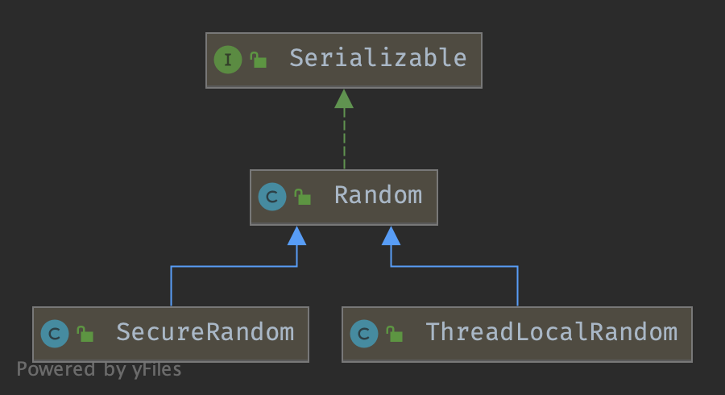

## Introduction

### Random Hierarchy



## Random

`java.util.Random`

此类的实例用于生成伪随机数流。该类使用**48 位种子**，通过线性同余公式进行修改。
如果**两个 Random 实例以相同的种子创建，并且对每个实例进行相同的方法调用序列，它们将生成并返回相同的数字序列**。

为了保证此属性，为 Random 类指定了特定的算法。Java 实现必须使用此处为 Random 类显示的所有算法，以保证 Java 代码的绝对可移植性。但是，Random 类的子类可以使用其他算法，只要它们遵守所有方法的通用契约即可。

Random 类实现的算法使用一个受保护的实用方法，每次调用可以提供**最多 32 个伪随机生成的位**。

许多应用程序将发现 `Math.random` 更易于使用。

`java.util.Random` 的实例是**线程安全**的。然而，**跨线程并发使用同一个 Random 实例可能会遇到争用和由此导致的性能不佳**。
在多线程设计中，请考虑使用 **java.util.concurrent.ThreadLocalRandom**。

java.util.Random 的实例**不是加密安全的**。
请考虑使用 **java.security.SecureRandom** 来为需要安全性的应用程序获得加密安全的伪随机数生成器。

```java
// ThreadLocalRandom usage
int randomNumber = ThreadLocalRandom.current().nextInt(1, 100);
```

ThreadLocalRandom 是 Random 的线程本地变体，通过在每线程基础上维护种子来减少争用。

## Links

- [JDK Concurrency](/docs/CS/Java/JDK/Concurrency/Concurrency.md)
