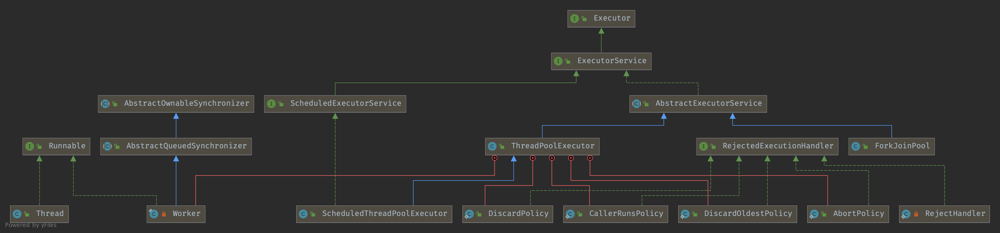

# ThreadPoolExecutor


线程过多会带来额外的开销，其中包括创建销毁线程的开销、调度线程的开销等等，同时也降低了计算机的整体性能。线程池维护多个线程，等待监督管理者分配可并发执行的任务。这种做法，一方面避免了处理任务时创建销毁线程开销的代价，另一方面避免了线程数量膨胀导致的过分调度问题，保证了对内核的充分利用


benefits：

- **降低资源消耗**：通过池化技术重复利用已创建的线程，降低线程创建和销毁造成的损耗。
- **提高响应速度**：任务到达时，无需等待线程创建即可立即执行。
- **提高线程的可管理性**：线程是稀缺资源，如果无限制创建，不仅会消耗系统资源，还会因为线程的不合理分布导致资源调度失衡，降低系统的稳定性。使用线程池可以进行统一的分配、调优和监控。
- **提供更多更强大的功能**：线程池具备可拓展性，允许开发人员向其中增加更多的功能。比如延时定时线程池ScheduledThreadPoolExecutor，就允许任务延期执行或定期执行。




### Executor

*An object that executes submitted **Runnable** tasks. This interface provides a way of decoupling task submission from the mechanics of how each task will be run, including details of thread use, scheduling, etc.*

```java
public interface Executor {
   /**
    * The command may execute in a new thread, in a pooled thread, or in the calling thread
    */
    void execute(Runnable command);
}
```


### ExecutorService

> An Executor that provides methods to **manage termination** and methods that can produce a Future for tracking progress of one or more **asynchronous tasks**.

```java
public interface ExecutorService extends Executor {

    void shutdown();

    List<Runnable> shutdownNow();

    boolean isShutdown();

    boolean isTerminated();

    boolean awaitTermination(long timeout, TimeUnit unit)
        throws InterruptedException;

    <T> Future<T> submit(Callable<T> task);

    <T> Future<T> submit(Runnable task, T result);

    Future<?> submit(Runnable task);

    <T> List<Future<T>> invokeAll(Collection<? extends Callable<T>> tasks)
        throws InterruptedException;

    <T> List<Future<T>> invokeAll(Collection<? extends Callable<T>> tasks,
                                  long timeout, TimeUnit unit)
        throws InterruptedException;

    <T> T invokeAny(Collection<? extends Callable<T>> tasks)
        throws InterruptedException, ExecutionException;

    <T> T invokeAny(Collection<? extends Callable<T>> tasks,
                    long timeout, TimeUnit unit)
        throws InterruptedException, ExecutionException, TimeoutException;
}
```


### AbstractExecutorService


Returns a RunnableFuture.

```java
protected <T> RunnableFuture<T> newTaskFor(Runnable runnable, T value) {
    return new FutureTask<T>(runnable, value);
}

protected <T> RunnableFuture<T> newTaskFor(Callable<T> callable) {
  	return new FutureTask<T>(callable);
}
```


#### doInvokeAny

```java
/**
 * the main mechanics of invokeAny.
 */
private <T> T doInvokeAny(Collection<? extends Callable<T>> tasks,
                          boolean timed, long nanos)
    throws InterruptedException, ExecutionException, TimeoutException {
    if (tasks == null)
        throw new NullPointerException();
    int ntasks = tasks.size();
    if (ntasks == 0)
        throw new IllegalArgumentException();
    ArrayList<Future<T>> futures = new ArrayList<Future<T>>(ntasks);
    /**
     *Creates an ExecutorCompletionService using the supplied executor for base task 
     *execution and a LinkedBlockingQueue as a completion queue.
     */
    ExecutorCompletionService<T> ecs =
        new ExecutorCompletionService<T>(this);

    // For efficiency, especially in executors with limited
    // parallelism, check to see if previously submitted tasks are
    // done before submitting more of them. This interleaving
    // plus the exception mechanics account for messiness of main
    // loop.

    try {
        // Record exceptions so that if we fail to obtain any
        // result, we can throw the last exception we got.
        ExecutionException ee = null;
        final long deadline = timed ? System.nanoTime() + nanos : 0L;
        Iterator<? extends Callable<T>> it = tasks.iterator();

        // Start one task for sure; the rest incrementally
        futures.add(ecs.submit(it.next()));
        --ntasks;
        int active = 1;

        for (;;) {
            Future<T> f = ecs.poll();
            if (f == null) {
                if (ntasks > 0) {
                    --ntasks;
                    futures.add(ecs.submit(it.next()));
                    ++active;
                }
                else if (active == 0)
                    break;
                else if (timed) {
                    f = ecs.poll(nanos, TimeUnit.NANOSECONDS);
                    if (f == null)
                        throw new TimeoutException();
                    nanos = deadline - System.nanoTime();
                }
                else
                    f = ecs.take();
            }
            if (f != null) {
                --active;
                try {
                    return f.get();
                } catch (ExecutionException eex) {
                    ee = eex;
                } catch (RuntimeException rex) {
                    ee = new ExecutionException(rex);
                }
            }
        }

        if (ee == null)
            ee = new ExecutionException();
        throw ee;

    } finally {
        for (int i = 0, size = futures.size(); i < size; i++)
            futures.get(i).cancel(true);
    }
}
```


### ScheduledExecutorService

> An ExecutorService that can **schedule** commands to run after a given delay, or to execute periodically.
> The schedule methods create tasks with various delays and return a task object that can be used to cancel or check execution. The **scheduleAtFixedRate** and **scheduleWithFixedDelay** methods create and execute tasks that run periodically until cancelled.

```java
public interface ScheduledExecutorService extends ExecutorService {

    public ScheduledFuture<?> schedule(Runnable command,
                                       long delay, TimeUnit unit);

    public <V> ScheduledFuture<V> schedule(Callable<V> callable,
                                           long delay, TimeUnit unit);

    public ScheduledFuture<?> scheduleAtFixedRate(Runnable command,
                                                  long initialDelay,
                                                  long period,
                                                  TimeUnit unit);

    public ScheduledFuture<?> scheduleWithFixedDelay(Runnable command,
                                                     long initialDelay,
                                                     long delay,
                                                     TimeUnit unit);
}
```


## ThreadPoolExecutor

1. 线程池如何维护自身状态。
4. 线程池如何管理任务。
5. 线程池如何管理线程。


#### ctl

The main pool control state, ctl, is an atomic integer packing two conceptual fields workerCount, indicating the effective number of threads runState, indicating whether running, shutting down etc In order to pack them into one int, we limit workerCount to (2^29)-1 (about 500 million) threads rather than (2^31)-1 (2 billion) otherwise representable. If this is ever an issue in the future, the variable can be changed to be an AtomicLong, and the shift/mask constants below adjusted. But until the need arises, this code is a bit faster and simpler using an int. 

The workerCount is the number of workers that have been permitted to start and not permitted to stop. The value may be transiently different from the actual number of live threads, for example when a ThreadFactory fails to create a thread when asked, and when exiting threads are still performing bookkeeping before terminating. The user-visible pool size is reported as the current size of the workers set. 

```java
private final AtomicInteger ctl = new AtomicInteger(ctlOf(RUNNING, 0));
private static final int COUNT_BITS = Integer.SIZE - 3;
private static final int COUNT_MASK = (1 << COUNT_BITS) - 1;

// Packing and unpacking ctl
private static int runStateOf(int c)     { return c & ~COUNT_MASK; }
private static int workerCountOf(int c)  { return c & COUNT_MASK; }
private static int ctlOf(int rs, int wc) { return rs | wc; }

/*
 * Bit field accessors that don't require unpacking ctl.
 * These depend on the bit layout and on workerCount being never negative.
 */
private static boolean runStateLessThan(int c, int s) {
    return c < s;
}

private static boolean runStateAtLeast(int c, int s) {
    return c >= s;
}

private static boolean isRunning(int c) {
    return c < SHUTDOWN;
}
```


### runState

The runState provides the main lifecycle control, taking on values: 

- RUNNING: Accept new tasks and process queued tasks 
- SHUTDOWN: Don't accept new tasks, but process queued tasks 
- STOP: Don't accept new tasks, don't process queued tasks, and interrupt in-progress tasks 
- TIDYING: All tasks have terminated, workerCount is zero, the thread transitioning to state TIDYING will run the terminated() hook method 
- TERMINATED: terminated() has completed The numerical order among these values matters, to allow ordered comparisons. The runState monotonically increases over time, but need not hit each state. 

The transitions are: RUNNING -> SHUTDOWN On invocation of shutdown(), perhaps implicitly in finalize() 

(RUNNING or SHUTDOWN) -> STOP On invocation of shutdownNow() SHUTDOWN -> TIDYING When both queue and pool are empty STOP -> TIDYING When pool is empty TIDYING -> TERMINATED 

When the terminated() hook method has completed Threads waiting in awaitTermination() will return when the state reaches TERMINATED. 

Detecting the transition from SHUTDOWN to TIDYING is less straightforward than you'd like because the queue may become empty after non-empty and vice versa during SHUTDOWN state, but we can only terminate if, after seeing that it is empty, we see that workerCount is 0 (which sometimes entails a recheck -- see below).

```java
// runState is stored in the high-order bits
private static final int RUNNING    = -1 << COUNT_BITS;
private static final int SHUTDOWN   =  0 << COUNT_BITS;
private static final int STOP       =  1 << COUNT_BITS;
private static final int TIDYING    =  2 << COUNT_BITS;
private static final int TERMINATED =  3 << COUNT_BITS;
```

Transfer of state:


#### create

Creates a new ThreadPoolExecutor with the given initial parameters:

1. corePoolSize – the number of threads to keep in the pool, even if they are idle, unless allowCoreThreadTimeOut is set

2. maximumPoolSize – the maximum number of threads to allow in the pool

3. keepAliveTime – when the number of threads is greater than the core, this is the maximum time that excess idle 

   threads will wait for new tasks before terminating.

4. unit – the time unit for the keepAliveTime argument

5. workQueue – the queue to use for holding tasks before they are executed. This queue will hold only the Runnable tasks submitted by the execute method.

6. threadFactory – the factory to use when the executor creates a new thread

7. handler – the handler to use when execution is blocked because the thread bounds and queue capacities are reached

```java
public ThreadPoolExecutor(int corePoolSize,
                          int maximumPoolSize,
                          long keepAliveTime,
                          TimeUnit unit,
                          BlockingQueue<Runnable> workQueue,
                          ThreadFactory threadFactory,
                          RejectedExecutionHandler handler) {
    if (corePoolSize < 0 || maximumPoolSize <= 0 || maximumPoolSize < corePoolSize ||
        keepAliveTime < 0)
        throw new IllegalArgumentException();
    if (workQueue == null || threadFactory == null || handler == null)
        throw new NullPointerException();
    this.acc = System.getSecurityManager() == null ? null : AccessController.getContext();
    this.corePoolSize = corePoolSize;
    this.maximumPoolSize = maximumPoolSize;
    this.workQueue = workQueue;
    this.keepAliveTime = unit.toNanos(keepAliveTime);
    this.threadFactory = threadFactory;
    this.handler = handler;
}
```


#### [BlockingQueue](/docs/CS/Java/JDK/Collection/Queue.md?id=BlockingQueue)

阻塞队列(BlockingQueue)是一个支持两个附加操作的队列。这两个附加的操作是：在队列为空时，获取元素的线程会等待队列变为非空。当队列满时，存储元素的线程会等待队列可用。阻塞队列常用于生产者和消费者的场景，生产者是往队列里添加元素的线程，消费者是从队列里拿元素的线程。阻塞队列就是生产者存放元素的容器，而消费者也只从容器里拿元素。

| Blocking Queue Name   | Description      |
| --------------------- | ---------------- |
| ArrayBlockingQueue    | array FIFO       |
| LinkedBlockingQueue   | linked tableFIFO |
| PriorityBlockingQueue |                  |
| DelayQueue            |                  |
| SynchronousQueue      |                  |
| LinkedTransferQueue   | transfer method  |
| LinkedBlockingDeque   | Deque            |


#### RejectedExecutionHandler

*RejectedExecution method that may be invoked by a ThreadPoolExecutor when execute cannot accept a task.This may occur when **no more threads or queue slots are available** because :*

- **their bounds would be exceeded**
- **upon shutdown of the Executor**


| RejectedExecutionHandler | Behavior                                                     |
| ------------------------ | ------------------------------------------------------------ |
| AbortPolicy              | Always throws RejectedExecutionException.                    |
| DiscardPolicy            | Does nothing, which has the effect of discarding task r.     |
| DiscardOldestPolicy      | Obtains and ignores the next task that the executor would otherwise execute, if one is immediately available, and then retries execution of task r, unless the executor is shut down, in which case task r is instead discarded. |
| CallerRunsPolicy         | Executes task r in the caller's thread, unless the executor has been shut down, in which case the task is discarded. |


#### execute

```java
/**
 * Executes the given task sometime in the future.  The task
 * may execute in a new thread or in an existing pooled thread.
 *
 * If the task cannot be submitted for execution, either because this
 * executor has been shutdown or because its capacity has been reached,
 * the task is handled by the current {@code RejectedExecutionHandler}.
 */
public void execute(Runnable command) {
    if (command == null)
        throw new NullPointerException();
    
    int c = ctl.get();
    if (workerCountOf(c) < corePoolSize) {
        if (addWorker(command, true))
            return;
        c = ctl.get();
    }
   
    if (isRunning(c) && workQueue.offer(command)) {
        int recheck = ctl.get();
        if (! isRunning(recheck) && remove(command))
            reject(command);
        else if (workerCountOf(recheck) == 0)
            addWorker(null, false);
    }
   
    else if (!addWorker(command, false))
        reject(command);
}
```


 *Proceed in 3 steps:*

1. *If fewer than corePoolSize threads are running, try to start a new thread with the given command as its first task.  The call to **addWorker atomically checks runState and workerCount**, and so prevents false alarms that would add threads when it shouldn't, by returning false.*
2. *If a task can be successfully queued, then we still **need to double-check whether we should have added a thread (because existing ones died since last checking) or that the pool shut down** since entry into this method. So we recheck state and if necessary roll back the enqueuing if stopped, or start a new thread if there are none.*
3. *If we cannot queue task, then we try to add a new thread.  If it fails, we know we are shut down or saturated and so reject the task.*


#### addWorker

```java
/**
 * Checks if a new worker can be added with respect to current
 * pool state and the given bound (either core or maximum). If so,
 * the worker count is adjusted accordingly, and, if possible, a
 * new worker is created and started, running firstTask as its
 * first task. This method returns false if the pool is stopped or
 * eligible to shut down. It also returns false if the thread
 * factory fails to create a thread when asked.  If the thread
 * creation fails, either due to the thread factory returning
 * null, or due to an exception (typically OutOfMemoryError in
 * Thread.start()), we roll back cleanly.
 *
 * @param firstTask the task the new thread should run first (or
 * null if none). Workers are created with an initial first task
 * (in method execute()) to bypass queuing when there are fewer
 * than corePoolSize threads (in which case we always start one),
 * or when the queue is full (in which case we must bypass queue).
 * Initially idle threads are usually created via
 * prestartCoreThread or to replace other dying workers.
 */
private boolean addWorker(Runnable firstTask, boolean core) {
    retry:
    for (;;) {
        int c = ctl.get();
        int rs = runStateOf(c);

        // Check if queue empty only if necessary.
        if (rs >= SHUTDOWN &&
            ! (rs == SHUTDOWN &&
               firstTask == null &&
               ! workQueue.isEmpty()))
            return false;

        for (;;) {
            int wc = workerCountOf(c);
            if (wc >= CAPACITY ||
                wc >= (core ? corePoolSize : maximumPoolSize))
                return false;
            if (compareAndIncrementWorkerCount(c))
                break retry;
            c = ctl.get();  // Re-read ctl
            if (runStateOf(c) != rs)
                continue retry;
            // else CAS failed due to workerCount change; retry inner loop
        }
    }

    boolean workerStarted = false;
    boolean workerAdded = false;
    Worker w = null;
    try {
        w = new Worker(firstTask);
        final Thread t = w.thread;
        if (t != null) {
            final ReentrantLock mainLock = this.mainLock;
            mainLock.lock();
            try {
                // Recheck while holding lock.
                // Back out on ThreadFactory failure or if
                // shut down before lock acquired.
                int rs = runStateOf(ctl.get());

                if (rs < SHUTDOWN ||
                    (rs == SHUTDOWN && firstTask == null)) {
                    if (t.isAlive()) // precheck that t is startable
                        throw new IllegalThreadStateException();
                    workers.add(w);
                    int s = workers.size();
                    if (s > largestPoolSize)
                        largestPoolSize = s;
                    workerAdded = true;
                }
            } finally {
                mainLock.unlock();
            }
            if (workerAdded) {
                t.start();
                workerStarted = true;
            }
        }
    } finally {
        if (! workerStarted)
            addWorkerFailed(w);
    }
    return workerStarted;
}

/**
 * Rolls back the worker thread creation.
 * - removes worker from workers, if present
 * - decrements worker count
 * - rechecks for termination, in case the existence of this
 *   worker was holding up termination
 */
private void addWorkerFailed(Worker w) {
    final ReentrantLock mainLock = this.mainLock;
    mainLock.lock();
    try {
        if (w != null)
            workers.remove(w);
        decrementWorkerCount();
        tryTerminate();
    } finally {
        mainLock.unlock();
    }
}
```


#### Worker 

Class Worker mainly maintains interrupt control state for threads running tasks, along with other minor bookkeeping. This class opportunistically extends **AbstractQueuedSynchronizer** to simplify acquiring and releasing a lock surrounding each task execution. This protects against interrupts that are intended to wake up a worker thread waiting for a task from instead interrupting a task being run. We implement a simple non-reentrant mutual exclusion lock rather than use ReentrantLock because we do not want worker tasks to be able to reacquire the lock when they invoke pool control methods like setCorePoolSize. Additionally, to suppress interrupts until the thread actually starts running tasks, we initialize lock state to a negative value, and clear it upon start (in runWorker).


constructor

```java
/**
 * Creates with given first task and thread from ThreadFactory.
 * @param firstTask the first task (null if none)
 */
Worker(Runnable firstTask) {
    setState(-1); // inhibit interrupts until runWorker
    this.firstTask = firstTask;
    this.thread = getThreadFactory().newThread(this);
}
```

fields in Worker

```java
/** Thread this worker is running in.  Null if factory fails. */
final Thread thread;
/** Initial task to run.  Possibly null. */
Runnable firstTask;
/** Per-thread task counter */
volatile long completedTasks;
```

methods in Worker

```java
// The value 0 represents the unlocked state.
// The value 1 represents the locked state.
protected boolean isHeldExclusively() {
    return getState() != 0;
}

protected boolean tryAcquire(int unused) {
    if (compareAndSetState(0, 1)) {
        setExclusiveOwnerThread(Thread.currentThread());
        return true;
    }
    return false;
}

protected boolean tryRelease(int unused) {
    setExclusiveOwnerThread(null);
    setState(0);
    return true;
}

 void interruptIfStarted() {
        Thread t;
        if (getState() >= 0 && (t = thread) != null && !t.isInterrupted()) {
            try {
                t.interrupt();
            } catch (SecurityException ignore) {
            }
        }
    }
}
```

线程池需要管理线程的生命周期，需要在线程长时间不运行的时候进行回收。线程池使用一张Hash表去持有线程的引用，这样可以通过添加引用、移除引用这样的操作来控制线程的生命周期。这个时候重要的就是如何判断线程是否在运行。

Worker是通过继承AQS，使用AQS来实现独占锁这个功能。没有使用可重入锁ReentrantLock，而是使用AQS，为的就是实现不可重入的特性去反应线程现在的执行状态。

- lock方法一旦获取了独占锁，表示当前线程正在执行任务中
- 如果正在执行任务，则不应该中断线程
- 如果该线程现在不是独占锁的状态，也就是空闲的状态，说明它没有在处理任务，这时可以对该线程进行中断
- 线程池在执行shutdown方法或tryTerminate方法时会调用interruptIdleWorkers方法来中断空闲的线程，interruptIdleWorkers方法会使用tryLock方法来判断线程池中的线程是否是空闲状态；如果线程是空闲状态则可以安全回收
- 之所以设置为不可重入，是因为我们不希望任务在调用像setCorePoolSize这样的线程池控制方法时重新获取锁。如果使用ReentrantLock，它是可重入的，这样如果在任务中调用了如setCorePoolSize这类线程池控制的方法，会中断正在运行的线程。


Override run

```java
/** Delegates main run loop to outer runWorker  */
public void run() {
    runWorker(this);
}
```


#### runWorker


*Main worker run loop. **Repeatedly gets tasks from queue and executes them, while coping with a number of issues**:* 

1. *We may start out with an initial task, in which case we don't need to get the first one. Otherwise, as long as pool is running, we get tasks from getTask. If it returns null then the worker exits due to changed pool state or configuration parameters. Other exits result from exception throws in external code, in which case completedAbruptly holds, which usually leads processWorkerExit to replace this thread.* 
2. *Before running any task, the lock is acquired to prevent other pool interrupts while the task is executing, and then we ensure that unless pool is stopping, this thread does not have its interrupt set.* 
3. *Each task run is preceded by a call to beforeExecute, which might throw an exception, in which case we cause thread to die (breaking loop with completedAbruptly true) without processing the task.* 
4. *Assuming beforeExecute completes normally, we run the task, gathering any of its thrown exceptions to send to afterExecute. We separately handle RuntimeException, Error (both of which the specs guarantee that we trap) and arbitrary Throwables. Because we cannot rethrow Throwables within Runnable.run, we wrap them within Errors on the way out (to the thread's UncaughtExceptionHandler). Any thrown exception also conservatively causes thread to die.* 
5. *After task.run completes, we call afterExecute, which may also throw an exception, which will also cause thread to die. According to JLS Sec 14.20, this exception is the one that will be in effect even if task.run throws. The net effect of the exception mechanics is that afterExecute and the thread's UncaughtExceptionHandler have as accurate information as we can provide about any problems encountered by user code.*

```java
final void runWorker(Worker w) {
    Thread wt = Thread.currentThread();
    Runnable task = w.firstTask;
    w.firstTask = null;
    w.unlock(); // allow interrupts
    boolean completedAbruptly = true;
    try {
        while (task != null || (task = getTask()) != null) {
            w.lock();
            // If pool is stopping, ensure thread is interrupted;
            // if not, ensure thread is not interrupted.  This
            // requires a recheck in second case to deal with
            // shutdownNow race while clearing interrupt
            if ((runStateAtLeast(ctl.get(), STOP) ||
                 (Thread.interrupted() &&
                  runStateAtLeast(ctl.get(), STOP))) &&
                !wt.isInterrupted())
                wt.interrupt();
            try {
                beforeExecute(wt, task);
                Throwable thrown = null;
                try {
                    task.run();
                } catch (RuntimeException x) {
                    thrown = x; throw x;
                } catch (Error x) {
                    thrown = x; throw x;
                } catch (Throwable x) {
                    thrown = x; throw new Error(x);
                } finally {
                    afterExecute(task, thrown);
                }
            } finally {
                task = null;
                w.completedTasks++;
                w.unlock();
            }
        }
        completedAbruptly = false;
    } finally {
        processWorkerExit(w, completedAbruptly);
    }
}
```

#### getTask


Performs blocking or timed wait for a task, depending on current configuration settings, or returns null if this worker must exit because of any of: 

1. There are more than maximumPoolSize workers (due to a call to setMaximumPoolSize). 
2. The pool is stopped. 
3. The pool is shutdown and the queue is empty. 
4. This worker timed out waiting for a task, and timed-out workers are subject to termination (that is, allowCoreThreadTimeOut || workerCount > corePoolSize) both before and after the timed wait, and if the queue is non-empty, this worker is not the last thread in the pool.

```java
private Runnable getTask() {
    boolean timedOut = false; // Did the last poll() time out?

    for (;;) {
        int c = ctl.get();
        int rs = runStateOf(c);

        // Check if queue empty only if necessary.
        if (rs >= SHUTDOWN && (rs >= STOP || workQueue.isEmpty())) {
            decrementWorkerCount();
            return null;
        }

        int wc = workerCountOf(c);

        // Are workers subject to culling?
        boolean timed = allowCoreThreadTimeOut || wc > corePoolSize;

        if ((wc > maximumPoolSize || (timed && timedOut))
            && (wc > 1 || workQueue.isEmpty())) {
            if (compareAndDecrementWorkerCount(c))
                return null;
            continue;
        }

        try {
          // if > corePoolSize, use poll will out of loop and terminate 
            Runnable r = timed ?
                workQueue.poll(keepAliveTime, TimeUnit.NANOSECONDS) :
                workQueue.take();
            if (r != null)
                return r;
            timedOut = true;
        } catch (InterruptedException retry) {
            timedOut = false;
        }
    }
}
```


#### processWorkerExit

*Performs cleanup and bookkeeping for a dying worker. Called only from worker threads. Unless completedAbruptly is set, assumes that workerCount has already been adjusted to account for exit. This method removes thread from worker set, and possibly terminates the pool or replaces the worker if either it exited due to user task exception or if fewer than corePoolSize workers are running or queue is non-empty but there are no workers.*

```java
private void processWorkerExit(Worker w, boolean completedAbruptly) {
    if (completedAbruptly) // If abrupt, then workerCount wasn't adjusted
        decrementWorkerCount();

    final ReentrantLock mainLock = this.mainLock;
    mainLock.lock();
    try {
        completedTaskCount += w.completedTasks;
        workers.remove(w);
    } finally {
        mainLock.unlock();
    }

    tryTerminate();

    int c = ctl.get();
    if (runStateLessThan(c, STOP)) {
        if (!completedAbruptly) {
            int min = allowCoreThreadTimeOut ? 0 : corePoolSize;
            if (min == 0 && ! workQueue.isEmpty())
                min = 1;
            if (workerCountOf(c) >= min)
                return; // replacement not needed
        }
        addWorker(null, false);
    }
}
```


#### tryTerminate

```java
/**
 * Transitions to TERMINATED state if either (SHUTDOWN and pool
 * and queue empty) or (STOP and pool empty).  If otherwise
 * eligible to terminate but workerCount is nonzero, interrupts an
 * idle worker to ensure that shutdown signals propagate. This
 * method must be called following any action that might make
 * termination possible -- reducing worker count or removing tasks
 * from the queue during shutdown. The method is non-private to
 * allow access from ScheduledThreadPoolExecutor.
 */
final void tryTerminate() {
    for (;;) {
        int c = ctl.get();
        if (isRunning(c) ||
            runStateAtLeast(c, TIDYING) ||
            (runStateOf(c) == SHUTDOWN && ! workQueue.isEmpty()))
            return;
        if (workerCountOf(c) != 0) { // Eligible to terminate
            interruptIdleWorkers(ONLY_ONE);
            return;
        }

        final ReentrantLock mainLock = this.mainLock;
        mainLock.lock();
        try {
            if (ctl.compareAndSet(c, ctlOf(TIDYING, 0))) {
                try {
                    terminated();
                } finally {
                    ctl.set(ctlOf(TERMINATED, 0));
                    termination.signalAll();
                }
                return;
            }
        } finally {
            mainLock.unlock();
        }
        // else retry on failed CAS
    }
}
```


#### shutdown

- 在getTask方法中，如果这时线程池的状态是SHUTDOWN并且workQueue为空，那么就应该返回null来结束这个工作线程，而使线程池进入SHUTDOWN状态需要调用shutdown方法；
- shutdown方法会调用interruptIdleWorkers来中断空闲的线程，interruptIdleWorkers持有mainLock，会遍历workers来逐个判断工作线程是否空闲。但getTask方法中没有mainLock；
- 在getTask中，如果判断当前线程池状态是RUNNING，并且阻塞队列为空，那么会调用`workQueue.take()`进行阻塞；
- 如果在判断当前线程池状态是RUNNING后，这时调用了shutdown方法把状态改为了SHUTDOWN，这时如果不进行中断，那么当前的工作线程在调用了`workQueue.take()`后会一直阻塞而不会被销毁，因为在SHUTDOWN状态下不允许再有新的任务添加到workQueue中，这样一来线程池永远都关闭不了了；
- 由上可知，shutdown方法与getTask方法（从队列中获取任务时）存在竞态条件；

```java
/**
 * Initiates an orderly shutdown in which previously submitted
 * tasks are executed, but no new tasks will be accepted.
 * Invocation has no additional effect if already shut down.
 *
 * <p>This method does not wait for previously submitted tasks to
 * complete execution.  Use {@link #awaitTermination awaitTermination}
 * to do that.
 *
 * @throws SecurityException {@inheritDoc}
 */
public void shutdown() {
    final ReentrantLock mainLock = this.mainLock;
    mainLock.lock();
    try {
        checkShutdownAccess();
        advanceRunState(SHUTDOWN);
        interruptIdleWorkers();
        onShutdown(); // hook for ScheduledThreadPoolExecutor
    } finally {
        mainLock.unlock();
    }
    tryTerminate();
}
```


#### shutdownNow

```java
/**
 * Attempts to stop all actively executing tasks, halts the
 * processing of waiting tasks, and returns a list of the tasks
 * that were awaiting execution. These tasks are drained (removed)
 * from the task queue upon return from this method.
 *
 * <p>This method does not wait for actively executing tasks to
 * terminate.  Use {@link #awaitTermination awaitTermination} to
 * do that.
 *
 * <p>There are no guarantees beyond best-effort attempts to stop
 * processing actively executing tasks.  This implementation
 * cancels tasks via {@link Thread#interrupt}, so any task that
 * fails to respond to interrupts may never terminate.
 *
 * @throws SecurityException {@inheritDoc}
 */
public List<Runnable> shutdownNow() {
    List<Runnable> tasks;
    final ReentrantLock mainLock = this.mainLock;
    mainLock.lock();
    try {
        checkShutdownAccess();
        advanceRunState(STOP);
        interruptWorkers();
        tasks = drainQueue();
    } finally {
        mainLock.unlock();
    }
    tryTerminate();
    return tasks;
}

/**
 * Interrupts all threads, even if active. Ignores SecurityExceptions
 * (in which case some threads may remain uninterrupted).
 */
private void interruptWorkers() {
    final ReentrantLock mainLock = this.mainLock;
    mainLock.lock();
    try {
        for (Worker w : workers)
            w.interruptIfStarted();
    } finally {
        mainLock.unlock();
    }
}

void interruptIfStarted() {
    Thread t;
    if (getState() >= 0 && (t = thread) != null && !t.isInterrupted()) {
        try {
            t.interrupt();
        } catch (SecurityException ignore) {
        }
    }
}
```

场景分析

响应时间快 消耗时间短时可调高线程数 还可以使用同步队列

响应要求不高 时使用缓冲有界队列 不推荐使用无界队列


动态化线程池

线程池的配置没有标准公式化的答案

实时设置与监控


Submit  task

- execute
- submit

shutdown

- shutdown
- shutdownNow


getState

- getTaskCount
- getCompletedTaskCount
- getCorePoolSize
- getPoolSize
- getActiveCount


## Executors


```java
/**
 * Creates a thread pool that maintains enough threads to support
 * the given parallelism level, and may use multiple queues to
 * reduce contention. The parallelism level corresponds to the
 * maximum number of threads actively engaged in, or available to
 * engage in, task processing. The actual number of threads may
 * grow and shrink dynamically. A work-stealing pool makes no
 * guarantees about the order in which submitted tasks are
 * executed.
 */
public static ExecutorService newWorkStealingPool(int parallelism) {
    return new ForkJoinPool
        (parallelism,
         ForkJoinPool.defaultForkJoinWorkerThreadFactory,
         null, true);
}

/**
 * Creates a work-stealing thread pool using all
 * {@link Runtime#availableProcessors available processors}
 * as its target parallelism level.
 */
public static ExecutorService newWorkStealingPool() {
    return new ForkJoinPool
        (Runtime.getRuntime().availableProcessors(),
         ForkJoinPool.defaultForkJoinWorkerThreadFactory,
         null, true);
}

/**
 * Creates a thread pool that reuses a fixed number of threads
 * operating off a shared unbounded queue, using the provided
 * ThreadFactory to create new threads when needed.  At any point,
 * at most {@code nThreads} threads will be active processing
 * tasks.  If additional tasks are submitted when all threads are
 * active, they will wait in the queue until a thread is
 * available.  If any thread terminates due to a failure during
 * execution prior to shutdown, a new one will take its place if
 * needed to execute subsequent tasks.  The threads in the pool will
 * exist until it is explicitly {@link ExecutorService#shutdown
 * shutdown}.
 */
public static ExecutorService newFixedThreadPool(int nThreads, ThreadFactory threadFactory) {
    return new ThreadPoolExecutor(nThreads, nThreads,
                                  0L, TimeUnit.MILLISECONDS,
                                  new LinkedBlockingQueue<Runnable>(),
                                  threadFactory);
}
```


```java
/**
 * Creates a thread pool that creates new threads as needed, but
 * will reuse previously constructed threads when they are
 * available, and uses the provided
 * ThreadFactory to create new threads when needed.
 */
public static ExecutorService newCachedThreadPool(ThreadFactory threadFactory) {
    return new ThreadPoolExecutor(0, Integer.MAX_VALUE,
                                  60L, TimeUnit.SECONDS,
                                  new SynchronousQueue<Runnable>(),
                                  threadFactory);
}
```


```java
/**
 * Creates an Executor that uses a single worker thread operating
 * off an unbounded queue, and uses the provided ThreadFactory to
 * create a new thread when needed. Unlike the otherwise
 * equivalent {@code newFixedThreadPool(1, threadFactory)} the
 * returned executor is guaranteed not to be reconfigurable to use
 * additional threads.
 */
public static ExecutorService newSingleThreadExecutor(ThreadFactory threadFactory) {
    return new FinalizableDelegatedExecutorService
        (new ThreadPoolExecutor(1, 1,
                                0L, TimeUnit.MILLISECONDS,
                                new LinkedBlockingQueue<Runnable>(),
                                threadFactory));
}


```


```java
/**
 * Creates a thread pool that can schedule commands to run after a
 * given delay, or to execute periodically.
 * @param corePoolSize the number of threads to keep in the pool,
 * even if they are idle
 */
public static ScheduledExecutorService newScheduledThreadPool(
        int corePoolSize, ThreadFactory threadFactory) {
    return new ScheduledThreadPoolExecutor(corePoolSize, threadFactory);
}
```


## 参考资料

- [1] JDK 1.8源码
- [2] [深入理解Java线程池：ThreadPoolExecutor](http://www.ideabuffer.cn/2017/04/04/深入理解Java线程池：ThreadPoolExecutor/)
- [3] [Java线程池实现原理及其在美团业务中的实践](https://tech.meituan.com/2020/04/02/java-pooling-pratice-in-meituan.html)