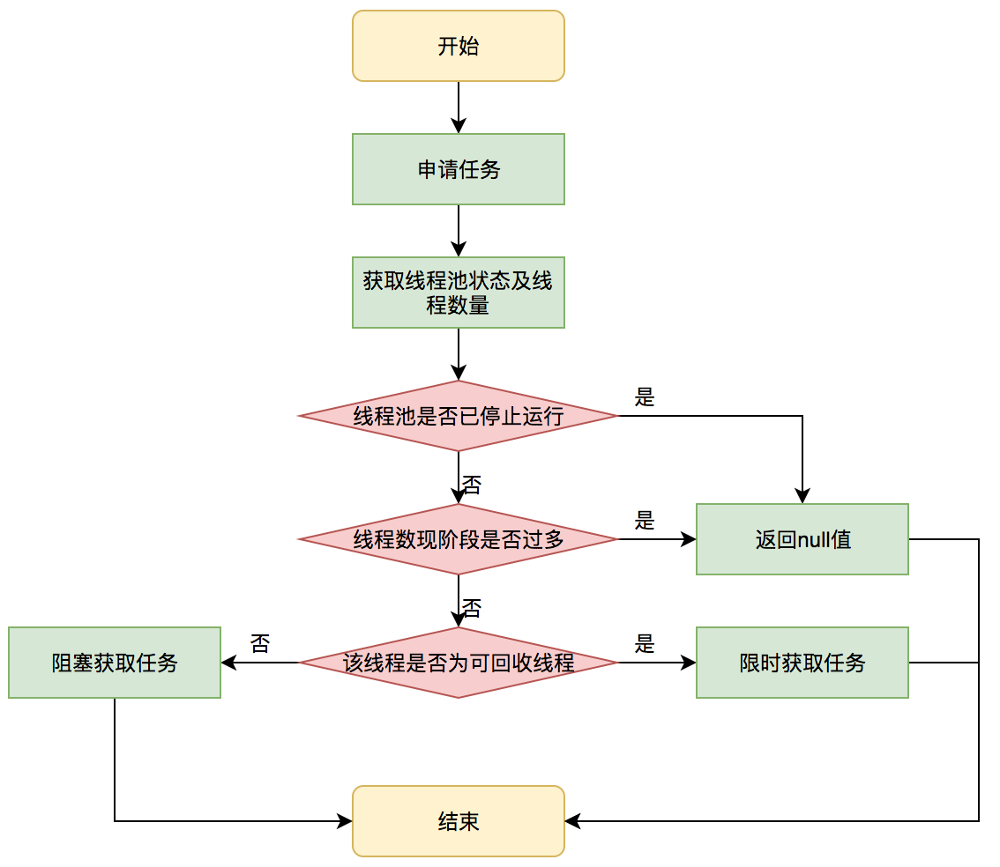

## Introduction

Executor is a simple standardized interface for defining custom thread-like subsystems, including thread pools, asynchronous I/O, and lightweight task frameworks.
Depending on which concrete Executor class is being used, tasks may execute in a newly created thread, an existing task-execution thread, or the thread calling execute, and may execute sequentially or concurrently.

ExecutorService provides a more complete asynchronous task execution framework. An ExecutorService manages queuing and scheduling of tasks, and allows controlled shutdown.
The ScheduledExecutorService subinterface and associated interfaces add support for delayed and periodic task execution.
ExecutorServices provide methods arranging asynchronous execution of any function expressed as Callable, the result-bearing analog of Runnable.
A Future returns the results of a function, allows determination of whether execution has completed, and provides a means to cancel execution.
A RunnableFuture is a Future that possesses a run method that upon execution, sets its results.

### Implementation

Classes ThreadPoolExecutor and ScheduledThreadPoolExecutor provide tunable, flexible thread pools.
The Executors class provides factory methods for the most common kinds and configurations of Executors, as well as a few utility methods for using them.
Other utilities based on Executors include the concrete class FutureTask providing a common extensible implementation of Futures, and ExecutorCompletionService,
that assists in coordinating the processing of groups of asynchronous tasks.
Class ForkJoinPool provides an Executor primarily designed for processing instances of ForkJoinTask and its subclasses.
These classes employ a work-stealing scheduler that attains high throughput for tasks conforming to restrictions that often hold in computation-intensive parallel processing.

### Disadvantages of Unbounded Thread Creation

- Thread lifecycle overhead
  Thread creation and teardown are not free. The actual overhead varies across platforms, but
  thread creation takes time, introducing latency into request processing, and requires some processing activity by the
  JVM and OS.
- Resource consumption
  Active threads consume system resources, especially memory. When there are more runnable
  threads than available processors, threads sit idle.
- Stability
  There is a limit on how many threads can be created.


## Executor

Thread pools offer the same benefit for thread management, and `java.util.concurrent` provides a flexible thread pool implementation as part of the Executor framework. 
The primary abstraction for task execution in the Java class libraries is not Thread, but `Executor`.
This interface provides a way of decoupling task submission from the mechanics of how each task will be run, including details of thread use, scheduling, etc.
```java
public interface Executor {
   //The command may execute in a new thread, in a pooled thread, or in the calling thread
    void execute(Runnable command);
}
```


### ExecutorService

An Executor that provides methods to **manage termination** and methods that can produce a Future for tracking progress of one or more **asynchronous tasks**.

We could get different ExecutorService from [Executors](/docs/CS/Java/JDK/Concurrency/ThreadPoolExecutor.md?id=executors).

```java
public interface ExecutorService extends Executor {

    void shutdown();

    List<Runnable> shutdownNow();

    boolean isShutdown();

    boolean isTerminated();

    boolean awaitTermination(long timeout, TimeUnit unit)
        throws InterruptedException;

    <T> Future<T> submit(Callable<T> task);

    <T> Future<T> submit(Runnable task, T result);

    Future<?> submit(Runnable task);

    <T> List<Future<T>> invokeAll(Collection<? extends Callable<T>> tasks)
        throws InterruptedException;

    <T> List<Future<T>> invokeAll(Collection<? extends Callable<T>> tasks,
                                  long timeout, TimeUnit unit)
        throws InterruptedException;

    <T> T invokeAny(Collection<? extends Callable<T>> tasks)
        throws InterruptedException, ExecutionException;

    <T> T invokeAny(Collection<? extends Callable<T>> tasks,
                    long timeout, TimeUnit unit)
        throws InterruptedException, ExecutionException, TimeoutException;
}
```

### AbstractExecutorService


Wrap and execute [FutureTask](/docs/CS/Java/JDK/Concurrency/Future.md?id=futuretask) .

```
public <T> Future<T> submit(Runnable task, T result) {
    if (task == null) throw new NullPointerException();
    RunnableFuture<T> ftask = newTaskFor(task, result);
    execute(ftask);
    return ftask;
}

protected <T> RunnableFuture<T> newTaskFor(Runnable runnable, T value) {
    return new FutureTask<T>(runnable, value);
}

protected <T> RunnableFuture<T> newTaskFor(Callable<T> callable) {
  	return new FutureTask<T>(callable);
}
```

#### Implementation

cancelAll
```
private static <T> void cancelAll(ArrayList<Future<T>> futures) {
        cancelAll(futures, 0);
    }

private static <T> void cancelAll(ArrayList<Future<T>> futures, int j) {
    for (int size = futures.size(); j < size; j++)
        futures.get(j).cancel(true);
}
```
<!-- tabs:start -->

##### **invokeAll**

Executes the given tasks, returning a list of Futures holding their status and results when all complete.
`Future.isDone` is true for each element of the returned list.

**Note that a completed task could have terminated either normally or by throwing an exception.**
The results of this method are undefined if the given collection is modified while this operation is in progress.

> [DiscardPolicy may block invokeAll forever](https://bugs.openjdk.org/browse/JDK-8286463)

If execute(f) normally, thread waiting at `Future.get()` until it returns or throws Exception.(DiscardPolicy-like is panic)

```java
public abstract class AbstractExecutorService implements ExecutorService {
    public <T> List<Future<T>> invokeAll(Collection<? extends Callable<T>> tasks) throws InterruptedException {
        if (tasks == null)
            throw new NullPointerException();
        ArrayList<Future<T>> futures = new ArrayList<>(tasks.size());
        try {
            for (Callable<T> t : tasks) {
                RunnableFuture<T> f = newTaskFor(t);
                futures.add(f);
                execute(f);
            }
            for (int i = 0, size = futures.size(); i < size; i++) {
                Future<T> f = futures.get(i);
                if (!f.isDone()) {
                    try {
                        f.get();
                    } catch (CancellationException | ExecutionException ignore) {
                    }
                }
            }
            return futures;
        } catch (Throwable t) {
            cancelAll(futures);
            throw t;
        }
    }
}
```


##### **invokeAny**

```java
public abstract class AbstractExecutorService implements ExecutorService {
    public <T> T invokeAny(Collection<? extends Callable<T>> tasks)
            throws InterruptedException, ExecutionException {
        try {
            return doInvokeAny(tasks, false, 0);
        } catch (TimeoutException cannotHappen) {
            assert false;
            return null;
        }
    }

    // the main mechanics of invokeAny.
    private <T> T doInvokeAny(Collection<? extends Callable<T>> tasks,
                              boolean timed, long nanos)
            throws InterruptedException, ExecutionException, TimeoutException {
        if (tasks == null)
            throw new NullPointerException();
        int ntasks = tasks.size();
        if (ntasks == 0)
            throw new IllegalArgumentException();
        ArrayList<Future<T>> futures = new ArrayList<Future<T>>(ntasks);
        /**
         *Creates an ExecutorCompletionService using the supplied executor for base task 
         *execution and a LinkedBlockingQueue as a completion queue.
         */
        ExecutorCompletionService<T> ecs =
                new ExecutorCompletionService<T>(this);

        // For efficiency, especially in executors with limited
        // parallelism, check to see if previously submitted tasks are
        // done before submitting more of them. This interleaving
        // plus the exception mechanics account for messiness of main
        // loop.

        try {
            // Record exceptions so that if we fail to obtain any
            // result, we can throw the last exception we got.
            ExecutionException ee = null;
            final long deadline = timed ? System.nanoTime() + nanos : 0L;
            Iterator<? extends Callable<T>> it = tasks.iterator();

            // Start one task for sure; the rest incrementally
            futures.add(ecs.submit(it.next()));
            --ntasks;
            int active = 1;

            for (; ; ) {
                Future<T> f = ecs.poll();
                if (f == null) {
                    if (ntasks > 0) {
                        --ntasks;
                        futures.add(ecs.submit(it.next()));
                        ++active;
                    } else if (active == 0)
                        break;
                    else if (timed) {
                        f = ecs.poll(nanos, TimeUnit.NANOSECONDS);
                        if (f == null)
                            throw new TimeoutException();
                        nanos = deadline - System.nanoTime();
                    } else
                        f = ecs.take();
                }
                if (f != null) {
                    --active;
                    try {
                        return f.get();
                    } catch (ExecutionException eex) {
                        ee = eex;
                    } catch (RuntimeException rex) {
                        ee = new ExecutionException(rex);
                    }
                }
            }

            if (ee == null)
                ee = new ExecutionException();
            throw ee;

        } finally {
            for (int i = 0, size = futures.size(); i < size; i++)
                futures.get(i).cancel(true);
        }
    }
}
```

<!-- tabs:end -->

### ScheduledExecutorService

An ExecutorService that can **schedule** commands to run after a given delay, or to execute periodically.
The schedule methods create tasks with various delays and return a task object that can be used to cancel or check execution.
The **scheduleAtFixedRate** and **scheduleWithFixedDelay** methods create and execute tasks that run periodically until cancelled.

```java
public interface ScheduledExecutorService extends ExecutorService {

    public ScheduledFuture<?> schedule(Runnable command, long delay, TimeUnit unit);

    public <V> ScheduledFuture<V> schedule(Callable<V> callable, long delay, TimeUnit unit);
}
```

Submits a periodic action that becomes enabled first after the given initial delay, and subsequently with the given delay between the termination of one execution and the commencement of the next.

- The sequence of task executions continues indefinitely until one of the following exceptional completions occur:
- The task is explicitly cancelled via the returned future.
- The executor terminates, also resulting in task cancellation.
  An execution of the task throws an exception. In this case calling get on the returned future will throw ExecutionException, holding the exception as its cause.

Subsequent executions are suppressed. Subsequent calls to isDone() on the returned future will return true.

```
    public ScheduledFuture<?> scheduleWithFixedDelay(Runnable command, long initialDelay, long delay, TimeUnit unit);
```

Submits a periodic action that becomes enabled first after the given initial delay, and subsequently with the given period; that is, executions will commence after initialDelay, then initialDelay + period, then initialDelay + 2 * period, and so on.
**If any execution of this task takes longer than its period, then subsequent executions may start late, but will not concurrently execute.**

```
public ScheduledFuture<?> scheduleAtFixedRate(Runnable command, long initialDelay, long period, TimeUnit unit);
```

## CompletionService

A service that decouples the production of new asynchronous tasks from the consumption of the results of completed tasks. Producers submit tasks for execution. Consumers take completed tasks and process their results in the order they complete. A CompletionService can for example be used to manage asynchronous I/O, in which tasks that perform reads are submitted in one part of a program or system, and then acted upon in a different part of the program when the reads complete, possibly in a different order than they were requested.
Typically, a CompletionService relies on a separate Executor to actually execute the tasks, in which case the CompletionService only manages an internal completion queue. The ExecutorCompletionService class provides an implementation of this approach.

**Memory consistency effects:** Actions in a thread prior to submitting a task to a CompletionService happen-before actions taken by that task, which in turn happen-before actions following a successful return from the corresponding take().

## ThreadPoolExecutor

An ExecutorService that executes each submitted task using one of possibly several pooled threads, normally  configured using Executors factory methods.

A thread pool, as its name suggests, manages a homogeneous pool of worker threads. A thread pool is tightly bound to a work queue holding tasks waiting to be executed.
Worker threads have a simple life: request the next task from the work queue, execute it, and go back to waiting for another task

Thread pools address two different problems:

1. they usually provide improved performance when executing large numbers of asynchronous tasks, due to reduced per-task invocation overhead
2. and they provide a means of bounding and managing the resources, including threads, consumed when executing a collection of tasks.
   Each ThreadPoolExecutor also maintains some basic statistics, such as the number of completed tasks.

To be useful across a wide range of contexts, this class provides many adjustable parameters and extensibility hooks.
However, programmers are urged to use the more convenient Executors factory methods Executors.newCachedThreadPool (unbounded thread pool, with automatic thread reclamation), Executors.newFixedThreadPool (fixed size thread pool) and Executors.newSingleThreadExecutor (single background thread), that preconfigure settings for the most common usage scenarios.
Otherwise, use the following guide when manually configuring and tuning this class:

### Core and maximum pool sizes

A ThreadPoolExecutor will automatically adjust the pool size (see getPoolSize) according to the bounds set by corePoolSize (see getCorePoolSize) and maximumPoolSize (see getMaximumPoolSize).
When a new task is submitted in method execute(Runnable), if fewer than corePoolSize threads are running, a new thread is created to handle the request, even if other worker threads are idle.
Else if fewer than maximumPoolSize threads are running, a new thread will be created to handle the request only if the queue is full.
By setting corePoolSize and maximumPoolSize the same, you create a fixed-size thread pool.
By setting maximumPoolSize to an essentially unbounded value such as Integer.MAX_VALUE, you allow the pool to accommodate an arbitrary number of concurrent tasks.
Most typically, core and maximum pool sizes are set only upon construction, but they may also be changed dynamically using setCorePoolSize and setMaximumPoolSize.

#### setCorePoolSize

Sets the core number of threads. This overrides any value set in the constructor.

- If the new value is smaller than the current value, excess existing threads will be terminated when they next become idle.
- If larger, new threads will, if needed, be started to execute any queued tasks.

#### setMaximumPoolSize

Sets the maximum allowed number of threads. This overrides any value set in the constructor.
If the new value is smaller than the current value, excess existing threads will be terminated when they next become idle.

- [Hystrix](/docs/CS/Java/Spring_Cloud/Hystrix.md?id=HystrixThreadPool)

#### prestartCoreThread

By default, **even core threads are initially created and started only when new tasks arrive**, but this can be overridden dynamically using method prestartCoreThread or prestartAllCoreThreads.
You probably want to prestart threads if you construct the pool with a non-empty queue.

- [Tomcat](/docs/CS/Java/Tomcat/threads.md?id=StandardThreadExecutor)
- [Dubbo]()

#### allowsCoreThreadTimeOut

Returns true if this pool allows core threads to time out and terminate if no tasks arrive within the keepAlive time, being replaced if needed when new tasks arrive.

- When true, the same keep-alive policy applying to non-core threads applies also to core threads.
- When false (the default), core threads are never terminated due to lack of incoming tasks.

### ThreadFactory

New threads are created using a `ThreadFactory`.
If not otherwise specified, a `Executors.defaultThreadFactory` is used, that creates threads to all be in the **same ThreadGroup** and with the **same NORM_PRIORITY priority** and **non-daemon status**.

By supplying a different ThreadFactory, you can alter the thread's name, thread group, priority, daemon status, etc.
If a ThreadFactory fails to create a thread when asked by returning null from newThread, the executor will continue, but might not be able to execute any tasks.
Threads should possess the "modifyThread" RuntimePermission.
If worker threads or other threads using the pool do not possess this permission, service may be degraded: configuration changes may not take effect in a timely manner, and a shutdown pool may remain in a state in which termination is possible but not completed.

```java
// Executors
private static class DefaultThreadFactory implements ThreadFactory {
    private static final AtomicInteger poolNumber = new AtomicInteger(1);
    private final ThreadGroup group;
    private final AtomicInteger threadNumber = new AtomicInteger(1);
    private final String namePrefix;

    DefaultThreadFactory() {
        SecurityManager s = System.getSecurityManager();
        group = (s != null) ? s.getThreadGroup() :
                              Thread.currentThread().getThreadGroup();
        namePrefix = "pool-" +
                      poolNumber.getAndIncrement() +
                     "-thread-";
    }

    public Thread newThread(Runnable r) {
        Thread t = new Thread(group, r,
                              namePrefix + threadNumber.getAndIncrement(),
                              0);
        if (t.isDaemon())
            t.setDaemon(false); // always be non-daemon
        if (t.getPriority() != Thread.NORM_PRIORITY)
            t.setPriority(Thread.NORM_PRIORITY);
        return t;
    }
}
```

### Keep-alive times

If the pool currently has more than corePoolSize threads, excess threads will be terminated if they have been idle for more than the keepAliveTime (see getKeepAliveTime(TimeUnit)).

This provides a means of reducing resource consumption when the pool is not being actively used. If the pool becomes more active later, new threads will be constructed.

This parameter can also be changed dynamically using method `setKeepAliveTime(long, TimeUnit)`.
Using a value of Long.MAX_VALUE TimeUnit.NANOSECONDS effectively disables idle threads from ever terminating prior to shut down.
By default, the keep-alive policy applies only when there are more than corePoolSize threads, but method `allowCoreThreadTimeOut(boolean)` can be used to apply this time-out policy to core threads as well, so long as the keepAliveTime value is non-zero.

### ctl

The main pool control state, ctl, is an atomic integer packing two conceptual fields workerCount, indicating the effective number of threads runState, indicating whether running, shutting down etc In order to pack them into one int, we limit workerCount to **(2^29)-1** (about 500 million) threads rather than (2^31)-1 (2 billion) otherwise representable. If this is ever an issue in the future, the variable can be changed to be an AtomicLong, and the shift/mask constants below adjusted. But until the need arises, this code is a bit faster and simpler using an int.

The workerCount is the number of workers that have been permitted to start and not permitted to stop. The value may be transiently different from the actual number of live threads, for example when a ThreadFactory fails to create a thread when asked, and when exiting threads are still performing bookkeeping before terminating. The user-visible pool size is reported as the current size of the workers set.

```
private final AtomicInteger ctl = new AtomicInteger(ctlOf(RUNNING, 0));
private static final int COUNT_BITS = Integer.SIZE - 3;
private static final int COUNT_MASK = (1 << COUNT_BITS) - 1;

// Packing and unpacking ctl
private static int runStateOf(int c)     { return c & ~COUNT_MASK; }
private static int workerCountOf(int c)  { return c & COUNT_MASK; }
private static int ctlOf(int rs, int wc) { return rs | wc; }

/*
 * Bit field accessors that don't require unpacking ctl.
 * These depend on the bit layout and on workerCount being never negative.
 */
private static boolean runStateLessThan(int c, int s) {
    return c < s;
}

private static boolean runStateAtLeast(int c, int s) {
    return c >= s;
}

private static boolean isRunning(int c) {
    return c < SHUTDOWN;
}
```

### runState

The runState provides the main lifecycle control, taking on values:

- RUNNING: Accept new tasks and process queued tasks
- SHUTDOWN: Don't accept new tasks, but process queued tasks
- STOP: Don't accept new tasks, don't process queued tasks, and interrupt in-progress tasks
- TIDYING: All tasks have terminated, workerCount is zero, the thread transitioning to state TIDYING will run the terminated() hook method
- TERMINATED: terminated() has completed The numerical order among these values matters, to allow ordered comparisons. The runState monotonically increases over time, but need not hit each state.

The transitions are: RUNNING -> SHUTDOWN On invocation of shutdown(), perhaps implicitly in finalize()

(RUNNING or SHUTDOWN) -> STOP On invocation of shutdownNow() SHUTDOWN -> TIDYING When both queue and pool are empty STOP -> TIDYING When pool is empty TIDYING -> TERMINATED

When the terminated() hook method has completed Threads waiting in awaitTermination() will return when the state reaches TERMINATED.

Detecting the transition from SHUTDOWN to TIDYING is less straightforward than you'd like because the queue may become empty after non-empty and vice versa during SHUTDOWN state, but we can only terminate if, after seeing that it is empty, we see that workerCount is 0 (which sometimes entails a recheck -- see below).

```java
// runState is stored in the high-order bits
private static final int RUNNING    = -1 << COUNT_BITS;
private static final int SHUTDOWN   =  0 << COUNT_BITS;
private static final int STOP       =  1 << COUNT_BITS;
private static final int TIDYING    =  2 << COUNT_BITS;
private static final int TERMINATED =  3 << COUNT_BITS;
```

Transfer of state:


### create ThreadPoolExecutor

Creates a new ThreadPoolExecutor with the given initial parameters:

1. corePoolSize – the number of threads to keep in the pool, even if they are idle, unless allowCoreThreadTimeOut is set
2. maximumPoolSize – the maximum number of threads to allow in the pool
3. keepAliveTime – when the number of threads is greater than the core, this is the maximum time that excess idle

   threads will wait for new tasks before terminating.
4. unit – the time unit for the keepAliveTime argument
5. workQueue – the queue to use for holding tasks before they are executed. This queue will hold only the Runnable tasks submitted by the execute method.
6. threadFactory – the factory to use when the executor creates a new thread
7. handler – the handler to use when execution is blocked because the thread bounds and queue capacities are reached

```java
public ThreadPoolExecutor(int corePoolSize,
                          int maximumPoolSize,
                          long keepAliveTime,
                          TimeUnit unit,
                          BlockingQueue<Runnable> workQueue,
                          ThreadFactory threadFactory,
                          RejectedExecutionHandler handler) {
    if (corePoolSize < 0 || maximumPoolSize <= 0 || maximumPoolSize < corePoolSize ||
        keepAliveTime < 0)
        throw new IllegalArgumentException();
    if (workQueue == null || threadFactory == null || handler == null)
        throw new NullPointerException();
    this.acc = System.getSecurityManager() == null ? null : AccessController.getContext();
    this.corePoolSize = corePoolSize;
    this.maximumPoolSize = maximumPoolSize;
    this.workQueue = workQueue;
    this.keepAliveTime = unit.toNanos(keepAliveTime);
    this.threadFactory = threadFactory;
    this.handler = handler;
}
```

### BlockingQueue

Any [BlockingQueue](/docs/CS/Java/JDK/Collection/Queue.md?id=BlockingQueue) may be used to transfer and hold submitted tasks. The use of this queue interacts with pool sizing:

- If fewer than corePoolSize threads are running, the Executor always prefers adding a new thread rather than queuing.
- If corePoolSize or more threads are running, the Executor always prefers queuing a request rather than adding a new thread.
- If a request cannot be queued, a new thread is created unless this would exceed maximumPoolSize, in which case, the task will be rejected.

There are three general strategies for queuing:

1. Direct handoffs. A good default choice for a work queue is a `SynchronousQueue` that hands off tasks to threads without otherwise holding them. Here, an attempt to queue a task will fail if no threads are immediately available to run it, so a new thread will be constructed. This policy avoids lockups when handling sets of requests that might have internal dependencies. Direct handoffs generally **require unbounded maximumPoolSizes** to avoid rejection of new submitted tasks. This in turn admits the possibility of unbounded thread growth when commands continue to arrive on average faster than they can be processed.
2. Unbounded queues. Using an unbounded queue (for example a `LinkedBlockingQueue` without a predefined capacity) will cause new tasks to wait in the queue when all corePoolSize threads are busy. Thus, no more than corePoolSize threads will ever be created. (And the value of **the maximumPoolSize therefore doesn't have any effect**.) This may be appropriate when each task is completely independent of others, so tasks cannot affect each others execution; for example, in a web page server. While this style of queuing can be useful in smoothing out transient bursts of requests, it admits the possibility of unbounded work queue growth when commands continue to arrive on average faster than they can be processed.
3. Bounded queues. A bounded queue (for example, an `ArrayBlockingQueue`) helps prevent resource exhaustion when used with finite maximumPoolSizes, but can be more difficult to tune and control. Queue sizes and maximum pool sizes may be traded off for each other: Using large queues and small pools minimizes CPU usage, OS resources, and context-switching overhead, but can lead to artificially low throughput. If tasks frequently block (for example if they are I/O bound), a system may be able to schedule time for more threads than you otherwise allow. Use of small queues generally requires larger pool sizes, which keeps CPUs busier but may encounter unacceptable scheduling overhead, which also decreases throughput.

### Rejected tasks

```java
// ThreadPoolExecutor
final void reject(Runnable command) {
    handler.rejectedExecution(command, this);
}
```

RejectedExecution method that may be invoked by a ThreadPoolExecutor when execute cannot accept a task.This may occur when **no more threads or queue slots are available** because :

- **their bounds would be exceeded**
- **upon shutdown of the Executor**

In either case, the execute method invokes the `RejectedExecutionHandler.rejectedExecution(Runnable, ThreadPoolExecutor)` method of its RejectedExecutionHandler. Four predefined handler policies are provided:

1. In the **default** `ThreadPoolExecutor.AbortPolicy`, the handler throws a runtime RejectedExecutionException upon rejection.

2. In `ThreadPoolExecutor.CallerRunsPolicy`, the thread that invokes execute itself runs the task. This provides a simple feedback control mechanism that will slow down the rate that new tasks are submitted.

3. In `ThreadPoolExecutor.DiscardPolicy`, a task that cannot be executed is simply dropped. 

   This policy is designed only for those rare cases in which task completion is never relied upon.

4. In `ThreadPoolExecutor.DiscardOldestPolicy`, if the executor is not shut down, the task at the head of the work queue is dropped, and then execution is retried (which can fail again, causing this to be repeated.)
   This policy is rarely acceptable.  In nearly all cases, you should also cancel the task to cause an exception in any component waiting for its completion, and/or log the failure.

It is possible to define and use other kinds of RejectedExecutionHandler classes. Doing so requires some care  especially when policies are designed to work only under particular capacity or queuing policies.

### execute

Executes the given task sometime in the future. The task may execute in a new thread or in an existing pooled thread.

If the task cannot be submitted for execution,

1. either because this executor **has been shutdown**
2. or because its **capacity has been reached**, the task is handled by the current `RejectedExecutionHandler`.

```java
public void execute(Runnable command) {
    if (command == null)
        throw new NullPointerException();
  
    int c = ctl.get();
    if (workerCountOf(c) < corePoolSize) { // addWaiter if less than corePoolSize
        if (addWorker(command, true))
            return;
        c = ctl.get();
    }
   
    if (isRunning(c) && workQueue.offer(command)) { // offer queue if isRunning
        int recheck = ctl.get();
        if (! isRunning(recheck) && remove(command))
            reject(command);
        else if (workerCountOf(recheck) == 0) // avoid !queue.isEmpty() but no Worker
            addWorker(null, false); 
    }
   
    else if (!addWorker(command, false))
        reject(command);
}
```

Proceed in 3 steps:

1. If fewer than corePoolSize threads are running, try to start a new thread with the given command as its first task.
   The call to **addWorker atomically checks runState and workerCount**, and so prevents false alarms that would add threads when it shouldn't, by returning false.
2. If a task can be successfully queued, then we still **need to double-check whether we should have added a thread (because existing ones died since last checking) or that the pool shut down** since entry into this method.
   So we recheck state and if necessary roll back the enqueuing if stopped, or start a new thread if there are none.
3. If we cannot queue task, then we try to add a new thread.  If it fails, we know we are shut down or saturated and so reject the task.

**Consider schedule threads in OS and GC cost**.

priority of I/O threads higher than business threads

### addWorker

Checks if a new worker can be added with respect to current pool state and the given bound (either core or maximum). If so, the worker count is adjusted accordingly, and, if possible, a new worker is created and started, running firstTask as its first task.

This method returns false:

1. if the pool is stopped or eligible to shut down.
2. if the thread factory fails to create a thread when asked.

If the thread creation fails, either due to the thread factory returning null, or due to an exception (typically OutOfMemoryError in Thread.start()), we roll back cleanly.

```java
public class ThreadPoolExecutor extends AbstractExecutorService {
    /**
     * Set containing all worker threads in pool. Accessed only when
     * holding mainLock.
     */
    private final HashSet<Worker> workers = new HashSet<Worker>();


    private boolean addWorker(Runnable firstTask, boolean core) {
        retry:
        for (; ; ) {
            int c = ctl.get();
            int rs = runStateOf(c);

            // Check if queue empty only if necessary.
            // when SHUTDOWN and firstTask == null and  !queue.isEmpty(), allow to addWorker
            if (rs >= SHUTDOWN &&
                    !(rs == SHUTDOWN &&
                            firstTask == null &&
                            !workQueue.isEmpty()))
                return false;

            for (; ; ) {
                int wc = workerCountOf(c);
                if (wc >= CAPACITY ||
                        wc >= (core ? corePoolSize : maximumPoolSize))
                    return false;
                if (compareAndIncrementWorkerCount(c))
                    break retry;
                c = ctl.get();  // Re-read ctl
                if (runStateOf(c) != rs)
                    continue retry;
                // else CAS failed due to workerCount change; retry inner loop
            }
        }

        boolean workerStarted = false;
        boolean workerAdded = false;
        Worker w = null;
        try {
            w = new Worker(firstTask);
            final Thread t = w.thread;
            if (t != null) {
                final ReentrantLock mainLock = this.mainLock; // need a mainLock
                mainLock.lock();
                try {
                    // Recheck while holding lock.
                    // Back out on ThreadFactory failure or if
                    // shut down before lock acquired.
                    int rs = runStateOf(ctl.get());

                    if (rs < SHUTDOWN ||
                            (rs == SHUTDOWN && firstTask == null)) {
                        if (t.isAlive()) // precheck that t is startable
                            throw new IllegalThreadStateException();
                        workers.add(w);
                        int s = workers.size();
                        if (s > largestPoolSize)
                            largestPoolSize = s;
                        workerAdded = true;
                    }
                } finally {
                    mainLock.unlock();
                }
                if (workerAdded) {
                    t.start();
                    workerStarted = true;
                }
            }
        } finally {
            if (!workerStarted)
                addWorkerFailed(w);
        }
        return workerStarted;
    }

    /**
     * Rolls back the worker thread creation.
     * - removes worker from workers, if present
     * - decrements worker count
     * - rechecks for termination, in case the existence of this
     *   worker was holding up termination
     */
    private void addWorkerFailed(Worker w) {
        final ReentrantLock mainLock = this.mainLock;
        mainLock.lock();
        try {
            if (w != null)
                workers.remove(w);
            decrementWorkerCount();
            tryTerminate();
        } finally {
            mainLock.unlock();
        }
    }
}
```


#### Worker

Class Worker mainly maintains interrupt control state for threads running tasks, along with other minor bookkeeping.
This class opportunistically extends **AbstractQueuedSynchronizer** to simplify acquiring and releasing a lock surrounding each task execution.
This protects against interrupts that are intended to wake up a worker thread waiting for a task from instead interrupting a task being run.
We implement a simple non-reentrant mutual exclusion lock rather than use ReentrantLock because we do not want worker tasks to be able to reacquire the lock when they invoke pool control methods like setCorePoolSize.

*Additionally, to suppress interrupts until the thread actually starts running tasks, we **initialize lock state to a negative value**, and **clear it upon start (in runWorker)**.*

```java
// Creates with given first task and thread from ThreadFactory.
Worker(Runnable firstTask) {
    setState(-1); // inhibit interrupts until runWorker
    this.firstTask = firstTask;
    this.thread = getThreadFactory().newThread(this);
}

/** Thread this worker is running in.  Null if factory fails. */
final Thread thread;
/** Initial task to run.  Possibly null. */
Runnable firstTask;
/** Per-thread task counter */
volatile long completedTasks;

// The value 0 represents the unlocked state.
// The value 1 represents the locked state.
protected boolean isHeldExclusively() {
    return getState() != 0;
}

protected boolean tryAcquire(int unused) {
    if (compareAndSetState(0, 1)) {
        setExclusiveOwnerThread(Thread.currentThread());
        return true;
    }
    return false;
}

protected boolean tryRelease(int unused) {
    setExclusiveOwnerThread(null);
    setState(0);
    return true;
}
```

only call by `shutdownNow()`

```java
void interruptIfStarted() {
    Thread t;
    if (getState() >= 0 && (t = thread) != null && !t.isInterrupted()) {
        try {
            t.interrupt();
        } catch (SecurityException ignore) {
        }
    }
}
```

Delegates main run loop to outer runWorker

```java
public void run() {
    runWorker(this);
}
```

#### runWorker

*Main worker run loop. **Repeatedly gets tasks from queue and executes them, while coping with a number of issues**:*

1. *We may start out with an initial task, in which case we don't need to get the first one. Otherwise, as long as pool is running, we get tasks from getTask. If it returns null then the worker exits due to changed pool state or configuration parameters. Other exits result from exception throws in external code, in which case completedAbruptly holds, which usually leads processWorkerExit to replace this thread.*
2. *Before running any task, the lock is acquired to prevent other pool interrupts while the task is executing, and then we ensure that unless pool is stopping, this thread does not have its interrupt set.*
3. *Each task run is preceded by a call to beforeExecute, which might throw an exception, in which case we cause thread to die (breaking loop with completedAbruptly true) without processing the task.*
4. *Assuming beforeExecute completes normally, we run the task, gathering any of its thrown exceptions to send to afterExecute. We separately handle RuntimeException, Error (both of which the specs guarantee that we trap) and arbitrary Throwables. Because we cannot rethrow Throwables within Runnable.run, we wrap them within Errors on the way out (to the thread's UncaughtExceptionHandler). Any thrown exception also conservatively causes thread to die.*
5. *After task.run completes, we call afterExecute, which may also throw an exception, which will also cause thread to die. According to JLS Sec 14.20, this exception is the one that will be in effect even if task.run throws. The net effect of the exception mechanics is that afterExecute and the thread's UncaughtExceptionHandler have as accurate information as we can provide about any problems encountered by user code.*

```java
final void runWorker(Worker w) {
    Thread wt = Thread.currentThread();
    Runnable task = w.firstTask;
    w.firstTask = null;
    w.unlock(); // allow interrupts
    boolean completedAbruptly = true;
    try {
        while (task != null || (task = getTask()) != null) {
            w.lock();
            // If pool is stopping, ensure thread is interrupted;
            // if not, ensure thread is not interrupted.  This
            // requires a recheck in second case to deal with
            // shutdownNow race while clearing interrupt
            if ((runStateAtLeast(ctl.get(), STOP) ||
                 (Thread.interrupted() &&
                  runStateAtLeast(ctl.get(), STOP))) &&
                !wt.isInterrupted())
                wt.interrupt();
            try {
                beforeExecute(wt, task);
                Throwable thrown = null;
                try {
                    task.run();
                } catch (RuntimeException x) {
                    thrown = x; throw x;
                } catch (Error x) {
                    thrown = x; throw x;
                } catch (Throwable x) {
                    thrown = x; throw new Error(x);
                } finally {
                    afterExecute(task, thrown);
                }
            } finally {
                task = null;
                w.completedTasks++;
                w.unlock();
            }
        }
        completedAbruptly = false;
    } finally {
        processWorkerExit(w, completedAbruptly);
    }
}
```

#### getTask

Performs blocking or timed wait for a task, depending on current configuration settings, or **returns null if this worker must exit because of any of**:

1. There are more than maximumPoolSize workers (due to a call to setMaximumPoolSize).
2. The pool is stopped.
3. The pool is shutdown and the queue is empty.
4. This worker timed out waiting for a task, and timed-out workers are subject to termination (that is, allowCoreThreadTimeOut || workerCount > corePoolSize) both before and after the timed wait, and if the queue is non-empty, this worker is not the last thread in the pool.

```java
private Runnable getTask() {
    boolean timedOut = false; // Did the last poll() time out?

    for (;;) {
        int c = ctl.get();
        int rs = runStateOf(c);

        // Check if queue empty only if necessary.
        if (rs >= SHUTDOWN && (rs >= STOP || workQueue.isEmpty())) {
            decrementWorkerCount();
            return null;
        }

        int wc = workerCountOf(c);

        // Are workers subject to culling?
        boolean timed = allowCoreThreadTimeOut || wc > corePoolSize;

        if ((wc > maximumPoolSize || (timed && timedOut))
            && (wc > 1 || workQueue.isEmpty())) {
            if (compareAndDecrementWorkerCount(c))
                return null;
            continue;
        }

        try {
          // if > corePoolSize, use poll will out of loop and terminate 
            Runnable r = timed ?
                workQueue.poll(keepAliveTime, TimeUnit.NANOSECONDS) :
                workQueue.take();
            if (r != null)
                return r;
            timedOut = true;
        } catch (InterruptedException retry) {
            timedOut = false;
        }
    }
}
```



#### processWorkerExit

*Performs cleanup and bookkeeping for a dying worker. Called only from worker threads. Unless completedAbruptly is set, assumes that workerCount has already been adjusted to account for exit. This method removes thread from worker set, and possibly terminates the pool or replaces the worker if either it exited due to user task exception or if fewer than corePoolSize workers are running or queue is non-empty but there are no workers.*

```java
private void processWorkerExit(Worker w, boolean completedAbruptly) {
    if (completedAbruptly) // If abrupt, then workerCount wasn't adjusted
        decrementWorkerCount();

    final ReentrantLock mainLock = this.mainLock;
    mainLock.lock();
    try {
        completedTaskCount += w.completedTasks;
        workers.remove(w);
    } finally {
        mainLock.unlock();
    }

    tryTerminate();

    int c = ctl.get();
    if (runStateLessThan(c, STOP)) {
        if (!completedAbruptly) {
            int min = allowCoreThreadTimeOut ? 0 : corePoolSize;
            if (min == 0 && ! workQueue.isEmpty())
                min = 1;
            if (workerCountOf(c) >= min)
                return; // replacement not needed
        }
        addWorker(null, false);
    }
}
```

#### tryTerminate

Transitions to TERMINATED state if :

1. either (SHUTDOWN and pool and queue empty)
2. or (STOP and pool empty).

If otherwise eligible to terminate but workerCount is nonzero, interrupts an idle worker to ensure that shutdown signals propagate. This method must be called following any action that might make termination possible -- reducing worker count or removing tasks from the queue during shutdown. The method is non-private to allow access from ScheduledThreadPoolExecutor.

```java
final void tryTerminate() {
    for (;;) {
        int c = ctl.get();
        if (isRunning(c) ||
            runStateAtLeast(c, TIDYING) ||
            (runStateOf(c) == SHUTDOWN && ! workQueue.isEmpty()))
            return;
        if (workerCountOf(c) != 0) { // Eligible to terminate
            interruptIdleWorkers(ONLY_ONE);
            return;
        }

        final ReentrantLock mainLock = this.mainLock;
        mainLock.lock();
        try {
            if (ctl.compareAndSet(c, ctlOf(TIDYING, 0))) {
                try {
                    terminated();
                } finally {
                    ctl.set(ctlOf(TERMINATED, 0));
                    termination.signalAll();
                }
                return;
            }
        } finally {
            mainLock.unlock();
        }
        // else retry on failed CAS
    }
}
```

### Hook methods

This class provides protected overridable beforeExecute(Thread, Runnable) and afterExecute(Runnable, Throwable) methods that are called before and after execution of each task. These can be used to manipulate the execution environment; for example, reinitializing ThreadLocals, gathering statistics, or adding log entries. Additionally, method terminated can be overridden to perform any special processing that needs to be done once the Executor has fully terminated.
If hook, callback, or BlockingQueue methods throw exceptions, internal worker threads may in turn fail, abruptly terminate, and possibly be replaced.
Queue maintenance
Method getQueue() allows access to the work queue for purposes of monitoring and debugging. Use of this method for any other purpose is strongly discouraged. Two supplied methods, remove(Runnable) and purge are available to assist in storage reclamation when large numbers of queued tasks become cancelled.

### Reclamation

A pool that is no longer referenced in a program AND has no remaining threads may be reclaimed (garbage collected) without being explicitly shutdown.
You can configure a pool to allow all unused threads to eventually die by setting appropriate keep-alive times, using a lower bound of zero core threads and/or setting allowCoreThreadTimeOut(boolean).

Extension example. Most extensions of this class override one or more of the protected hook methods. For example, here is a subclass that adds a simple pause/resume feature:

```java
 class PausableThreadPoolExecutor extends ThreadPoolExecutor {
   private boolean isPaused;
   private ReentrantLock pauseLock = new ReentrantLock();
   private Condition unpaused = pauseLock.newCondition();

   public PausableThreadPoolExecutor(...) { super(...); }

   protected void beforeExecute(Thread t, Runnable r) {
     super.beforeExecute(t, r);
     pauseLock.lock();
     try {
       while (isPaused) unpaused.await();
     } catch (InterruptedException ie) {
       t.interrupt();
     } finally {
       pauseLock.unlock();
     }
   }

   public void pause() {
     pauseLock.lock();
     try {
       isPaused = true;
     } finally {
       pauseLock.unlock();
     }
   }

   public void resume() {
     pauseLock.lock();
     try {
       isPaused = false;
       unpaused.signalAll();
     } finally {
       pauseLock.unlock();
     }
   }
 }
```

### shutdown

Initiates an orderly shutdown in which previously submitted **tasks are executed**, but **no new tasks will be accepted**. Invocation has no additional effect if already shut down.
This method does **not wait for previously submitted tasks to complete execution**. Use *awaitTermination* to do that.

```java
public void shutdown() {
    final ReentrantLock mainLock = this.mainLock;
    mainLock.lock();
    try {
        checkShutdownAccess();
        advanceRunState(SHUTDOWN);
        interruptIdleWorkers();
        onShutdown(); // hook for ScheduledThreadPoolExecutor
    } finally {
        mainLock.unlock();
    }
    tryTerminate();
}
```

#### shutdownNow

Attempts to **stop all actively executing tasks**, halts the processing of waiting tasks, and returns a list of the tasks that were awaiting execution.
These tasks are drained (removed) from the task queue upon return from this method.

This method does not wait for actively executing tasks to terminate.
Use `awaitTermination` to do that.

There are no guarantees beyond best-effort attempts to stop processing actively executing tasks.
This implementation interrupts tasks via `Thread.interrupt`; **any task that fails to respond to interrupts may never terminate**.

```java
public List<Runnable> shutdownNow() {
    List<Runnable> tasks;
    final ReentrantLock mainLock = this.mainLock;
    mainLock.lock();
    try {
        checkShutdownAccess();
        advanceRunState(STOP);
        interruptWorkers();
        tasks = drainQueue();
    } finally {
        mainLock.unlock();
    }
    tryTerminate();
    return tasks;
}

/**
 * Interrupts all threads, even if active. Ignores SecurityExceptions
 * (in which case some threads may remain uninterrupted).
 */
private void interruptWorkers() {
    final ReentrantLock mainLock = this.mainLock;
    mainLock.lock();
    try {
        for (Worker w : workers)
            w.interruptIfStarted();
    } finally {
        mainLock.unlock();
    }
}

void interruptIfStarted() {
    Thread t;
    if (getState() >= 0 && (t = thread) != null && !t.isInterrupted()) {
        try {
            t.interrupt();
        } catch (SecurityException ignore) {
        }
    }
}
```

> [ExecutorService::shutdownNow may block invokeAll indefinitely](https://bugs.openjdk.org/browse/JDK-8160037)

shutdownNow returns a list of never-started tasks, while [invokeAll](/docs/CS/Java/JDK/Concurrency/ThreadPoolExecutor.md?id=invokeAll)  waits for all tasks to be completed,
so it seems natural for it to hang if the never-started task list is simply discarded.
It is possible for the caller of shutdownNow to cancel all returned tasks, releasing the caller of invokeAll.

So in fact users can in practice do:

```java
for (Runnable r : pool.shutdownNow()) {
    if (r instanceof Future) 
        ((Future)r).cancel(false);
}
```

### monitor

- getTaskCount
- getCompletedTaskCount
- getCorePoolSize
- getPoolSize
- getActiveCount

#### setWorkQueueSize

[LinkedBlockingQueue](/docs/CS/Java/JDK/Collection/Queue.md?id=LinkedBlockingQueue) can not change capacity.

Or we can override a LinkedBlockingQueue to allow resizing thread safe.

## Executors

Creates a thread pool that maintains enough threads to support the given parallelism level, and may use multiple queues to reduce contention. The parallelism level corresponds to the maximum number of threads actively engaged in, or available to engage in, task processing. The actual number of threads may grow and shrink dynamically. A work-stealing pool makes no guarantees about the order in which submitted tasks are executed.

```java
public static ExecutorService newWorkStealingPool(int parallelism) {
    return new ForkJoinPool
        (parallelism,
         ForkJoinPool.defaultForkJoinWorkerThreadFactory,
         null, true);
}
```

Creates a thread pool that reuses a fixed number of threads operating off a shared unbounded queue, using the provided ThreadFactory to create new threads when needed. At any point, at most nThreads threads will be active processing tasks. If additional tasks are submitted when all threads are active, they will wait in the queue until a thread is available. If any thread terminates due to a failure during execution prior to shutdown, a new one will take its place if needed to execute subsequent tasks. The threads in the pool will exist until it is explicitly shutdown.

```java
public static ExecutorService newFixedThreadPool(int nThreads, ThreadFactory threadFactory) {
    return new ThreadPoolExecutor(nThreads, nThreads,
                                  0L, TimeUnit.MILLISECONDS,
                                  new LinkedBlockingQueue<Runnable>(),
                                  threadFactory);
}
```

Creates a thread pool that creates new threads as needed, but will reuse previously constructed threads when they are available, and uses the provided ThreadFactory to create new threads when needed.

```java
public static ExecutorService newCachedThreadPool(ThreadFactory threadFactory) {
    return new ThreadPoolExecutor(0, Integer.MAX_VALUE,
                                  60L, TimeUnit.SECONDS,
                                  new SynchronousQueue<Runnable>(),
                                  threadFactory);
}
```

Creates an Executor that uses a single worker thread operating off an unbounded queue, and uses the provided ThreadFactory to create a new thread when needed. Unlike the otherwise equivalent newFixedThreadPool(1, threadFactory) the returned executor is guaranteed not to be reconfigurable to use additional threads.

```java
public static ExecutorService newSingleThreadExecutor(ThreadFactory threadFactory) {
    return new FinalizableDelegatedExecutorService
        (new ThreadPoolExecutor(1, 1,
                                0L, TimeUnit.MILLISECONDS,
                                new LinkedBlockingQueue<Runnable>(),
                                threadFactory));
}


```

Creates a thread pool that can schedule commands to run after a given delay, or to execute periodically.

```java
public static ScheduledExecutorService newScheduledThreadPool(
        int corePoolSize, ThreadFactory threadFactory) {
    return new ScheduledThreadPoolExecutor(corePoolSize, threadFactory);
}
```


|            | Cache                | Fix                   |
| ---------- | -------------------- | --------------------- |
| threads    | all non-core threads | all core threads      |
| None tasks | recycle after 60s    | block on queue.take() |
|            |                      |                       |
|            |                      |                       |


## Links

- [Concurrency](/docs/CS/Java/JDK/Concurrency/Concurrency.md)
- [Thread](/docs/CS/Java/JDK/Concurrency/Thread.md)
- [Future](/docs/CS/Java/JDK/Concurrency/Future.md)

## References

1. [深入理解Java线程池：ThreadPoolExecutor](http://www.ideabuffer.cn/2017/04/04/深入理解Java线程池：ThreadPoolExecutor/)
2. [Java线程池实现原理及其在美团业务中的实践](https://tech.meituan.com/2020/04/02/java-pooling-pratice-in-meituan.html)
3. [JDK-8234131: Miscellaneous changes imported from jsr166 CVS 2021-01](https://bugs.openjdk.java.net/browse/JDK-8234131)
4. [JDK-8257671: ThreadPoolExecutor.Discard*Policy: rejected tasks are not cancelled](https://bugs.openjdk.java.net/browse/JDK-8257671)
