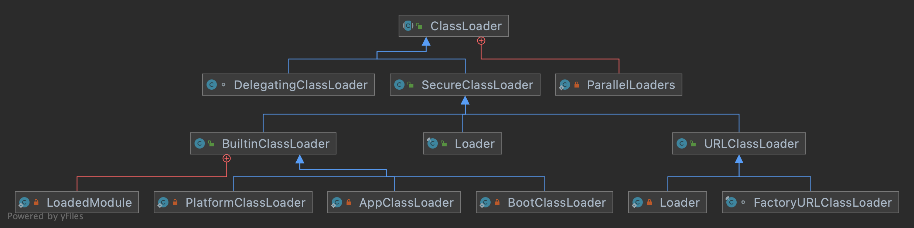

## Introduction
The Java Virtual Machine dynamically loads, links and initializes classes and interfaces.
- Loading is the process of finding the binary representation of a class or interface type with a particular name and creating a class or interface from that binary representation. 
- Linking is the process of taking a class or interface and combining it into the run-time state of the Java Virtual Machine so that it can be executed. 
- Initialization of a class or interface consists of executing the class or interface initialization method `<clinit>`.


A class in the system is identified by the classloader used to load it as well as the fully qualified class name (which includes the package name).


| ClassLoader            | Languages | Load path           | Parent(Composition)                   | JDK11                                                     |
| ---------------------- | --------- | ------------------- | ------------------------ | --------------------------------------------------------- |
| `BootstrapClassLoader` | C++       | <JAVA_HOME>/lib     |                          |                                                           |
| `ExtensionClassLoader` | Java      | <JAVA_HOME>/lib/ext | `BootstrapClassLoader`   | rename to PlatformClassLoader, not extends URLClassLoader |
| `AppClassLoader`       | Java      | classpath/          | `ExtensionClassLoader`   | not extends URLClassLoader                                |
| `User ClassLoader`     | Java      | all                 | default `AppClassLoader` |                                                           |


Here are ClassLoaders in **JDK17**:



### Delegation model

The ClassLoader class uses a **delegation model** to search for classes and resources. **Each instance of ClassLoader
has an associated parent class loader.** When requested to find a class or resource, a ClassLoader instance will
delegate the search for the class or resource to its parent class loader before attempting to find the class or resource
itself. The virtual machine's built-in class loader, called the "bootstrap class loader", does not itself have a parent
but may serve as the parent of a ClassLoader instance.


#### Parallel

Class loaders that support concurrent loading of classes are known as parallel capable class loaders and are required to
register themselves at their class initialization time by invoking the ClassLoader.registerAsParallelCapable method.
Note that the ClassLoader class is registered as parallel capable by default. However, its subclasses still need to
register themselves if they are parallel capable. In environments in which the delegation model is not strictly
hierarchical, class loaders need to be parallel capable, otherwise class loading can lead to deadlocks because the
loader lock is held for the duration of the class loading process (see loadClass methods).

In environments in which the delegation model is not strictly hierarchical, class loaders need to be parallel capable,
otherwise class loading can lead to deadlocks because the loader lock is held for the duration of the class loading
process (see `loadClass` methods).

Loads the class with the specified binary name. The default implementation of this method searches for classes in the
following order:

1. Invoke findLoadedClass(String) to check if the class has already been loaded.
2. **Invoke the loadClass method on the parent class loader.** If the parent is null the class loader built-in to the
   virtual machine is used, instead.
3. Invoke the findClass(String) method to find the class.

If the class was found using the above steps, and the resolve flag is true, this method will then invoke the
resolveClass(Class) method on the resulting Class object. Subclasses of ClassLoader are encouraged to override
findClass(String), rather than this method. Unless overridden, this method synchronizes on the result of
getClassLoadingLock method during the entire class loading process.

```java
protected Class<?> loadClass(String name,boolean resolve)
        throws ClassNotFoundException
        {
synchronized (getClassLoadingLock(name)){
        // First, check if the class has already been loaded
        Class<?> c=findLoadedClass(name);
        if(c==null){
        long t0=System.nanoTime();
        try{
        if(parent!=null){
        c=parent.loadClass(name,false);
        }else{
        c=findBootstrapClassOrNull(name);
        }
        }catch(ClassNotFoundException e){
        // ClassNotFoundException thrown if class not found
        // from the non-null parent class loader
        }

        if(c==null){
        // If still not found, then invoke findClass in order
        // to find the class.
        long t1=System.nanoTime();
        c=findClass(name);

        // this is the defining class loader; record the stats
        sun.misc.PerfCounter.getParentDelegationTime().addTime(t1-t0);
        sun.misc.PerfCounter.getFindClassTime().addElapsedTimeFrom(t1);
        sun.misc.PerfCounter.getFindClasses().increment();
        }
        }
        if(resolve){
        resolveClass(c);
        }
        return c;
        }
        }
```

Returns the lock object for class loading operations. For backward compatibility, the default implementation of this
method behaves as follows.

1. If this ClassLoader object is registered as parallel capable, the method returns **a dedicated object associated with
   the specified class name**.
2. Otherwise, the method returns **this ClassLoader object**.

```java
protected Object getClassLoadingLock(String className){
        Object lock=this;
        if(parallelLockMap!=null){
        Object newLock=new Object();
        lock=parallelLockMap.putIfAbsent(className,newLock);
        if(lock==null){
        lock=newLock;
        }
        }
        return lock;
        }

// Maps class name to the corresponding lock object when the current
// class loader is parallel capable.
// Note: VM also uses this field to decide if the current class loader
// is parallel capable and the appropriate lock object for class loading.
private final ConcurrentHashMap<String, Object> parallelLockMap;
```

#### Destroy delegate model

1. override loadClass(), not findClass()
2. SPI, JDBC JNDI,use contextClassLoader(most be ApplicationClassLoader)
3. hotswap, `OSGI`(`Open Service Gateway Initiative`), Tomcat WebApplicationClassLoader or Spring devtools
   RestartClassLoader
4. since JDK9, module

### load source

Normally, the Java virtual machine loads classes from the local file system in a platform-dependent manner. For example,
on UNIX systems, the virtual machine loads classes from the directory defined by the CLASSPATH environment variable.
However, some classes may not originate from a file; they may originate from other sources, such as the network, or they
could be constructed by an application. The method defineClass converts an array of bytes into an instance of class
Class. Instances of this newly defined class can be created using Class.newInstance. The methods and constructors of
objects created by a class loader may reference other classes. To determine the class(es) referred to, the Java virtual
machine invokes the loadClass method of the class loader that originally created the class.

For example, an application could create a network class loader to download class files from a server. Sample code might
look like:

```java
     ClassLoader loader=new NetworkClassLoader(host,port);
        Object main=loader.loadClass("Main",true).newInstance();
        ...
```

The network class loader subclass must define the methods findClass and loadClassData to load a class from the network.
Once it has downloaded the bytes that make up the class, it should use the method defineClass to create a class
instance. A sample implementation is:

```java
class NetworkClassLoader extends ClassLoader {
    String host;
    int port;

    public Class findClass(String name) {
        byte[] b = loadClassData(name);
        return defineClass(name, b, 0, b.length);
    }

    private byte[] loadClassData(String name) {
        // load the class data from the connection
        //...
    }
}
```

### User ClassLoader Sample

Creates a new class loader using the ClassLoader returned by the method getSystemClassLoader() as the parent class
loader. If there is a security manager, its checkCreateClassLoader method is invoked. This may result in a security
exception.

```java
// ClassLoader
protected ClassLoader(){
    this(checkCreateClassLoader(),getSystemClassLoader());
}
```

```shell
-XX:+TraceClassLoading
-Xlog: class+load=info # JDK11
```

## init

```cpp
// share/classfile/systemDictionary.cpp
void SystemDictionary::compute_java_loaders(TRAPS) {
  JavaValue result(T_OBJECT);
  InstanceKlass* class_loader_klass = vmClasses::ClassLoader_klass();
```
call `java.lang.ClassLoader.getSystemClassLoader()` and init AppClassLoader and its parent
```cpp
  JavaCalls::call_static(&result,
                         class_loader_klass,
                         vmSymbols::getSystemClassLoader_name(),
                         vmSymbols::void_classloader_signature(),
                         CHECK);

  _java_system_loader = OopHandle(Universe::vm_global(), result.get_oop());

  JavaCalls::call_static(&result,
                         class_loader_klass,
                         vmSymbols::getPlatformClassLoader_name(),
                         vmSymbols::void_classloader_signature(),
                         CHECK);

  _java_platform_loader = OopHandle(Universe::vm_global(), result.get_oop());
}
```

## Class Lifetime


- Loading completely before it is linked
  - parse stream
    - create Constant Pool
  - create InstanceKlass
    - Initialize itable offset tables
    - fill_oop_maps
    - create mirror class
- Linking
  - Verification
  - Rewriting after verification but before the first method of the class is executed
  - link method entry points(interpreted and compiler) after class is rewritten
  - Initialize_vtable and initialize_itable after methods have been rewritten
  - Preparation may occur at any time following creation but must be completed prior to initialization
  - Resolution
- Initialization
  - call `clinit` method if exist
- Using
- Unloading


## Loading

Loads the class with the specified binary name. The default implementation of this method searches for classes in the
following order:

1. Invoke findLoadedClass(String) to check if the class has already been loaded.
2. Invoke the loadClass method on the parent class loader. If the parent is null the class loader built-in to the
   virtual machine is used, instead.
3. Invoke the findClass(String) method to find the class.

If the class was found using the above steps, and the resolve flag is true, this method will then invoke the
resolveClass(Class) method on the resulting Class object. Subclasses of ClassLoader are encouraged to override
findClass(String), rather than this method. Unless overridden, this method synchronizes on the result of
getClassLoadingLock method during the entire class loading process.

```java
public abstract class ClassLoader {
   protected Class<?> loadClass(String name, boolean resolve)
           throws ClassNotFoundException {
      synchronized (getClassLoadingLock(name)) {
         // First, check if the class has already been loaded
         Class<?> c = findLoadedClass(name);
         if (c == null) {
            long t0 = System.nanoTime();
            try {
               if (parent != null) {
                  c = parent.loadClass(name, false);
               } else {
                  c = findBootstrapClassOrNull(name);
               }
            } catch (ClassNotFoundException e) {
               // ClassNotFoundException thrown if class not found
               // from the non-null parent class loader
            }

            if (c == null) {
               // If still not found, then invoke findClass in order
               // to find the class.
               long t1 = System.nanoTime();
               c = findClass(name);

               // this is the defining class loader; record the stats
               PerfCounter.getParentDelegationTime().addTime(t1 - t0);
               PerfCounter.getFindClassTime().addElapsedTimeFrom(t1);
               PerfCounter.getFindClasses().increment();
            }
         }
         if (resolve) {
            resolveClass(c);
         }
         return c;
      }
   }
}
```

*Links the specified class. This (misleadingly named) method may be used by a class loader to link a class. If the class
c has already been linked, then this method simply returns. Otherwise, the class is linked as described in the "
Execution" chapter of The Java™ Language Specification.*

```java
protected final void resolveClass(Class<?> c){
        resolveClass0(c);
        }

private native void resolveClass0(Class<?> c);
```

```java
// JDK17
static native Class<?> defineClass1(ClassLoader loader, String name, byte[] b, int off, int len,
        ProtectionDomain pd, String source);

static native Class<?> defineClass2(ClassLoader loader, String name, java.nio.ByteBuffer b,
        int off, int len, ProtectionDomain pd,
        String source);
```

### load Class
> [!TIP]
> 
> Both [loadClass](/docs/CS/Java/JDK/JVM/ClassLoader.md?id=loadClass) and [defineClass](/docs/CS/Java/JDK/JVM/ClassLoader.md?id=defineClass) call [create_from_stream](/docs/CS/Java/JDK/JVM/ClassLoader.md?id=create_from_stream)

#### loadClass


```c
SystemDictionary::resolve_or_fail
  \|/
SystemDictionary::resolve_or_null
   |        \|/
   |      resolve_array_class_or_null 
  \|/       \|/
SystemDictionary::resolve_instance_class_or_null 
-> SystemDictionary::load_instance_class 
-> SystemDictionary::load_instance_class_impl 
-> ClassLoader::load_class
-> KlassFactory::create_from_stream
```

>  call [KlassFactory::create_from_stream](/docs/CS/Java/JDK/JVM/ClassLoader.md?id=create_from_stream)

```cpp
//classLoader.cpp
// Called by the boot classloader to load classes
InstanceKlass* ClassLoader::load_class(Symbol* name, bool search_append_only, TRAPS) {
	...

  InstanceKlass* result = KlassFactory::create_from_stream(stream, name,
                                                           loader_data, cl_info, CHECK_NULL);
  result->set_classpath_index(classpath_index);
  return result;
}
```

#### defineClass

defineClass1 and defineClass2 both call JVM_DefineClassWithSource -> jvm_define_class_common
```c
// jvm.cpp
JVM_ENTRY(jclass, JVM_DefineClassWithSource(JNIEnv *env, const char *name, jobject loader, const jbyte *buf, jsize len, jobject pd, const char *source))

  return jvm_define_class_common(name, loader, buf, len, pd, source, THREAD);
JVM_END
```

> call [KlassFactory::create_from_stream](/docs/CS/Java/JDK/JVM/ClassLoader.md?id=create_from_stream) too
```
jni_DefineClass -----+----- JVM_DefineClass
                     |
                    \|/
            jvm_define_class_common
                    \|/
    SystemDictionary::resolve_from_stream
                    \|/
        KlassFactory::create_from_stream
```


### create_from_stream
1. [parse_stream](/docs/CS/Java/JDK/JVM/ClassLoader.md?id=parse_stream)
2. [create_instance_klass](/docs/CS/Java/JDK/JVM/ClassLoader.md?id=create_instance_klass)

```cpp
// klassFactory.cpp
InstanceKlass* KlassFactory::create_from_stream(ClassFileStream* stream,
                                                Symbol* name,
                                                ClassLoaderData* loader_data,
                                                const ClassLoadInfo& cl_info,
                                                TRAPS) {
	...

  // Skip this processing for VM hidden classes
  if (!cl_info.is_hidden()) {
    stream = check_class_file_load_hook(stream, name, loader_data, cl_info.protection_domain(),
                                        &cached_class_file, CHECK_NULL);
  }
  
  ClassFileParser parser(stream, name, loader_data, &cl_info,
                         ClassFileParser::BROADCAST, // publicity level
                         CHECK_NULL);

  InstanceKlass* result = parser.create_instance_klass(old_stream != stream, *cl_inst_info, CHECK_NULL);

  return result;
}
```

### parse_stream

```cpp
ClassFileParser::ClassFileParser(...) {
	...

  parse_stream(stream, CHECK);

  post_process_parsed_stream(stream, _cp, CHECK);
}
```
parse_stream
```cpp
//classFileParser.cpp
void ClassFileParser::parse_stream(const ClassFileStream* const stream,
                                   TRAPS) {
  // verify
```
create Constant Pool
```
  _cp = ConstantPool::allocate(_loader_data, cp_size, CHECK);
  ConstantPool* const cp = _cp;
  parse_constant_pool(stream, cp, _orig_cp_size, CHECK);
  
  
  Symbol* const class_name_in_cp = cp->klass_name_at(_this_class_index);
  assert(class_name_in_cp != NULL, "class_name can't be null");
  
  ...

  // SUPERKLASS
  _super_class_index = stream->get_u2_fast();
  _super_klass = parse_super_class(cp, _super_class_index, _need_verify, CHECK);

  // Interfaces
  _itfs_len = stream->get_u2_fast();
  parse_interfaces(stream,
                   _itfs_len,
                   cp,
                   &_has_nonstatic_concrete_methods,
                   CHECK);

```
Fields (offsets are filled in later) 

`ConstantValue` index
```
  _fac = new FieldAllocationCount();
  parse_fields(stream,
               _access_flags.is_interface(),
               _fac,
               cp,
               cp_size,
               &_java_fields_count,
               CHECK);

```
Methods
```
  AccessFlags promoted_flags;
  parse_methods(stream,
                _access_flags.is_interface(),
                &promoted_flags,
                &_has_final_method,
                &_declares_nonstatic_concrete_methods,
                CHECK);

 ...

  // Additional attributes/annotations
  _parsed_annotations = new ClassAnnotationCollector();
  parse_classfile_attributes(stream, cp, _parsed_annotations, CHECK);

  // Finalize the Annotations metadata object,
  // now that all annotation arrays have been created.
  create_combined_annotations(CHECK);
}
```


### create_instance_klass

1. [InstanceKlass::allocate_instance_klass](/docs/CS/Java/JDK/JVM/ClassLoader.md?id=allocate_instance_klass)
2. [ClassFileParser::fill_instance_klass](/docs/CS/Java/JDK/JVM/ClassLoader.md?id=fill_instance_klass)

```cpp
//classFileParser.cpp
InstanceKlass* ClassFileParser::create_instance_klass(bool changed_by_loadhook,
                                                      const ClassInstanceInfo& cl_inst_info,
                                                      TRAPS) {
  //_klass not NULL, return

  InstanceKlass* const ik =
    InstanceKlass::allocate_instance_klass(*this, CHECK_NULL);

  if (is_hidden()) {
    mangle_hidden_class_name(ik);
  }

  fill_instance_klass(ik, changed_by_loadhook, cl_inst_info, CHECK_NULL);

  return ik;
}
```

#### allocate_instance_klass

```cpp
// instanceKlass.cpp
InstanceKlass* InstanceKlass::allocate_instance_klass(const ClassFileParser& parser, TRAPS) {
  InstanceKlass* ik;

  // Allocation
  if (REF_NONE == parser.reference_type()) {
    if (class_name == vmSymbols::java_lang_Class()) {
      // mirror
      ik = new (loader_data, size, THREAD) InstanceMirrorKlass(parser);
    }
    else if (is_class_loader(class_name, parser)) {
      // class loader
      ik = new (loader_data, size, THREAD) InstanceClassLoaderKlass(parser);
    } else {
      // normal
      ik = new (loader_data, size, THREAD) InstanceKlass(parser, InstanceKlass::_misc_kind_other);
    }
  } else {
    // reference
    ik = new (loader_data, size, THREAD) InstanceRefKlass(parser);
  }
  
  return ik;
}
```

#### fill_instance_klass


1. set minor/major version
2. Initialize itable offset tables
3. fill_oop_maps
4. create_mirror and initialize static fields
5. generate_default_methods

```cpp

void ClassFileParser::fill_instance_klass(InstanceKlass* ik, bool changed_by_loadhook, TRAPS) {
  // Set name and CLD before adding to CLD
  ik->set_class_loader_data(_loader_data);
  ik->set_name(_class_name);

  // Add all classes to our internal class loader list here,
  // including classes in the bootstrap (NULL) class loader.
  const bool publicize = !is_internal();

  _loader_data->add_class(ik, publicize);

  set_klass_to_deallocate(ik);

  // Fill in information already parsed
  ik->set_should_verify_class(_need_verify);

  // Not yet: supers are done below to support the new subtype-checking fields
  ik->set_nonstatic_field_size(_field_info->nonstatic_field_size);
  ik->set_has_nonstatic_fields(_field_info->has_nonstatic_fields);
  ik->set_static_oop_field_count(_fac->count[STATIC_OOP]);

  // this transfers ownership of a lot of arrays from
  // the parser onto the InstanceKlass*
  apply_parsed_class_metadata(ik, _java_fields_count, CHECK);

  // note that is not safe to use the fields in the parser from this point on

  if (_has_final_method) {
    ik->set_has_final_method();
  }

  ik->copy_method_ordering(_method_ordering, CHECK);
  // The InstanceKlass::_methods_jmethod_ids cache
  // is managed on the assumption that the initial cache
  // size is equal to the number of methods in the class. If
  // that changes, then InstanceKlass::idnum_can_increment()
  // has to be changed accordingly.
  ik->set_initial_method_idnum(ik->methods()->length());

  ik->set_this_class_index(_this_class_index);

  ik->set_minor_version(_minor_version);
  ik->set_major_version(_major_version);
  ik->set_has_nonstatic_concrete_methods(_has_nonstatic_concrete_methods);
  ik->set_declares_nonstatic_concrete_methods(_declares_nonstatic_concrete_methods);

  // Set PackageEntry for this_klass
  oop cl = ik->class_loader();
  Handle clh = Handle(THREAD, java_lang_ClassLoader::non_reflection_class_loader(cl));
  ClassLoaderData* cld = ClassLoaderData::class_loader_data_or_null(clh());
  ik->set_package(cld, CHECK);

  const Array<Method*>* const methods = ik->methods();
  const int methods_len = methods->length();

  check_methods_for_intrinsics(ik, methods);

  // Fill in field values obtained by parse_classfile_attributes
  if (_parsed_annotations->has_any_annotations()) {
    _parsed_annotations->apply_to(ik);
  }

  apply_parsed_class_attributes(ik);

  // Miranda methods
  if ((_num_miranda_methods > 0) ||
      // if this class introduced new miranda methods or
      (_super_klass != NULL && _super_klass->has_miranda_methods())
        // super class exists and this class inherited miranda methods
     ) {
       ik->set_has_miranda_methods(); // then set a flag
  }

  // Fill in information needed to compute superclasses.
  ik->initialize_supers(const_cast<InstanceKlass*>(_super_klass), _transitive_interfaces, CHECK);
  ik->set_transitive_interfaces(_transitive_interfaces);
  _transitive_interfaces = NULL;

  // Initialize itable offset tables
  klassItable::setup_itable_offset_table(ik);

  // Compute transitive closure of interfaces this class implements
  // Do final class setup
  fill_oop_maps(ik,
                _field_info->nonstatic_oop_map_count,
                _field_info->nonstatic_oop_offsets,
                _field_info->nonstatic_oop_counts);

  // Fill in has_finalizer, has_vanilla_constructor, and layout_helper
  set_precomputed_flags(ik);

  // check if this class can access its super class
  check_super_class_access(ik, CHECK);

  // check if this class can access its superinterfaces
  check_super_interface_access(ik, CHECK);

  // check if this class overrides any final method
  check_final_method_override(ik, CHECK);

  // reject static interface methods prior to Java 8
  if (ik->is_interface() && _major_version < JAVA_8_VERSION) {
    check_illegal_static_method(ik, CHECK);
  }

  // Obtain this_klass' module entry
  ModuleEntry* module_entry = ik->module();
  assert(module_entry != NULL, "module_entry should always be set");

  // Obtain java.lang.Module
  Handle module_handle(THREAD, module_entry->module());
```
Allocate mirror and initialize static fields
The create_mirror() call will also call compute_modifiers()
```cpp
  java_lang_Class::create_mirror(ik,
                                 Handle(THREAD, _loader_data->class_loader()),
                                 module_handle,
                                 _protection_domain,
                                 CHECK);

  assert(_all_mirandas != NULL, "invariant");

  // Generate any default methods - default methods are public interface methods
  // that have a default implementation.  This is new with Java 8.
  if (_has_nonstatic_concrete_methods) {
    DefaultMethods::generate_default_methods(ik,
                                             _all_mirandas,
                                             CHECK);
  }

  // Add read edges to the unnamed modules of the bootstrap and app class loaders.
  if (changed_by_loadhook && !module_handle.is_null() && module_entry->is_named() &&
      !module_entry->has_default_read_edges()) {
    if (!module_entry->set_has_default_read_edges()) {
      // We won a potential race
      JvmtiExport::add_default_read_edges(module_handle, THREAD);
    }
  }

  ClassLoadingService::notify_class_loaded(ik, false /* not shared class */);

  if (!is_internal()) {
    if (log_is_enabled(Info, class, load)) {
      ResourceMark rm;
      const char* module_name = (module_entry->name() == NULL) ? UNNAMED_MODULE : module_entry->name()->as_C_string();
      ik->print_class_load_logging(_loader_data, module_name, _stream);
    }

    if (ik->minor_version() == JAVA_PREVIEW_MINOR_VERSION &&
        ik->major_version() != JAVA_MIN_SUPPORTED_VERSION &&
        log_is_enabled(Info, class, preview)) {
      ResourceMark rm;
      log_info(class, preview)("Loading class %s that depends on preview features (class file version %d.65535)",
                               ik->external_name(), ik->major_version());
    }

    if (log_is_enabled(Debug, class, resolve))  {
      ResourceMark rm;
      // print out the superclass.
      const char * from = ik->external_name();
      if (ik->java_super() != NULL) {
        log_debug(class, resolve)("%s %s (super)",
                   from,
                   ik->java_super()->external_name());
      }
      // print out each of the interface classes referred to by this class.
      const Array<InstanceKlass*>* const local_interfaces = ik->local_interfaces();
      if (local_interfaces != NULL) {
        const int length = local_interfaces->length();
        for (int i = 0; i < length; i++) {
          const InstanceKlass* const k = local_interfaces->at(i);
          const char * to = k->external_name();
          log_debug(class, resolve)("%s %s (interface)", from, to);
        }
      }
    }
  }

  JFR_ONLY(INIT_ID(ik);)

  // If we reach here, all is well.
  // Now remove the InstanceKlass* from the _klass_to_deallocate field
  // in order for it to not be destroyed in the ClassFileParser destructor.
  set_klass_to_deallocate(NULL);

  // it's official
  set_klass(ik);

  debug_only(ik->verify();)
}
```


init _the_null_class_loader_data

```cpp
// ClassLoaderData.inline.hpp
inline ClassLoaderData* ClassLoaderData::class_loader_data_or_null(oop loader) {
  if (loader == NULL) {
    return ClassLoaderData::the_null_class_loader_data();
  }
  return java_lang_ClassLoader::loader_data_acquire(loader);
}


// ClassLoaderData.cpp
void ClassLoaderData::init_null_class_loader_data() {
  _the_null_class_loader_data = new ClassLoaderData(Handle(), false);
  ClassLoaderDataGraph::_head = _the_null_class_loader_data;
...
}

```

##### create_mirror

```cpp
// javaClasses.cpp
void java_lang_Class::create_mirror(Klass* k, Handle class_loader,
                                    Handle module, Handle protection_domain, TRAPS) {
     
  	initialize_mirror_fields(k, mirror, protection_domain, THREAD);

    // set the classLoader field in the java_lang_Class instance
    set_class_loader(mirror(), class_loader());

    // Setup indirection from klass->mirror
    // after any exceptions can happen during allocations.
    k->set_java_mirror(mirror);

    // Set the module field in the java_lang_Class instance.  This must be done
    // after the mirror is set.
    set_mirror_module_field(k, mirror, module, THREAD);

    if (comp_mirror() != NULL) {
      // Set after k->java_mirror() is published, because compiled code running
      // concurrently doesn't expect a k to have a null java_mirror.
      release_set_array_klass(comp_mirror(), k);
    }
}
```

## Linking

Linking a class or interface involves verifying and preparing that class or interface, its direct superclass, its direct superinterfaces, and its element type (if it is an array type), if necessary. 
Linking also involves resolution of symbolic references in the class or interface, though not necessarily at the same time as the class or interface is verified and prepared.

This specification allows an implementation flexibility as to when linking activities (and, because of recursion, loading) take place, provided that all of the following properties are maintained:
- A class or interface is completely loaded before it is linked.
- A class or interface is completely verified and prepared before it is initialized.
- Errors detected during linkage are thrown at a point in the program where some action is taken by the program that might, directly or indirectly, require linkage to the class or interface involved in the error.
- A symbolic reference to a dynamically-computed constant is not resolved until either (i) an *ldc*, *ldc_w*, or *ldc2_w* instruction that refers to it is executed, or (ii) a bootstrap method that refers to it as a static argument is invoked.
- A symbolic reference to a dynamically-computed call site is not resolved until a bootstrap method that refers to it as a static argument is invoked.

For example, a Java Virtual Machine implementation may choose a "lazy" linkage strategy, where each symbolic reference in a class or interface (other than the symbolic references above) is resolved individually when it is used. 
Alternatively, an implementation may choose an "eager" linkage strategy, where all symbolic references are resolved at once when the class or interface is being verified. This means that the resolution process may continue, in some implementations, after a class or interface has been initialized. Whichever strategy is followed, any error detected during resolution must be thrown at a point in the program that (directly or indirectly) uses a symbolic reference to the class or interface.

Because linking involves the allocation of new data structures, it may fail with an `OutOfMemoryError`.


1. [verification](/docs/CS/Java/JDK/JVM/ClassLoader.md?id=Verification) 
2. [Rewriting](/docs/CS/Java/JDK/JVM/ClassLoader.md?id=Rewriting) after verification but before the first method of the class is executed
2. relocate jsrs and link methods after they are all rewritten
3. [Initialize_vtable](/docs/CS/Java/JDK/JVM/Oop-Klass.md?id=initialize_vtable) and [initialize_itable](/docs/CS/Java/JDK/JVM/Oop-Klass.md?id=initialize_itable)
4. set_init_state

```cpp
// InstanceKlass.cpp
bool InstanceKlass::link_class_impl(TRAPS) {
  if (DumpSharedSpaces && is_in_error_state()) {
    // This is for CDS dumping phase only -- we use the in_error_state to indicate that
    // the class has failed verification. Throwing the NoClassDefFoundError here is just
    // a convenient way to stop repeat attempts to verify the same (bad) class.
    //
    // Note that the NoClassDefFoundError is not part of the JLS, and should not be thrown
    // if we are executing Java code. This is not a problem for CDS dumping phase since
    // it doesn't execute any Java code.
    ResourceMark rm(THREAD);
    Exceptions::fthrow(THREAD_AND_LOCATION,
                       vmSymbols::java_lang_NoClassDefFoundError(),
                       "Class %s, or one of its supertypes, failed class initialization",
                       external_name());
    return false;
  }
  // return if already verified
  if (is_linked()) {
    return true;
  }

  // Timing
  // timer handles recursion
  assert(THREAD->is_Java_thread(), "non-JavaThread in link_class_impl");
  JavaThread* jt = (JavaThread*)THREAD;

  // link super class before linking this class
  Klass* super_klass = super();
  if (super_klass != NULL) {
    if (super_klass->is_interface()) {  // check if super class is an interface
      ResourceMark rm(THREAD);
      Exceptions::fthrow(
        THREAD_AND_LOCATION,
        vmSymbols::java_lang_IncompatibleClassChangeError(),
        "class %s has interface %s as super class",
        external_name(),
        super_klass->external_name()
      );
      return false;
    }

    InstanceKlass* ik_super = InstanceKlass::cast(super_klass);
    ik_super->link_class_impl(CHECK_false);
  }

  // link all interfaces implemented by this class before linking this class
  Array<InstanceKlass*>* interfaces = local_interfaces();
  int num_interfaces = interfaces->length();
  for (int index = 0; index < num_interfaces; index++) {
    InstanceKlass* interk = interfaces->at(index);
    interk->link_class_impl(CHECK_false);
  }

  // in case the class is linked in the process of linking its superclasses
  if (is_linked()) {
    return true;
  }

  // trace only the link time for this klass that includes
  // the verification time
  PerfClassTraceTime vmtimer(ClassLoader::perf_class_link_time(),
                             ClassLoader::perf_class_link_selftime(),
                             ClassLoader::perf_classes_linked(),
                             jt->get_thread_stat()->perf_recursion_counts_addr(),
                             jt->get_thread_stat()->perf_timers_addr(),
                             PerfClassTraceTime::CLASS_LINK);
```
[verification](/docs/CS/Java/JDK/JVM/ClassLoader.md?id=Verification) & 
```
  {
    HandleMark hm(THREAD);
    Handle h_init_lock(THREAD, init_lock());
    ObjectLocker ol(h_init_lock, THREAD, h_init_lock() != NULL);
    // rewritten will have been set if loader constraint error found
    // on an earlier link attempt
    // don't verify or rewrite if already rewritten
    //

    if (!is_linked()) {
      if (!is_rewritten()) {
        {
          bool verify_ok = verify_code(THREAD);
          if (!verify_ok) {
            return false;
          }
        }

        // Just in case a side-effect of verify linked this class already
        // (which can sometimes happen since the verifier loads classes
        // using custom class loaders, which are free to initialize things)
        if (is_linked()) {
          return true;
        }

```
[Rewriting](/docs/CS/Java/JDK/JVM/ClassLoader.md?id=Rewriting)
```
        // also sets rewritten
        rewrite_class(CHECK_false);
      } else if (is_shared()) {
        SystemDictionaryShared::check_verification_constraints(this, CHECK_false);
      }

```
relocate jsrs and [link methods]() after they are all rewritten
```
      link_methods(CHECK_false);
```
Initialize the vtable and interface table after
methods have been rewritten since rewrite may fabricate new Method*s.
also does loader constraint checking

initialize_vtable and initialize_itable need to be rerun for a shared class if the class is not loaded by the NULL classloader.
```cpp
      ClassLoaderData * loader_data = class_loader_data();
      if (!(is_shared() &&
            loader_data->is_the_null_class_loader_data())) {
        vtable().initialize_vtable(true, CHECK_false);
        itable().initialize_itable(true, CHECK_false);
      }
#ifdef ASSERT
      else {
        vtable().verify(tty, true);
        // In case itable verification is ever added.
        // itable().verify(tty, true);
      }
#endif
```
set_init_state
```cpp
      set_init_state(linked);
      if (JvmtiExport::should_post_class_prepare()) {
        Thread *thread = THREAD;
        assert(thread->is_Java_thread(), "thread->is_Java_thread()");
        JvmtiExport::post_class_prepare((JavaThread *) thread, this);
      }
    }
  }
  return true;
}
```

### Verification
Verification ensures that the binary representation of a class or interface is structurally correct. 
Verification may cause additional classes and interfaces to be loaded but need not cause them to be verified or prepared.

If the binary representation of a class or interface does not satisfy the static or structural constraints listed, 
then a VerifyError must be thrown at the point in the program that caused the class or interface to be verified.

If an attempt by the Java Virtual Machine to verify a class or interface fails because an error is thrown that is an instance of LinkageError (or a subclass), 
then subsequent attempts to verify the class or interface always fail with the same error that was thrown as a result of the initial verification attempt.


```cpp
// InstanceKlass.cpp
bool InstanceKlass::verify_code(TRAPS) {
  // 1) Verify the bytecodes
  return Verifier::verify(this, should_verify_class(), THREAD);
}
```


classfile/verifier.cpp

### Rewriting

Rewrite the byte codes of all of the methods of a class.
**The rewriter must be called exactly once.**

**Rewriting must happen after verification but before the first method of the class is executed.**

```cpp
// InstanceKlass.cpp
void InstanceKlass::rewrite_class(TRAPS) {
  if (is_rewritten()) {
    assert(is_shared(), "rewriting an unshared class?");
    return;
  }
  Rewriter::rewrite(this, CHECK);
  set_rewritten();
}

// share/interpreter/rewriter.cpp
void Rewriter::rewrite(InstanceKlass* klass, TRAPS) {
  ...
  
  Rewriter     rw(klass, cpool, klass->methods(), CHECK);
}
```
#### Rewriter
```cpp

Rewriter::Rewriter(InstanceKlass* klass, const constantPoolHandle& cpool, Array<Method*>* methods, TRAPS)
  : _klass(klass),
    _pool(cpool),
    _methods(methods),
    _cp_map(cpool->length()),
    _cp_cache_map(cpool->length() / 2),
    _reference_map(cpool->length()),
    _resolved_references_map(cpool->length() / 2),
    _invokedynamic_references_map(cpool->length() / 2),
    _method_handle_invokers(cpool->length()),
    _invokedynamic_cp_cache_map(cpool->length() / 4)
{

  // Rewrite bytecodes - exception here exits.
  rewrite_bytecodes(CHECK);

  // Stress restoring bytecodes
  if (StressRewriter) {
    restore_bytecodes(THREAD);
    rewrite_bytecodes(CHECK);
  }

  // allocate constant pool cache, now that we've seen all the bytecodes
  make_constant_pool_cache(THREAD);

  // Restore bytecodes to their unrewritten state if there are exceptions
  // rewriting bytecodes or allocating the cpCache
  if (HAS_PENDING_EXCEPTION) {
    restore_bytecodes(THREAD);
    return;
  }

  // Relocate after everything, but still do this under the is_rewritten flag,
  // so methods with jsrs in custom class lists in aren't attempted to be
  // rewritten in the RO section of the shared archive.
  // Relocated bytecodes don't have to be restored, only the cp cache entries
  int len = _methods->length();
  for (int i = len-1; i >= 0; i--) {
    methodHandle m(THREAD, _methods->at(i));

    if (m->has_jsrs()) {
      m = rewrite_jsrs(m, THREAD);
      // Restore bytecodes to their unrewritten state if there are exceptions
      // relocating bytecodes.  If some are relocated, that is ok because that
      // doesn't affect constant pool to cpCache rewriting.
      if (HAS_PENDING_EXCEPTION) {
        restore_bytecodes(THREAD);
        return;
      }
      // Method might have gotten rewritten.
      methods->at_put(i, m());
    }
  }
}
```


```cpp

void Rewriter::rewrite_bytecodes(TRAPS) {
  assert(_pool->cache() == NULL, "constant pool cache must not be set yet");

  // determine index maps for Method* rewriting
  compute_index_maps();

  if (RegisterFinalizersAtInit && _klass->name() == vmSymbols::java_lang_Object()) {
    bool did_rewrite = false;
    int i = _methods->length();
    while (i-- > 0) {
      Method* method = _methods->at(i);
      if (method->intrinsic_id() == vmIntrinsics::_Object_init) {
        // rewrite the return bytecodes of Object.<init> to register the
        // object for finalization if needed.
        methodHandle m(THREAD, method);
        rewrite_Object_init(m, CHECK);
        did_rewrite = true;
        break;
      }
    }
    assert(did_rewrite, "must find Object::<init> to rewrite it");
  }

  // rewrite methods, in two passes
  int len = _methods->length();
  bool invokespecial_error = false;

  for (int i = len-1; i >= 0; i--) {
    Method* method = _methods->at(i);
    scan_method(THREAD, method, false, &invokespecial_error);
    if (invokespecial_error) {
      // If you get an error here, there is no reversing bytecodes
      // This exception is stored for this class and no further attempt is
      // made at verifying or rewriting.
      THROW_MSG(vmSymbols::java_lang_InternalError(),
                "This classfile overflows invokespecial for interfaces "
                "and cannot be loaded");
      return;
     }
  }

  // May have to fix invokedynamic bytecodes if invokestatic/InterfaceMethodref
  // entries had to be added.
  patch_invokedynamic_bytecodes();
}

```

#### rewrite_Object_init
```
// share/interpreter/rewriter.cpp
void Rewriter::rewrite_Object_init(const methodHandle& method, TRAPS) {
  RawBytecodeStream bcs(method);
  while (!bcs.is_last_bytecode()) {
    Bytecodes::Code opcode = bcs.raw_next();
    switch (opcode) {
```
rewrite if override [Object.finalize()](/docs/CS/Java/JDK/Basic/Object.md?id=finalize) and call [Finalizer.register()](/docs/CS/Java/JDK/Basic/Ref.md?id=register)
```cpp
      case Bytecodes::_return: *bcs.bcp() = Bytecodes::_return_register_finalizer; break;

      case Bytecodes::_istore:
      case Bytecodes::_lstore:
      case Bytecodes::_fstore:
      case Bytecodes::_dstore:
      case Bytecodes::_astore:
        if (bcs.get_index() != 0) continue;

        // fall through
      case Bytecodes::_istore_0:
      case Bytecodes::_lstore_0:
      case Bytecodes::_fstore_0:
      case Bytecodes::_dstore_0:
      case Bytecodes::_astore_0:
        THROW_MSG(vmSymbols::java_lang_IncompatibleClassChangeError(),
                  "can't overwrite local 0 in Object.<init>");
        break;

      default:
        break;
    }
  }
}
```


### link_methods
Now relocate and link method entry points after class is rewritten.
This is outside is_rewritten flag. In case of an exception, it can be executed more than once.
```cpp
// instanceKlass.cpp
void InstanceKlass::link_methods(TRAPS) {
  int len = methods()->length();
  for (int i = len-1; i >= 0; i--) {
    methodHandle m(THREAD, methods()->at(i));

    // Set up method entry points for compiler and interpreter    .
    m->link_method(m, CHECK);
  }
}
```
Called when the method_holder is getting linked. Setup entrypoints so the method is ready to be called from interpreter, compiler, and vtables.
```cpp
// method.cpp
void Method::link_method(const methodHandle& h_method, TRAPS) {
```
If the code cache is full, we may reenter this function for the leftover methods that weren't linked.
```cpp
  if (_i2i_entry != NULL) {
    return;
  }
```
Setup interpreter entrypoint
Sets both _i2i_entry and _from_interpreted_entry
```cpp
  address entry = Interpreter::entry_for_method(h_method);
  set_interpreter_entry(entry);

  // Don't overwrite already registered native entries.
  if (is_native() && !has_native_function()) {
    set_native_function(
      SharedRuntime::native_method_throw_unsatisfied_link_error_entry(),
      !native_bind_event_is_interesting);
  }
```
Setup compiler entrypoint.  

This is made eagerly, so we do not need special handling of vtables.  
An alternative is to make adapters more lazily by calling make_adapter() from from_compiled_entry() for the normal calls.  

For vtable calls life gets more complicated.  
When a call-site goes mega-morphic we need adapters in all methods which can be called from the vtable.  
We need adapters on such methods that get loaded later.  

Ditto for mega-morphic itable calls.  If this proves to be a problem we'll make these lazily later.
```cpp
  (void) make_adapters(h_method, CHECK);

  // ONLY USE the h_method now as make_adapter may have blocked
}
```


#### init methods

MethodCounters & MethodData collect profiles of calling methods for compile

Intrinsic Method never use interpreter or compile which defined in vmSymbols.hpp.

```cpp
// method.hpp

class Method : public Metadata {
  // If you add a new field that points to any metaspace object, you
  // must add this field to Method::metaspace_pointers_do().
  ConstMethod*      _constMethod;                // Method read-only data.
  MethodData*       _method_data;
  MethodCounters*   _method_counters;
  AccessFlags       _access_flags;               // Access flags
  int               _vtable_index;               // vtable index of this method (see VtableIndexFlag)
                                                 // note: can have vtables with >2**16 elements (because of inheritance)
  u2                _intrinsic_id;               // vmSymbols::intrinsic_id (0 == _none)


#ifndef PRODUCT
  int               _compiled_invocation_count;  // Number of nmethod invocations so far (for perf. debugging)
#endif
  // Entry point for calling both from and to the interpreter.
  address _i2i_entry;           // All-args-on-stack calling convention
  // Entry point for calling from compiled code, to compiled code if it exists
  // or else the interpreter.
  volatile address _from_compiled_entry;        // Cache of: _code ? _code->entry_point() : _adapter->c2i_entry()
  // The entry point for calling both from and to compiled code is
  // "_code->entry_point()".  Because of tiered compilation and de-opt, this
  // field can come and go.  It can transition from NULL to not-null at any
  // time (whenever a compile completes).  It can transition from not-null to
  // NULL only at safepoints (because of a de-opt).
  CompiledMethod* volatile _code;                       // Points to the corresponding piece of native code
  volatile address           _from_interpreted_entry; // Cache of _code ? _adapter->i2c_entry() : _i2i_entry

}
```

The following illustrates how the entries work for CDS shared Methods: 

Our goal is to delay writing into a shared Method until it's compiled. Hence, we want to determine the initial values for _i2i_entry, _from_interpreted_entry and _from_compiled_entry during CDS dump time. 

In this example, both Methods A and B have the _i2i_entry of "zero_locals". They also have similar signatures so that they will share the same AdapterHandlerEntry. 

_adapter_trampoline points to a fixed location in the RW section of the CDS archive. This location initially contains a NULL pointer. When the first of method A or B is linked, an AdapterHandlerEntry is allocated dynamically, and its c2i/i2c entries are generated. 

_i2i_entry and _from_interpreted_entry initially points to the same (fixed) location in the CODE section of the CDS archive. This contains an unconditional branch to the actual entry for "zero_locals", which is generated at run time and may be on an arbitrary address. Thus, the unconditional branch is also generated at run time to jump to the correct address. 

Similarly, _from_compiled_entry points to a fixed address in the CODE section. 

This address has enough space for an unconditional branch instruction, and is initially zero-filled. After the AdapterHandlerEntry is initialized, and the address for the actual c2i_entry is known, we emit a branch instruction here to branch to the actual c2i_entry. 

The effect of the extra branch on the i2i and c2i entries is negligible. 

The reason for putting _adapter_trampoline in RO is many shared Methods share the same AdapterHandlerEntry, so we can save space in the RW section by having the extra indirection.

```java
/**
 * [Method A: RW]
 * _constMethod ----> [ConstMethod: RO]
 * _adapter_trampoline -----------+
 * |
 * _i2i_entry              (same value as method B)    |
 * _from_interpreted_entry (same value as method B)    |
 * _from_compiled_entry    (same value as method B)    |
 * |
 * |
 * [Method B: RW]                               +--------+
 * _constMethod ----> [ConstMethod: RO]       |
 * _adapter_trampoline --+--->(AdapterHandlerEntry* ptr: RW)-+
 * |
 * +-------------------------------+
 * |
 * +----> [AdapterHandlerEntry] (allocated at run time)
 * _fingerprint
 * _c2i_entry ---------------------------------+->[c2i entry..]
 * _i2i_entry  -------------+                                   _i2c_entry ---------------+-> [i2c entry..] |
 * _from_interpreted_entry  |                                   _c2i_unverified_entry     |                 |
 * |                |                                                             |                 |
 * |                |  (_cds_entry_table: CODE)                                   |                 |
 * |                +->[0]: jmp _entry_table[0] --> (i2i_entry_for "zero_locals") |                 |
 * |                |                               (allocated at run time)       |                 |
 * |                |  ...                           [asm code ...]               |                 |
 * +-[not compiled]-+  [n]: jmp _entry_table[n]                                   |                 |
 * |                                                                              |                 |
 * |                                                                              |                 |
 * +-[compiled]-------------------------------------------------------------------+                 |
 * |
 * _from_compiled_entry------------>  (_c2i_entry_trampoline: CODE)                                         |
 * [jmp c2i_entry] ------------------------------------------------------+
 **/

```
link_method
```cpp

// Called when the method_holder is getting linked. Setup entrypoints so the method
// is ready to be called from interpreter, compiler, and vtables.
void Method::link_method(const methodHandle& h_method, TRAPS) {
  // If the code cache is full, we may reenter this function for the
  // leftover methods that weren't linked.
  if (is_shared()) {
    address entry = Interpreter::entry_for_cds_method(h_method);
    assert(entry != NULL && entry == _i2i_entry,
           "should be correctly set during dump time");
    if (adapter() != NULL) {
      return;
    }
    assert(entry == _from_interpreted_entry,
           "should be correctly set during dump time");
  } else if (_i2i_entry != NULL) {
    return;
  }
  assert( _code == NULL, "nothing compiled yet" );

  // Setup interpreter entrypoint
  assert(this == h_method(), "wrong h_method()" );

  if (!is_shared()) {
    assert(adapter() == NULL, "init'd to NULL");
    address entry = Interpreter::entry_for_method(h_method);
    assert(entry != NULL, "interpreter entry must be non-null");
    // Sets both _i2i_entry and _from_interpreted_entry
    set_interpreter_entry(entry);
  }

  // Don't overwrite already registered native entries.
  if (is_native() && !has_native_function()) {
    set_native_function(
      SharedRuntime::native_method_throw_unsatisfied_link_error_entry(),
      !native_bind_event_is_interesting);
  }

  // Setup compiler entrypoint.  This is made eagerly, so we do not need
  // special handling of vtables.  An alternative is to make adapters more
  // lazily by calling make_adapter() from from_compiled_entry() for the
  // normal calls.  For vtable calls life gets more complicated.  When a
  // call-site goes mega-morphic we need adapters in all methods which can be
  // called from the vtable.  We need adapters on such methods that get loaded
  // later.  Ditto for mega-morphic itable calls.  If this proves to be a
  // problem we'll make these lazily later.
  (void) make_adapters(h_method, CHECK);

  // ONLY USE the h_method now as make_adapter may have blocked

}
```

##### install or Deoptimization
```cpp

// Install compiled code.  Instantly it can execute.
void Method::set_code(const methodHandle& mh, CompiledMethod *code) {
  MutexLockerEx pl(Patching_lock, Mutex::_no_safepoint_check_flag);

  guarantee(mh->adapter() != NULL, "Adapter blob must already exist!");

  // These writes must happen in this order, because the interpreter will
  // directly jump to from_interpreted_entry which jumps to an i2c adapter
  // which jumps to _from_compiled_entry.
  mh->_code = code;             // Assign before allowing compiled code to exec

  int comp_level = code->comp_level();
  // In theory there could be a race here. In practice it is unlikely
  // and not worth worrying about.
  if (comp_level > mh->highest_comp_level()) {
    mh->set_highest_comp_level(comp_level);
  }

  OrderAccess::storestore();
  mh->_from_compiled_entry = code->verified_entry_point();
  OrderAccess::storestore();
  // Instantly compiled code can execute.
  if (!mh->is_method_handle_intrinsic())
    mh->_from_interpreted_entry = mh->get_i2c_entry();
}


// Revert to using the interpreter and clear out the nmethod
void Method::clear_code(bool acquire_lock /* = true */) {
  MutexLockerEx pl(acquire_lock ? Patching_lock : NULL, Mutex::_no_safepoint_check_flag);
  // this may be NULL if c2i adapters have not been made yet
  // Only should happen at allocate time.
  if (adapter() == NULL) {
    _from_compiled_entry    = NULL;
  } else {
    _from_compiled_entry    = adapter()->get_c2i_entry();
  }
  OrderAccess::storestore();
  _from_interpreted_entry = _i2i_entry;
  OrderAccess::storestore();
  _code = NULL;
}
```

### Preparation
Preparation involves creating the static fields for a class or interface and initializing such fields to their **default values**. 
> [!NOTE]
> This does not require the execution of any Java Virtual Machine code; 
> explicit initializers for static fields are executed as part of initialization, not preparation.
> 
> Preparation may occur at any time following creation but must be completed prior to initialization.

### Resolution

Many Java Virtual Machine instructions - *anewarray*, *checkcast*, *getfield*, *getstatic*, *instanceof*, *invokedynamic*, *invokeinterface*, *invokespecial*, *invokestatic*, *invokevirtual*, *ldc*, *ldc_w*, *ldc2_w*, *multianewarray*, *new*, *putfield*, and *putstatic* - rely on symbolic references in the run-time constant pool. Execution of any of these instructions requires *resolution* of the symbolic reference.

Resolution is the process of dynamically determining one or more concrete values from a symbolic reference in the run-time constant pool. Initially, all symbolic references in the run-time constant pool are unresolved.

Lazy linked, loading other classes can be done after Initiailzation. It will run with no error when link a Error Class which not used. 


## Initialization

*Initialization* of a class or interface consists of executing its class or interface initialization method.

A class or interface C may be initialized only as a result of:

- The execution of any one of the Java Virtual Machine instructions *new*, *getstatic*, *putstatic*, or *invokestatic* that references C (*new*, *getstatic*, *putstatic*, *invokestatic*).

  Upon execution of a *new* instruction, the class to be initialized is the class referenced by the instruction.

  Upon execution of a *getstatic*, *putstatic*, or *invokestatic* instruction, the class or interface to be initialized is the class or interface that declares the resolved field or method.

- The first invocation of a `java.lang.invoke.MethodHandle` instance which was the result of method handle resolution for a method handle of kind 2 (`REF_getStatic`), 4 (`REF_putStatic`), 6 (`REF_invokeStatic`), or 8 (`REF_newInvokeSpecial`).

  This implies that the class of a bootstrap method is initialized when the bootstrap method is invoked for an *invokedynamic* instruction, as part of the continuing resolution of the call site specifier.

- Invocation of certain reflective methods in the class library, for example, in class `Class` or in package `java.lang.reflect`.

- If C is a class, the initialization of one of its subclasses.

- If C is an interface that declares a non-`abstract`, non-`static` method, the initialization of a class that implements C directly or indirectly.

- Its designation as the initial class or interface at Java Virtual Machine startup.

Prior to initialization, a class or interface must be linked, that is, verified, prepared, and optionally resolved.

Because the Java Virtual Machine is multithreaded, initialization of a class or interface requires careful synchronization, since some other thread may be trying to initialize the same class or interface at the same time. There is also the possibility that initialization of a class or interface may be requested recursively as part of the initialization of that class or interface. The implementation of the Java Virtual Machine is responsible for taking care of synchronization and recursive initialization by using the following procedure. It assumes that the `Class` object has already been verified and prepared, and that the `Class` object contains state that indicates one of four situations:

- This `Class` object is verified and prepared but not initialized.
- This `Class` object is being initialized by some particular thread.
- This `Class` object is fully initialized and ready for use.
- This `Class` object is in an erroneous state, perhaps because initialization was attempted and failed.


For each class or interface C, there is a unique initialization lock `LC`. The mapping from C to `LC` is left to the discretion of the Java Virtual Machine implementation. For example, `LC` could be the `Class` object for C, or the monitor associated with that `Class` object. The procedure for initializing C is then as follows:

1. Synchronize on the initialization lock, `LC`, for C. This involves waiting until the current thread can acquire `LC`.
2. If the `Class` object for C indicates that initialization is in progress for C by some other thread, then release `LC` and block the current thread until informed that the in-progress initialization has completed, at which time repeat this procedure.
   Thread interrupt status is unaffected by execution of the initialization procedure.
3. If the `Class` object for C indicates that initialization is in progress for C by the current thread, then this must be a recursive request for initialization. Release `LC` and complete normally.
4. If the `Class` object for C indicates that C has already been initialized, then no further action is required. Release `LC` and complete normally.
5. If the `Class` object for C is in an erroneous state, then initialization is not possible. Release `LC` and throw a `NoClassDefFoundError`.
6. Otherwise, record the fact that initialization of the `Class` object for C is in progress by the current thread, and release `LC`.
   Then, initialize each `final` `static` field of C with the constant value in its `ConstantValue` attribute, in the order the fields appear in the `ClassFile` structure.
7. Next, if C is a class rather than an interface, then let SC be its superclass and let SI1, ..., SIn be all superinterfaces of C (whether direct or indirect) that declare at least one non-`abstract`, non-`static` method. The order of superinterfaces is given by a recursive enumeration over the superinterface hierarchy of each interface directly implemented by C. For each interface I directly implemented by C (in the order of the `interfaces` array of C), the enumeration recurs on I's superinterfaces (in the order of the `interfaces` array of I) before returning I.
   For each S in the list [ SC, SI1, ..., SIn ], if S has not yet been initialized, then recursively perform this entire procedure for S. If necessary, verify and prepare S first.
   If the initialization of S completes abruptly because of a thrown exception, then acquire `LC`, label the `Class` object for C as erroneous, notify all waiting threads, release `LC`, and complete abruptly, throwing the same exception that resulted from initializing SC.
8. Next, determine whether assertions are enabled for C by querying its defining loader.
9. Next, **execute the class or interface initialization method of C**.
10. If the execution of the class or interface initialization method completes normally, then acquire `LC`, label the `Class` object for C as fully initialized, notify all waiting threads, release `LC`, and complete this procedure normally.
11. Otherwise, the class or interface initialization method must have completed abruptly by throwing some exception E. 
    If the class of E is not `Error` or one of its subclasses, then create a new instance of the class `ExceptionInInitializerError` with E as the argument, and use this object in place of E in the following step. 
    If a new instance of `ExceptionInInitializerError` cannot be created because an `OutOfMemoryError` occurs, then use an `OutOfMemoryError` object in place of E in the following step.
12. Acquire `LC`, label the `Class` object for C as erroneous, notify all waiting threads, release `LC`, and complete this procedure abruptly with reason E or its replacement as determined in the previous step.

A Java Virtual Machine implementation may optimize this procedure by eliding the lock acquisition in step 1 (and release in step 4/5) when it can determine that the initialization of the class has already completed, provided that, in terms of the Java memory model, all *happens-before* orderings (JLS §17.4.5) that would exist if the lock were acquired, still exist when the optimization is performed.


> [!NOTE]
> 
> Note: implementation moved to static method to expose the this pointer.


```cpp
void InstanceKlass::initialize(TRAPS) {
  if (this->should_be_initialized()) {
    initialize_impl(CHECK);
    // Note: at this point the class may be initialized
    //       OR it may be in the state of being initialized
    //       in case of recursive initialization!
  } else {
    assert(is_initialized(), "sanity check");
  }
}

void InstanceKlass::initialize_impl(TRAPS) {
  HandleMark hm(THREAD);
```
Make sure klass is linked (verified) before initialization
A class could already be verified, since it has been reflected upon.
```cpp
  link_class(CHECK);

  DTRACE_CLASSINIT_PROBE(required, -1);

  bool wait = false;
```
refer to the JVM book page 47 for description of steps
Step 1
```cpp
  {
    Handle h_init_lock(THREAD, init_lock());
    ObjectLocker ol(h_init_lock, THREAD, h_init_lock() != NULL);

    Thread *self = THREAD; // it's passed the current thread
```
Step 2
If we were to use wait() instead of waitInterruptibly() then
we might end up throwing IE from link/symbol resolution sites
that aren't expected to throw.  This would wreak havoc.  See 6320309.
```cpp
    while(is_being_initialized() && !is_reentrant_initialization(self)) {
        wait = true;
      ol.waitUninterruptibly(CHECK);
    }
```
Step 3
```cpp
    if (is_being_initialized() && is_reentrant_initialization(self)) {
      DTRACE_CLASSINIT_PROBE_WAIT(recursive, -1, wait);
      return;
    }
```
Step 4
```cpp
    if (is_initialized()) {
      DTRACE_CLASSINIT_PROBE_WAIT(concurrent, -1, wait);
      return;
    }
```
Step 5
```cpp
    if (is_in_error_state()) {
      DTRACE_CLASSINIT_PROBE_WAIT(erroneous, -1, wait);
      ResourceMark rm(THREAD);
      const char* desc = "Could not initialize class ";
      const char* className = external_name();
      size_t msglen = strlen(desc) + strlen(className) + 1;
      char* message = NEW_RESOURCE_ARRAY(char, msglen);
      if (NULL == message) {
        // Out of memory: can't create detailed error message
          THROW_MSG(vmSymbols::java_lang_NoClassDefFoundError(), className);
      } else {
        jio_snprintf(message, msglen, "%s%s", desc, className);
          THROW_MSG(vmSymbols::java_lang_NoClassDefFoundError(), message);
      }
    }
```
Step 6 set state = being_initialized and init_thread = self
```cpp
    set_init_state(being_initialized);
    set_init_thread(self);
  }
```
Step 7
Next, if C is a class rather than an interface, initialize it's super class and super
interfaces.
```cpp
  if (!is_interface()) {
    Klass* super_klass = super();
    if (super_klass != NULL && super_klass->should_be_initialized()) {
      super_klass->initialize(THREAD);
    }
    // If C implements any interface that declares a non-static, concrete method,
    // the initialization of C triggers initialization of its super interfaces.
    // Only need to recurse if has_nonstatic_concrete_methods which includes declaring and
    // having a superinterface that declares, non-static, concrete methods
    if (!HAS_PENDING_EXCEPTION && has_nonstatic_concrete_methods()) {
      initialize_super_interfaces(THREAD);
    }

    // If any exceptions, complete abruptly, throwing the same exception as above.
    if (HAS_PENDING_EXCEPTION) {
      Handle e(THREAD, PENDING_EXCEPTION);
      CLEAR_PENDING_EXCEPTION;
      {
        EXCEPTION_MARK;
        // Locks object, set state, and notify all waiting threads
        set_initialization_state_and_notify(initialization_error, THREAD);
        CLEAR_PENDING_EXCEPTION;
      }
      DTRACE_CLASSINIT_PROBE_WAIT(super__failed, -1, wait);
      THROW_OOP(e());
    }
  }


  // Look for aot compiled methods for this klass, including class initializer.
  AOTLoader::load_for_klass(this, THREAD);
```
Step 8 [call_class_initializer](/docs/CS/Java/JDK/JVM/ClassLoader.md?id=call_class_initializer)
```cpp
  {
    assert(THREAD->is_Java_thread(), "non-JavaThread in initialize_impl");
    JavaThread* jt = (JavaThread*)THREAD;
    DTRACE_CLASSINIT_PROBE_WAIT(clinit, -1, wait);
    // Timer includes any side effects of class initialization (resolution,
    // etc), but not recursive entry into call_class_initializer().
    PerfClassTraceTime timer(ClassLoader::perf_class_init_time(),
                             ClassLoader::perf_class_init_selftime(),
                             ClassLoader::perf_classes_inited(),
                             jt->get_thread_stat()->perf_recursion_counts_addr(),
                             jt->get_thread_stat()->perf_timers_addr(),
                             PerfClassTraceTime::CLASS_CLINIT);
    call_class_initializer(THREAD);
  }
```
Step 9
```cpp
  if (!HAS_PENDING_EXCEPTION) {
    set_initialization_state_and_notify(fully_initialized, CHECK);
    {
      debug_only(vtable().verify(tty, true);)
    }
  }
  else {
```
Step 10 and 11
```cpp
    Handle e(THREAD, PENDING_EXCEPTION);
    CLEAR_PENDING_EXCEPTION;
    // JVMTI has already reported the pending exception
    // JVMTI internal flag reset is needed in order to report ExceptionInInitializerError
    JvmtiExport::clear_detected_exception((JavaThread*)THREAD);
    {
      EXCEPTION_MARK;
      set_initialization_state_and_notify(initialization_error, THREAD);
      CLEAR_PENDING_EXCEPTION;   // ignore any exception thrown, class initialization error is thrown below
      // JVMTI has already reported the pending exception
      // JVMTI internal flag reset is needed in order to report ExceptionInInitializerError
      JvmtiExport::clear_detected_exception((JavaThread*)THREAD);
    }
    DTRACE_CLASSINIT_PROBE_WAIT(error, -1, wait);
    if (e->is_a(SystemDictionary::Error_klass())) {
      THROW_OOP(e());
    } else {
      JavaCallArguments args(e);
      THROW_ARG(vmSymbols::java_lang_ExceptionInInitializerError(),
                vmSymbols::throwable_void_signature(),
                &args);
    }
  }
  DTRACE_CLASSINIT_PROBE_WAIT(end, -1, wait);
}
```


### call_class_initializer
> call `clinit` method if exist

```cpp

void InstanceKlass::call_class_initializer(TRAPS) {
  if (ReplayCompiles &&
      (ReplaySuppressInitializers == 1 ||
       (ReplaySuppressInitializers >= 2 && class_loader() != NULL))) {
    // Hide the existence of the initializer for the purpose of replaying the compile
    return;
  }

  methodHandle h_method(THREAD, class_initializer());
  LogTarget(Info, class, init) lt;
  if (lt.is_enabled()) {
    ResourceMark rm;
    LogStream ls(lt);
    ls.print("%d Initializing ", call_class_initializer_counter++);
    name()->print_value_on(&ls);
    ls.print_cr("%s (" INTPTR_FORMAT ")", h_method() == NULL ? "(no method)" : "", p2i(this));
  }
  if (h_method() != NULL) {
    JavaCallArguments args; // No arguments
    JavaValue result(T_VOID);
    JavaCalls::call(&result, h_method, &args, CHECK); // Static call (no args)
  }
}

/** method name clinit */
Method* InstanceKlass::class_initializer() const {
  Method* clinit = find_method(
      vmSymbols::class_initializer_name(), vmSymbols::void_method_signature());
  if (clinit != NULL && clinit->has_valid_initializer_flags()) {
    return clinit;
  }
  return NULL;
}
```


## redefine Class

`java.lang.instrument.Instrumentation`


```cpp
/*
 *  Java code must not call this with a null list or a zero-length list.
 */
void
redefineClasses(JNIEnv * jnienv, JPLISAgent * agent, jobjectArray classDefinitions) {
}
```


redefine_single_class by [VMThread](/docs/CS/Java/JDK/JVM/Thread.md?id=VMThread)


Install the redefinition of a class:
- house keeping (flushing breakpoints and caches, deoptimizing
  dependent compiled code)
- replacing parts in the_class with parts from scratch_class
- adding a weak reference to track the obsolete but interesting
  parts of the_class
 - adjusting constant pool caches and vtables in other classes
   that refer to methods in the_class. These adjustments use the
   ClassLoaderDataGraph::classes_do() facility which only allows
   a helper method to be specified. The interesting parameters
   that we would like to pass to the helper method are saved in
   static global fields in the VM operation.
   
```cpp
// jvmtiRedefineClasses.cpp
void VM_RedefineClasses::redefine_single_class(jclass the_jclass,
       InstanceKlass* scratch_class, TRAPS) {

  HandleMark hm(THREAD);   // make sure handles from this call are freed

  if (log_is_enabled(Info, redefine, class, timer)) {
    _timer_rsc_phase1.start();
  }

  InstanceKlass* the_class = get_ik(the_jclass);

  // Remove all breakpoints in methods of this class
  JvmtiBreakpoints& jvmti_breakpoints = JvmtiCurrentBreakpoints::get_jvmti_breakpoints();
  jvmti_breakpoints.clearall_in_class_at_safepoint(the_class);

  // Deoptimize all compiled code that depends on this class
  flush_dependent_code(the_class, THREAD);

  _old_methods = the_class->methods();
  _new_methods = scratch_class->methods();
  _the_class = the_class;
  compute_added_deleted_matching_methods();
  update_jmethod_ids();

  _any_class_has_resolved_methods = the_class->has_resolved_methods() || _any_class_has_resolved_methods;

  // Attach new constant pool to the original klass. The original
  // klass still refers to the old constant pool (for now).
  scratch_class->constants()->set_pool_holder(the_class);
#if 0
  // In theory, with constant pool merging in place we should be able
  // to save space by using the new, merged constant pool in place of
  // the old constant pool(s). By "pool(s)" I mean the constant pool in
  // the klass version we are replacing now and any constant pool(s) in
  // previous versions of klass. Nice theory, doesn't work in practice.
  // When this code is enabled, even simple programs throw NullPointer
  // exceptions. I'm guessing that this is caused by some constant pool
  // cache difference between the new, merged constant pool and the
  // constant pool that was just being used by the klass. I'm keeping
  // this code around to archive the idea, but the code has to remain
  // disabled for now.

  // Attach each old method to the new constant pool. This can be
  // done here since we are past the bytecode verification and
  // constant pool optimization phases.
  for (int i = _old_methods->length() - 1; i >= 0; i--) {
    Method* method = _old_methods->at(i);
    method->set_constants(scratch_class->constants());
  }

  // NOTE: this doesn't work because you can redefine the same class in two
  // threads, each getting their own constant pool data appended to the
  // original constant pool.  In order for the new methods to work when they
  // become old methods, they need to keep their updated copy of the constant pool.

  {
    // walk all previous versions of the klass
    InstanceKlass *ik = the_class;
    PreviousVersionWalker pvw(ik);
    do {
      ik = pvw.next_previous_version();
      if (ik != NULL) {

        // attach previous version of klass to the new constant pool
        ik->set_constants(scratch_class->constants());

        // Attach each method in the previous version of klass to the
        // new constant pool
        Array<Method*>* prev_methods = ik->methods();
        for (int i = prev_methods->length() - 1; i >= 0; i--) {
          Method* method = prev_methods->at(i);
          method->set_constants(scratch_class->constants());
        }
      }
    } while (ik != NULL);
  }
#endif

  // Replace methods and constantpool
  the_class->set_methods(_new_methods);
  scratch_class->set_methods(_old_methods);     // To prevent potential GCing of the old methods,
                                          // and to be able to undo operation easily.

  Array<int>* old_ordering = the_class->method_ordering();
  the_class->set_method_ordering(scratch_class->method_ordering());
  scratch_class->set_method_ordering(old_ordering);

  ConstantPool* old_constants = the_class->constants();
  the_class->set_constants(scratch_class->constants());
  scratch_class->set_constants(old_constants);  // See the previous comment.
#if 0
  // We are swapping the guts of "the new class" with the guts of "the
  // class". Since the old constant pool has just been attached to "the
  // new class", it seems logical to set the pool holder in the old
  // constant pool also. However, doing this will change the observable
  // class hierarchy for any old methods that are still executing. A
  // method can query the identity of its "holder" and this query uses
  // the method's constant pool link to find the holder. The change in
  // holding class from "the class" to "the new class" can confuse
  // things.
  //
  // Setting the old constant pool's holder will also cause
  // verification done during vtable initialization below to fail.
  // During vtable initialization, the vtable's class is verified to be
  // a subtype of the method's holder. The vtable's class is "the
  // class" and the method's holder is gotten from the constant pool
  // link in the method itself. For "the class"'s directly implemented
  // methods, the method holder is "the class" itself (as gotten from
  // the new constant pool). The check works fine in this case. The
  // check also works fine for methods inherited from super classes.
  //
  // Miranda methods are a little more complicated. A miranda method is
  // provided by an interface when the class implementing the interface
  // does not provide its own method.  These interfaces are implemented
  // internally as an InstanceKlass. These special instanceKlasses
  // share the constant pool of the class that "implements" the
  // interface. By sharing the constant pool, the method holder of a
  // miranda method is the class that "implements" the interface. In a
  // non-redefine situation, the subtype check works fine. However, if
  // the old constant pool's pool holder is modified, then the check
  // fails because there is no class hierarchy relationship between the
  // vtable's class and "the new class".

  old_constants->set_pool_holder(scratch_class());
#endif
  // track number of methods that are EMCP for add_previous_version() call below
  int emcp_method_count = check_methods_and_mark_as_obsolete();
  transfer_old_native_function_registrations(the_class);

  // The class file bytes from before any retransformable agents mucked
  // with them was cached on the scratch class, move to the_class.
  // Note: we still want to do this if nothing needed caching since it
  // should get cleared in the_class too.
  if (the_class->get_cached_class_file() == 0) {
    // the_class doesn't have a cache yet so copy it
    the_class->set_cached_class_file(scratch_class->get_cached_class_file());
  }
  else if (scratch_class->get_cached_class_file() !=
           the_class->get_cached_class_file()) {
    // The same class can be present twice in the scratch classes list or there
    // are multiple concurrent RetransformClasses calls on different threads.
    // In such cases we have to deallocate scratch_class cached_class_file.
    os::free(scratch_class->get_cached_class_file());
  }

  // NULL out in scratch class to not delete twice.  The class to be redefined
  // always owns these bytes.
  scratch_class->set_cached_class_file(NULL);

  // Replace inner_classes
  Array<u2>* old_inner_classes = the_class->inner_classes();
  the_class->set_inner_classes(scratch_class->inner_classes());
  scratch_class->set_inner_classes(old_inner_classes);

  // Initialize the vtable and interface table after
  // methods have been rewritten
  // no exception should happen here since we explicitly
  // do not check loader constraints.
  // compare_and_normalize_class_versions has already checked:
  //  - classloaders unchanged, signatures unchanged
  //  - all instanceKlasses for redefined classes reused & contents updated
  the_class->vtable().initialize_vtable(false, THREAD);
  the_class->itable().initialize_itable(false, THREAD);
  assert(!HAS_PENDING_EXCEPTION || (THREAD->pending_exception()->is_a(SystemDictionary::ThreadDeath_klass())), "redefine exception");

  // Leave arrays of jmethodIDs and itable index cache unchanged

  // Copy the "source file name" attribute from new class version
  the_class->set_source_file_name_index(
    scratch_class->source_file_name_index());

  // Copy the "source debug extension" attribute from new class version
  the_class->set_source_debug_extension(
    scratch_class->source_debug_extension(),
    scratch_class->source_debug_extension() == NULL ? 0 :
    (int)strlen(scratch_class->source_debug_extension()));

  // Use of javac -g could be different in the old and the new
  if (scratch_class->access_flags().has_localvariable_table() !=
      the_class->access_flags().has_localvariable_table()) {

    AccessFlags flags = the_class->access_flags();
    if (scratch_class->access_flags().has_localvariable_table()) {
      flags.set_has_localvariable_table();
    } else {
      flags.clear_has_localvariable_table();
    }
    the_class->set_access_flags(flags);
  }

  swap_annotations(the_class, scratch_class);

  // Replace minor version number of class file
  u2 old_minor_version = the_class->minor_version();
  the_class->set_minor_version(scratch_class->minor_version());
  scratch_class->set_minor_version(old_minor_version);

  // Replace major version number of class file
  u2 old_major_version = the_class->major_version();
  the_class->set_major_version(scratch_class->major_version());
  scratch_class->set_major_version(old_major_version);

  // Replace CP indexes for class and name+type of enclosing method
  u2 old_class_idx  = the_class->enclosing_method_class_index();
  u2 old_method_idx = the_class->enclosing_method_method_index();
  the_class->set_enclosing_method_indices(
    scratch_class->enclosing_method_class_index(),
    scratch_class->enclosing_method_method_index());
  scratch_class->set_enclosing_method_indices(old_class_idx, old_method_idx);

  // Replace fingerprint data
  the_class->set_has_passed_fingerprint_check(scratch_class->has_passed_fingerprint_check());
  the_class->store_fingerprint(scratch_class->get_stored_fingerprint());

  the_class->set_has_been_redefined();

  if (!the_class->should_be_initialized()) {
    // Class was already initialized, so AOT has only seen the original version.
    // We need to let AOT look at it again.
    AOTLoader::load_for_klass(the_class, THREAD);
  }

  // keep track of previous versions of this class
  the_class->add_previous_version(scratch_class, emcp_method_count);

  _timer_rsc_phase1.stop();
  if (log_is_enabled(Info, redefine, class, timer)) {
    _timer_rsc_phase2.start();
  }

  // Adjust constantpool caches and vtables for all classes
  // that reference methods of the evolved class.
  AdjustCpoolCacheAndVtable adjust_cpool_cache_and_vtable(THREAD);
  ClassLoaderDataGraph::classes_do(&adjust_cpool_cache_and_vtable);

  if (the_class->oop_map_cache() != NULL) {
    // Flush references to any obsolete methods from the oop map cache
    // so that obsolete methods are not pinned.
    the_class->oop_map_cache()->flush_obsolete_entries();
  }

  increment_class_counter((InstanceKlass *)the_class, THREAD);
  {
    ResourceMark rm(THREAD);
    // increment the classRedefinedCount field in the_class and in any
    // direct and indirect subclasses of the_class
    log_info(redefine, class, load)
      ("redefined name=%s, count=%d (avail_mem=" UINT64_FORMAT "K)",
       the_class->external_name(), java_lang_Class::classRedefinedCount(the_class->java_mirror()), os::available_memory() >> 10);
    Events::log_redefinition(THREAD, "redefined class name=%s, count=%d",
                             the_class->external_name(),
                             java_lang_Class::classRedefinedCount(the_class->java_mirror()));

  }
  _timer_rsc_phase2.stop();
} // end redefine_single_class()
```


## Unloading

```shell
-XX:+ClassUnloading # default true
```

use ClassLoaderDataGraph::classed_do can iterate all loaded class when GC


ClassLoaderDataGraph::classes_do

## Links
- [JVM](/docs/CS/Java/JDK/JVM/JVM.md)

## References

1. [New Class Loader Implementations - JDK 9 Migration Guide](https://docs.oracle.com/javase/9/migrate/toc.htm#JSMIG-GUID-A868D0B9-026F-4D46-B979-901834343F9E)
