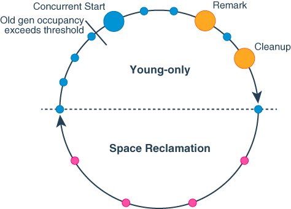

## Introduction

The G1, Garbage First, garbage collector (GC) has been the default GC since JDK 9.
The Garbage-First (G1) garbage collector is a server-style garbage collector, **targeted for multiprocessor machines with large memories**.
It attempts to meet garbage collection (GC) pause time goals with high probability while achieving high throughput.
Whole-heap operations, such as global marking, are performed concurrently with the application threads. This prevents interruptions proportional to heap or live-data size.

The first focus of G1 is to provide a solution for users running applications that require large heaps with limited GC latency.
**This means heap sizes of around 6 GB or larger, and a stable and predictable pause time below 0.5 seconds.**

Applications running today with either the CMS or the with parallel compaction would benefit from switching to G1 if the application has one or more of the following traits.

- More than 50% of the Java heap is occupied with live data.
- The rate of object allocation rate or promotion varies significantly.
- The application is experiencing undesired long garbage collection or compaction pauses (longer than 0.5 to 1 second).

G1 performs parts of its work at the same time as the application runs. It trades processor resources which would otherwise be available to the application for shorter collection pauses.

This is most visible in the use of one or more garbage collection threads active while the application runs.
Thus, compared to throughput collectors, while garbage collection pauses are typically much shorter with the G1 collector, application throughput also tends to be slightly lower.

G1 is a generational, incremental, parallel, mostly concurrent, stop-the-world, and evacuating garbage collector which monitors pause-time goals in each of the stop-the-world pauses.
Similar to other collectors, G1 splits the heap into (virtual) young and old generations.
Space-reclamation efforts concentrate on the young generation where it is most efficient to do so, with occasional space-reclamation in the old generation.

Some operations are always performed in stop-the-world pauses to improve throughput.
Other operations that would take more time with the application stopped such as whole-heap operations like global marking are performed in parallel and concurrently with the application.
To keep stop-the-world pauses short for space-reclamation, G1 performs space-reclamation incrementally in steps and in parallel.
G1 achieves predictability by tracking information about previous application behavior and garbage collection pauses to build a model of the associated costs.
It uses this information to size the work done in the pauses. For example, G1 reclaims space in the most efficient areas first (that is the areas that are mostly filled with garbage, therefore the name).

G1 reclaims space mostly by using evacuation: live objects found within selected memory areas to collect are copied into new memory areas, compacting them in the process.
After an evacuation has been completed, the space previously occupied by live objects is reused for allocation by the application.

The Garbage-First collector is not a real-time collector.
It tries to meet set pause-time targets with high probability over a longer time, but not always with absolute certainty for a given pause.

## Heap Layout

G1 partitions the heap into a set of equally sized heap regions, each a contiguous range of virtual memory as shown in Figure 1.
A region is the unit of memory allocation and memory reclamation.
At any given time, each of these regions can be empty (light gray), or assigned to a particular generation, young or old. As requests for memory comes in, the memory manager hands out free regions.
The memory manager assigns them to a generation and then returns them to the application as free space into which it can allocate itself.

<div style="text-align: center;">


</div>

<p style="text-align: center;">
Fig.1. G1 Garbage Collector Heap Layout. 
</p>

The young generation contains eden regions (red) and survivor regions (red with "S").
These regions provide the same function as the respective contiguous spaces in other collectors, with the difference that in G1 these regions are typically laid out in a noncontiguous pattern in memory.
Old regions (light blue) make up the old generation. Old generation regions may be humongous (light blue with "H") for objects that span multiple regions.

Allocation in a heap region consists of incrementing a boundary, top, between allocated and unallocated space.
One region is the current allocation region from which storage is being allocated. 
Since we are mainly concerned with multiprocessors, mutator threads allocate only thread-local allocation buffers, or TLABs, directly in this heap region, using a compare-and-swap, or CAS, operation. 
They then allocate objects privately within those buffers, to minimize allocation contention. 
When the current allocation region is filled, a new allocation region is chosen. Empty regions are organized into a linked list to make region allocation a constant time operation.
Larger objects may be allocated directly in the current allocation region, outside of TLABs. 
Objects whose size exceeds 3/4 of the heap region size, however, are termed humongous.


Each region has an associated remembered set, which indicates all locations that might contain pointers to (live) objects within the region.
Maintaining these remembered sets requires that mutator threads inform the collector when they make pointer modifications that might create inter-region pointers. 
This notification uses a card table: every 512-byte card in the heap maps to a one-byte entry in the card table.
Each thread has an associated remembered set log, a current buffer or sequence of modified cards. 
In addition, there is a global set of filled RS buffers.

The remembered sets themselves are sets (represented by hash tables) of cards. 
Actually, because of parallelism, each region has an associated array of several such hash tables, one per parallel GC thread, to allow these threads to update remembered sets without interference. 
The logical contents of the remembered set is the union of the sets represented by each of the component hash tables.
The remembered set write barrier is performed after the pointer write.
If the code performs the pointer write x.f =
y, and registers rX and rY contain the object pointer values
x and y respectively, then the pseudo-code for the barrier is:

```
1| rTmp := rX XOR rY
2| rTmp := rTmp >> LogOfHeapRegionSize
3| // Below is a conditional move instr
4| rTmp := (rY == NULL) then 0 else rTmp
5| if (rTmp == 0) goto filtered
6| call rs_enqueue(rX)
7| filtered:
```
This barrier uses a filtering technique mentioned briefly by Stefanovi´c et al..
If the write creates a pointer from an object to another object in the same heap region, a case we expect to be common, then it need not be recorded in a remembered set.
The exclusive-or and shifts of lines 1 and 2 means that rTmp is zero after the second line if x and y are in the same heap region. 
Line 4 adds filtering of stores of null pointers. 
If the store passes these filtering checks, then it creates an out-of-region pointer.
The rs enqueue routine reads the card table entry for the object head rX. 
If that entry is already dirty, nothing is done. 
This reduces work for multiple stores to the same card, a common case because of initializing writes. 
If the card table entry is not dirty, then it is dirtied, and a pointer to the card is enqueued on the thread’s remembered set log. 
If this enqueue fills the thread’s current log buffer (which holds 256 elements by default), then that buffer is put in the global set of filled buffers, and a new empty buffer is allocated.

The concurrent remembered set thread waits (on a condition variable) for the size of the filled RS buffer set to reach a configurable initiating threshold (the default is 5 buffers). 
The remembered set thread processes the filled buffers as a queue, until the length of the queue decreases to 1/4 of the initiating threshold. 
For each buffer, it processes each card table pointer entry. 
Some cards are hot:they contain locations that are written to frequently. 
To avoid processing hot cards repeatedly, we try to identify the hottest cards, and defer their processing until the next evacuation pause.
We accomplish this with a second card table that records the number of times the card has been dirtied since the last evacuation pause (during which this table, like the card table proper, is cleared). 
When we process a card we increment its count in this table.
If the count exceeds a hotness threshold (default 4), then the card is added to circular buffer called the hot queue (of default size 1 K). 
This queue is processed like a log buffer at the start of each evacuation pause, so it is empty at the end.
If the circular buffer is full, then a card is evicted from the other end and processed.

Thus, the concurrent remembered set thread processes a card if it has not yet reached the hotness threshold, or if it is evicted from the hot queue. 
To process a card, the thread first resets the corresponding card table entry to the clean value, so that any concurrent modifications to objects on the card will redirty and re-enqueue the card.
It then examines the pointer fields of all the objects whose modification may have dirtied the card, looking for pointers outside the containing heap region. 
If such a pointer is found, the card is inserted into the remembered set of the referenced region.

We use only a single concurrent remembered set thread, to introduce parallelism when idle processors exist. 
However, if this thread is not sufficient to service the rate of mutation, the filled RS buffer set will grow too large. 
We limit the size of this set; mutator threads attempting to add further buffers perform the remembered set processing themselves.


-XX:ParallelGCThreads

Default  2048 Region

use -XX:+G1HeapRegionSize could define but suggest default

Young default 5% of heap size and suggest less than 60%

-XX:G1NewSizePercent -XX:G1MaxNewSizePercent

Eden : survivor1: survivor2 = 8: 1: 1 still

Humongous over half of region size

可预测停顿 -XX:MaxGCPauseMillis

### Heap Sizing

G1 respects standard rules when resizing the Java heap, using `-XX:InitialHeapSize` as the minimum Java heap size, `-XX:MaxHeapSize` as the maximum Java heap size,
`-XX:MinHeapFreeRatio` for the minimum percentage of free memory, `-XX:MaxHeapFreeRatio` for determining the maximum percentage of free memory after resizing.
The G1 collector considers to resize the Java heap according to these options during a the Remark and the Full GC pauses only.
This process may release memory to or allocate memory from the operating system.

Heap expansion occurs within the collection pause, while memory release occurs after the pause concurrent to the application

#### Young-Only Phase Generation Sizing

G1 always sizes the young generation at the end of a normal young collection for the next mutator phase.
This way, G1 can meet the pause time goals that were set using -XX:MaxGCPauseTimeMillis and -XX:GCPauseIntervalMillis based on long-term observations of actual pause time.
This calculation takes into account how long it took young generations of similar size to evacuate.
This includes information like how many objects had to be copied during collection, and how interconnected these objects had been.

The -XX:GCPauseIntervalMillis and -XX:MaxGCPauseTimeMillis options define a minimum mutator utilization (MMU).
G1 will try for every possible time range of -XX:GCPauseIntervalMillis at most use -XX:MaxGCPauseTimeMillis milliseconds for garbage collection pauses.

If not otherwise constrained, then G1 adaptively sizes the young generation size between the values that -XX:G1NewSizePercent and -XX:G1MaxNewSizePercent determine to meet pause-time.
See Garbage-First Garbage Collector Tuning  for more information about how to fix long pauses.

Alternatively, -XX:NewSize in combination with -XX:MaxNewSize may be used to set minimum and maximum young generation size respectively.

> [!NOTE]
>
> Only specifying one of these latter options fixes young generation size to exactly the value passed with -XX:NewSize and -XX:MaxNewSize respectively. This disables pause time control.

#### Space-Reclamation Phase Generation Sizing

During the space-reclamation phase, G1 tries to maximize the amount of space that is reclaimed in the old generation in a single garbage collection pause. The size of the young generation is typically set to the minimum allowed, typically as determined by -XX:G1NewSizePercent, but also considering the MMU specification.

At the start of every mixed collection in this phase, G1 selects a set of regions from the collection set candidates to add to the collection set. This additional set of old generation regions consists of three parts:

- A minimum set of old generation regions to ensure evacuation progress.
  This set of old generation regions is determined by the number of regions in the collection set candidates divided by the length of the Space-Reclamation phase as determined by -XX:G1MixedGCCountTarget.
- Additional old generation regions from the collection set candidates if G1 predicts that after collecting the minimum set there will be time left.
  Old generation regions are added until 80% of the remaining time is predicted to be used.
- A set of optional collection set regions that G1 evacuates incrementally after the other two parts have been evacuated and there is time left in this pause.

The first two sets of regions are collected in an initial collection pass, with additional regions from the optional collection set fit into the remaining pause time.
This method ensures space reclamation progress while improving the probability to keep pause time and minimal overhead due to management of the optional collection set.

The Space-Reclamation phase ends when there are no more regions in the collection set candidate regions set.

#### Periodic Garbage Collections

If there is no garbage collection for a long time because of application inactivity, the VM may hold on to a large amount of unused memory for a long time that could be used elsewhere.
To avoid this, G1 can be forced to do regular garbage collection using the -XX:G1PeriodicGCInterval option.
This option determines a minimum interval in ms at which G1 considers performing a garbage collection.
If this amount of time passed since any previous garbage collection pause and there is no concurrent cycle in progress, G1 triggers additional garbage collections with the following possible effects:

During the Young-Only phase: G1 starts a concurrent marking using a Concurrent Start pause or, if -XX:-G1PeriodicGCInvokesConcurrent has been specified, a Full GC.
During the Space Reclamation phase: G1 continues the space reclamation phase triggering the garbage collection pause type appropriate to current progress.
The -XX:G1PeriodicGCSystemLoadThreshold option may be used to refine whether a garbage collection is triggered: if the average one-minute system load value as returned by the getloadavg() call on the JVM host system (for example, a container) is above this value, no periodic garbage collection will be run.

#### Determining Initiating Heap Occupancy

The Initiating Heap Occupancy Percent (IHOP) is the threshold at which a Concurrent Start collection is triggered and it is defined as a percentage of the old generation size.

G1 by default automatically determines an optimal IHOP by observing how long marking takes and how much memory is typically allocated in the old generation during marking cycles.
This feature is called Adaptive IHOP.
If this feature is active, then the option -XX:InitiatingHeapOccupancyPercent determines the initial value as a percentage of the size of the current old generation as long as there aren't enough observations to make a good prediction of the Initiating Heap Occupancy threshold.
Turn off this behavior of G1 using the option-XX:-G1UseAdaptiveIHOP. In this case, the value of -XX:InitiatingHeapOccupancyPercent always determines this threshold.

Internally, Adaptive IHOP tries to set the Initiating Heap Occupancy so that the first mixed garbage collection of the space-reclamation phase starts when the old generation occupancy is at a current maximum old generation size minus the value of -XX:G1HeapReservePercent as the extra buffer.

#### Behavior in Very Tight Heap Situations

When the application keeps alive so much memory so that an evacuation can't find enough space to copy to, an evacuation failure occurs.
Evacuation failure means that G1 tries to complete the current garbage collection by keeping any objects that have already been moved in their new location, and not copying any not yet moved objects, only adjusting references between the object.
Evacuation failure may incur some additional overhead, but generally should be as fast as other young collections.
After this garbage collection with the evacuation failure, G1 will resume the application as normal without any other measures.
G1 assumes that the evacuation failure occurred close to the end of the garbage collection; that is, most objects were already moved and there is enough space left to continue running the application until marking completes and space-reclamation starts.

If this assumption doesn’t hold, then G1 will eventually schedule a Full GC. This type of collection performs in-place compaction of the entire heap. This might be very slow.

G1 tries to avoid evacuation failure during young collections by scheduling Preventive young collections.
The assumption is that an additional regular young collection that does not incur an evacuation failure might free enough memory in the old generation by reclaiming humongous regions to not incur the overhead of such a garbage collection at all.
Preventive young collections may be turned off using the -XX:-UsePreventiveGC option.

```cpp

  // Minimum region size; we won't go lower than that.
  // We might want to decrease this in the future, to deal with small
  // heaps a bit more efficiently.
  static const size_t MIN_REGION_SIZE = 1024 * 1024;

  // Maximum region size determined ergonomically.
  static const size_t MAX_ERGONOMICS_SIZE = 32 * 1024 * 1024;
  // Maximum region size; we don't go higher than that. There's a good
  // reason for having an upper bound. We don't want regions to get too
  // large, otherwise cleanup's effectiveness would decrease as there
  // will be fewer opportunities to find totally empty regions after
  // marking.
  static const size_t MAX_REGION_SIZE = 512 * 1024 * 1024;

  // The automatic region size calculation will try to have around this
  // many regions in the heap.
  static const size_t TARGET_REGION_NUMBER = 2048;

void HeapRegion::setup_heap_region_size(size_t max_heap_size) {
  size_t region_size = G1HeapRegionSize;
  // G1HeapRegionSize = 0 means decide ergonomically.
  if (region_size == 0) {
    region_size = clamp(max_heap_size / HeapRegionBounds::target_number(),
                        HeapRegionBounds::min_size(),
                        HeapRegionBounds::max_ergonomics_size());
  }

  // Make sure region size is a power of 2. Rounding up since this
  // is beneficial in most cases.
  region_size = round_up_power_of_2(region_size);
```

Now make sure that we don't go over or under our limits.

1MB ~ 32MB

```cpp
  region_size = clamp(region_size, HeapRegionBounds::min_size(), HeapRegionBounds::max_size());

  // Calculate the log for the region size.
  int region_size_log = log2i_exact(region_size);

  // Now, set up the globals.
  guarantee(LogOfHRGrainBytes == 0, "we should only set it once");
  LogOfHRGrainBytes = region_size_log;

  guarantee(GrainBytes == 0, "we should only set it once");
  GrainBytes = region_size;

  guarantee(GrainWords == 0, "we should only set it once");
  GrainWords = GrainBytes >> LogHeapWordSize;

  guarantee(CardsPerRegion == 0, "we should only set it once");
  CardsPerRegion = GrainBytes >> G1CardTable::card_shift();

  LogCardsPerRegion = log2i(CardsPerRegion);

  if (G1HeapRegionSize != GrainBytes) {
    FLAG_SET_ERGO(G1HeapRegionSize, GrainBytes);
  }
}
```

### young size

- -XX:NewSize and -XX:MaxNewSize override -XX:NewRatio

```cpp

G1YoungGenSizer::G1YoungGenSizer() : _sizer_kind(SizerDefaults),
  _use_adaptive_sizing(true), _min_desired_young_length(0), _max_desired_young_length(0) {

  if (FLAG_IS_CMDLINE(NewRatio)) {
    if (FLAG_IS_CMDLINE(NewSize) || FLAG_IS_CMDLINE(MaxNewSize)) {
      log_warning(gc, ergo)("-XX:NewSize and -XX:MaxNewSize override -XX:NewRatio");
    } else {
      _sizer_kind = SizerNewRatio;
      _use_adaptive_sizing = false;
      return;
    }
  }

  if (NewSize > MaxNewSize) {
    if (FLAG_IS_CMDLINE(MaxNewSize)) {
      log_warning(gc, ergo)("NewSize (" SIZE_FORMAT "k) is greater than the MaxNewSize (" SIZE_FORMAT "k). "
                            "A new max generation size of " SIZE_FORMAT "k will be used.",
                            NewSize/K, MaxNewSize/K, NewSize/K);
    }
    FLAG_SET_ERGO(MaxNewSize, NewSize);
  }

  if (FLAG_IS_CMDLINE(NewSize)) {
    _min_desired_young_length = MAX2((uint) (NewSize / HeapRegion::GrainBytes),
                                     1U);
    if (FLAG_IS_CMDLINE(MaxNewSize)) {
      _max_desired_young_length =
                             MAX2((uint) (MaxNewSize / HeapRegion::GrainBytes),
                                  1U);
      _sizer_kind = SizerMaxAndNewSize;
      _use_adaptive_sizing = _min_desired_young_length != _max_desired_young_length;
    } else {
      _sizer_kind = SizerNewSizeOnly;
    }
  } else if (FLAG_IS_CMDLINE(MaxNewSize)) {
    _max_desired_young_length =
                             MAX2((uint) (MaxNewSize / HeapRegion::GrainBytes),
                                  1U);
    _sizer_kind = SizerMaxNewSizeOnly;
  }
}
```

### Humongous Objects

Humongous objects are objects larger or equal the size of half a region.
The current region size is determined ergonomically as described in the Ergonomic Defaults for G1 GC section, unless set using the -XX:G1HeapRegionSize option.

These humongous objects are sometimes treated in special ways:

- Every humongous object gets allocated as a sequence of contiguous regions in the old generation.
  The start of the object itself is always located at the start of the first region in that sequence.
  Any leftover space in the last region of the sequence will be lost for allocation until the entire object is reclaimed.
- Generally, humongous objects can be reclaimed only at the end of marking during the Cleanup pause, or during Full GC if they became unreachable.
  There is, however, a special provision for humongous objects for arrays of primitive types for example, bool, all kinds of integers, and floating point values.
  G1 opportunistically tries to reclaim humongous objects if they are not referenced by many objects at any kind of garbage collection pause.
  This behavior is enabled by default but you can disable it with the option -XX:G1EagerReclaimHumongousObjects.
- Allocations of humongous objects may cause garbage collection pauses to occur prematurely.
  G1 checks the Initiating Heap Occupancy threshold at every humongous object allocation and may force an initial mark young collection immediately, if current occupancy exceeds that threshold.
- The humongous objects never move, not even during a Full GC.
  This can cause premature slow Full GCs or unexpected out-of-memory conditions with lots of free space left due to fragmentation of the region space.

## Garbage Collection Cycle

On a high level, the G1 collector alternates between two phases.
The young-only phase contains garbage collections that fill up the currently available memory with objects in the old generation gradually.
The space-reclamation phase is where G1 reclaims space in the old generation incrementally, in addition to handling the young generation.
Then the cycle restarts with a young-only phase.

<div style="text-align: center;">



</div>

<p style="text-align: center;">
Fig.2. Garbage Collection Cycle. 
</p>

The following list describes the phases, their pauses and the transition between the phases of the G1 garbage collection cycle in detail:

1. Young-only phase: This phase starts with a few Normal young collections that promote objects into the old generation.
   The transition between the young-only phase and the space-reclamation phase starts when the old generation occupancy reaches a certain threshold, the Initiating Heap Occupancy threshold.
   At this time, G1 schedules a Concurrent Start young collection instead of a Normal young collection.

   - Concurrent Start : This type of collection starts the marking process in addition to performing a Normal young collection.
     Concurrent marking determines all currently reachable (live) objects in the old generation regions to be kept for the following space-reclamation phase.
     While collection marking hasn’t completely finished, Normal young collections may occur.
     Marking finishes with two special stop-the-world pauses: Remark and Cleanup.
     <br>
     The Concurrent Start pause may also determine that there is no need to follow through with marking: in this case, a short concurrent mark undo phase occurs, and the Young Only phase continues.
     In this case no Remark and Cleanup pauses will occur.
   - Remark: This pause finalizes the marking itself, performs reference processing and class unloading, reclaims completely empty regions and cleans up internal data structures.
     Between Remark and Cleanup G1 calculates information to later be able to reclaim free space in selected old generation regions concurrently, which will be finalized in the Cleanup pause.
   - Cleanup: This pause determines whether a space-reclamation phase will actually follow.
     If a space-reclamation phase follows, the young-only phase completes with a single Prepare Mixed young collection.
2. Space-reclamation phase: This phase consists of multiple young collections that in addition to young generation regions, also evacuate live objects of sets of old generation regions.
   These collections are also called Mixed collections. The space-reclamation phase ends when G1 determines that evacuating more old generation regions wouldn't yield enough free space worth the effort.

After space-reclamation, the collection cycle restarts with another young-only phase.
As backup, if the application runs out of memory while gathering liveness information, G1 performs an in-place stop-the-world full heap compaction(Full GC) like other collectors.

## Garbage Collection Pauses and Collection Set

G1 performs garbage collections and space reclamation in stop-the-world pauses.
Live objects are typically copied from source regions to one or more destination regions in the heap, and existing references to these moved objects are adjusted.

For non-humongous regions, the destination region for an object is determined from the source region of that object:

- Objects of the young generation (eden and survivor regions) are copied into survivor or old regions, depending on their age.
- Objects from old regions are copied to other old regions.

Objects in humongous regions are treated differently. G1 only determines their liveness, and if they are not live, reclaims the space they occupy. Objects within humongous regions are never moved by G1.

### Remembered Set

To evacuate the collection set G1 manages a remembered set: the set of locations outside the collection set that contain references into the collection set.
When an object from the collection set moves during garbage collection, any other references to that object from outside the collection set need to be changed to point to the new location of the object.

The remembered set entries represent approximate locations to save memory: often references close together reference objects close together.
G1 logically partitions the heap into cards, by default 512 byte sized areas. Remembered set entries are compressed indexes of these cards.

G1 initially manages this remembered set on a per-region basis: every region contains a per-region remembered set, the set of locations with potential references into this region.
During garbage collection, the remembered set for the entire collection set is generated from these.

The remembered sets are created mostly lazily: between the Remark and Cleanup pause G1 rebuilds the remembered set of all collection set candidate regions.
Other than that G1 always maintains remembered sets for young generation region as they are collected at every collection and by default some humongous objects for eager reclaim.

### Collection Set

The collection set is the set of source regions to reclaim space from. Depending on the type of garbage collection, the collection set consists of different kinds of regions:

- In a Young-Only phase, the collection set consists only of regions in the young generation, and humongous regions with objects that could potentially be reclaimed.
- In the Space-Reclamation phase, the collection set consists of regions in the young generation, humongous regions with objects that could potentially be reclaimed, and some old generation regions from the set of collection set candidate regions.

The collection set candidate regions are regions that are highly likely to be collected in the space reclamation phase.
G1 selects them during the Remark pause according to how much live data they contain and their connectivity with other regions.
Regions with little live data (lots of free space) are preferred over regions that are mostly live, and regions with little connectivity over regions with high connectivity, as the effort to collect these more "efficient" regions is smaller.
G1 will drop regions that do not contribute much to free memory gain from the collection set candidate regions.
This includes all regions where the amount of space that can be reclaimed is less than -XX:G1HeapWastePercent percent of the current heap size.
G1 will not collect these regions later this space reclamation phase.

Between the Remark and Cleanup pause G1 proceeds to prepare them for later collection, with the Cleanup pause finishing the work and sorting them according to efficiency.
More efficient regions that take less time to collect and that contain more free space are preferably collected in the subsequent Mixed collections.

### Garbage Collection Process

A garbage collection consists of four phases.

- The Pre Evacuate Collection Set phase performs some preparatory work for garbage collection: disconnecting TLABs from mutator threads, selecting the collection set for this collection as described in Java Heap Sizing, and other small preparatory work.
- During Merge Heap Roots G1 creates a single unified remembered set for later easier parallel processing from the collection set regions.
  This removes many duplicates from the individual remembered sets that would otherwise be needed to be filtered out later in a more expensive way.
- The Evacuate Collection Set phase contains the bulk of the work: G1 starts moving objects starting from the roots.
  A root reference is a reference from outside the collection set, either from some VM internal data structure (external roots), code (code roots) or from the remainder of the Java heap (heap roots).
  For all roots, G1 copies the referenced object in the collection set to its destination, processes its references into the collection set as new roots until there are no more roots.
  Individual timing for these phases can be observed with -Xlog:gc+phases=debug logging in the Ext Root Scanning, Code Root Scan, Scan Heap Roots, and Object Copy sub-phases respectively.
  G1 may optionally repeat main evacuation phases for optional collection sets.
- The Post Evacuate Collection Set consists of clean-up work including reference processing and setup for the following mutator phase.

These phases correspond to the phases printed with -Xlog:gc+phases=info logging.

Young GC

Mixed GC

Full GC

-XX:InitiatingHeapOccupancyPercent

全局采⽤标记-整理算法

局部是copy

G1收集器的特短：
并⾏与并发
分代收集（与其他收集器⼀样）
空间整理（标记-整理算法）
可预测的停顿

如果不计算维护Remembered Set的操作，G1收集器的运作⼤致可划分为以下⼏个步骤：

- Initial Marking
- Concurrent Marking
- Final Marking
- Live Data Counting and Evacuation

Compact - Smaller, adjustable, but still a pause

Young GC all using copy and STW(smaller, adjustable).

CMS的写屏障实现是直接的同步操作，而G1就不得不将其实现为类似于消息队列的结构，把写前屏障和写后屏障中要做的事情都放到队列里，然后再异步处理

在发⽣Minor Gc之前，虚拟机会先检查⽼年代最⼤可⽤的连续空间是否⼤于新⽣代所有对象的总空间，如
果这个条件成⽴，那么Minnor Gc可⽤确保是安全的。如果不成⽴，则虚拟机会查看
HandlePromotyionFailure设置值是否允许担保失败。如果允许，那么会继续检查⽼年代最⼤空间是否⼤
于历次晋升到⽼年代对象的平均⼤⼩，如果⼤于，将尝试⼀次 Minnor Gc；如果⼩于，或者
HandlePromotyionFailure设置不允许冒险，那么这时要进⾏⼀次Full Gc

[JEP 345: NUMA-Aware Memory Allocation for G1](https://openjdk.java.net/jeps/345)

## marking

G1 marking uses an algorithm called Snapshot-At-The-Beginning (SATB) .
It takes a virtual snapshot of the heap at the time of the Initial Mark pause, when all objects that were live at the start of marking are considered live for the remainder of marking.
This means that objects that become dead (unreachable) during marking are still considered live for the purpose of space-reclamation (with some exceptions).
This may cause some additional memory wrongly retained compared to other collectors. However, SATB potentially provides better latency during the Remark pause.
The too conservatively considered live objects during that marking will be reclaimed during the next marking.

### Marking Data Structures
We maintain two marking bitmaps, labeled previous and next.
The previous marking bitmap is the last bitmap in which marking has been completed. 
The next marking bitmap may be under construction. 
The two physical bitmaps swap logical roles as marking is completed. 
Each bitmap contains one bit for each address that can be the start of an object. 
With the default 8-byte object alignment, this means 1 bitmap bit for every 64 heap bits. 
We use a mark stack to hold (some of) the gray (marked but not yet recursively scanned) objects.

### Initial Marking Pause/Concurrent Marking
The first phase of a marking cycle clears the next marking
bitmap. This is performed concurrently. Next, the initial
marking pause stops all mutator threads, and marks all objects directly reachable from the roots (in the generational
mode, initial marking is in fact piggy-backed on a fullyyoung evacuation pause). Each heap region contains two
top at mark start (TAMS) variables, one for the previous
marking and one for the next. We will refer to these as
the previous and next TAMS variables. These variables are
used to identify objects allocated during a marking phase.
These objects above a TAMS value are considered implicitly marked with respect to the marking to which the TAMS
variable corresponds, but allocation is not slowed down by
marking bitmap updates. The initial marking pause iterates
over all the regions in the heap, copying the current value of
top in each region to the next TAMS of that region. Steps
A and D of figure 2 illustrate this. Steps B and E of this figure show that objects allocated during concurrent marking are above the next TAMS value, and are thus considered
live. (The bitmaps physically cover the entire heap, but are
shown only for the portions of regions for which they are
relevant.)

Now mutator threads are restarted, and the concurrent
phase of marking begins. This phase is very similar to the
concurrent marking phase of [29]: a “finger” pointer iterates
over the marked bits. Objects higher than the finger are
implicitly gray; gray objects below the finger are represented
with a mark stack.


The mutator may be updating the pointer graph as the
collector is tracing it. This mutation may remove a pointer
in the “snapshot” object graph, violating the guarantee on
which SATB marking is based. Therefore, SATB marking requires mutator threads to record the values of pointer
fields before they are overwritten. Below we show pseudocode for the marking write barrier for a write of the value
in rY to offset FieldOffset in an object whose address is in
rX. Its operation is explained below.

```
1| rTmp := load(rThread + MarkingInProgressOffset)
2| if (!rTmp) goto filtered
3| rTmp := load(rX + FieldOffset)
4| if (rTmp == null) goto filtered
5| call satb_enqueue(rTmp)
6| filtered:
```

The actual pointer store [rX, FieldOffset] := rY would
follow. The first two lines of the barrier skip the remainder
if marking is not in progress; for many programs, this filters
out a large majority of the dynamically executed barriers.
Lines 3 and 4 load the value in the object field, and check
whether it is null. It is only necessary to log non-null values.
In many programs the majority of pointer writes are initializing writes to previously-null fields, so this further filtering
is quite effective.
The satb enqueue operation adds the pointer value to
the thread’s current marking buffer. As with remembered
set buffers, if the enqueue fills the buffer, it then adds it to
the global set of completed marking buffers. The concurrent
marking thread checks the size of this set at regular intervals,
interrupting its heap traversal to process filled buffers.

### Final Marking Pause
A marking phase is complete when concurrent marking
has traversed all the marked objects and completely drained
the mark stack, and when all logged updates have been processed. The former condition is easy to detect; the latter is
harder, since mutator threads “own” log buffers until they
fill them. The purpose of the stop-world final marking pause
is to reach this termination condition reliably, while all mutator threads are stopped. It is very simple: any unprocessed completed log buffers are processed as above, and
the partially completed per-thread buffers are processed in
the same way. This process is done in parallel, to guard
against programs with many mutator threads with partially
filled marking log buffers causing long pause times or parallel scaling issues.

### Live Data Counting and Cleanup
Concurrent marking also counts the amount of marked
data in each heap region. Originally, this was done as part of
the marking process. However, evacuation pauses that move
objects that are live must also update the per-region live
data count. When evacuation pauses are performed in parallel, and several threads are evacuating objects to the same
region, updating this count consistently can be a source of
parallel contention. While a variety of techniques could have
ameliorated this scaling problem, updating the count represented a significant portion of evacuation pause cost even
with a single thread. Therefore, we opted to perform all live
data counting concurrently. When final marking is complete, the GC thread re-examines each region, counting the
bytes of marked data below the TAMS value associated with
the marking. This is something like a sweeping phase, but
note that we find live objects by examining the marking
bitmap, rather than by traversing dead objects.

Evacuation pauses occurring during marking may increase the next TAMS value of some heap regions. So a final stop-world cleanup pause
is necessary to reliably finish this counting process. This
cleanup phase also completes marking in several other ways.
It is here that the next and previous bitmaps swap roles: the
newly completed bitmap becomes the previous bitmap, and
the old one is available for use in the next marking. In
addition, since the marking is complete, the value in the
next TAMS field of each region is copied into the previous
TAMS field, as shown in steps C and F of figure 2. Liveness
queries rely on the previous marking bitmap and the previous TAMS, so the newly-completed marking information
will now be used to determine object liveness. In figure 2,
light gray indicates objects known to be dead. Steps D and
E show how the results of a completed marking may be used
while a new marking is in progress.

Finally, the cleanup phase sorts the heap regions by expected GC efficiency. This metric divides the marking’s estimate of garbage reclaimable by collecting a region by the
cost of collecting it. This cost is estimated based on a number of factors, including the estimated cost of evacuating the
live data and the cost of traversing the region’s remembered
set. (Section 3.2.1 discusses our techniques for estimating
heap region GC cost.) The result of this sorting is an initial
ranking of regions by desirability for inclusion into collection sets. As discussed in section 3.3, the cost estimate can
change over time, so this estimate is only initial.

Regions containing no live data whatsoever are immediately reclaimed in this phase. For some programs, this
method can reclaim a significant fraction of total garbage.


### Evacuation Pauses and Marking

First, an evacuation pause never evacuates an object that
was proven dead in the last completed marking pass. Since
the object is dead, it obviously is not referenced from the
roots, but it might be referenced from other dead objects.
References within the collection set are followed only if the
referring object is found to be live. References from outside
the collection set are identified by the remembered sets; objects identified by the remembered sets are ignored if they
have been shown to be dead.
Second, when we evacuate an object during an evacuation
pause, we need to ensure that it is marked correctly, if necessary, with respect to both the previous and next markings.
It turns out that this is quite subtle and tricky. Unfortunately, due to space restrictions, we cannot give here all the
details of this interaction.

We allow evacuation pauses to occur when the marking
thread’s marking stack is non-empty: if we did not, then
marking could delay a desired evacuation pause by an arbitrary amount. The marking stack entries may refer to objects in the collection set. Since these objects are marked in
the current marking, they are clearly live with respect to the
previous marking, and may be evacuated by the evacuation
pause. To ensure that marking stack entries are updated
properly, we treat the marking stack as a source of roots.


## G1

### G1CollectedHeap

```c

class G1CollectedHeap : public CollectedHeap {
  friend class G1FreeCollectionSetTask;
  friend class VM_CollectForMetadataAllocation;
  friend class VM_G1CollectForAllocation;
  friend class VM_G1CollectFull;
  friend class VMStructs;
  friend class MutatorAllocRegion;
  friend class G1FullCollector;
  friend class G1GCAllocRegion;
  friend class G1HeapVerifier;

  // Closures used in implementation.
  friend class G1ParScanThreadState;
  friend class G1ParScanThreadStateSet;
  friend class G1ParTask;
  friend class G1PLABAllocator;
  friend class G1PrepareCompactClosure;

  // Other related classes.
  friend class HeapRegionClaimer;

  // Testing classes.
  friend class G1CheckCSetFastTableClosure;

private:
  G1YoungRemSetSamplingThread* _young_gen_sampling_thread;

  WorkGang* _workers;
  G1CollectorPolicy* _collector_policy;
  G1CardTable* _card_table;

  SoftRefPolicy      _soft_ref_policy;

  static size_t _humongous_object_threshold_in_words;

  // These sets keep track of old, archive and humongous regions respectively.
  HeapRegionSet _old_set;
  HeapRegionSet _archive_set;
  HeapRegionSet _humongous_set;

  void eagerly_reclaim_humongous_regions();
  // Start a new incremental collection set for the next pause.
  void start_new_collection_set();

  // The block offset table for the G1 heap.
  G1BlockOffsetTable* _bot;

  // Tears down the region sets / lists so that they are empty and the
  // regions on the heap do not belong to a region set / list. The
  // only exception is the humongous set which we leave unaltered. If
  // free_list_only is true, it will only tear down the master free
  // list. It is called before a Full GC (free_list_only == false) or
  // before heap shrinking (free_list_only == true).
  void tear_down_region_sets(bool free_list_only);

  // Rebuilds the region sets / lists so that they are repopulated to
  // reflect the contents of the heap. The only exception is the
  // humongous set which was not torn down in the first place. If
  // free_list_only is true, it will only rebuild the master free
  // list. It is called after a Full GC (free_list_only == false) or
  // after heap shrinking (free_list_only == true).
  void rebuild_region_sets(bool free_list_only);

  // Callback for region mapping changed events.
  G1RegionMappingChangedListener _listener;
```

The sequence of all heap regions in the heap.

```cpp
  HeapRegionManager* _hrm;

  // Manages all allocations with regions except humongous object allocations.
  G1Allocator* _allocator;

  // Manages all heap verification.
  G1HeapVerifier* _verifier;

  // Outside of GC pauses, the number of bytes used in all regions other
  // than the current allocation region(s).
  size_t _summary_bytes_used;

  void increase_used(size_t bytes);
  void decrease_used(size_t bytes);

  void set_used(size_t bytes);

  // Class that handles archive allocation ranges.
  G1ArchiveAllocator* _archive_allocator;

  // GC allocation statistics policy for survivors.
  G1EvacStats _survivor_evac_stats;

  // GC allocation statistics policy for tenured objects.
  G1EvacStats _old_evac_stats;

  // It specifies whether we should attempt to expand the heap after a
  // region allocation failure. If heap expansion fails we set this to
  // false so that we don't re-attempt the heap expansion (it's likely
  // that subsequent expansion attempts will also fail if one fails).
  // Currently, it is only consulted during GC and it's reset at the
  // start of each GC.
  bool _expand_heap_after_alloc_failure;

  // Helper for monitoring and management support.
  G1MonitoringSupport* _g1mm;

  // Records whether the region at the given index is (still) a
  // candidate for eager reclaim.  Only valid for humongous start
  // regions; other regions have unspecified values.  Humongous start
  // regions are initialized at start of collection pause, with
  // candidates removed from the set as they are found reachable from
  // roots or the young generation.
  class HumongousReclaimCandidates : public G1BiasedMappedArray<bool> {
   protected:
    bool default_value() const { return false; }
   public:
    void clear() { G1BiasedMappedArray<bool>::clear(); }
    void set_candidate(uint region, bool value) {
      set_by_index(region, value);
    }
    bool is_candidate(uint region) {
      return get_by_index(region);
    }
  };

  HumongousReclaimCandidates _humongous_reclaim_candidates;
  // Stores whether during humongous object registration we found candidate regions.
  // If not, we can skip a few steps.
  bool _has_humongous_reclaim_candidates;

  G1HRPrinter _hr_printer;

  // It decides whether an explicit GC should start a concurrent cycle
  // instead of doing a STW GC. Currently, a concurrent cycle is
  // explicitly started if:
  // (a) cause == _gc_locker and +GCLockerInvokesConcurrent, or
  // (b) cause == _g1_humongous_allocation
  // (c) cause == _java_lang_system_gc and +ExplicitGCInvokesConcurrent.
  // (d) cause == _dcmd_gc_run and +ExplicitGCInvokesConcurrent.
  // (e) cause == _wb_conc_mark
  bool should_do_concurrent_full_gc(GCCause::Cause cause);

  // Return true if should upgrade to full gc after an incremental one.
  bool should_upgrade_to_full_gc(GCCause::Cause cause);

  // indicates whether we are in young or mixed GC mode
  G1CollectorState _collector_state;

  // Keeps track of how many "old marking cycles" (i.e., Full GCs or
  // concurrent cycles) we have started.
  volatile uint _old_marking_cycles_started;

  // Keeps track of how many "old marking cycles" (i.e., Full GCs or
  // concurrent cycles) we have completed.
  volatile uint _old_marking_cycles_completed;

  // This is a non-product method that is helpful for testing. It is
  // called at the end of a GC and artificially expands the heap by
  // allocating a number of dead regions. This way we can induce very
  // frequent marking cycles and stress the cleanup / concurrent
  // cleanup code more (as all the regions that will be allocated by
  // this method will be found dead by the marking cycle).
  void allocate_dummy_regions() PRODUCT_RETURN;

  // If the HR printer is active, dump the state of the regions in the
  // heap after a compaction.
  void print_hrm_post_compaction();

  // Create a memory mapper for auxiliary data structures of the given size and
  // translation factor.
  static G1RegionToSpaceMapper* create_aux_memory_mapper(const char* description,
                                                         size_t size,
                                                         size_t translation_factor);

  void trace_heap(GCWhen::Type when, const GCTracer* tracer);

  // These are macros so that, if the assert fires, we get the correct
  // line number, file, etc.

#define heap_locking_asserts_params(_extra_message_)                          \
  "%s : Heap_lock locked: %s, at safepoint: %s, is VM thread: %s",            \
  (_extra_message_),                                                          \
  BOOL_TO_STR(Heap_lock->owned_by_self()),                                    \
  BOOL_TO_STR(SafepointSynchronize::is_at_safepoint()),                       \
  BOOL_TO_STR(Thread::current()->is_VM_thread())

#define assert_heap_locked()                                                  \
  do {                                                                        \
    assert(Heap_lock->owned_by_self(),                                        \
           heap_locking_asserts_params("should be holding the Heap_lock"));   \
  } while (0)

#define assert_heap_locked_or_at_safepoint(_should_be_vm_thread_)             \
  do {                                                                        \
    assert(Heap_lock->owned_by_self() ||                                      \
           (SafepointSynchronize::is_at_safepoint() &&                        \
             ((_should_be_vm_thread_) == Thread::current()->is_VM_thread())), \
           heap_locking_asserts_params("should be holding the Heap_lock or "  \
                                        "should be at a safepoint"));         \
  } while (0)

#define assert_heap_locked_and_not_at_safepoint()                             \
  do {                                                                        \
    assert(Heap_lock->owned_by_self() &&                                      \
                                    !SafepointSynchronize::is_at_safepoint(), \
          heap_locking_asserts_params("should be holding the Heap_lock and "  \
                                       "should not be at a safepoint"));      \
  } while (0)

#define assert_heap_not_locked()                                              \
  do {                                                                        \
    assert(!Heap_lock->owned_by_self(),                                       \
        heap_locking_asserts_params("should not be holding the Heap_lock"));  \
  } while (0)

#define assert_heap_not_locked_and_not_at_safepoint()                         \
  do {                                                                        \
    assert(!Heap_lock->owned_by_self() &&                                     \
                                    !SafepointSynchronize::is_at_safepoint(), \
      heap_locking_asserts_params("should not be holding the Heap_lock and "  \
                                   "should not be at a safepoint"));          \
  } while (0)

#define assert_at_safepoint_on_vm_thread()                                    \
  do {                                                                        \
    assert_at_safepoint();                                                    \
    assert(Thread::current_or_null() != NULL, "no current thread");           \
    assert(Thread::current()->is_VM_thread(), "current thread is not VM thread"); \
  } while (0)

```

The young region list.

```cpp
  G1EdenRegions _eden;
  G1SurvivorRegions _survivor;
```

STW Timer

```cpp
  STWGCTimer* _gc_timer_stw;

  G1NewTracer* _gc_tracer_stw;
```

The current policy object for the collector.


We stop the mutator threads and perform an evacuation pause. 
Here we choose a collection set of regions, and evacuate the regions by copying all their live objects to other locations in the heap, thus freeing the collection set regions.
Evacuation pauses exist to allow compaction: object movement must appear atomic to mutators. 
This atomicity is costly to achieve in truly concurrent systems, so we move objects during incremental stop-world pauses instead.

```cpp
  G1Policy* _g1_policy;
  G1HeapSizingPolicy* _heap_sizing_policy;

  G1CollectionSet _collection_set;

  // Try to allocate a single non-humongous HeapRegion sufficient for
  // an allocation of the given word_size. If do_expand is true,
  // attempt to expand the heap if necessary to satisfy the allocation
  // request. 'type' takes the type of region to be allocated. (Use constants
  // Old, Eden, Humongous, Survivor defined in HeapRegionType.)
  HeapRegion* new_region(size_t word_size, HeapRegionType type, bool do_expand);

  // Initialize a contiguous set of free regions of length num_regions
  // and starting at index first so that they appear as a single
  // humongous region.
  HeapWord* humongous_obj_allocate_initialize_regions(uint first,
                                                      uint num_regions,
                                                      size_t word_size);

  // Attempt to allocate a humongous object of the given size. Return
  // NULL if unsuccessful.
  HeapWord* humongous_obj_allocate(size_t word_size);

  // The following two methods, allocate_new_tlab() and
  // mem_allocate(), are the two main entry points from the runtime
  // into the G1's allocation routines. They have the following
  // assumptions:
  //
  // * They should both be called outside safepoints.
  //
  // * They should both be called without holding the Heap_lock.
  //
  // * All allocation requests for new TLABs should go to
  //   allocate_new_tlab().
  //
  // * All non-TLAB allocation requests should go to mem_allocate().
  //
  // * If either call cannot satisfy the allocation request using the
  //   current allocating region, they will try to get a new one. If
  //   this fails, they will attempt to do an evacuation pause and
  //   retry the allocation.
  //
  // * If all allocation attempts fail, even after trying to schedule
  //   an evacuation pause, allocate_new_tlab() will return NULL,
  //   whereas mem_allocate() will attempt a heap expansion and/or
  //   schedule a Full GC.
  //
  // * We do not allow humongous-sized TLABs. So, allocate_new_tlab
  //   should never be called with word_size being humongous. All
  //   humongous allocation requests should go to mem_allocate() which
  //   will satisfy them with a special path.

  virtual HeapWord* allocate_new_tlab(size_t min_size,
                                      size_t requested_size,
                                      size_t* actual_size);

  virtual HeapWord* mem_allocate(size_t word_size,
                                 bool*  gc_overhead_limit_was_exceeded);

  // First-level mutator allocation attempt: try to allocate out of
  // the mutator alloc region without taking the Heap_lock. This
  // should only be used for non-humongous allocations.
  inline HeapWord* attempt_allocation(size_t min_word_size,
                                      size_t desired_word_size,
                                      size_t* actual_word_size);

  // Second-level mutator allocation attempt: take the Heap_lock and
  // retry the allocation attempt, potentially scheduling a GC
  // pause. This should only be used for non-humongous allocations.
  HeapWord* attempt_allocation_slow(size_t word_size);

  // Takes the Heap_lock and attempts a humongous allocation. It can
  // potentially schedule a GC pause.
  HeapWord* attempt_allocation_humongous(size_t word_size);

  // Allocation attempt that should be called during safepoints (e.g.,
  // at the end of a successful GC). expect_null_mutator_alloc_region
  // specifies whether the mutator alloc region is expected to be NULL
  // or not.
  HeapWord* attempt_allocation_at_safepoint(size_t word_size,
                                            bool expect_null_mutator_alloc_region);

  // These methods are the "callbacks" from the G1AllocRegion class.

  // For mutator alloc regions.
  HeapRegion* new_mutator_alloc_region(size_t word_size, bool force);
  void retire_mutator_alloc_region(HeapRegion* alloc_region,
                                   size_t allocated_bytes);

  // For GC alloc regions.
  bool has_more_regions(InCSetState dest);
  HeapRegion* new_gc_alloc_region(size_t word_size, InCSetState dest);
  void retire_gc_alloc_region(HeapRegion* alloc_region,
                              size_t allocated_bytes, InCSetState dest);

  // - if explicit_gc is true, the GC is for a System.gc() etc,
  //   otherwise it's for a failed allocation.
  // - if clear_all_soft_refs is true, all soft references should be
  //   cleared during the GC.
  // - it returns false if it is unable to do the collection due to the
  //   GC locker being active, true otherwise.
  bool do_full_collection(bool explicit_gc,
                          bool clear_all_soft_refs);

  // Callback from VM_G1CollectFull operation, or collect_as_vm_thread.
  virtual void do_full_collection(bool clear_all_soft_refs);

  // Callback from VM_G1CollectForAllocation operation.
  // This function does everything necessary/possible to satisfy a
  // failed allocation request (including collection, expansion, etc.)
  HeapWord* satisfy_failed_allocation(size_t word_size,
                                      bool* succeeded);
  // Internal helpers used during full GC to split it up to
  // increase readability.
  void abort_concurrent_cycle();
  void verify_before_full_collection(bool explicit_gc);
  void prepare_heap_for_full_collection();
  void prepare_heap_for_mutators();
  void abort_refinement();
  void verify_after_full_collection();
  void print_heap_after_full_collection(G1HeapTransition* heap_transition);

  // Helper method for satisfy_failed_allocation()
  HeapWord* satisfy_failed_allocation_helper(size_t word_size,
                                             bool do_gc,
                                             bool clear_all_soft_refs,
                                             bool expect_null_mutator_alloc_region,
                                             bool* gc_succeeded);

  // Attempting to expand the heap sufficiently
  // to support an allocation of the given "word_size".  If
  // successful, perform the allocation and return the address of the
  // allocated block, or else "NULL".
  HeapWord* expand_and_allocate(size_t word_size);

  // Process any reference objects discovered.
  void process_discovered_references(G1ParScanThreadStateSet* per_thread_states);

  // If during an initial mark pause we may install a pending list head which is not
  // otherwise reachable ensure that it is marked in the bitmap for concurrent marking
  // to discover.
  void make_pending_list_reachable();

  // Merges the information gathered on a per-thread basis for all worker threads
  // during GC into global variables.
  void merge_per_thread_state_info(G1ParScanThreadStateSet* per_thread_states);
public:
  G1YoungRemSetSamplingThread* sampling_thread() const { return _young_gen_sampling_thread; }

  WorkGang* workers() const { return _workers; }

  G1Allocator* allocator() {
    return _allocator;
  }

  G1HeapVerifier* verifier() {
    return _verifier;
  }

  G1MonitoringSupport* g1mm() {
    assert(_g1mm != NULL, "should have been initialized");
    return _g1mm;
  }

  void resize_heap_if_necessary();

  // Expand the garbage-first heap by at least the given size (in bytes!).
  // Returns true if the heap was expanded by the requested amount;
  // false otherwise.
  // (Rounds up to a HeapRegion boundary.)
  bool expand(size_t expand_bytes, WorkGang* pretouch_workers = NULL, double* expand_time_ms = NULL);

  // Returns the PLAB statistics for a given destination.
  inline G1EvacStats* alloc_buffer_stats(InCSetState dest);

  // Determines PLAB size for a given destination.
  inline size_t desired_plab_sz(InCSetState dest);

  // Do anything common to GC's.
  void gc_prologue(bool full);
  void gc_epilogue(bool full);

  // Does the given region fulfill remembered set based eager reclaim candidate requirements?
  bool is_potential_eager_reclaim_candidate(HeapRegion* r) const;

  // Modify the reclaim candidate set and test for presence.
  // These are only valid for starts_humongous regions.
  inline void set_humongous_reclaim_candidate(uint region, bool value);
  inline bool is_humongous_reclaim_candidate(uint region);

  // Remove from the reclaim candidate set.  Also remove from the
  // collection set so that later encounters avoid the slow path.
  inline void set_humongous_is_live(oop obj);

  // Register the given region to be part of the collection set.
  inline void register_humongous_region_with_cset(uint index);
  // Register regions with humongous objects (actually on the start region) in
  // the in_cset_fast_test table.
  void register_humongous_regions_with_cset();
  // We register a region with the fast "in collection set" test. We
  // simply set to true the array slot corresponding to this region.
  void register_young_region_with_cset(HeapRegion* r) {
    _in_cset_fast_test.set_in_young(r->hrm_index());
  }
  void register_old_region_with_cset(HeapRegion* r) {
    _in_cset_fast_test.set_in_old(r->hrm_index());
  }
  void register_optional_region_with_cset(HeapRegion* r) {
    _in_cset_fast_test.set_optional(r->hrm_index());
  }
  void clear_in_cset(const HeapRegion* hr) {
    _in_cset_fast_test.clear(hr);
  }

  void clear_cset_fast_test() {
    _in_cset_fast_test.clear();
  }

  bool is_user_requested_concurrent_full_gc(GCCause::Cause cause);

  // This is called at the start of either a concurrent cycle or a Full
  // GC to update the number of old marking cycles started.
  void increment_old_marking_cycles_started();

  // This is called at the end of either a concurrent cycle or a Full
  // GC to update the number of old marking cycles completed. Those two
  // can happen in a nested fashion, i.e., we start a concurrent
  // cycle, a Full GC happens half-way through it which ends first,
  // and then the cycle notices that a Full GC happened and ends
  // too. The concurrent parameter is a boolean to help us do a bit
  // tighter consistency checking in the method. If concurrent is
  // false, the caller is the inner caller in the nesting (i.e., the
  // Full GC). If concurrent is true, the caller is the outer caller
  // in this nesting (i.e., the concurrent cycle). Further nesting is
  // not currently supported. The end of this call also notifies
  // the FullGCCount_lock in case a Java thread is waiting for a full
  // GC to happen (e.g., it called System.gc() with
  // +ExplicitGCInvokesConcurrent).
  void increment_old_marking_cycles_completed(bool concurrent);

  uint old_marking_cycles_completed() {
    return _old_marking_cycles_completed;
  }

  G1HRPrinter* hr_printer() { return &_hr_printer; }

  // Allocates a new heap region instance.
  HeapRegion* new_heap_region(uint hrs_index, MemRegion mr);

  // Allocate the highest free region in the reserved heap. This will commit
  // regions as necessary.
  HeapRegion* alloc_highest_free_region();

  // Frees a non-humongous region by initializing its contents and
  // adding it to the free list that's passed as a parameter (this is
  // usually a local list which will be appended to the master free
  // list later). The used bytes of freed regions are accumulated in
  // pre_used. If skip_remset is true, the region's RSet will not be freed
  // up. If skip_hot_card_cache is true, the region's hot card cache will not
  // be freed up. The assumption is that this will be done later.
  // The locked parameter indicates if the caller has already taken
  // care of proper synchronization. This may allow some optimizations.
  void free_region(HeapRegion* hr,
                   FreeRegionList* free_list,
                   bool skip_remset,
                   bool skip_hot_card_cache = false,
                   bool locked = false);

  // It dirties the cards that cover the block so that the post
  // write barrier never queues anything when updating objects on this
  // block. It is assumed (and in fact we assert) that the block
  // belongs to a young region.
  inline void dirty_young_block(HeapWord* start, size_t word_size);

  // Frees a humongous region by collapsing it into individual regions
  // and calling free_region() for each of them. The freed regions
  // will be added to the free list that's passed as a parameter (this
  // is usually a local list which will be appended to the master free
  // list later).
  // The method assumes that only a single thread is ever calling
  // this for a particular region at once.
  void free_humongous_region(HeapRegion* hr,
                             FreeRegionList* free_list);

  // Facility for allocating in 'archive' regions in high heap memory and
  // recording the allocated ranges. These should all be called from the
  // VM thread at safepoints, without the heap lock held. They can be used
  // to create and archive a set of heap regions which can be mapped at the
  // same fixed addresses in a subsequent JVM invocation.
  void begin_archive_alloc_range(bool open = false);

  // Check if the requested size would be too large for an archive allocation.
  bool is_archive_alloc_too_large(size_t word_size);

  // Allocate memory of the requested size from the archive region. This will
  // return NULL if the size is too large or if no memory is available. It
  // does not trigger a garbage collection.
  HeapWord* archive_mem_allocate(size_t word_size);

  // Optionally aligns the end address and returns the allocated ranges in
  // an array of MemRegions in order of ascending addresses.
  void end_archive_alloc_range(GrowableArray<MemRegion>* ranges,
                               size_t end_alignment_in_bytes = 0);

  // Facility for allocating a fixed range within the heap and marking
  // the containing regions as 'archive'. For use at JVM init time, when the
  // caller may mmap archived heap data at the specified range(s).
  // Verify that the MemRegions specified in the argument array are within the
  // reserved heap.
  bool check_archive_addresses(MemRegion* range, size_t count);

  // Commit the appropriate G1 regions containing the specified MemRegions
  // and mark them as 'archive' regions. The regions in the array must be
  // non-overlapping and in order of ascending address.
  bool alloc_archive_regions(MemRegion* range, size_t count, bool open);

  // Insert any required filler objects in the G1 regions around the specified
  // ranges to make the regions parseable. This must be called after
  // alloc_archive_regions, and after class loading has occurred.
  void fill_archive_regions(MemRegion* range, size_t count);

  // For each of the specified MemRegions, uncommit the containing G1 regions
  // which had been allocated by alloc_archive_regions. This should be called
  // rather than fill_archive_regions at JVM init time if the archive file
  // mapping failed, with the same non-overlapping and sorted MemRegion array.
  void dealloc_archive_regions(MemRegion* range, size_t count, bool is_open);

  oop materialize_archived_object(oop obj);

private:

  // Shrink the garbage-first heap by at most the given size (in bytes!).
  // (Rounds down to a HeapRegion boundary.)
  void shrink(size_t expand_bytes);
  void shrink_helper(size_t expand_bytes);

  #if TASKQUEUE_STATS
  static void print_taskqueue_stats_hdr(outputStream* const st);
  void print_taskqueue_stats() const;
  void reset_taskqueue_stats();
  #endif // TASKQUEUE_STATS

  // Schedule the VM operation that will do an evacuation pause to
  // satisfy an allocation request of word_size. *succeeded will
  // return whether the VM operation was successful (it did do an
  // evacuation pause) or not (another thread beat us to it or the GC
  // locker was active). Given that we should not be holding the
  // Heap_lock when we enter this method, we will pass the
  // gc_count_before (i.e., total_collections()) as a parameter since
  // it has to be read while holding the Heap_lock. Currently, both
  // methods that call do_collection_pause() release the Heap_lock
  // before the call, so it's easy to read gc_count_before just before.
  HeapWord* do_collection_pause(size_t         word_size,
                                uint           gc_count_before,
                                bool*          succeeded,
                                GCCause::Cause gc_cause);

  void wait_for_root_region_scanning();

  // The guts of the incremental collection pause, executed by the vm
  // thread. It returns false if it is unable to do the collection due
  // to the GC locker being active, true otherwise
  bool do_collection_pause_at_safepoint(double target_pause_time_ms);

  // Actually do the work of evacuating the collection set.
  void evacuate_collection_set(G1ParScanThreadStateSet* per_thread_states);
  void evacuate_optional_collection_set(G1ParScanThreadStateSet* per_thread_states);
  void evacuate_optional_regions(G1ParScanThreadStateSet* per_thread_states, G1OptionalCSet* ocset);

  void pre_evacuate_collection_set();
  void post_evacuate_collection_set(EvacuationInfo& evacuation_info, G1ParScanThreadStateSet* pss);

  // Print the header for the per-thread termination statistics.
  static void print_termination_stats_hdr();
  // Print actual per-thread termination statistics.
  void print_termination_stats(uint worker_id,
                               double elapsed_ms,
                               double strong_roots_ms,
                               double term_ms,
                               size_t term_attempts,
                               size_t alloc_buffer_waste,
                               size_t undo_waste) const;
  // Update object copying statistics.
  void record_obj_copy_mem_stats();

  // The hot card cache for remembered set insertion optimization.
  G1HotCardCache* _hot_card_cache;

  // The g1 remembered set of the heap.
  G1RemSet* _g1_rem_set;

  // A set of cards that cover the objects for which the Rsets should be updated
  // concurrently after the collection.
  DirtyCardQueueSet _dirty_card_queue_set;

  // After a collection pause, convert the regions in the collection set into free
  // regions.
  void free_collection_set(G1CollectionSet* collection_set, EvacuationInfo& evacuation_info, const size_t* surviving_young_words);

  // Abandon the current collection set without recording policy
  // statistics or updating free lists.
  void abandon_collection_set(G1CollectionSet* collection_set);

  // The concurrent marker (and the thread it runs in.)
  G1ConcurrentMark* _cm;
  G1ConcurrentMarkThread* _cm_thread;

  // The concurrent refiner.
  G1ConcurrentRefine* _cr;

  // The parallel task queues
  RefToScanQueueSet *_task_queues;

  // True iff a evacuation has failed in the current collection.
  bool _evacuation_failed;

  EvacuationFailedInfo* _evacuation_failed_info_array;

  // Failed evacuations cause some logical from-space objects to have
  // forwarding pointers to themselves.  Reset them.
  void remove_self_forwarding_pointers();

  // Restore the objects in the regions in the collection set after an
  // evacuation failure.
  void restore_after_evac_failure();

  PreservedMarksSet _preserved_marks_set;

  // Preserve the mark of "obj", if necessary, in preparation for its mark
  // word being overwritten with a self-forwarding-pointer.
  void preserve_mark_during_evac_failure(uint worker_id, oop obj, markOop m);

#ifndef PRODUCT
  // Support for forcing evacuation failures. Analogous to
  // PromotionFailureALot for the other collectors.

  // Records whether G1EvacuationFailureALot should be in effect
  // for the current GC
  bool _evacuation_failure_alot_for_current_gc;

  // Used to record the GC number for interval checking when
  // determining whether G1EvaucationFailureALot is in effect
  // for the current GC.
  size_t _evacuation_failure_alot_gc_number;

  // Count of the number of evacuations between failures.
  volatile size_t _evacuation_failure_alot_count;

  // Set whether G1EvacuationFailureALot should be in effect
  // for the current GC (based upon the type of GC and which
  // command line flags are set);
  inline bool evacuation_failure_alot_for_gc_type(bool for_young_gc,
                                                  bool during_initial_mark,
                                                  bool mark_or_rebuild_in_progress);

  inline void set_evacuation_failure_alot_for_current_gc();

  // Return true if it's time to cause an evacuation failure.
  inline bool evacuation_should_fail();

  // Reset the G1EvacuationFailureALot counters.  Should be called at
  // the end of an evacuation pause in which an evacuation failure occurred.
  inline void reset_evacuation_should_fail();
#endif // !PRODUCT

  // ("Weak") Reference processing support.
  //
  // G1 has 2 instances of the reference processor class. One
  // (_ref_processor_cm) handles reference object discovery
  // and subsequent processing during concurrent marking cycles.
  //
  // The other (_ref_processor_stw) handles reference object
  // discovery and processing during full GCs and incremental
  // evacuation pauses.
  //
  // During an incremental pause, reference discovery will be
  // temporarily disabled for _ref_processor_cm and will be
  // enabled for _ref_processor_stw. At the end of the evacuation
  // pause references discovered by _ref_processor_stw will be
  // processed and discovery will be disabled. The previous
  // setting for reference object discovery for _ref_processor_cm
  // will be re-instated.
  //
  // At the start of marking:
  //  * Discovery by the CM ref processor is verified to be inactive
  //    and it's discovered lists are empty.
  //  * Discovery by the CM ref processor is then enabled.
  //
  // At the end of marking:
  //  * Any references on the CM ref processor's discovered
  //    lists are processed (possibly MT).
  //
  // At the start of full GC we:
  //  * Disable discovery by the CM ref processor and
  //    empty CM ref processor's discovered lists
  //    (without processing any entries).
  //  * Verify that the STW ref processor is inactive and it's
  //    discovered lists are empty.
  //  * Temporarily set STW ref processor discovery as single threaded.
  //  * Temporarily clear the STW ref processor's _is_alive_non_header
  //    field.
  //  * Finally enable discovery by the STW ref processor.
  //
  // The STW ref processor is used to record any discovered
  // references during the full GC.
  //
  // At the end of a full GC we:
  //  * Enqueue any reference objects discovered by the STW ref processor
  //    that have non-live referents. This has the side-effect of
  //    making the STW ref processor inactive by disabling discovery.
  //  * Verify that the CM ref processor is still inactive
  //    and no references have been placed on it's discovered
  //    lists (also checked as a precondition during initial marking).

  // The (stw) reference processor...
  ReferenceProcessor* _ref_processor_stw;

  // During reference object discovery, the _is_alive_non_header
  // closure (if non-null) is applied to the referent object to
  // determine whether the referent is live. If so then the
  // reference object does not need to be 'discovered' and can
  // be treated as a regular oop. This has the benefit of reducing
  // the number of 'discovered' reference objects that need to
  // be processed.
  //
  // Instance of the is_alive closure for embedding into the
  // STW reference processor as the _is_alive_non_header field.
  // Supplying a value for the _is_alive_non_header field is
  // optional but doing so prevents unnecessary additions to
  // the discovered lists during reference discovery.
  G1STWIsAliveClosure _is_alive_closure_stw;

  G1STWSubjectToDiscoveryClosure _is_subject_to_discovery_stw;

  // The (concurrent marking) reference processor...
  ReferenceProcessor* _ref_processor_cm;

  // Instance of the concurrent mark is_alive closure for embedding
  // into the Concurrent Marking reference processor as the
  // _is_alive_non_header field. Supplying a value for the
  // _is_alive_non_header field is optional but doing so prevents
  // unnecessary additions to the discovered lists during reference
  // discovery.
  G1CMIsAliveClosure _is_alive_closure_cm;

  G1CMSubjectToDiscoveryClosure _is_subject_to_discovery_cm;
public:

  RefToScanQueue *task_queue(uint i) const;

  uint num_task_queues() const;

  // A set of cards where updates happened during the GC
  DirtyCardQueueSet& dirty_card_queue_set() { return _dirty_card_queue_set; }

  // Create a G1CollectedHeap with the specified policy.
  // Must call the initialize method afterwards.
  // May not return if something goes wrong.
  G1CollectedHeap(G1CollectorPolicy* policy);

private:
  jint initialize_concurrent_refinement();
  jint initialize_young_gen_sampling_thread();
public:
  // Initialize the G1CollectedHeap to have the initial and
  // maximum sizes and remembered and barrier sets
  // specified by the policy object.
  jint initialize();

  virtual void stop();
  virtual void safepoint_synchronize_begin();
  virtual void safepoint_synchronize_end();

  // Return the (conservative) maximum heap alignment for any G1 heap
  static size_t conservative_max_heap_alignment();

  // Does operations required after initialization has been done.
  void post_initialize();

  // Initialize weak reference processing.
  void ref_processing_init();

  virtual Name kind() const {
    return CollectedHeap::G1;
  }

  virtual const char* name() const {
    return "G1";
  }

  const G1CollectorState* collector_state() const { return &_collector_state; }
  G1CollectorState* collector_state() { return &_collector_state; }

  // The current policy object for the collector.
  G1Policy* g1_policy() const { return _g1_policy; }

  HeapRegionManager* hrm() const { return _hrm; }

  const G1CollectionSet* collection_set() const { return &_collection_set; }
  G1CollectionSet* collection_set() { return &_collection_set; }

  virtual CollectorPolicy* collector_policy() const;
  virtual G1CollectorPolicy* g1_collector_policy() const;

  virtual SoftRefPolicy* soft_ref_policy();

  virtual void initialize_serviceability();
  virtual MemoryUsage memory_usage();
  virtual GrowableArray<GCMemoryManager*> memory_managers();
  virtual GrowableArray<MemoryPool*> memory_pools();

  // The rem set and barrier set.
  G1RemSet* g1_rem_set() const { return _g1_rem_set; }

  // Try to minimize the remembered set.
  void scrub_rem_set();

  // Apply the given closure on all cards in the Hot Card Cache, emptying it.
  void iterate_hcc_closure(CardTableEntryClosure* cl, uint worker_i);

  // Apply the given closure on all cards in the Dirty Card Queue Set, emptying it.
  void iterate_dirty_card_closure(CardTableEntryClosure* cl, uint worker_i);

  // The shared block offset table array.
  G1BlockOffsetTable* bot() const { return _bot; }

  // Reference Processing accessors

  // The STW reference processor....
  ReferenceProcessor* ref_processor_stw() const { return _ref_processor_stw; }

  G1NewTracer* gc_tracer_stw() const { return _gc_tracer_stw; }

  // The Concurrent Marking reference processor...
  ReferenceProcessor* ref_processor_cm() const { return _ref_processor_cm; }

  size_t unused_committed_regions_in_bytes() const;
  virtual size_t capacity() const;
  virtual size_t used() const;
  // This should be called when we're not holding the heap lock. The
  // result might be a bit inaccurate.
  size_t used_unlocked() const;
  size_t recalculate_used() const;

  // These virtual functions do the actual allocation.
  // Some heaps may offer a contiguous region for shared non-blocking
  // allocation, via inlined code (by exporting the address of the top and
  // end fields defining the extent of the contiguous allocation region.)
  // But G1CollectedHeap doesn't yet support this.

  virtual bool is_maximal_no_gc() const {
    return _hrm->available() == 0;
  }

  // Returns whether there are any regions left in the heap for allocation.
  bool has_regions_left_for_allocation() const {
    return !is_maximal_no_gc() || num_free_regions() != 0;
  }

  // The current number of regions in the heap.
  uint num_regions() const { return _hrm->length(); }

  // The max number of regions in the heap.
  uint max_regions() const { return _hrm->max_length(); }

  // Max number of regions that can be comitted.
  uint max_expandable_regions() const { return _hrm->max_expandable_length(); }

  // The number of regions that are completely free.
  uint num_free_regions() const { return _hrm->num_free_regions(); }

  // The number of regions that can be allocated into.
  uint num_free_or_available_regions() const { return num_free_regions() + _hrm->available(); }

  MemoryUsage get_auxiliary_data_memory_usage() const {
    return _hrm->get_auxiliary_data_memory_usage();
  }

  // The number of regions that are not completely free.
  uint num_used_regions() const { return num_regions() - num_free_regions(); }

#ifdef ASSERT
  bool is_on_master_free_list(HeapRegion* hr) {
    return _hrm->is_free(hr);
  }
#endif // ASSERT

  inline void old_set_add(HeapRegion* hr);
  inline void old_set_remove(HeapRegion* hr);

  inline void archive_set_add(HeapRegion* hr);

  size_t non_young_capacity_bytes() {
    return (old_regions_count() + _archive_set.length() + humongous_regions_count()) * HeapRegion::GrainBytes;
  }

  // Determine whether the given region is one that we are using as an
  // old GC alloc region.
  bool is_old_gc_alloc_region(HeapRegion* hr);

  // Perform a collection of the heap; intended for use in implementing
  // "System.gc".  This probably implies as full a collection as the
  // "CollectedHeap" supports.
  virtual void collect(GCCause::Cause cause);

  // True iff an evacuation has failed in the most-recent collection.
  bool evacuation_failed() { return _evacuation_failed; }

  void remove_from_old_sets(const uint old_regions_removed, const uint humongous_regions_removed);
  void prepend_to_freelist(FreeRegionList* list);
  void decrement_summary_bytes(size_t bytes);

  virtual bool is_in(const void* p) const;
#ifdef ASSERT
  // Returns whether p is in one of the available areas of the heap. Slow but
  // extensive version.
  bool is_in_exact(const void* p) const;
#endif

  // Return "TRUE" iff the given object address is within the collection
  // set. Assumes that the reference points into the heap.
  inline bool is_in_cset(const HeapRegion *hr);
  inline bool is_in_cset(oop obj);
  inline bool is_in_cset(HeapWord* addr);

  inline bool is_in_cset_or_humongous(const oop obj);

 private:
  // This array is used for a quick test on whether a reference points into
  // the collection set or not. Each of the array's elements denotes whether the
  // corresponding region is in the collection set or not.
  G1InCSetStateFastTestBiasedMappedArray _in_cset_fast_test;

 public:

  inline InCSetState in_cset_state(const oop obj);

  // Return "TRUE" iff the given object address is in the reserved
  // region of g1.
  bool is_in_g1_reserved(const void* p) const {
    return _hrm->reserved().contains(p);
  }

  // Returns a MemRegion that corresponds to the space that has been
  // reserved for the heap
  MemRegion g1_reserved() const {
    return _hrm->reserved();
  }

  virtual bool is_in_closed_subset(const void* p) const;

  G1HotCardCache* g1_hot_card_cache() const { return _hot_card_cache; }

  G1CardTable* card_table() const {
    return _card_table;
  }

  // Iteration functions.

  // Iterate over all objects, calling "cl.do_object" on each.
  virtual void object_iterate(ObjectClosure* cl);

  virtual void safe_object_iterate(ObjectClosure* cl) {
    object_iterate(cl);
  }

  // Iterate over heap regions, in address order, terminating the
  // iteration early if the "do_heap_region" method returns "true".
  void heap_region_iterate(HeapRegionClosure* blk) const;

  // Return the region with the given index. It assumes the index is valid.
  inline HeapRegion* region_at(uint index) const;
  inline HeapRegion* region_at_or_null(uint index) const;

  // Return the next region (by index) that is part of the same
  // humongous object that hr is part of.
  inline HeapRegion* next_region_in_humongous(HeapRegion* hr) const;

  // Calculate the region index of the given address. Given address must be
  // within the heap.
  inline uint addr_to_region(HeapWord* addr) const;

  inline HeapWord* bottom_addr_for_region(uint index) const;

  // Two functions to iterate over the heap regions in parallel. Threads
  // compete using the HeapRegionClaimer to claim the regions before
  // applying the closure on them.
  // The _from_worker_offset version uses the HeapRegionClaimer and
  // the worker id to calculate a start offset to prevent all workers to
  // start from the point.
  void heap_region_par_iterate_from_worker_offset(HeapRegionClosure* cl,
                                                  HeapRegionClaimer* hrclaimer,
                                                  uint worker_id) const;

  void heap_region_par_iterate_from_start(HeapRegionClosure* cl,
                                          HeapRegionClaimer* hrclaimer) const;

  // Iterate over the regions (if any) in the current collection set.
  void collection_set_iterate(HeapRegionClosure* blk);

  // Iterate over the regions (if any) in the current collection set. Starts the
  // iteration over the entire collection set so that the start regions of a given
  // worker id over the set active_workers are evenly spread across the set of
  // collection set regions.
  void collection_set_iterate_from(HeapRegionClosure *blk, uint worker_id);

  // Returns the HeapRegion that contains addr. addr must not be NULL.
  template <class T>
  inline HeapRegion* heap_region_containing(const T addr) const;

  // Returns the HeapRegion that contains addr, or NULL if that is an uncommitted
  // region. addr must not be NULL.
  template <class T>
  inline HeapRegion* heap_region_containing_or_null(const T addr) const;

  // A CollectedHeap is divided into a dense sequence of "blocks"; that is,
  // each address in the (reserved) heap is a member of exactly
  // one block.  The defining characteristic of a block is that it is
  // possible to find its size, and thus to progress forward to the next
  // block.  (Blocks may be of different sizes.)  Thus, blocks may
  // represent Java objects, or they might be free blocks in a
  // free-list-based heap (or subheap), as long as the two kinds are
  // distinguishable and the size of each is determinable.

  // Returns the address of the start of the "block" that contains the
  // address "addr".  We say "blocks" instead of "object" since some heaps
  // may not pack objects densely; a chunk may either be an object or a
  // non-object.
  virtual HeapWord* block_start(const void* addr) const;

  // Requires "addr" to be the start of a chunk, and returns its size.
  // "addr + size" is required to be the start of a new chunk, or the end
  // of the active area of the heap.
  virtual size_t block_size(const HeapWord* addr) const;

  // Requires "addr" to be the start of a block, and returns "TRUE" iff
  // the block is an object.
  virtual bool block_is_obj(const HeapWord* addr) const;

  // Section on thread-local allocation buffers (TLABs)
  // See CollectedHeap for semantics.

  bool supports_tlab_allocation() const;
  size_t tlab_capacity(Thread* ignored) const;
  size_t tlab_used(Thread* ignored) const;
  size_t max_tlab_size() const;
  size_t unsafe_max_tlab_alloc(Thread* ignored) const;

  inline bool is_in_young(const oop obj);

  // Returns "true" iff the given word_size is "very large".
  static bool is_humongous(size_t word_size) {
    // Note this has to be strictly greater-than as the TLABs
    // are capped at the humongous threshold and we want to
    // ensure that we don't try to allocate a TLAB as
    // humongous and that we don't allocate a humongous
    // object in a TLAB.
    return word_size > _humongous_object_threshold_in_words;
  }

  // Returns the humongous threshold for a specific region size
  static size_t humongous_threshold_for(size_t region_size) {
    return (region_size / 2);
  }

  // Returns the number of regions the humongous object of the given word size
  // requires.
  static size_t humongous_obj_size_in_regions(size_t word_size);

  // Print the maximum heap capacity.
  virtual size_t max_capacity() const;

  // Return the size of reserved memory. Returns different value than max_capacity() when AllocateOldGenAt is used.
  virtual size_t max_reserved_capacity() const;

  virtual jlong millis_since_last_gc();


  // Convenience function to be used in situations where the heap type can be
  // asserted to be this type.
  static G1CollectedHeap* heap();

  void set_region_short_lived_locked(HeapRegion* hr);
  // add appropriate methods for any other surv rate groups

  const G1SurvivorRegions* survivor() const { return &_survivor; }

  uint eden_regions_count() const { return _eden.length(); }
  uint survivor_regions_count() const { return _survivor.length(); }
  uint young_regions_count() const { return _eden.length() + _survivor.length(); }
  uint old_regions_count() const { return _old_set.length(); }
  uint archive_regions_count() const { return _archive_set.length(); }
  uint humongous_regions_count() const { return _humongous_set.length(); }

#ifdef ASSERT
  bool check_young_list_empty();
#endif

  // *** Stuff related to concurrent marking.  It's not clear to me that so
  // many of these need to be public.

  // The functions below are helper functions that a subclass of
  // "CollectedHeap" can use in the implementation of its virtual
  // functions.
  // This performs a concurrent marking of the live objects in a
  // bitmap off to the side.
  void do_concurrent_mark();

  bool is_marked_next(oop obj) const;

  // Determine if an object is dead, given the object and also
  // the region to which the object belongs. An object is dead
  // iff a) it was not allocated since the last mark, b) it
  // is not marked, and c) it is not in an archive region.
  bool is_obj_dead(const oop obj, const HeapRegion* hr) const {
    return
      hr->is_obj_dead(obj, _cm->prev_mark_bitmap()) &&
      !hr->is_archive();
  }

  // This function returns true when an object has been
  // around since the previous marking and hasn't yet
  // been marked during this marking, and is not in an archive region.
  bool is_obj_ill(const oop obj, const HeapRegion* hr) const {
    return
      !hr->obj_allocated_since_next_marking(obj) &&
      !is_marked_next(obj) &&
      !hr->is_archive();
  }

  // Determine if an object is dead, given only the object itself.
  // This will find the region to which the object belongs and
  // then call the region version of the same function.

  // Added if it is NULL it isn't dead.

  inline bool is_obj_dead(const oop obj) const;

  inline bool is_obj_ill(const oop obj) const;

  inline bool is_obj_dead_full(const oop obj, const HeapRegion* hr) const;
  inline bool is_obj_dead_full(const oop obj) const;

  G1ConcurrentMark* concurrent_mark() const { return _cm; }

  // Refinement

  G1ConcurrentRefine* concurrent_refine() const { return _cr; }

  // Optimized nmethod scanning support routines

  // Is an oop scavengeable
  virtual bool is_scavengable(oop obj);

  // Register the given nmethod with the G1 heap.
  virtual void register_nmethod(nmethod* nm);

  // Unregister the given nmethod from the G1 heap.
  virtual void unregister_nmethod(nmethod* nm);

  // Free up superfluous code root memory.
  void purge_code_root_memory();

  // Rebuild the strong code root lists for each region
  // after a full GC.
  void rebuild_strong_code_roots();

  // Partial cleaning used when class unloading is disabled.
  // Let the caller choose what structures to clean out:
  // - StringTable
  // - StringDeduplication structures
  void partial_cleaning(BoolObjectClosure* is_alive, bool unlink_strings, bool unlink_string_dedup);

  // Complete cleaning used when class unloading is enabled.
  // Cleans out all structures handled by partial_cleaning and also the CodeCache.
  void complete_cleaning(BoolObjectClosure* is_alive, bool class_unloading_occurred);

  // Redirty logged cards in the refinement queue.
  void redirty_logged_cards();
  // Verification

  // Deduplicate the string
  virtual void deduplicate_string(oop str);

  // Perform any cleanup actions necessary before allowing a verification.
  virtual void prepare_for_verify();

  // Perform verification.

  // vo == UsePrevMarking -> use "prev" marking information,
  // vo == UseNextMarking -> use "next" marking information
  // vo == UseFullMarking -> use "next" marking bitmap but no TAMS
  //
  // NOTE: Only the "prev" marking information is guaranteed to be
  // consistent most of the time, so most calls to this should use
  // vo == UsePrevMarking.
  // Currently, there is only one case where this is called with
  // vo == UseNextMarking, which is to verify the "next" marking
  // information at the end of remark.
  // Currently there is only one place where this is called with
  // vo == UseFullMarking, which is to verify the marking during a
  // full GC.
  void verify(VerifyOption vo);

  // WhiteBox testing support.
  virtual bool supports_concurrent_phase_control() const;
  virtual const char* const* concurrent_phases() const;
  virtual bool request_concurrent_phase(const char* phase);

  virtual WorkGang* get_safepoint_workers() { return _workers; }

  // The methods below are here for convenience and dispatch the
  // appropriate method depending on value of the given VerifyOption
  // parameter. The values for that parameter, and their meanings,
  // are the same as those above.

  bool is_obj_dead_cond(const oop obj,
                        const HeapRegion* hr,
                        const VerifyOption vo) const;

  bool is_obj_dead_cond(const oop obj,
                        const VerifyOption vo) const;

  G1HeapSummary create_g1_heap_summary();
  G1EvacSummary create_g1_evac_summary(G1EvacStats* stats);

  // Printing
private:
  void print_heap_regions() const;
  void print_regions_on(outputStream* st) const;

public:
  virtual void print_on(outputStream* st) const;
  virtual void print_extended_on(outputStream* st) const;
  virtual void print_on_error(outputStream* st) const;

  virtual void print_gc_threads_on(outputStream* st) const;
  virtual void gc_threads_do(ThreadClosure* tc) const;

  // Override
  void print_tracing_info() const;

  // The following two methods are helpful for debugging RSet issues.
  void print_cset_rsets() PRODUCT_RETURN;
  void print_all_rsets() PRODUCT_RETURN;

  size_t pending_card_num();
};

```

### HeapRegionManager

```cpp

HeapRegionManager::HeapRegionManager() :
  _bot_mapper(NULL),
  _cardtable_mapper(NULL),
  _card_counts_mapper(NULL),
  _available_map(mtGC),
  _num_committed(0),
  _allocated_heapregions_length(0),
  _regions(), _heap_mapper(NULL),
  _prev_bitmap_mapper(NULL),
  _next_bitmap_mapper(NULL),
  _free_list("Free list", new MasterFreeRegionListChecker())
{ }

HeapRegionManager* HeapRegionManager::create_manager(G1CollectedHeap* heap, G1CollectorPolicy* policy) {
  if (policy->is_hetero_heap()) {
    return new HeterogeneousHeapRegionManager((uint)(policy->max_heap_byte_size() / HeapRegion::GrainBytes) /*heap size as num of regions*/);
  }
  return new HeapRegionManager();
}
```

### HeapRegion

```cpp
class HeapRegion: public G1ContiguousSpace {
  private:
  // The remembered set for this region.
  // (Might want to make this "inline" later, to avoid some alloc failure
  // issues.)
  HeapRegionRemSet* _rem_set;

  protected:
  // The index of this region in the heap region sequence.
  uint  _hrm_index;

  HeapRegionType _type;

  // For a humongous region, region in which it starts.
  HeapRegion* _humongous_start_region;

  // True iff an attempt to evacuate an object in the region failed.
  bool _evacuation_failed;

  // Fields used by the HeapRegionSetBase class and subclasses.
  HeapRegion* _next;
  HeapRegion* _prev;
}
```

```c
// share/gc/g1/g1CollectedHeap.cpp
HeapWord* G1CollectedHeap::mem_allocate(size_t word_size,
                              bool*  gc_overhead_limit_was_exceeded) {
  assert_heap_not_locked_and_not_at_safepoint();

  if (is_humongous(word_size)) {
    return attempt_allocation_humongous(word_size);
  }
  size_t dummy = 0;
  return attempt_allocation(word_size, word_size, &dummy);
}
```

```cpp
class G1Allocator : public CHeapObj<mtGC> {

}
```

## roots

```cpp

void G1RootProcessor::process_all_roots(OopClosure* oops,
                                        CLDClosure* clds,
                                        CodeBlobClosure* blobs) {
  AllRootsClosures closures(oops, clds);

  process_java_roots(&closures, NULL, 0);
  process_vm_roots(&closures, NULL, 0);

  process_code_cache_roots(blobs, NULL, 0);

  // refProcessor is not needed since we are inside a safe point
  _process_strong_tasks.all_tasks_claimed(G1RP_PS_refProcessor_oops_do);
}
```

### process_java_roots

```cpp

void G1RootProcessor::process_java_roots(G1RootClosures* closures,
                                         G1GCPhaseTimes* phase_times,
                                         uint worker_i) {
  // Iterating over the CLDG and the Threads are done early to allow us to
  // first process the strong CLDs and nmethods and then, after a barrier,
  // let the thread process the weak CLDs and nmethods.
  {
    G1GCParPhaseTimesTracker x(phase_times, G1GCPhaseTimes::CLDGRoots, worker_i);
    if (_process_strong_tasks.try_claim_task(G1RP_PS_ClassLoaderDataGraph_oops_do)) {
      ClassLoaderDataGraph::roots_cld_do(closures->strong_clds(), closures->weak_clds());
    }
  }

  {
    G1GCParPhaseTimesTracker x(phase_times, G1GCPhaseTimes::ThreadRoots, worker_i);
    bool is_par = n_workers() > 1;
```

`Threads::possibly_parallel_oops_do`

```
    Threads::possibly_parallel_oops_do(is_par,
                                       closures->strong_oops(),
                                       closures->strong_codeblobs());
  }
}
```

process_vm_roots

```cpp
void G1RootProcessor::process_vm_roots(G1RootClosures* closures,
                                       G1GCPhaseTimes* phase_times,
                                       uint worker_i) {
  OopClosure* strong_roots = closures->strong_oops();

  {
    G1GCParPhaseTimesTracker x(phase_times, G1GCPhaseTimes::UniverseRoots, worker_i);
    if (_process_strong_tasks.try_claim_task(G1RP_PS_Universe_oops_do)) {
      Universe::oops_do(strong_roots);
    }
  }

  {
    G1GCParPhaseTimesTracker x(phase_times, G1GCPhaseTimes::JNIRoots, worker_i);
    if (_process_strong_tasks.try_claim_task(G1RP_PS_JNIHandles_oops_do)) {
      JNIHandles::oops_do(strong_roots);
    }
  }

  {
    G1GCParPhaseTimesTracker x(phase_times, G1GCPhaseTimes::ObjectSynchronizerRoots, worker_i);
    if (_process_strong_tasks.try_claim_task(G1RP_PS_ObjectSynchronizer_oops_do)) {
      ObjectSynchronizer::oops_do(strong_roots);
    }
  }

  {
    G1GCParPhaseTimesTracker x(phase_times, G1GCPhaseTimes::ManagementRoots, worker_i);
    if (_process_strong_tasks.try_claim_task(G1RP_PS_Management_oops_do)) {
      Management::oops_do(strong_roots);
    }
  }

  {
    G1GCParPhaseTimesTracker x(phase_times, G1GCPhaseTimes::JVMTIRoots, worker_i);
    if (_process_strong_tasks.try_claim_task(G1RP_PS_jvmti_oops_do)) {
      JvmtiExport::oops_do(strong_roots);
    }
  }

#if INCLUDE_AOT
  if (UseAOT) {
    G1GCParPhaseTimesTracker x(phase_times, G1GCPhase
```

## collect

```cpp
// share/gc/g1/g1CollectedHeap.cpp
void G1CollectedHeap::collect(GCCause::Cause cause) {
  try_collect(cause, collection_counters(this));
}

bool G1CollectedHeap::try_collect(GCCause::Cause cause,
                                  const G1GCCounters& counters_before) {
  if (should_do_concurrent_full_gc(cause)) {
    return try_collect_concurrently(cause,
                                    counters_before.total_collections(),
                                    counters_before.old_marking_cycles_started());
  } else if (GCLocker::should_discard(cause, counters_before.total_collections())) {
    // Indicate failure to be consistent with VMOp failure due to
    // another collection slipping in after our gc_count but before
    // our request is processed.
    return false;
  } else if (cause == GCCause::_gc_locker || cause == GCCause::_wb_young_gc
             DEBUG_ONLY(|| cause == GCCause::_scavenge_alot)) {

    // Schedule a standard evacuation pause. We're setting word_size
    // to 0 which means that we are not requesting a post-GC allocation.
    VM_G1CollectForAllocation op(0,     /* word_size */
                                 counters_before.total_collections(),
                                 cause,
                                 policy()->max_pause_time_ms());
    VMThread::execute(&op);
    return op.gc_succeeded();
  } else {
    // Schedule a Full GC.
    VM_G1CollectFull op(counters_before.total_collections(),
                        counters_before.total_full_collections(),
                        cause);
    VMThread::execute(&op);
    return op.gc_succeeded();
  }
}
```

## service

```cpp

void G1ConcurrentMarkThread::run_service() {
  _vtime_start = os::elapsedVTime();

  while (wait_for_next_cycle()) {
    assert(in_progress(), "must be");

    GCIdMark gc_id_mark;
    FormatBuffer<128> title("Concurrent %s Cycle", _state == FullMark ? "Mark" : "Undo");
    GCTraceConcTime(Info, gc) tt(title);

    concurrent_cycle_start();

    if (_state == FullMark) {
      concurrent_mark_cycle_do();
    } else {
      assert(_state == UndoMark, "Must do undo mark but is %d", _state);
      concurrent_undo_cycle_do();
    }

    concurrent_cycle_end(_state == FullMark && !_cm->has_aborted());

    _vtime_accum = (os::elapsedVTime() - _vtime_start);
  }
  _cm->root_regions()->cancel_scan();
}
```

#### concurrent_mark_cycle

```cpp

void G1ConcurrentMarkThread::concurrent_mark_cycle_do() {
  HandleMark hm(Thread::current());
  ResourceMark rm;

  // Phase 1: Clear CLD claimed marks.
  phase_clear_cld_claimed_marks();

  // We have to ensure that we finish scanning the root regions
  // before the next GC takes place. To ensure this we have to
  // make sure that we do not join the STS until the root regions
  // have been scanned. If we did then it's possible that a
  // subsequent GC could block us from joining the STS and proceed
  // without the root regions have been scanned which would be a
  // correctness issue.
  //
  // So do not return before the scan root regions phase as a GC waits for a
  // notification from it.
  //
  // For the same reason ConcurrentGCBreakpoints (in the phase methods) before
  // here risk deadlock, because a young GC must wait for root region scanning.
  //
  // We can not easily abort before root region scan either because of the
  // reasons mentioned in G1CollectedHeap::abort_concurrent_cycle().

  // Phase 2: Scan root regions.
  if (phase_scan_root_regions()) return;

  // Phase 3: Actual mark loop.
  if (phase_mark_loop()) return;

  // Phase 4: Rebuild remembered sets.
  if (phase_rebuild_remembered_sets()) return;

  // Phase 5: Wait for Cleanup.
  if (phase_delay_to_keep_mmu_before_cleanup()) return;

  // Phase 6: Cleanup pause
  if (phase_cleanup()) return;

  // Phase 7: Clear bitmap for next mark.
  phase_clear_bitmap_for_next_mark();
}
```

### VMOperation

```cpp
void VM_G1TryInitiateConcMark::doit() {
  G1CollectedHeap* g1h = G1CollectedHeap::heap();

  GCCauseSetter x(g1h, _gc_cause);

  // Record for handling by caller.
  _terminating = g1h->concurrent_mark_is_terminating();

  if (_terminating && GCCause::is_user_requested_gc(_gc_cause)) {
    // When terminating, the request to initiate a concurrent cycle will be
    // ignored by do_collection_pause_at_safepoint; instead it will just do
    // a young-only or mixed GC (depending on phase).  For a user request
    // there's no point in even doing that much, so done.  For some non-user
    // requests the alternative GC might still be needed.
  } else if (!g1h->policy()->force_concurrent_start_if_outside_cycle(_gc_cause)) {
    // Failure to force the next GC pause to be a concurrent start indicates
    // there is already a concurrent marking cycle in progress.  Set flag
    // to notify the caller and return immediately.
    _cycle_already_in_progress = true;
  } else if ((_gc_cause != GCCause::_wb_breakpoint) &&
             ConcurrentGCBreakpoints::is_controlled()) {
    // WhiteBox wants to be in control of concurrent cycles, so don't try to
    // start one.  This check is after the force_concurrent_start_xxx so that a
    // request will be remembered for a later partial collection, even though
    // we've rejected this request.
    _whitebox_attached = true;
  } else if (!g1h->do_collection_pause_at_safepoint(_target_pause_time_ms)) {
    // Failure to perform the collection at all occurs because GCLocker is
    // active, and we have the bad luck to be the collection request that
    // makes a later _gc_locker collection needed.  (Else we would have hit
    // the GCLocker check in the prologue.)
    _transient_failure = true;
  } else if (g1h->should_upgrade_to_full_gc()) {
    _gc_succeeded = g1h->upgrade_to_full_collection();
  } else {
    _gc_succeeded = true;
  }
}
```

```cpp

void VM_G1CollectForAllocation::doit() {
  G1CollectedHeap* g1h = G1CollectedHeap::heap();

  if (should_try_allocation_before_gc() && _word_size > 0) {
    // An allocation has been requested. So, try to do that first.
    _result = g1h->attempt_allocation_at_safepoint(_word_size,
                                                   false /* expect_null_cur_alloc_region */);
    if (_result != NULL) {
      // If we can successfully allocate before we actually do the
      // pause then we will consider this pause successful.
      _gc_succeeded = true;
      return;
    }
  }

  GCCauseSetter x(g1h, _gc_cause);
  // Try a partial collection of some kind.
  _gc_succeeded = g1h->do_collection_pause_at_safepoint(_target_pause_time_ms);

  if (_gc_succeeded) {
    if (_word_size > 0) {
      // An allocation had been requested. Do it, eventually trying a stronger
      // kind of GC.
      _result = g1h->satisfy_failed_allocation(_word_size, &_gc_succeeded);
    } else if (g1h->should_upgrade_to_full_gc()) {
      // There has been a request to perform a GC to free some space. We have no
      // information on how much memory has been asked for. In case there are
      // absolutely no regions left to allocate into, do a full compaction.
      _gc_succeeded = g1h->upgrade_to_full_collection();
    }
  }
}
```

#### upgrade_to_full_collection

```cpp
bool G1CollectedHeap::upgrade_to_full_collection() {
  GCCauseSetter compaction(this, GCCause::_g1_compaction_pause);
  log_info(gc, ergo)("Attempting full compaction clearing soft references");
  bool success = do_full_collection(false /* explicit gc */,
                                    true  /* clear_all_soft_refs */,
                                    false /* do_maximum_compaction */);
  // do_full_collection only fails if blocked by GC locker and that can't
  // be the case here since we only call this when already completed one gc.
  assert(success, "invariant");
  return success;
}
```

```cpp

bool G1CollectedHeap::do_full_collection(bool explicit_gc,
                                         bool clear_all_soft_refs,
                                         bool do_maximum_compaction) {
  assert_at_safepoint_on_vm_thread();

  if (GCLocker::check_active_before_gc()) {
    // Full GC was not completed.
    return false;
  }

  const bool do_clear_all_soft_refs = clear_all_soft_refs ||
      soft_ref_policy()->should_clear_all_soft_refs();

  G1FullGCMark gc_mark;
  GCTraceTime(Info, gc) tm("Pause Full", NULL, gc_cause(), true);
  G1FullCollector collector(this, explicit_gc, do_clear_all_soft_refs, do_maximum_compaction);

  collector.prepare_collection();
  collector.collect();
  collector.complete_collection();

  // Full collection was successfully completed.
  return true;
}
```

## Young collect

```cpp

void G1YoungCollector::collect() {
  // Do timing/tracing/statistics/pre- and post-logging/verification work not
  // directly related to the collection. They should not be accounted for in
  // collection work timing.

  // The G1YoungGCTraceTime message depends on collector state, so must come after
  // determining collector state.
  G1YoungGCTraceTime tm(this, _gc_cause);

  // JFR
  G1YoungGCJFRTracerMark jtm(gc_timer_stw(), gc_tracer_stw(), _gc_cause);
  // JStat/MXBeans
  G1MonitoringScope ms(monitoring_support(),
                       false /* full_gc */,
                       collector_state()->in_mixed_phase() /* all_memory_pools_affected */);
  // Create the heap printer before internal pause timing to have
  // heap information printed as last part of detailed GC log.
  G1HeapPrinterMark hpm(_g1h);
  // Young GC internal pause timing
  G1YoungGCNotifyPauseMark npm(this);

  // Verification may use the workers, so they must be set up before.
  // Individual parallel phases may override this.
  set_young_collection_default_active_worker_threads();

  // Wait for root region scan here to make sure that it is done before any
  // use of the STW workers to maximize cpu use (i.e. all cores are available
  // just to do that).
  wait_for_root_region_scanning();

  G1YoungGCVerifierMark vm(this);
  {
    // Actual collection work starts and is executed (only) in this scope.

    // Young GC internal collection timing. The elapsed time recorded in the
    // policy for the collection deliberately elides verification (and some
    // other trivial setup above).
    policy()->record_young_collection_start();

    calculate_collection_set(jtm.evacuation_info(), _target_pause_time_ms);

    G1RedirtyCardsQueueSet rdcqs(G1BarrierSet::dirty_card_queue_set().allocator());
    G1PreservedMarksSet preserved_marks_set(workers()->active_workers());
    G1ParScanThreadStateSet per_thread_states(_g1h,
                                              &rdcqs,
                                              &preserved_marks_set,
                                              workers()->active_workers(),
                                              collection_set()->young_region_length(),
                                              collection_set()->optional_region_length(),
                                              &_evac_failure_regions);

    pre_evacuate_collection_set(jtm.evacuation_info(), &per_thread_states);

    bool may_do_optional_evacuation = collection_set()->optional_region_length() != 0;
    // Actually do the work...
    evacuate_initial_collection_set(&per_thread_states, may_do_optional_evacuation);

    if (may_do_optional_evacuation) {
      evacuate_optional_collection_set(&per_thread_states);
    }
    post_evacuate_collection_set(jtm.evacuation_info(), &per_thread_states);

    // Refine the type of a concurrent mark operation now that we did the
    // evacuation, eventually aborting it.
    _concurrent_operation_is_full_mark = policy()->concurrent_operation_is_full_mark("Revise IHOP");

    // Need to report the collection pause now since record_collection_pause_end()
    // modifies it to the next state.
    jtm.report_pause_type(collector_state()->young_gc_pause_type(_concurrent_operation_is_full_mark));

    policy()->record_young_collection_end(_concurrent_operation_is_full_mark, evacuation_failed());
  }
  TASKQUEUE_STATS_ONLY(print_taskqueue_stats());
  TASKQUEUE_STATS_ONLY(reset_taskqueue_stats());
}
```

### wait_for_root_region_scanning

```cpp


void G1YoungCollector::wait_for_root_region_scanning() {
  Ticks start = Ticks::now();
  // We have to wait until the CM threads finish scanning the
  // root regions as it's the only way to ensure that all the
  // objects on them have been correctly scanned before we start
  // moving them during the GC.
  bool waited = concurrent_mark()->root_regions()->wait_until_scan_finished();
  Tickspan wait_time;
  if (waited) {
    wait_time = (Ticks::now() - start);
  }
  phase_times()->record_root_region_scan_wait_time(wait_time.seconds() * MILLIUNITS);
}

```

### evacuate_initial_collection_set

```cpp

void G1YoungCollector::evacuate_initial_collection_set(G1ParScanThreadStateSet* per_thread_states,
                                                      bool has_optional_evacuation_work) {
  G1GCPhaseTimes* p = phase_times();

  {
    Ticks start = Ticks::now();
    rem_set()->merge_heap_roots(true /* initial_evacuation */);
    p->record_merge_heap_roots_time((Ticks::now() - start).seconds() * 1000.0);
  }

  Tickspan task_time;
  const uint num_workers = workers()->active_workers();

  Ticks start_processing = Ticks::now();
  {
    G1RootProcessor root_processor(_g1h, num_workers);
    G1EvacuateRegionsTask g1_par_task(_g1h,
                                      per_thread_states,
                                      task_queues(),
                                      &root_processor,
                                      num_workers,
                                      has_optional_evacuation_work);
    task_time = run_task_timed(&g1_par_task);
    // Closing the inner scope will execute the destructor for the
    // G1RootProcessor object. By subtracting the WorkerThreads task from the total
    // time of this scope, we get the "NMethod List Cleanup" time. This list is
    // constructed during "STW two-phase nmethod root processing", see more in
    // nmethod.hpp
  }
  Tickspan total_processing = Ticks::now() - start_processing;

  p->record_initial_evac_time(task_time.seconds() * 1000.0);
  p->record_or_add_nmethod_list_cleanup_time((total_processing - task_time).seconds() * 1000.0);

  rem_set()->complete_evac_phase(has_optional_evacuation_work);
}

```

## mixed collect

### G1ConcurrentMarkThread

create during `G1CollectedHeap::initialize`

```cpp
void ConcurrentGCThread::run() {
  // Wait for initialization to complete
  wait_init_completed();

  run_service();

  // Signal thread has terminated
  MonitorLocker ml(Terminator_lock);
  Atomic::release_store(&_has_terminated, true);
  ml.notify_all();
}
```

### need_to_start_conc_mark

```cpp
bool G1Policy::need_to_start_conc_mark(const char* source, size_t alloc_word_size) {
  if (about_to_start_mixed_phase()) {
    return false;
  }

  size_t marking_initiating_used_threshold = _ihop_control->get_conc_mark_start_threshold();

  size_t cur_used_bytes = _g1h->non_young_capacity_bytes();
  size_t alloc_byte_size = alloc_word_size * HeapWordSize;
  size_t marking_request_bytes = cur_used_bytes + alloc_byte_size;

  bool result = false;
  if (marking_request_bytes > marking_initiating_used_threshold) {
    result = collector_state()->in_young_only_phase() && !collector_state()->in_young_gc_before_mixed();
    log_debug(gc, ergo, ihop)("%s occupancy: " SIZE_FORMAT "B allocation request: " SIZE_FORMAT "B threshold: " SIZE_FORMAT "B (%1.2f) source: %s",
                              result ? "Request concurrent cycle initiation (occupancy higher than threshold)" : "Do not request concurrent cycle initiation (still doing mixed collections)",
                              cur_used_bytes, alloc_byte_size, marking_initiating_used_threshold, (double) marking_initiating_used_threshold / _g1h->capacity() * 100, source);
  }
  return result;
}
```

```cpp

void G1ConcurrentMarkThread::run_service() {
  _vtime_start = os::elapsedVTime();

  while (wait_for_next_cycle()) {
    assert(in_progress(), "must be");

    GCIdMark gc_id_mark;
    FormatBuffer<128> title("Concurrent %s Cycle", _state == FullMark ? "Mark" : "Undo");
    GCTraceConcTime(Info, gc) tt(title);

    concurrent_cycle_start();
```

concurrent_mark_cycle_do if FullMark

```
    if (_state == FullMark) {
      concurrent_mark_cycle_do();
    } else {
      assert(_state == UndoMark, "Must do undo mark but is %d", _state);
      concurrent_undo_cycle_do();
    }

    concurrent_cycle_end(_state == FullMark && !_cm->has_aborted());

    _vtime_accum = (os::elapsedVTime() - _vtime_start);
  }
  _cm->root_regions()->cancel_scan();
}
```

#### G1ParCopyClosure

```cpp
void G1ParCopyClosure<barrier, should_mark>::do_oop_work(T* p) {
  T heap_oop = RawAccess<>::oop_load(p);

  if (CompressedOops::is_null(heap_oop)) {
    return;
  }

  oop obj = CompressedOops::decode_not_null(heap_oop);

  assert(_worker_id == _par_scan_state->worker_id(), "sanity");

  const G1HeapRegionAttr state = _g1h->region_attr(obj);
  if (state.is_in_cset()) {
    oop forwardee;
    markWord m = obj->mark();
    if (m.is_marked()) {
      forwardee = cast_to_oop(m.decode_pointer());
    } else {
      forwardee = _par_scan_state->copy_to_survivor_space(state, obj, m);
    }
    assert(forwardee != NULL, "forwardee should not be NULL");
    RawAccess<IS_NOT_NULL>::oop_store(p, forwardee);

    if (barrier == G1BarrierCLD) {
      do_cld_barrier(forwardee);
    }
  } else {
    if (state.is_humongous()) {
      _g1h->set_humongous_is_live(obj);
    } else if ((barrier != G1BarrierNoOptRoots) && state.is_optional()) {
      _par_scan_state->remember_root_into_optional_region(p);
    }

    // The object is not in the collection set. should_mark is true iff the
    // current closure is applied on strong roots (and weak roots when class
    // unloading is disabled) in a concurrent mark start pause.
    if (should_mark) {
      mark_object(obj);
    }
  }
  trim_queue_partially();
}
```

#### G1CMConcurrentMarkingTask

```cpp
void work(uint worker_id) {
    ResourceMark rm;

    double start_vtime = os::elapsedVTime();

    {
      SuspendibleThreadSetJoiner sts_join;

      assert(worker_id < _cm->active_tasks(), "invariant");

      G1CMTask* task = _cm->task(worker_id);
      task->record_start_time();
      if (!_cm->has_aborted()) {
        do {
          task->do_marking_step(G1ConcMarkStepDurationMillis,
                                true  /* do_termination */,
                                false /* is_serial*/);

          _cm->do_yield_check();
        } while (!_cm->has_aborted() && task->has_aborted());
      }
      task->record_end_time();
      guarantee(!task->has_aborted() || _cm->has_aborted(), "invariant");
    }

    double end_vtime = os::elapsedVTime();
    _cm->update_accum_task_vtime(worker_id, end_vtime - start_vtime);
  }
```

### concurrent_mark_cycle_do

```cpp

void G1ConcurrentMarkThread::concurrent_mark_cycle_do() {
  HandleMark hm(Thread::current());
  ResourceMark rm;

  // Phase 1: Clear CLD claimed marks.
  phase_clear_cld_claimed_marks();

  // We have to ensure that we finish scanning the root regions
  // before the next GC takes place. To ensure this we have to
  // make sure that we do not join the STS until the root regions
  // have been scanned. If we did then it's possible that a
  // subsequent GC could block us from joining the STS and proceed
  // without the root regions have been scanned which would be a
  // correctness issue.
  //
  // So do not return before the scan root regions phase as a GC waits for a
  // notification from it.
  //
  // For the same reason ConcurrentGCBreakpoints (in the phase methods) before
  // here risk deadlock, because a young GC must wait for root region scanning.
  //
  // We can not easily abort before root region scan either because of the
  // reasons mentioned in G1CollectedHeap::abort_concurrent_cycle().

  // Phase 2: Scan root regions.
  if (phase_scan_root_regions()) return;

  // Phase 3: Actual mark loop.
  if (phase_mark_loop()) return;

  // Phase 4: Rebuild remembered sets.
  if (phase_rebuild_remembered_sets()) return;

  // Phase 5: Wait for Cleanup.
  if (phase_delay_to_keep_mmu_before_cleanup()) return;

  // Phase 6: Cleanup pause
  if (phase_cleanup()) return;

  // Phase 7: Clear bitmap for next mark.
  phase_clear_bitmap_for_next_mark();
}
```

### cleanup

```cpp
bool G1ConcurrentMarkThread::phase_cleanup() {
  CMCleanup cl(_cm);
  VM_G1Concurrent op(&cl, "Pause Cleanup");
  VMThread::execute(&op);
  return _cm->has_aborted();
}
```

```cpp

void G1ConcurrentMark::cleanup() {
  assert_at_safepoint_on_vm_thread();

  // If a full collection has happened, we shouldn't do this.
  if (has_aborted()) {
    return;
  }

  G1Policy* policy = _g1h->policy();
  policy->record_concurrent_mark_cleanup_start();

  double start = os::elapsedTime();

  verify_during_pause(G1HeapVerifier::G1VerifyCleanup, VerifyOption_G1UsePrevMarking, "Cleanup before");

  if (needs_remembered_set_rebuild()) {
    GCTraceTime(Debug, gc, phases) debug("Update Remembered Set Tracking After Rebuild", _gc_timer_cm);
    G1UpdateRemSetTrackingAfterRebuild cl(_g1h);
    _g1h->heap_region_iterate(&cl);
  } else {
    log_debug(gc, phases)("No Remembered Sets to update after rebuild");
  }

  verify_during_pause(G1HeapVerifier::G1VerifyCleanup, VerifyOption_G1UsePrevMarking, "Cleanup after");

  // We need to make this be a "collection" so any collection pause that
  // races with it goes around and waits for Cleanup to finish.
  _g1h->increment_total_collections();

  // Local statistics
  double recent_cleanup_time = (os::elapsedTime() - start);
  _total_cleanup_time += recent_cleanup_time;
  _cleanup_times.add(recent_cleanup_time);

  {
    GCTraceTime(Debug, gc, phases) debug("Finalize Concurrent Mark Cleanup", _gc_timer_cm);
    policy->record_concurrent_mark_cleanup_end(needs_remembered_set_rebuild());
  }
}
```

## Full collect

The current implementation of the full GC for G1 uses a single threaded mark-sweep-compact algorithm.
[JEP 307: Parallel Full GC for G1](https://openjdk.java.net/jeps/307)

```
-XX:ParallelGCThreads
```

```cpp

bool G1CollectedHeap::do_full_collection(bool explicit_gc,
                                         bool clear_all_soft_refs,
                                         bool do_maximum_compaction) {
  assert_at_safepoint_on_vm_thread();

  if (GCLocker::check_active_before_gc()) {
    // Full GC was not completed.
    return false;
  }

  const bool do_clear_all_soft_refs = clear_all_soft_refs ||
      soft_ref_policy()->should_clear_all_soft_refs();

  G1FullGCMark gc_mark;
  GCTraceTime(Info, gc) tm("Pause Full", NULL, gc_cause(), true);
  G1FullCollector collector(this, explicit_gc, do_clear_all_soft_refs, do_maximum_compaction);

  collector.prepare_collection();
  collector.collect();
  collector.complete_collection();

  // Full collection was successfully completed.
  return true;
}
```

### prepare_collection

```cpp

void G1FullCollector::prepare_collection() {
  _heap->policy()->record_full_collection_start();

  _heap->abort_concurrent_cycle();
  _heap->verify_before_full_collection(scope()->is_explicit_gc());

  _heap->gc_prologue(true);
  _heap->retire_tlabs();
  _heap->prepare_heap_for_full_collection();

  PrepareRegionsClosure cl(this);
  _heap->heap_region_iterate(&cl);

  reference_processor()->start_discovery(scope()->should_clear_soft_refs());

  // Clear and activate derived pointer collection.
  clear_and_activate_derived_pointers();
}
```

### G1FullCollector::collect

```cpp
// g1FullCollector.cpp
void G1FullCollector::collect() {
  phase1_mark_live_objects();
  verify_after_marking();

  // Don't add any more derived pointers during later phases
  deactivate_derived_pointers();

  phase2_prepare_compaction();

  phase3_adjust_pointers();

  phase4_do_compaction();
}
```

### phase1_mark_live_objects

```cpp

void G1FullCollector::phase1_mark_live_objects() {
  // Recursively traverse all live objects and mark them.
  GCTraceTime(Info, gc, phases) info("Phase 1: Mark live objects", scope()->timer());

```

Do the actual marking in [G1FullGCMarkTask](/docs/CS/Java/JDK/JVM/G1.md?id=G1FullGCMarkTask).

```
    G1FullGCMarkTask marking_task(this);
    run_task(&marking_task);
```

reference process

```
    uint old_active_mt_degree = reference_processor()->num_queues();
    reference_processor()->set_active_mt_degree(workers());
    GCTraceTime(Debug, gc, phases) debug("Phase 1: Reference Processing", scope()->timer());
    // Process reference objects found during marking.
    ReferenceProcessorPhaseTimes pt(scope()->timer(), reference_processor()->max_num_queues());
    G1FullGCRefProcProxyTask task(*this, reference_processor()->max_num_queues());
    const ReferenceProcessorStats& stats = reference_processor()->process_discovered_references(task, pt);
    scope()->tracer()->report_gc_reference_stats(stats);
    pt.print_all_references();
    assert(marker(0)->oop_stack()->is_empty(), "Should be no oops on the stack");

    reference_processor()->set_active_mt_degree(old_active_mt_degree);
  }
```

Weak oops cleanup.

```
    GCTraceTime(Debug, gc, phases) debug("Phase 1: Weak Processing", scope()->timer());
    WeakProcessor::weak_oops_do(_heap->workers(), &_is_alive, &do_nothing_cl, 1);
```

Class unloading and cleanup.

```
  if (ClassUnloading) {
    GCTraceTime(Debug, gc, phases) debug("Phase 1: Class Unloading and Cleanup", scope()->timer());
    // Unload classes and purge the SystemDictionary.
    bool purged_class = SystemDictionary::do_unloading(scope()->timer());
    _heap->complete_cleaning(&_is_alive, purged_class);
```

SymbolTable and StringTable

```
  scope()->tracer()->report_object_count_after_gc(&_is_alive);
}
```

#### G1FullGCMarkTask

```cpp
void G1FullGCMarkTask::work(uint worker_id) {
  Ticks start = Ticks::now();
  ResourceMark rm;
  G1FullGCMarker* marker = collector()->marker(worker_id);
  MarkingCodeBlobClosure code_closure(marker->mark_closure(), !CodeBlobToOopClosure::FixRelocations);

  if (ClassUnloading) {
    _root_processor.process_strong_roots(marker->mark_closure(),
                                         marker->cld_closure(),
                                         &code_closure);
  } else {
    _root_processor.process_all_roots(marker->mark_closure(),
                                      marker->cld_closure(),
                                      &code_closure);
  }

  // Mark stack is populated, now process and drain it.
  marker->complete_marking(collector()->oop_queue_set(), collector()->array_queue_set(), &_terminator);
  marker->flush_mark_stats_cache();

  // This is the point where the entire marking should have completed.
  assert(marker->oop_stack()->is_empty(), "Marking should have completed");
  assert(marker->objarray_stack()->is_empty(), "Array marking should have completed");
  log_task("Marking task", worker_id, start);
}
```

### phase2_prepare_compaction

```cpp
void G1FullCollector::phase2_prepare_compaction() {
  GCTraceTime(Info, gc, phases) info("Phase 2: Prepare for compaction", scope()->timer());
  G1FullGCPrepareTask task(this);
  run_task(&task);

  // To avoid OOM when there is memory left.
  if (!task.has_freed_regions()) {
    task.prepare_serial_compaction();
  }
}
```

#### G1FullGCPrepareTask

```cpp

void G1FullGCPrepareTask::work(uint worker_id) {
  Ticks start = Ticks::now();
  G1FullGCCompactionPoint* compaction_point = collector()->compaction_point(worker_id);
  G1CalculatePointersClosure closure(collector(), compaction_point);
  G1CollectedHeap::heap()->heap_region_par_iterate_from_start(&closure, &_hrclaimer);

  compaction_point->update();

  // Check if any regions was freed by this worker and store in task.
  if (closure.freed_regions()) {
    set_freed_regions();
  }
  log_task("Prepare compaction task", worker_id, start);
}
```

### phase3_adjust_pointers

```cpp
void G1FullCollector::phase3_adjust_pointers() {
  // Adjust the pointers to reflect the new locations
  GCTraceTime(Info, gc, phases) info("Phase 3: Adjust pointers", scope()->timer());

  G1FullGCAdjustTask task(this);
  run_task(&task);
}
```

#### G1FullGCAdjustTask

```cpp

void G1FullGCAdjustTask::work(uint worker_id) {
  Ticks start = Ticks::now();
  ResourceMark rm;

  // Adjust preserved marks first since they are not balanced.
  G1FullGCMarker* marker = collector()->marker(worker_id);
  marker->preserved_stack()->adjust_during_full_gc();

  {
    // Adjust the weak roots.
    AlwaysTrueClosure always_alive;
    _weak_proc_task.work(worker_id, &always_alive, &_adjust);
  }

  CLDToOopClosure adjust_cld(&_adjust, ClassLoaderData::_claim_strong);
  CodeBlobToOopClosure adjust_code(&_adjust, CodeBlobToOopClosure::FixRelocations);
  _root_processor.process_all_roots(&_adjust, &adjust_cld, &adjust_code);

  // Now adjust pointers region by region
  G1AdjustRegionClosure blk(collector(), worker_id);
  G1CollectedHeap::heap()->heap_region_par_iterate_from_worker_offset(&blk, &_hrclaimer, worker_id);
  log_task("Adjust task", worker_id, start);
}
```

### phase4_do_compaction

```cpp

void G1FullCollector::phase4_do_compaction() {
  // Compact the heap using the compaction queues created in phase 2.
  GCTraceTime(Info, gc, phases) info("Phase 4: Compact heap", scope()->timer());
  G1FullGCCompactTask task(this);
  run_task(&task);

  // Serial compact to avoid OOM when very few free regions.
  if (serial_compaction_point()->has_regions()) {
    task.serial_compaction();
  }
}
```

#### G1FullGCCompactTask

```cpp

void G1FullGCCompactTask::work(uint worker_id) {
  Ticks start = Ticks::now();
  GrowableArray<HeapRegion*>* compaction_queue = collector()->compaction_point(worker_id)->regions();
  for (GrowableArrayIterator<HeapRegion*> it = compaction_queue->begin();
       it != compaction_queue->end();
       ++it) {
    compact_region(*it);
  }

  G1ResetSkipCompactingClosure hc(collector());
  G1CollectedHeap::heap()->heap_region_par_iterate_from_worker_offset(&hc, &_claimer, worker_id);
  log_task("Compaction task", worker_id, start);
}
```

### complete_collection

```cpp

void G1FullCollector::complete_collection() {
  // Restore all marks.
  restore_marks();

  // When the pointers have been adjusted and moved, we can
  // update the derived pointer table.
  update_derived_pointers();

  _heap->concurrent_mark()->swap_mark_bitmaps();
  // Prepare the bitmap for the next (potentially concurrent) marking.
  _heap->concurrent_mark()->clear_next_bitmap(_heap->workers());

  _heap->prepare_heap_for_mutators();

  _heap->resize_all_tlabs();

  _heap->policy()->record_full_collection_end();
  _heap->gc_epilogue(true);

  _heap->verify_after_full_collection();
}
```

## Development

G1 is still under active development. Each JDK release sees several improvements to throughput, startup, pause times, and memory footprint.

* [Refactoring of remembered sets](https://bugs.openjdk.org/browse/JDK-8017163), which provided a significant memory footprint improvement
* [Increasing max region size](https://bugs.openjdk.org/browse/JDK-8275056)
* [Region pinning](https://openjdk.org/jeps/423)

### Comparison to Other Collectors

This is a summary of the main differences between G1 and the other collectors:

Parallel GC can compact and reclaim space in the old generation only as a whole. G1 incrementally distributes this work across multiple much shorter collections. This substantially shortens pause time at the potential expense of throughput.
G1 performs part of the old generation space-reclamation concurrently.
G1 may exhibit higher overhead than the above collectors, affecting throughput due to its concurrent nature.
ZGC is targeted at very large heaps, aiming to provide significantly smaller pause times at further cost of throughput.
Due to how it works, G1 has some unique mechanisms to improve garbage collection efficiency:

G1 can reclaim some completely empty, large areas of the old generation during any collection. This could avoid many otherwise unnecessary garbage collections, freeing a significant amount of space without much effort.
G1 can optionally try to deduplicate duplicate strings on the Java heap concurrently.
Reclaiming empty, large objects from the old generation is always enabled. You can disable this feature with the option -XX:-G1EagerReclaimHumongousObjects. String deduplication is disabled by default. You can enable it using the option -XX:+G1EnableStringDeduplication.

## Tuning

The general recommendation is to use G1 with its default settings, eventually giving it a different pause-time goal and setting a maximum Java heap size by using -Xmx if desired.

G1 defaults have been balanced differently than either of the other collectors.
G1's goals in the default configuration are neither maximum throughput nor lowest latency, but to provide relatively small, uniform pauses at high throughput.
However, G1's mechanisms to incrementally reclaim space in the heap and the pause-time control incur some overhead in both the application threads and in the space-reclamation efficiency.

If you prefer high throughput, then relax the pause-time goal by using -XX:MaxGCPauseMillis or provide a larger heap.
If latency is the main requirement, then modify the pause-time target.
Avoid limiting the young generation size to particular values by using options like -Xmn, -XX:NewRatio and others because the young generation size is the main means for G1 to allow it to meet the pause-time.
**Setting the young generation size to a single value overrides and practically disables pause-time control.**

Generally, when moving to G1 from other collectors, particularly the Concurrent Mark Sweep collector, start by removing all options that affect garbage collection, and only set the pause-time goal and overall heap size by using -Xmx and optionally -Xms.
Many options that are useful for other collectors to respond in some particular way, have either no effect at all, or even decrease throughput and the likelihood to meet the pause-time target.

For diagnosis purposes, G1 provides comprehensive logging.
A good start is to use the -Xlog:gc*=debug option and then refine the output from that if necessary.
The log provides a detailed overview during and outside the pauses about garbage collection activity.
This includes the type of collection and a breakdown of time spent in particular phases of the pause.

### Observing Full Garbage Collections

A full heap garbage collection (Full GC) is often very time consuming. Full GCs causedby too high heap occupancy in the old generation can be detected by finding the words Pause Full (G1 Compaction Pause) in the log. Full GCs are typically preceded by garbage collections that encounter an evacuation failure indicated by (Evacuation Failure) tags.

The reason that a Full GC occurs is because the application allocates too many objects that can't be reclaimed quickly enough. Often concurrent marking has not been able to complete in time to start a space-reclamation phase. The probability to run into a Full GC can be compounded by the allocation of many humongous objects. Due to the way these objects are allocated in G1, they may take up much more memory than expected.

The goal should be to ensure that concurrent marking completes on time. This can be achieved either by decreasing the allocation rate in the old generation, or giving the concurrent marking more time to complete.

G1 gives you several options to handle this situation better:

- You can determine the number of regions occupied by humongous objects on the Java heap using the gc+heap=info logging. Y in the lines "Humongous regions: X->Y” give you the amount of regions occupied by humongous objects. If this number is high compared to the number of old regions, the best option is to try to decrease this number of objects. You can achieve this by increasing the region size using the  -XX:G1HeapRegionSize option. The currently selected heap region size is printed at the beginning of the log.
- Increase the size of the Java heap. This typically increases the amount of time marking has to complete.
- Increase the number of concurrent marking threads by setting -XX:ConcGCThreads explicitly.
- Force G1 to start marking earlier. G1 automatically determines the Initiating Heap Occupancy Percent (IHOP) threshold based on earlier application behavior. If the application behavior changes, these predictions might be wrong. There are two options: Lower the target occupancy for when to start space-reclamation by increasing the buffer used in an adaptive IHOP calculation by modifying -XX:G1ReservePercent; or, disable the adaptive calculation of the IHOP by setting it manually using -XX:-G1UseAdaptiveIHOP and -XX:InitiatingHeapOccupancyPercent.

Other causes than Allocation Failure for a Full GC typically indicate that either the application or some external tool causes a full heap collection. If the cause is System.gc(), and there is no way to modify the application sources, the effect of Full GCs can be mitigated by using -XX:+ExplicitGCInvokesConcurrent or let the VM completely ignore them by setting -XX:+DisableExplicitGC. External tools may still force Full GCs; they can be removed only by not requesting them.

### Humongous Object Fragmentation

A Full GC could occur before all Java heap memory has been exhausted due to the necessity of finding a contiguous set of regions for them. Potential options in this case are increasing the heap region size by using the option -XX:G1HeapRegionSize to decrease the number of humongous objects, or increasing size of the heap. In extreme cases, there might not be enough contiguous space available for G1 to allocate the object even if available memory indicates otherwise. This would lead to a VM exit if that Full GC can not reclaim enough contiguous space. As a result, there are no other options than either decreasing the amount of humongous object allocations as mentioned previously, or increasing the heap.

### Tuning for Latency

#### Unusual System or Real-Time Usage

For every garbage collection pause, the gc+cpu=info log output contains a line including information from the operating system with a breakdown about where during the pause-time has been spent.
An example for such output is User=0.19s Sys=0.00s Real=0.01s.

User time is time spent in VM code, system time is the time spent in the operating system, and real time is the amount of absolute time passed during the pause.
If the system time is relatively high, then most often the environment is the cause.

Common known issues for high system time are:

- The VM allocating or giving back memory from the operating system memory may cause unnecessary delays.
  Avoid the delays by setting minimum and maximum heap sizes to the same value using the options -Xms and -Xmx, and pre-touching all memory using -XX:+AlwaysPreTouch to move this work to the VM startup phase.
- Particularly in Linux, coalescing of small pages into huge pages by the Transparent Huge Pages (THP) feature tends to stall random processes, not just during a pause.
  Because the VM allocates and maintains a lot of memory, there is a higher than usual risk that the VM will be the process that stalls for a long time. Refer to the documentation of your operating system on how to disable the Transparent Huge Pages feature.
- Writing the log output may stall for some time because of some background task intermittently taking up all I/O bandwidth for the hard disk the log is written to.
  Consider using a separate disk for your logs or some other storage, for example memory-backed file system to avoid this.

Another situation to look out for is real time being a lot larger than the sum of the others this may indicate that the VM did not get enough CPU time on a possibly overloaded machine.

#### Reference Object Processing Takes Too Long

Information about the time taken for processing of Reference Objects is shown in the Reference Processing phase.
During the Reference Processing phase, G1 updates the referents of Reference Objects according to the requirements of the particular type of Reference Object.
By default, G1 tries to parallelize the sub-phases of Reference Processing using the following heuristic: for every -XX:ReferencesPerThread reference Objects start a single thread, bounded by the value in -XX:ParallelGCThreads.
This heuristic can be disabled by setting -XX:ReferencesPerThread to 0 to use all available threads by default, or parallelization disabled completely by -XX:-ParallelRefProcEnabled.

#### Young-Only Collections Within the Young-Only Phase Take Too Long

Normal young and, in general any young collection roughly takes time proportional to the size of the young generation, or more specifically, the number of live objects within the collection set that needs to be copied.
If the Evacuate Collection Set phase takes too long, in particular, the Object Copy sub-phase, decrease -XX:G1NewSizePercent. This decreases the minimum size of the young generation, allowing for potentially shorter pauses.

Another problem with sizing of the young generation may occur if application performance, and in particular the amount of objects surviving a collection, suddenly changes.
This may cause spikes in garbage collection pause time. It might be useful to decrease the maximum young generation size by using -XX:G1MaxNewSizePercent.
This limits the maximum size of the young generation and so the number of objects that need to be processed during the pause.

#### Mixed Collections Take Too Long

Mixed young collections are used to reclaim space in the old generation. The collection set of mixed collections contains young and old generation regions.
You can obtain information about how much time evacuation of either young or old generation regionscontribute to the pause-time by enabling the gc+ergo+cset=debug log output.

## References

1. [The Garbage-First Garbage Collector](http://www.oracle.com/technetwork/java/javase/tech/g1-intro-jsp-135488.html)
2. [Garbage-First Garbage Collector Tuning](http://www.oracle.com/technetwork/articles/java/g1gc-1984535.html)
3. [Garbage-First Garbage Collector Tuning - JDK11](https://docs.oracle.com/en/java/javase/11/gctuning/garbage-first-garbage-collector-tuning.html#GUID-90E30ACA-8040-432E-B3A0-1E0440AB556A)
4. [Garbage-First Garbage Collection](http://www.cs.williams.edu/~dbarowy/cs334s18/assets/p37-detlefs.pdf)