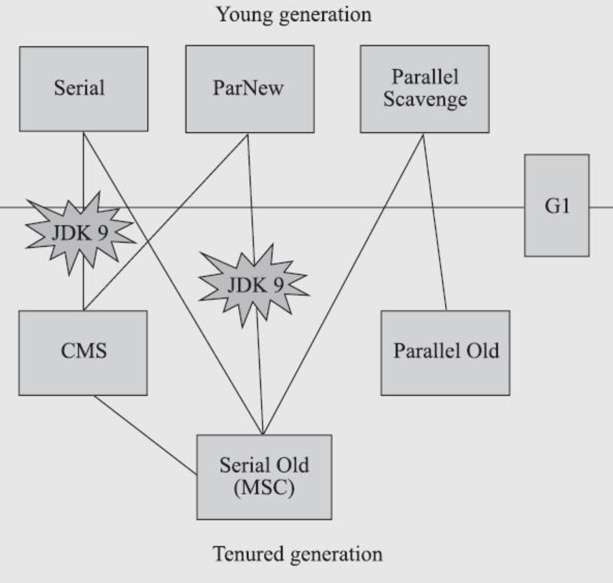

## Introduction

Java Garbage Collection is the process by which Java programs perform [automatic memory management](/docs/CS/memory/GC.md).

The garbage collection implementation lives in the JVM. Each JVM can implement its own version of garbage collection. 
However, it should meet the standard JVM specification of working with the objects present in the heap memory, marking or identifying the unreachable objects, and destroying them with compaction.

**What are Garbage Collection Roots in Java?**

Garbage collectors work on the concept of Garbage Collection Roots (GC Roots) to identify live and dead objects.
Examples of such Garbage Collection roots are:

- Classes loaded by system class loader (not custom class loaders) `ClassLoaderDataGraph::roots_cld_do`
- Live threads `Threads::possibly_parallel_oops_do`
- Local variables and parameters of the currently executing methods
- Local variables and parameters of JNI methods
- Global JNI reference `JNIHandles::oops_do`
- Objects used as a monitor for synchronization
- Objects held from garbage collection by JVM for its purposes
- CodeCache `CodeCache::blobs_do`

The garbage collector traverses the whole object graph in memory, starting from those Garbage Collection Roots and following references from the roots to other objects.

## Generation

Generational garbage collectors need to keep track of references from older to younger generations so that younger generations can be garbage-collected without inspecting every object in the older generation(s).
The set of locations potentially containing pointers to newer objects is often called the `remembered set`.

At every store, the system must ensure that the updated location is added to the `remembered set` if the store creates a reference from an older to a newer object.
This mechanism is usually referred to as a `write barrier` or `store check`.

1. Card Marking
2. Two-Instruction


See [G1 Roots](/docs/CS/Java/JDK/JVM/G1.md?id=roots)

Tri-color Marking

interceptor and JIT use Write Barrier to maintain Card Table

Premature Promotion

Promotion Failure

gcCause.cpp

### mark

- at oop like serial
- bitMap out of object like G1 Shenandoah
- Colored Pointer like ZGC

### Young Generation

Newly created objects start in the Young Generation. The Young Generation is further subdivided into:

- Eden space - all new objects start here, and initial memory is allocated to them
- Survivor spaces (FromSpace and ToSpace) - objects are moved here from Eden after surviving one garbage collection cycle.

When objects are garbage collected from the Young Generation, it is a `minor garbage collection` event.

When Eden space is filled with objects, a Minor GC is performed.
All the dead objects are deleted, and all the live objects are moved to one of the survivor spaces.
Minor GC also checks the objects in a survivor space, and moves them to the other survivor space.

Take the following sequence as an example:

- Eden has all objects (live and dead)
- Minor GC occurs - all dead objects are removed from Eden. All live objects are moved to S1 (FromSpace). Eden and S2 are now empty.
- New objects are created and added to Eden. Some objects in Eden and S1 become dead.
- Minor GC occurs - all dead objects are removed from Eden and S1. All live objects are moved to S2 (ToSpace). Eden and S1 are now empty.

So, at any time, one of the survivor spaces is always empty. When the surviving objects reach a certain threshold of moving around the survivor spaces, they are moved to the Old Generation.

You can use the `-Xmn` flag to set the size of the Young Generation.

default old/young=2:1

Eden:from:to=8:1:1

#### Handle Promotion

### Old Generation

Objects that are long-lived are eventually moved from the Young Generation to the Old Generation.
This is also known as Tenured Generation, and contains objects that have remained in the survivor spaces for a long time.

When objects are garbage collected from the Old Generation, it is a `major garbage collection` event.

You can use the -Xms and -Xmx flags to set the size of the initial and maximum size of the Heap memory.

### Intergenerational Reference Hypothesis

Remembered Set

- bits
- objects
- Card Table

False Sharing

```
  product(bool, UseCondCardMark, false,                                     \
          "Check for already marked card before updating card table")       \
```

## MetaSpace

Starting with Java 8, the MetaSpace memory space replaces the PermGen space. The implementation differs from the PermGen and this space of the heap is now automatically resized.

This avoids the problem of applications running out of memory due to the limited size of the PermGen space of the heap. The Metaspace memory can be garbage collected and the classes that are no longer used can be automatically cleaned when the Metaspace reaches its maximum size.

-Xnoclassgc -verbose:class -XX:+TraceClassLoading -XX:+TraceClassUnLoading

### Young GC 问题

```
-XX:+UsePSAdaptiveSurvivorSizePolicy

-XX:SurvivorRatio

-XX:TargetSurvivorRatio
```

Card Table

write barrier

```
CARD_TABLE [this address >> 9] = DIRTY;
```

-XX:+UseCondCardMark

#### YGC耗时异常

- toot对象扫描+标记时间过长
- 存活对象copy耗时较大
- 等待各线程到达安全点时间较长
- GC日志对GC时间的影响
- 操作系统活动影响（内存swap等）

### Full GC 问题

FGC频次异常

- 老年代空间不足
- 内存碎片化
- 永久代/元空间 空间不足
- 对象预估和担保
- 堆大小动态调整

is forwarded

```cpp

// Used only for markSweep, scavenging
bool oopDesc::is_gc_marked() const {
  return mark_raw()->is_marked();
}


// Used by scavengers
bool oopDesc::is_forwarded() const {
  // The extra heap check is needed since the obj might be locked, in which case the
  // mark would point to a stack location and have the sentinel bit cleared
  return mark_raw()->is_marked();
}


// Used by scavengers
void oopDesc::forward_to(oop p) {
  assert(check_obj_alignment(p),
         "forwarding to something not aligned");
  assert(Universe::heap()->is_in_reserved(p),
         "forwarding to something not in heap");
  assert(!is_archived_object(oop(this)) &&
         !is_archived_object(p),
         "forwarding archive object");
  markOop m = markOopDesc::encode_pointer_as_mark(p);
  assert(m->decode_pointer() == p, "encoding must be reversable");
  set_mark_raw(m);
}
```

## Collectors

Following Dijkstra *et al*, a garbage-collected program is divided into two semiindependent parts.

- The mutator executes application code, which allocates new objects and mutates the object graph by changing reference fields so that they refer to different destination objects.
  These reference fields may be contained in heap objects as well as other places known as roots, such as static variables, thread stacks, and so on.
  As a result of such reference updates, any object can end up disconnected from the roots, that is, unreachable by following any sequence of edges from the roots.
- The collector executes garbage collection code, which discovers unreachable objects and reclaims their storage.

A program may have more than one mutator thread, but the threads together can usually
be thought of as a single actor over the heap. Equally, there may be one or more collector
threads.

- [CMS](/docs/CS/Java/JDK/JVM/CMS.md)
- [G1](/docs/CS/Java/JDK/JVM/G1.md)
- [Shenandoah](/docs/CS/Java/JDK/JVM/Shenandoah.md)
- [ZGC](/docs/CS/Java/JDK/JVM/ZGC.md)

> See  gcConfiguration.cpp

young_collector

- G1New;
- ParallelScavenge;
- ParNew; -- CMS
- DefNew;

old_collector

- G1Old;
- ConcurrentMarkSweep;
- ParallelOld;
- Z;
- Shenandoah;
- SerialOld;

### Comparing garbage collectors

- Throughput
- Pause time
- Space
- Implementation
- Adaptive systems

From [JVM](https://book.douban.com/subject/34907497/):



And


[JEP 173: Retire Some Rarely-Used GC Combinations](https://openjdk.java.net/jeps/173)

CMS only with ParNew since [JEP 214: Remove GC Combinations Deprecated in JDK 8](https://openjdk.java.net/jeps/214)


| GC             | Optimized For              |
| ---------------- | ---------------------------- |
| Serial         | Memory Footprint           |
| Parallel       | Throughput                 |
| G1             | Throughput/Latency Balance |
| ZGC/Shenandoah | Low Latency                |

- Footprint
- Throughput
- Latency

[JEP 304: Garbage Collector Interface](https://openjdk.java.net/jeps/304)

[JEP 312: Thread-Local Handshakes](https://openjdk.java.net/jeps/312)

### Epsilon

Epsilon is a do-nothing (no-op) garbage collector that was released as part of JDK 11( see [JEP 318: Epsilon: A No-Op Garbage Collector](https://openjdk.java.net/jeps/318)).
It handles memory allocation but does not implement any actual memory reclamation mechanism.
Once the available Java heap is exhausted, the JVM shuts down.

### Serial

The serial collector uses a single thread to perform all garbage collection work, which makes it relatively efficient because there is no communication overhead between threads.

It's best-suited to single processor machines because it can't take advantage of multiprocessor hardware, although it can be useful on multiprocessors for applications with small data sets (up to approximately 100 MB).
The serial collector is selected by default on certain hardware and operating system configurations, or can be explicitly enabled with the option `-XX:+UseSerialGC`.

Cheney algorithm

Moon algorithm

#### Serial Old

- with Parallel JDK5
- CMS Concurrent Mode Failure

### Parallel Scavenge

The parallel collector is also known as throughput collector, it's a generational collector similar to the serial collector.
The primary difference between the serial and parallel collectors is that the parallel collector has multiple threads that are used to speed up garbage collection.

The parallel collector is intended for applications with medium-sized to large-sized data sets that are run on multiprocessor or multithreaded hardware.
You can enable it by using the `-XX:+UseParallelGC` option.

Parallel Scavenge and Parallel Old

```
- GCTimeRatio                               = 99
- MaxGCPauseMillis                          = 18446744073709551615


- UseParallelGC                            := true
- UseParallelOldGC                          = true
- UseAdaptiveGCBoundary                     = false
```

see [Garbage Collector Ergonomics](https://docs.oracle.com/javase/7/docs/technotes/guides/vm/gc-ergonomics.html)

### Concurrent

The mostly concurrent collector trades processor resources (which would otherwise be available to the application) for shorter major collection pause times. The most visible overhead is the use of one or more processors during the concurrent parts of the collection. On an N processor system, the concurrent part of the collection will use K/N of the available processors, where 1<=K<=ceiling{N/4}. (Note that the precise choice of and bounds on K are subject to change.) In addition to the use of processors during concurrent phases, additional overhead is incurred to enable concurrency. Thus while garbage collection pauses are typically much shorter with the concurrent collector, application throughput also tends to be slightly lower than with the other collectors.

On a machine with more than one processing core, processors are available for application threads during the concurrent part of the collection, so the concurrent garbage collector thread does not "pause" the application. This usually results in shorter pauses, but again fewer processor resources are available to the application and some slowdown should be expected, especially if the application uses all of the processing cores maximally. As N increases, the reduction in processor resources due to concurrent garbage collection becomes smaller, and the benefit from concurrent collection increases. The section Concurrent Mode Failure in Concurrent Mark Sweep (CMS) Collector discusses potential limits to such scaling.

Because at least one processor is used for garbage collection during the concurrent phases, the concurrent collectors do not normally provide any benefit on a uniprocessor (single-core) machine. However, there is a separate mode available for CMS (not G1) that can achieve low pauses on systems with only one or two processors; see Incremental Mode in Concurrent Mark Sweep (CMS) Collector for details. This feature is being deprecated in Java SE 8 and may be removed in a later major release.

### CMS

[JEP 291: Deprecate the Concurrent Mark Sweep (CMS) Garbage Collector](https://openjdk.java.net/jeps/291)

### G1

[G1GC](/docs/CS/Java/JDK/JVM/G1.md) was intended as a replacement for CMS and was designed for multi-threaded applications that have a large heap size available (more than 4GB). 
It is parallel and concurrent like CMS, but it works quite differently under the hood compared to the older garbage collectors.


### Shenandoah

Shenandoah is a new GC that was released as part of JDK 12.
Shenandoah’s key advantage over G1 is that it does more of its garbage collection cycle work concurrently with the application threads.
G1 can evacuate its heap regions only when the application is paused, while Shenandoah can relocate objects concurrently with the application.

Shenandoah can compact live objects, clean garbage, and release RAM back to the OS almost immediately after detecting free memory.
Since all of this happens concurrently while the application is running, Shenandoah is more CPU intensive.

The JVM argument to use the Epsilon Garbage Collector is `-XX:+UnlockExperimentalVMOptions -XX:+UseShenandoahGC`.

[JEP 189: Shenandoah: A Low-Pause-Time Garbage Collector (Experimental)](https://openjdk.java.net/jeps/189)

**Connection Matrix** for InterRegional Reference Hypothesis

### ZGC

[JEP 333: ZGC: A Scalable Low-Latency Garbage Collector (Experimental)](https://openjdk.java.net/jeps/333)

The Z Garbage Collector (ZGC) is a scalable low latency garbage collector. ZGC performs all expensive work concurrently, without stopping the execution of application threads.

ZGC is intended for applications which require low latency (less than 10 ms pauses) and/or use a very large heap (multi-terabytes). You can enable is by using the -XX:+UseZGC option.

ZGC is available as an experimental feature, starting with JDK 11 and has been improved in JDK 12. It is intended for applications which require low latency (less than 10 ms pauses) and/or use a very large heap (multi-terabytes).

The primary goals of ZGC are low latency, scalability, and ease of use. To achieve this, ZGC allows a Java application to continue running while it performs all garbage collection operations. By default, ZGC uncommits unused memory and returns it to the operating system.

The JVM argument to use the Epsilon Garbage Collector is `-XX:+UnlockExperimentalVMOptions -XX:+UseZGC`.

### How to Select the Right Garbage Collector


Most of the time, the default settings should work just fine.
If necessary, you can adjust the heap size to improve performance. 
If the performance still doesn't meet your goals, you can modify the collector as per your application requirements:

- Serial - If the application has a small data set (up to approximately 100 MB) and/or it will be run on a single processor with no pause-time requirements
- Parallel - If peak application performance is the priority and there are no pause-time requirements or pauses of one second or longer are acceptable
- CMS/G1 - If response time is more important than overall throughput and garbage collection pauses must be kept shorter than approximately one second
- ZGC - If response time is a high priority, and/or you are using a very large heap

## Links

- [Garbage Collection](/docs/CS/memory/GC.md)
- [JVM](/docs/CS/Java/JDK/JVM/JVM.md)

## References

1. [Unnecessary GCLocker-initiated young GCs](https://bugs.openjdk.java.net/browse/JDK-8048556)
2. [Exploiting the Weak Generational Hypothesis for Write Reduction and Object Recycling](https://openscholarship.wustl.edu/eng_etds/169/)
3. [Java Platform, Standard Edition HotSpot Virtual Machine Garbage Collection Tuning Guide](https://docs.oracle.com/javase/8/docs/technotes/guides/vm/gctuning/toc.html)
4. [Our Collectors](https://blogs.oracle.com/jonthecollector/our-collectors)
5. [Garbage Collection in Java – What is GC and How it Works in the JVM](https://www.freecodecamp.org/news/garbage-collection-in-java-what-is-gc-and-how-it-works-in-the-jvm/)
6. [HotSpot Virtual Machine Garbage Collection Tuning Guide - JDK11](https://docs.oracle.com/en/java/javase/11/gctuning/index.html)
7. [HotSpot Storage Management](https://openjdk.java.net/groups/hotspot/docs/StorageManagement.html)
