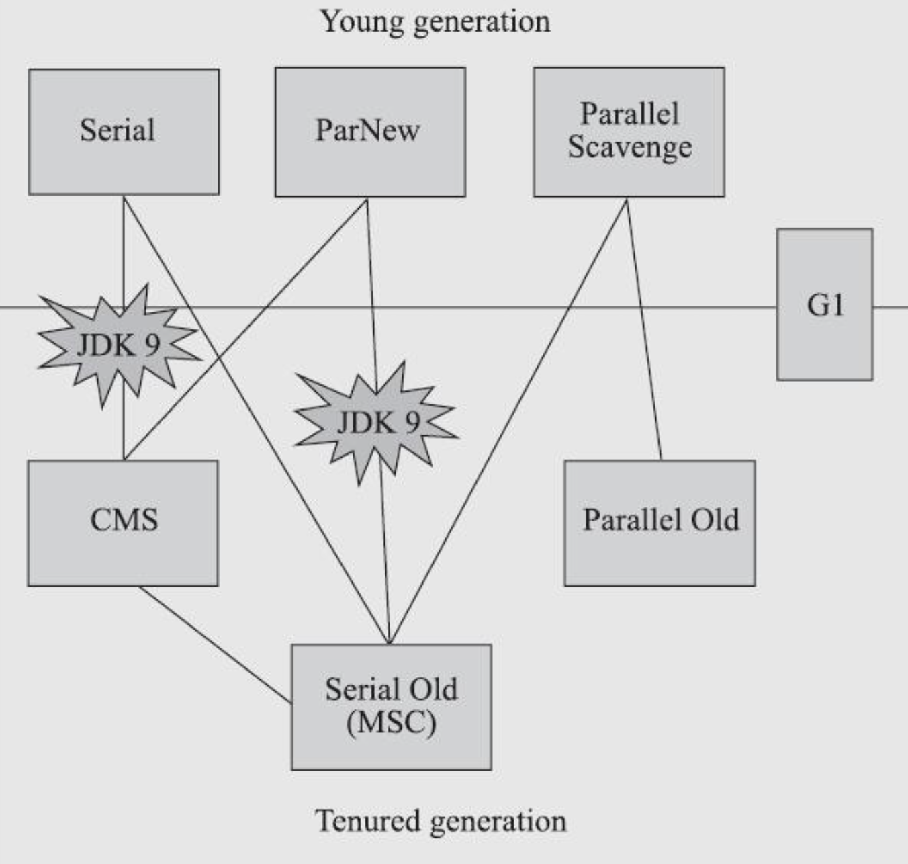

## Introduction

Java Garbage Collection is the process by which Java programs perform [automatic memory management](/docs/CS/memory/GC.md).

The garbage collection implementation lives in the JVM. Each JVM can implement its own version of garbage collection. 
However, it should meet the standard JVM specification of working with the objects present in the heap memory, marking or identifying the unreachable objects, and destroying them with compaction.

## GC Algorithms

Recall the [gc algorithms](/docs/CS/memory/GC.md?id=Tracing-garbage-collection), the JVM using tracing.

**What are Garbage Collection Roots in Java?**

Garbage collectors work on the concept of Garbage Collection Roots (GC Roots) to identify live and dead objects.
Examples of such Garbage Collection roots are:

- Classes loaded by system class loader (not custom class loaders) `ClassLoaderDataGraph::roots_cld_do`
- Live threads `Threads::possibly_parallel_oops_do`
- Local variables and parameters of the currently executing methods
- Local variables and parameters of JNI methods
- Global JNI reference `JNIHandles::oops_do`
- Objects used as a monitor for synchronization
- Objects held from garbage collection by JVM for its purposes
- CodeCache `CodeCache::blobs_do`

The garbage collector traverses the whole object graph in memory, starting from those Garbage Collection Roots and following references from the roots to other objects.


JDK 10中的JEP 304: Garbage Collector Interface发布后，GC代码可读性提升很多。 
`/src/hotspot/share/gc/` 目录下按不同的GC算法分目录存放，shared目录下为通用代码和接口

## Generation

Generational garbage collectors need to keep track of references from older to younger generations so that younger generations can be garbage-collected without inspecting every object in the older generation(s).
The set of locations potentially containing pointers to newer objects is often called the `remembered set`.

At every store, the system must ensure that the updated location is added to the `remembered set` if the store creates a reference from an older to a newer object.
This mechanism is usually referred to as a `write barrier` or `store check`.

1. Card Marking
2. Two-Instruction


See [G1 Roots](/docs/CS/Java/JDK/JVM/GC/G1.md?id=roots)

Tri-color Marking

interceptor and JIT use Write Barrier to maintain Card Table

Premature Promotion

Promotion Failure

gcCause.cpp

### mark

- at oop like serial
- bitMap out of object like G1 Shenandoah
- Colored Pointer like ZGC

### Young Generation

新创建的对象从 Young Generation 开始。Young Generation 进一步细分为：

- Eden 空间 - 所有新对象从这里开始，初始内存分配给他们
- Survivor 空间（FromSpace 和 ToSpace） - 对象在经历一次垃圾回收周期后从 Eden 移到这里

当对象从 Young Generation 被垃圾回收时，这是一个 `minor garbage collection` 事件。

当 Eden 空间被对象填满时，执行 Minor GC。
所有死亡对象被删除，所有存活对象被移动到其中一个 survivor 空间。
Minor GC 还会检查 survivor 空间中的对象，并将它们移动到另一个 survivor 空间。

以下列序列为例：

- Eden 包含所有对象（存活和死亡）
- Minor GC 发生 - 所有死亡对象从 Eden 中移除。所有存活对象移动到 S1（FromSpace）。Eden 和 S2 现在为空。
- 新对象被创建并添加到 Eden。Eden 和 S1 中的一些对象变为死亡。
- Minor GC 发生 - 所有死亡对象从 Eden 和 S1 中移除。所有存活对象移动到 S2（ToSpace）。Eden 和 S1 现在为空。

因此，在任何时候，其中一个 survivor 空间始终为空。当存活对象在 survivor 空间之间移动达到一定阈值时，它们被移动到 Old Generation。

可以使用 `-Xmn` 标志设置 Young Generation 的大小。

默认 old/young=2:1

Eden:from:to=8:1:1

#### Handle Promotion

当HandlePromotionFailure设置true 允许
否则进行Full GC


### Old Generation

长期存活的对象最终从 Young Generation 移动到 Old Generation。
这也称为 Tenured Generation，包含在 survivor 空间中停留了很长时间的对象。

当对象从 Old Generation 被垃圾回收时，这是一个 `major garbage collection` 事件。

可以使用 -Xms 和 -Xmx 标志设置堆内存的初始和最大大小。

### Intergenerational Reference Hypothesis

Remembered Set

- bits
- objects
- Card Table

False Sharing

```
  product(bool, UseCondCardMark, false,                                     \
          "Check for already marked card before updating card table")       \
```

## MetaSpace

从 Java 8 开始，MetaSpace 内存空间取代了 PermGen 空间。
其实现与 PermGen 不同，堆的此空间现在自动调整大小。

这避免了应用程序由于堆的 PermGen 空间大小限制而耗尽内存的问题。
Metaspace 内存可以被垃圾回收，当 Metaspace 达到其最大大小时，不再使用的类可以自动清理。
```
-Xnoclassgc -verbose:class -XX:+TraceClassLoading -XX:+TraceClassUnLoading -XX:+ClassUnloadingWithConcurrentMark -XX:+PrintAdaptiveSizePolicy
```


## allocate

对于 HotSpot JVM 实现，所有的 GC 算法的实现都是一种对于堆内存的管理，也就是都实现了一种堆的抽象，它们都实现了接口 CollectedHeap


## Young GC 问题


If it takes long time, check the size
```
-XX:+UsePSAdaptiveSurvivorSizePolicy

-XX:SurvivorRatio

-XX:TargetSurvivorRatio
```

Card Table

write barrier

```
CARD_TABLE [this address >> 9] = DIRTY;
```

-XX:+UseCondCardMark


-XX:+PrintReferenceGC


-XX:+ParallelRefProcEnabled

#### YGC耗时异常

- toot对象扫描+标记时间过长
- 存活对象copy耗时较大
- 等待各线程到达安全点时间较长
- GC日志对GC时间的影响
- 操作系统活动影响（内存swap等）

## Full GC


FGC频次异常

- 老年代空间不足
- 内存碎片化
- 永久代/元空间 空间不足
- 对象预估和担保
- 堆大小动态调整

is forwarded

```cpp

// Used only for markSweep, scavenging
bool oopDesc::is_gc_marked() const {
  return mark_raw()->is_marked();
}


// Used by scavengers
bool oopDesc::is_forwarded() const {
  // The extra heap check is needed since the obj might be locked, in which case the
  // mark would point to a stack location and have the sentinel bit cleared
  return mark_raw()->is_marked();
}


// Used by scavengers
void oopDesc::forward_to(oop p) {
  markOop m = markOopDesc::encode_pointer_as_mark(p);
  set_mark_raw(m);
}
```


### System.gc

```java
public final class System {
   public static void gc() {
        Runtime.getRuntime().gc();
    }
}

public class Runtime {
 		public native void gc();
}
```

Differenct heap will execute `collect` method if `!DisableExplicitGC`.

- Some collectors will execute concurrentFullGC if `-XX:+ExplicitGCInvokesConcurrent`

```cpp
// Runtime.c
JNIEXPORT void JNICALL
Java_java_lang_Runtime_gc(JNIEnv *env, jobject this)
{
    JVM_GC();
}

// jvm.cpp
JVM_ENTRY_NO_ENV(void, JVM_GC(void))
  if (!DisableExplicitGC) {
    EventSystemGC event;
    event.set_invokedConcurrent(ExplicitGCInvokesConcurrent);
    Universe::heap()->collect(GCCause::_java_lang_system_gc);
    event.commit();
  }
JVM_END
```


## Collectors

根据 Dijkstra *et al*，垃圾回收程序分为两个半独立部分。

- mutator 执行应用程序代码，分配新对象并通过更改引用字段来改变对象图，使它们指向不同的目标对象。
  这些引用字段可能包含在堆对象中以及其他称为根的地方，例如静态变量、线程栈等。
  由于这种引用更新，任何对象都可能最终与根断开连接，即通过从根出发的任何边序列都无法到达。
- collector 执行垃圾回收代码，发现不可达对象并回收其存储。

程序可能有多个 mutator 线程，但这些线程通常可以被视为堆上的单个执行者。
同样，可能有一个或多个 collector 线程。

### Comparing garbage collectors

- Throughput
- Pause time
- Space
- Implementation
- Adaptive systems

From [JVM](https://book.douban.com/subject/34907497/):



And


JDK 8默认搜集器为 Parallel GC 
- Young区采用 Parallel Scavenge
- 老年代采用 Parallel Old 进行收集

吞吐量优先，一般适用于后台任务型服务器 比如批量订单处理、科学计算等对吞吐量敏感，对时延不敏感的场景


- [CMS](/docs/CS/Java/JDK/JVM/GC/CMS.md)(removed since JDK14)
- [G1](/docs/CS/Java/JDK/JVM/GC/G1.md)
- [Shenandoah](/docs/CS/Java/JDK/JVM/GC/Shenandoah.md)
- [ZGC](/docs/CS/Java/JDK/JVM/GC/ZGC.md)

> See  gcConfiguration.cpp

young_collector

- G1New;
- ParallelScavenge;
- ParNew; -- CMS
- DefNew;

old_collector

- G1Old;
- ConcurrentMarkSweep;
- ParallelOld;
- Z;
- Shenandoah;
- SerialOld;

[JEP 173: Retire Some Rarely-Used GC Combinations](https://openjdk.java.net/jeps/173)

CMS only with ParNew since [JEP 214: Remove GC Combinations Deprecated in JDK 8](https://openjdk.java.net/jeps/214)


| GC             | Optimized For              |
| ---------------- | ---------------------------- |
| Serial         | Memory Footprint           |
| Parallel       | Throughput                 |
| G1             | Throughput/Latency Balance |
| ZGC/Shenandoah | Low Latency                |

- Footprint
- Throughput
- Latency

[JEP 304: Garbage Collector Interface](https://openjdk.java.net/jeps/304)

[JEP 312: Thread-Local Handshakes](https://openjdk.java.net/jeps/312)

### Epsilon

Epsilon is a do-nothing (no-op) garbage collector that was released as part of JDK 11( see [JEP 318: Epsilon: A No-Op Garbage Collector](https://openjdk.java.net/jeps/318)).
It handles memory allocation but does not implement any actual memory reclamation mechanism.
Once the available Java heap is exhausted, the JVM shuts down.

### Serial

The serial collector uses a single thread to perform all garbage collection work, which makes it relatively efficient because there is no communication overhead between threads.

It's best-suited to single processor machines because it can't take advantage of multiprocessor hardware, although it can be useful on multiprocessors for applications with small data sets (up to approximately 100 MB).
The serial collector is selected by default on certain hardware and operating system configurations, or can be explicitly enabled with the option `-XX:+UseSerialGC`.

Cheney algorithm

Moon algorithm

#### Serial Old

- with Parallel JDK5
- CMS Concurrent Mode Failure

### Parallel Scavenge

The parallel collector is also known as throughput collector, it's a generational collector similar to the serial collector.
The primary difference between the serial and parallel collectors is that the parallel collector has multiple threads that are used to speed up garbage collection.

The parallel collector is intended for applications with medium-sized to large-sized data sets that are run on multiprocessor or multithreaded hardware.
You can enable it by using the `-XX:+UseParallelGC` option.

Parallel Scavenge and Parallel Old

```
- GCTimeRatio                               = 99
- MaxGCPauseMillis                          = 18446744073709551615


- UseParallelGC                            := true
- UseParallelOldGC                          = true
- UseAdaptiveGCBoundary                     = false
```

see [Garbage Collector Ergonomics](https://docs.oracle.com/javase/7/docs/technotes/guides/vm/gc-ergonomics.html)

ParNew和Parallel Scavenge是两种不同的Java虚拟机垃圾收集器，主要用于新生代的垃圾收集。
它们的主要区别包括:

1. 默认的配合的老年代收集器不同
   ParNew收集器通常与CMS收集器配合使用，作为CMS的默认新生代收集器。而Parallel Scavenge收集器通常与Parallel Old收集器配合，形成整个Parallel收集策略
2. 目标和应用场景的差异
   ParNew注重的是降低暂停时间，因此更适合需要低延迟的应用，如Web服务器、交互式应用等。而Parallel Scavenge注重高吞吐量，更适合后台运算为主的场景，如大型计算任务、批处理等。
3. 暂停时间和吞吐量的考虑
   ParNew为了保证低延迟，可能会牺牲部分吞吐量。而Parallel Scavenge则相反，它会牺牲部分延迟来保证最大的吞吐量。
4. 自适应调节的能力
   Parallel Scavenge具有自适应调节策略（-XX:+UseAdaptiveSizePolicy），能够根据系统的实际运行情况调整各个区域的大小及目标暂停时间。ParNew没有这种自适应机制。
5. 与CMS和G1收集器的互动
   ParNew与CMS的结合相对紧密，它们共同为低延迟场景提供服务。而Parallel Scavenge并不适合与CMS配合，但在Java 8及之前，它是与G1收集器配合的一个选项

### Concurrent

The mostly concurrent collector trades processor resources (which would otherwise be available to the application) for shorter major collection pause times. The most visible overhead is the use of one or more processors during the concurrent parts of the collection. On an N processor system, the concurrent part of the collection will use K/N of the available processors, where 1<=K<=ceiling{N/4}. (Note that the precise choice of and bounds on K are subject to change.) In addition to the use of processors during concurrent phases, additional overhead is incurred to enable concurrency. Thus while garbage collection pauses are typically much shorter with the concurrent collector, application throughput also tends to be slightly lower than with the other collectors.

On a machine with more than one processing core, processors are available for application threads during the concurrent part of the collection, so the concurrent garbage collector thread does not "pause" the application. This usually results in shorter pauses, but again fewer processor resources are available to the application and some slowdown should be expected, especially if the application uses all of the processing cores maximally. As N increases, the reduction in processor resources due to concurrent garbage collection becomes smaller, and the benefit from concurrent collection increases. The section Concurrent Mode Failure in Concurrent Mark Sweep (CMS) Collector discusses potential limits to such scaling.

Because at least one processor is used for garbage collection during the concurrent phases, the concurrent collectors do not normally provide any benefit on a uniprocessor (single-core) machine. However, there is a separate mode available for CMS (not G1) that can achieve low pauses on systems with only one or two processors; see Incremental Mode in Concurrent Mark Sweep (CMS) Collector for details. This feature is being deprecated in Java SE 8 and may be removed in a later major release.

### CMS

[JEP 291: Deprecate the Concurrent Mark Sweep (CMS) Garbage Collector](https://openjdk.java.net/jeps/291)

### G1

[G1GC](/docs/CS/Java/JDK/JVM/GC/G1.md) was intended as a replacement for CMS and was designed for multi-threaded applications that have a large heap size available (more than 4GB). 
It is parallel and concurrent like CMS, but it works quite differently under the hood compared to the older garbage collectors.


### Shenandoah

Shenandoah is a new GC that was released as part of JDK 12.
Shenandoah’s key advantage over G1 is that it does more of its garbage collection cycle work concurrently with the application threads.
G1 can evacuate its heap regions only when the application is paused, while Shenandoah can relocate objects concurrently with the application.

Shenandoah can compact live objects, clean garbage, and release RAM back to the OS almost immediately after detecting free memory.
Since all of this happens concurrently while the application is running, Shenandoah is more CPU intensive.

The JVM argument to use the Epsilon Garbage Collector is `-XX:+UnlockExperimentalVMOptions -XX:+UseShenandoahGC`.

[JEP 189: Shenandoah: A Low-Pause-Time Garbage Collector (Experimental)](https://openjdk.java.net/jeps/189)

**Connection Matrix** for InterRegional Reference Hypothesis

### ZGC

[JEP 333: ZGC: A Scalable Low-Latency Garbage Collector (Experimental)](https://openjdk.java.net/jeps/333)

The Z Garbage Collector (ZGC) is a scalable low latency garbage collector. ZGC performs all expensive work concurrently, without stopping the execution of application threads.

ZGC is intended for applications which require low latency (less than 10 ms pauses) and/or use a very large heap (multi-terabytes). You can enable is by using the -XX:+UseZGC option.

ZGC is available as an experimental feature, starting with JDK 11 and has been improved in JDK 12. It is intended for applications which require low latency (less than 10 ms pauses) and/or use a very large heap (multi-terabytes).

The primary goals of ZGC are low latency, scalability, and ease of use. To achieve this, ZGC allows a Java application to continue running while it performs all garbage collection operations. By default, ZGC uncommits unused memory and returns it to the operating system.

The JVM argument to use the Epsilon Garbage Collector is `-XX:+UnlockExperimentalVMOptions -XX:+UseZGC`.

### How to Select the Right Garbage Collector


Most of the time, the default settings should work just fine.
If necessary, you can adjust the heap size to improve performance. 
If the performance still doesn't meet your goals, you can modify the collector as per your application requirements:

- Serial - If the application has a small data set (up to approximately 100 MB) and/or it will be run on a single processor with no pause-time requirements
- Parallel - If peak application performance is the priority and there are no pause-time requirements or pauses of one second or longer are acceptable
- CMS/G1 - If response time is more important than overall throughput and garbage collection pauses must be kept shorter than approximately one second
- ZGC - If response time is a high priority, and/or you are using a very large heap

### Collector tuning

Parameters:

- ParallelGCThreads
- ConcGCThreads

UseAdaptiveSizePolicy

MaxGCPauseMillis

GCTimeRatio

- MaxHeapSize/Xmx
- MinHeapSize/Xms
- NewSize/Xmn

- TLABSize
- YoungPLABSize/OldOLABSize

The JVM can be blocked for substantial time periods when disk IO is heavy.
JVM GC needs to log GC activities by issuing write() system calls;
Such write() calls can be blocked due to background disk IO;
GC logging is on the JVM pausing path, hence the time taken by write() calls contribute to JVM STW pauses.

For latency-sensitive applications, an immediate solution should be avoiding the IO contention by putting the GC log file on a separate HDD or high-performing disk such as SSD.


## memory leak

内存泄漏是指无用对象（不再使用的对象）持续占有内存或无用对象的内存得不到及时释放，从而造成内存空间的浪费称为内存泄漏
内存泄露有时不严重且不易察觉，这样开发者就不知道存在内存泄露，需要自主观察，比较严重的时候，没有内存可以分配，直接oom


常见的内存泄露

Metaspace

如果一个应用加载了大量的class, 那么Perm区存储的信息一般会比较大.另外大量的intern String对象也会导致该区不断增长。

比较常见的一个是Groovy动态编译class造成泄露

Heap


静态集合类引起内存泄露

监听器：但往往在释放对象的时候却没有记住去删除这些监听器，从而增加了内存泄漏的机会。

各种连接，数据库、网络、IO等

内部类和外部模块等的引用：内部类的引用是比较容易遗忘的一种，而且一旦没释放可能导致一系列的后继类对象没有释放。非静态内部类的对象会隐式强引用其外围对象，所以在内部类未释放时，外围对象也不会被释放，从而造成内存泄漏


## Tuning


GC log

-XX:+PrintGCDetails


年轻代的内存使用率处在高位，导致频繁的 Minor GC，而频繁 GC 的效率又不高，说明对象没那么快能被回收，这时年轻代可以适当调大一点

年老代的内存使用率处在高位，导致频繁的 Full GC，这样分两种情况：
- 如果每次 Full GC 后年老代的内存占用率没有下来，可以怀疑是内存泄漏；
- 如果 Full GC 后年老代的内存占用率下来了，说明不是内存泄漏，我们要考虑调大年老代


### OOM

- heap
- GC overhead 考虑内存泄漏
- Requested array size exceeds VM limit 大数组分配
- MetaSpace
- Request size bytes for reason. Out of swap space
- Unable to create native threads


## Links

- [Garbage Collection](/docs/CS/memory/GC.md)
- [JVM](/docs/CS/Java/JDK/JVM/JVM.md)

## References

1. [Unnecessary GCLocker-initiated young GCs](https://bugs.openjdk.java.net/browse/JDK-8048556)
2. [Exploiting the Weak Generational Hypothesis for Write Reduction and Object Recycling](https://openscholarship.wustl.edu/eng_etds/169/)
3. [Java Platform, Standard Edition HotSpot Virtual Machine Garbage Collection Tuning Guide](https://docs.oracle.com/javase/8/docs/technotes/guides/vm/gctuning/toc.html)
4. [Our Collectors](https://blogs.oracle.com/jonthecollector/our-collectors)
5. [Garbage Collection in Java – What is GC and How it Works in the JVM](https://www.freecodecamp.org/news/garbage-collection-in-java-what-is-gc-and-how-it-works-in-the-jvm/)
6. [HotSpot Virtual Machine Garbage Collection Tuning Guide - JDK11](https://docs.oracle.com/en/java/javase/11/gctuning/index.html)
7. [HotSpot Storage Management](https://openjdk.java.net/groups/hotspot/docs/StorageManagement.html)
8. [Eliminating Large JVM GC Pauses Caused by Background IO Traffic](https://www.linkedin.com/blog/engineering/archive/eliminating-large-jvm-gc-pauses-caused-by-background-io-traffic)
