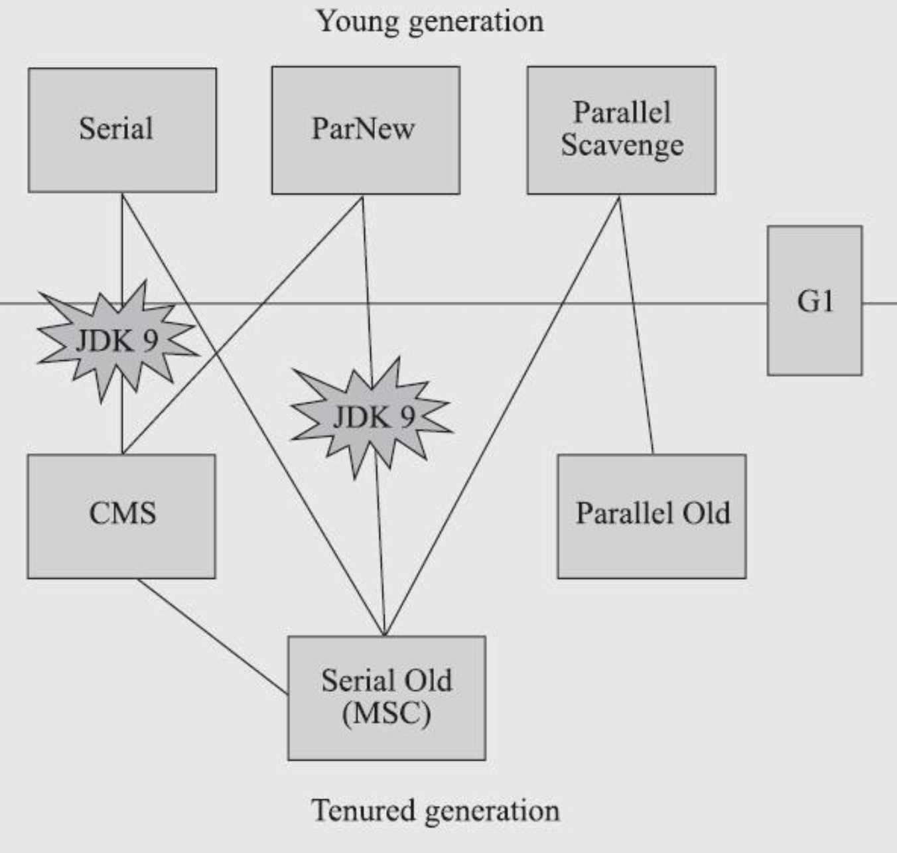
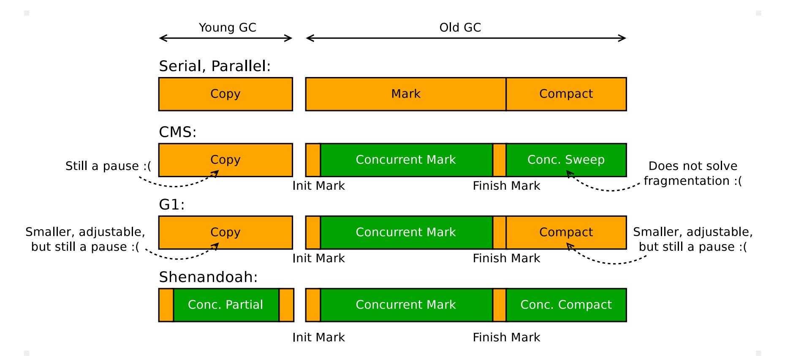

## Introduction

Java Garbage Collection is the process by which Java programs perform [automatic memory management](/docs/CS/memory/GC.md).

The garbage collection implementation lives in the JVM. Each JVM can implement its own version of garbage collection. 
However, it should meet the standard JVM specification of working with the objects present in the heap memory, marking or identifying the unreachable objects, and destroying them with compaction.

## GC Algorithms

Recall the [gc algorithms](/docs/CS/memory/GC.md?id=tracing-garbage-collection), the JVM using tracing.

**What are Garbage Collection Roots in Java?**

Garbage collectors work on the concept of Garbage Collection Roots (GC Roots) to identify live and dead objects.
Examples of such Garbage Collection roots are:

- Classes loaded by system class loader (not custom class loaders) `ClassLoaderDataGraph::roots_cld_do`
- Live threads `Threads::possibly_parallel_oops_do`
- Local variables and parameters of the currently executing methods
- Local variables and parameters of JNI methods
- Global JNI reference `JNIHandles::oops_do`
- Objects used as a monitor for synchronization
- Objects held from garbage collection by JVM for its purposes
- CodeCache `CodeCache::blobs_do`

The garbage collector traverses the whole object graph in memory, starting from those Garbage Collection Roots and following references from the roots to other objects.


JDK 10中的JEP 304: Garbage Collector Interface发布后，GC代码可读性提升很多。 
`/src/hotspot/share/gc/` 目录下按不同的GC算法分目录存放，shared目录下为通用代码和接口

## Generation

Generational garbage collectors need to keep track of references from older to younger generations so that younger generations can be garbage-collected without inspecting every object in the older generation(s).
The set of locations potentially containing pointers to newer objects is often called the `remembered set`.

At every store, the system must ensure that the updated location is added to the `remembered set` if the store creates a reference from an older to a newer object.
This mechanism is usually referred to as a `write barrier` or `store check`.

1. Card Marking
2. Two-Instruction


See [G1 Roots](/docs/CS/Java/JDK/JVM/GC/G1.md?id=roots)

Tri-color Marking

interceptor and JIT use Write Barrier to maintain Card Table

Premature Promotion

Promotion Failure

gcCause.cpp

### mark

- at oop like serial
- bitMap out of object like G1 Shenandoah
- Colored Pointer like ZGC

### Young Generation

Newly created objects start in the Young Generation. The Young Generation is further subdivided into:

- Eden space - all new objects start here, and initial memory is allocated to them
- Survivor spaces (FromSpace and ToSpace) - objects are moved here from Eden after surviving one garbage collection cycle.

When objects are garbage collected from the Young Generation, it is a `minor garbage collection` event.

When Eden space is filled with objects, a Minor GC is performed.
All the dead objects are deleted, and all the live objects are moved to one of the survivor spaces.
Minor GC also checks the objects in a survivor space, and moves them to the other survivor space.

Take the following sequence as an example:

- Eden has all objects (live and dead)
- Minor GC occurs - all dead objects are removed from Eden. All live objects are moved to S1 (FromSpace). Eden and S2 are now empty.
- New objects are created and added to Eden. Some objects in Eden and S1 become dead.
- Minor GC occurs - all dead objects are removed from Eden and S1. All live objects are moved to S2 (ToSpace). Eden and S1 are now empty.

So, at any time, one of the survivor spaces is always empty. When the surviving objects reach a certain threshold of moving around the survivor spaces, they are moved to the Old Generation.

You can use the `-Xmn` flag to set the size of the Young Generation.

default old/young=2:1

Eden:from:to=8:1:1

#### Handle Promotion

当HandlePromotionFailure设置true 允许
否则进行Full GC


### Old Generation

Objects that are long-lived are eventually moved from the Young Generation to the Old Generation.
This is also known as Tenured Generation, and contains objects that have remained in the survivor spaces for a long time.

When objects are garbage collected from the Old Generation, it is a `major garbage collection` event.

You can use the -Xms and -Xmx flags to set the size of the initial and maximum size of the Heap memory.

### Intergenerational Reference Hypothesis

Remembered Set

- bits
- objects
- Card Table

False Sharing

```
  product(bool, UseCondCardMark, false,                                     \
          "Check for already marked card before updating card table")       \
```

## MetaSpace

Starting with Java 8, the MetaSpace memory space replaces the PermGen space. 
The implementation differs from the PermGen and this space of the heap is now automatically resized.

This avoids the problem of applications running out of memory due to the limited size of the PermGen space of the heap. 
The Metaspace memory can be garbage collected and the classes that are no longer used can be automatically cleaned when the Metaspace reaches its maximum size.
```
-Xnoclassgc -verbose:class -XX:+TraceClassLoading -XX:+TraceClassUnLoading -XX:+ClassUnloadingWithConcurrentMark -XX:+PrintAdaptiveSizePolicy
```


## allocate

对于 HotSpot JVM 实现，所有的 GC 算法的实现都是一种对于堆内存的管理，也就是都实现了一种堆的抽象，它们都实现了接口 CollectedHeap


## Young GC Issues


If it takes long time, check the size
```
-XX:+UsePSAdaptiveSurvivorSizePolicy

-XX:SurvivorRatio

-XX:TargetSurvivorRatio
```

Card Table

write barrier

```
CARD_TABLE [this address >> 9] = DIRTY;
```

-XX:+UseCondCardMark


-XX:+PrintReferenceGC


-XX:+ParallelRefProcEnabled

#### YGC Duration Anomaly

- toot对象扫描+标记时间过长
- 存活对象copy耗时较大
- 等待各线程到达安全点时间较长
- GC日志对GC时间的影响
- 操作系统活动影响（内存swap等）

## Full GC


FGC频次异常

- 老年代空间不足
- 内存碎片化
- 永久代/元空间 空间不足
- 对象预估和担保
- 堆大小动态调整

is forwarded

```cpp

// Used only for markSweep, scavenging
bool oopDesc::is_gc_marked() const {
  return mark_raw()->is_marked();
}


// Used by scavengers
bool oopDesc::is_forwarded() const {
  // The extra heap check is needed since the obj might be locked, in which case the
  // mark would point to a stack location and have the sentinel bit cleared
  return mark_raw()->is_marked();
}


// Used by scavengers
void oopDesc::forward_to(oop p) {
  markOop m = markOopDesc::encode_pointer_as_mark(p);
  set_mark_raw(m);
}
```


### System.gc

```java
public final class System {
   public static void gc() {
        Runtime.getRuntime().gc();
    }
}

public class Runtime {
 		public native void gc();
}
```

Differenct heap will execute `collect` method if `!DisableExplicitGC`.

- Some collectors will execute concurrentFullGC if `-XX:+ExplicitGCInvokesConcurrent`

```cpp
// Runtime.c
JNIEXPORT void JNICALL
Java_java_lang_Runtime_gc(JNIEnv *env, jobject this)
{
    JVM_GC();
}

// jvm.cpp
JVM_ENTRY_NO_ENV(void, JVM_GC(void))
  if (!DisableExplicitGC) {
    EventSystemGC event;
    event.set_invokedConcurrent(ExplicitGCInvokesConcurrent);
    Universe::heap()->collect(GCCause::_java_lang_system_gc);
    event.commit();
  }
JVM_END
```


## Correctness of Concurrent Marking: Tri-color Marking, SATB and Incremental Update

并发标记（concurrent marking）指 GC 在**不暂停应用线程（mutator）**的情况下遍历对象图、判定对象存活。难点在于：标记线程与应用线程同时运行，应用随时可能修改引用关系，普通的"标记完即回收"会导致存活对象被误回收。HotSpot 用**三色标记（Tri-color Marking）**建模，并依赖写屏障保证两种正确性算法之一成立。

### Tri-color Marking Abstraction

把堆中对象按标记进度染成三种颜色：

| 颜色 | 含义 |
| :--- | :--- |
| 白（White） | 尚未被标记线程访问；标记结束时仍为白色的对象被判定为垃圾 |
| 灰（Gray） | 自身已被访问，但其引用的对象尚未全部扫描完 |
| 黑（Black） | 自身及所有可达引用都已被扫描，确认存活 |

标记从 GC Roots 出发：Root 直接可达对象置灰，扫描灰对象引用的子对象、把它们置灰，灰对象引用全部扫完后置黑；如此推进直到无灰对象。白对象即不可达。

### Missing Marking Problem Caused by Concurrency

若标记过程中应用线程（mutator）做了以下任意一件，会破坏"黑=确认存活"的不变式：

1. **删除**了一条从灰/黑对象到某白对象的引用（该白对象本应存活）；
2. **新增**了一条从黑对象到白对象的引用（黑对象已扫完，不会回头再扫）。

结果：一个本应存活的白对象既不再被任何灰对象引用、又未被黑对象"携带"，最终被错误回收——**漏标（missed mark）**。由于多数对象"朝生夕死"，漏标比"多标（floating garbage，浮动垃圾）"危害更大（直接丢数据）。

### Two Correctness Algorithms

| 算法 | 核心思想 | 如何借写屏障实现 | 代表收集器 |
| :--- | :--- | :--- | :--- |
| **增量更新（Incremental Update）** | 不丢"黑→白"的新增引用：一旦黑对象新指向白对象，就把该黑对象**重新置灰**（或记录待重新扫描），下次重新扫描它 | 写屏障捕获"黑色对象字段写入白色引用"，将黑色对象重新入灰队列 | **CMS**（被称为 *incremental update collector*，见 [CMS 页](/docs/CS/Java/JDK/JVM/GC/CMS.md)） |
| **SATB（Snapshot At The Beginning）** | 不丢"被删除的引用"：以标记**开始时刻的堆快照**为准，凡是开始时存活的对象都当作存活；mutator 覆盖某引用时，把**旧值**记录进 SATB 队列，标记线程随后补扫 | 写屏障捕获"引用字段被覆盖"，将旧引用压入 `SATBMarkQueue` | **G1**、**Shenandoah**（见 [Shenandoah 页](/docs/CS/Java/JDK/JVM/GC/Shenandoah.md)）；CMS 的 Remark 阶段也部分借鉴 |

> 直觉：增量更新保的是"新连上的引用"，SATB 保的是"断开前的旧引用"。前者写屏障较重（每次黑色写入都要处理），后者实现更简单、对 mutator 写路径侵入小，但会让"标记开始时存活、之后立刻死亡"的对象延迟到下一周期才回收（浮动垃圾）。CMS 用增量更新（可能因漏标而触发 Concurrent Mode Failure），G1/Shenandoah 用 SATB。

G1 中 SATB 由 `G1SATBCardTableModRefBS`（继承自卡表写屏障）实现：在引用字段被覆盖前把旧值 enqueue；并发标记线程在最终标记（Remark）阶段把 SATB 队列 drain 完，确保所有"开始时刻存活"的对象都被标黑。相关源码位于 `src/hotspot/share/gc/g1/`。

### Relationship with Other Sections of This Article

- [Generation](#intergenerational-reference-hypothesis) 提到的 "Tri-color Marking" 即本节模型；跨代引用通过**记忆集**解决，而记忆集的维护依赖写屏障（见下节）。
- 标记方式（对象头标记字 / 位图 / 着色指针）在 [Generation 的 mark 小节](#mark) 已概览，三种方式分别对应 Serial/Parallel、G1/Shenandoah、ZGC。

## GC Barrier Panorama: Write Barrier, Read Barrier and Remembered Set

**屏障（Barrier）** 是编译器/运行时在"对象引用被读取或写入"处插入的一小段代码，用来让 GC 在不暂停应用的前提下感知引用变化。没有屏障，并发/增量式 GC 无法正确工作或无法避免全堆扫描。

### Write Barrier

发生在"引用字段被赋值"时，HotSpot 各收集器用到的写屏障包括：

1. **卡表标记（Card Marking）** —— 当存储创建了一条"老生代→新生代"（或跨区域）的引用时，把对应卡（card）标记为 dirty，供 Minor GC 只扫描脏卡而非整个老生代。G1/CMS/分代 Shenandoah 都用；详见 [CardTable](/docs/CS/Java/JDK/JVM/GC/CardTable.md)。
2. **SATB 写屏障** —— 引用字段被覆盖前，把旧值压入 SATB 队列（G1、Shenandoah 的并发标记阶段）。
3. **增量更新写屏障** —— 黑色对象指向白色对象时记录（CMS）。
4. **并发转移写屏障** —— Shenandoah 在并发压缩阶段，若写入的对象仍在 from-region，则先将其转发到 to-region 再写，以维持"目标区内无写入"不变式。

### Read Barrier (Load Barrier)

发生在"加载对象引用"时，只被**需要并发转移对象**的收集器使用：

- **ZGC**：引用带"着色指针（Colored Pointer）"，读屏障在加载引用时检查元数据位，若对象已被并发搬迁则就地"自愈（self-heal）"到新地址（见 [ZGC 页](/docs/CS/Java/JDK/JVM/GC/ZGC.md)）。
- **Shenandoah**：对象头部有 Brooks 转发指针，读屏障在读取引用时穿过该指针到达对象当前（可能已被搬迁的）副本。

> G1 既不用读屏障也不用着色指针——它靠 SATB 写屏障 + 卡表在**暂停（STW）期间**完成转移，因此 G1 的转移阶段必须 Stop-The-World，而 ZGC/Shenandoah 的转移可并发。

### Relationship Between Remembered Set and Card Table

**记忆集** 是"记录从本区/本代指向其他区/代的所有引用"的数据结构，目的是让收集某区域时**不必扫描整个堆**。其实现通常就是卡表（Card Table）+ 写屏障标脏；G1 还用更精细的 Per-Region Remembered Set（RSet）。详见 [G1 的 Remembered Set 小节](/docs/CS/Java/JDK/JVM/GC/G1.md?id=remembered-set) 与 [CardTable](/docs/CS/Java/JDK/JVM/GC/CardTable.md)。

| 收集器 | 写屏障 | 读屏障 | 记忆集/卡表 |
| :--- | :--- | :--- | :--- |
| Serial / Parallel | 卡表标脏（Minor GC 用） | 无 | 卡表 |
| CMS | 卡表 + 增量更新写屏障 | 无 | 卡表 |
| G1 | 卡表 + SATB 写屏障 | 无 | RSet（基于卡表） |
| Shenandoah | 卡表 + SATB 写屏障 + 并发转移写屏障 | Brooks 指针读屏障 | 卡表（分代模式） |
| ZGC | 无卡表 | 着色指针读屏障 | 无（靠染色指针 + 转发表） |

## General Collection Phase Model: STW and Concurrent

尽管五大收集器实现迥异，其**暂停/并发阶段的拓扑**高度一致。理解这套模型，就能举一反三地读各收集器页面。

### STW Phase (Must Pause Application)

| 阶段 | 作用 | 触发成本 |
| :--- | :--- | :--- |
| **初始标记（Initial Mark）** | 从 GC Roots 直接可达对象置灰；通常搭在 Minor GC 上做，极短 | 极短 |
| **最终/重新标记（Final/Remark）** | 修正并发标记期间 mutator 产生的变更（drain SATB 队列、重新扫描脏卡/根） | 中等，与堆中"变化量"相关 |
| **转移/压缩（Evacuation/Compaction）** | 把存活对象复制到新区域/整理碎片；G1/Serial/Parallel 在此 STW，ZGC/Shenandoah 可并发 | G1/传统收集器的主要暂停来源 |

### Concurrent Phase (Concurrent with Application Threads)

- **并发标记（Concurrent Marking）**：遍历对象图，可与应用并发。
- **并发清理（Concurrent Cleanup）**：回收完全空闲的区域（G1、Shenandoah）。
- **并发转移/压缩（Concurrent Evacuation/Compaction）**：ZGC、Shenandoah 的核心优势——对象搬迁与应用并发。
- **并发引用处理**：软/弱/虚引用、finalizable 对象的发现与清洗（CMS 在 STW 处理，部分收集器可并发发现）。

### Cooperation with Safepoint

初始标记、最终标记等 STW 阶段要求**所有 Java 线程到达安全点（Safepoint）**才能开始——GC 是触发 Safepoint 的主要来源之一。GC 线程本身不参与 Safepoint 轮询。关于线程如何"冻结"，详见 [Safepoint](/docs/CS/Java/JDK/JVM/Safepoint.md)。

### GC Trigger Timing Overview

- **Minor / Young GC**：Eden 区满（或发生分配时无可容纳空间）。
- **并发标记启动**：老年代/整堆占用达阈值（如 G1 的 IHOP、CMS 的 `CMSInitiatingOccupancyFraction` 默认 ~92%）；也可能由分配压力、元数据分配等触发。
- **Full GC**：老年代空间不足且并发回收来不及、晋升担保失败、`System.gc()`（除非 `-XX:+DisableExplicitGC`）、元空间（Metaspace）耗尽。FGC 通常暂停最长。

## GC Logging and Observability: Unified Logging

自 **JDK 9（[JEP 158](https://openjdk.org/jeps/158)）** 起，JVM 用统一的 `-Xlog` 框架取代旧的 `-XX:+PrintGCDetails` 等零散开关。所有日志按 **tag-set + level + decoration** 组织。

### `-Xlog` Syntax

```text
-Xlog[:<what>][:<output>][:<decorators>][:<output-options>]
   <what>      := <tag-set>[*][=<level>]      # * 表示"至少包含该 tag"
   <level>     := off | error | warning | info | debug | trace | develop
   <output>    := stderr | stdout | file=<name>
   <decorators>:= time,uptime,tid,pid,level,tags,...
```

### Common Combinations

```text
# 全部 GC 日志（info 级，默认输出到 stdout，带 uptime/level/tags 装饰）
-Xlog:gc*

# GC 全部细节写入滚动文件，带时间戳与线程号
-Xlog:gc*=info:file=gc.log:time,tid:filecount=5,filesize=10M

# 观察每次 GC 的堆前后变化（debug 级才打印各区域容量）
-Xlog:gc+heap=debug

# 看 GC 触发的 Safepoint 与暂停时长
-Xlog:safepoint*=info

# 各收集器专有 tag：zgc / shenandoah / g1 / cms
-Xlog:gc,zgc=debug
-Xlog:gc,shenandoah=info
```

运行时可用 `jcmd <pid> VM.log what="gc*=debug:file=gc2.log"` 动态调级，无需重启。

### Key Events in Logs

| 日志关键字 | 含义 |
| :--- | :--- |
| `Pause Young` / `GC (Allocation Failure)` | 年轻代收集（STW） |
| `Pause Full` / `Full GC` | 整堆收集（STW，最长） |
| `Concurrent Cycle` / `Concurrent Mark` | 并发标记周期开始 |
| `Pause Initial Mark` / `Pause Remark` | 并发周期的两次短暂停 |
| `Uncommit` / `Commit` | ZGC/G1 把内存还给 OS 或重新申请 |

> 旧版 `-Xloggc:<file> -XX:+PrintGCDetails -XX:+PrintGCDateStamps` 在 JDK 9+ 已统一为 `-Xlog:gc*:file=<file>:time`，新代码不要再用废弃开关。

## Collectors

Following Dijkstra *et al*, a garbage-collected program is divided into two semiindependent parts.

- The mutator executes application code, which allocates new objects and mutates the object graph by changing reference fields so that they refer to different destination objects.
  These reference fields may be contained in heap objects as well as other places known as roots, such as static variables, thread stacks, and so on.
  As a result of such reference updates, any object can end up disconnected from the roots, that is, unreachable by following any sequence of edges from the roots.
- The collector executes garbage collection code, which discovers unreachable objects and reclaims their storage.

A program may have more than one mutator thread, but the threads together can usually be thought of as a single actor over the heap. 
Equally, there may be one or more collector threads.

### Comparing garbage collectors

- Throughput
- Pause time
- Space
- Implementation
- Adaptive systems

From [JVM](https://book.douban.com/subject/34907497/):



And




JDK 8默认搜集器为 Parallel GC 
- Young区采用 Parallel Scavenge
- 老年代采用 Parallel Old 进行收集

吞吐量优先，一般适用于后台任务型服务器 比如批量订单处理、科学计算等对吞吐量敏感，对时延不敏感的场景


- [CMS](/docs/CS/Java/JDK/JVM/GC/CMS.md)(removed since JDK14)
- [G1](/docs/CS/Java/JDK/JVM/GC/G1.md)
- [Shenandoah](/docs/CS/Java/JDK/JVM/GC/Shenandoah.md)
- [ZGC](/docs/CS/Java/JDK/JVM/GC/ZGC.md)

> See  gcConfiguration.cpp

young_collector

- G1New;
- ParallelScavenge;
- ParNew; -- CMS
- DefNew;

old_collector

- G1Old;
- ConcurrentMarkSweep;
- ParallelOld;
- Z;
- Shenandoah;
- SerialOld;

[JEP 173: Retire Some Rarely-Used GC Combinations](https://openjdk.java.net/jeps/173)

CMS only with ParNew since [JEP 214: Remove GC Combinations Deprecated in JDK 8](https://openjdk.java.net/jeps/214)


| GC             | Optimized For              |
| ---------------- | ---------------------------- |
| Serial         | Memory Footprint           |
| Parallel       | Throughput                 |
| G1             | Throughput/Latency Balance |
| ZGC/Shenandoah | Low Latency                |

- Footprint
- Throughput
- Latency

[JEP 304: Garbage Collector Interface](https://openjdk.java.net/jeps/304)

[JEP 312: Thread-Local Handshakes](https://openjdk.java.net/jeps/312)

### Epsilon

Epsilon is a do-nothing (no-op) garbage collector that was released as part of JDK 11( see [JEP 318: Epsilon: A No-Op Garbage Collector](https://openjdk.java.net/jeps/318)).
It handles memory allocation but does not implement any actual memory reclamation mechanism.
Once the available Java heap is exhausted, the JVM shuts down.

### Serial

The serial collector uses a single thread to perform all garbage collection work, which makes it relatively efficient because there is no communication overhead between threads.

It's best-suited to single processor machines because it can't take advantage of multiprocessor hardware, although it can be useful on multiprocessors for applications with small data sets (up to approximately 100 MB).
The serial collector is selected by default on certain hardware and operating system configurations, or can be explicitly enabled with the option `-XX:+UseSerialGC`.

> [!WARNING]
> 上述「受限环境默认选 Serial」的口径**在 JDK 27 已废止**（[JEP 523](https://openjdk.org/jeps/523)）：无论 CPU 数量与物理内存大小，JVM 在未显式指定收集器时一律选 G1。Serial 仍可显式启用（`-XX:+UseSerialGC`），「适合单处理器 / 小数据集」的适用场景说明依然成立。

Cheney algorithm

Moon algorithm

#### Serial Old

- with Parallel JDK5
- CMS Concurrent Mode Failure

### Parallel Scavenge

The parallel collector is also known as throughput collector, it's a generational collector similar to the serial collector.
The primary difference between the serial and parallel collectors is that the parallel collector has multiple threads that are used to speed up garbage collection.

The parallel collector is intended for applications with medium-sized to large-sized data sets that are run on multiprocessor or multithreaded hardware.
You can enable it by using the `-XX:+UseParallelGC` option.

Parallel Scavenge and Parallel Old

```
- GCTimeRatio                               = 99
- MaxGCPauseMillis                          = 18446744073709551615


- UseParallelGC                            := true
- UseParallelOldGC                          = true
- UseAdaptiveGCBoundary                     = false
```

see [Garbage Collector Ergonomics](https://docs.oracle.com/javase/7/docs/technotes/guides/vm/gc-ergonomics.html)

ParNew和Parallel Scavenge是两种不同的Java虚拟机垃圾收集器，主要用于新生代的垃圾收集。
它们的主要区别包括:

1. 默认的配合的老年代收集器不同
   ParNew收集器通常与CMS收集器配合使用，作为CMS的默认新生代收集器。而Parallel Scavenge收集器通常与Parallel Old收集器配合，形成整个Parallel收集策略
2. 目标和应用场景的差异
   ParNew注重的是降低暂停时间，因此更适合需要低延迟的应用，如Web服务器、交互式应用等。而Parallel Scavenge注重高吞吐量，更适合后台运算为主的场景，如大型计算任务、批处理等。
3. 暂停时间和吞吐量的考虑
   ParNew为了保证低延迟，可能会牺牲部分吞吐量。而Parallel Scavenge则相反，它会牺牲部分延迟来保证最大的吞吐量。
4. 自适应调节的能力
   Parallel Scavenge具有自适应调节策略（-XX:+UseAdaptiveSizePolicy），能够根据系统的实际运行情况调整各个区域的大小及目标暂停时间。ParNew没有这种自适应机制。
5. 与CMS和G1收集器的互动
   ParNew与CMS的结合相对紧密，它们共同为低延迟场景提供服务。而Parallel Scavenge并不适合与CMS配合，但在Java 8及之前，它是与G1收集器配合的一个选项

### Concurrent

The mostly concurrent collector trades processor resources (which would otherwise be available to the application) for shorter major collection pause times. The most visible overhead is the use of one or more processors during the concurrent parts of the collection. On an N processor system, the concurrent part of the collection will use K/N of the available processors, where 1<=K<=ceiling{N/4}. (Note that the precise choice of and bounds on K are subject to change.) In addition to the use of processors during concurrent phases, additional overhead is incurred to enable concurrency. Thus while garbage collection pauses are typically much shorter with the concurrent collector, application throughput also tends to be slightly lower than with the other collectors.

On a machine with more than one processing core, processors are available for application threads during the concurrent part of the collection, so the concurrent garbage collector thread does not "pause" the application. This usually results in shorter pauses, but again fewer processor resources are available to the application and some slowdown should be expected, especially if the application uses all of the processing cores maximally. As N increases, the reduction in processor resources due to concurrent garbage collection becomes smaller, and the benefit from concurrent collection increases. The section Concurrent Mode Failure in Concurrent Mark Sweep (CMS) Collector discusses potential limits to such scaling.

Because at least one processor is used for garbage collection during the concurrent phases, the concurrent collectors do not normally provide any benefit on a uniprocessor (single-core) machine. However, there is a separate mode available for CMS (not G1) that can achieve low pauses on systems with only one or two processors; see Incremental Mode in Concurrent Mark Sweep (CMS) Collector for details. This feature is being deprecated in Java SE 8 and may be removed in a later major release.

### CMS

[JEP 291: Deprecate the Concurrent Mark Sweep (CMS) Garbage Collector](https://openjdk.org/jeps/291) → [JEP 363: Remove the Concurrent Mark Sweep (CMS) Garbage Collector](https://openjdk.org/jeps/363)

> [!WARNING]
>
> CMS 自 **JDK 14 起已从 HotSpot 移除**（`gc/cms` 目录整体删除）。在命令行传 `-XX:+UseConcMarkSweepGC` 只会得到 `Ignoring option UseConcMarkSweepGC; support was removed in <version>` 警告，然后**回退到默认收集器继续运行**——不报错，容易被忽略。机制与历史详见 [CMS 页](/docs/CS/Java/JDK/JVM/GC/CMS.md)。

### G1

[G1GC](/docs/CS/Java/JDK/JVM/GC/G1.md) was intended as a replacement for CMS and was designed for multi-threaded applications that have a large heap size available (more than 4GB). 
It is parallel and concurrent like CMS, but it works quite differently under the hood compared to the older garbage collectors.


### Shenandoah

Shenandoah 于 **JDK 12 作为实验特性集成（[JEP 189](https://openjdk.org/jeps/189)）**，JDK 15 转为生产特性（[JEP 379](https://openjdk.org/jeps/379)），并不在默认收集器之列。
Shenandoah’s key advantage over G1 is that it does more of its garbage collection cycle work concurrently with the application threads.
G1 can evacuate its heap regions only when the application is paused, while Shenandoah can relocate objects concurrently with the application.

Shenandoah can compact live objects, clean garbage, and release RAM back to the OS almost immediately after detecting free memory.
Since all of this happens concurrently while the application is running, Shenandoah is more CPU intensive.

启用 Shenandoah：`-XX:+UseShenandoahGC`（自 JDK 15 起为 product 选项，不再需要 `-XX:+UnlockExperimentalVMOptions`；JDK 24+ 的分代实验模式见 [Generational Shenandoah](/docs/CS/Java/JDK/JVM/GC/Shenandoah.md)）。

[JEP 189: Shenandoah: A Low-Pause-Time Garbage Collector (Experimental)](https://openjdk.java.net/jeps/189)

**Connection Matrix** for InterRegional Reference Hypothesis

### ZGC

[JEP 333: ZGC: A Scalable Low-Latency Garbage Collector (Experimental)](https://openjdk.java.net/jeps/333)

The Z Garbage Collector (ZGC) is a scalable low latency garbage collector. ZGC performs all expensive work concurrently, without stopping the execution of application threads.

ZGC is intended for applications which require low latency (less than 10 ms pauses) and/or use a very large heap (multi-terabytes). You can enable is by using the -XX:+UseZGC option.

ZGC is available as an experimental feature, starting with JDK 11 and has been improved in JDK 12. It is intended for applications which require low latency (less than 10 ms pauses) and/or use a very large heap (multi-terabytes).

The primary goals of ZGC are low latency, scalability, and ease of use. To achieve this, ZGC allows a Java application to continue running while it performs all garbage collection operations. By default, ZGC uncommits unused memory and returns it to the operating system.

启用 ZGC：`-XX:+UseZGC`（自 JDK 15 起为 product 选项；JDK 21 起支持分代，JDK 23 起分代模式成为默认，详见 [ZGC 页](/docs/CS/Java/JDK/JVM/GC/ZGC.md)）。

### How to Select the Right Garbage Collector


Most of the time, the default settings should work just fine.
If necessary, you can adjust the heap size to improve performance. 
If the performance still doesn't meet your goals, you can modify the collector as per your application requirements:

- Serial - If the application has a small data set (up to approximately 100 MB) and/or it will be run on a single processor with no pause-time requirements
- Parallel - If peak application performance is the priority and there are no pause-time requirements or pauses of one second or longer are acceptable
- CMS/G1 - If response time is more important than overall throughput and garbage collection pauses must be kept shorter than approximately one second
- ZGC - If response time is a high priority, and/or you are using a very large heap

### Collector tuning

Parameters:

- ParallelGCThreads
- ConcGCThreads

UseAdaptiveSizePolicy

MaxGCPauseMillis

GCTimeRatio

- MaxHeapSize/Xmx
- MinHeapSize/Xms
- NewSize/Xmn

- TLABSize
- YoungPLABSize/OldOLABSize

The JVM can be blocked for substantial time periods when disk IO is heavy.
JVM GC needs to log GC activities by issuing write() system calls;
Such write() calls can be blocked due to background disk IO;
GC logging is on the JVM pausing path, hence the time taken by write() calls contribute to JVM STW pauses.

For latency-sensitive applications, an immediate solution should be avoiding the IO contention by putting the GC log file on a separate HDD or high-performing disk such as SSD.


## memory leak

内存泄漏是指无用对象（不再使用的对象）持续占有内存或无用对象的内存得不到及时释放，从而造成内存空间的浪费称为内存泄漏
内存泄露有时不严重且不易察觉，这样开发者就不知道存在内存泄露，需要自主观察，比较严重的时候，没有内存可以分配，直接oom


常见的内存泄露

Metaspace

如果一个应用加载了大量的class, 那么Perm区存储的信息一般会比较大.另外大量的intern String对象也会导致该区不断增长。

比较常见的一个是Groovy动态编译class造成泄露

Heap


静态集合类引起内存泄露

监听器：但往往在释放对象的时候却没有记住去删除这些监听器，从而增加了内存泄漏的机会。

各种连接，数据库、网络、IO等

内部类和外部模块等的引用：内部类的引用是比较容易遗忘的一种，而且一旦没释放可能导致一系列的后继类对象没有释放。非静态内部类的对象会隐式强引用其外围对象，所以在内部类未释放时，外围对象也不会被释放，从而造成内存泄漏


## Tuning


GC log

-XX:+PrintGCDetails


年轻代的内存使用率处在高位，导致频繁的 Minor GC，而频繁 GC 的效率又不高，说明对象没那么快能被回收，这时年轻代可以适当调大一点

年老代的内存使用率处在高位，导致频繁的 Full GC，这样分两种情况：
- 如果每次 Full GC 后年老代的内存占用率没有下来，可以怀疑是内存泄漏；
- 如果 Full GC 后年老代的内存占用率下来了，说明不是内存泄漏，我们要考虑调大年老代


### OOM

- heap
- GC overhead 考虑内存泄漏
- Requested array size exceeds VM limit 大数组分配
- MetaSpace
- Request size bytes for reason. Out of swap space
- Unable to create native threads


## This Directory Navigation

- 本页：GC 算法与分代假设、堆布局、Young GC / Full GC 与 `System.gc`、收集器横向对比与调优、内存泄漏与 OOM；以及四节核心机制——[并发标记正确性](#并发标记的正确性三色标记satb-与增量更新)、[GC 屏障全景](#gc-屏障全景写屏障读屏障与记忆集)、[通用收集阶段模型](#通用收集阶段模型stw-与并发)、[Unified Logging 日志可观测性](#gc-日志与可观测性unified-logging)
- 收集器逐篇：[Serial](/docs/CS/Java/JDK/JVM/GC/Serial.md)、[Parallel](/docs/CS/Java/JDK/JVM/GC/Parallel.md)（吞吐优先）、[CMS](/docs/CS/Java/JDK/JVM/GC/CMS.md)、[G1](/docs/CS/Java/JDK/JVM/GC/G1.md)、[Shenandoah](/docs/CS/Java/JDK/JVM/GC/Shenandoah.md)、[ZGC](/docs/CS/Java/JDK/JVM/GC/ZGC.md)、[Epsilon](/docs/CS/Java/JDK/JVM/GC/Epsilon.md)（只分配不回收）
- 卡片表与写屏障：[CardTable](/docs/CS/Java/JDK/JVM/GC/CardTable.md)

## Links

- [Garbage Collection](/docs/CS/memory/GC.md)
- [JVM](/docs/CS/Java/JDK/JVM/JVM.md)

## References

1. [Unnecessary GCLocker-initiated young GCs](https://bugs.openjdk.java.net/browse/JDK-8048556)
2. [Exploiting the Weak Generational Hypothesis for Write Reduction and Object Recycling](https://openscholarship.wustl.edu/eng_etds/169/)
3. [Java Platform, Standard Edition HotSpot Virtual Machine Garbage Collection Tuning Guide](https://docs.oracle.com/javase/8/docs/technotes/guides/vm/gctuning/toc.html)
4. [Our Collectors](https://blogs.oracle.com/jonthecollector/our-collectors)
5. [Garbage Collection in Java – What is GC and How it Works in the JVM](https://www.freecodecamp.org/news/garbage-collection-in-java-what-is-gc-and-how-it-works-in-the-jvm/)
6. [HotSpot Virtual Machine Garbage Collection Tuning Guide - JDK11](https://docs.oracle.com/en/java/javase/11/gctuning/index.html)
7. [HotSpot Storage Management](https://openjdk.java.net/groups/hotspot/docs/StorageManagement.html)
8. [Eliminating Large JVM GC Pauses Caused by Background IO Traffic](https://www.linkedin.com/blog/engineering/archive/eliminating-large-jvm-gc-pauses-caused-by-background-io-traffic)
