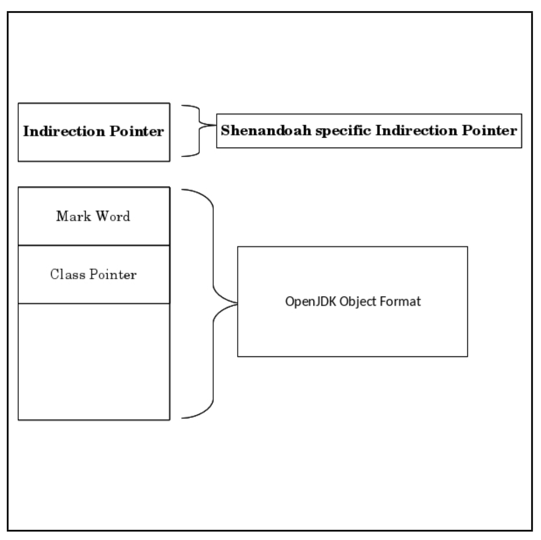
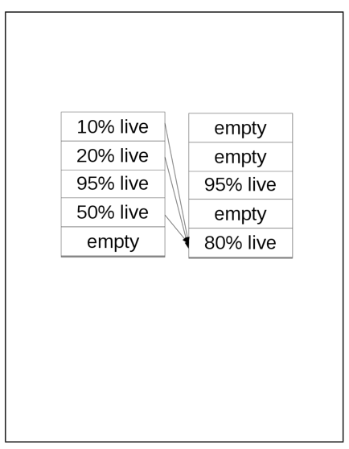

## Introduction

Shenandoah is an open-source **region-based low-pause parallel and concurrent** garbage collection (GC) algorithm **targeting large heap** applications.

Snapshot At the Beginning Concurrent Marking and Brooks-style indirection pointer concurrent compaction enable significantly shorter GC pauses with durations that are independent of the application’s live data size.
Our implementation of Shenandoah in OpenJDK allows us to do comparison testing with mature production quality GC algorithms.

Modern machines have more memory and more processors than ever before. Service Level Agreement (SLA) applications guarantee response times of 10-500ms.
In order to meet the lower end of that goal we need garbage collection algorithms which are efficient enough to allow programs to run in the available memory,
but also optimized to never interrupt the running program for more than a handful of milliseconds.

Simply finding those references may require scanning the entire heap.
Concurrent compaction is complicated because along with moving a potentially in-use object, you also have to atomically update all references to that object to point to the new location.
The GC threads and the mutator threads copy the objects and use an atomic compare and swap (CAS) to update the forwarding pointer.
If multiple GC and mutator threads were competing to move the same object only one CAS would succeed.
References are updated during the next concurrent marking gc phase.

The compilers emit barriers only when running the Shenandoah collector.

The trade off is that Shenandoah requires more space than other algorithms.

> [!NOTE]
> 版本基线：Shenandoah 于 **JDK 12 作为实验特性集成（[JEP 189](https://openjdk.org/jeps/189)）**，**JDK 15 转为生产特性（[JEP 379](https://openjdk.org/jeps/379)）**，不在默认收集器之列。分代模式 **JDK 24 引入（[JEP 404](https://openjdk.org/jeps/404)，实验性）**，需 `-XX:ShenandoahGCMode=generational`；**截至 JDK 27 默认仍是 `satb` 非分代模式**，分代成为默认是 JDK 28 的目标（[JEP 535](https://openjdk.org/jeps/535)，Targeted）。

### Object Layout

The object layout for Shenandoah adds an additional word per object.
This word is located directly preceding the object and is only allocated when using the Shenandoah collector.




### Heap Layout

The heap is broken up into equal sized regions.
A region may contain newly allocated objects, long lived objects, or a mix of both.
Any subset of the regions may be chosen to be collected during a GC cycle

- Heap division, humongous regions, etc
  are similar to G1
- Collects garbage regions first by default
- Not generational by default, no young/old separation, even temporally
- Tracking inter-region references is not
  needed by default

We’ve developed an interface for GC heuristics which track allocation and reclamation rates.
We have several custom policies to decide when to start a concurrent mark and which regions to include in a collection set.
Our default heuristic which was used for our measurements chooses only regions with 60 percent or more garbage and starts a concurrent marking cycle when 75 percent of regions have been allocated.



## GC Phases

Shenandoah Phases

1. Initial Marking: Stops the world, scans the root set
   (java threads, class statics, ...)
2. Concurrent Marking: Trace the heap marking the live
   objects, updating any references to regions evacuated
   in the previous gc cycle.
3. Final Marking: Stops the world, Re-scans the root set,
   copy and update roots to point to to-region copies. Initiate concurrent compaction. Free any fully evacuated
   regions from previous compaction.
4. Concurrent Compaction: Evacuate live objects from
   targeted regions.

Each GC cycle consists of two stop the world phases and 2 concurrent phases.

We stop the world to trace the root set during an Initial Mark pause, then we perform a concurrent mark while the Java threads are running.
We stop the world again for a final mark, and then perform a concurrent evacuation phase.

Memory Protection Trap

### Concurrent Marking

We use a Snapshot At the Beginning (SATB) algorithm
which means that any object that was live at the beginning of marking
or that has been allocated since the beginning of marking is considered live.

Maintaining an SATB view of the heap requires a write barrier so that if the mutator overwrites a reference to an object that object still gets traced during marking.
We accomplish this by having a write barrier put overwritten values onto a queue to be scanned by the marking threads.

Each concurrent marking thread keeps a thread local total of the live data for each heap region.
We combine all of these at the end of the final mark phase. We later use this data for choosing which regions we want in our collection set.
Our concurrent marking threads use a work stealing algorithm to take advantage of as many idle threads as are available on the machine.

### Choosing the collection set

We choose a collection set based on the regions with the least live data.
Our goal is to keep up with mutation so we need to collect at least as much space as was allocated during the previous GC cyle.
We have several available heuristics for choosing regions based on heap occupancy or region density.
Pause times are proportional to the size of the root set, not the number of regions in the collection set,
therefore we are free to choose a collection set based purely on collector efficiency.

### Concurrent Compaction

Once the collection set has been chosen we start a concurrent compaction phase.
The concurrent GC threads know how many bytes of data are live in the collection set, so they know how many regions to reserve.
The GC threads all cooperate evacuating live objects from targeted regions.

A mutator may read an object in a targeted region
however a write requires the mutator also attempt to make a copy so that we have one consistent view of the object.
It is an invariant of our algorithm that writes never occur in from regions.

The concurrent GC threads do most of the evacuation work using a speculative copy protocol.

- They first speculatively copy the object into their thread local allocation buffer.
- They then try to CAS the Brooks’ indirection pointer to point to their speculative copy.
- If the CAS succeeds then they have the new address for the object.
- If the CAS fails then another thread beat them in the race to copy the object.
  The concurrent GC thread unrolls their speculative copy and proceeds using the value of the to-region pointer the other thread left in the indirection pointer.

When a Java thread wants to write to a from-space object it also uses the speculative allocation protocol to
copy the object to it’s own thread local allocation buffer.
Only once it has a new address for the object may it perform the intended write.
A write into a to-region object is guaranteed to be safe because to-region objects won’t get moved during concurrent evacuation.
We measured the amount of time the Java threads spent copying objects in write barriers when running the SpecJBB2015 benchmark and the time was negligible,
less than 118 microseconds total over the two hour run.

Java threads may continue to read from-region data while other threads are copying objects to to-regions.
Once the object is copied, the indirection pointer will point to the new copy and accesses will be directed there.
By contrast GCs which require all accesses to be in to-regions may suffer from read storms.
During evacuation forward progress may be significantly delayed by the mutator performing GC work to maintain the all accesses must be in to-regions invariant".
Our solution restricts this penalty to the normally far less frequent update case.

**Note that reads of immutable data such as class pointers, array size, or final fields do not require read barriers because the value is the same in all copies of the object.**

### Updating References

Updating all of the references to from-region objects to point to their to-region copies requires a traversal of the entire heap.
Rather than running this in a separate phase, and requiring stopping an additional time per gc cyle, we perform the updates during the next concurrent marking.

## Barriers

Shenandoah relies on a read barrier to read through the Brooks’ indirection pointer as well as a double write barrier.
We have the SATB write barrier on stores of object references into heap objects.
These object reference stores queue the overwritten values to maintain SATB correctness.

We also have a concurrent evacuation write barrier which aids the concurrent GC by copying
about to be written objects out of targeted regions to maintain our "no writes in targeted regions" invariant.

We implemented our read and write barriers for each tier of compilation, however the solutions are very similar.
Here we will only discuss the optimizing compiler.

Barriers are required in more places than just when reading or writing the fields of objects.
Object locking writes to the mark word of an object and therefore requires a write barrier.
Anytime the VM accesses an object in the heap that requires a barrier.

### Read Barriers

our compiled read barriers are a single assembly language instruction.

```cpp
void
ShenandoahBarrierSet::compile_resolve_oop(){
__ movptr(dst, Address(dst, -8));
}
```

### Write Barriers

Write barriers need to do more work than read barriers but that is mitigated by their lower frequency.
When concurrent marking is running we have an SATB write barrier
which ensures that any values overwritten during concurrent marking are scanned by the concurrent marking thread.

This barrier is exactly the same as the one used by G1 and CMS.
Plus we have an additional Shenandoah specific write barrier which is only performed when we are in a concurrent evacuation phase
which ensures that objects in targeted regions are forwarded before the write is attempted.

The order of the evacuation in progress check and the read of the indirection pointer is important.
The evacuation in progress flag is set during the final marking STW phase,
but cleared concurrently when all the copying work is complete.
The flag may flip from true to false while we are in the write barrier.
If we read the indirection pointer first, found the from-region object referencing it-self,
and then read the false evacuation in progress field we might find ourselves writing to a from-region object.
If we read the evacuation in progress flag first,
than we are being conservative and are guaranteed to always call the write barrier when necessary.

## Lessons Learned

### Weak References and Class Unloading

Weak references and class unloading are the cause of bulk of our final marking pause times.
We can discover weak references concurrently, but we must process them during a stop the world pause in the order of strength.
All strong references must be completed first, followed by soft, weak, phantom, and jni in that order.
Theoretically class unloading could be done concurrently, but it’s not straightforward and we haven’t tackled it yet.

### Locked Objects

Locking/Unlocking objects are writes and go through the write barrier protocol,
however during out final-mark pause we eagerly evacuate all active monitors and this allows us to avoid a write-barrier on `monitor-exit`.

## Cycle

### Overview

Three major phases:

1. Snapshot-at-the-beginning concurrent mark
2. Concurrent evacuation
3. Concurrent update references (optional)

## Concurrent Mark

### Three-Color Abstraction

Assign colors to the objects:

1. White: not yet visited
2. Gray: visited, but references are not scanned yet
3. Black: visited, and fully scanned

### Stop-The-World Mark

### Mutator Problems

### SATB

### Concurrent Cleanup

Immediate Garbage Region

### Concurrent Evacuation

Brooks Pointers

### Initial Update Reference

### Concurrent Update Reference

### Final Update Reference

### Two Pauses

Init Mark:

1. Stop the mutator to avoid races
2. Color the rootset Black ← most heavy-weight
3. Arm SATB barriers

Final Mark:

1. Stop the mutator to avoid races
2. Drain the SATB buffers
3. Finish work from SATB updates ← most heavy-weight

## Generational Shenandoah

分代 Shenandoah 由 **[JEP 404](https://openjdk.org/jeps/404)（JDK 24，实验性）** 引入，把 Java 堆分为 young / old 两代，沿用"多数对象朝生夕死"的分代假设，让 GC 把工作集中在年轻、且大多已死的对象上。它与非分代（默认 `satb` 模式）并存，**截至 JDK 27 默认仍是非分代模式**，分代成为默认是 JDK 28 的目标（[JEP 535](https://openjdk.org/jeps/535)，Targeted）。

### 启用方式

```shell
# JDK 24+ 实验性分代模式（需解锁实验选项）
java -XX:+UnlockExperimentalVMOptions -XX:ShenandoahGCMode=generational
```

### 与非分代模式的区别

- **双代结构**：每一代由 Shenandoah 堆中 region 的一个子集构成；任一时刻某 region 要么空闲、要么专属于 young 或 old。每代大小 = 其已占用 region + 一部分空闲 region 配额，可临时越界借用对方配额（但会加速触发收集）。
- **复用既有机制**：分代模式复用同一个 Load Reference Barrier（支持压缩指针的 32 位 LRB）、同一个 evacuator，以及已广义化的 SATB 写屏障——SATB 缓冲区后处理时区分指向 old/young 的引用，但快路径不变。
- **记忆集**：借用 Parallel/CMS 的 card marking 代码实现跨代引用记录，并新增"可随 mutator 并发扫描"的 remembered set 实现。
- **收集拓扑**：young 收集与 G1 的 young 收集类似，mixed 收集（young + 部分 old）则并发进行——核心优势在于 **young 与 mixed 收集都与 mutator 并发**，而 G1 的 young/mixed 转移必须 STW。

### 与 ZGC 分代对比

| 维度 | Generational Shenandoah | Generational ZGC |
| :--- | :--- | :--- |
| 引入版本 | JDK 24（实验，JEP 404） | JDK 21（JEP 439） |
| 成为默认 | JDK 28 目标（JEP 535, Targeted） | JDK 23 已默认（JEP 474） |
| 写屏障 | SATB 写屏障 + 并发转移写屏障 | 着色指针 + store barrier |
| 读屏障 | Brooks 指针读屏障（LRB） | 着色指针读屏障（load barrier） |
| 压缩指针 | 支持（32 位 LRB） | 不支持（着色指针占用高位） |

> 注意：Azul 的 C4 收集器早已分代但非开源；ZGC 分代在 JDK 21 已实现，且两者都不支持压缩对象指针。对绝大多数 heap 小于 32GB 的云负载，Shenandoah 分代支持压缩指针是相对 ZGC 分代的一个差异化优势。

## Links

- [Garbage Collection](/docs/CS/Java/JDK/JVM/GC/GC.md)


## References

1. [Shenandoah GC in JDK 13, Part I: Load Reference Barriers](https://rkennke.wordpress.com/2019/05/15/shenandoah-gc-in-jdk13-part-i-load-reference-barriers/)
2. [JEP 379: Shenandoah: A Low-Pause-Time Garbage Collector (Production)](https://openjdk.org/jeps/379)
2. [JEP 404: Generational Shenandoah](https://openjdk.org/jeps/404)
