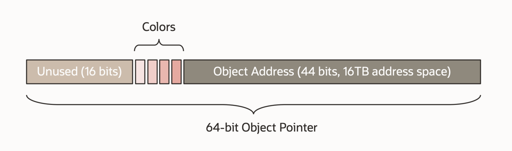

## Introduction

一方面随着硬件的发展，堆空间越来越大，几十GB、上百GB的内存在生产环境逐渐出现；另一方面，对于停顿时间的需求日益严苛，从最初的秒级到百毫秒级，再到十毫秒级和毫秒级。G1对于这种情况逐渐力不从心，下一代低延迟垃圾回收器主要有ZGC和Shenandoah

ZGC的回收算法与Azul Systems 2005年提出的Pauseless GC类似。仅三次与堆大小无关的短暂STW，开始标记、结束标记、开始relocate，从而轻松实现毫秒级停顿的目标

ZGC的特性
- 并发
  由于停顿时间小于10ms，显而易见的，回收周期绝大部分逻辑将于Mutator并发执行。
- 基于分区
  与G1类似，JAVA Heap被划分为多个Region，但ZGC中Region大小并不唯一。
- 压缩算法
  为了避免内存碎片，需要在回收周期中进行压缩。
- 支持NUMA
  作为下一代垃圾回收算法，支持NUMA是必须的。
- 使用colored pointers
  CMS和G1标记的是对象，而ZGC标记的是对象指针
- 使用读屏障
  由于relocate步骤（类似于G1中的对象复制）是并发执行的，需要引入load barrier机制，根据colored pointer中的值，确保代码能够指向正确的对象地址


A core design principle/choice in ZGC is the use of **load barriers** in combination with **colored object pointers** (i.e., colored oops).

the colored-pointers scheme offers some very attractive properties. In particular:

- It allows us to reclaim and reuse memory during the relocation/compaction phase, before pointers pointing into the reclaimed/reused regions have been fixed.
  This helps keep the general heap overhead down. It also means that there is no need to implement a separate mark-compact algorithm to handle a full GC.
- It allows us to have relatively few and simple GC barriers. This helps keep the runtime overhead down.
  It also means that it's easier to implement, optimize and maintain the GC barrier code in our interpreter and JIT compilers.
- We currently store marking and relocation related information in the colored pointers.
  However, the versatile nature of this scheme allows us to store any type of information (as long as we can fit it into the pointer) and let the load barrier take any action it wants to based on that information.
  We believe this will lay the foundation for many future features.
  To pick one example, in a heterogeneous memory environment, this could be used to track heap access patterns to guide GC relocation decisions to move rarely used objects to cold storage.

From [ZGC The Next Generation Low-Latency Garbage Collector](http://cr.openjdk.java.net/~pliden/slides/ZGC-OracleDevLive-2020.pdf)


Regions

- Small 2MB for < 256KB
- Medium 32MB for 256KB <= <= 4MB
- Large N * 2MB

Colored Pointer/Tag Pointer/Version Pointer

- Pause Mark Start Scan thread stacks
- Concurrent Mark/Remap Walk object graph
- Pause Mark End Synchronization point
- Concurrent Prepare for Reloc. Reference processing Class unloading Relocation set selection
- Pause Relocate Start Scan thread stacks
- Concurrent Relocate Compact heap

### Colored Pointers

- Core design concept in ZGC
- Metadata stored in unused bits in 64-bit pointers



### Load Barrier

A small piece of code injected by the JIT in strategic places

- When loading an **object reference** from the heap

Checks if the loaded object reference has a bad color

- If so, take action and heal it

Like

```java
String n = person.name;
```

### Generational ZGC

Young/Old Generation

- Exploit the fact that most objects are short-lived
  Benefits
- Withstand higher allocation rates
- Lower heap headroom
- Lower CPU usage

Applications running with Generational ZGC should enjoy

- Lower risks of allocations stalls,
- Lower required heap memory overhead, and
- Lower garbage collection CPU overhead.

In a future release we intend to make Generational ZGC the default, at which point `-XX:-ZGenerational` will select non-generational ZGC.

```shell
java -XX:+UseZGC -XX:+ZGenerational
```

Non-generational ZGC uses both colored pointers and load barriers.
Generational ZGC also uses store barriers to efficiently keep track of references from objects in one generation to objects in another generation.

A store barrier is a fragment of code injected by ZGC into the application wherever the application stores references into object fields.
Generational ZGC adds new metadata bits to colored pointers so that store barriers can determine if the field being written has already been recorded as potentially containing an inter-generational pointer.
Colored pointers make Generational ZGC's store barriers more efficient than traditional generational store barriers.
The addition of store barriers allows Generational ZGC to move the work of marking reachable objects from load barriers to store barriers.
That is, store barriers can use the metadata bits in colored pointers to efficiently determine if the object previously referred to by the field, prior to the store, needs to be marked.

Moving marking out of load barriers makes it easier to optimize them, which is important because load barriers are often more frequently executed than store barriers.
Now when a load barrier interprets a colored pointer it need only update the object address, if the object was relocated, and update the metadata to indicate that the address is known to be correct.
Subsequent load barriers will interpret this metadata and not check again whether the object has been relocated.

Generational ZGC uses distinct sets of marking and relocation metadata bits in colored pointers, so that the generations can be collected independently.

The remaining sections describe important design concepts that distinguish Generational ZGC from non-generational ZGC, and from other garbage collectors:

- No multi-mapped memory
- Optimized barriers
- Double-buffered remembered sets
- Relocations without additional heap memory
- Dense heap regions
- Large objects
- Full garbage collections


## alloc_object

```cpp
zaddress ZObjectAllocator::alloc_object(size_t size, ZAllocationFlags flags) {
  if (size <= ZObjectSizeLimitSmall) {
    // Small
    return alloc_small_object(size, flags);
  } else if (size <= ZObjectSizeLimitMedium) {
    // Medium
    return alloc_medium_object(size, flags);
  } else {
    // Large
    return alloc_large_object(size, flags);
  }
}
```


```cpp
zaddress ZObjectAllocator::alloc_small_object(size_t size, ZAllocationFlags flags) {
  return alloc_object_in_shared_page(shared_small_page_addr(), ZPageType::small, ZPageSizeSmall, size, flags);
}

zaddress ZObjectAllocator::alloc_object_in_shared_page(ZPage** shared_page,
                                                       ZPageType page_type,
                                                       size_t page_size,
                                                       size_t size,
                                                       ZAllocationFlags flags) {
  zaddress addr = zaddress::null;
  ZPage* page = Atomic::load_acquire(shared_page);

  if (page != nullptr) {
    addr = page->alloc_object_atomic(size);
  }

  if (is_null(addr)) {
    // Allocate new page
    ZPage* const new_page = alloc_page(page_type, page_size, flags);
    if (new_page != nullptr) {
      // Allocate object before installing the new page
      addr = new_page->alloc_object(size);

    retry:
      // Install new page
      ZPage* const prev_page = Atomic::cmpxchg(shared_page, page, new_page);
      if (prev_page != page) {
        if (prev_page == nullptr) {
          // Previous page was retired, retry installing the new page
          page = prev_page;
          goto retry;
        }

        // Another page already installed, try allocation there first
        const zaddress prev_addr = prev_page->alloc_object_atomic(size);
        if (is_null(prev_addr)) {
          // Allocation failed, retry installing the new page
          page = prev_page;
          goto retry;
        }

        // Allocation succeeded in already installed page
        addr = prev_addr;

        // Undo new page allocation
        undo_alloc_page(new_page);
      }
    }
  }

  return addr;
}
```

- 在page中分配，如果成功则返回
- 如果失败，则调用alloc_page函数分配
- JVM参数ZStallOnOutOfMemory，控制是否当空间不足时，是否同步等待GC完成，false表示立即抛出OOM，默认为true

```cpp
zaddress ZObjectAllocator::alloc_large_object(size_t size, ZAllocationFlags flags) {
  zaddress addr = zaddress::null;

  // Allocate new large page
  const size_t page_size = align_up(size, ZGranuleSize);
  ZPage* const page = alloc_page(ZPageType::large, page_size, flags);
  if (page != nullptr) {
    // Allocate the object
    addr = page->alloc_object(size);
  }

  return addr;
}
```
大对象分配略有不同
* 对象size按2MB对齐
* 分配large page
* 在large page上分配对象

```cpp
ZPage* ZObjectAllocator::alloc_page(ZPageType type, size_t size, ZAllocationFlags flags) {
  ZPage* const page = ZHeap::heap()->alloc_page(type, size, flags, _age);
  if (page != nullptr) {
    // Increment used bytes
    Atomic::add(_used.addr(), size);
  }

  return page;
}
```
- 调用ZHeap的alloc_page函数分配page
- 如果分配成功，CAS添加内存占用量


```cpp
ZPage* ZHeap::alloc_page(ZPageType type, size_t size, ZAllocationFlags flags, ZPageAge age) {
  ZPage* const page = _page_allocator.alloc_page(type, size, flags, age);
  if (page != nullptr) {
    // Insert page table entry
    _page_table.insert(page);
  }

  return page;
}
```
- 调用PageAllocator的alloc_page函数分配page
- 如果分配成功，则将page添加到page table中
```cpp
ZPage* ZPageAllocator::alloc_page(ZPageType type, size_t size, ZAllocationFlags flags, ZPageAge age) {
  EventZPageAllocation event;

retry:
  ZPageAllocation allocation(type, size, flags);

  // Allocate one or more pages from the page cache. If the allocation
  // succeeds but the returned pages don't cover the complete allocation,
  // then finalize phase is allowed to allocate the remaining memory
  // directly from the physical memory manager. Note that this call might
  // block in a safepoint if the non-blocking flag is not set.
  if (!alloc_page_or_stall(&allocation)) {
    // Out of memory
    return nullptr;
  }

  ZPage* const page = alloc_page_finalize(&allocation);
  if (page == nullptr) {
    // Failed to commit or map. Clean up and retry, in the hope that
    // we can still allocate by flushing the page cache (more aggressively).
    free_pages_alloc_failed(&allocation);
    goto retry;
  }

  // The generation's used is tracked here when the page is handed out
  // to the allocating thread. The overall heap "used" is tracked in
  // the lower-level allocation code.
  const ZGenerationId id = age == ZPageAge::old ? ZGenerationId::old : ZGenerationId::young;
  increase_used_generation(id, size);

  // Reset page. This updates the page's sequence number and must
  // be done after we potentially blocked in a safepoint (stalled)
  // where the global sequence number was updated.
  page->reset(age, ZPageResetType::Allocation);

  // Update allocation statistics. Exclude gc relocations to avoid
  // artificial inflation of the allocation rate during relocation.
  if (!flags.gc_relocation() && is_init_completed()) {
    // Note that there are two allocation rate counters, which have
    // different purposes and are sampled at different frequencies.
    ZStatInc(ZCounterMutatorAllocationRate, size);
    ZStatMutatorAllocRate::sample_allocation(size);
  }

  // Send event
  event.commit((u8)type, size, allocation.flushed(), allocation.committed(),
               page->physical_memory().nsegments(), flags.non_blocking());

  return page;
}
```

alloc_page_or_stall

```cpp
bool ZPageAllocator::alloc_page_or_stall(ZPageAllocation* allocation) {
  {
    ZLocker<ZLock> locker(&_lock);

    if (alloc_page_common(allocation)) {
      // Success
      return true;
    }

    // Failed
    if (allocation->flags().non_blocking()) {
      // Don't stall
      return false;
    }

    // Enqueue allocation request
    _stalled.insert_last(allocation);
  }

  // Stall
  return alloc_page_stall(allocation);
}
```


alloc_page_common
```cpp
bool ZPageAllocator::alloc_page_common(ZPageAllocation* allocation) {
  const ZPageType type = allocation->type();
  const size_t size = allocation->size();
  const ZAllocationFlags flags = allocation->flags();
  ZList<ZPage>* const pages = allocation->pages();

  if (!alloc_page_common_inner(type, size, pages)) {
    // Out of memory
    return false;
  }

  // Updated used statistics
  increase_used(size);

  // Success
  return true;
}

bool ZPageAllocator::alloc_page_common_inner(ZPageType type, size_t size, ZList<ZPage>* pages) {
  if (!is_alloc_allowed(size)) {
    // Out of memory
    return false;
  }

  // Try allocate from the page cache
  ZPage* const page = _cache.alloc_page(type, size);
  if (page != nullptr) {
    // Success
    pages->insert_last(page);
    return true;
  }

  // Try increase capacity
  const size_t increased = increase_capacity(size);
  if (increased < size) {
    // Could not increase capacity enough to satisfy the allocation
    // completely. Flush the page cache to satisfy the remainder.
    const size_t remaining = size - increased;
    _cache.flush_for_allocation(remaining, pages);
  }

  // Success
  return true;
}
```


## collect

GC cycles
开始标记（STW），标记GC roots
* 并发的遍历堆中对象，描绘出引用关系
* 结束标记（STW），记录活动对象和需要回收的对象
* 并发的relocate准备阶段，弱引用和软引用的处理，类的卸载，relocate集合的选择等
* 开始relocate（STW），relocate GC roots
* 并发relocate，这是GC线程和Mutator线程的读屏障都可进行relocate

由于remap非常消耗时间，该子阶段将于下一个回收周期的并发标记子阶段合并在一起
  
ZGC的回收周期触发时机与其他GC算法略有不同，VM内部有个线程轮询定期检查是否满足开始回收的条件，如果满足则开始回收。
ZGC提供四种策略，其中一种满足条件即触发回收：
* rule_timer，定时策略，距离上次GC时间超过interval即触发GC
* rule_warmup，VM启动后，如果从来没有发生过GC，则在堆内存使用超过10%、20%、30%时，分别触发一次GC，以收集GC数据
* rule_allocation_rate，根据对象分配速率决定是否GC
* rule_proactive，主动控制策略，根据距离上次GC增长的堆空间和距离上次GC的时间判断是否触发GC
  如果对象分配过快，以至于以上四种策略均无法及时回收对象，则在到达阈值后，STW并行回收


```cpp
void ZThread::run_service() {
  run_thread();

  MonitorLocker ml(Terminator_lock, Monitor::_no_safepoint_check_flag);

  // Wait for signal to terminate
  while (!should_terminate()) {
    ml.wait();
  }
}
```

- 调用wait_for_tick()等待100ms
- 调用sample_allocation_rate，抽样计算分配速率
- 判断是否触发GC，如是则执行collect函数


```cpp
void ZDirector::run_thread() {
  // Main loop
  while (wait_for_tick()) {
    ZDirectorStats stats = sample_stats();
    if (!start_gc(stats)) {
      adjust_gc(stats);
    }
  }
}

static bool start_gc(const ZDirectorStats& stats) {
  // Try start major collections first as they include a minor collection
  const GCCause::Cause major_cause = make_major_gc_decision(stats);
  if (major_cause != GCCause::_no_gc) {
    start_major_gc(stats, major_cause);
    return true;
  }

  const GCCause::Cause minor_cause = make_minor_gc_decision(stats);
  if (minor_cause != GCCause::_no_gc) {
    if (!ZDriver::major()->is_busy() && rule_major_allocation_rate(stats)) {
      // Merge minor GC into major GC
      start_major_gc(stats, GCCause::_z_allocation_rate);
    } else {
      start_minor_gc(stats, minor_cause);
    }

    return true;
  }

  return false;
}
```


```cpp
static GCCause::Cause make_minor_gc_decision(const ZDirectorStats& stats) {
  if (ZDriver::minor()->is_busy()) {
    return GCCause::_no_gc;
  }

  if (ZDriver::major()->is_busy() && !stats._old_stats._resize._is_active) {
    return GCCause::_no_gc;
  }

  if (rule_minor_timer(stats)) {
    return GCCause::_z_timer;
  }

  if (rule_minor_allocation_rate(stats)) {
    return GCCause::_z_allocation_rate;
  }

  if (rule_minor_high_usage(stats)) {
    return GCCause::_z_high_usage;
  }

  return GCCause::_no_gc;
}
```


rule_minor_timer

```cpp
static bool rule_minor_timer(const ZDirectorStats& stats) {
  if (ZCollectionIntervalMinor <= 0) {
    // Rule disabled
    return false;
  }

  // Perform GC if timer has expired.
  const double time_since_last_gc = stats._young_stats._cycle._time_since_last;
  const double time_until_gc = ZCollectionIntervalMinor - time_since_last_gc;

  log_debug(gc, director)("Rule Minor: Timer, Interval: %.3fs, TimeUntilGC: %.3fs",
                          ZCollectionIntervalMinor, time_until_gc);

  return time_until_gc <= 0;
}
```


- 如果没有设置JVM参数-XX:ZCollectionInterval，则返回，不会使用rule_timer策略
- 如果设置了ZCollectionInterval，则判断当前时间减上次gc时间是否大于ZCollectionInterval，如是则触发GC


根据传入的GCCause，判断使用同步消息还是异步消息。
* ZGC自身的触发策略都使用异步消息，包括rule_timer、rule_warmup、rule_allocation_rate、rule_proactive
* metaspace GC使用异步消息
* 其他情况使用同步消息


```cpp
void ZCollectedHeap::collect(GCCause::Cause cause) {
  // Handle external collection requests
  switch (cause) {
  case GCCause::_wb_young_gc:
  case GCCause::_scavenge_alot:
    // Start urgent minor GC
    _driver_minor->collect(ZDriverRequest(cause, ZYoungGCThreads, 0));
    break;

  case GCCause::_heap_dump:
  case GCCause::_heap_inspection:
  case GCCause::_wb_full_gc:
  case GCCause::_wb_breakpoint:
  case GCCause::_dcmd_gc_run:
  case GCCause::_java_lang_system_gc:
  case GCCause::_full_gc_alot:
  case GCCause::_jvmti_force_gc:
  case GCCause::_metadata_GC_clear_soft_refs:
  case GCCause::_codecache_GC_aggressive:
    // Start urgent major GC
    _driver_major->collect(ZDriverRequest(cause, ZYoungGCThreads, ZOldGCThreads));
    break;

  case GCCause::_metadata_GC_threshold:
  case GCCause::_codecache_GC_threshold:
    // Start not urgent major GC
    _driver_major->collect(ZDriverRequest(cause, 1, 1));
    break;

  default:
    fatal("Unsupported GC cause (%s)", GCCause::to_string(cause));
    break;
  }
}
```


```cpp
void ZDriverMinor::run_thread() {
  // Main loop
  for (;;) {
    // Wait for GC request
    const ZDriverRequest request = _port.receive();

    ZDriverLocker locker;

    abortpoint();

    // Run GC
    gc(request);

    abortpoint();

    // Notify GC completed
    _port.ack();

    // Handle allocation stalls
    handle_alloc_stalls();

    // Good point to consider back-to-back GC
    ZDirector::evaluate_rules();
  }
}
```


```cpp
void ZDriverMajor::run_thread() {
  // Main loop
  for (;;) {
    // Wait for GC request
    const ZDriverRequest request = _port.receive();

    ZDriverLocker locker;

    ZBreakpoint::at_before_gc();

    abortpoint();

    // Set up soft reference policy
    const bool clear_soft_refs = should_clear_soft_references(request.cause());
    ZGeneration::old()->set_soft_reference_policy(clear_soft_refs);

    // Run GC
    gc(request);

    abortpoint();

    // Notify GC completed
    _port.ack();

    // Handle allocation stalls
    handle_alloc_stalls(clear_soft_refs);

    ZBreakpoint::at_after_gc();
  }
}

void ZDriverMajor::gc(const ZDriverRequest& request) {
  ZDriverScopeMajor scope(request, &_gc_timer);

  // Collect the young generation
  collect_young(request);

  abortpoint();

  // Collect the old generation
  collect_old();
}


void ZDriverMajor::collect_young(const ZDriverRequest& request) {
  ZGCIdMajor major_id(gc_id(), 'Y');
  if (should_preclean_young(request.cause())) {
    // Collect young generation and promote everything to old generation
    ZGeneration::young()->collect(ZYoungType::major_full_preclean, &_gc_timer);

    abortpoint();

    // Collect young generation and gather roots pointing into old generation
    ZGeneration::young()->collect(ZYoungType::major_full_roots, &_gc_timer);
  } else {
    // Collect young generation and gather roots pointing into old generation
    ZGeneration::young()->collect(ZYoungType::major_partial_roots, &_gc_timer);
  }

  abortpoint();

  // Handle allocations waiting for a young collection
  handle_alloc_stalling_for_young();
}

void ZDriverMajor::collect_old() {
  ZGCIdMajor major_id(gc_id(), 'O');
  ZGeneration::old()->collect(&_gc_timer);
}

```


```cpp

```


## Links

- [Garbage Collection](/docs/CS/Java/JDK/JVM/GC/GC.md)


## References

1. [ZGC - by RednaxelaFX](https://www.zhihu.com/question/287945354/answer/458761494)
2. [The Pauseless GC Algorithm](https://www.usenix.org/legacy/events/vee05/full_papers/p46-click.pdf)
3. [The Z Garbage Collector Scalable Low-Latency GC in JDK 11](http://cr.openjdk.java.net/~pliden/slides/ZGC-OracleCodeOne-2018.pdf)
4. [JEP 333: ZGC: A Scalable Low-Latency Garbage Collector (Experimental)](https://openjdk.org/jeps/333)
5. [JEP 376: ZGC: Concurrent Thread-Stack Processing](https://openjdk.java.net/jeps/376)
6. [JEP 377: ZGC: A Scalable Low-Latency Garbage Collector (Production)](https://openjdk.java.net/jeps/377)
7. [JEP 439: Generational ZGC](https://openjdk.org/jeps/439)
