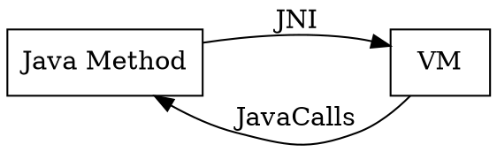
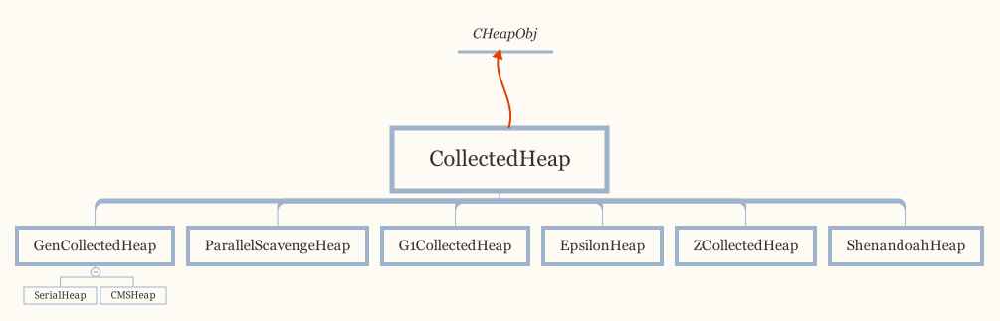
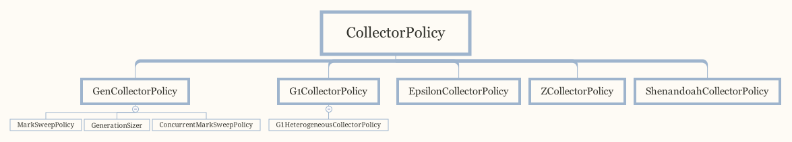

## Introduction


### Directories
Directory based on JDK12 HotSpot, [Git Link](https://github.com/openjdk/jdk/tree/master/src/hotspot)

```
hotspot
    |--- cpu                     
    |--- os
    |--- os_cpu
    |--- share
        |--- adlc               # 
        |--- aot                # 
        |--- asm                # 
        |--- c1                 # C1 JIT
        |--- ci                 # compiler interface
        |--- classfile          #
        |--- code               
        |--- compiler           
        |--- gc                 
        |--- include            
        |--- interpreter        
        |--- jfr                # Java Flight Record
        |--- jvmci              
        |--- libadt             
        |--- logging            
        |--- memory             
        |--- metaprogramming    
        |--- oops               
        |--- opto               # C2 JIT
        |--- precompiled        
        |--- prims              # implement JNI, JVMTI, Unsafe
        |--- runtime            
        |--- services           # HeapDump, MXBean, jcmd, jinfo
        |--- utilities          # hashtable, JSON parser, elf, etc.
```

## The class File Format

- [Class File and Compiler](/docs/CS/Java/JDK/JVM/ClassFile.md)
- [Javac](/docs/CS/Java/JDK/JVM/Javac.md)


## Runtime


- [start](/docs/CS/Java/JDK/JVM/start.md) and [destroy](/docs/CS/Java/JDK/JVM/destroy.md)
- [Thread](/docs/CS/Java/JDK/JVM/Thread.md)


[JavaCalls](/docs/CS/Java/JDK/JVM/Stub.md?id=JavaCalls) and [JNI](/docs/CS/Java/JDK/Basic/JNI.md)




              


### Class

- [ClassLoader](/docs/CS/Java/JDK/JVM/ClassLoader.md)
- [Oop-Klass](/docs/CS/Java/JDK/JVM/Oop-Klass.md)

### Run-Time Data Areas
The Java Virtual Machine defines various [run-time data areas](/docs/CS/Java/JDK/JVM/Runtime_Data_Area.md) that are used during execution of a program. 
Some of these data areas are created on Java Virtual Machine start-up and are destroyed only when the Java Virtual Machine exits. 

Other data areas are per thread. Per-thread data areas are created when a thread is created and destroyed when the thread exits.

[CodeCache](/docs/CS/Java/JDK/JVM/CodeCache.md)


###  Representation of Objects
The Java Virtual Machine does not mandate any particular internal structure for objects.

In some of Oracle’s implementations of the Java Virtual Machine, a reference to a class instance is a pointer to a handle that is itself a pair of pointers(see [OOP-Klass](/docs/CS/Java/JDK/JVM/Oop-Klass.md)):
- one to a table containing the methods of the object and a pointer to the Class object that represents the type of the object
- and the other to the memory allocated from the heap for the object data.


## GC
- [GC](/docs/CS/Java/JDK/JVM/GC.md)
- [SafePoint](/docs/CS/Java/JDK/JVM/Safepoint.md)


## Execution Engine

BytecodeInterpreter is deprecated

- [JIT](/docs/CS/Java/JDK/JVM/JIT.md)
- [interpreter](/docs/CS/Java/JDK/JVM/interpreter.md)


## Native Method Interface


### Native Method Library


Top-of-Stack Cashing
based on stack VM need more instrument dispatch

cached in CPU registers and reduce accessing memory
```cpp
// globalDefinitions.hpp

// TosState describes the top-of-stack state before and after the execution of
// a bytecode or method. The top-of-stack value may be cached in one or more CPU
// registers. The TosState corresponds to the 'machine representation' of this cached
// value. There's 4 states corresponding to the JAVA types int, long, float & double
// as well as a 5th state in case the top-of-stack value is actually on the top
// of stack (in memory) and thus not cached. The atos state corresponds to the itos
// state when it comes to machine representation but is used separately for (oop)
// type specific operations (e.g. verification code).

enum TosState {         // describes the tos cache contents
  btos = 0,             // byte, bool tos cached
  ztos = 1,             // byte, bool tos cached
  ctos = 2,             // char tos cached
  stos = 3,             // short tos cached
  itos = 4,             // int tos cached
  ltos = 5,             // long tos cached
  ftos = 6,             // float tos cached
  dtos = 7,             // double tos cached
  atos = 8,             // object cached
  vtos = 9,             // tos not cached
  number_of_states,
  ilgl                  // illegal state: should not occur
};
```
check previous and after TosState in transition,


```cpp
// templateTable_x86.cpp

void TemplateTable::iop2(Operation op) {
  transition(itos, itos);
  switch (op) {
  case add  :                    __ pop_i(rdx); __ addl (rax, rdx); break;
  case sub  : __ movl(rdx, rax); __ pop_i(rax); __ subl (rax, rdx); break;
  case mul  :                    __ pop_i(rdx); __ imull(rax, rdx); break;
  case _and :                    __ pop_i(rdx); __ andl (rax, rdx); break;
  case _or  :                    __ pop_i(rdx); __ orl  (rax, rdx); break;
  case _xor :                    __ pop_i(rdx); __ xorl (rax, rdx); break;
  case shl  : __ movl(rcx, rax); __ pop_i(rax); __ shll (rax);      break;
  case shr  : __ movl(rcx, rax); __ pop_i(rax); __ sarl (rax);      break;
  case ushr : __ movl(rcx, rax); __ pop_i(rax); __ shrl (rax);      break;
  default   : ShouldNotReachHere();
  }
}
```


All classes in adlc may be derived from one of the following allocation classes:
For objects allocated in the C-heap (managed by: malloc & free).
- CHeapObj
  For classes used as name spaces.
- AllStatic

```cpp
// share/adlc/arena.hpp
class CHeapObj {
 public:
  void* operator new(size_t size) throw();
  void  operator delete(void* p);
  void* new_array(size_t size);
};
```

Base class for classes that constitute name spaces.

```
class AllStatic {
 public:
  void* operator new(size_t size) throw();
  void operator delete(void* p);
};
```


AllStatic

```cpp
// share/runtime/os.hpp
class os: AllStatic {
  friend class VMStructs;
  friend class JVMCIVMStructs;
  friend class MallocTracker;

#ifdef ASSERT
 private:
  static bool _mutex_init_done;
 public:
  static void set_mutex_init_done() { _mutex_init_done = true; }
  static bool mutex_init_done() { return _mutex_init_done; }
#endif

 public:
  enum { page_sizes_max = 9 }; // Size of _page_sizes array (8 plus a sentinel)

 private:
  static OSThread*          _starting_thread;
  static address            _polling_page;
 public:
  static size_t             _page_sizes[page_sizes_max];

 private:
  static void init_page_sizes(size_t default_page_size) {
    _page_sizes[0] = default_page_size;
    _page_sizes[1] = 0; // sentinel
  }

  static char*  pd_reserve_memory(size_t bytes, char* addr = 0,
                                  size_t alignment_hint = 0);
  static char*  pd_attempt_reserve_memory_at(size_t bytes, char* addr);
  static char*  pd_attempt_reserve_memory_at(size_t bytes, char* addr, int file_desc);
  static void   pd_split_reserved_memory(char *base, size_t size,
                                      size_t split, bool realloc);
  static bool   pd_commit_memory(char* addr, size_t bytes, bool executable);
  static bool   pd_commit_memory(char* addr, size_t size, size_t alignment_hint,
                                 bool executable);
  // Same as pd_commit_memory() that either succeeds or calls
  // vm_exit_out_of_memory() with the specified mesg.
  static void   pd_commit_memory_or_exit(char* addr, size_t bytes,
                                         bool executable, const char* mesg);
  static void   pd_commit_memory_or_exit(char* addr, size_t size,
                                         size_t alignment_hint,
                                         bool executable, const char* mesg);
  static bool   pd_uncommit_memory(char* addr, size_t bytes);
  static bool   pd_release_memory(char* addr, size_t bytes);

  static char*  pd_map_memory(int fd, const char* file_name, size_t file_offset,
                           char *addr, size_t bytes, bool read_only = false,
                           bool allow_exec = false);
  static char*  pd_remap_memory(int fd, const char* file_name, size_t file_offset,
                             char *addr, size_t bytes, bool read_only,
                             bool allow_exec);
  static bool   pd_unmap_memory(char *addr, size_t bytes);
  static void   pd_free_memory(char *addr, size_t bytes, size_t alignment_hint);
  static void   pd_realign_memory(char *addr, size_t bytes, size_t alignment_hint);

  static size_t page_size_for_region(size_t region_size, size_t min_pages, bool must_be_aligned);

  // Get summary strings for system information in buffer provided
  static void  get_summary_cpu_info(char* buf, size_t buflen);
  static void  get_summary_os_info(char* buf, size_t buflen);

  static void initialize_initial_active_processor_count();

  LINUX_ONLY(static void pd_init_container_support();)

 public:
  static void init(void);                      // Called before command line parsing

  static void init_container_support() {       // Called during command line parsing.
     LINUX_ONLY(pd_init_container_support();)
  }

  static void init_before_ergo(void);          // Called after command line parsing
                                               // before VM ergonomics processing.
  static jint init_2(void);                    // Called after command line parsing
                                               // and VM ergonomics processing
  static void init_globals(void) {             // Called from init_globals() in init.cpp
    init_globals_ext();
  }

  // File names are case-insensitive on windows only
  // Override me as needed
  static int    file_name_strncmp(const char* s1, const char* s2, size_t num);

  // unset environment variable
  static bool unsetenv(const char* name);

  static bool have_special_privileges();

  static jlong  javaTimeMillis();
  static jlong  javaTimeNanos();
  static void   javaTimeNanos_info(jvmtiTimerInfo *info_ptr);
  static void   javaTimeSystemUTC(jlong &seconds, jlong &nanos);
  static void   run_periodic_checks();
  static bool   supports_monotonic_clock();

  // Returns the elapsed time in seconds since the vm started.
  static double elapsedTime();

  // Returns real time in seconds since an arbitrary point
  // in the past.
  static bool getTimesSecs(double* process_real_time,
                           double* process_user_time,
                           double* process_system_time);

  // Interface to the performance counter
  static jlong elapsed_counter();
  static jlong elapsed_frequency();

  // The "virtual time" of a thread is the amount of time a thread has
  // actually run.  The first function indicates whether the OS supports
  // this functionality for the current thread, and if so:
  //   * the second enables vtime tracking (if that is required).
  //   * the third tells whether vtime is enabled.
  //   * the fourth returns the elapsed virtual time for the current
  //     thread.
  static bool supports_vtime();
  static bool enable_vtime();
  static bool vtime_enabled();
  static double elapsedVTime();

  // Return current local time in a string (YYYY-MM-DD HH:MM:SS).
  // It is MT safe, but not async-safe, as reading time zone
  // information may require a lock on some platforms.
  static char*      local_time_string(char *buf, size_t buflen);
  static struct tm* localtime_pd     (const time_t* clock, struct tm*  res);
  static struct tm* gmtime_pd        (const time_t* clock, struct tm*  res);
  // Fill in buffer with current local time as an ISO-8601 string.
  // E.g., YYYY-MM-DDThh:mm:ss.mmm+zzzz.
  // Returns buffer, or NULL if it failed.
  static char* iso8601_time(char* buffer, size_t buffer_length, bool utc = false);

  // Interface for detecting multiprocessor system
  static inline bool is_MP() {
    // During bootstrap if _processor_count is not yet initialized
    // we claim to be MP as that is safest. If any platform has a
    // stub generator that might be triggered in this phase and for
    // which being declared MP when in fact not, is a problem - then
    // the bootstrap routine for the stub generator needs to check
    // the processor count directly and leave the bootstrap routine
    // in place until called after initialization has ocurred.
    return (_processor_count != 1);
  }

  static julong available_memory();
  static julong physical_memory();
  static bool has_allocatable_memory_limit(julong* limit);
  static bool is_server_class_machine();

  // Returns the id of the processor on which the calling thread is currently executing.
  // The returned value is guaranteed to be between 0 and (os::processor_count() - 1).
  static uint processor_id();

  // number of CPUs
  static int processor_count() {
    return _processor_count;
  }
  static void set_processor_count(int count) { _processor_count = count; }

  // Returns the number of CPUs this process is currently allowed to run on.
  // Note that on some OSes this can change dynamically.
  static int active_processor_count();

  // At startup the number of active CPUs this process is allowed to run on.
  // This value does not change dynamically. May be different from active_processor_count().
  static int initial_active_processor_count() {
    assert(_initial_active_processor_count > 0, "Initial active processor count not set yet.");
    return _initial_active_processor_count;
  }

  // Bind processes to processors.
  //     This is a two step procedure:
  //     first you generate a distribution of processes to processors,
  //     then you bind processes according to that distribution.
  // Compute a distribution for number of processes to processors.
  //    Stores the processor id's into the distribution array argument.
  //    Returns true if it worked, false if it didn't.
  static bool distribute_processes(uint length, uint* distribution);
  // Binds the current process to a processor.
  //    Returns true if it worked, false if it didn't.
  static bool bind_to_processor(uint processor_id);

  // Give a name to the current thread.
  static void set_native_thread_name(const char *name);

  // Interface for stack banging (predetect possible stack overflow for
  // exception processing)  There are guard pages, and above that shadow
  // pages for stack overflow checking.
  static bool uses_stack_guard_pages();
  static bool must_commit_stack_guard_pages();
  static void map_stack_shadow_pages(address sp);
  static bool stack_shadow_pages_available(Thread *thread, const methodHandle& method, address sp);

  // Find committed memory region within specified range (start, start + size),
  // return true if found any
  static bool committed_in_range(address start, size_t size, address& committed_start, size_t& committed_size);

  // OS interface to Virtual Memory

  // Return the default page size.
  static int    vm_page_size();

  // Returns the page size to use for a region of memory.
  // region_size / min_pages will always be greater than or equal to the
  // returned value. The returned value will divide region_size.
  static size_t page_size_for_region_aligned(size_t region_size, size_t min_pages);

  // Returns the page size to use for a region of memory.
  // region_size / min_pages will always be greater than or equal to the
  // returned value. The returned value might not divide region_size.
  static size_t page_size_for_region_unaligned(size_t region_size, size_t min_pages);

  // Return the largest page size that can be used
  static size_t max_page_size() {
    // The _page_sizes array is sorted in descending order.
    return _page_sizes[0];
  }

  // Return a lower bound for page sizes. Also works before os::init completed.
  static size_t min_page_size() { return 4 * K; }

  // Methods for tracing page sizes returned by the above method.
  // The region_{min,max}_size parameters should be the values
  // passed to page_size_for_region() and page_size should be the result of that
  // call.  The (optional) base and size parameters should come from the
  // ReservedSpace base() and size() methods.
  static void trace_page_sizes(const char* str, const size_t* page_sizes, int count);
  static void trace_page_sizes(const char* str,
                               const size_t region_min_size,
                               const size_t region_max_size,
                               const size_t page_size,
                               const char* base,
                               const size_t size);
  static void trace_page_sizes_for_requested_size(const char* str,
                                                  const size_t requested_size,
                                                  const size_t page_size,
                                                  const size_t alignment,
                                                  const char* base,
                                                  const size_t size);

  static int    vm_allocation_granularity();
```
reserve_memory
```cpp

  static char*  reserve_memory(size_t bytes, char* addr = 0,
                               size_t alignment_hint = 0, int file_desc = -1);
  static char*  reserve_memory(size_t bytes, char* addr,
                               size_t alignment_hint, MEMFLAGS flags);
  static char*  reserve_memory_aligned(size_t size, size_t alignment, int file_desc = -1);
  static char*  attempt_reserve_memory_at(size_t bytes, char* addr, int file_desc = -1);
  static void   split_reserved_memory(char *base, size_t size,
                                      size_t split, bool realloc);
  static bool   commit_memory(char* addr, size_t bytes, bool executable);
  static bool   commit_memory(char* addr, size_t size, size_t alignment_hint,
                              bool executable);
  // Same as commit_memory() that either succeeds or calls
  // vm_exit_out_of_memory() with the specified mesg.
  static void   commit_memory_or_exit(char* addr, size_t bytes,
                                      bool executable, const char* mesg);
  static void   commit_memory_or_exit(char* addr, size_t size,
                                      size_t alignment_hint,
                                      bool executable, const char* mesg);
  static bool   uncommit_memory(char* addr, size_t bytes);
  static bool   release_memory(char* addr, size_t bytes);

  // Touch memory pages that cover the memory range from start to end (exclusive)
  // to make the OS back the memory range with actual memory.
  // Current implementation may not touch the last page if unaligned addresses
  // are passed.
  static void   pretouch_memory(void* start, void* end, size_t page_size = vm_page_size());

  enum ProtType { MEM_PROT_NONE, MEM_PROT_READ, MEM_PROT_RW, MEM_PROT_RWX };
  static bool   protect_memory(char* addr, size_t bytes, ProtType prot,
                               bool is_committed = true);

  static bool   guard_memory(char* addr, size_t bytes);
  static bool   unguard_memory(char* addr, size_t bytes);
  static bool   create_stack_guard_pages(char* addr, size_t bytes);
  static bool   pd_create_stack_guard_pages(char* addr, size_t bytes);
  static bool   remove_stack_guard_pages(char* addr, size_t bytes);
  // Helper function to create a new file with template jvmheap.XXXXXX.
  // Returns a valid fd on success or else returns -1
  static int create_file_for_heap(const char* dir);
  // Map memory to the file referred by fd. This function is slightly different from map_memory()
  // and is added to be used for implementation of -XX:AllocateHeapAt
  static char* map_memory_to_file(char* base, size_t size, int fd);
  // Replace existing reserved memory with file mapping
  static char* replace_existing_mapping_with_file_mapping(char* base, size_t size, int fd);

  static char*  map_memory(int fd, const char* file_name, size_t file_offset,
                           char *addr, size_t bytes, bool read_only = false,
                           bool allow_exec = false);
  static char*  remap_memory(int fd, const char* file_name, size_t file_offset,
                             char *addr, size_t bytes, bool read_only,
                             bool allow_exec);
  static bool   unmap_memory(char *addr, size_t bytes);
  static void   free_memory(char *addr, size_t bytes, size_t alignment_hint);
  static void   realign_memory(char *addr, size_t bytes, size_t alignment_hint);

  // NUMA-specific interface
  static bool   numa_has_static_binding();
  static bool   numa_has_group_homing();
  static void   numa_make_local(char *addr, size_t bytes, int lgrp_hint);
  static void   numa_make_global(char *addr, size_t bytes);
  static size_t numa_get_groups_num();
  static size_t numa_get_leaf_groups(int *ids, size_t size);
  static bool   numa_topology_changed();
  static int    numa_get_group_id();

  // Page manipulation
  struct page_info {
    size_t size;
    int lgrp_id;
  };
  static bool   get_page_info(char *start, page_info* info);
  static char*  scan_pages(char *start, char* end, page_info* page_expected, page_info* page_found);

  static char*  non_memory_address_word();
  // reserve, commit and pin the entire memory region
  static char*  reserve_memory_special(size_t size, size_t alignment,
                                       char* addr, bool executable);
  static bool   release_memory_special(char* addr, size_t bytes);
  static void   large_page_init();
  static size_t large_page_size();
  static bool   can_commit_large_page_memory();
  static bool   can_execute_large_page_memory();

  // OS interface to polling page
  static address get_polling_page()             { return _polling_page; }
  static void    set_polling_page(address page) { _polling_page = page; }
  static bool    is_poll_address(address addr)  { return addr >= _polling_page && addr < (_polling_page + os::vm_page_size()); }
  static void    make_polling_page_unreadable();
  static void    make_polling_page_readable();

  // Check if pointer points to readable memory (by 4-byte read access)
  static bool    is_readable_pointer(const void* p);
  static bool    is_readable_range(const void* from, const void* to);

  // threads

  enum ThreadType {
    vm_thread,
    cgc_thread,        // Concurrent GC thread
    pgc_thread,        // Parallel GC thread
    java_thread,       // Java, CodeCacheSweeper, JVMTIAgent and Service threads.
    compiler_thread,
    watcher_thread,
    os_thread
  };

  static bool create_thread(Thread* thread,
                            ThreadType thr_type,
                            size_t req_stack_size = 0);

  // The "main thread", also known as "starting thread", is the thread
  // that loads/creates the JVM via JNI_CreateJavaVM.
  static bool create_main_thread(JavaThread* thread);

  // The primordial thread is the initial process thread. The java
  // launcher never uses the primordial thread as the main thread, but
  // applications that host the JVM directly may do so. Some platforms
  // need special-case handling of the primordial thread if it attaches
  // to the VM.
  static bool is_primordial_thread(void)
#if defined(_WINDOWS) || defined(BSD)
    // No way to identify the primordial thread.
    { return false; }
#else
  ;
#endif

  static bool create_attached_thread(JavaThread* thread);
  static void pd_start_thread(Thread* thread);
  static void start_thread(Thread* thread);

  static void free_thread(OSThread* osthread);

  // thread id on Linux/64bit is 64bit, on Windows and Solaris, it's 32bit
  static intx current_thread_id();
  static int current_process_id();
  static int sleep(Thread* thread, jlong ms, bool interruptable);
  // Short standalone OS sleep suitable for slow path spin loop.
  // Ignores Thread.interrupt() (so keep it short).
  // ms = 0, will sleep for the least amount of time allowed by the OS.
  static void naked_short_sleep(jlong ms);
  static void infinite_sleep(); // never returns, use with CAUTION
  static void naked_yield () ;
  static OSReturn set_priority(Thread* thread, ThreadPriority priority);
  static OSReturn get_priority(const Thread* const thread, ThreadPriority& priority);

  static void interrupt(Thread* thread);
  static bool is_interrupted(Thread* thread, bool clear_interrupted);

  static int pd_self_suspend_thread(Thread* thread);

  static ExtendedPC fetch_frame_from_context(const void* ucVoid, intptr_t** sp, intptr_t** fp);
  static frame      fetch_frame_from_context(const void* ucVoid);
  static frame      fetch_frame_from_ucontext(Thread* thread, void* ucVoid);

  static void breakpoint();
  static bool start_debugging(char *buf, int buflen);

  static address current_stack_pointer();
  static address current_stack_base();
  static size_t current_stack_size();

  static void verify_stack_alignment() PRODUCT_RETURN;

  static bool message_box(const char* title, const char* message);
  static char* do_you_want_to_debug(const char* message);

  // run cmd in a separate process and return its exit code; or -1 on failures
  static int fork_and_exec(char *cmd, bool use_vfork_if_available = false);

  // Call ::exit() on all platforms but Windows
  static void exit(int num);

  // Terminate the VM, but don't exit the process
  static void shutdown();

  // Terminate with an error.  Default is to generate a core file on platforms
  // that support such things.  This calls shutdown() and then aborts.
  static void abort(bool dump_core, void *siginfo, const void *context);
  static void abort(bool dump_core = true);

  // Die immediately, no exit hook, no abort hook, no cleanup.
  static void die();

  // File i/o operations
  static const int default_file_open_flags();
  static int open(const char *path, int oflag, int mode);
  static FILE* open(int fd, const char* mode);
  static FILE* fopen(const char* path, const char* mode);
  static int close(int fd);
  static jlong lseek(int fd, jlong offset, int whence);
  // This function, on Windows, canonicalizes a given path (see os_windows.cpp for details).
  // On Posix, this function is a noop: it does not change anything and just returns
  // the input pointer.
  static char* native_path(char *path);
  static int ftruncate(int fd, jlong length);
  static int fsync(int fd);
  static int available(int fd, jlong *bytes);
  static int get_fileno(FILE* fp);
  static void flockfile(FILE* fp);
  static void funlockfile(FILE* fp);

  static int compare_file_modified_times(const char* file1, const char* file2);

  //File i/o operations

  static size_t read(int fd, void *buf, unsigned int nBytes);
  static size_t read_at(int fd, void *buf, unsigned int nBytes, jlong offset);
  static size_t restartable_read(int fd, void *buf, unsigned int nBytes);
  static size_t write(int fd, const void *buf, unsigned int nBytes);

  // Reading directories.
  static DIR*           opendir(const char* dirname);
  static struct dirent* readdir(DIR* dirp);
  static int            closedir(DIR* dirp);

  // Dynamic library extension
  static const char*    dll_file_extension();

  static const char*    get_temp_directory();
  static const char*    get_current_directory(char *buf, size_t buflen);

  // Builds the platform-specific name of a library.
  // Returns false if the buffer is too small.
  static bool           dll_build_name(char* buffer, size_t size,
                                       const char* fname);

  // Builds a platform-specific full library path given an ld path and
  // unadorned library name. Returns true if the buffer contains a full
  // path to an existing file, false otherwise. If pathname is empty,
  // uses the path to the current directory.
  static bool           dll_locate_lib(char* buffer, size_t size,
                                       const char* pathname, const char* fname);

  // Symbol lookup, find nearest function name; basically it implements
  // dladdr() for all platforms. Name of the nearest function is copied
  // to buf. Distance from its base address is optionally returned as offset.
  // If function name is not found, buf[0] is set to '\0' and offset is
  // set to -1 (if offset is non-NULL).
  static bool dll_address_to_function_name(address addr, char* buf,
                                           int buflen, int* offset,
                                           bool demangle = true);

  // Locate DLL/DSO. On success, full path of the library is copied to
  // buf, and offset is optionally set to be the distance between addr
  // and the library's base address. On failure, buf[0] is set to '\0'
  // and offset is set to -1 (if offset is non-NULL).
  static bool dll_address_to_library_name(address addr, char* buf,
                                          int buflen, int* offset);

  // Find out whether the pc is in the static code for jvm.dll/libjvm.so.
  static bool address_is_in_vm(address addr);

  // Loads .dll/.so and
  // in case of error it checks if .dll/.so was built for the
  // same architecture as HotSpot is running on
  static void* dll_load(const char *name, char *ebuf, int ebuflen);

  // lookup symbol in a shared library
  static void* dll_lookup(void* handle, const char* name);

  // Unload library
  static void  dll_unload(void *lib);

  // Callback for loaded module information
  // Input parameters:
  //    char*     module_file_name,
  //    address   module_base_addr,
  //    address   module_top_addr,
  //    void*     param
  typedef int (*LoadedModulesCallbackFunc)(const char *, address, address, void *);

  static int get_loaded_modules_info(LoadedModulesCallbackFunc callback, void *param);

  // Return the handle of this process
  static void* get_default_process_handle();

  // Check for static linked agent library
  static bool find_builtin_agent(AgentLibrary *agent_lib, const char *syms[],
                                 size_t syms_len);

  // Find agent entry point
  static void *find_agent_function(AgentLibrary *agent_lib, bool check_lib,
                                   const char *syms[], size_t syms_len);

  // Provide C99 compliant versions of these functions, since some versions
  // of some platforms don't.
  static int vsnprintf(char* buf, size_t len, const char* fmt, va_list args) ATTRIBUTE_PRINTF(3, 0);
  static int snprintf(char* buf, size_t len, const char* fmt, ...) ATTRIBUTE_PRINTF(3, 4);

  // Get host name in buffer provided
  static bool get_host_name(char* buf, size_t buflen);

  // Print out system information; they are called by fatal error handler.
  // Output format may be different on different platforms.
  static void print_os_info(outputStream* st);
  static void print_os_info_brief(outputStream* st);
  static void print_cpu_info(outputStream* st, char* buf, size_t buflen);
  static void pd_print_cpu_info(outputStream* st, char* buf, size_t buflen);
  static void print_summary_info(outputStream* st, char* buf, size_t buflen);
  static void print_memory_info(outputStream* st);
  static void print_dll_info(outputStream* st);
  static void print_environment_variables(outputStream* st, const char** env_list);
  static void print_context(outputStream* st, const void* context);
  static void print_register_info(outputStream* st, const void* context);
  static void print_siginfo(outputStream* st, const void* siginfo);
  static void print_signal_handlers(outputStream* st, char* buf, size_t buflen);
  static void print_date_and_time(outputStream* st, char* buf, size_t buflen);

  static void print_location(outputStream* st, intptr_t x, bool verbose = false);
  static size_t lasterror(char *buf, size_t len);
  static int get_last_error();

  // Replacement for strerror().
  // Will return the english description of the error (e.g. "File not found", as
  //  suggested in the POSIX standard.
  // Will return "Unknown error" for an unknown errno value.
  // Will not attempt to localize the returned string.
  // Will always return a valid string which is a static constant.
  // Will not change the value of errno.
  static const char* strerror(int e);

  // Will return the literalized version of the given errno (e.g. "EINVAL"
  //  for EINVAL).
  // Will return "Unknown error" for an unknown errno value.
  // Will always return a valid string which is a static constant.
  // Will not change the value of errno.
  static const char* errno_name(int e);

  // Determines whether the calling process is being debugged by a user-mode debugger.
  static bool is_debugger_attached();

  // wait for a key press if PauseAtExit is set
  static void wait_for_keypress_at_exit(void);

  // The following two functions are used by fatal error handler to trace
  // native (C) frames. They are not part of frame.hpp/frame.cpp because
  // frame.hpp/cpp assume thread is JavaThread, and also because different
  // OS/compiler may have different convention or provide different API to
  // walk C frames.
  //
  // We don't attempt to become a debugger, so we only follow frames if that
  // does not require a lookup in the unwind table, which is part of the binary
  // file but may be unsafe to read after a fatal error. So on x86, we can
  // only walk stack if %ebp is used as frame pointer; on ia64, it's not
  // possible to walk C stack without having the unwind table.
  static bool is_first_C_frame(frame *fr);
  static frame get_sender_for_C_frame(frame *fr);

  // return current frame. pc() and sp() are set to NULL on failure.
  static frame      current_frame();

  static void print_hex_dump(outputStream* st, address start, address end, int unitsize);

  // returns a string to describe the exception/signal;
  // returns NULL if exception_code is not an OS exception/signal.
  static const char* exception_name(int exception_code, char* buf, size_t buflen);

  // Returns the signal number (e.g. 11) for a given signal name (SIGSEGV).
  static int get_signal_number(const char* signal_name);

  // Returns native Java library, loads if necessary
  static void*    native_java_library();

  // Fills in path to jvm.dll/libjvm.so (used by the Disassembler)
  static void     jvm_path(char *buf, jint buflen);

  // JNI names
  static void     print_jni_name_prefix_on(outputStream* st, int args_size);
  static void     print_jni_name_suffix_on(outputStream* st, int args_size);

  // Init os specific system properties values
  static void init_system_properties_values();

  // IO operations, non-JVM_ version.
  static int stat(const char* path, struct stat* sbuf);
  static bool dir_is_empty(const char* path);

  // IO operations on binary files
  static int create_binary_file(const char* path, bool rewrite_existing);
  static jlong current_file_offset(int fd);
  static jlong seek_to_file_offset(int fd, jlong offset);

  // Retrieve native stack frames.
  // Parameter:
  //   stack:  an array to storage stack pointers.
  //   frames: size of above array.
  //   toSkip: number of stack frames to skip at the beginning.
  // Return: number of stack frames captured.
  static int get_native_stack(address* stack, int size, int toSkip = 0);

  // General allocation (must be MT-safe)
  static void* malloc  (size_t size, MEMFLAGS flags, const NativeCallStack& stack);
  static void* malloc  (size_t size, MEMFLAGS flags);
  static void* realloc (void *memblock, size_t size, MEMFLAGS flag, const NativeCallStack& stack);
  static void* realloc (void *memblock, size_t size, MEMFLAGS flag);

  static void  free    (void *memblock);
  static char* strdup(const char *, MEMFLAGS flags = mtInternal);  // Like strdup
  // Like strdup, but exit VM when strdup() returns NULL
  static char* strdup_check_oom(const char*, MEMFLAGS flags = mtInternal);

#ifndef PRODUCT
  static julong num_mallocs;         // # of calls to malloc/realloc
  static julong alloc_bytes;         // # of bytes allocated
  static julong num_frees;           // # of calls to free
  static julong free_bytes;          // # of bytes freed
#endif

  // SocketInterface (ex HPI SocketInterface )
  static int socket(int domain, int type, int protocol);
  static int socket_close(int fd);
  static int recv(int fd, char* buf, size_t nBytes, uint flags);
  static int send(int fd, char* buf, size_t nBytes, uint flags);
  static int raw_send(int fd, char* buf, size_t nBytes, uint flags);
  static int connect(int fd, struct sockaddr* him, socklen_t len);
  static struct hostent* get_host_by_name(char* name);

  // Support for signals (see JVM_RaiseSignal, JVM_RegisterSignal)
  static void  initialize_jdk_signal_support(TRAPS);
  static void  signal_notify(int signal_number);
  static void* signal(int signal_number, void* handler);
  static void  signal_raise(int signal_number);
  static int   signal_wait();
  static void* user_handler();
  static void  terminate_signal_thread();
  static int   sigexitnum_pd();

  // random number generation
  static int random();                     // return 32bit pseudorandom number
  static void init_random(unsigned int initval);    // initialize random sequence

  // Structured OS Exception support
  static void os_exception_wrapper(java_call_t f, JavaValue* value, const methodHandle& method, JavaCallArguments* args, Thread* thread);

  // On Posix compatible OS it will simply check core dump limits while on Windows
  // it will check if dump file can be created. Check or prepare a core dump to be
  // taken at a later point in the same thread in os::abort(). Use the caller
  // provided buffer as a scratch buffer. The status message which will be written
  // into the error log either is file location or a short error message, depending
  // on the checking result.
  static void check_dump_limit(char* buffer, size_t bufferSize);

  // Get the default path to the core file
  // Returns the length of the string
  static int get_core_path(char* buffer, size_t bufferSize);

  // JVMTI & JVM monitoring and management support
  // The thread_cpu_time() and current_thread_cpu_time() are only
  // supported if is_thread_cpu_time_supported() returns true.
  // They are not supported on Solaris T1.

  // Thread CPU Time - return the fast estimate on a platform
  // On Solaris - call gethrvtime (fast) - user time only
  // On Linux   - fast clock_gettime where available - user+sys
  //            - otherwise: very slow /proc fs - user+sys
  // On Windows - GetThreadTimes - user+sys
  static jlong current_thread_cpu_time();
  static jlong thread_cpu_time(Thread* t);

  // Thread CPU Time with user_sys_cpu_time parameter.
  //
  // If user_sys_cpu_time is true, user+sys time is returned.
  // Otherwise, only user time is returned
  static jlong current_thread_cpu_time(bool user_sys_cpu_time);
  static jlong thread_cpu_time(Thread* t, bool user_sys_cpu_time);

  // Return a bunch of info about the timers.
  // Note that the returned info for these two functions may be different
  // on some platforms
  static void current_thread_cpu_time_info(jvmtiTimerInfo *info_ptr);
  static void thread_cpu_time_info(jvmtiTimerInfo *info_ptr);

  static bool is_thread_cpu_time_supported();

  // System loadavg support.  Returns -1 if load average cannot be obtained.
  static int loadavg(double loadavg[], int nelem);

  // Amount beyond the callee frame size that we bang the stack.
  static int extra_bang_size_in_bytes();

  static char** split_path(const char* path, int* n);

  // Extensions
#include "runtime/os_ext.hpp"

 public:
  class CrashProtectionCallback : public StackObj {
  public:
    virtual void call() = 0;
  };

  // Platform dependent stuff
#ifndef _WINDOWS
# include "os_posix.hpp"
#endif
#include OS_CPU_HEADER(os)
#include OS_HEADER(os)

#ifndef OS_NATIVE_THREAD_CREATION_FAILED_MSG
#define OS_NATIVE_THREAD_CREATION_FAILED_MSG "unable to create native thread: possibly out of memory or process/resource limits reached"
#endif

 public:
#ifndef PLATFORM_PRINT_NATIVE_STACK
  // No platform-specific code for printing the native stack.
  static bool platform_print_native_stack(outputStream* st, const void* context,
                                          char *buf, int buf_size) {
    return false;
  }
#endif

  // debugging support (mostly used by debug.cpp but also fatal error handler)
  static bool find(address pc, outputStream* st = tty); // OS specific function to make sense out of an address

  static bool dont_yield();                     // when true, JVM_Yield() is nop
  static void print_statistics();

  // Thread priority helpers (implemented in OS-specific part)
  static OSReturn set_native_priority(Thread* thread, int native_prio);
  static OSReturn get_native_priority(const Thread* const thread, int* priority_ptr);
  static int java_to_os_priority[CriticalPriority + 1];
  // Hint to the underlying OS that a task switch would not be good.
  // Void return because it's a hint and can fail.
  static const char* native_thread_creation_failed_msg() {
    return OS_NATIVE_THREAD_CREATION_FAILED_MSG;
  }

  // Used at creation if requested by the diagnostic flag PauseAtStartup.
  // Causes the VM to wait until an external stimulus has been applied
  // (for Unix, that stimulus is a signal, for Windows, an external
  // ResumeThread call)
  static void pause();

  // Builds a platform dependent Agent_OnLoad_<libname> function name
  // which is used to find statically linked in agents.
  static char*  build_agent_function_name(const char *sym, const char *cname,
                                          bool is_absolute_path);

  class SuspendedThreadTaskContext {
  public:
    SuspendedThreadTaskContext(Thread* thread, void *ucontext) : _thread(thread), _ucontext(ucontext) {}
    Thread* thread() const { return _thread; }
    void* ucontext() const { return _ucontext; }
  private:
    Thread* _thread;
    void* _ucontext;
  };

  class SuspendedThreadTask {
  public:
    SuspendedThreadTask(Thread* thread) : _thread(thread), _done(false) {}
    void run();
    bool is_done() { return _done; }
    virtual void do_task(const SuspendedThreadTaskContext& context) = 0;
  protected:
    ~SuspendedThreadTask() {}
  private:
    void internal_do_task();
    Thread* _thread;
    bool _done;
  };

#ifndef _WINDOWS
  // Suspend/resume support
  // Protocol:
  //
  // a thread starts in SR_RUNNING
  //
  // SR_RUNNING can go to
  //   * SR_SUSPEND_REQUEST when the WatcherThread wants to suspend it
  // SR_SUSPEND_REQUEST can go to
  //   * SR_RUNNING if WatcherThread decides it waited for SR_SUSPENDED too long (timeout)
  //   * SR_SUSPENDED if the stopped thread receives the signal and switches state
  // SR_SUSPENDED can go to
  //   * SR_WAKEUP_REQUEST when the WatcherThread has done the work and wants to resume
  // SR_WAKEUP_REQUEST can go to
  //   * SR_RUNNING when the stopped thread receives the signal
  //   * SR_WAKEUP_REQUEST on timeout (resend the signal and try again)
  class SuspendResume {
   public:
    enum State {
      SR_RUNNING,
      SR_SUSPEND_REQUEST,
      SR_SUSPENDED,
      SR_WAKEUP_REQUEST
    };

  private:
    volatile State _state;

  private:
    /* try to switch state from state "from" to state "to"
     * returns the state set after the method is complete
     */
    State switch_state(State from, State to);

  public:
    SuspendResume() : _state(SR_RUNNING) { }

    State state() const { return _state; }

    State request_suspend() {
      return switch_state(SR_RUNNING, SR_SUSPEND_REQUEST);
    }

    State cancel_suspend() {
      return switch_state(SR_SUSPEND_REQUEST, SR_RUNNING);
    }

    State suspended() {
      return switch_state(SR_SUSPEND_REQUEST, SR_SUSPENDED);
    }

    State request_wakeup() {
      return switch_state(SR_SUSPENDED, SR_WAKEUP_REQUEST);
    }

    State running() {
      return switch_state(SR_WAKEUP_REQUEST, SR_RUNNING);
    }

    bool is_running() const {
      return _state == SR_RUNNING;
    }

    bool is_suspend_request() const {
      return _state == SR_SUSPEND_REQUEST;
    }

    bool is_suspended() const {
      return _state == SR_SUSPENDED;
    }
  };
#endif // !WINDOWS


 protected:
  static volatile unsigned int _rand_seed;    // seed for random number generator
  static int _processor_count;                // number of processors
  static int _initial_active_processor_count; // number of active processors during initialization.

  static char* format_boot_path(const char* format_string,
                                const char* home,
                                int home_len,
                                char fileSep,
                                char pathSep);
  static bool set_boot_path(char fileSep, char pathSep);

};
```


```cpp
// share/adlc/arena.cpp
void* AllocateHeap(size_t size) {
  unsigned char* ptr = (unsigned char*) malloc(size);
  if (ptr == NULL && size != 0) {
    fprintf(stderr, "Error: Out of memory in ADLC\n"); // logging can cause crash!
    fflush(stderr);
    exit(1);
  }
  return ptr;
}

```

### CollectedHeap



```cpp
// share/gc/shared/collectedHeap.hpp
class CollectedHeap : public CHeapObj<mtInternal> {
  friend class VMStructs;
  friend class JVMCIVMStructs;
  friend class IsGCActiveMark; // Block structured external access to _is_gc_active
  friend class MemAllocator;

 private:
#ifdef ASSERT
  static int       _fire_out_of_memory_count;
#endif

  GCHeapLog* _gc_heap_log;

  MemRegion _reserved;

 protected:
  bool _is_gc_active;

  // Used for filler objects (static, but initialized in ctor).
  static size_t _filler_array_max_size;

  unsigned int _total_collections;          // ... started
  unsigned int _total_full_collections;     // ... started
  NOT_PRODUCT(volatile size_t _promotion_failure_alot_count;)
  NOT_PRODUCT(volatile size_t _promotion_failure_alot_gc_number;)

  // Reason for current garbage collection.  Should be set to
  // a value reflecting no collection between collections.
  GCCause::Cause _gc_cause;
  GCCause::Cause _gc_lastcause;
  PerfStringVariable* _perf_gc_cause;
  PerfStringVariable* _perf_gc_lastcause;

  // Constructor
  CollectedHeap();

  // Create a new tlab. All TLAB allocations must go through this.
  // To allow more flexible TLAB allocations min_size specifies
  // the minimum size needed, while requested_size is the requested
  // size based on ergonomics. The actually allocated size will be
  // returned in actual_size.
  virtual HeapWord* allocate_new_tlab(size_t min_size,
                                      size_t requested_size,
                                      size_t* actual_size);

  // Reinitialize tlabs before resuming mutators.
  virtual void resize_all_tlabs();

  // Raw memory allocation facilities
  // The obj and array allocate methods are covers for these methods.
  // mem_allocate() should never be
  // called to allocate TLABs, only individual objects.
  virtual HeapWord* mem_allocate(size_t size,
                                 bool* gc_overhead_limit_was_exceeded) = 0;

  // Filler object utilities.
  static inline size_t filler_array_hdr_size();
  static inline size_t filler_array_min_size();

  DEBUG_ONLY(static void fill_args_check(HeapWord* start, size_t words);)
  DEBUG_ONLY(static void zap_filler_array(HeapWord* start, size_t words, bool zap = true);)

  // Fill with a single array; caller must ensure filler_array_min_size() <=
  // words <= filler_array_max_size().
  static inline void fill_with_array(HeapWord* start, size_t words, bool zap = true);

  // Fill with a single object (either an int array or a java.lang.Object).
  static inline void fill_with_object_impl(HeapWord* start, size_t words, bool zap = true);

  virtual void trace_heap(GCWhen::Type when, const GCTracer* tracer);

  // Verification functions
  virtual void check_for_non_bad_heap_word_value(HeapWord* addr, size_t size)
    PRODUCT_RETURN;
  debug_only(static void check_for_valid_allocation_state();)

 public:
  enum Name {
    None,
    Serial,
    Parallel,
    CMS,
    G1,
    Epsilon,
    Z,
    Shenandoah
  };

  static inline size_t filler_array_max_size() {
    return _filler_array_max_size;
  }

  virtual Name kind() const = 0;

  virtual const char* name() const = 0;

  /**
   * Returns JNI error code JNI_ENOMEM if memory could not be allocated,
   * and JNI_OK on success.
   */
  virtual jint initialize() = 0;

  // In many heaps, there will be a need to perform some initialization activities
  // after the Universe is fully formed, but before general heap allocation is allowed.
  // This is the correct place to place such initialization methods.
  virtual void post_initialize();

  // Stop any onging concurrent work and prepare for exit.
  virtual void stop() {}

  // Stop and resume concurrent GC threads interfering with safepoint operations
  virtual void safepoint_synchronize_begin() {}
  virtual void safepoint_synchronize_end() {}

  void initialize_reserved_region(HeapWord *start, HeapWord *end);
  MemRegion reserved_region() const { return _reserved; }
  address base() const { return (address)reserved_region().start(); }

  virtual size_t capacity() const = 0;
  virtual size_t used() const = 0;

  // Return "true" if the part of the heap that allocates Java
  // objects has reached the maximal committed limit that it can
  // reach, without a garbage collection.
  virtual bool is_maximal_no_gc() const = 0;

  // Support for java.lang.Runtime.maxMemory():  return the maximum amount of
  // memory that the vm could make available for storing 'normal' java objects.
  // This is based on the reserved address space, but should not include space
  // that the vm uses internally for bookkeeping or temporary storage
  // (e.g., in the case of the young gen, one of the survivor
  // spaces).
  virtual size_t max_capacity() const = 0;

  // Returns "TRUE" if "p" points into the reserved area of the heap.
  bool is_in_reserved(const void* p) const {
    return _reserved.contains(p);
  }

  bool is_in_reserved_or_null(const void* p) const {
    return p == NULL || is_in_reserved(p);
  }

  // Returns "TRUE" iff "p" points into the committed areas of the heap.
  // This method can be expensive so avoid using it in performance critical
  // code.
  virtual bool is_in(const void* p) const = 0;

  DEBUG_ONLY(bool is_in_or_null(const void* p) const { return p == NULL || is_in(p); })

  // Let's define some terms: a "closed" subset of a heap is one that
  //
  // 1) contains all currently-allocated objects, and
  //
  // 2) is closed under reference: no object in the closed subset
  //    references one outside the closed subset.
  //
  // Membership in a heap's closed subset is useful for assertions.
  // Clearly, the entire heap is a closed subset, so the default
  // implementation is to use "is_in_reserved".  But this may not be too
  // liberal to perform useful checking.  Also, the "is_in" predicate
  // defines a closed subset, but may be too expensive, since "is_in"
  // verifies that its argument points to an object head.  The
  // "closed_subset" method allows a heap to define an intermediate
  // predicate, allowing more precise checking than "is_in_reserved" at
  // lower cost than "is_in."

  // One important case is a heap composed of disjoint contiguous spaces,
  // such as the Garbage-First collector.  Such heaps have a convenient
  // closed subset consisting of the allocated portions of those
  // contiguous spaces.

  // Return "TRUE" iff the given pointer points into the heap's defined
  // closed subset (which defaults to the entire heap).
  virtual bool is_in_closed_subset(const void* p) const {
    return is_in_reserved(p);
  }

  bool is_in_closed_subset_or_null(const void* p) const {
    return p == NULL || is_in_closed_subset(p);
  }

  void set_gc_cause(GCCause::Cause v) {
     if (UsePerfData) {
       _gc_lastcause = _gc_cause;
       _perf_gc_lastcause->set_value(GCCause::to_string(_gc_lastcause));
       _perf_gc_cause->set_value(GCCause::to_string(v));
     }
    _gc_cause = v;
  }
  GCCause::Cause gc_cause() { return _gc_cause; }

  virtual oop obj_allocate(Klass* klass, int size, TRAPS);
  virtual oop array_allocate(Klass* klass, int size, int length, bool do_zero, TRAPS);
  virtual oop class_allocate(Klass* klass, int size, TRAPS);

  // Utilities for turning raw memory into filler objects.
  //
  // min_fill_size() is the smallest region that can be filled.
  // fill_with_objects() can fill arbitrary-sized regions of the heap using
  // multiple objects.  fill_with_object() is for regions known to be smaller
  // than the largest array of integers; it uses a single object to fill the
  // region and has slightly less overhead.
  static size_t min_fill_size() {
    return size_t(align_object_size(oopDesc::header_size()));
  }

  static void fill_with_objects(HeapWord* start, size_t words, bool zap = true);

  static void fill_with_object(HeapWord* start, size_t words, bool zap = true);
  static void fill_with_object(MemRegion region, bool zap = true) {
    fill_with_object(region.start(), region.word_size(), zap);
  }
  static void fill_with_object(HeapWord* start, HeapWord* end, bool zap = true) {
    fill_with_object(start, pointer_delta(end, start), zap);
  }

  virtual void fill_with_dummy_object(HeapWord* start, HeapWord* end, bool zap);
  virtual size_t min_dummy_object_size() const;
  size_t tlab_alloc_reserve() const;

  // Return the address "addr" aligned by "alignment_in_bytes" if such
  // an address is below "end".  Return NULL otherwise.
  inline static HeapWord* align_allocation_or_fail(HeapWord* addr,
                                                   HeapWord* end,
                                                   unsigned short alignment_in_bytes);

  // Some heaps may offer a contiguous region for shared non-blocking
  // allocation, via inlined code (by exporting the address of the top and
  // end fields defining the extent of the contiguous allocation region.)

  // This function returns "true" iff the heap supports this kind of
  // allocation.  (Default is "no".)
  virtual bool supports_inline_contig_alloc() const {
    return false;
  }
  // These functions return the addresses of the fields that define the
  // boundaries of the contiguous allocation area.  (These fields should be
  // physically near to one another.)
  virtual HeapWord* volatile* top_addr() const {
    guarantee(false, "inline contiguous allocation not supported");
    return NULL;
  }
  virtual HeapWord** end_addr() const {
    guarantee(false, "inline contiguous allocation not supported");
    return NULL;
  }

  // Some heaps may be in an unparseable state at certain times between
  // collections. This may be necessary for efficient implementation of
  // certain allocation-related activities. Calling this function before
  // attempting to parse a heap ensures that the heap is in a parsable
  // state (provided other concurrent activity does not introduce
  // unparsability). It is normally expected, therefore, that this
  // method is invoked with the world stopped.
  // NOTE: if you override this method, make sure you call
  // super::ensure_parsability so that the non-generational
  // part of the work gets done. See implementation of
  // CollectedHeap::ensure_parsability and, for instance,
  // that of GenCollectedHeap::ensure_parsability().
  // The argument "retire_tlabs" controls whether existing TLABs
  // are merely filled or also retired, thus preventing further
  // allocation from them and necessitating allocation of new TLABs.
  virtual void ensure_parsability(bool retire_tlabs);

  // Section on thread-local allocation buffers (TLABs)
  // If the heap supports thread-local allocation buffers, it should override
  // the following methods:
  // Returns "true" iff the heap supports thread-local allocation buffers.
  // The default is "no".
  virtual bool supports_tlab_allocation() const = 0;

  // The amount of space available for thread-local allocation buffers.
  virtual size_t tlab_capacity(Thread *thr) const = 0;

  // The amount of used space for thread-local allocation buffers for the given thread.
  virtual size_t tlab_used(Thread *thr) const = 0;

  virtual size_t max_tlab_size() const;

  // An estimate of the maximum allocation that could be performed
  // for thread-local allocation buffers without triggering any
  // collection or expansion activity.
  virtual size_t unsafe_max_tlab_alloc(Thread *thr) const {
    guarantee(false, "thread-local allocation buffers not supported");
    return 0;
  }

  // Perform a collection of the heap; intended for use in implementing
  // "System.gc".  This probably implies as full a collection as the
  // "CollectedHeap" supports.
  virtual void collect(GCCause::Cause cause) = 0;

  // Perform a full collection
  virtual void do_full_collection(bool clear_all_soft_refs) = 0;

  // This interface assumes that it's being called by the
  // vm thread. It collects the heap assuming that the
  // heap lock is already held and that we are executing in
  // the context of the vm thread.
  virtual void collect_as_vm_thread(GCCause::Cause cause);

  virtual MetaWord* satisfy_failed_metadata_allocation(ClassLoaderData* loader_data,
                                                       size_t size,
                                                       Metaspace::MetadataType mdtype);

  // Returns "true" iff there is a stop-world GC in progress.  (I assume
  // that it should answer "false" for the concurrent part of a concurrent
  // collector -- dld).
  bool is_gc_active() const { return _is_gc_active; }

  // Total number of GC collections (started)
  unsigned int total_collections() const { return _total_collections; }
  unsigned int total_full_collections() const { return _total_full_collections;}

  // Increment total number of GC collections (started)
  // Should be protected but used by PSMarkSweep - cleanup for 1.4.2
  void increment_total_collections(bool full = false) {
    _total_collections++;
    if (full) {
      increment_total_full_collections();
    }
  }

  void increment_total_full_collections() { _total_full_collections++; }

  // Return the CollectorPolicy for the heap
  virtual CollectorPolicy* collector_policy() const = 0;

  // Return the SoftRefPolicy for the heap;
  virtual SoftRefPolicy* soft_ref_policy() = 0;

  virtual MemoryUsage memory_usage();
  virtual GrowableArray<GCMemoryManager*> memory_managers() = 0;
  virtual GrowableArray<MemoryPool*> memory_pools() = 0;

  // Iterate over all objects, calling "cl.do_object" on each.
  virtual void object_iterate(ObjectClosure* cl) = 0;

  // Similar to object_iterate() except iterates only
  // over live objects.
  virtual void safe_object_iterate(ObjectClosure* cl) = 0;

  // NOTE! There is no requirement that a collector implement these
  // functions.
  //
  // A CollectedHeap is divided into a dense sequence of "blocks"; that is,
  // each address in the (reserved) heap is a member of exactly
  // one block.  The defining characteristic of a block is that it is
  // possible to find its size, and thus to progress forward to the next
  // block.  (Blocks may be of different sizes.)  Thus, blocks may
  // represent Java objects, or they might be free blocks in a
  // free-list-based heap (or subheap), as long as the two kinds are
  // distinguishable and the size of each is determinable.

  // Returns the address of the start of the "block" that contains the
  // address "addr".  We say "blocks" instead of "object" since some heaps
  // may not pack objects densely; a chunk may either be an object or a
  // non-object.
  virtual HeapWord* block_start(const void* addr) const = 0;

  // Requires "addr" to be the start of a chunk, and returns its size.
  // "addr + size" is required to be the start of a new chunk, or the end
  // of the active area of the heap.
  virtual size_t block_size(const HeapWord* addr) const = 0;

  // Requires "addr" to be the start of a block, and returns "TRUE" iff
  // the block is an object.
  virtual bool block_is_obj(const HeapWord* addr) const = 0;

  // Returns the longest time (in ms) that has elapsed since the last
  // time that any part of the heap was examined by a garbage collection.
  virtual jlong millis_since_last_gc() = 0;

  // Perform any cleanup actions necessary before allowing a verification.
  virtual void prepare_for_verify() = 0;

  // Generate any dumps preceding or following a full gc
 private:
  void full_gc_dump(GCTimer* timer, bool before);

  virtual void initialize_serviceability() = 0;

 public:
  void pre_full_gc_dump(GCTimer* timer);
  void post_full_gc_dump(GCTimer* timer);

  virtual VirtualSpaceSummary create_heap_space_summary();
  GCHeapSummary create_heap_summary();

  MetaspaceSummary create_metaspace_summary();

  // Print heap information on the given outputStream.
  virtual void print_on(outputStream* st) const = 0;
  // The default behavior is to call print_on() on tty.
  virtual void print() const {
    print_on(tty);
  }
  // Print more detailed heap information on the given
  // outputStream. The default behavior is to call print_on(). It is
  // up to each subclass to override it and add any additional output
  // it needs.
  virtual void print_extended_on(outputStream* st) const {
    print_on(st);
  }

  virtual void print_on_error(outputStream* st) const;

  // Print all GC threads (other than the VM thread)
  // used by this heap.
  virtual void print_gc_threads_on(outputStream* st) const = 0;
  // The default behavior is to call print_gc_threads_on() on tty.
  void print_gc_threads() {
    print_gc_threads_on(tty);
  }
  // Iterator for all GC threads (other than VM thread)
  virtual void gc_threads_do(ThreadClosure* tc) const = 0;

  // Print any relevant tracing info that flags imply.
  // Default implementation does nothing.
  virtual void print_tracing_info() const = 0;

  void print_heap_before_gc();
  void print_heap_after_gc();

  // An object is scavengable if its location may move during a scavenge.
  // (A scavenge is a GC which is not a full GC.)
  virtual bool is_scavengable(oop obj) = 0;
  // Registering and unregistering an nmethod (compiled code) with the heap.
  // Override with specific mechanism for each specialized heap type.
  virtual void register_nmethod(nmethod* nm) {}
  virtual void unregister_nmethod(nmethod* nm) {}
  virtual void verify_nmethod(nmethod* nmethod) {}

  void trace_heap_before_gc(const GCTracer* gc_tracer);
  void trace_heap_after_gc(const GCTracer* gc_tracer);

  // Heap verification
  virtual void verify(VerifyOption option) = 0;

  // Return true if concurrent phase control (via
  // request_concurrent_phase_control) is supported by this collector.
  // The default implementation returns false.
  virtual bool supports_concurrent_phase_control() const;

  // Return a NULL terminated array of concurrent phase names provided
  // by this collector.  Supports Whitebox testing.  These are the
  // names recognized by request_concurrent_phase(). The default
  // implementation returns an array of one NULL element.
  virtual const char* const* concurrent_phases() const;

  // Request the collector enter the indicated concurrent phase, and
  // wait until it does so.  Supports WhiteBox testing.  Only one
  // request may be active at a time.  Phases are designated by name;
  // the set of names and their meaning is GC-specific.  Once the
  // requested phase has been reached, the collector will attempt to
  // avoid transitioning to a new phase until a new request is made.
  // [Note: A collector might not be able to remain in a given phase.
  // For example, a full collection might cancel an in-progress
  // concurrent collection.]
  //
  // Returns true when the phase is reached.  Returns false for an
  // unknown phase.  The default implementation returns false.
  virtual bool request_concurrent_phase(const char* phase);

  // Provides a thread pool to SafepointSynchronize to use
  // for parallel safepoint cleanup.
  // GCs that use a GC worker thread pool may want to share
  // it for use during safepoint cleanup. This is only possible
  // if the GC can pause and resume concurrent work (e.g. G1
  // concurrent marking) for an intermittent non-GC safepoint.
  // If this method returns NULL, SafepointSynchronize will
  // perform cleanup tasks serially in the VMThread.
  virtual WorkGang* get_safepoint_workers() { return NULL; }

  // Support for object pinning. This is used by JNI Get*Critical()
  // and Release*Critical() family of functions. If supported, the GC
  // must guarantee that pinned objects never move.
  virtual bool supports_object_pinning() const;
  virtual oop pin_object(JavaThread* thread, oop obj);
  virtual void unpin_object(JavaThread* thread, oop obj);

  // Deduplicate the string, iff the GC supports string deduplication.
  virtual void deduplicate_string(oop str);

  virtual bool is_oop(oop object) const;

  virtual size_t obj_size(oop obj) const;

  // Cells are memory slices allocated by the allocator. Objects are initialized
  // in cells. The cell itself may have a header, found at a negative offset of
  // oops. Usually, the size of the cell header is 0, but it may be larger.
  virtual ptrdiff_t cell_header_size() const { return 0; }

  // Non product verification and debugging.
#ifndef PRODUCT
  // Support for PromotionFailureALot.  Return true if it's time to cause a
  // promotion failure.  The no-argument version uses
  // this->_promotion_failure_alot_count as the counter.
  bool promotion_should_fail(volatile size_t* count);
  bool promotion_should_fail();

  // Reset the PromotionFailureALot counters.  Should be called at the end of a
  // GC in which promotion failure occurred.
  void reset_promotion_should_fail(volatile size_t* count);
  void reset_promotion_should_fail();
#endif  // #ifndef PRODUCT
#ifdef ASSERT
  static int fired_fake_oom() {
    return (CIFireOOMAt > 1 && _fire_out_of_memory_count >= CIFireOOMAt);
  }
#endif
};
```


### CollectorPolicy





```cpp
// share/gc/shared/collectorPolicy.hpp
class CollectorPolicy : public CHeapObj<mtGC> {
 protected:
  virtual void initialize_alignments() = 0;
  virtual void initialize_flags();
  virtual void initialize_size_info();

  DEBUG_ONLY(virtual void assert_flags();)
  DEBUG_ONLY(virtual void assert_size_info();)

  size_t _initial_heap_byte_size;
  size_t _max_heap_byte_size;
  size_t _min_heap_byte_size;

  size_t _space_alignment;
  size_t _heap_alignment;

  CollectorPolicy();

 public:
  void initialize_all() {
    initialize_alignments();
    initialize_flags();
    initialize_size_info();
  }

  // Return maximum heap alignment that may be imposed by the policy.
  static size_t compute_heap_alignment();

  size_t space_alignment()        { return _space_alignment; }
  size_t heap_alignment()         { return _heap_alignment; }

  size_t initial_heap_byte_size() { return _initial_heap_byte_size; }
  size_t max_heap_byte_size()     { return _max_heap_byte_size; }
  size_t min_heap_byte_size()     { return _min_heap_byte_size; }
};
```


### universe_init

```cpp
// share/memory/universe.cpp
jint universe_init() {
  assert(!Universe::_fully_initialized, "called after initialize_vtables");
  guarantee(1 << LogHeapWordSize == sizeof(HeapWord),
         "LogHeapWordSize is incorrect.");
  guarantee(sizeof(oop) >= sizeof(HeapWord), "HeapWord larger than oop?");
  guarantee(sizeof(oop) % sizeof(HeapWord) == 0,
            "oop size is not not a multiple of HeapWord size");

  TraceTime timer("Genesis", TRACETIME_LOG(Info, startuptime));

  JavaClasses::compute_hard_coded_offsets();

  initialize_global_behaviours();
```
initialize_heap
```cpp
  jint status = Universe::initialize_heap();
  if (status != JNI_OK) {
    return status;
  }

  SystemDictionary::initialize_oop_storage();

  Metaspace::global_initialize();

  // Initialize performance counters for metaspaces
  MetaspaceCounters::initialize_performance_counters();
  CompressedClassSpaceCounters::initialize_performance_counters();

  AOTLoader::universe_init();

  // Checks 'AfterMemoryInit' constraints.
  if (!JVMFlagConstraintList::check_constraints(JVMFlagConstraint::AfterMemoryInit)) {
    return JNI_EINVAL;
  }

  // Create memory for metadata.  Must be after initializing heap for
  // DumpSharedSpaces.
  ClassLoaderData::init_null_class_loader_data();

  // We have a heap so create the Method* caches before
  // Metaspace::initialize_shared_spaces() tries to populate them.
  Universe::_finalizer_register_cache = new LatestMethodCache();
  Universe::_loader_addClass_cache    = new LatestMethodCache();
  Universe::_throw_illegal_access_error_cache = new LatestMethodCache();
  Universe::_do_stack_walk_cache = new LatestMethodCache();

#if INCLUDE_CDS
  if (UseSharedSpaces) {
    // Read the data structures supporting the shared spaces (shared
    // system dictionary, symbol table, etc.).  After that, access to
    // the file (other than the mapped regions) is no longer needed, and
    // the file is closed. Closing the file does not affect the
    // currently mapped regions.
    MetaspaceShared::initialize_shared_spaces();
    StringTable::create_table();
  } else
#endif
  {
    SymbolTable::create_table();
    StringTable::create_table();

#if INCLUDE_CDS
    if (DumpSharedSpaces) {
      MetaspaceShared::prepare_for_dumping();
    }
#endif
  }
  if (strlen(VerifySubSet) > 0) {
    Universe::initialize_verify_flags();
  }

  ResolvedMethodTable::create_table();

  return JNI_OK;
}
```


### initialize_heap
Choose the heap base address and oop encoding mode when compressed oops are used:
- Unscaled  - Use 32-bits oops without encoding when NarrowOopHeapBaseMin + heap_size < 4Gb
- ZeroBased - Use zero based compressed oops with encoding when NarrowOopHeapBaseMin + heap_size < 32Gb
- HeapBased - Use compressed oops with heap base + encoding.

```cpp
// share/memory/universe.cpp
jint Universe::initialize_heap() {
  _collectedHeap = create_heap();
  jint status = _collectedHeap->initialize();
  if (status != JNI_OK) {
    return status;
  }
  log_info(gc)("Using %s", _collectedHeap->name());

  ThreadLocalAllocBuffer::set_max_size(Universe::heap()->max_tlab_size());

#ifdef _LP64
  if (UseCompressedOops) {
    // Subtract a page because something can get allocated at heap base.
    // This also makes implicit null checking work, because the
    // memory+1 page below heap_base needs to cause a signal.
    // See needs_explicit_null_check.
    // Only set the heap base for compressed oops because it indicates
    // compressed oops for pstack code.
    if ((uint64_t)Universe::heap()->reserved_region().end() > UnscaledOopHeapMax) {
      // Didn't reserve heap below 4Gb.  Must shift.
      Universe::set_narrow_oop_shift(LogMinObjAlignmentInBytes);
    }
    if ((uint64_t)Universe::heap()->reserved_region().end() <= OopEncodingHeapMax) {
      // Did reserve heap below 32Gb. Can use base == 0;
      Universe::set_narrow_oop_base(0);
    }
    AOTLoader::set_narrow_oop_shift();

    Universe::set_narrow_ptrs_base(Universe::narrow_oop_base());

    LogTarget(Info, gc, heap, coops) lt;
    if (lt.is_enabled()) {
      ResourceMark rm;
      LogStream ls(lt);
      Universe::print_compressed_oops_mode(&ls);
    }

    // Tell tests in which mode we run.
    Arguments::PropertyList_add(new SystemProperty("java.vm.compressedOopsMode",
                                                   narrow_oop_mode_to_string(narrow_oop_mode()),
                                                   false));
  }
  // Universe::narrow_oop_base() is one page below the heap.
  assert((intptr_t)Universe::narrow_oop_base() <= (intptr_t)(Universe::heap()->base() -
         os::vm_page_size()) ||
         Universe::narrow_oop_base() == NULL, "invalid value");
  assert(Universe::narrow_oop_shift() == LogMinObjAlignmentInBytes ||
         Universe::narrow_oop_shift() == 0, "invalid value");
#endif

  // We will never reach the CATCH below since Exceptions::_throw will cause
  // the VM to exit if an exception is thrown during initialization

  if (UseTLAB) {
    assert(Universe::heap()->supports_tlab_allocation(),
           "Should support thread-local allocation buffers");
    ThreadLocalAllocBuffer::startup_initialization();
  }
  return JNI_OK;
}
```


```cpp
CollectedHeap* Universe::create_heap() {
  assert(_collectedHeap == NULL, "Heap already created");
  return GCConfig::arguments()->create_heap();
}
```
create_heap() implemented by different collector Arguments

Such as g1Arguments
```cpp
// share/gc/g1/g1Arguments.cpp
CollectedHeap* G1Arguments::create_heap() {
  if (AllocateOldGenAt != NULL) {
    return create_heap_with_policy<G1CollectedHeap, G1HeterogeneousCollectorPolicy>();
  } else {
    return create_heap_with_policy<G1CollectedHeap, G1CollectorPolicy>();
  }
}
```

## Links
- [JDK](/docs/CS/Java/JDK/JDK.md)

## References
1. [Java T point](https://www.javatpoint.com/jvm-java-virtual-machine)
2. [The Java® Virtual Machine Specification Java SE 17 Edition](https://docs.oracle.com/javase/specs/jvms/se17/html/)
3. [深入理解Java虚拟机（第3版）- 周志明](https://book.douban.com/subject/34907497/)