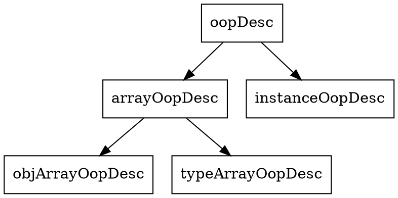
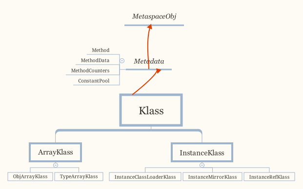

## Introduction

One reason for the oop/klass dichotomy in the implementation is that we don't want a C++ vtbl pointer in every object.
Thus, normal oops don't have any virtual functions. 
Instead, they forward all "virtual" functions to their klass, which does have a vtbl and does the C++ dispatch depending on the object's actual type. (See `oop.inline.hpp` for some of the forwarding code.)


## oop
oopDesc is the top baseclass for objects classes. The Desc classes describe the format of Java objects so the fields can be accessed from C++.
oopDesc is abstract, and no virtual functions allowed.


### Object Hierarchy

This hierarchy is a representation hierarchy, i.e. 
if A is a superclass of B, A's representation is a prefix of B's representation.





```cpp
// oopsHierarchy.hpp

typedef juint narrowOop; // Offset instead of address for an oop within a java object

// If compressed klass pointers then use narrowKlass.
typedef juint  narrowKlass;

typedef class oopDesc*                            oop;
typedef class   instanceOopDesc*            instanceOop;
typedef class   arrayOopDesc*                    arrayOop;
typedef class     objArrayOopDesc*            objArrayOop;
typedef class     typeArrayOopDesc*            typeArrayOop;
```
| Type         | Java |
| ------------ | ---- |
| instanceOop  |  Obj    |
| objArrayOop  |  Obj[]  |
| typeArrayOop |  []     |


### struct

The layout of Oops is:

- [markWord](/docs/CS/Java/JDK/JVM/Oop-Klass.md?id=MarkWord)
- [Klass*](/docs/CS/Java/JDK/JVM/Oop-Klass.md?id=klass)    // 32 bits if compressed but declared 64 in LP64.
- length    // shares klass memory or allocated after declared fields if array Oop.

```cpp
class oopDesc {
 private:
  volatile markWord _mark;
  union _metadata {
    Klass*      _klass;
    narrowKlass _compressed_klass;
  } _metadata;
}
```


## allocate_instance

called by `java.lang.reflect.Constructor` or `new Klass(args ...)` or etc.

```cpp
instanceOop InstanceKlass::allocate_instance(TRAPS) {
  bool has_finalizer_flag = has_finalizer(); // Query before possible GC
  int size = size_helper();  // Query before forming handle.

  instanceOop i;

  i = (instanceOop)Universe::heap()->obj_allocate(this, size, CHECK_NULL);
  if (has_finalizer_flag && !RegisterFinalizersAtInit) {
    i = register_finalizer(i, CHECK_NULL);
  }
  return i;
}
```

[Allocate](/docs/CS/Java/JDK/JVM/Oop-Klass.md?id=Allocate) and [Initialize](/docs/CS/Java/JDK/JVM/Oop-Klass.md?id=Initialize) Oop.

```cpp
// collectedHeap.cpp
oop CollectedHeap::obj_allocate(Klass* klass, int size, TRAPS) {
  ObjAllocator allocator(klass, size, THREAD);
  return allocator.allocate();
}

// share/gc/shared/memAllocator.cpp
oop MemAllocator::allocate() const {
  oop obj = NULL;
  {
    Allocation allocation(*this, &obj);
    HeapWord* mem = mem_allocate(allocation);
    if (mem != NULL) {
      obj = initialize(mem); // 
    }
  }
  return obj;
}
```

### allocate
```cpp
HeapWord* MemAllocator::mem_allocate(Allocation& allocation) const {
  if (UseTLAB) {
    HeapWord* result = allocate_inside_tlab(allocation);
    if (result != NULL) {
      return result;
    }
  }

  return allocate_outside_tlab(allocation);
}


HeapWord* MemAllocator::allocate_outside_tlab(Allocation& allocation) const {
  allocation._allocated_outside_tlab = true;
  HeapWord* mem = _heap->mem_allocate(_word_size, &allocation._overhead_limit_exceeded);
  if (mem == NULL) {
    return mem;
  }
```

#### inside tlab


Try refilling the TLAB and allocating the object in it.

```cpp

HeapWord* MemAllocator::allocate_inside_tlab(Allocation& allocation) const {
  assert(UseTLAB, "should use UseTLAB");

  // Try allocating from an existing TLAB.
  HeapWord* mem = _thread->tlab().allocate(_word_size);
  if (mem != NULL) {
    return mem;
  }

  // Try refilling the TLAB and allocating the object in it.
  return allocate_inside_tlab_slow(allocation);
}
```

#### EMA


##### slow

```cpp
HeapWord* MemAllocator::allocate_inside_tlab_slow(Allocation& allocation) const {
  HeapWord* mem = NULL;
  ThreadLocalAllocBuffer& tlab = _thread->tlab();

  if (JvmtiExport::should_post_sampled_object_alloc()) {
    tlab.set_back_allocation_end();
    mem = tlab.allocate(_word_size);

    // We set back the allocation sample point to try to allocate this, reset it
    // when done.
    allocation._tlab_end_reset_for_sample = true;

    if (mem != NULL) {
      return mem;
    }
  }

  // Retain tlab and allocate object in shared space if the amount free in the tlab is too large to discard.
  if (tlab.free() > tlab.refill_waste_limit()) {
    tlab.record_slow_allocation(_word_size);
    return NULL;
  }

  // Discard tlab and allocate a new one.
  // To minimize fragmentation, the last TLAB may be smaller than the rest.
  size_t new_tlab_size = tlab.compute_size(_word_size);

```
fill with dummy object(GC friendly)
```cpp
  tlab.retire_before_allocation();

  if (new_tlab_size == 0) {
    return NULL;
  }
```
Allocate a new TLAB requesting new_tlab_size. Any size between minimal and new_tlab_size is accepted.
```
  size_t min_tlab_size = ThreadLocalAllocBuffer::compute_min_size(_word_size);
  mem = Universe::heap()->allocate_new_tlab(min_tlab_size, new_tlab_size, &allocation._allocated_tlab_size);
  if (mem == NULL) {
    assert(allocation._allocated_tlab_size == 0,
           "Allocation failed, but actual size was updated. min: " SIZE_FORMAT
           ", desired: " SIZE_FORMAT ", actual: " SIZE_FORMAT,
           min_tlab_size, new_tlab_size, allocation._allocated_tlab_size);
    return NULL;
  }
  assert(allocation._allocated_tlab_size != 0, "Allocation succeeded but actual size not updated. mem at: "
         PTR_FORMAT " min: " SIZE_FORMAT ", desired: " SIZE_FORMAT,
         p2i(mem), min_tlab_size, new_tlab_size);

  if (ZeroTLAB) {
    // ..and clear it.
    Copy::zero_to_words(mem, allocation._allocated_tlab_size);
  } else {
    // ...and zap just allocated object.
#ifdef ASSERT
    // Skip mangling the space corresponding to the object header to
    // ensure that the returned space is not considered parsable by
    // any concurrent GC thread.
    size_t hdr_size = oopDesc::header_size();
    Copy::fill_to_words(mem + hdr_size, allocation._allocated_tlab_size - hdr_size, badHeapWordVal);
#endif // ASSERT
  }

  tlab.fill(mem, mem + _word_size, allocation._allocated_tlab_size);
  return mem;
}
```


#### outside tlab

implement by different collectors

```cpp

HeapWord* MemAllocator::allocate_outside_tlab(Allocation& allocation) const {
  allocation._allocated_outside_tlab = true;
  HeapWord* mem = Universe::heap()->mem_allocate(_word_size, &allocation._overhead_limit_exceeded);
  if (mem == NULL) {
    return mem;
  }

  NOT_PRODUCT(Universe::heap()->check_for_non_bad_heap_word_value(mem, _word_size));
  size_t size_in_bytes = _word_size * HeapWordSize;
  _thread->incr_allocated_bytes(size_in_bytes);

  return mem;
}
```

### initialize
clear_mem & set [markWord](/docs/CS/Java/JDK/JVM/Oop-Klass.md?id=MarkWord)
```cpp
// share/gc/shared/memAllocator.cpp
oop ObjAllocator::initialize(HeapWord* mem) const {
  mem_clear(mem);
  return finish(mem);
}

oop MemAllocator::finish(HeapWord* mem) const {
  // May be bootstrapping
  oopDesc::set_mark(mem, markWord::prototype()); // no_hash_in_place | no_lock_in_place
  
  // Need a release store to ensure array/class length, mark word, and
  // object zeroing are visible before setting the klass non-NULL, for
  // concurrent collectors.
  oopDesc::release_set_klass(mem, _klass);
  return cast_to_oop(mem);
}
```


## MarkWord

The markOop describes the header of an object.
> [!NOTE]
> 
> Note that the mark is not a real oop but just a word.
> It is placed in the oop hierarchy for historical reasons.

Bit-format of an object header (most significant first, big endian layout below):
```
 32 bits:
 --------
            hash:25 ------------>| age:4    biased_lock:1 lock:2 (normal object)
            JavaThread*:23 epoch:2 age:4    biased_lock:1 lock:2 (biased object)
            size:32 ------------------------------------------>| (CMS free block)
            PromotedObject*:29 ---------->| promo_bits:3 ----->| (CMS promoted object)

 64 bits:
 --------
 unused:25 hash:31 -->| unused:1   age:4    biased_lock:1 lock:2 (normal object)
 JavaThread*:54 epoch:2 unused:1   age:4    biased_lock:1 lock:2 (biased object)
PromotedObject*:61 --------------------->| promo_bits:3 ----->| (CMS promoted object)
size:64 ----------------------------------------------------->| (CMS free block)

unused:25 hash:31 -->| cms_free:1 age:4    biased_lock:1 lock:2 (COOPs && normal object)
JavaThread*:54 epoch:2 cms_free:1 age:4    biased_lock:1 lock:2 (COOPs && biased object)
narrowOop:32 unused:24 cms_free:1 unused:4 promo_bits:3 ----->| (COOPs && CMS promoted object)
unused:21 size:35 -->| cms_free:1 unused:7 ------------------>| (COOPs && CMS free block)
```

- hash contains the identity hash value: largest value is
  31 bits, see os::random().  Also, 64-bit vm's require
  a hash value no bigger than 32 bits because they will not
  properly generate a mask larger than that: see library_call.cpp
  and c1_CodePatterns_sparc.cpp.(see [HashCode](/docs/CS/Java/JDK/Basic/Object.md?id=hashCode))

- the biased lock pattern is used to bias a lock toward a given
  thread. When this pattern is set in the low three bits, the lock
  is either biased toward a given thread or "anonymously" biased,
  indicating that it is possible for it to be biased. When the
  lock is biased toward a given thread, locking and unlocking can
  be performed by that thread without using atomic operations.
  When a lock's bias is revoked, it reverts back to the normal
  locking scheme described below.

  Note that we are overloading the meaning of the "unlocked" state
  of the header. Because we steal a bit from the age we can
  guarantee that the bias pattern will never be seen for a truly
  unlocked object.

  Note also that the biased state contains the age bits normally
  contained in the object header. Large increases in scavenge
  times were seen when these bits were absent and an arbitrary age
  assigned to all biased objects, because they tended to consume a
  significant fraction of the eden semispaces and were not
  promoted promptly, causing an increase in the amount of copying
  performed. The runtime system aligns all JavaThread* pointers to
  a very large value (currently 128 bytes (32bVM) or 256 bytes (64bVM))
  to make room for the age bits & the epoch bits (used in support of
  biased locking), and for the CMS "freeness" bit in the 64bVM (+COOPs).
```
  [JavaThread* | epoch | age | 1 | 01]       lock is biased toward given thread
  [0           | epoch | age | 1 | 01]       lock is anonymously biased
```
- the two lock bits are used to describe three states: locked/unlocked and monitor.
```
  [ptr             | 00]  locked             ptr points to real header on stack
  [header      | 0 | 01]  unlocked           regular object header
  [ptr             | 10]  monitor            inflated lock (header is wapped out)
  [ptr             | 11]  marked             used by markSweep to mark an object not valid at any other time
```

We assume that stack/thread pointers have the lowest two bits cleared.


In JDK12, and now `markOopDesc` changed to `markWord`
```cpp
//markOop.hpp
class markOopDesc: public oopDesc
  ObjectMonitor* monitor() const {
    assert(has_monitor(), "check");
    // Use xor instead of &~ to provide one extra tag-bit check.
    return (ObjectMonitor*) (value() ^ monitor_value);//monitor_value = 2
  }
  ...
}
```


```cpp
// share/oops/markWord.hpp
class markWord {
 private:
  uintptr_t _value;

 public:
  explicit markWord(uintptr_t value) : _value(value) {}

  markWord() = default;         // Doesn't initialize _value.
}
```


```shell
-XX:+UseCompressedOops
```

由于使用了8字节对齐后每个对象的地址偏移量后3位必定为0，所以在存储的时候可以将后3位0抹除（转化为bit是抹除了最后24位）
在此基础上再去掉最高位，就完成了指针从8字节到4字节的压缩。而在实际使用时，在压缩后的指针后加3位0，就能够实现向真实地址的映射。
指针的32位中的每一个bit，都可以代表8个字节，这样就相当于使原有的内存地址得到了8倍的扩容。所以在8字节对齐的情况下，32位最大能表示2^32*8=32GB内存
由于能够表示的最大内存是32GB，所以如果配置的最大的堆内存超过这个数值时，那么指针压缩将会失效。


```hpp
// globals.hpp
product(intx, FieldsAllocationStyle, 1,                                     \
          "0 - type based with oops first, "                                \
          "1 - with oops last, "                                            \
          "2 - oops in super and sub classes are together")                 \
          range(0, 2)                                                       \
                                                                            \
product(bool, CompactFields, true,                                          \
          "Allocate nonstatic fields in gaps between previous fields")      \
```

64-bit padding for 8bytes
```hpp
lp64_product(intx, ObjectAlignmentInBytes, 8,                               \
          "Default object alignment in bytes, 8 is minimum")                \
          range(8, 256)                                                     \
          constraint(ObjectAlignmentInBytesConstraintFunc,AtParse)          \
```
if UseCompressedOops in 64-bit VM
```hpp

 lp64_product(bool, UseCompressedOops, false,                               \
          "Use 32-bit object references in 64-bit VM. "                     \
          "lp64_product means flag is always constant in 32 bit VM")        \
```


超过15 报错

```
-XX:MaxTenuringThreshold=15
```


access object use direct-pointer or handle


### Example

add JOL dependency.

```groovy
// https://mvnrepository.com/artifact/org.openjdk.jol/jol-core
compile group: 'org.openjdk.jol', name: 'jol-core', version: '0.13'
```

Print VM details.
```java
System.out.println(VM.current().details());
```

```shell
# Running 64-bit HotSpot VM.
# Using compressed oop with 3-bit shift.
# Using compressed klass with 3-bit shift.
# WARNING | Compressed references base/shifts are guessed by the experiment!
# WARNING | Therefore, computed addresses are just guesses, and ARE NOT RELIABLE.
# WARNING | Make sure to attach Serviceability Agent to get the reliable addresses.
# Objects are 8 bytes aligned.
# Field sizes by type: 4, 1, 1, 2, 2, 4, 4, 8, 8 [bytes]
# Array element sizes: 4, 1, 1, 2, 2, 4, 4, 8, 8 [bytes]
```


Print object layout.
```java
Object o = new Object();
System.out.println(ClassLayout.parseInstance(o).toPrintable());

String[] array = new String[]{"dfs", "fds", "ds", "fs"};
System.out.println(ClassLayout.parseInstance(array).toPrintable());
```


Output:

```shell
java.lang.Object object internals:
 OFFSET  SIZE   TYPE DESCRIPTION                               VALUE
      0     4        (object header)                           01 00 00 00 (00000001 00000000 00000000 00000000) (1)
      4     4        (object header)                           00 00 00 00 (00000000 00000000 00000000 00000000) (0)
      8     4        (object header)                           e5 01 00 f8 (11100101 00000001 00000000 11111000) (-134217243)
     12     4        (loss due to the next object alignment)
Instance size: 16 bytes
Space losses: 0 bytes internal + 4 bytes external = 4 bytes total

[Ljava.lang.String; object internals:
 OFFSET  SIZE               TYPE DESCRIPTION                               VALUE
      0     4                    (object header)                           01 00 00 00 (00000001 00000000 00000000 00000000) (1)
      4     4                    (object header)                           00 00 00 00 (00000000 00000000 00000000 00000000) (0)
      8     4                    (object header)                           43 37 00 f8 (01000011 00110111 00000000 11111000) (-134203581)
     12     4                    (object header)                           04 00 00 00 (00000100 00000000 00000000 00000000) (4) #array size
     16    16   java.lang.String String;.<elements>                        N/A
Instance size: 32 bytes
Space losses: 0 bytes internal + 0 bytes external = 0 bytes total
```


## Metadata


### Metadata hierarchy
```cpp
// The metadata hierarchy is separate from the oop hierarchy

//      class MetaspaceObj
class   ConstMethod;
class   ConstantPoolCache;
class   MethodData;
//      class Metadata
class   Method;
class   ConstantPool;
//      class CHeapObj
class   CompiledICHolder;
```

- Klass
- Method
- MethodData
- MethodCounters
- ConstantPool

## Klass

### Klass hierarchy

The klass hierarchy is separate from the oop hierarchy.




```cpp
class Klass;
class   InstanceKlass;
class     InstanceMirrorKlass;
class     InstanceClassLoaderKlass;
class     InstanceRefKlass;
class   ArrayKlass;
class     ObjArrayKlass;
class     TypeArrayKlass;
```


| Type                     | Java Level                |      |
| ------------------------ | ------------------------- | ---- |
|                          |                           |      |
| InstanceMirrorKlass      | `java.lang.CLass`         |      |
| InstanceRefKlass         | `java.lang.ref.Reference` |      |
| InstanceClassLoaderKlass | `java.lang.ClassLoader`   |      |


### follow_object

```cpp
// share/gc/serial/markSweep.cpp
inline void MarkSweep::follow_object(oop obj) {
  if (obj->is_objArray()) {
    // Handle object arrays explicitly to allow them to
    // be split into chunks if needed.
    MarkSweep::follow_array((objArrayOop)obj);
  } else {
    obj->oop_iterate(&mark_and_push_closure);
  }
}
```


```cpp
// InstanceKlass.inline.hpp
template <typename T, class OopClosureType>
ALWAYSINLINE void InstanceKlass::oop_oop_iterate_oop_maps(oop obj, OopClosureType* closure) {
  OopMapBlock* map           = start_of_nonstatic_oop_maps();
  OopMapBlock* const end_map = map + nonstatic_oop_map_count();

  for (; map < end_map; ++map) {
    oop_oop_iterate_oop_map<T>(map, obj, closure);
  }
}
```
The iteration over the oops in objects is a hot path in the GC code.
By force inlining the following functions, we get similar GC performance as the previous macro based implementation.

```cpp
template <typename T, class OopClosureType>
ALWAYSINLINE void InstanceKlass::oop_oop_iterate_oop_map(OopMapBlock* map, oop obj, OopClosureType* closure) {
  T* p         = (T*)obj->obj_field_addr_raw<T>(map->offset());
  T* const end = p + map->count();

  for (; p < end; ++p) {
    Devirtualizer::do_oop(closure, p);
  }
}
```

_layout_helper:
instance >0
array <0
tag primer type or OOP type
hsz first element offset
ebt primer type element
esz element size
others =0

_name

_access_flags

_java_mirror: Class object  instance

_super

_subklass
point the first subkclass

_next_sibling

is a linked list to get all of sibling klasses

_methods

_method_ordering

_local_interfaces: implement

_transitive_interfaces: extends

_fields

_constants

_class_loader

_protection_domain

vtables

itables

static fields

non-static oop-map block

### vtable

array 

-Xlog:vtables=trace

update_inherited_vtable

#### initialize_vtable

called when [Linking Class](/docs/CS/Java/JDK/JVM/ClassLoader.md?id=Linking)

Revised lookup semantics   introduced 1.3 (Kestrel beta)
```cpp
// share/oops/klassVtable.cpp
void klassVtable::initialize_vtable(bool checkconstraints, TRAPS) {

  // Note:  Arrays can have intermediate array supers.  Use java_super to skip them.
  InstanceKlass* super = _klass->java_super();
  int nofNewEntries = 0;

  bool is_shared = _klass->is_shared();

  if (!_klass->is_array_klass()) {
    ResourceMark rm(THREAD);
    log_develop_debug(vtables)("Initializing: %s", _klass->name()->as_C_string());
  }

#ifdef ASSERT
  oop* end_of_obj = (oop*)_klass + _klass->size();
  oop* end_of_vtable = (oop*)&table()[_length];
  assert(end_of_vtable <= end_of_obj, "vtable extends beyond end");
#endif

  if (Universe::is_bootstrapping()) {
    assert(!is_shared, "sanity");
    // just clear everything
    for (int i = 0; i < _length; i++) table()[i].clear();
    return;
  }

  int super_vtable_len = initialize_from_super(super);
  if (_klass->is_array_klass()) {
    assert(super_vtable_len == _length, "arrays shouldn't introduce new methods");
  } else {
    assert(_klass->is_instance_klass(), "must be InstanceKlass");

    Array<Method*>* methods = ik()->methods();
    int len = methods->length();
    int initialized = super_vtable_len;
```
Check each of this class's methods against super;
if override, replace in copy of super vtable, otherwise append to end
```cpp
    for (int i = 0; i < len; i++) {
      HandleMark hm(THREAD);
      methodHandle mh(THREAD, methods->at(i));

```
update_inherited_vtable can stop for gc - ensure using handles
```cpp
      bool needs_new_entry = update_inherited_vtable(ik(), mh, super_vtable_len, -1, checkconstraints, CHECK);
      if (needs_new_entry) {
        put_method_at(mh(), initialized);
        mh()->set_vtable_index(initialized); // set primary vtable index
        initialized++;
      }
    }
```
update vtable with default_methods
```cpp
    Array<Method*>* default_methods = ik()->default_methods();
    if (default_methods != NULL) {
      len = default_methods->length();
      if (len > 0) {
        Array<int>* def_vtable_indices = NULL;
        if ((def_vtable_indices = ik()->default_vtable_indices()) == NULL) {
          assert(!is_shared, "shared class def_vtable_indices does not exist");
          def_vtable_indices = ik()->create_new_default_vtable_indices(len, CHECK);
        } else {
          assert(def_vtable_indices->length() == len, "reinit vtable len?");
        }
        for (int i = 0; i < len; i++) {
          HandleMark hm(THREAD);
          assert(default_methods->at(i)->is_method(), "must be a Method*");
          methodHandle mh(THREAD, default_methods->at(i));
          assert(!mh->is_private(), "private interface method in the default method list");
          bool needs_new_entry = update_inherited_vtable(ik(), mh, super_vtable_len, i, checkconstraints, CHECK);

          // needs new entry
          if (needs_new_entry) {
            put_method_at(mh(), initialized);
            if (is_preinitialized_vtable()) {
              // At runtime initialize_vtable is rerun for a shared class
              // (loaded by the non-boot loader) as part of link_class_impl().
              // The dumptime vtable index should be the same as the runtime index.
              assert(def_vtable_indices->at(i) == initialized,
                     "dump time vtable index is different from runtime index");
            } else {
              def_vtable_indices->at_put(i, initialized); //set vtable index
            }
            initialized++;
          }
        }
      }
    }

    // add miranda methods; it will also return the updated initialized
    // Interfaces do not need interface methods in their vtables
    // This includes miranda methods and during later processing, default methods
    if (!ik()->is_interface()) {
      initialized = fill_in_mirandas(initialized, THREAD);
    }

    // In class hierarchies where the accessibility is not increasing (i.e., going from private ->
    // package_private -> public/protected), the vtable might actually be smaller than our initial
    // calculation, for classfile versions for which we do not do transitive override
    // calculations.
    if (ik()->major_version() >= VTABLE_TRANSITIVE_OVERRIDE_VERSION) {
      assert(initialized == _length, "vtable initialization failed");
    } else {
      assert(initialized <= _length, "vtable initialization failed");
      for(;initialized < _length; initialized++) {
        table()[initialized].clear();
      }
    }
    NOT_PRODUCT(verify(tty, true));
  }
}
```


Update child's copy of super vtable for overrides
OR return true if a new vtable entry is required.
Only called for InstanceKlass's, i.e. not for arrays
If that changed, could not use _klass as handle for klass


#### initialize_itable
called when [Linking Class](/docs/CS/Java/JDK/JVM/ClassLoader.md?id=Linking)

```cpp
// share/oops/klassVtable.cpp
void klassItable::initialize_itable(GrowableArray<Method*>* supers) {
  if (_klass->is_interface()) {
    // This needs to go after vtable indices are assigned but
    // before implementors need to know the number of itable indices.
    assign_itable_indices_for_interface(InstanceKlass::cast(_klass));
  }
```


### CLD

```cpp
// ClassLoaderData.hpp
class ClassLoaderData : public CHeapObj<mtClass> {


  static ClassLoaderData * _the_null_class_loader_data;

  WeakHandle<vm_class_loader_data> _holder; // The oop that determines lifetime of this class loader
  OopHandle _class_loader;    // The instance of java/lang/ClassLoader associated with
                              // this ClassLoaderData
           
  ClassLoaderMetaspace * volatile _metaspace;  // Meta-space where meta-data defined by the
                                    // classes in the class loader are allocated.
  Mutex* _metaspace_lock;  // Locks the metaspace for allocations and setup.
  
  bool _unloading;         // true if this class loader goes away
  bool _is_unsafe_anonymous; // CLD is dedicated to one class and that class determines the CLDs lifecycle.
                             // For example, an unsafe anonymous class.

  // Remembered sets support for the oops in the class loader data.
  bool _modified_oops;             // Card Table Equivalent (YC/CMS support)
  bool _accumulated_modified_oops; // Mod Union Equivalent (CMS support)

  s2 _keep_alive;          // if this CLD is kept alive.
                           // Used for unsafe anonymous classes and the boot class
                           // loader. _keep_alive does not need to be volatile or
                           // atomic since there is one unique CLD per unsafe anonymous class.
                                             
  // Support for walking class loader data objects
  ClassLoaderData* _next; /// Next loader_datas created
  
  Klass* volatile _klasses;              // The classes defined by the class loader.
  
  // Support for walking class loader data objects
  ClassLoaderData* _next; /// Next loader_datas created
  
  Klass*  _class_loader_klass;
  Symbol* _name;
  }
```

```java

public class ClassLoaderDataGraph {
    /** Lookup an already loaded class in any class loader. */
    public Klass find(String className) {
        for (ClassLoaderData cld = getClassLoaderGraphHead(); cld != null; cld = cld.next()) {
            Klass k = cld.find(className);
            if (k != null) {
                return k;
            }
        }
        return null;
    }


    /** Interface for iterating through all classes and their class
     loaders in dictionary */
    public static interface ClassAndLoaderVisitor {
        public void visit(Klass k, Oop loader);
    }

    /** Iterate over all klasses - including object, primitive
     array klasses */
    public void classesDo(ClassVisitor v) {
        for (ClassLoaderData cld = getClassLoaderGraphHead(); cld != null; cld = cld.next()) {
            cld.classesDo(v);
        }
    }
}
```

```cpp
// ClassLoaderDataGraph.cpp
// These functions assume that the caller has locked the ClassLoaderDataGraph_lock
// if they are not calling the function from a safepoint.
void ClassLoaderDataGraph::classes_do(KlassClosure* klass_closure) {
  ClassLoaderDataGraphIterator iter;
  while (ClassLoaderData* cld = iter.get_next()) {
    cld->classes_do(klass_closure);
  }
}


// ClassLoaderData.cpp
void ClassLoaderData::classes_do(KlassClosure* klass_closure) {
  // Lock-free access requires load_acquire
  for (Klass* k = OrderAccess::load_acquire(&_klasses); k != NULL; k = k->next_link()) {
    klass_closure->do_klass(k);
    assert(k != k->next_link(), "no loops!");
  }
}
```

## Constant Pool

A ConstantPool is an **array** containing class constants as described in the class file.

Most of the constant pool entries are written during [class parsing](/docs/CS/Java/JDK/JVM/ClassLoader.md?id=parse_stream), which is safe.  
For klass types, the constant pool entry is modified when the entry is resolved.  
If a klass constant pool entry is read without a lock, only the resolved state guarantees that the entry in the constant pool is a klass object and not a Symbol*.


```cpp

class ConstantPool : public Metadata {
 private:
  // If you add a new field that points to any metaspace object, you
  // must add this field to ConstantPool::metaspace_pointers_do().
  Array<u1>*           _tags;        // the tag array describing the constant pool's contents
  ConstantPoolCache*   _cache;       // the cache holding interpreter runtime information
  InstanceKlass*       _pool_holder; // the corresponding class
  Array<u2>*           _operands;    // for variable-sized (InvokeDynamic) nodes, usually empty

  // Consider using an array of compressed klass pointers to
  // save space on 64-bit platforms.
  Array<Klass*>*       _resolved_klasses;

  u2              _major_version;        // major version number of class file
  u2              _minor_version;        // minor version number of class file

  // Constant pool index to the utf8 entry of the Generic signature,
  // or 0 if none.
  u2              _generic_signature_index;
  // Constant pool index to the utf8 entry for the name of source file
  // containing this klass, 0 if not specified.
  u2              _source_file_name_index;

  enum {
    _has_preresolution    = 1,       // Flags
    _on_stack             = 2,
    _is_shared            = 4,
    _has_dynamic_constant = 8
  };
}  
```
parse_constant_pool -> 
allocate
```cpp
// constantPool.cpp
ConstantPool* ConstantPool::allocate(ClassLoaderData* loader_data, int length, TRAPS) {
  Array<u1>* tags = MetadataFactory::new_array<u1>(loader_data, length, 0, CHECK_NULL);
  int size = ConstantPool::size(length);
  return new (loader_data, size, MetaspaceObj::ConstantPoolType, THREAD) ConstantPool(tags);
}
```

### Cache

A constant pool cache is a runtime data structure set aside to a constant pool. 
The cache holds interpreter runtime information for all field access and invoke bytecodes. 
The cache is created and initialized before a class is actively used (i.e., initialized), the individual cache entries are filled at resolution (i.e., "link") time (see also: rewriter.*).


`ConstantPool::resolved_references_or_null()`


## Links
- [JVM](/docs/CS/Java/JDK/JVM/JVM.md)
- [ClassLoader](/docs/CS/Java/JDK/JVM/ClassLoader.md)
- [Class File and Compiler](/docs/CS/Java/JDK/JVM/ClassFile.md)

## References
