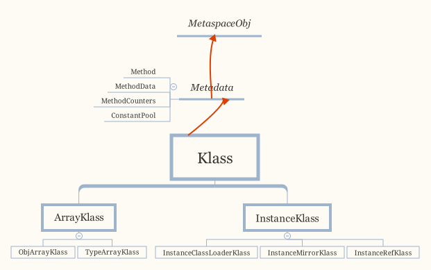
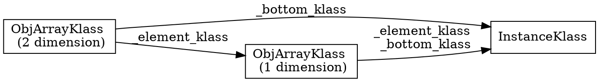
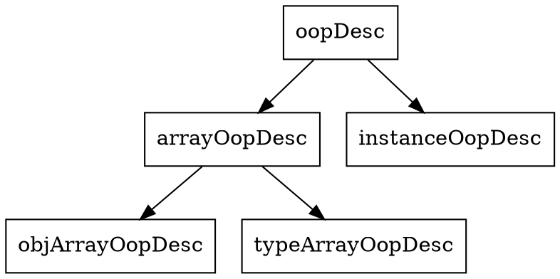

## Introduction

One reason for the oop/klass dichotomy in the implementation is that we don't want a C++ vtbl pointer in every object.
Thus, normal oops don't have any virtual functions.
<br/>
Instead, they forward all "virtual" functions to their klass, which does have a vtbl and does the C++ dispatch depending on the object's actual type.


## Klass

A Klass provides:

1. language level class object (method dictionary etc.)
2. provide vm dispatch behavior for the object


Both functions are combined into one C++ class.


### Klass hierarchy

The klass hierarchy is separate from the oop hierarchy.

<div style="text-align: center;">



</div>


<p style="text-align: center;">
Fig.1. Klass hierarchy.
</p>


<div class="center">

| Type                     | Java Level                |
| ------------------------ | ------------------------- |
|                          |                           |
| InstanceMirrorKlass      | `java.lang.CLass`         |
| InstanceRefKlass         | `java.lang.ref.Reference` |
| InstanceClassLoaderKlass | `java.lang.ClassLoader`   |


</div>


### Klass Struct

```cpp
class Klass : public Metadata {

protected:
  enum { _primary_super_limit = 8 };
  
  jint        _layout_helper;

  const KlassID _id;

  int _vtable_len;
  
  juint       _super_check_offset;
  Symbol*     _name;
  Klass*      _secondary_super_cache;
  Array<Klass*>* _secondary_supers;
  Klass*      _primary_supers[_primary_super_limit];
  
  OopHandle   _java_mirror;     // java/lang/Class instance mirroring this class
  Klass*      _super;
  Klass* volatile _subklass;
  Klass* volatile _next_sibling;
  Klass*      _next_link;       // All klasses loaded by a class loader are chained through these links

  // The VM's representation of the ClassLoader used to load this class.
  // Provide access the corresponding instance java.lang.ClassLoader.
  ClassLoaderData* _class_loader_data;

  jint        _modifier_flags;  // Processed access flags, for use by Class.getModifiers.
  AccessFlags _access_flags;    // Access flags. The class/interface distinction is stored here.

  // Biased locking implementation and statistics
  // (the 64-bit chunk goes first, to avoid some fragmentation)
  jlong    _last_biased_lock_bulk_revocation_time;
  markWord _prototype_header;   // Used when biased locking is both enabled and disabled for this type
  jint     _biased_lock_revocation_count;
}
```

### ArrayKlass

```cpp
class ArrayKlass: public Klass {
  friend class VMStructs;
 private:
  // If you add a new field that points to any metaspace object, you
  // must add this field to ArrayKlass::metaspace_pointers_do().
  int      _dimension;         // This is n'th-dimensional array.
  Klass* volatile _higher_dimension;  // Refers the (n+1)'th-dimensional array (if present).
  Klass* volatile _lower_dimension;   // Refers the (n-1)'th-dimensional array (if present).


```

#### TypeArrayKlass
```cpp
class TypeArrayKlass : public ArrayKlass {
 private:
  jint _max_length;            // maximum number of elements allowed in an array
}
```
#### ObjArrayKlass

```cpp
class ObjArrayKlass : public ArrayKlass {
 private:
  Klass* _element_klass;            // The klass of the elements of this array type
  Klass* _bottom_klass;             // The one-dimensional type (InstanceKlass or TypeArrayKlass)
}  
```




### oop_oop_iterate


```c
template <typename OopClosureType>
void oopDesc::oop_iterate(OopClosureType* cl) {
  OopIteratorClosureDispatch::oop_oop_iterate(cl, this, klass());
}

template <typename OopClosureType>
void OopIteratorClosureDispatch::oop_oop_iterate(OopClosureType* cl, oop obj, Klass* klass) {
  OopOopIterateDispatch<OopClosureType>::function(klass)(cl, obj, klass);
}
```

获取开始OopMapBlock和结束OopMapBlock，然后遍历这些OopMapBlock。OopMapBlock存储了该对象的字段偏移和个数，分别用offset和count表示
offset表示第一个字段相对于对象头的偏移，count表示对象有多少个字段
另外，如果有父类，则再用一个OopMapBlock表示父类，因此通过遍历对象的所有OopMapBlock就能访问对象的全部字段

```c
template <typename T, class OopClosureType>
ALWAYSINLINE void InstanceKlass::oop_oop_iterate(oop obj, OopClosureType* closure) {
  if (Devirtualizer::do_metadata(closure)) {
    Devirtualizer::do_klass(closure, this);
  }

  oop_oop_iterate_oop_maps<T>(obj, closure);
}

template <typename T, class OopClosureType>
ALWAYSINLINE void InstanceKlass::oop_oop_iterate_oop_maps(oop obj, OopClosureType* closure) {
  OopMapBlock* map           = start_of_nonstatic_oop_maps();
  OopMapBlock* const end_map = map + nonstatic_oop_map_count();

  for (; map < end_map; ++map) {
    oop_oop_iterate_oop_map<T>(map, obj, closure);
  }
}
```

```cpp
// share/gc/serial/markSweep.cpp
inline void MarkSweep::follow_object(oop obj) {
  if (obj->is_objArray()) {
    // Handle object arrays explicitly to allow them to
    // be split into chunks if needed.
    MarkSweep::follow_array((objArrayOop)obj);
  } else {
    obj->oop_iterate(&mark_and_push_closure);
  }
}
```

```cpp
// InstanceKlass.inline.hpp
template <typename T, class OopClosureType>
ALWAYSINLINE void InstanceKlass::oop_oop_iterate_oop_maps(oop obj, OopClosureType* closure) {
  OopMapBlock* map           = start_of_nonstatic_oop_maps();
  OopMapBlock* const end_map = map + nonstatic_oop_map_count();

  for (; map < end_map; ++map) {
    oop_oop_iterate_oop_map<T>(map, obj, closure);
  }
}
```

The iteration over the oops in objects is a hot path in the GC code.
By force inlining the following functions, we get similar GC performance as the previous macro based implementation.

```cpp
template <typename T, class OopClosureType>
ALWAYSINLINE void InstanceKlass::oop_oop_iterate_oop_map(OopMapBlock* map, oop obj, OopClosureType* closure) {
  T* p         = (T*)obj->obj_field_addr_raw<T>(map->offset());
  T* const end = p + map->count();

  for (; p < end; ++p) {
    Devirtualizer::do_oop(closure, p);
  }
}
```

_layout_helper:
instance >0
array <0
tag primer type or OOP type
hsz first element offset
ebt primer type element
esz element size
others =0

_name

_access_flags

_java_mirror: Class object  instance

_super

_subklass
point the first subkclass

_next_sibling

is a linked list to get all of sibling klasses

_methods

_method_ordering

_local_interfaces: implement

_transitive_interfaces: extends

_fields

_constants

_class_loader

_protection_domain

vtables

itables

static fields

non-static oop-map block

### vtable

可以开启VM参数`-Xlog:vtables=trace`查看所有类的虚表的创建过程(非production)
在调用虚方法时虚拟机会在运行时常量池中查找n的静态类型Node的print方法，获取它在Node虚表中的index，接着用index定位动态类型AddNode虚表中的虚方法进行调用

> [!TIP]
> 
> gcc使用-fdump-class-hierarchy输出虚表，clang使用-Xclang -fdump-vtable-layouts输出虚表，msvc使用/d1reportAllClassLayout输出虚表


update_inherited_vtable


#### initialize_vtable

called when [Linking Class](/docs/CS/Java/JDK/JVM/ClassLoader.md?id=Linking)

Revised lookup semantics   introduced 1.3 (Kestrel beta)

```cpp
// share/oops/klassVtable.cpp
// Revised lookup semantics   introduced 1.3 (Kestrel beta)
void klassVtable::initialize_vtable(GrowableArray<InstanceKlass*>* supers) {

  // Note:  Arrays can have intermediate array supers.  Use java_super to skip them.
  InstanceKlass* super = _klass->java_super();

  bool is_shared = _klass->is_shared();
  Thread* current = Thread::current();

  if (!_klass->is_array_klass()) {
    ResourceMark rm(current);
    log_develop_debug(vtables)("Initializing: %s", _klass->name()->as_C_string());
  }

  if (Universe::is_bootstrapping()) {
    assert(!is_shared, "sanity");
    // just clear everything
    for (int i = 0; i < _length; i++) table()[i].clear();
    return;
  }

  int super_vtable_len = initialize_from_super(super);
  if (_klass->is_array_klass()) {
    assert(super_vtable_len == _length, "arrays shouldn't introduce new methods");
  } else {
    assert(_klass->is_instance_klass(), "must be InstanceKlass");

    Array<Method*>* methods = ik()->methods();
    int len = methods->length();
    int initialized = super_vtable_len;

    // Check each of this class's methods against super;
    // if override, replace in copy of super vtable, otherwise append to end
    for (int i = 0; i < len; i++) {
      // update_inherited_vtable can stop for gc - ensure using handles
      methodHandle mh(current, methods->at(i));

      bool needs_new_entry = update_inherited_vtable(current, mh, super_vtable_len, -1, supers);

      if (needs_new_entry) {
        put_method_at(mh(), initialized);
        mh->set_vtable_index(initialized); // set primary vtable index
        initialized++;
      }
    }

    // update vtable with default_methods
    Array<Method*>* default_methods = ik()->default_methods();
    if (default_methods != nullptr) {
      len = default_methods->length();
      if (len > 0) {
        Array<int>* def_vtable_indices = ik()->default_vtable_indices();
        assert(def_vtable_indices != nullptr, "should be created");
        assert(def_vtable_indices->length() == len, "reinit vtable len?");
        for (int i = 0; i < len; i++) {
          bool needs_new_entry;
          {
            // Reduce the scope of this handle so that it is fetched again.
            // The methodHandle keeps it from being deleted by RedefineClasses while
            // we're using it.
            methodHandle mh(current, default_methods->at(i));
            assert(!mh->is_private(), "private interface method in the default method list");
            needs_new_entry = update_inherited_vtable(current, mh, super_vtable_len, i, supers);
          }

          // needs new entry
          if (needs_new_entry) {
            // Refetch this default method in case of redefinition that might
            // happen during constraint checking in the update_inherited_vtable call above.
            Method* method = default_methods->at(i);
            put_method_at(method, initialized);
            if (is_preinitialized_vtable()) {
              // At runtime initialize_vtable is rerun for a shared class
              // (loaded by the non-boot loader) as part of link_class_impl().
              // The dumptime vtable index should be the same as the runtime index.
              assert(def_vtable_indices->at(i) == initialized,
                     "dump time vtable index is different from runtime index");
            } else {
              def_vtable_indices->at_put(i, initialized); //set vtable index
            }
            initialized++;
          }
        }
      }
    }

    // add miranda methods; it will also return the updated initialized
    // Interfaces do not need interface methods in their vtables
    // This includes miranda methods and during later processing, default methods
    if (!ik()->is_interface()) {
      initialized = fill_in_mirandas(current, initialized);
    }

    // In class hierarchies where the accessibility is not increasing (i.e., going from private ->
    // package_private -> public/protected), the vtable might actually be smaller than our initial
    // calculation, for classfile versions for which we do not do transitive override
    // calculations.
    if (ik()->major_version() >= VTABLE_TRANSITIVE_OVERRIDE_VERSION) {
      assert(initialized == _length, "vtable initialization failed");
    } else {
      assert(initialized <= _length, "vtable initialization failed");
      for(;initialized < _length; initialized++) {
        table()[initialized].clear();
      }
    }
    NOT_PRODUCT(verify(tty, true));
  }
}
```

Update child's copy of super vtable for overrides
OR return true if a new vtable entry is required.
Only called for InstanceKlass's, i.e. not for arrays
If that changed, could not use _klass as handle for klass

update_inherited_vtable


```c
// Update child's copy of super vtable for overrides
// OR return true if a new vtable entry is required.
// Only called for InstanceKlass's, i.e. not for arrays
// If that changed, could not use _klass as handle for klass
bool klassVtable::update_inherited_vtable(Thread* current,
                                          const methodHandle& target_method,
                                          int super_vtable_len, int default_index,
                                          GrowableArray<InstanceKlass*>* supers) {
  bool allocate_new = true;

  InstanceKlass* klass = ik();

  Array<int>* def_vtable_indices = nullptr;
  bool is_default = false;

  // default methods are non-private concrete methods in superinterfaces which are added
  // to the vtable with their real method_holder.
  // Since vtable and itable indices share the same storage, don't touch
  // the default method's real vtable/itable index.
  // default_vtable_indices stores the vtable value relative to this inheritor
  if (default_index >= 0 ) {
    is_default = true;
    def_vtable_indices = klass->default_vtable_indices();
    assert(!target_method->is_private(), "private interface method flagged as default");
    assert(def_vtable_indices != nullptr, "def vtable alloc?");
    assert(default_index <= def_vtable_indices->length(), "def vtable len?");
  } else {
    assert(klass == target_method->method_holder(), "caller resp.");
    // Initialize the method's vtable index to "nonvirtual".
    // If we allocate a vtable entry, we will update it to a non-negative number.
    target_method->set_vtable_index(Method::nonvirtual_vtable_index);
  }

  // Private, static and <init> methods are never in
  if (target_method->is_private() || target_method->is_static() ||
      (target_method->name()->fast_compare(vmSymbols::object_initializer_name()) == 0)) {
    return false;
  }

  if (target_method->is_final_method(klass->access_flags())) {
    // a final method never needs a new entry; final methods can be statically
    // resolved and they have to be present in the vtable only if they override
    // a super's method, in which case they re-use its entry
    allocate_new = false;
  } else if (klass->is_interface()) {
    allocate_new = false;  // see note below in needs_new_vtable_entry
    // An interface never allocates new vtable slots, only inherits old ones.
    // This method will either be assigned its own itable index later,
    // or be assigned an inherited vtable index in the loop below.
    // default methods inherited by classes store their vtable indices
    // in the inheritor's default_vtable_indices.
    // default methods inherited by interfaces may already have a
    // valid itable index, if so, don't change it.
    // Overpass methods in an interface will be assigned an itable index later
    // by an inheriting class.
    if ((!is_default || !target_method->has_itable_index())) {
      target_method->set_vtable_index(Method::pending_itable_index);
    }
  }

  // we need a new entry if there is no superclass
  Klass* super = klass->super();
  if (super == nullptr) {
    return allocate_new;
  }

  // search through the vtable and update overridden entries
  // Since check_signature_loaders acquires SystemDictionary_lock
  // which can block for gc, once we are in this loop, use handles
  // For classfiles built with >= jdk7, we now look for transitive overrides

  Symbol* name = target_method->name();
  Symbol* signature = target_method->signature();

  Klass* target_klass = target_method->method_holder();
  assert(target_klass != nullptr, "impossible");
  if (target_klass == nullptr) {
    target_klass = _klass;
  }

  HandleMark hm(current);
  Handle target_loader(current, target_klass->class_loader());

  Symbol* target_classname = target_klass->name();
  for(int i = 0; i < super_vtable_len; i++) {
    Method* super_method;
    if (is_preinitialized_vtable()) {
      // If this is a shared class, the vtable is already in the final state (fully
      // initialized). Need to look at the super's vtable.
      klassVtable superVtable = super->vtable();
      super_method = superVtable.method_at(i);
    } else {
      super_method = method_at(i);
    }
    // Check if method name matches.  Ignore match if klass is an interface and the
    // matching method is a non-public java.lang.Object method.  (See JVMS 5.4.3.4)
    // This is safe because the method at this slot should never get invoked.
    // (TBD: put in a method to throw NoSuchMethodError if this slot is ever used.)
    if (super_method->name() == name && super_method->signature() == signature &&
        (!klass->is_interface() ||
         !SystemDictionary::is_nonpublic_Object_method(super_method))) {

      // get super_klass for method_holder for the found method
      InstanceKlass* super_klass =  super_method->method_holder();

      // Whether the method is being overridden
      bool overrides = false;

      // private methods are also never overridden
      if (!super_method->is_private() &&
          (is_default ||
           can_be_overridden(super_method, target_loader, target_classname) ||
           (klass->major_version() >= VTABLE_TRANSITIVE_OVERRIDE_VERSION &&
             (super_klass = find_transitive_override(super_klass,
                                                     target_method, i, target_loader,
                                                     target_classname)) != nullptr))) {

        // Package private methods always need a new entry to root their own
        // overriding. They may also override other methods.
        if (!target_method->is_package_private()) {
          allocate_new = false;
        }

        // Set the vtable index before the constraint check safepoint, which potentially
        // redefines this method if this method is a default method belonging to a
        // super class or interface.
        put_method_at(target_method(), i);
        // Save super for constraint checking.
        if (supers != nullptr) {
          supers->at_put(i, super_klass);
        }

        overrides = true;
        if (!is_default) {
          target_method->set_vtable_index(i);
        } else {
          if (def_vtable_indices != nullptr) {
            if (is_preinitialized_vtable()) {
              // At runtime initialize_vtable is rerun as part of link_class_impl()
              // for a shared class loaded by the non-boot loader.
              // The dumptime vtable index should be the same as the runtime index.
              assert(def_vtable_indices->at(default_index) == i,
                     "dump time vtable index is different from runtime index");
            } else {
              def_vtable_indices->at_put(default_index, i);
            }
          }
          assert(super_method->is_default_method() || super_method->is_overpass()
                 || super_method->is_abstract(), "default override error");
        }
      } else {
        overrides = false;
      }
      log_vtables(i, overrides, target_method, target_klass, super_method);
    }
  }
  return allocate_new;
}
```


### CLD

```cpp
// ClassLoaderData.hpp
class ClassLoaderData : public CHeapObj<mtClass> {


  static ClassLoaderData * _the_null_class_loader_data;

  WeakHandle<vm_class_loader_data> _holder; // The oop that determines lifetime of this class loader
  OopHandle _class_loader;    // The instance of java/lang/ClassLoader associated with
                              // this ClassLoaderData
     
  ClassLoaderMetaspace * volatile _metaspace;  // Meta-space where meta-data defined by the
                                    // classes in the class loader are allocated.
  Mutex* _metaspace_lock;  // Locks the metaspace for allocations and setup.
  
  bool _unloading;         // true if this class loader goes away
  bool _is_unsafe_anonymous; // CLD is dedicated to one class and that class determines the CLDs lifecycle.
                             // For example, an unsafe anonymous class.

  // Remembered sets support for the oops in the class loader data.
  bool _modified_oops;             // Card Table Equivalent (YC/CMS support)
  bool _accumulated_modified_oops; // Mod Union Equivalent (CMS support)

  s2 _keep_alive;          // if this CLD is kept alive.
                           // Used for unsafe anonymous classes and the boot class
                           // loader. _keep_alive does not need to be volatile or
                           // atomic since there is one unique CLD per unsafe anonymous class.
                                       
  // Support for walking class loader data objects
  ClassLoaderData* _next; /// Next loader_datas created
  
  Klass* volatile _klasses;              // The classes defined by the class loader.
  
  // Support for walking class loader data objects
  ClassLoaderData* _next; /// Next loader_datas created
  
  Klass*  _class_loader_klass;
  Symbol* _name;
  }
```

```java

public class ClassLoaderDataGraph {
    /** Lookup an already loaded class in any class loader. */
    public Klass find(String className) {
        for (ClassLoaderData cld = getClassLoaderGraphHead(); cld != null; cld = cld.next()) {
            Klass k = cld.find(className);
            if (k != null) {
                return k;
            }
        }
        return null;
    }


    /** Interface for iterating through all classes and their class
     loaders in dictionary */
    public static interface ClassAndLoaderVisitor {
        public void visit(Klass k, Oop loader);
    }

    /** Iterate over all klasses - including object, primitive
     array klasses */
    public void classesDo(ClassVisitor v) {
        for (ClassLoaderData cld = getClassLoaderGraphHead(); cld != null; cld = cld.next()) {
            cld.classesDo(v);
        }
    }
}
```

```cpp
// ClassLoaderDataGraph.cpp
// These functions assume that the caller has locked the ClassLoaderDataGraph_lock
// if they are not calling the function from a safepoint.
void ClassLoaderDataGraph::classes_do(KlassClosure* klass_closure) {
  ClassLoaderDataGraphIterator iter;
  while (ClassLoaderData* cld = iter.get_next()) {
    cld->classes_do(klass_closure);
  }
}


// ClassLoaderData.cpp
void ClassLoaderData::classes_do(KlassClosure* klass_closure) {
  // Lock-free access requires load_acquire
  for (Klass* k = OrderAccess::load_acquire(&_klasses); k != NULL; k = k->next_link()) {
    klass_closure->do_klass(k);
    assert(k != k->next_link(), "no loops!");
  }
}
```
## itable

```c
class klassItable {
 private:
  InstanceKlass*       _klass;             // my klass
  int                  _table_offset;      // offset of start of itable data within klass (in words)
  int                  _size_offset_table; // size of offset table (in itableOffset entries)
  int                  _size_method_table; // size of methodtable (in itableMethodEntry entries)

  void initialize_itable_for_interface(int method_table_offset, InstanceKlass* interf_h,
                                       GrowableArray<Method*>* supers, int start_offset);
  void check_constraints(GrowableArray<Method*>* supers, TRAPS);
 public:
  klassItable(InstanceKlass* klass);

  itableOffsetEntry* offset_entry(int i) { assert(0 <= i && i <= _size_offset_table, "index out of bounds");
                                           return &((itableOffsetEntry*)vtable_start())[i]; }

  itableMethodEntry* method_entry(int i) { assert(0 <= i && i <= _size_method_table, "index out of bounds");
                                           return &((itableMethodEntry*)method_start())[i]; }

  int size_offset_table()                { return _size_offset_table; }

  // Initialization
  void initialize_itable_and_check_constraints(TRAPS);
  void initialize_itable(GrowableArray<Method*>* supers = nullptr);

#if INCLUDE_JVMTI
  // RedefineClasses() API support:
  // if any entry of this itable points to any of old_methods,
  // replace it with the corresponding new_method.
  // trace_name_printed is set to true if the current call has
  // printed the klass name so that other routines in the adjust_*
  // group don't print the klass name.
  void adjust_method_entries(bool* trace_name_printed);
  bool check_no_old_or_obsolete_entries();
  void dump_itable();
#endif // INCLUDE_JVMTI

  // Setup of itable
  static int assign_itable_indices_for_interface(InstanceKlass* klass);
  static int method_count_for_interface(InstanceKlass* klass);
  static int compute_itable_size(Array<InstanceKlass*>* transitive_interfaces);
  static void setup_itable_offset_table(InstanceKlass* klass);

 private:
  intptr_t* vtable_start() const { return ((intptr_t*)_klass) + _table_offset; }
  intptr_t* method_start() const { return vtable_start() + _size_offset_table * itableOffsetEntry::size(); }

  // Helper methods
  static int  calc_itable_size(int num_interfaces, int num_methods) { return (num_interfaces * itableOffsetEntry::size()) + (num_methods * itableMethodEntry::size()); }

};
```

initialize_itable


called when [Linking Class](/docs/CS/Java/JDK/JVM/ClassLoader.md?id=Linking)

```c
// Initialization
void klassItable::initialize_itable(GrowableArray<Method*>* supers) {
  if (_klass->is_interface()) {
    // This needs to go after vtable indices are assigned but
    // before implementors need to know the number of itable indices.
    assign_itable_indices_for_interface(InstanceKlass::cast(_klass));
  }

  // Cannot be setup doing bootstrapping, interfaces don't have
  // itables, and klass with only ones entry have empty itables
  if (Universe::is_bootstrapping() ||
      _klass->is_interface() ||
      _klass->itable_length() == itableOffsetEntry::size()) return;

  // There's always an extra itable entry so we can null-terminate it.
  guarantee(size_offset_table() >= 1, "too small");
  int num_interfaces = size_offset_table() - 1;
  if (num_interfaces > 0) {
    if (log_develop_is_enabled(Debug, itables)) {
      ResourceMark rm;
      log_develop_debug(itables)("%3d: Initializing itables for %s", ++initialize_count,
                       _klass->name()->as_C_string());
    }

    // Iterate through all interfaces
    for(int i = 0; i < num_interfaces; i++) {
      itableOffsetEntry* ioe = offset_entry(i);
      InstanceKlass* interf = ioe->interface_klass();
      assert(interf != nullptr && ioe->offset() != 0, "bad offset entry in itable");
      initialize_itable_for_interface(ioe->offset(), interf, supers,
                       (ioe->offset() - offset_entry(0)->offset())/wordSize);
    }
  }
  // Check that the last entry is empty
  itableOffsetEntry* ioe = offset_entry(size_offset_table() - 1);
  guarantee(ioe->interface_klass() == nullptr && ioe->offset() == 0, "terminator entry missing");
}
```


```c
void klassItable::initialize_itable_for_interface(int method_table_offset, InstanceKlass* interf,
                                                  GrowableArray<Method*>* supers,
                                                  int start_offset) {
  assert(interf->is_interface(), "must be");
  Array<Method*>* methods = interf->methods();
  int nof_methods = methods->length();

  int ime_count = method_count_for_interface(interf);
  for (int i = 0; i < nof_methods; i++) {
    Method* m = methods->at(i);
    Method* target = nullptr;
    if (m->has_itable_index()) {
      // This search must match the runtime resolution, i.e. selection search for invokeinterface
      // to correctly enforce loader constraints for interface method inheritance.
      // Private methods are skipped as a private class method can never be the implementation
      // of an interface method.
      // Invokespecial does not perform selection based on the receiver, so it does not use
      // the cached itable.
      target = LinkResolver::lookup_instance_method_in_klasses(_klass, m->name(), m->signature(),
                                                               Klass::PrivateLookupMode::skip);
    }
    if (target == nullptr || !target->is_public() || target->is_abstract() || target->is_overpass()) {
      assert(target == nullptr || !target->is_overpass() || target->is_public(),
             "Non-public overpass method!");
      // Entry does not resolve. Leave it empty for AbstractMethodError or other error.
      if (!(target == nullptr) && !target->is_public()) {
        // Stuff an IllegalAccessError throwing method in there instead.
        itableOffsetEntry::method_entry(_klass, method_table_offset)[m->itable_index()].
            initialize(_klass, Universe::throw_illegal_access_error());
      }
    } else {

      int ime_num = m->itable_index();
      assert(ime_num < ime_count, "oob");

      // Save super interface method to perform constraint checks.
      // The method is in the error message, that's why.
      if (supers != nullptr) {
        supers->at_put(start_offset + ime_num, m);
      }

      itableOffsetEntry::method_entry(_klass, method_table_offset)[ime_num].initialize(_klass, target);
      if (log_develop_is_enabled(Trace, itables)) {
        ResourceMark rm;
        if (target != nullptr) {
          LogTarget(Trace, itables) lt;
          LogStream ls(lt);
          char* sig = target->name_and_sig_as_C_string();
          ls.print("interface: %s, ime_num: %d, target: %s, method_holder: %s ",
                       interf->internal_name(), ime_num, sig,
                       target->method_holder()->internal_name());
          ls.print("target_method flags: ");
          target->print_linkage_flags(&ls);
          ls.cr();
        }
      }
    }
  }
}
```

## Oop

oopDesc is the top baseclass for objects classes. The Desc classes describe the format of Java objects so the fields can be accessed from C++.
oopDesc is abstract, and no virtual functions allowed.

### Oop Hierarchy

This hierarchy is a representation hierarchy, i.e.
if A is a superclass of B, A's representation is a prefix of B's representation.

<div style="text-align: center;">


</div>


<p style="text-align: center;">
Fig.2. Oop hierarchy.
</p>


<div class="center">

| Type         | Java  |
| ------------ | ----- |
| instanceOop  | Obj   |
| objArrayOop  | Obj[] |
| typeArrayOop | []    |

</div>

### Oop struct

The layout of Oops is:

- [markWord](/docs/CS/Java/JDK/JVM/Oop-Klass.md?id=MarkWord)
- [Klass*](/docs/CS/Java/JDK/JVM/Oop-Klass.md?id=klass)    // 32 bits if compressed but declared 64 in LP64.
- length    // shares klass memory or allocated after declared fields if array Oop.

```cpp
class oopDesc {
 private:
  volatile markWord _mark;
  union _metadata {
    Klass*      _klass;
    narrowKlass _compressed_klass;
  } _metadata;
}
```


### MarkWord

The markOop describes the header of an object.

> [!NOTE]
>
> Note that the mark is not a real oop but just a word.
> It is placed in the oop hierarchy for historical reasons.

Bit-format of an object header (most significant first, big endian layout below):

```
 32 bits:
 --------
            hash:25 ------------>| age:4    biased_lock:1 lock:2 (normal object)
            JavaThread*:23 epoch:2 age:4    biased_lock:1 lock:2 (biased object)
            size:32 ------------------------------------------>| (CMS free block)
            PromotedObject*:29 ---------->| promo_bits:3 ----->| (CMS promoted object)

 64 bits:
 --------
 unused:25 hash:31 -->| unused:1   age:4    biased_lock:1 lock:2 (normal object)
 JavaThread*:54 epoch:2 unused:1   age:4    biased_lock:1 lock:2 (biased object)
PromotedObject*:61 --------------------->| promo_bits:3 ----->| (CMS promoted object)
size:64 ----------------------------------------------------->| (CMS free block)

unused:25 hash:31 -->| cms_free:1 age:4    biased_lock:1 lock:2 (COOPs && normal object)
JavaThread*:54 epoch:2 cms_free:1 age:4    biased_lock:1 lock:2 (COOPs && biased object)
narrowOop:32 unused:24 cms_free:1 unused:4 promo_bits:3 ----->| (COOPs && CMS promoted object)
unused:21 size:35 -->| cms_free:1 unused:7 ------------------>| (COOPs && CMS free block)
```

- hash contains the identity hash value: largest value is 31 bits, see os::random().  
  Also, 64-bit vm's require a hash value no bigger than 32 bits because they will not properly generate a mask larger than that: see library_call.cpp and c1_CodePatterns_sparc.cpp.(see [HashCode](/docs/CS/Java/JDK/Basic/Object.md?id=hashCode))
- the biased lock pattern is used to bias a lock toward a given thread.
  When this pattern is set in the low three bits, the lock is either biased toward a given thread or "anonymously" biased, indicating that it is possible for it to be biased. 
  When the lock is biased toward a given thread, locking and unlocking can be performed by that thread without using atomic operations.
  When a lock's bias is revoked, it reverts back to the normal locking scheme described below.

Note that we are overloading the meaning of the "unlocked" state of the header.
Because we steal a bit from the age we can guarantee that the bias pattern will never be seen for a truly unlocked object.

Note also that the biased state contains the age bits normally contained in the object header.
Large increases in scavenge times were seen when these bits were absent and an arbitrary age assigned to all biased objects, because they tended to consume a significant fraction of the eden semispaces and were not promoted promptly, causing an increase in the amount of copying performed.
The runtime system aligns all JavaThread* pointers to a very large value (currently 128 bytes (32bVM) or 256 bytes (64bVM)) to make room for the age bits & the epoch bits (used in support of biased locking), and for the CMS "freeness" bit in the 64bVM (+COOPs).

```
  [JavaThread* | epoch | age | 1 | 01]       lock is biased toward given thread
  [0           | epoch | age | 1 | 01]       lock is anonymously biased
```

- the two lock bits are used to describe three states: locked/unlocked and monitor.

```
  [ptr             | 00]  locked             ptr points to real header on stack
  [header      | 0 | 01]  unlocked           regular object header
  [ptr             | 10]  monitor            inflated lock (header is wapped out)
  [ptr             | 11]  marked             used by markSweep to mark an object not valid at any other time
```

We assume that stack/thread pointers have the lowest two bits cleared.

In JDK12, and now `markOopDesc` changed to `markWord`

```cpp
//markOop.hpp
class markOopDesc: public oopDesc
  ObjectMonitor* monitor() const {
    assert(has_monitor(), "check");
    // Use xor instead of &~ to provide one extra tag-bit check.
    return (ObjectMonitor*) (value() ^ monitor_value);//monitor_value = 2
  }
  ...
}
```

```cpp
// share/oops/markWord.hpp
class markWord {
 private:
  uintptr_t _value;

 public:
  explicit markWord(uintptr_t value) : _value(value) {}

  markWord() = default;         // Doesn't initialize _value.
}
```

```shell
-XX:+UseCompressedOops
```


```hpp
// globals.hpp
product(intx, FieldsAllocationStyle, 1,                                     \
          "0 - type based with oops first, "                                \
          "1 - with oops last, "                                            \
          "2 - oops in super and sub classes are together")                 \
          range(0, 2)                                                       \
                                                                            \
product(bool, CompactFields, true,                                          \
          "Allocate nonstatic fields in gaps between previous fields")      \
```

64-bit padding for 8bytes

```hpp
lp64_product(intx, ObjectAlignmentInBytes, 8,                               \
          "Default object alignment in bytes, 8 is minimum")                \
          range(8, 256)                                                     \
          constraint(ObjectAlignmentInBytesConstraintFunc,AtParse)          \
```

if UseCompressedOops in 64-bit VM

```hpp

 lp64_product(bool, UseCompressedOops, false,                               \
          "Use 32-bit object references in 64-bit VM. "                     \
          "lp64_product means flag is always constant in 32 bit VM")        \
```

超过15 报错

```
-XX:MaxTenuringThreshold=15
```

access object use direct-pointer or handle

#### JOL

add JOL dependency.

```groovy
// https://mvnrepository.com/artifact/org.openjdk.jol/jol-core
compile group: 'org.openjdk.jol', name: 'jol-core', version: '0.13'
```

Print VM details.

```
System.out.println(VM.current().details());
```

```shell
# Running 64-bit HotSpot VM.
# Using compressed oop with 3-bit shift.
# Using compressed klass with 3-bit shift.
# WARNING | Compressed references base/shifts are guessed by the experiment!
# WARNING | Therefore, computed addresses are just guesses, and ARE NOT RELIABLE.
# WARNING | Make sure to attach Serviceability Agent to get the reliable addresses.
# Objects are 8 bytes aligned.
# Field sizes by type: 4, 1, 1, 2, 2, 4, 4, 8, 8 [bytes]
# Array element sizes: 4, 1, 1, 2, 2, 4, 4, 8, 8 [bytes]
```

Print object layout.

```
Object o = new Object();
System.out.println(ClassLayout.parseInstance(o).toPrintable());

String[] array = new String[]{"dfs", "fds", "ds", "fs"};
System.out.println(ClassLayout.parseInstance(array).toPrintable());
```

Output:

```shell
java.lang.Object object internals:
 OFFSET  SIZE   TYPE DESCRIPTION                               VALUE
      0     4        (object header)                           01 00 00 00 (00000001 00000000 00000000 00000000) (1)
      4     4        (object header)                           00 00 00 00 (00000000 00000000 00000000 00000000) (0)
      8     4        (object header)                           e5 01 00 f8 (11100101 00000001 00000000 11111000) (-134217243)
     12     4        (loss due to the next object alignment)
Instance size: 16 bytes
Space losses: 0 bytes internal + 4 bytes external = 4 bytes total

[Ljava.lang.String; object internals:
 OFFSET  SIZE               TYPE DESCRIPTION                               VALUE
      0     4                    (object header)                           01 00 00 00 (00000001 00000000 00000000 00000000) (1)
      4     4                    (object header)                           00 00 00 00 (00000000 00000000 00000000 00000000) (0)
      8     4                    (object header)                           43 37 00 f8 (01000011 00110111 00000000 11111000) (-134203581)
     12     4                    (object header)                           04 00 00 00 (00000100 00000000 00000000 00000000) (4) #array size
     16    16   java.lang.String String;.<elements>                        N/A
Instance size: 32 bytes
Space losses: 0 bytes internal + 0 bytes external = 0 bytes total
```


#### jhsdb


## allocate_instance

InstanceKlass了解对象所有信息，包括字段个数、大小、是否为数组、是否有父类，它能根据这些信息调用InstanceKlass::allocate_instance创建对应的instanceOop/arrayOop

虚拟机首先获知对象大小，然后申请一片内存（mem_allocate），返回这片内存的首地址（HeapWord，完全等价于char*指针）
接着初始化（initialize）这片内存最前面的一个机器字，将它设置为对象头的数据。然后将这片内存地址强制类型转换为oop

called by `java.lang.reflect.Constructor` or `new Klass(args ...)` or etc.

```cpp
instanceOop InstanceKlass::allocate_instance(TRAPS) {
  bool has_finalizer_flag = has_finalizer(); // Query before possible GC
  int size = size_helper();  // Query before forming handle.

  instanceOop i;

  i = (instanceOop)Universe::heap()->obj_allocate(this, size, CHECK_NULL);
  if (has_finalizer_flag && !RegisterFinalizersAtInit) {
    i = register_finalizer(i, CHECK_NULL);
  }
  return i;
}
```

[Allocate](/docs/CS/Java/JDK/JVM/Oop-Klass.md?id=Allocate) memory and set header(MarkWord).

```cpp
// collectedHeap.cpp
oop CollectedHeap::obj_allocate(Klass* klass, int size, TRAPS) {
  ObjAllocator allocator(klass, size, THREAD);
  return allocator.allocate();
}

// share/gc/shared/memAllocator.cpp
oop MemAllocator::allocate() const {
  oop obj = NULL;
  {
    Allocation allocation(*this, &obj);
    HeapWord* mem = mem_allocate(allocation);
    if (mem != NULL) {
      obj = initialize(mem); // 
    }
  }
  return obj;
}
```

### allocate

```cpp
HeapWord* MemAllocator::mem_allocate(Allocation& allocation) const {
  if (UseTLAB) {
    HeapWord* result = allocate_inside_tlab(allocation);
    if (result != NULL) {
      return result;
    }
  }

  return allocate_outside_tlab(allocation);
}


HeapWord* MemAllocator::allocate_outside_tlab(Allocation& allocation) const {
  allocation._allocated_outside_tlab = true;
  HeapWord* mem = _heap->mem_allocate(_word_size, &allocation._overhead_limit_exceeded);
  if (mem == NULL) {
    return mem;
  }
```

#### inside tlab

Try refilling the TLAB and allocating the object in it.

```cpp

HeapWord* MemAllocator::allocate_inside_tlab(Allocation& allocation) const {
  assert(UseTLAB, "should use UseTLAB");

  // Try allocating from an existing TLAB.
  HeapWord* mem = _thread->tlab().allocate(_word_size);
  if (mem != NULL) {
    return mem;
  }

  // Try refilling the TLAB and allocating the object in it.
  return allocate_inside_tlab_slow(allocation);
}
```

#### EMA

##### slow

```cpp
HeapWord* MemAllocator::allocate_inside_tlab_slow(Allocation& allocation) const {
  HeapWord* mem = NULL;
  ThreadLocalAllocBuffer& tlab = _thread->tlab();

  if (JvmtiExport::should_post_sampled_object_alloc()) {
    tlab.set_back_allocation_end();
    mem = tlab.allocate(_word_size);

    // We set back the allocation sample point to try to allocate this, reset it
    // when done.
    allocation._tlab_end_reset_for_sample = true;

    if (mem != NULL) {
      return mem;
    }
  }

  // Retain tlab and allocate object in shared space if the amount free in the tlab is too large to discard.
  if (tlab.free() > tlab.refill_waste_limit()) {
    tlab.record_slow_allocation(_word_size);
    return NULL;
  }

  // Discard tlab and allocate a new one.
  // To minimize fragmentation, the last TLAB may be smaller than the rest.
  size_t new_tlab_size = tlab.compute_size(_word_size);

```

fill with dummy object(GC friendly)

```cpp
  tlab.retire_before_allocation();

  if (new_tlab_size == 0) {
    return NULL;
  }
```

Allocate a new TLAB requesting new_tlab_size. Any size between minimal and new_tlab_size is accepted.

```
  size_t min_tlab_size = ThreadLocalAllocBuffer::compute_min_size(_word_size);
  mem = Universe::heap()->allocate_new_tlab(min_tlab_size, new_tlab_size, &allocation._allocated_tlab_size);
  if (mem == NULL) {
    assert(allocation._allocated_tlab_size == 0,
           "Allocation failed, but actual size was updated. min: " SIZE_FORMAT
           ", desired: " SIZE_FORMAT ", actual: " SIZE_FORMAT,
           min_tlab_size, new_tlab_size, allocation._allocated_tlab_size);
    return NULL;
  }
  assert(allocation._allocated_tlab_size != 0, "Allocation succeeded but actual size not updated. mem at: "
         PTR_FORMAT " min: " SIZE_FORMAT ", desired: " SIZE_FORMAT,
         p2i(mem), min_tlab_size, new_tlab_size);

  if (ZeroTLAB) {
    // ..and clear it.
    Copy::zero_to_words(mem, allocation._allocated_tlab_size);
  } else {
    // ...and zap just allocated object.
#ifdef ASSERT
    // Skip mangling the space corresponding to the object header to
    // ensure that the returned space is not considered parsable by
    // any concurrent GC thread.
    size_t hdr_size = oopDesc::header_size();
    Copy::fill_to_words(mem + hdr_size, allocation._allocated_tlab_size - hdr_size, badHeapWordVal);
#endif // ASSERT
  }

  tlab.fill(mem, mem + _word_size, allocation._allocated_tlab_size);
  return mem;
}
```

#### outside tlab

implement by different collectors

```cpp

HeapWord* MemAllocator::allocate_outside_tlab(Allocation& allocation) const {
  allocation._allocated_outside_tlab = true;
  HeapWord* mem = Universe::heap()->mem_allocate(_word_size, &allocation._overhead_limit_exceeded);
  if (mem == NULL) {
    return mem;
  }

  NOT_PRODUCT(Universe::heap()->check_for_non_bad_heap_word_value(mem, _word_size));
  size_t size_in_bytes = _word_size * HeapWordSize;
  _thread->incr_allocated_bytes(size_in_bytes);

  return mem;
}
```

### initialize

clear_mem & set [markWord](/docs/CS/Java/JDK/JVM/Oop-Klass.md?id=MarkWord)

```cpp
// share/gc/shared/memAllocator.cpp
oop ObjAllocator::initialize(HeapWord* mem) const {
  mem_clear(mem);
  return finish(mem);
}

oop MemAllocator::finish(HeapWord* mem) const {
  // May be bootstrapping
  oopDesc::set_mark(mem, markWord::prototype()); // no_hash_in_place | no_lock_in_place
  
  // Need a release store to ensure array/class length, mark word, and
  // object zeroing are visible before setting the klass non-NULL, for
  // concurrent collectors.
  oopDesc::release_set_klass(mem, _klass);
  return cast_to_oop(mem);
}
```

## Handle

In order to preserve oops during garbage collection, they should be allocated and passed around via Handles within the VM. A handle is simply an extra indirection allocated in a thread local handle area.
A handle is a value object, so it can be passed around as a value, can be used as a parameter w/o using &-passing, and can be returned as a return value.

oop parameters and return types should be Handles whenever feasible.


Handles are specialized for different oop types to provide extra type information and avoid unnecessary casting.
For each oop type xxxOop there is a corresponding handle called xxxHandle.

获取被封装的oop对象，并不会直接调用Handle对象的obj()或non_null_obj() 函数，而是通过C++的运算符重载来获取Handle类重载了()和->运算符

```c
class Handle {
 private:
  oop* _handle;

 protected:
  oop     obj() const                            { return _handle == nullptr ? (oop)nullptr : *_handle; }
  oop     non_null_obj() const                   { assert(_handle != nullptr, "resolving null handle"); return *_handle; }
 public:
  // Constructors
  Handle()                                       { _handle = nullptr; }
  inline Handle(Thread* thread, oop obj);

  // General access
  oop     operator () () const                   { return obj(); }
  oop     operator -> () const                   { return non_null_obj(); }
}
```

Handles are declared in a straight-forward manner, e.g.


```c
oop obj = ...;
Handle h2(thread, obj);      // allocate a new handle in thread
Handle h3;                   // declare handle only, no allocation occurs
...
h3 = h1;                     // make h3 refer to same indirection as h1
oop obj2 = h2();             // get handle value
h1->print();                 // invoking operation on oop
```

Handle被分配在本地线程的HandleArea中，这样在进行垃圾回收时只需要扫描每个线程的HandleArea即可找出所有Handle，进而找出所有引用的活跃对象

```c
// these inline functions are in a separate file to break an include cycle
// between Thread and Handle

inline Handle::Handle(Thread* thread, oop obj) {
  assert(thread == Thread::current(), "sanity check");
  if (obj == nullptr) {
    _handle = nullptr;
  } else {
    _handle = thread->handle_area()->allocate_handle(obj);
  }
}
```
在创建线程时初始化_handle_area属性，然后通过handle_area()函数获取该属性的值


```c
public:
oop* allocate_handle(oop obj) { return real_allocate_handle(obj); }
// Handle allocation
private:
oop* real_allocate_handle(oop obj) {
    oop* handle = (oop*)internal_amalloc(oopSize);
    *handle = obj;
    return handle;
}
```
句柄的释放要通过HandleMark来完成

```c
class HandleArea: public Arena {
friend class HandleMark;
friend class NoHandleMark;
friend class ResetNoHandleMark;
HandleArea* _prev;          // link to outer (older) area
};
```


```c
class Arena : public CHeapObjBase {
protected:
friend class HandleMark;
friend class NoHandleMark;
friend class VMStructs;

MEMFLAGS    _flags;           // Memory tracking flags

Chunk *_first;                // First chunk
Chunk *_chunk;                // current chunk
char *_hwm, *_max;            // High water mark and max in current chunk
// Get a new Chunk of at least size x
void* grow(size_t x, AllocFailType alloc_failmode = AllocFailStrategy::EXIT_OOM);
size_t _size_in_bytes;        // Size of arena (used for native memory tracking)

void* internal_amalloc(size_t x, AllocFailType alloc_failmode = AllocFailStrategy::EXIT_OOM)  {
    assert(is_aligned(x, BytesPerWord), "misaligned size");
    if (pointer_delta(_max, _hwm, 1) >= x) {
        char *old = _hwm;
        _hwm += x;
        return old;
    } else {
        return grow(x, alloc_failmode);
    }
}
};
```


```c

```


## Metadata

### Metadata hierarchy

```cpp
// The metadata hierarchy is separate from the oop hierarchy

//      class MetaspaceObj
class   ConstMethod;
class   ConstantPoolCache;
class   MethodData;
//      class Metadata
class   Method;
class   ConstantPool;
//      class CHeapObj
class   CompiledICHolder;
```

- Klass
- Method
- MethodData
- MethodCounters
- ConstantPool

## Constant Pool

A ConstantPool is an **array** containing class constants as described in the class file.

Most of the constant pool entries are written during [class parsing](/docs/CS/Java/JDK/JVM/ClassLoader.md?id=parse_stream), which is safe.
For klass types, the constant pool entry is modified when the entry is resolved.
If a klass constant pool entry is read without a lock, only the resolved state guarantees that the entry in the constant pool is a klass object and not a Symbol*.

```cpp

class ConstantPool : public Metadata {
 private:
  // If you add a new field that points to any metaspace object, you
  // must add this field to ConstantPool::metaspace_pointers_do().
  Array<u1>*           _tags;        // the tag array describing the constant pool's contents
  ConstantPoolCache*   _cache;       // the cache holding interpreter runtime information
  InstanceKlass*       _pool_holder; // the corresponding class
  Array<u2>*           _operands;    // for variable-sized (InvokeDynamic) nodes, usually empty

  // Consider using an array of compressed klass pointers to
  // save space on 64-bit platforms.
  Array<Klass*>*       _resolved_klasses;

  u2              _major_version;        // major version number of class file
  u2              _minor_version;        // minor version number of class file

  // Constant pool index to the utf8 entry of the Generic signature,
  // or 0 if none.
  u2              _generic_signature_index;
  // Constant pool index to the utf8 entry for the name of source file
  // containing this klass, 0 if not specified.
  u2              _source_file_name_index;

  enum {
    _has_preresolution    = 1,       // Flags
    _on_stack             = 2,
    _is_shared            = 4,
    _has_dynamic_constant = 8
  };
}  
```

parse_constant_pool ->
allocate

```cpp
// constantPool.cpp
ConstantPool* ConstantPool::allocate(ClassLoaderData* loader_data, int length, TRAPS) {
  Array<u1>* tags = MetadataFactory::new_array<u1>(loader_data, length, 0, CHECK_NULL);
  int size = ConstantPool::size(length);
  return new (loader_data, size, MetaspaceObj::ConstantPoolType, THREAD) ConstantPool(tags);
}
```

### Cache

A constant pool cache is a runtime data structure set aside to a constant pool.
The cache holds interpreter runtime information for all field access and invoke bytecodes.
The cache is created and initialized before a class is actively used (i.e., initialized), the individual cache entries are filled at resolution (i.e., "link") time (see also: rewriter.*).

`ConstantPool::resolved_references_or_null()`

## Handle


```cpp
class Handle {
 private:
  oop* _handle;

 protected:
  oop     obj() const                            { return _handle == NULL ? (oop)NULL : *_handle; }
  oop     non_null_obj() const                   { assert(_handle != NULL, "resolving NULL handle"); return *_handle; }
}
```


```cpp
class OopHandle {
private:
  oop* _obj;

public:
  OopHandle() : _obj(NULL) {}
  explicit OopHandle(oop* w) : _obj(w) {}
  OopHandle(OopStorage* storage, oop obj);

  OopHandle(const OopHandle& copy) : _obj(copy._obj) {}
}  
```

## Links

- [JVM](/docs/CS/Java/JDK/JVM/JVM.md)
- [ClassLoader](/docs/CS/Java/JDK/JVM/ClassLoader.md)
- [Class File and Compiler](/docs/CS/Java/JDK/JVM/ClassFile.md)

## References
