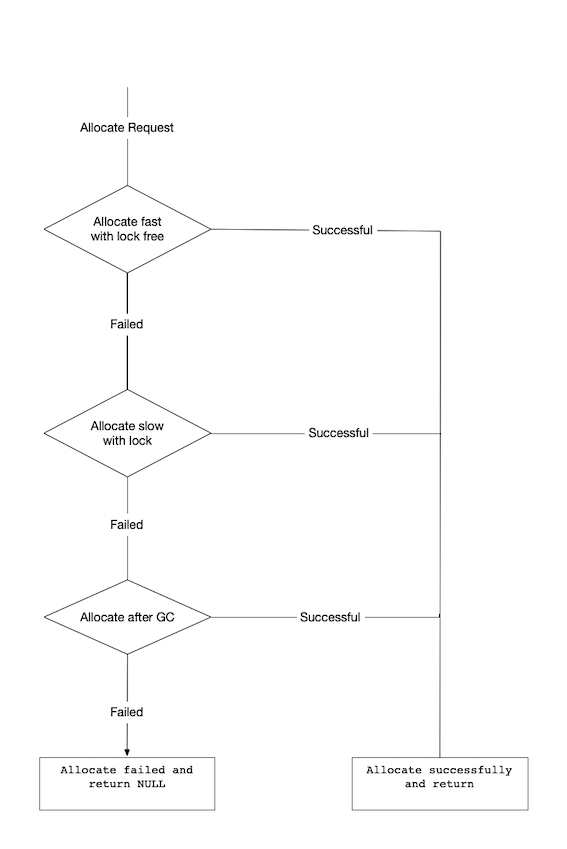

## Introduction

The Runtime Data Area is divided into five major components:

1.  **Method Area** – All the class level data such as the run-time constant pool, field, and method data, and the code for methods and constructors, are stored here. There is only one method area per JVM, and it is a shared resource.
2.  **Heap Area** – All the Objects and their corresponding instance variables and arrays will be stored here. There is also one Heap Area per JVM. Since the Method and Heap areas share memory for multiple threads, the data stored is not thread-safe.
3.  **Stack Area** – For every thread, a separate runtime stack will be created. For every method call, one entry will be made in the stack memory which is called Stack Frame. All local variables will be created in the stack memory. The stack area is thread-safe since it is not a shared resource. The Stack Frame is divided into three subentities:
    1.  **Local Variable Array** – Related to the method how many local variables are involved and the corresponding values will be stored here.
    2.  **Operand stack** – If any intermediate operation is required to perform, operand stack acts as runtime workspace to perform the operation.
    3.  **Frame data** – All symbols corresponding to the method is stored here. In the case of any **exception** , the catch block information will be maintained in the frame data.
4.  **PC Registers** – Each thread will have separate PC Registers, to hold the address of current executing instruction once the instruction is executed the PC register will be updated with the next instruction.
5.  **Native Method stacks** – Native Method Stack holds native method information. For every thread, a separate native method stack will be created.

## Heap

The Java Virtual Machine has a heap that is shared among all Java Virtual Machine threads.
The heap is the run-time data area from which memory for all class instances and arrays is allocated.

The heap is created on virtual machine start-up.
Heap storage for objects is reclaimed by an `automatic storage management system` (known as a garbage collector);
objects are never explicitly deallocated.
The Java Virtual Machine assumes no particular type of automatic storage management system,
and the storage management technique may be chosen according to the implementor’s system requirements.

The heap may be of a fixed size or may be expanded as required by the computation and may be contracted if a larger heap becomes unnecessary.
The memory for the heap does not need to be contiguous.

If a computation requires more heap than can be made available by the automatic storage management system, the Java Virtual Machine throws an `OutOfMemoryError`.


在VM启动时 初始化TLAB前初始化heap
具体实现由不同的collector
```cpp
// universe.cpp
jint universe_init() {
    GCConfig::arguments()->initialize_heap_sizes();

    jint status = Universe::initialize_heap();
    if (status != JNI_OK) {
        return status;
    }
    //  ...
}

jint Universe::initialize_heap() {
  assert(_collectedHeap == nullptr, "Heap already created");
  _collectedHeap = GCConfig::arguments()->create_heap();

  log_info(gc)("Using %s", _collectedHeap->name());
  return _collectedHeap->initialize();
}
```


### new instance

Allocate the instance:

- If TLAB is enabled:
  - Try to allocate in the TLAB.
  - If fails, go to the slow path.
- Else If inline contiguous allocations are enabled:
  - Try to allocate in eden.
  - If fails due to heap end, go to slow path.
- If TLAB is enabled OR inline contiguous is enabled:
  - Initialize the allocation.
  - Exit.
- Go to slow path.

<div style="text-align: center;">



</div>

<p style="text-align: center;">
Fig.1. Allocate Flow.
</p>

Big object

PretenureSizeThreshold for Serial and ParNew

```cpp
// bytecodeInterpreter.cpp
CASE(_new): {
        u2 index = Bytes::get_Java_u2(pc+1);
        ConstantPool* constants = istate->method()->constants();
```

make sure is resolved klass

```cpp
        if (!constants->tag_at(index).is_unresolved_klass()) {
          // Make sure klass is initialized and doesn't have a finalizer
          Klass* entry = constants->resolved_klass_at(index);
          InstanceKlass* ik = InstanceKlass::cast(entry);
          if (ik->is_initialized() && ik->can_be_fastpath_allocated() ) {
            size_t obj_size = ik->size_helper();
            oop result = NULL;
            // If the TLAB isn't pre-zeroed then we'll have to do it
            bool need_zero = !ZeroTLAB;
            if (UseTLAB) {
              result = (oop) THREAD->tlab().allocate(obj_size);
            }
```

Disable non-TLAB-based fast-path, because profiling requires that all allocations go through `InterpreterRuntime::_new()` -> `mem_allocate()` of different collectors

if THREAD->tlab().allocate returns NULL.

```
#ifndef CC_INTERP_PROFILE
            if (result == NULL) {
              need_zero = true;
```

Try allocate in shared eden, use CAS retry

```cpp
            retry:
              HeapWord* compare_to = *Universe::heap()->top_addr();
              HeapWord* new_top = compare_to + obj_size;
              if (new_top <= *Universe::heap()->end_addr()) {
                if (Atomic::cmpxchg(new_top, Universe::heap()->top_addr(), compare_to) != compare_to) {
                  goto retry;
                }
                result = (oop) compare_to;
              }
            }
#endif
            if (result != NULL) {
```

Initialize object (if nonzero size and need) and then the header

```cpp
              if (need_zero ) {
                HeapWord* to_zero = (HeapWord*) result + sizeof(oopDesc) / oopSize;
                obj_size -= sizeof(oopDesc) / oopSize;
                if (obj_size > 0 ) {
                  memset(to_zero, 0, obj_size * HeapWordSize);
                }
              }
```

set markWord

```cpp
              if (UseBiasedLocking) {
                result->set_mark(ik->prototype_header());
              } else {
                result->set_mark(markOopDesc::prototype());
              }
              result->set_klass_gap(0);
              result->set_klass(ik);
              // Must prevent reordering of stores for object initialization
              // with stores that publish the new object.
              OrderAccess::storestore();
              SET_STACK_OBJECT(result, 0);
              UPDATE_PC_AND_TOS_AND_CONTINUE(3, 1);
            }
          }
        }
```

Slow case allocation

```
        CALL_VM(InterpreterRuntime::_new(THREAD, METHOD->constants(), index),
                handle_exception);
        // Must prevent reordering of stores for object initialization
        // with stores that publish the new object.
        OrderAccess::storestore();
```

Set stack object and update pc register and continue

```
        SET_STACK_OBJECT(THREAD->vm_result(), 0);
        THREAD->set_vm_result(NULL);
        UPDATE_PC_AND_TOS_AND_CONTINUE(3, 1);
      }
```

## Method Area

The Java Virtual Machine has a method area that is shared among all Java Virtual Machine threads.
The method area is analogous to the storage area for compiled code of a conventional language or analogous to the “text” segment in an operating system process.
It stores per-class structures such as the run-time constant pool, field and method data, and the code for methods and constructors,
including the special methods used in class and interface initialization and in instance initialization.

If memory in the method area cannot be made available to satisfy an allocation request, the Java Virtual Machine throws an `OutOfMemoryError`.

```java
// -XX:MaxMetaspaceSize=10M
public static void main(String[] args) {
    while (true) {
        Enhancer enhancer = new Enhancer();
        enhancer.setSuperclass(HeapOOM.class);
        enhancer.setUseCache(false); // use cache if true to avoid OOM
        enhancer.setCallback((MethodInterceptor) (o, method, objects, methodProxy) -> methodProxy.invoke(o, objects));
        enhancer.create();

    }
}
```


###  

Hotspot's representation of Java classes (referred to here as class meta-data) is stored in a portion of the Java heap referred to as the permanent generation. In addition, interned Strings and class static variables are stored in the permanent generation. The permanent generation is managed by Hotspot and must have enough room for all the class meta-data, interned Strings and class statics used by the Java application. Class metadata and statics are allocated in the permanent generation when a class is loaded and are garbage collected from the permanent generation when the class is unloaded. Interned Strings are also garbage collected when the permanent generation is GC'ed.


[JEP 122: Remove the Permanent Generation](https://openjdk.java.net/jeps/122)


永久代的**GC**是和老年代(old generation)捆绑在一起的，无论谁满了，都会触发永久代和老年代的垃圾收集

JDK1.7开始了方法区的部分移除：**符号引用(Symbols)**移至**native heap**，**字面量(interned strings)**和**静态变量(class statics)**移至**java heap**

> This is part of the JRockit and Hotspot convergence effort. JRockit customers do not need to configure the permanent generation (since JRockit does not have a permanent generation) and are accustomed to not configuring the permanent generation.


The proposed implementation will allocate class meta-data in native memory and move interned Strings and class statics to the Java heap. Hotspot will explicitly allocate and free the native memory for the class meta-data. Allocation of new class meta-data would be limited by the amount of available native memory rather than fixed by the value of -XX:MaxPermSize, whether the default or specified on the command line.


Allocation of native memory for class meta-data will be done in blocks of a size large enough to fit multiple pieces of class meta-data. Each block will be associated with a class loader and all class meta-data loaded by that class loader will be allocated by Hotspot from the block for that class loader. Additional blocks will be allocated for a class loader as needed. The block sizes will vary depending on the behavior of the application. The sizes will be chosen so as to limit internal and external fragmentation. Freeing the space for the class meta-data would be done when the class loader dies by freeing all the blocks associated with the class loader. Class meta-data will not be moved during the life of the class.


## Program Counter Register

The Java Virtual Machine can support many threads of execution at once.
Each Java Virtual Machine thread has its own pc (program counter) register.
At any point, each Java Virtual Machine thread is executing the code of a single method, namely the current method for that thread.
If that method is not native, the pc register contains the address of the Java Virtual Machine instruction currently being executed.
If the method currently being executed by the thread is native, the value of the Java Virtual Machine’s pc register is `undefined`.
The Java Virtual Machine’s pc register is wide enough to hold a returnAddress or a native pointer on the specific platform.

## Native Method Stacks

An implementation of the Java Virtual Machine may use conventional stacks, colloquially called “C stacks,”
to support native methods (methods written in a language other than the Java programming language).
Native method stacks may also be used by the implementation of an interpreter for the Java Virtual Machine’s instruction set in a language such as C.
Java Virtual Machine implementations that cannot load native methods and that do not themselves rely on conventional stacks need not supply native method stacks.
If supplied, native method stacks are typically allocated per thread when each thread is created.

The following exceptional conditions are associated with native method stacks:

- If the computation in a thread requires a larger native method stack than is permitted, the Java Virtual Machine throws a `StackOverflowError`.
- If native method stacks can be dynamically expanded and native method stack expansion is attempted but insufficient memory can be made available,
  or if insufficient memory can be made available to create the initial native method stack for a new thread, the Java Virtual Machine throws an `OutOfMemoryError`.

**Hotspot JVM中，直接将本地方法栈和虚拟机栈合二为一**

## Java Virtual Machine Stacks

Each Java Virtual Machine thread has a private Java Virtual Machine stack, created at the same time as the thread.
A Java Virtual Machine stack stores frames.
A Java Virtual Machine stack is analogous to the stack of a conventional language such as C:
it holds local variables and partial results, and plays a part in method invocation and return.
Because the Java Virtual Machine stack is never manipulated directly except to push and pop frames, frames may be heap allocated.
The memory for a Java Virtual Machine stack does not need to be contiguous.

The following exceptional conditions are associated with Java Virtual Machine stacks:

- If the computation in a thread requires a larger Java Virtual Machine stack than is permitted, the Java Virtual Machine throws a `StackOverflowError`.
- If Java Virtual Machine stacks can be dynamically expanded, and expansion is attempted but insufficient memory can be made available to effect the expansion,
  or if insufficient memory can be made available to create the initial Java Virtual Machine stack for a new thread, the Java Virtual Machine throws an `OutOfMemoryError`.

Consider using the "-J-Xss<size>" command line option to increase the memory allocated for the Java stack.

### Frames

A frame is used to store data and partial results, as well as to perform dynamic linking, return values for methods, and dispatch exceptions.(See [Frame](/docs/CS/Java/JDK/JVM/frame.md))

A new frame is created each time a method is invoked. A frame is destroyed when its method invocation completes, whether that completion is normal or abrupt (it throws an uncaught exception).
Frames are allocated from the Java Virtual Machine stack of the thread creating the frame.
Each frame has its own array of local variables, its own operand stack, and a reference to the run-time constant pool of the class of the current method.

- Local Variables
- Operand Stacks
- Dynamic Linking

#### Local Variables Table

Each frame contains an array of variables known as its local variables.
The length of the local variable array of a frame is determined at compile-time and supplied in the binary representation of a class or interface along with the code for the method associated with the frame.

A single local variable can hold a value of type `boolean`, `byte`, `char`, `short`, `int`, `float`, `reference`, or `returnAddress`. A pair of local variables can hold a value of type `long` or `double`.

A value of type `long` or type `double` occupies two consecutive local variables. Such a value may only be addressed using the lesser index. 

The Java Virtual Machine does not require *n* to be even. In intuitive terms, values of types `long` and `double` need not be 64-bit aligned in the local variables array. Implementors are free to decide the appropriate way to represent such values using the two local variables reserved for the value.

The Java Virtual Machine uses local variables to pass parameters on method invocation.

- On class method invocation, any parameters are passed in consecutive local variables starting from local variable 0.
- On instance method invocation, local variable 0 is always used to pass a reference to the object on which the instance method is being invoked (`this` in the Java programming language). Any parameters are subsequently passed in consecutive local variables starting from local variable 1.

**Reuse slots**

#### Operand Stack

Each frame contains a last-in-first-out (LIFO) stack known as its operand stack.
The maximum depth of the operand stack of a frame is determined at compile-time and is supplied along with the code for the method associated with the frame.

in runtime
shared memory for optimize return value

#### Dynamic Linking

Each frame contains a reference to the `run-time constant pool` for the type of the current method to support dynamic linking of the method code.
The class file code for a method refers to methods to be invoked and variables to be accessed via symbolic references.
Dynamic linking translates these symbolic method references into concrete method references, loading classes as necessary to resolve as-yet-undefined symbols,
and translates variable accesses into appropriate offsets in storage structures associated with the run-time location of these variables.

This late binding of the methods and variables makes changes in other classes that a method uses less likely to break this code.

## Run-Time Constant Pool

A run-time constant pool is a **per-type** run-time representation of the constant_pool table in a class file.

It contains several kinds of constants, ranging from numeric literals known at compile-time to method and field references that must be resolved at run-time.
The run-time constant pool serves a function similar to that of a symbol table for a conventional programming language,
although it contains a wider range of data than a typical symbol table.

Each run-time constant pool is allocated from the Java Virtual Machine’s method area.
The run-time constant pool for a class or interface is constructed when the class or interface is created by the Java Virtual Machine.

SymbolTable

1.8 20011

15 32768

## Direct Memory

not a part of Run-Time Data Areas

```hpp
// globals.hpp
  product(uint64_t, MaxDirectMemorySize, 0,                                 \
          "Maximum total size of NIO direct-buffer allocations")            \
          range(0, max_jlong)                                               \
```


### Metaspace


Since its inception in [JEP 122: Remove the Permanent Generation](https://openjdk.java.net/jeps/122), [metaspace](/docs/CS/Java/JDK/JVM/Metaspace.md) has been somewhat notorious for high off-heap memory usage.


every Class Loader data has one metaspace

VirtualSpaceList 


[JEP 387: Elastic Metaspace](https://openjdk.org/jeps/387)


## Links

- [JVM](/docs/CS/Java/JDK/JVM/JVM.md)


## References

1. [JVM 内存结构](https://doocs.github.io/jvm/01-jvm-memory-structure.html)
