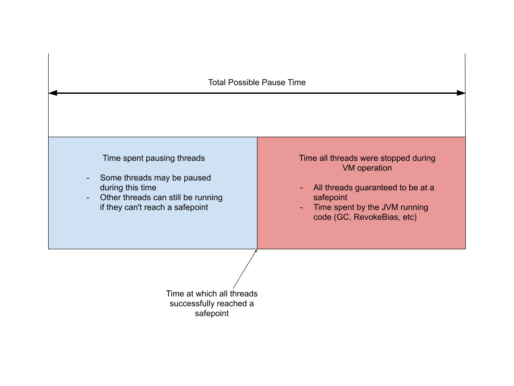

## Introduction
A _safepoint_ is a point in program execution where the state of the program is known and can be examined. Things like registers, memory, etc.
For the JVM to completely pause and run tasks (such as GC), **all threads** must come to a safepoint.

For example, to retrieve a stack trace on a thread we must come to a safepoint. 
This also means tools like `jstack` require that all threads of the program be able to reach a safepoint.

> A point during program execution at which all GC roots are known and all heap object contents are consistent. 
> From a global point of view, all threads must block at a safepoint before the GC can run. 
> (As a special case, threads running JNI code can continue to run, because they use only handles. During a safepoint they must block instead of loading the contents of the handle.) 
> From a local point of view, a safepoint is a distinguished point in a block of code where the executing thread may block for the GC. Most call sites qualify as safepoints. 
> There are strong invariants which hold true at every safepoint, which may be disregarded at non-safepoints.
> Both compiled Java code and C/C++ code be optimized between safepoints, but less so across safepoints. 
> The JIT compiler emits a GC map at each safepoint. C/C++ code in the VM uses stylized macro-based conventions (e.g., TRAPS) to mark potential safepoints.


While GC is one of the most common safepoint operations, there are many VM operations[2](https://blanco.io/blog/jvm-safepoint-pauses/#fn:2) that are run while threads are at safepoints. 
Some may be invoked externally by connecting to the HotSpot JVM (i.e. `jstack`, `jcmd`) while others are internal to the JVM operation (monitor deflation, code deoptimization). 
A list of common operations is below.

-   User Invoked:
    -   Deadlock detection
    -   JVMTI
    -   Thread Dumps
-   Run at regular intervals 可以配置`-XX:GuaranteedSafepointInterval=0`关闭
    -   Monitor Deflation
    -   Inline Cache Cleaning
    -   Invocation Counter Delay
    -   Compiled Code Marking
-   Other:
    -   Revoking [Biased Locks](https://blogs.oracle.com/dave/biased-locking-in-hotspot)
    -   Compiled method Deoptimization
    -   GC

All these operations force the JVM to come to a safepoint in order to run some kind of VM operation.
Now we can decompose a safepoint operation times into two categories


除了执行 JNI 本地代码外，Java 线程还有其他几种状态：解释执行字节码、执行即时编译器生成的机器码和线程阻塞。阻塞的线程由于处于 Java 虚拟机线程调度器的掌控之下，因此属于安全点。
其他几种状态则是运行状态，需要虚拟机保证在可预见的时间内进入安全点。否则，垃圾回收线程可能长期处于等待所有线程进入安全点的状态，从而变相地提高了垃圾回收的暂停时间。
对于解释执行来说，字节码与字节码之间皆可作为安全点。Java 虚拟机采取的做法是，当有安全点请求时，执行一条字节码便进行一次安全点检测。
执行即时编译器生成的机器码则比较复杂。由于这些代码直接运行在底层硬件之上，不受Java 虚拟机掌控，因此在生成机器码时，即时编译器需要插入安全点检测，以避免机器码长时间没有安全点检测的情况。
HotSpot 虚拟机的做法便是在生成代码的方法出口以及非计数循环的循环回边（back-edge）处插入安全点检测

那么为什么不在每一条机器码或者每一个机器码基本块处插入安全点检测呢？原因主要有两
个。
1. 安全点检测本身也有一定的开销。不过 HotSpot 虚拟机已经将机器码中安全点检测简化为一个内存访问操作。
   在有安全点请求的情况下，Java 虚拟机会将安全点检测访问的内存所在的页设置为不可读，并且定义一个 segfault 处理器，来截获因访问该不可读内存而触发 segfault 的线程，并将它们挂起
2. 即时编译器生成的机器码打乱了原本栈桢上的对象分布状况。在进入安全点时，机器
码还需提供一些额外的信息，来表明哪些寄存器，或者当前栈帧上的哪些内存空间存放着指向对象的引用，以便垃圾回收器能够枚举 GC Roots

由于这些信息需要不少空间来存储，因此即时编译器会尽量避免过多的安全点检测。
不过，不同的即时编译器插入安全点检测的位置也可能不同。以 Graal 为例，除了上述位置外，它还会在计数循环的循环回边处插入安全点检测。
其他的虚拟机也可能选取方法入口而非方法出口来插入安全点检测。

**Only VM thread may execute a safepoint.**

**Safepoint is actually a page of memory.**


-   Time taken from initiating the safepoint request until all threads reach a safepoint
-   Time taken to perform safepoint operation.


So, if applications are not responding, it may be because

1.  The JVM is trying to reach a safepoint and most threads have already stopped except maybe one or two, or
2.  The JVM has reached a safepoint and is running some internal operations. May it be GC, lock bias revocation, cache line invalidation, etc.

The issue is that we need to figure out exactly what is triggering the pause in the first place if anything, and then investigate which part of the pause is taking a long time; the time to get to the safepoint (TTSP), or the time spent performing the VM operation.

To do that more logging is required. The flags that need to be added to the JVM are `-XX:+PrintSafepointStatistics -XX:PrintSafepointStatisticsCount=1`. Adding these two arguments will print to stdout or the configured log file every time a safepoint operation occurs.


It’s important to reiterate that the spin, block, and sync times represent portions of the TTSP. So, if TTSP is large it can mean that one thread might be attempting to finish its work, while the rest of the JVM threads are paused waiting for it to reach a safepoint. This is why the total pause time of a JVM must be considered TTSP + cleanup + vmop.

With this information we can handily take any JVM logs and figure out which operations were running. It’s critical to consider both the safepoint logs and GC logs. Otherwise it’s possible to miss information about TTSP mentioned above.

## Example
### Preemptive Suspension

### Voluntary Suspension
Main thread will print the num util sub thread ends, not after 1000ms we expected.

```java
public static AtomicInteger num = new AtomicInteger(0);

public static void main(String[] args) throws Throwable {
    Runnable runnable = () -> {
        for (int i = 0; i < 1000000000; i++) {
            num.getAndAdd(1);
        }
    };

    Thread t1 = new Thread(runnable);
    Thread t2 = new Thread(runnable);
    t1.start();
    t2.start();

    System.out.println("before sleep");
    Thread.sleep(1000);
    System.out.println("after sleep");

    System.out.println(num);
}
```


### PrintStatistics

```shell
-XX:+PrintSafepointStatistics  -XX:PrintSafepointStatisticsCount = 1
logsafepoint=debug # JDK11
```

> Task :MainTest.main()
>     vmop                    [threads: total initially_running wait_to_block]    [time: spin block sync cleanup vmop] page_trap_count
> 1.016: no vm operation                  [      11          2              2    ]      [ 29399     0 29399     0     0    ]  0   
>     vmop                    [threads: total initially_running wait_to_block]    [time: spin block sync cleanup vmop] page_trap_count
> 30.416: EnableBiasedLocking              [      11          0              0    ]      [     0     0     0     0     0    ]  0   
> num = 2000000000
>     vmop                    [threads: total initially_running wait_to_block]    [time: spin block sync cleanup vmop] page_trap_count
> 30.416: no vm operation                  [       8          1              1    ]      [     0     0     0     0     0    ]  0 >  
> Polling page always armed
> EnableBiasedLocking                1
>     0 VM operations coalesced during safepoint
> Maximum sync time  29399 ms
> Maximum vm operation time (except for Exit VM operation)      0 ms


-XX:+SafePointTimeout -XX:SafepointTimeoutDelay=2000


### Fix


```
 -XX:+UnlockDiagnosticVMOptions  -XX:GuaranteedSafepointInterval=2000 
```
 *-XX:GuaranteedSafepointInterval=2000* option set safepoint after thread sleep ends.

```
-XX:+UseCountedLoopSafepoints
```

`-XX:+UseCountedLoopSafepoints` option turns off the optimization that eliminates safepoint polling.

Other methods

- Use JDK10 and later
  Java 10中引入了一项新技术——Loop Strip Mining，这本质上一个循环分区技术，通过profiling统计出别的线程大概运行多久能抵达下一个安全点，同时找出在当前线程的长循环中，循环多少次能匹配这个平均抵达安全点的时间，然后在循环这些次数之后，安插安全点，以尽可能地避免单线程中长循环不经过安全点拖累所有人的问题
- Use long to limit a countedLoop


对于安全点检查的优化，只针对于计数循环（counted loop），对于非计数循环，每次循环完成后，都会安插安全点。
此外，如果你的JVM运行在debug模式，是不会消除安全点检查的，也就是说即便你线上程序有如此bug，你在debug模式下也复现不出来


## Safepoint

### state
```cpp
class SafepointSynchronize : AllStatic {
public:
enum SynchronizeState {
_not_synchronized = 0,                   // Threads not synchronized at a safepoint. Keep this value 0.
_synchronizing    = 1,                   // Synchronizing in progress
_synchronized     = 2                    // All Java threads are running in native, blocked in OS or stopped at safepoint.
// VM thread and any NonJavaThread may be running.
};
```

### default_initialize

```cpp

void SafepointMechanism::default_initialize() {
  // Poll bit values
  _poll_word_armed_value    = poll_bit();
  _poll_word_disarmed_value = ~_poll_word_armed_value;

  bool poll_bit_only = false;

  #ifdef USE_POLL_BIT_ONLY
  poll_bit_only = USE_POLL_BIT_ONLY;
  #endif

  if (poll_bit_only) {
    _poll_page_armed_value    = poll_bit();
    _poll_page_disarmed_value = 0;
  } else {
    // Polling page
    const size_t page_size = os::vm_page_size();
    const size_t allocation_size = 2 * page_size;
    char* polling_page = os::reserve_memory(allocation_size);
    os::commit_memory_or_exit(polling_page, allocation_size, false, "Unable to commit Safepoint polling page");
    MemTracker::record_virtual_memory_type((address)polling_page, mtSafepoint);
```
- bad page: MEM_PROT_NONE
- good page: MEM_PROT_READ
```
    char* bad_page  = polling_page;
    char* good_page = polling_page + page_size;

    os::protect_memory(bad_page,  page_size, os::MEM_PROT_NONE);
    os::protect_memory(good_page, page_size, os::MEM_PROT_READ);

    log_info(os)("SafePoint Polling address, bad (protected) page:" INTPTR_FORMAT ", good (unprotected) page:" INTPTR_FORMAT, p2i(bad_page), p2i(good_page));

    // Poll address values
    _poll_page_armed_value    = reinterpret_cast<uintptr_t>(bad_page);
    _poll_page_disarmed_value = reinterpret_cast<uintptr_t>(good_page);
    _polling_page = (address)bad_page;
  }
}
```

### Run

#### VMThread::loop

vm operation see `vmOperations.hpp`

```cpp
void VMThread::loop() {
  assert(_cur_vm_operation == NULL, "no current one should be executing");

  while(true) {
    VM_Operation* safepoint_ops = NULL;
    //
    // Wait for VM operation
    //
    // use no_safepoint_check to get lock without attempting to "sneak"
    { MutexLockerEx mu_queue(VMOperationQueue_lock,
                             Mutex::_no_safepoint_check_flag);

      // Look for new operation
      assert(_cur_vm_operation == NULL, "no current one should be executing");
      _cur_vm_operation = _vm_queue->remove_next();

      // Stall time tracking code
      if (PrintVMQWaitTime && _cur_vm_operation != NULL &&
          !_cur_vm_operation->evaluate_concurrently()) {
        long stall = os::javaTimeMillis() - _cur_vm_operation->timestamp();
        if (stall > 0)
          tty->print_cr("%s stall: %ld",  _cur_vm_operation->name(), stall);
      }

      while (!should_terminate() && _cur_vm_operation == NULL) {
        // wait with a timeout to guarantee safepoints at regular intervals
        bool timedout =
          VMOperationQueue_lock->wait(Mutex::_no_safepoint_check_flag,
                                      GuaranteedSafepointInterval);

        // Support for self destruction
        if ((SelfDestructTimer != 0) && !VMError::is_error_reported() &&
            (os::elapsedTime() > (double)SelfDestructTimer * 60.0)) {
          tty->print_cr("VM self-destructed");
          exit(-1);
        }

        if (timedout && VMThread::no_op_safepoint_needed(false)) { 
          MutexUnlockerEx mul(VMOperationQueue_lock,
                              Mutex::_no_safepoint_check_flag);
          // Force a safepoint since we have not had one for at least
          // 'GuaranteedSafepointInterval' milliseconds.  This will run all
          // the clean-up processing that needs to be done regularly at a
          // safepoint
          SafepointSynchronize::begin();
          #ifdef ASSERT
            if (GCALotAtAllSafepoints) InterfaceSupport::check_gc_alot();
          #endif
          SafepointSynchronize::end();
        }
        _cur_vm_operation = _vm_queue->remove_next();

        // If we are at a safepoint we will evaluate all the operations that
        // follow that also require a safepoint
        if (_cur_vm_operation != NULL &&
            _cur_vm_operation->evaluate_at_safepoint()) {
          safepoint_ops = _vm_queue->drain_at_safepoint_priority();
        }
      }

      if (should_terminate()) break;
    } // Release mu_queue_lock

    //
    // Execute VM operation
    //
    { HandleMark hm(VMThread::vm_thread());

      EventMark em("Executing VM operation: %s", vm_operation()->name());
      assert(_cur_vm_operation != NULL, "we should have found an operation to execute");

      // If we are at a safepoint we will evaluate all the operations that
      // follow that also require a safepoint
      if (_cur_vm_operation->evaluate_at_safepoint()) {
        log_debug(vmthread)("Evaluating safepoint VM operation: %s", _cur_vm_operation->name());

        _vm_queue->set_drain_list(safepoint_ops); // ensure ops can be scanned

        SafepointSynchronize::begin();

        if (_timeout_task != NULL) {
          _timeout_task->arm();
        }

        evaluate_operation(_cur_vm_operation);
        // now process all queued safepoint ops, iteratively draining
        // the queue until there are none left
        do {
          _cur_vm_operation = safepoint_ops;
          if (_cur_vm_operation != NULL) {
            do {
              log_debug(vmthread)("Evaluating coalesced safepoint VM operation: %s", _cur_vm_operation->name());
              // evaluate_operation deletes the op object so we have
              // to grab the next op now
              VM_Operation* next = _cur_vm_operation->next();
              _vm_queue->set_drain_list(next);
              evaluate_operation(_cur_vm_operation);
              _cur_vm_operation = next;
              if (log_is_enabled(Debug, safepoint, stats)) {
                SafepointSynchronize::inc_vmop_coalesced_count();
              }
            } while (_cur_vm_operation != NULL);
          }
          // There is a chance that a thread enqueued a safepoint op
          // since we released the op-queue lock and initiated the safepoint.
          // So we drain the queue again if there is anything there, as an
          // optimization to try and reduce the number of safepoints.
          // As the safepoint synchronizes us with JavaThreads we will see
          // any enqueue made by a JavaThread, but the peek will not
          // necessarily detect a concurrent enqueue by a GC thread, but
          // that simply means the op will wait for the next major cycle of the
          // VMThread - just as it would if the GC thread lost the race for
          // the lock.
          if (_vm_queue->peek_at_safepoint_priority()) {
            // must hold lock while draining queue
            MutexLockerEx mu_queue(VMOperationQueue_lock,
                                     Mutex::_no_safepoint_check_flag);
            safepoint_ops = _vm_queue->drain_at_safepoint_priority();
          } else {
            safepoint_ops = NULL;
          }
        } while(safepoint_ops != NULL);

        _vm_queue->set_drain_list(NULL);

        if (_timeout_task != NULL) {
          _timeout_task->disarm();
        }

        // Complete safepoint synchronization
        SafepointSynchronize::end();

      } else {  // not a safepoint operation
        log_debug(vmthread)("Evaluating non-safepoint VM operation: %s", _cur_vm_operation->name());
        if (TraceLongCompiles) {
          elapsedTimer t;
          t.start();
          evaluate_operation(_cur_vm_operation);
          t.stop();
          double secs = t.seconds();
          if (secs * 1e3 > LongCompileThreshold) {
            // XXX - _cur_vm_operation should not be accessed after
            // the completed count has been incremented; the waiting
            // thread may have already freed this memory.
            tty->print_cr("vm %s: %3.7f secs]", _cur_vm_operation->name(), secs);
          }
        } else {
          evaluate_operation(_cur_vm_operation);
        }

        _cur_vm_operation = NULL;
      }
    }

    //
    //  Notify (potential) waiting Java thread(s) - lock without safepoint
    //  check so that sneaking is not possible
    { MutexLockerEx mu(VMOperationRequest_lock,
                       Mutex::_no_safepoint_check_flag);
      VMOperationRequest_lock->notify_all();
    }

    //
    // We want to make sure that we get to a safepoint regularly.
    //
    if (VMThread::no_op_safepoint_needed(true)) {
      HandleMark hm(VMThread::vm_thread());
      SafepointSynchronize::begin();
      SafepointSynchronize::end();
    }
  }
}

bool VMThread::no_op_safepoint_needed(bool check_time) {
  if (SafepointALot) {
    _no_op_reason = "SafepointALot";
    return true;
  }
  if (!SafepointSynchronize::is_cleanup_needed()) {
    return false;
  }
  if (check_time) {
    long interval = SafepointSynchronize::last_non_safepoint_interval();
    bool max_time_exceeded = GuaranteedSafepointInterval != 0 &&
                             (interval > GuaranteedSafepointInterval);
    if (!max_time_exceeded) {
      return false;
    }
  }
  _no_op_reason = "Cleanup";
  return true;
}
```


#### Need a safepoint

```cpp
// safepoint.cpp
bool SafepointSynchronize::is_cleanup_needed() {
  // Need a safepoint if there are many monitors to deflate.
  if (ObjectSynchronizer::is_cleanup_needed()) return true;
```  
Need a safepoint if some inline cache buffers is non-empty
```  
  if (!InlineCacheBuffer::is_empty()) return true;
  return false;
}
```
##### many monitors to deflate
```cpp
// synchronizer.cpp
static bool monitors_used_above_threshold() {
  if (gMonitorPopulation == 0) {
    return false;
  }
  int monitors_used = gMonitorPopulation - gMonitorFreeCount;
  int monitor_usage = (monitors_used * 100LL) / gMonitorPopulation;
  return monitor_usage > MonitorUsedDeflationThreshold;
}

bool ObjectSynchronizer::is_cleanup_needed() {
  if (MonitorUsedDeflationThreshold > 0) {
    return monitors_used_above_threshold();
  }
  return false;
}
```

##### some inline cache buffers is non-empty

check if [StubQueue](/docs/CS/Java/JDK/JVM/interpreter.md?id=StubQueue) is non-empty
```cpp
// icBuffer.cpp
lass InlineCacheBuffer: public AllStatic {
 private:
  // friends
  friend class ICStub;

  static int ic_stub_code_size();

  static StubQueue* _buffer;

  static CompiledICHolder* _pending_released;
  static int _pending_count;

  static StubQueue* buffer()                         { return _buffer;         }

  static ICStub* new_ic_stub();

  // Machine-dependent implementation of ICBuffer
  static void    assemble_ic_buffer_code(address code_begin, void* cached_value, address entry_point);
  static address ic_buffer_entry_point  (address code_begin);
  static void*   ic_buffer_cached_value (address code_begin);
}

bool InlineCacheBuffer::is_empty() {
  return buffer()->number_of_stubs() == 0;
}
```

##### string/symbol table rehash


### begin

Roll all threads forward to a safepoint and suspend them all.

```cpp
// 
void SafepointSynchronize::begin() {
  EventSafepointBegin begin_event;
  SafepointTracing::begin(VMThread::vm_op_type());

  Universe::heap()->safepoint_synchronize_begin();

  // By getting the Threads_lock, we assure that no threads are about to start or
  // exit. It is released again in SafepointSynchronize::end().
  Threads_lock->lock();

  assert( _state == _not_synchronized, "trying to safepoint synchronize with wrong state");

  int nof_threads = Threads::number_of_threads();

  _nof_threads_hit_polling_page = 0;

  log_debug(safepoint)("Safepoint synchronization initiated using %s wait barrier. (%d threads)", _wait_barrier->description(), nof_threads);

  // Reset the count of active JNI critical threads
  _current_jni_active_count = 0;

  // Set number of threads to wait for
  _waiting_to_block = nof_threads;

  jlong safepoint_limit_time = 0;
  if (SafepointTimeout) {
    // Set the limit time, so that it can be compared to see if this has taken
    // too long to complete.
    safepoint_limit_time = SafepointTracing::start_of_safepoint() + (jlong)SafepointTimeoutDelay * (NANOUNITS / MILLIUNITS);
    timeout_error_printed = false;
  }

  EventSafepointStateSynchronization sync_event;
  int initial_running = 0;

  // Arms the safepoint, _current_jni_active_count and _waiting_to_block must be set before.
  arm_safepoint();
```
Will spin until all threads are safe.(See [synchronize_threads](/docs/CS/Java/JDK/JVM/Safepoint.md?id=synchronize_threads))
```cpp
  int iterations = synchronize_threads(safepoint_limit_time, nof_threads, &initial_running);
  assert(_waiting_to_block == 0, "No thread should be running");

  #ifndef PRODUCT
  // Mark all threads
  if (VerifyCrossModifyFence) {
    JavaThreadIteratorWithHandle jtiwh;
    for (; JavaThread *cur = jtiwh.next(); ) {
      cur->set_requires_cross_modify_fence(true);
    }
  }

  if (safepoint_limit_time != 0) {
    jlong current_time = os::javaTimeNanos();
    if (safepoint_limit_time < current_time) {
      log_warning(safepoint)("# SafepointSynchronize: Finished after "
                    INT64_FORMAT_W(6) " ms",
                    (int64_t)(current_time - SafepointTracing::start_of_safepoint()) / (NANOUNITS / MILLIUNITS));
    }
  }
  #endif

  assert(Threads_lock->owned_by_self(), "must hold Threads_lock");

  // Record state
  _state = _synchronized;

  OrderAccess::fence();

  // Set the new id
  ++_safepoint_id;

  // Make sure all the threads were visited.
  for (JavaThreadIteratorWithHandle jtiwh; JavaThread *cur = jtiwh.next(); ) {
    assert(cur->was_visited_for_critical_count(_safepoint_counter), "missed a thread");
  }

  // Update the count of active JNI critical regions
  GCLocker::set_jni_lock_count(_current_jni_active_count);

  post_safepoint_synchronize_event(sync_event,
                                   _safepoint_id,
                                   initial_running,
                                   _waiting_to_block, iterations);

  SafepointTracing::synchronized(nof_threads, initial_running, _nof_threads_hit_polling_page);

  // We do the safepoint cleanup first since a GC related safepoint
  // needs cleanup to be completed before running the GC op.
  EventSafepointCleanup cleanup_event;
  do_cleanup_tasks();
  post_safepoint_cleanup_event(cleanup_event, _safepoint_id);

  post_safepoint_begin_event(begin_event, _safepoint_id, nof_threads, _current_jni_active_count);
  SafepointTracing::cleanup();
}
```


#### synchronize_threads
```cpp

int SafepointSynchronize::synchronize_threads(jlong safepoint_limit_time, int nof_threads, int* initial_running)
{
  JavaThreadIteratorWithHandle jtiwh;

  // Iterate through all threads until it has been determined how to stop them all at a safepoint.
  int still_running = nof_threads;
  ThreadSafepointState *tss_head = NULL;
  ThreadSafepointState **p_prev = &tss_head;
  for (; JavaThread *cur = jtiwh.next(); ) {
    ThreadSafepointState *cur_tss = cur->safepoint_state();
    assert(cur_tss->get_next() == NULL, "Must be NULL");
    if (thread_not_running(cur_tss)) {
      --still_running;
    } else {
      *p_prev = cur_tss;
      p_prev = cur_tss->next_ptr();
    }
  }
  *p_prev = NULL;

  DEBUG_ONLY(assert_list_is_valid(tss_head, still_running);)

  *initial_running = still_running;

  // If there is no thread still running, we are already done.
  if (still_running <= 0) {
    assert(tss_head == NULL, "Must be empty");
    return 1;
  }

  int iterations = 1; // The first iteration is above.
  int64_t start_time = os::javaTimeNanos();

  do {
    // Check if this has taken too long:
    if (SafepointTimeout && safepoint_limit_time < os::javaTimeNanos()) {
      print_safepoint_timeout();
    }

    p_prev = &tss_head;
    ThreadSafepointState *cur_tss = tss_head;
    while (cur_tss != NULL) {
      assert(cur_tss->is_running(), "Illegal initial state");
      if (thread_not_running(cur_tss)) {
        --still_running;
        *p_prev = NULL;
        ThreadSafepointState *tmp = cur_tss;
        cur_tss = cur_tss->get_next();
        tmp->set_next(NULL);
      } else {
        *p_prev = cur_tss;
        p_prev = cur_tss->next_ptr();
        cur_tss = cur_tss->get_next();
      }
    }

    DEBUG_ONLY(assert_list_is_valid(tss_head, still_running);)

    if (still_running > 0) {
      back_off(start_time);
    }

    iterations++;
  } while (still_running > 0);

  return iterations;
}
```


### end

Wake up all threads, so they are ready to resume execution after the safepoint operation has been carried out

```cpp

void SafepointSynchronize::end() {
  assert(Threads_lock->owned_by_self(), "must hold Threads_lock");
  EventSafepointEnd event;

  disarm_safepoint();

  Universe::heap()->safepoint_synchronize_end();

  SafepointTracing::end();

  post_safepoint_end_event(event, safepoint_id());
}
```


### Region

#### in vm

operation must be done than goto safepoint

#### native

check if Synchronizing in progress when jump into Java Code(Don't stop Non-JavaThread)

#### interpreter

Dispatch regular table or Safepoint table

#### compile
test 


Polling page

## Thread-Local Handshakes

[JEP 312: Thread-Local Handshakes](https://openjdk.java.net/jeps/312)

Thread local handkerchief 


## Suspend

```cpp
SuspendibleThreadSetJoiner(bool active = true) : _active(active) {
    if (_active) {
      SuspendibleThreadSet::join();
    }
  }

  ~SuspendibleThreadSetJoiner() {
    if (_active) {
      SuspendibleThreadSet::leave();
    }
  }


SuspendibleThreadSetLeaver(bool active = true) : _active(active) {
    if (_active) {
      SuspendibleThreadSet::leave();
    }
  }

  ~SuspendibleThreadSetLeaver() {
    if (_active) {
      SuspendibleThreadSet::join();
    }
  }
  
  
```


```cpp

void SuspendibleThreadSet::join() {
  assert(!Thread::current()->is_suspendible_thread(), "Thread already joined");
  MonitorLocker ml(STS_lock, Mutex::_no_safepoint_check_flag);
  while (suspend_all()) {
    ml.wait();
  }
  _nthreads++;
  DEBUG_ONLY(Thread::current()->set_suspendible_thread();)
}

void SuspendibleThreadSet::leave() {
  assert(Thread::current()->is_suspendible_thread(), "Thread not joined");
  MonitorLocker ml(STS_lock, Mutex::_no_safepoint_check_flag);
  assert(_nthreads > 0, "Invalid");
  DEBUG_ONLY(Thread::current()->clear_suspendible_thread();)
  _nthreads--;
  if (suspend_all() && is_synchronized()) {
    // This leave completes a request, so inform the requestor.
    _synchronize_wakeup->signal();
  }
}
```

### at_safepoint


```cpp

JRT_ENTRY(void, InterpreterRuntime::at_safepoint(JavaThread* current))
  // We used to need an explict preserve_arguments here for invoke bytecodes. However,
  // stack traversal automatically takes care of preserving arguments for invoke, so
  // this is no longer needed.

  // JRT_END does an implicit safepoint check, hence we are guaranteed to block
  // if this is called during a safepoint

  if (JvmtiExport::should_post_single_step()) {
    // This function is called by the interpreter when single stepping. Such single
    // stepping could unwind a frame. Then, it is important that we process any frames
    // that we might return into.
    StackWatermarkSet::before_unwind(current);

    // We are called during regular safepoints and when the VM is
    // single stepping. If any thread is marked for single stepping,
    // then we may have JVMTI work to do.
    LastFrameAccessor last_frame(current);
    JvmtiExport::at_single_stepping_point(current, last_frame.method(), last_frame.bcp());
  }
JRT_END
```

## Analyzing Safepoint Pauses
Now that we know all about safepoints and how to get their statistics, we need to know what can prevent Java threads from coming to a safepoint. Some of those causes are:

-   Large object initialization
    -   i.e. initializing a 10GB array. (Single threaded, zeroing the array)
-   Array copying
-   JNI Handle Allocation
-   JNI Critical Regions
-   [Counted Loops](https://psy-lob-saw.blogspot.com/2015/12/safepoints.html)
-   NIO Mapped Byte Buffers
    -   Memory mapped portion of a file


Usually, if a program is taking a long time to reach a safepoint there is a systemic issue in the code where it performs one or more of the operations above for extended periods of time without allowing the JVM to come to a safepoint.

Fortunately, there are even more options that can be added to the JVM in order to enable logging when it takes a longer than expected time to reach a safepoint.

```
-XX:+SafepointTimeout -XX:SafepointTimeoutDelay=<timeout in ms>
```
These two options print to the VM log / stdout all threads which have failed to reach a safepoint after the specified time period. This can help developers troubleshoot which threads might be causing extended pauses of the JVM and whether the root cause is the VM operation or the TTSP.

```
Xlog:safepoint
```


## Links

- [JVM](/docs/CS/Java/JDK/JVM/JVM.md)
- [VMThread](/docs/CS/Java/JDK/JVM/Thread.md?id=VMThread)


## References

1. [真是绝了！这段被JVM动了手脚的代码！](https://mp.weixin.qq.com/s/KDUccdLALWdjNBrFjVR74Q)
2. [The main thread exceeds the set sleep time](https://stackoverflow.com/questions/67068057/the-main-thread-exceeds-the-set-sleep-time)
3. [JVM internals basics - Stop-the-world phase (safepoints) - how it works?](https://krzysztofslusarski.github.io/2020/11/13/stw.html)
4. [JDK-8223051 support loops with long (64b) trip counts](https://bugs.openjdk.org/browse/JDK-8223051)
5. [Analyzing gc logs](https://stackoverflow.com/questions/29666057/analyzing-gc-logs)

