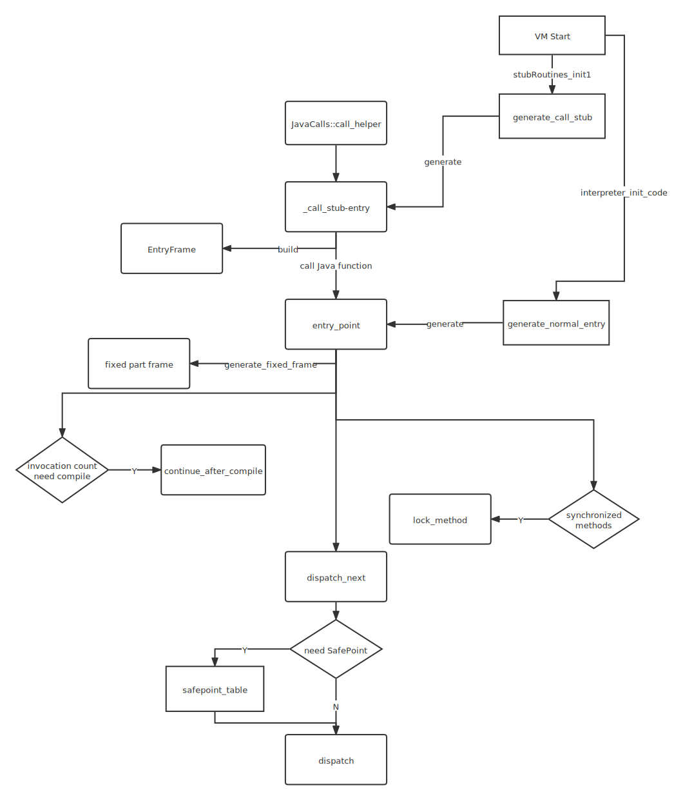

## Introduction

## call_stub

a function pointer

```cpp
class StubRoutines: AllStatic {

static CallStub call_stub()                              { return CAST_TO_FN_PTR(CallStub, _call_stub_entry); }


  // Calls to Java
  typedef void (*CallStub)(
    address   link,
    intptr_t* result,
    BasicType result_type,
    Method* method,
    address   entry_point,
    intptr_t* parameters,
    int       size_of_parameters,
    TRAPS
  );
}
```

lets thought call_stub in stubGenerator_zero.cpp

```cpp
static void call_stub(
  JavaCallWrapper *call_wrapper,
  intptr_t*        result,
  BasicType        result_type,
  Method*          method,
  address          entry_point,
  intptr_t*        parameters,
  int              parameter_words,
  TRAPS) {
  JavaThread *thread = THREAD;
  ZeroStack *stack = thread->zero_stack();

  // Make sure we have no pending exceptions
  assert(!HAS_PENDING_EXCEPTION, "call_stub called with pending exception");
```

### JavaCallWrapper

A JavaCallWrapper is constructed before each JavaCall and destructed after the call.
Its purpose is to allocate/deallocate a new handle block and to save/restore the last Java fp/sp.
A pointer to the JavaCallWrapper is stored on the stack.

```c
class JavaCallWrapper: StackObj {
  friend class VMStructs;
 private:
  JavaThread*      _thread;                 // the thread to which this call belongs
  JNIHandleBlock*  _handles;                // the saved handle block
  Method*          _callee_method;          // to be able to collect arguments if entry frame is top frame
  oop              _receiver;               // the receiver of the call (if a non-static call)

  JavaFrameAnchor  _anchor;                 // last thread anchor state that we must restore

  JavaValue*       _result;                 // result value
}
```

Set up the stack if necessary

```cpp
  bool stack_needs_teardown = false;
  if (stack->needs_setup()) {
    size_t zero_stack_size = stack->suggest_size(thread);
    stack->setup(alloca(zero_stack_size), zero_stack_size);
    stack_needs_teardown = true;
  }
```

Allocate and initialize our frame

```cpp
  EntryFrame *frame =
    EntryFrame::build(parameters, parameter_words, call_wrapper, THREAD);

  if (!HAS_PENDING_EXCEPTION) {
    // Push the frame
    thread->push_zero_frame(frame);

```

Make the call

```cpp
    Interpreter::invoke_method(method, entry_point, THREAD);

    // Store the result
    if (!HAS_PENDING_EXCEPTION) {
      switch (result_type) {
      case T_INT:
        *(jint *) result = *(jint *) stack->sp();
        break;
      case T_LONG:
        *(jlong *) result = *(jlong *) stack->sp();
        break;
      case T_FLOAT:
        *(jfloat *) result = *(jfloat *) stack->sp();
        break;
      case T_DOUBLE:
        *(jdouble *) result = *(jdouble *) stack->sp();
        break;
      case T_OBJECT:
        *(oop *) result = *(oop *) stack->sp();
        break;
      default:
        ShouldNotReachHere();
      }
    }

    // Unwind the frame
    thread->pop_zero_frame();
  }

  // Tear down the stack if necessary
  if (stack_needs_teardown)
    stack->teardown();
}
```

## init

init when [start vm](/docs/CS/Java/JDK/JVM/start.md?id=init_globals)

```cpp

void StubRoutines::initialize1() {
  if (_code1 == NULL) {
    ResourceMark rm;
    TraceTime timer("StubRoutines generation 1", TRACETIME_LOG(Info, startuptime));
    _code1 = BufferBlob::create("StubRoutines (1)", code_size1);
    if (_code1 == NULL) {
      vm_exit_out_of_memory(code_size1, OOM_MALLOC_ERROR, "CodeCache: no room for StubRoutines (1)");
    }
    CodeBuffer buffer(_code1);
    StubGenerator_generate(&buffer, false);
    // When new stubs added we need to make sure there is some space left
    // to catch situation when we should increase size again.
    assert(code_size1 == 0 || buffer.insts_remaining() > 200, "increase code_size1");
  }
}
```

```cpp
#define UCM_TABLE_MAX_ENTRIES 16
void StubGenerator_generate(CodeBuffer* code, bool all) {
  if (UnsafeCopyMemory::_table == NULL) {
    UnsafeCopyMemory::create_table(UCM_TABLE_MAX_ENTRIES);
  }
  StubGenerator g(code, all);
}

```

call generate_initial

```cpp
StubGenerator(CodeBuffer* code, bool all) : StubCodeGenerator(code) {
    if (all) {
      generate_all();
    } else {
      generate_initial();
    }
}
```

Generates all stubs and initializes the entry points

entry points that exist in all platforms Note:
This is code that could be shared among different platforms - however the
benefit seems to be smaller than the disadvantage of having a much more complicated generator structure.

See also comment in stubRoutines.hpp.

```cpp
// cpu/zero/stubGenerator_zero.cpp
void generate_initial() {
  StubRoutines::_forward_exception_entry   = ShouldNotCallThisStub();
  StubRoutines::_call_stub_entry           = (address) call_stub;
  ...
}
```

And generate_initial -> [generate_call_stub](/docs/CS/Java/JDK/JVM/Stub.md?id=generate_call_stub)

### generate_call_stub

```cpp
// cpu/x86/stubGenerator_x86_64.cpp
  address generate_call_stub(address& return_address) {
    assert((int)frame::entry_frame_after_call_words == -(int)rsp_after_call_off + 1 &&
           (int)frame::entry_frame_call_wrapper_offset == (int)call_wrapper_off,
           "adjust this code");
    StubCodeMark mark(this, "StubRoutines", "call_stub");
    address start = __ pc();

    // same as in generate_catch_exception()!
    const Address rsp_after_call(rbp, rsp_after_call_off * wordSize);

    const Address call_wrapper  (rbp, call_wrapper_off   * wordSize);
    const Address result        (rbp, result_off         * wordSize);
    const Address result_type   (rbp, result_type_off    * wordSize);
    const Address method        (rbp, method_off         * wordSize);
    const Address entry_point   (rbp, entry_point_off    * wordSize);
    const Address parameters    (rbp, parameters_off     * wordSize);
    const Address parameter_size(rbp, parameter_size_off * wordSize);

    // same as in generate_catch_exception()!
    const Address thread        (rbp, thread_off         * wordSize);

    const Address r15_save(rbp, r15_off * wordSize);
    const Address r14_save(rbp, r14_off * wordSize);
    const Address r13_save(rbp, r13_off * wordSize);
    const Address r12_save(rbp, r12_off * wordSize);
    const Address rbx_save(rbp, rbx_off * wordSize);

    // stub code
    __ enter();
    __ subptr(rsp, -rsp_after_call_off * wordSize);

    // save register parameters


    __ movptr(method,       c_rarg3); // method
    __ movl(result_type,  c_rarg2);   // result type
    __ movptr(result,       c_rarg1); // result
    __ movptr(call_wrapper, c_rarg0); // call wrapper

    // save regs belonging to calling function
    __ movptr(rbx_save, rbx);
    __ movptr(r12_save, r12);
    __ movptr(r13_save, r13);
    __ movptr(r14_save, r14);
    __ movptr(r15_save, r15);


    const Address mxcsr_save(rbp, mxcsr_off * wordSize);
    {
      Label skip_ldmx;
      __ stmxcsr(mxcsr_save);
      __ movl(rax, mxcsr_save);
      __ andl(rax, MXCSR_MASK);    // Only check control and mask bits
      ExternalAddress mxcsr_std(StubRoutines::x86::addr_mxcsr_std());
      __ cmp32(rax, mxcsr_std);
      __ jcc(Assembler::equal, skip_ldmx);
      __ ldmxcsr(mxcsr_std);
      __ bind(skip_ldmx);
    }


    // Load up thread register
    __ movptr(r15_thread, thread);
    __ reinit_heapbase();


    // pass parameters if any
    BLOCK_COMMENT("pass parameters if any");
    Label parameters_done;
    __ movl(c_rarg3, parameter_size);
    __ testl(c_rarg3, c_rarg3);
    __ jcc(Assembler::zero, parameters_done);

    Label loop;
    __ movptr(c_rarg2, parameters);       // parameter pointer
    __ movl(c_rarg1, c_rarg3);            // parameter counter is in c_rarg1
    __ BIND(loop);
    __ movptr(rax, Address(c_rarg2, 0));// get parameter
    __ addptr(c_rarg2, wordSize);       // advance to next parameter
    __ decrementl(c_rarg1);             // decrement counter
    __ push(rax);                       // pass parameter
    __ jcc(Assembler::notZero, loop);

```

call Java function, entry_point generate when [class linking](/docs/CS/Java/JDK/JVM/interpreter.md?id=generate_normal_entry)

```cpp
    __ BIND(parameters_done);
    __ movptr(rbx, method);             // get Method*
    __ movptr(c_rarg1, entry_point);    // get entry_point
    __ mov(r13, rsp);                   // set sender sp
    BLOCK_COMMENT("call Java function");
    __ call(c_rarg1);

    BLOCK_COMMENT("call_stub_return_address:");
    return_address = __ pc();

    // store result depending on type (everything that is not
    // T_OBJECT, T_LONG, T_FLOAT or T_DOUBLE is treated as T_INT)
    __ movptr(c_rarg0, result);
    Label is_long, is_float, is_double, exit;
    __ movl(c_rarg1, result_type);
    __ cmpl(c_rarg1, T_OBJECT);
    __ jcc(Assembler::equal, is_long);
    __ cmpl(c_rarg1, T_LONG);
    __ jcc(Assembler::equal, is_long);
    __ cmpl(c_rarg1, T_FLOAT);
    __ jcc(Assembler::equal, is_float);
    __ cmpl(c_rarg1, T_DOUBLE);
    __ jcc(Assembler::equal, is_double);

    // handle T_INT case
    __ movl(Address(c_rarg0, 0), rax);

    __ BIND(exit);

    // pop parameters
    __ lea(rsp, rsp_after_call);


    // restore regs belonging to calling function

    __ movptr(r15, r15_save);
    __ movptr(r14, r14_save);
    __ movptr(r13, r13_save);
    __ movptr(r12, r12_save);
    __ movptr(rbx, rbx_save);


    __ ldmxcsr(mxcsr_save);


    // restore rsp
    __ addptr(rsp, -rsp_after_call_off * wordSize);

    // return
    __ vzeroupper();
    __ pop(rbp);
    __ ret(0);

    // handle return types different from T_INT
    __ BIND(is_long);
    __ movq(Address(c_rarg0, 0), rax);
    __ jmp(exit);

    __ BIND(is_float);
    __ movflt(Address(c_rarg0, 0), xmm0);
    __ jmp(exit);

    __ BIND(is_double);
    __ movdbl(Address(c_rarg0, 0), xmm0);
    __ jmp(exit);

    return start;
  }
```

## JavaCalls



Check if we need to wrap a potential OS exception handler around thread.
This is used for e.g. Win32 structured exception handlers.

Need to wrap each and every time, since there might be native code down the stack that has installed its own exception handlers.

```cpp
// share/runtime/javaCalls.cpp
void JavaCalls::call(JavaValue* result, const methodHandle& method, JavaCallArguments* args, TRAPS) {
  os::os_exception_wrapper(call_helper, result, method, args, THREAD);
}
```

### call_helper

```cpp

void JavaCalls::call_helper(JavaValue* result, const methodHandle& method, JavaCallArguments* args, TRAPS) {

  JavaThread* thread = THREAD;
  assert(method.not_null(), "must have a method to call");
  assert(!SafepointSynchronize::is_at_safepoint(), "call to Java code during VM operation");
  assert(!thread->handle_area()->no_handle_mark_active(), "cannot call out to Java here");

  // Verify the arguments
  if (JVMCI_ONLY(args->alternative_target().is_null() &&) (DEBUG_ONLY(true ||) CheckJNICalls)) {
    args->verify(method, result->get_type());
  }
  // Ignore call if method is empty
  if (JVMCI_ONLY(args->alternative_target().is_null() &&) method->is_empty_method()) {
    assert(result->get_type() == T_VOID, "an empty method must return a void value");
    return;
  }


  CompilationPolicy::compile_if_required(method, CHECK);

  // Since the call stub sets up like the interpreter we call the from_interpreted_entry
  // so we can go compiled via a i2c. Otherwise initial entry method will always
  // run interpreted.
  address entry_point = method->from_interpreted_entry();
  if (JvmtiExport::can_post_interpreter_events() && thread->is_interp_only_mode()) {
    entry_point = method->interpreter_entry();
  }

  // Figure out if the result value is an oop or not (Note: This is a different value
  // than result_type. result_type will be T_INT of oops. (it is about size)
  BasicType result_type = runtime_type_from(result);
  bool oop_result_flag = is_reference_type(result->get_type());

  // Find receiver
  Handle receiver = (!method->is_static()) ? args->receiver() : Handle();

  // When we reenter Java, we need to reenable the reserved/yellow zone which
  // might already be disabled when we are in VM.
  thread->stack_overflow_state()->reguard_stack_if_needed();
```

Check that there are shadow pages available before changing thread state to Java.
Calculate current_stack_pointer here to make sure stack_shadow_pages_available() and bang_stack_shadow_pages() use the same sp.

```cpp
  address sp = os::current_stack_pointer();
  if (!os::stack_shadow_pages_available(THREAD, method, sp)) {
    // Throw stack overflow exception with preinitialized exception.
    Exceptions::throw_stack_overflow_exception(THREAD, __FILE__, __LINE__, method);
    return;
  } else {
    // Touch pages checked if the OS needs them to be touched to be mapped.
    os::map_stack_shadow_pages(sp);
  }

  // do call
  { JavaCallWrapper link(method, receiver, result, CHECK);
    { HandleMark hm(thread);  // HandleMark used by HandleMarkCleaner

      // NOTE: if we move the computation of the result_val_address inside
      // the call to call_stub, the optimizer produces wrong code.
      intptr_t* result_val_address = (intptr_t*)(result->get_value_addr());
      intptr_t* parameter_address = args->parameters();
    #if INCLUDE_JVMCI
      // Gets the alternative target (if any) that should be called
      Handle alternative_target = args->alternative_target();
      if (!alternative_target.is_null()) {
        // Must extract verified entry point from HotSpotNmethod after VM to Java
        // transition in JavaCallWrapper constructor so that it is safe with
        // respect to nmethod sweeping.
        address verified_entry_point = (address) HotSpotJVMCI::InstalledCode::entryPoint(NULL, alternative_target());
        if (verified_entry_point != NULL) {
          thread->set_jvmci_alternate_call_target(verified_entry_point);
          entry_point = method->adapter()->get_i2c_entry();
        }
      }
    #endif
```

[call stub](/docs/CS/Java/JDK/JVM/Stub.md?id=call_stub)

```cpp
      StubRoutines::call_stub()(
        (address)&link,
        // (intptr_t*)&(result->_value), // see NOTE above (compiler problem)
        result_val_address,          // see NOTE above (compiler problem)
        result_type,
        method(),
        entry_point,
        parameter_address,
        args->size_of_parameters(),
        CHECK
      );

      result = link.result();  // circumvent MS C++ 5.0 compiler bug (result is clobbered across call)
      // Preserve oop return value across possible gc points
      if (oop_result_flag) {
        thread->set_vm_result(result->get_oop());
      }
    }
  } // Exit JavaCallWrapper (can block - potential return oop must be preserved)

  // Check if a thread stop or suspend should be executed
  // The following assert was not realistic.  Thread.stop can set that bit at any moment.
  //assert(!thread->has_special_runtime_exit_condition(), "no async. exceptions should be installed");

  // Restore possible oop return
  if (oop_result_flag) {
    result->set_oop(thread->vm_result());
    thread->set_vm_result(NULL);
  }
}
```

_call_stub_entry generated by [StubGenerator::generate_call_stub()](/docs/CS/Java/JDK/JVM/Stub.md?id=generate_call_stub)(different arch) when [start vm](/docs/CS/Java/JDK/JVM/start.md?id=init_globals)

```cpp
// StubRoutines.hpp
static CallStub call_stub()                              { return CAST_TO_FN_PTR(CallStub, _call_stub_entry); }
```

## Links

- [Execution Engine](/docs/CS/Java/JDK/JVM/ExecutionEngine.md)
