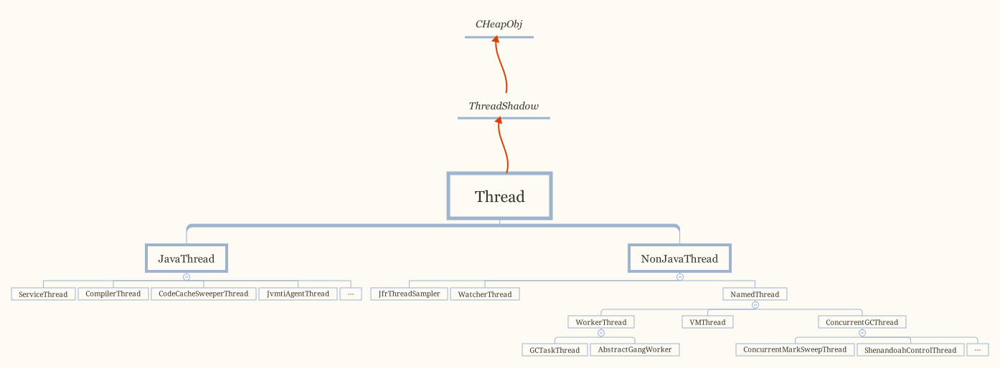

## Introduction


All Thread subclasses must be either JavaThread or NonJavaThread.


```
Thread execution sequence and actions:
All threads:
 - thread_native_entry  // per-OS native entry point
   - stack initialization
   - other OS-level initialization (signal masks etc)
   - handshake with creating thread (if not started suspended)
   - this->call_run()  // common shared entry point
     - shared common initialization
     - this->pre_run()  // virtual per-thread-type initialization
     - this->run()      // virtual per-thread-type "main" logic
     - shared common tear-down
     - this->post_run()  // virtual per-thread-type tear-down
     - // 'this' no longer referenceable
   - OS-level tear-down (minimal)
   - final logging

For JavaThread:
  - this->run()  // virtual but not normally overridden
    - this->thread_main_inner()  // extra call level to ensure correct stack calculations
      - this->entry_point()  // set differently for each kind of JavaThread
```


| **线程**                                       | **所属**     | **说明**                                                     |
| ---------------------------------------------- | ------------ | ------------------------------------------------------------ |
| Attach Listener                                | JVM          | Attach Listener线程是负责接收到外部的命令，而对该命令进行执行的并且吧结果返回给发送者。通常我们会用一些命令去要求jvm给我们一些反馈信息，如：java -version、jmap、jstack等等。如果该线程在jvm启动的时候没有初始化，那么，则会在用户第一次执行jvm命令时，得到启动。 |
| Signal Dispatcher                              | JVM          | 前面我们提到第一个Attach Listener线程的职责是接收外部jvm命令，当命令接收成功后，会交给signal dispather线程去进行分发到各个不同的模块处理命令，并且返回处理结果。signal dispather线程也是在第一次接收外部jvm命令时，进行初始化工作。 |
| CompilerThread0                                | JVM          | 用来调用JITing，实时编译装卸class。通常，jvm会启动多个线程来处理这部分工作，线程名称后面的数字也会累加，例如：CompilerThread1 |
| ConcurrentMark-SweepGCThread                   | JVM          | 并发标记清除垃圾回收器（就是通常所说的CMS GC）线程，该线程主要针对于老年代垃圾回收。ps：启用该垃圾回收器，需要在jvm启动参数中加上：-XX:+UseConcMarkSweepGC |
| DestroyJavaVM                                  | JVM          | 执行main()的线程在main执行完后调用JNI中的jni_DestroyJavaVM()方法唤起DestroyJavaVM线程。  JVM在Jboss服务器启动之后，就会唤起DestroyJavaVM线程，处于等待状态，等待其它线程（java线程和native线程）退出时通知它卸载JVM。线程退出时，都会判断自己当前是否是整个JVM中最后一个非deamon线程，如果是，则通知DestroyJavaVM线程卸载JVM。ps：扩展一下：1.如果线程退出时判断自己不为最后一个非deamon线程，那么调用thread->exit(false)，并在其中抛出thread_end事件，jvm不退出。2.如果线程退出时判断自己为最后一个非deamon线程，那么调用before_exit()方法，抛出两个事件： 事件1：thread_end线程结束事件、事件2：VM的death事件。然后调用thread->exit(true)方法，接下来把线程从active list卸下，删除线程等等一系列工作执行完成后，则通知正在等待的DestroyJavaVM线程执行卸载JVM操作。 |
| ContainerBackgroundProcessor                   | JBOSS        | 它是一个守护线程,在jboss服务器在启动的时候就初始化了,主要工作是定期去检查有没有Session过期.过期则清除.参考：http://liudeh-009.iteye.com/blog/1584876 |
| ConfigClientNotifier                           | ConfigServer | ConfigServer服务端当有配置变更时，就会将最新的配置推送到ConfigServer客户端的一个数据列队中，ConfigClientNotifier线程用于定期检查该数据列队中是否有数据，如果有数据，则将数据分发到订阅该数据的组件去做业务逻辑，比如：tair和hsf的数据都订阅了ConfigServer数据源,当ConfigClientNotifier线程发现数据有更新时，就触发做数据分发特定特定信号标识将数据分发到相应的订阅者。 |
| ConfigClientWorker-Default                     | ConfigServer | 包括主动向服务器端发送数据（主要是订阅和发布的数据）和接收服务器推送过来的数据（主要是订阅数据的值） 。 |
| Dispatcher-Thread-3                            | Log4j        | Log4j具有异步打印日志的功能，需要异步打印日志的Appender都需要注册到AsyncAppender对象里面去，由AsyncAppender进行监听，决定何时触发日志打印操作。AsyncAppender如果监听到它管辖范围内的Appender有打印日志的操作，则给这个Appender生成一个相应的event，并将该event保存在一个buffuer区域内。 Dispatcher-Thread-3线程负责判断这个event缓存区是否已经满了，如果已经满了，则将缓存区内的所有event分发到Appender容器里面去，那些注册上来的Appender收到自己的event后，则开始处理自己的日志打印工作。Dispatcher-Thread-3线程是一个守护线程。 |
| Finalizer线程                                  | JVM          | 这个线程也是在main线程之后创建的，其优先级为10，主要用于在垃圾收集前，调用对象的finalize()方法；关于Finalizer线程的几点：1)只有当开始一轮垃圾收集时，才会开始调用finalize()方法；因此并不是所有对象的finalize()方法都会被执行；2)该线程也是daemon线程，因此如果虚拟机中没有其他非daemon线程，不管该线程有没有执行完finalize()方法，JVM也会退出；3) JVM在垃圾收集时会将失去引用的对象包装成Finalizer对象（Reference的实现），并放入ReferenceQueue，由Finalizer线程来处理；最后将该Finalizer对象的引用置为null，由垃圾收集器来回收；4) JVM为什么要单独用一个线程来执行finalize()方法呢？如果JVM的垃圾收集线程自己来做，很有可能由于在finalize()方法中误操作导致GC线程停止或不可控，这对GC线程来说是一种灾难； |
| Gang worker#0                                  | JVM          | JVM用于做新生代垃圾回收（monir gc）的一个线程。#号后面是线程编号，例如：Gang worker#1 |
| GC Daemon                                      | JVM          | GC Daemon线程是JVM为RMI提供远程分布式GC使用的，GC Daemon线程里面会主动调用System.gc()方法，对服务器进行Full GC。 其初衷是当RMI服务器返回一个对象到其客户机（远程方法的调用方）时，其跟踪远程对象在客户机中的使用。当再没有更多的对客户机上远程对象的引用时，或者如果引用的“租借”过期并且没有更新，服务器将垃圾回收远程对象。不过，我们现在jvm启动参数都加上了-XX:+DisableExplicitGC配置，所以，这个线程只有打酱油的份了。 |
| IdleRemover                                    | JBOSS        | Jboss连接池有一个最小值，该线程每过一段时间都会被Jboss唤起，用于检查和销毁连接池中空闲和无效的连接，直到剩余的连接数小于等于它的最小值。 |
| Java2D Disposer                                | JVM          | 这个线程主要服务于awt的各个组件。说起该线程的主要工作职责前，需要先介绍一下Disposer类是干嘛的。Disposer提供一个addRecord方法。如果你想在一个对象被销毁前再做一些善后工作，那么，你可以调用Disposer#addRecord方法，将这个对象和一个自定义的DisposerRecord接口实现类，一起传入进去，进行注册。Disposer类会唤起“Java2D Disposer”线程，该线程会扫描已注册的这些对象是否要被回收了，如果是，则调用该对象对应的DisposerRecord实现类里面的dispose方法。Disposer实际上不限于在awt应用场景，只是awt里面的很多组件需要访问很多操作系统资源，所以，这些组件在被回收时，需要先释放这些资源。 |
| FelixDispatchQueue                             | Sofa         | 该线程会在sofa启动时会唤起该线程,该线程用于分发OSGI事件到Declarative Services 中去发布，查找，绑定目标服务。其实，我们接口配置的service和reference就涉及到服务的发布、查找和绑定工作。  Declarative Services 主要工作职责是方便地对服务之间的依赖关系和状态进行监听和管理。OSGI使用事件策略去调用Declarative Services中的服务。 |
| InsttoolCacheScheduler_QuartzSchedulerThread   | Quartz       | InsttoolCacheScheduler_QuartzSchedulerThread是Quartz的主线程，它主要负责实时的获取下一个时间点要触发的触发器，然后执行触发器相关联的作业。原理大致如下：Spring和Quartz结合使用的场景下，Spring IOC容器初始化时会创建并初始化Quartz线程池（TreadPool），并启动它。刚启动时线程池中每个线程都处于等待状态，等待外界给他分配Runnable（持有作业对象的线程）。继而接着初始化并启动Quartz的主线程（InsttoolCacheScheduler_QuartzSchedulerThread），该线程自启动后就会处于等待状态。等待外界给出工作信号之后，该主线程的run方法才实质上开始工作。run中会获取JobStore中下一次要触发的作业，拿到之后会一直等待到该作业的真正触发时间，然后将该作业包装成一个JobRunShell对象（该对象实现了Runnable接口，其实看是上面TreadPool中等待外界分配给他的Runnable），然后将刚创建的JobRunShell交给线程池，由线程池负责执行作业。线程池收到Runnable后，从线程池一个线程启动Runnable，反射调用JobRunShell中的run方法，run方法执行完成之后，TreadPool将该线程回收至空闲线程中。 |
| InsttoolCacheScheduler_Worker-2                | Quartz       | InsttoolCacheScheduler_Worker-2线程就是ThreadPool线程的一个简单实现，它主要负责分配线程资源去执行InsttoolCacheScheduler_QuartzSchedulerThread线程交给它的调度任务（也就是JobRunShell）。 |
| java.util.concurrent.ThreadPoolExecutor$Worker | JVM          |                                                              |
| JBossLifeThread                                | Jboss        | Jboss主线程启动成功，应用程序部署完毕之后将JBossLifeThread线程实例化并且start，JBossLifeThread线程启动成功之后就处于等待状态，以保持Jboss Java进程处于存活中。 所得比较通俗一点，就是Jboss启动流程执行完毕之后，为什么没有结束？就是因为有这个线程hold主了它。牛b吧～～ |
| JBoss System Threads(1)-1                      | Jboss        | 该线程是一个socket服务，默认端口号为：1099。主要用于接收外部naming service（Jboss JNDI）请求。 |
| JCA PoolFiller                                 | Jboss        | 该线程主要为JBoss内部提供连接池的托管。 简单介绍一下工作原理 ：Jboss内部凡是有远程连接需求的类，都需要实现ManagedConnectionFactory接口，例如需要做JDBC连接的XAManagedConnectionFactory对象，就实现了该接口。然后将XAManagedConnectionFactory对象，还有其它信息一起包装到InternalManagedConnectionPool对象里面，接着将InternalManagedConnectionPool交给PoolFiller对象里面的列队进行管理。  JCA PoolFiller线程会定期判断列队内是否有需要创建和管理的InternalManagedConnectionPool对象，如果有的话，则调用该对象的fillToMin方法，触发它去创建相应的远程连接，并且将这个连接维护到它相应的连接池里面去。 |
| JDWP Event Helper Thread                       | JVM          | JDWP是通讯交互协议，它定义了调试器和被调试程序之间传递信息的格式。它详细完整地定义了请求命令、回应数据和错误代码，保证了前端和后端的JVMTI和JDI的通信通畅。 该线程主要负责将JDI事件映射成JVMTI信号，以达到调试过程中操作JVM的目的。 |
| JDWP TransportListener: dt_socket              | JVM          | 该线程是一个Java Debugger的监听器线程，负责受理客户端的debug请求。通常我们习惯将它的监听端口设置为8787。 |
| Low MemoryDetector                             | JVM          | 这个线程是负责对可使用内存进行检测，如果发现可用内存低，分配新的内存空间。 |
| process reaper                                 | JVM          | 该线程负责去执行一个OS命令行的操作。                         |
| Reference Handler                              | JVM          | JVM在创建main线程后就创建Reference Handler线程，其优先级最高，为10，它主要用于处理引用对象本身（软引用、弱引用、虚引用）的垃圾回收问题。 |
| SurrogateLockerThread(CMS)                     | JVM          | 这个线程主要用于配合CMS垃圾回收器使用，它是一个守护线程，其主要负责处理GC过程中，Java层的Reference（指软引用、弱引用等等）与jvm内部层面的对象状态同步。这里对它们的实现稍微做一下介绍：这里拿WeakHashMap做例子，将一些关键点先列出来（我们后面会将这些关键点全部串起来）：1.   我们知道HashMap用Entry[]数组来存储数据的，WeakHashMap也不例外,内部有一个Entry[]数组。2.    WeakHashMap的Entry比较特殊，它的继承体系结构为Entry->WeakReference->Reference。3.   Reference里面有一个全局锁对象：Lock，它也被称为pending_lock.  注意：它是静态对象。4.   Reference 里面有一个静态变量：pending。5. Reference 里面有一个静态内部类：ReferenceHandler的线程，它在static块里面被初始化并且启动，启动完成后处于wait状态，它在一个Lock同步锁模块中等待。6.   另外，WeakHashMap里面还实例化了一个ReferenceQueue列队，这个列队的作用，后面会提到。7.   上面关键点就介绍完毕了，下面我们把他们串起来。  假设，WeakHashMap对象里面已经保存了很多对象的引用。JVM在进行CMS GC的时候，会创建一个ConcurrentMarkSweepThread（简称CMST）线程去进行GC，ConcurrentMarkSweepThread线程被创建的同时会创建一个SurrogateLockerThread（简称SLT）线程并且启动它，SLT启动之后，处于等待阶段。CMST开始GC时，会发一个消息给SLT让它去获取Java层Reference对象的全局锁：Lock。直到CMS GC完毕之后，JVM会将WeakHashMap中所有被回收的对象所属的WeakReference容器对象放入到Reference的pending属性当中（每次GC完毕之后，pending属性基本上都不会为null了），然后通知SLT释放并且notify全局锁:Lock。此时激活了ReferenceHandler线程的run方法，使其脱离wait状态，开始工作了。ReferenceHandler这个线程会将pending中的所有WeakReference对象都移动到它们各自的列队当中，比如当前这个WeakReference属于某个WeakHashMap对象，那么它就会被放入相应的ReferenceQueue列队里面（该列队是链表结构）。当我们下次从WeakHashMap对象里面get、put数据或者调用size方法的时候，WeakHashMap就会将ReferenceQueue列队中的WeakReference依依poll出来去和Entry[]数据做比较，如果发现相同的，则说明这个Entry所保存的对象已经被GC掉了，那么将Entry[]内的Entry对象剔除掉。 |
| taskObjectTimerFactory                         | JVM          | 顾名思义，该线程就是用来执行任务的。当我们把一个任务交给Timer对象，并且告诉它执行时间，周期时间后，Timer就会将该任务放入任务列队，并且通知taskObjectTimerFactory线程去处理任务，taskObjectTimerFactory线程会将状态为取消的任务从任务列队中移除，如果任务是非重复执行类型的，则在执行完该任务后，将它从任务列队中移除，如果该任务是需要重复执行的，则计算出它下一次执行的时间点。 |
| VM Periodic Task Thread                        | JVM          | 该线程是JVM周期性任务调度的线程，它由WatcherThread创建，是一个单例对象。该线程在JVM内使用得比较频繁，比如：定期的内存监控、JVM运行状况监控，还有我们经常需要去执行一些jstat这类命令查看gc的情况，如下：jstat -gcutil 23483 250 7 这个命令告诉jvm在控制台打印PID为：23483的gc情况，间隔250毫秒打印一次，一共打印7次。 |
| VM Thread                                      | JVM          | 这个线程就比较牛b了，是jvm里面的线程母体，根据hotspot源码（vmThread.hpp）里面的注释，它是一个单例的对象（最原始的线程）会产生或触发所有其他的线程，这个单个的VM线程是会被其他线程所使用来做一些VM操作（如，清扫垃圾等）。在 VMThread的结构体里有一个VMOperationQueue列队，所有的VM线程操作(vm_operation)都会被保存到这个列队当中，VMThread本身就是一个线程，它的线程负责执行一个自轮询的loop函数(具体可以参考：VMThread.cpp里面的void VMThread::loop())，该loop函数从VMOperationQueue列队中按照优先级取出当前需要执行的操作对象(VM_Operation)，并且调用VM_Operation->evaluate函数去执行该操作类型本身的业务逻辑。ps：VM操作类型被定义在vm_operations.hpp文件内，列举几个：ThreadStop、ThreadDump、PrintThreads、GenCollectFull、GenCollectFullConcurrent、CMS_Initial_Mark、CMS_Final_Remark…..有兴趣的同学，可以自己去查看源文件。 |


## Stack

```
StackRedPages                             = 1   
StackShadowPages                          = 20  
StackTraceInThrowable                     = true
StackYellowPages                          = 2   
```

### frame
vframes are virtual stack frames representing source level activations.
A single frame may hold several source level activations in the case of optimized code. 
The debugging stored with the optimized code enables us to unfold a frame as a stack of vframes.

A cVFrame represents an activation of a non-java method.

The vframe inheritance hierarchy:
- vframe
    - javaVFrame
        - interpretedVFrame
        - compiledVFrame     ; (used for both compiled Java methods and native stubs)
    - externalVFrame
        - entryVFrame        ; special frame created when calling Java from C
    - BasicLock
```cpp
// vframe.hpp
class vframe: public ResourceObj {
 protected:
  frame        _fr;      // Raw frame behind the virtual frame.
  RegisterMap  _reg_map; // Register map for the raw frame (used to handle callee-saved registers).
  JavaThread*  _thread;  // The thread owning the raw frame.
}
```


A frame represents a physical stack frame (an activation).  
Frames can be C or Java frames, and the Java frames can be interpreted or compiled.  

In contrast, vframes represent source-level activations,
so that one physical frame can correspond to multiple source level frames because of inlining.

```cpp
// frame.hpp
class frame {
 private:
  // Instance variables:
  intptr_t* _sp; // stack pointer (from Thread::last_Java_sp)
  address   _pc; // program counter (the next instruction after the call)

  CodeBlob* _cb; // CodeBlob that "owns" pc
  enum deopt_state {
    not_deoptimized,
    is_deoptimized,
    unknown
  };

  deopt_state _deopt_state;
  
```

CPU_HEADER associate to `frame_<CPU_arch>.hpp`, such as frame_x86.hpp
```
#include CPU_HEADER(frame)
}
```


```cpp
// frame.hpp
void oops_do(OopClosure* f, CodeBlobClosure* cf, RegisterMap* map) { oops_do_internal(f, cf, map, true); }

// frame.cpp
void frame::oops_do_internal(OopClosure* f, CodeBlobClosure* cf, RegisterMap* map, bool use_interpreter_oop_map_cache) {
#ifndef PRODUCT
#if defined(__SUNPRO_CC) && __SUNPRO_CC >= 0x5140
#pragma error_messages(off, SEC_NULL_PTR_DEREF)
#endif
  // simulate GC crash here to dump java thread in error report
  if (CrashGCForDumpingJavaThread) {
    char *t = NULL;
    *t = 'c';
  }
#endif
  if (is_interpreted_frame()) {
    oops_interpreted_do(f, map, use_interpreter_oop_map_cache);
  } else if (is_entry_frame()) {    // call_stub
    oops_entry_do(f, map);
  } else if (CodeCache::contains(pc())) {
    oops_code_blob_do(f, cf, map);
  } else {
    ShouldNotReachHere();
  }
}
```


## JavaThread

see [java.lang.Thread](/docs/CS/Java/JDK/Concurrency/Thread.md)
```cpp
// thread.hpp
class JavaThread: public Thread {
 private:
  bool           _on_thread_list;                // Is set when this JavaThread is added to the Threads list
  OopHandle      _threadObj;                     // The Java level thread object

}

// share/classfile/javaclasses.cpp
JavaThread* java_lang_Thread::thread(oop java_thread) {
  return (JavaThread*)java_thread->address_field(_eetop_offset);
}
```


## vmOperations

```cpp
// vmOperations.hpp
class VM_Operation: public CHeapObj<mtInternal> {
 public:
  enum Mode {
    _safepoint,       // blocking,        safepoint, vm_op C-heap allocated
    _no_safepoint,    // blocking,     no safepoint, vm_op C-Heap allocated
    _concurrent,      // non-blocking, no safepoint, vm_op C-Heap allocated
    _async_safepoint  // non-blocking,    safepoint, vm_op C-Heap allocated
  };

  enum VMOp_Type {
    VM_OPS_DO(VM_OP_ENUM)
    VMOp_Terminating
  };

 private:
  Thread*         _calling_thread;
  ThreadPriority  _priority;
  long            _timestamp;
  VM_Operation*   _next;
  VM_Operation*   _prev;

  // The VM operation name array
  static const char* _names[];
  
}
```


## VMThread

### VMThread::run
```cpp

void VMThread::run() {
  // Notify_lock wait checks on is_running() to rewait in case of spurious wakeup, it should wait on the last value set prior to the notify
  Atomic::store(&_is_running, true);

  {
    MutexLocker ml(Notify_lock);
    Notify_lock->notify();
  }
```
Notify_lock is destroyed by [Threads::create_vm()](/docs/CS/Java/JDK/JVM/start.md?id=create_vm)
```cpp
  int prio = (VMThreadPriority == -1)
    ? os::java_to_os_priority[NearMaxPriority]
    : VMThreadPriority;
  // Note that I cannot call os::set_priority because it expects Java
  // priorities and I am *explicitly* using OS priorities so that it's
  // possible to set the VM thread priority higher than any Java thread.
  os::set_native_priority( this, prio );
```
Wait for VM_Operations until termination
```
  this->loop();
```
Note the intention to exit before safepointing. 

This has the effect of waiting for any large tty outputs to finish.
```cpp
  if (xtty != NULL) {
    ttyLocker ttyl;
    xtty->begin_elem("destroy_vm");
    xtty->stamp();
    xtty->end_elem();
    assert(should_terminate(), "termination flag must be set");
  }

```
let VM thread exit at [Safepoint](/docs/CS/Java/JDK/JVM/Safepoint.md?id=begin)
```cpp
  _cur_vm_operation = &halt_op;
  SafepointSynchronize::begin();

  if (VerifyBeforeExit) {
    HandleMark hm(VMThread::vm_thread());
    // Among other things, this ensures that Eden top is correct.
    Universe::heap()->prepare_for_verify();
    // Silent verification so as not to pollute normal output,
    // unless we really asked for it.
    Universe::verify();
  }

  CompileBroker::set_should_block();

  // wait for threads (compiler threads or daemon threads) in the
  // _thread_in_native state to block.
  VM_Exit::wait_for_threads_in_native_to_block();

  // The ObjectMonitor subsystem uses perf counters so do this before
  // we signal that the VM thread is gone. We don't want to run afoul
  // of perfMemory_exit() in exit_globals().
  ObjectSynchronizer::do_final_audit_and_print_stats();

  // signal other threads that VM process is gone
  {
    // Note: we must have the _no_safepoint_check_flag. Mutex::lock() allows
    // VM thread to enter any lock at Safepoint as long as its _owner is NULL.
    // If that happens after _terminate_lock->wait() has unset _owner
    // but before it actually drops the lock and waits, the notification below
    // may get lost and we will have a hang. To avoid this, we need to use
    // Mutex::lock_without_safepoint_check().
    MonitorLocker ml(_terminate_lock, Mutex::_no_safepoint_check_flag);
    _terminated = true;
    ml.notify();
  }

  // We are now racing with the VM termination being carried out in
  // another thread, so we don't "delete this". Numerous threads don't
  // get deleted when the VM terminates

}
```

#### loop

```cpp
void VMThread::loop() {
  assert(_cur_vm_operation == NULL, "no current one should be executing");

  SafepointSynchronize::init(_vm_thread);

  // Need to set a calling thread for ops not passed
  // via the normal way.
  cleanup_op.set_calling_thread(_vm_thread);
  safepointALot_op.set_calling_thread(_vm_thread);

  while (true) {
    if (should_terminate()) break;
    wait_for_operation();
    if (should_terminate()) break;
    assert(_next_vm_operation != NULL, "Must have one");
```
call inner_execute
```cpp
    inner_execute(_next_vm_operation);
  }
}
```

### inner_execute

```cpp

void VMThread::inner_execute(VM_Operation* op) {
  assert(Thread::current()->is_VM_thread(), "Must be the VM thread");

  VM_Operation* prev_vm_operation = NULL;
  if (_cur_vm_operation != NULL) {
    // Check that the VM operation allows nested VM operation.
    // This is normally not the case, e.g., the compiler
    // does not allow nested scavenges or compiles.
    if (!_cur_vm_operation->allow_nested_vm_operations()) {
      fatal("Unexpected nested VM operation %s requested by operation %s",
            op->name(), _cur_vm_operation->name());
    }
    op->set_calling_thread(_cur_vm_operation->calling_thread());
    prev_vm_operation = _cur_vm_operation;
  }

  _cur_vm_operation = op;

  HandleMark hm(VMThread::vm_thread());
  EventMarkVMOperation em("Executing %sVM operation: %s", prev_vm_operation != NULL ? "nested " : "", op->name());

```
if is_at_safepoint, **evaluate_operation** between [SafepointSynchronize::begin()](/docs/CS/Java/JDK/JVM/Safepoint.md?id=begin) 
and [SafepointSynchronize::end()](/docs/CS/Java/JDK/JVM/Safepoint.md?id=end)
```cpp
  log_debug(vmthread)("Evaluating %s %s VM operation: %s",
                       prev_vm_operation != NULL ? "nested" : "",
                      _cur_vm_operation->evaluate_at_safepoint() ? "safepoint" : "non-safepoint",
                      _cur_vm_operation->name());

  bool end_safepoint = false;
  bool has_timeout_task = (_timeout_task != nullptr);
  if (_cur_vm_operation->evaluate_at_safepoint() &&
      !SafepointSynchronize::is_at_safepoint()) {
    SafepointSynchronize::begin();
    if (has_timeout_task) {
      _timeout_task->arm(_cur_vm_operation->name());
    }
    end_safepoint = true;
  }

  evaluate_operation(_cur_vm_operation);

  if (end_safepoint) {
    if (has_timeout_task) {
      _timeout_task->disarm();
    }
    SafepointSynchronize::end();
  }

  _cur_vm_operation = prev_vm_operation;
}
```

#### evaluate_operation

```cpp
void VMThread::evaluate_operation(VM_Operation* op) {
  ResourceMark rm;

  {
    PerfTraceTime vm_op_timer(perf_accumulated_vm_operation_time());
    HOTSPOT_VMOPS_BEGIN(
                     (char *) op->name(), strlen(op->name()),
                     op->evaluate_at_safepoint() ? 0 : 1);

    EventExecuteVMOperation event;
    op->evaluate();
    if (event.should_commit()) {
      post_vm_operation_event(&event, op);
    }

    HOTSPOT_VMOPS_END(
                     (char *) op->name(), strlen(op->name()),
                     op->evaluate_at_safepoint() ? 0 : 1);
  }

}```

## CompilerThread

### compilation_init_phase1
Initialize the Compilation object
```cpp
void CompileBroker::compilation_init_phase1(JavaThread* THREAD) {
  // No need to initialize compilation system if we do not use it.
  if (!UseCompiler) {
    return;
  }
  // Set the interface to the current compiler(s).
  _c1_count = CompilationPolicy::c1_count();
  _c2_count = CompilationPolicy::c2_count();

#if INCLUDE_JVMCI
  if (EnableJVMCI) {
```
This is creating a JVMCICompiler singleton.
```cpp
    JVMCICompiler* jvmci = new JVMCICompiler();

    if (UseJVMCICompiler) {
      _compilers[1] = jvmci;
      if (FLAG_IS_DEFAULT(JVMCIThreads)) {
        if (BootstrapJVMCI) {
          // JVMCI will bootstrap so give it more threads
          _c2_count = MIN2(32, os::active_processor_count());
        }
      } else {
        _c2_count = JVMCIThreads;
      }
      if (FLAG_IS_DEFAULT(JVMCIHostThreads)) {
      } else {
#ifdef COMPILER1
        _c1_count = JVMCIHostThreads;
#endif // COMPILER1
      }
    }
  }
#endif // INCLUDE_JVMCI

#ifdef COMPILER1
  if (_c1_count > 0) {
    _compilers[0] = new Compiler();
  }
#endif // COMPILER1

#ifdef COMPILER2
  if (true JVMCI_ONLY( && !UseJVMCICompiler)) {
    if (_c2_count > 0) {
      _compilers[1] = new C2Compiler();
      // Register c2 first as c2 CompilerPhaseType idToPhase mapping is explicit.
      // idToPhase mapping for c2 is in opto/phasetype.hpp
      JFR_ONLY(register_jfr_phasetype_serializer(compiler_c2);)
    }
  }
#endif // COMPILER2

#if INCLUDE_JVMCI
   // Register after c2 registration.
   // JVMCI CompilerPhaseType idToPhase mapping is dynamic.
   if (EnableJVMCI) {
     JFR_ONLY(register_jfr_phasetype_serializer(compiler_jvmci);)
   }
#endif // INCLUDE_JVMCI

  // Start the compiler thread(s) and the sweeper thread
  init_compiler_sweeper_threads();
  // totalTime performance counter is always created as it is required
  // by the implementation of java.lang.management.CompilationMXBean.
  {
    // Ensure OOM leads to vm_exit_during_initialization.
    EXCEPTION_MARK;
    _perf_total_compilation =
                 PerfDataManager::create_counter(JAVA_CI, "totalTime",
                                                 PerfData::U_Ticks, CHECK);
  }

  if (UsePerfData) {

    EXCEPTION_MARK;

    // create the jvmstat performance counters
    _perf_osr_compilation =
                 PerfDataManager::create_counter(SUN_CI, "osrTime",
                                                 PerfData::U_Ticks, CHECK);

    _perf_standard_compilation =
                 PerfDataManager::create_counter(SUN_CI, "standardTime",
                                                 PerfData::U_Ticks, CHECK);

    _perf_total_bailout_count =
                 PerfDataManager::create_counter(SUN_CI, "totalBailouts",
                                                 PerfData::U_Events, CHECK);

    _perf_total_invalidated_count =
                 PerfDataManager::create_counter(SUN_CI, "totalInvalidates",
                                                 PerfData::U_Events, CHECK);

    _perf_total_compile_count =
                 PerfDataManager::create_counter(SUN_CI, "totalCompiles",
                                                 PerfData::U_Events, CHECK);
    _perf_total_osr_compile_count =
                 PerfDataManager::create_counter(SUN_CI, "osrCompiles",
                                                 PerfData::U_Events, CHECK);

    _perf_total_standard_compile_count =
                 PerfDataManager::create_counter(SUN_CI, "standardCompiles",
                                                 PerfData::U_Events, CHECK);

    _perf_sum_osr_bytes_compiled =
                 PerfDataManager::create_counter(SUN_CI, "osrBytes",
                                                 PerfData::U_Bytes, CHECK);

    _perf_sum_standard_bytes_compiled =
                 PerfDataManager::create_counter(SUN_CI, "standardBytes",
                                                 PerfData::U_Bytes, CHECK);

    _perf_sum_nmethod_size =
                 PerfDataManager::create_counter(SUN_CI, "nmethodSize",
                                                 PerfData::U_Bytes, CHECK);

    _perf_sum_nmethod_code_size =
                 PerfDataManager::create_counter(SUN_CI, "nmethodCodeSize",
                                                 PerfData::U_Bytes, CHECK);

    _perf_last_method =
                 PerfDataManager::create_string_variable(SUN_CI, "lastMethod",
                                       CompilerCounters::cmname_buffer_length,
                                       "", CHECK);

    _perf_last_failed_method =
            PerfDataManager::create_string_variable(SUN_CI, "lastFailedMethod",
                                       CompilerCounters::cmname_buffer_length,
                                       "", CHECK);

    _perf_last_invalidated_method =
        PerfDataManager::create_string_variable(SUN_CI, "lastInvalidatedMethod",
                                     CompilerCounters::cmname_buffer_length,
                                     "", CHECK);

    _perf_last_compile_type =
             PerfDataManager::create_variable(SUN_CI, "lastType",
                                              PerfData::U_None,
                                              (jlong)CompileBroker::no_compile,
                                              CHECK);

    _perf_last_compile_size =
             PerfDataManager::create_variable(SUN_CI, "lastSize",
                                              PerfData::U_Bytes,
                                              (jlong)CompileBroker::no_compile,
                                              CHECK);


    _perf_last_failed_type =
             PerfDataManager::create_variable(SUN_CI, "lastFailedType",
                                              PerfData::U_None,
                                              (jlong)CompileBroker::no_compile,
                                              CHECK);

    _perf_last_invalidated_type =
         PerfDataManager::create_variable(SUN_CI, "lastInvalidatedType",
                                          PerfData::U_None,
                                          (jlong)CompileBroker::no_compile,
                                          CHECK);
  }
}
```

## ServiceThread
### ServiceThread::initialize


## MonitorDeflationThread
### MonitorDeflationThread::initialize


## Links
- [JVM](/docs/CS/Java/JDK/JVM/JVM.md)
- [Thread](/docs/CS/Java/JDK/Concurrency/Thread.md)

## References

1. [JVM 内部运行线程介绍](https://ifeve.com/jvm-thread/)